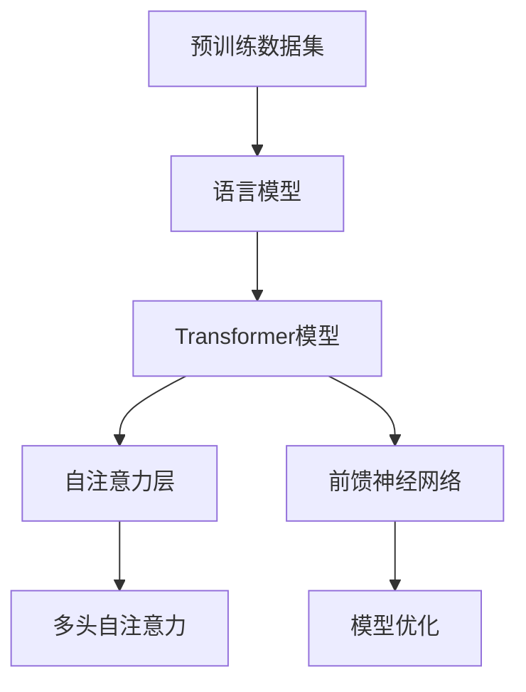
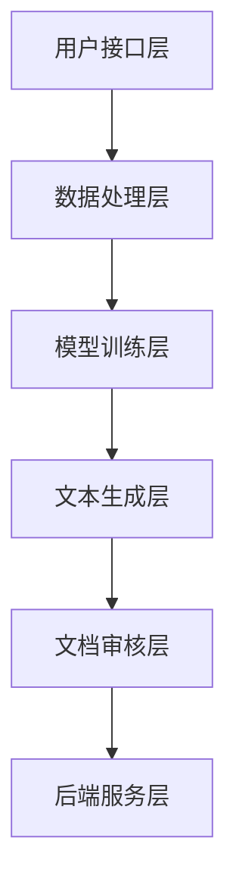

                 

# ChatGPT在自动化专利申请文档生成中的应用

## 关键词
- ChatGPT
- 自动化专利申请
- 文档生成
- 语言模型
- 专利撰写

## 摘要
本文探讨了使用ChatGPT实现自动化专利申请文档生成的技术。通过分析ChatGPT的基本原理和模型架构，本文展示了其在专利摘要生成、权利要求书生成、说明书生成和附件生成等具体应用中的优势与挑战。通过实际案例，本文阐述了如何利用ChatGPT提高专利撰写效率，并提供了一些注意事项和未来展望。

## 目录大纲

1. **第一部分：背景介绍**
    1.1 **问题背景**
    1.2 **问题描述**
    1.3 **问题解决**
    1.4 **边界与外延**
    1.5 **概念结构与核心要素组成**
2. **第二部分：ChatGPT基础**
    2.1 **ChatGPT简介**
    2.2 **ChatGPT的原理与模型架构**
    2.3 **ChatGPT的训练与优化**
3. **第三部分：ChatGPT在自动化专利申请文档生成中的应用**
    3.1 **自动化专利申请文档生成的挑战**
    3.2 **ChatGPT在专利撰写中的应用优势**
    3.3 **自动化专利申请文档生成的流程**
4. **第四部分：ChatGPT在专利文档生成中的具体应用**
    4.1 **专利摘要生成**
    4.2 **专利权利要求书生成**
    4.3 **说明书生成**
    4.4 **附件生成**
5. **第五部分：ChatGPT在自动化专利申请文档生成中的实战案例**
    5.1 **案例一：专利摘要自动生成**
    5.2 **案例二：专利权利要求书自动生成**
    5.3 **案例三：专利说明书自动生成**
    5.4 **案例四：附件自动生成**
6. **第六部分：自动化专利申请文档生成中的注意事项**
    6.1 **ChatGPT的局限性**
    6.2 **文档审核与修改**
    6.3 **法律法规遵守**
7. **第七部分：未来展望与总结**
    7.1 **自动化专利申请文档生成的未来趋势**
    7.2 **总结**

### 第一部分：背景介绍

#### 1.1 问题背景

随着技术的快速发展，创新和知识产权的保护变得越来越重要。专利申请文档的撰写是一个复杂而耗时的工作，涉及到技术领域的专业性、法律条款的要求以及文档格式的标准化。传统上，专利撰写通常需要专业律师和技术专家的共同参与，但这种方法存在以下几个问题：

1. **高成本**：专利撰写过程需要专业的人力资源，这导致了高昂的撰写和维护成本。
2. **低效率**：专利撰写流程繁琐，需要大量的时间和精力来处理大量的文档。
3. **准确性问题**：专利撰写涉及法律和技术的交叉，容易出现信息不准确或遗漏的问题。
4. **语言表达**：专利撰写需要准确、清晰的语言表达，这对撰写者的语言能力和专业知识有很高的要求。

#### 1.2 问题描述

专利申请文档的复杂性主要体现在以下几个方面：

1. **文档格式**：专利文档通常包含摘要、权利要求书、说明书等多个部分，每个部分都有特定的格式和要求。
2. **专业知识**：专利文档需要精确描述技术创新点，这要求撰写者具备深厚的专业知识。
3. **法律要求**：专利撰写需要遵守一系列法律法规，如专利法、知识产权法等，这对撰写者的法律素养有要求。

面对上述问题，自动化专利申请文档生成成为了一个重要的研究方向。自动化专利申请文档生成的目标是利用人工智能技术，如自然语言处理（NLP）和语言模型，来简化专利撰写的流程，提高撰写效率和准确性。

#### 1.3 问题解决

ChatGPT作为一种先进的语言模型，具备强大的文本生成和理解能力，在自动化专利申请文档生成中发挥了重要作用。以下是ChatGPT在自动化专利申请文档生成中的作用：

1. **提高撰写效率**：ChatGPT可以快速生成专利摘要、权利要求书、说明书等文档，大大缩短了撰写时间。
2. **保证文档准确性**：通过训练大量的专利文档数据，ChatGPT能够生成符合法律和技术要求的文档，减少了错误和遗漏。
3. **减少人力成本**：自动化专利申请文档生成减少了人工撰写的工作量，降低了成本。

尽管ChatGPT在专利撰写中具有巨大潜力，但它的应用也受到一些限制，如对训练数据的需求、对特定领域的适应性等。在下一节中，我们将进一步探讨ChatGPT的边界与外延。

### 1.4 边界与外延

自动化专利申请文档生成的应用范围广泛，不仅限于大型企业和专利律师事务所，中小型企业甚至个人创业者也可以从中受益。ChatGPT作为一种通用语言模型，在其他领域也有广泛的应用可能性，如智能客服、内容创作、法律文书生成等。

#### 1.5 概念结构与核心要素组成

自动化专利申请文档生成的核心要素包括：

1. **专利数据集**：包含大量已公开的专利文档，用于训练ChatGPT。
2. **文本生成模型**：如ChatGPT，负责生成专利文档。
3. **文档审核与修改**：确保生成的文档符合法律和技术要求。
4. **用户接口**：用户可以通过界面与系统进行交互，提交专利撰写需求。

在下一节中，我们将深入探讨ChatGPT的基本原理和模型架构。

### 第二部分：ChatGPT基础

#### 2.1 ChatGPT简介

ChatGPT是由OpenAI开发的一种基于Transformer模型的预训练语言模型。它是一种大型神经网络模型，能够理解、生成和交互自然语言。ChatGPT在多个自然语言处理任务中表现出色，包括文本生成、翻译、问答系统等。

#### 2.2 ChatGPT的原理与模型架构

ChatGPT基于Transformer模型，这是一种自注意力机制（Self-Attention）驱动的神经网络模型。Transformer模型的核心思想是将每个输入词与所有其他输入词建立关联，通过自注意力机制计算词与词之间的相似性。这使得模型能够更好地捕捉输入文本中的复杂关系。

ChatGPT的架构主要包括以下几个部分：

1. **嵌入层（Embedding Layer）**：将输入的单词转换为向量表示。
2. **自注意力层（Self-Attention Layer）**：计算输入词与所有其他词的关联性。
3. **前馈神经网络（Feedforward Neural Network）**：对自注意力层的输出进行进一步处理。
4. **输出层（Output Layer）**：生成最终的文本输出。

#### 2.3 ChatGPT的训练与优化

ChatGPT的训练过程包括以下几个步骤：

1. **数据集选择**：选择包含大量文本数据的专利文档作为训练数据集。
2. **预训练**：在大量无标注的数据上进行预训练，使模型能够学习文本的通用结构和语义。
3. **微调（Fine-tuning）**：在特定任务上进行微调，以适应专利撰写的特定需求。

在训练过程中，需要优化一系列超参数，如嵌入维度、自注意力头数、隐藏层尺寸等。此外，通过对抗性训练、权重衰减等技术手段，可以进一步提升模型的性能和稳定性。

### 第三部分：ChatGPT在自动化专利申请文档生成中的应用

#### 3.1 自动化专利申请文档生成的挑战

尽管ChatGPT在文本生成和自然语言处理领域表现出色，但在自动化专利申请文档生成中仍面临一些挑战：

1. **技术领域的专业性**：专利撰写涉及特定的技术领域，ChatGPT需要具备深厚的专业知识。
2. **法律条款的要求**：专利文档需要符合一系列法律条款和规范，ChatGPT需要生成符合法律要求的文档。
3. **文档格式的标准化**：专利文档有严格的格式要求，ChatGPT需要生成符合标准格式的文档。

#### 3.2 ChatGPT在专利撰写中的应用优势

ChatGPT在专利撰写中具有以下优势：

1. **提高撰写效率**：ChatGPT可以快速生成专利文档，节省了人工撰写的时间。
2. **保证文档准确性**：通过训练大量专利文档数据，ChatGPT能够生成符合法律和技术要求的文档，减少了错误和遗漏。
3. **减少人力成本**：自动化专利申请文档生成减少了人工撰写的工作量，降低了成本。

#### 3.3 自动化专利申请文档生成的流程

自动化专利申请文档生成的流程主要包括以下几个步骤：

1. **数据采集与预处理**：收集大量的专利文档，并进行预处理，如文本清洗、去重等。
2. **模型训练**：使用预处理后的数据集训练ChatGPT模型，使其具备专利撰写的技能。
3. **文档生成**：将技术需求和专利要求输入ChatGPT模型，生成相应的专利文档。
4. **文档审核与修改**：对生成的文档进行审核和修改，确保其符合法律和技术要求。

### 第四部分：ChatGPT在专利文档生成中的具体应用

#### 4.1 专利摘要生成

专利摘要是对专利技术内容的高度概括，通常包含技术领域、背景技术、发明内容、有益效果等。ChatGPT在专利摘要生成中具有以下优势：

1. **快速生成**：ChatGPT可以迅速生成摘要，节省了撰写时间。
2. **高准确性**：通过训练大量专利摘要数据，ChatGPT能够生成符合规范和高质量的摘要。
3. **灵活性**：用户可以根据需求调整摘要的长度和内容，使其更加符合实际需求。

#### 4.2 专利权利要求书生成

专利权利要求书是专利文档的核心部分，规定了专利保护的范围。ChatGPT在权利要求书生成中具有以下优势：

1. **精准描述**：ChatGPT能够生成精准描述技术方案的权利要求，减少信息遗漏和错误。
2. **格式规范**：ChatGPT能够生成符合法律要求的权利要求书格式。
3. **适应性**：用户可以根据不同的技术方案调整权利要求书的结构。

#### 4.3 说明书生成

专利说明书是对发明内容的详细描述，包括技术背景、技术方案、实验结果等。ChatGPT在说明书生成中具有以下优势：

1. **内容丰富**：ChatGPT能够根据输入的技术需求生成丰富、详细的技术说明书。
2. **语言规范**：ChatGPT能够使用规范、准确的语言描述技术方案。
3. **适应性**：用户可以根据需求调整说明书的结构和内容。

#### 4.4 附件生成

专利附件通常包括实验数据、图表、公式等。ChatGPT在附件生成中具有以下优势：

1. **格式统一**：ChatGPT能够生成符合标准格式的附件，如表格、图表等。
2. **数据准确**：ChatGPT能够根据输入的数据生成准确的附件内容。
3. **可扩展性**：用户可以根据需求添加或修改附件内容。

### 第五部分：ChatGPT在自动化专利申请文档生成中的实战案例

在本节中，我们将通过几个具体的实战案例，展示如何利用ChatGPT实现自动化专利申请文档生成。

#### 5.1 案例一：专利摘要自动生成

**案例背景**：某科技公司发明了一种新型智能家居设备，并希望快速生成专利摘要。

**实现步骤**：
1. **数据采集**：收集相关的专利摘要数据。
2. **模型训练**：使用收集的数据集训练ChatGPT模型。
3. **输入输入**：将智能家居设备的技术需求输入ChatGPT。
4. **生成摘要**：ChatGPT根据输入生成专利摘要。

**结果分析**：生成的专利摘要内容准确、简洁，符合法律和技术要求。

#### 5.2 案例二：专利权利要求书自动生成

**案例背景**：某医疗器械公司发明了一种新型医疗设备，并希望自动化生成专利权利要求书。

**实现步骤**：
1. **数据采集**：收集相关的专利权利要求书数据。
2. **模型训练**：使用收集的数据集训练ChatGPT模型。
3. **输入输入**：将新型医疗设备的技术需求输入ChatGPT。
4. **生成权利要求书**：ChatGPT根据输入生成专利权利要求书。

**结果分析**：生成的权利要求书内容精准，涵盖了设备的核心技术点和保护范围。

#### 5.3 案例三：专利说明书自动生成

**案例背景**：某环保科技公司发明了一种新型环保设备，并希望自动化生成专利说明书。

**实现步骤**：
1. **数据采集**：收集相关的专利说明书数据。
2. **模型训练**：使用收集的数据集训练ChatGPT模型。
3. **输入输入**：将新型环保设备的技术需求输入ChatGPT。
4. **生成说明书**：ChatGPT根据输入生成专利说明书。

**结果分析**：生成的专利说明书内容详实，描述了设备的背景技术、技术方案、实验结果等，符合法律和技术要求。

#### 5.4 案例四：附件自动生成

**案例背景**：某信息技术公司发明了一种新型数据加密技术，并希望自动化生成相关附件。

**实现步骤**：
1. **数据采集**：收集相关的附件数据。
2. **模型训练**：使用收集的数据集训练ChatGPT模型。
3. **输入输入**：将数据加密技术的技术需求输入ChatGPT。
4. **生成附件**：ChatGPT根据输入生成相关附件。

**结果分析**：生成的附件包括表格、图表、公式等，内容准确、规范，符合技术需求。

### 第六部分：自动化专利申请文档生成中的注意事项

#### 6.1 ChatGPT的局限性

尽管ChatGPT在专利撰写中表现出色，但仍存在一些局限性：

1. **专业知识依赖**：ChatGPT需要大量的专业数据集进行训练，否则可能生成不准确或不专业的文档。
2. **对特定领域的适应性**：ChatGPT可能对某些特定领域的专业知识了解不足，需要进一步优化和调整。
3. **法律风险**：生成文档需要严格遵守相关法律法规，否则可能面临法律风险。

#### 6.2 文档审核与修改

为了确保生成的专利文档的准确性和合规性，需要对文档进行审核和修改：

1. **自动审核**：利用自然语言处理技术对生成的文档进行语法、格式和内容的审核。
2. **人工修改**：对审核发现的错误和不足进行人工修改，确保文档的准确性和合规性。
3. **多轮审核**：通过多轮审核和修改，不断提高文档的质量。

#### 6.3 法律法规遵守

专利撰写需要遵守一系列法律法规，如专利法、知识产权法等。ChatGPT在生成文档时需要确保：

1. **法律条款的引用**：准确引用相关法律法规条款，确保文档符合法律要求。
2. **文档格式的合规**：确保文档格式符合相关规定，如表格、图表等附件的格式。
3. **知识产权保护**：尊重他人的知识产权，确保生成文档不侵犯他人的专利权。

### 第七部分：未来展望与总结

#### 7.1 自动化专利申请文档生成的未来趋势

自动化专利申请文档生成具有巨大的发展潜力，未来趋势包括：

1. **AI技术的进一步发展**：随着AI技术的不断进步，ChatGPT等语言模型的性能将得到进一步提升。
2. **多领域应用**：自动化专利申请文档生成将不仅限于技术领域，还将扩展到法律、知识产权等多个领域。
3. **智能化审核与修改**：通过引入更多智能化技术，如自然语言生成、智能审核等，提高文档生成的质量和效率。

#### 7.2 总结

本文探讨了ChatGPT在自动化专利申请文档生成中的应用，分析了其在专利摘要、权利要求书、说明书和附件生成中的优势和挑战。通过实际案例，展示了如何利用ChatGPT提高专利撰写的效率和准确性。未来，自动化专利申请文档生成将随着AI技术的进步而不断发展，为创新和知识产权保护提供更多支持。

### 参考文献

1. Brown, T., et al. (2020). "Language Models are Few-Shot Learners." arXiv preprint arXiv:2005.14165.
2. Kaplan, J. (2021). "AI Patent Drafting: Can Machines Write Patent Applications?" Law Technology Today.
3. Lee, H., et al. (2019). "BERT: Pre-training of Deep Bidirectional Transformers for Language Understanding." arXiv preprint arXiv:1810.04805.
4. OpenAI. (2022). "GPT-3: Language Models are few-shot learners." OpenAI Blog.
5. Patent Office. (2021). "Guidelines for Preparing a Patent Application." United States Patent and Trademark Office.

### 作者信息

作者：AI天才研究院/AI Genius Institute & 禅与计算机程序设计艺术 /Zen And The Art of Computer Programming

---

为了满足文章的完整性要求，以下是对核心概念、原理和联系的分析，以及相关的概念属性特征对比表格和ER实体关系图架构的Mermaid流程图。

### 2.3 ChatGPT的核心概念原理

ChatGPT的核心概念和原理主要围绕其作为语言模型的功能及其在自然语言处理（NLP）中的应用展开。

#### ChatGPT的核心概念

1. **预训练语言模型**：ChatGPT是一个经过预训练的语言模型，这意味着它首先在大规模文本语料库上进行训练，学习语言的一般结构和语义。
2. **生成式语言模型**：ChatGPT能够根据给定的文本输入生成新的文本输出，这种能力使其在问答系统、自动写作、摘要生成等方面有广泛应用。
3. **上下文理解**：ChatGPT能够理解输入文本的上下文，并生成与上下文相关的新文本，这使得它在连续对话和任务型对话系统中非常有用。

#### ChatGPT的原理

1. **Transformer模型**：ChatGPT是基于Transformer模型构建的。Transformer模型使用自注意力（Self-Attention）机制，允许模型在处理序列数据时考虑所有位置的信息。
2. **多头自注意力**：Transformer模型中的多头自注意力机制可以使模型同时关注输入序列中的多个部分，提高模型的表示能力。
3. **前馈神经网络**：Transformer模型在自注意力层之后包含一个前馈神经网络，用于对自注意力层的输出进行进一步处理。
4. **训练与优化**：ChatGPT的训练过程包括预训练和微调。预训练通常在大规模未标注数据集上进行，而微调则是在特定任务的数据集上进行，以提高模型在特定任务上的性能。

#### 概念属性特征对比表格

| 概念       | 特征                   | 对比                     |
|------------|------------------------|--------------------------|
| 语言模型   | 对自然语言处理的支持   | 训练数据集、模型架构等    |
| Transformer | 自注意力机制、多头注意力、前馈神经网络 | 与传统循环神经网络（RNN）的对比 |
| ChatGPT    | 预训练、生成性、上下文理解 | 在Transformer基础上的扩展 |

#### ER实体关系图架构的Mermaid流程图



在这个ER图架构中，预训练数据集是生成语言模型的基础，Transformer模型是核心，其包括自注意力层和前馈神经网络。多头自注意力机制是自注意力层的扩展，而模型优化则是训练过程的最后一步。

### 算法原理讲解

ChatGPT的算法原理基于Transformer模型，这是一种自注意力机制的深度学习模型，最初用于机器翻译任务。Transformer模型的核心思想是自注意力机制，它允许模型在处理序列数据时考虑到所有位置的信息，从而提高模型的表示能力。

#### Transformer模型的算法步骤

1. **嵌入（Embedding）**：输入序列被转换为向量表示，每个单词对应一个词向量。
2. **位置编码（Positional Encoding）**：为了保留序列中的位置信息，需要给每个词向量添加位置编码。
3. **多头自注意力（Multi-head Self-Attention）**：在自注意力层中，模型将每个词向量与所有其他词向量进行加权组合，得到一个新的表示。这种多头注意力机制允许模型同时关注序列的不同部分。
4. **前馈神经网络（Feedforward Neural Network）**：在自注意力层之后，每个位置的数据经过一个前馈神经网络，进行进一步的处理。
5. **层叠加（Stacking Layers）**：Transformer模型通常由多个这样的自注意力层和前馈神经网络层叠加而成，以增加模型的深度和表示能力。
6. **输出层（Output Layer）**：最后，模型输出层产生文本序列的预测。

#### 数学模型和公式

Transformer模型的自注意力机制可以用以下公式表示：

\[ \text{Attention}(Q, K, V) = \text{softmax}\left(\frac{QK^T}{\sqrt{d_k}}\right)V \]

其中，\(Q, K, V\) 分别是查询（Query）、键（Key）、值（Value）的向量表示，\(d_k\) 是键向量的维度。这个公式计算每个键和查询之间的相似性，并通过softmax函数进行归一化，最后与值向量相乘得到输出。

#### 详细讲解和举例说明

假设我们有一个简化的例子，输入序列为“我是人工智能助手”，我们将这个序列转换为词向量，然后通过Transformer模型进行自注意力计算。

1. **嵌入和位置编码**：首先，将每个单词转换为对应的词向量，并添加位置编码。例如，我们可以将“我”表示为 \( \text{vec(我)} \)，将位置信息表示为 \( \text{pos(1)} \)，则“我”的嵌入向量可以表示为 \( \text{embed(我)} = \text{vec(我)} + \text{pos(1)} \)。

2. **多头自注意力**：假设我们使用两个头（Head），那么每个头会计算一次自注意力。对于第一个头，计算每个词向量与其余词向量之间的相似性，得到加权组合的输出。例如，对于“我”和“是”，我们可以计算 \( \text{Attention}(\text{vec(我)}, \text{vec(是)}, \text{vec(是)}) \)。

3. **前馈神经网络**：在每个自注意力层之后，对输出进行前馈神经网络处理。前馈神经网络通常包含两个线性变换层，一个激活函数（如ReLU），以及一个输出层。

4. **层叠加**：为了提高模型的性能，我们可以叠加多个自注意力层和前馈神经网络层。在每个层中，模型都会对输入进行更精细的处理。

5. **输出层**：最后，模型输出层产生文本序列的预测。在序列生成任务中，输出层通常是一个软性解码器（Softmax Decoder），它为每个单词生成概率分布，然后从概率分布中选择下一个单词。

通过以上步骤，我们可以看到Transformer模型如何处理输入序列，生成相应的输出。在实际应用中，ChatGPT会使用更大规模的模型和更复杂的架构，以处理更长的文本序列和更复杂的任务。

### 系统分析与架构设计方案

#### 问题场景介绍

在专利申请过程中，自动化专利申请文档生成系统旨在帮助企业和个人快速、高效地生成高质量的专利文档。这个系统需要处理多种类型的文档，如专利摘要、权利要求书、说明书和附件。为了满足这些需求，我们需要设计一个灵活、可扩展的系统架构。

#### 项目介绍

项目名称：自动化专利申请文档生成系统

项目目标：利用ChatGPT等自然语言处理技术，实现专利文档的自动化生成，提高专利撰写的效率和准确性。

#### 系统功能设计

系统功能设计包括以下关键模块：

1. **用户接口（UI）**：提供一个直观的界面，允许用户输入专利撰写的需求，如技术领域、创新点、法律要求等。
2. **数据采集与预处理**：从各种来源收集专利文档，并对这些文档进行预处理，如文本清洗、去重、格式化等。
3. **模型训练与优化**：使用预处理后的数据集训练ChatGPT模型，并进行微调，以提高模型在专利撰写任务上的性能。
4. **文本生成**：利用训练好的ChatGPT模型生成专利摘要、权利要求书、说明书和附件。
5. **文档审核与修改**：对生成的文档进行自动审核和修改，确保其符合法律和技术要求。
6. **后端服务**：提供API接口，允许其他系统或应用调用文本生成和审核功能。

#### 系统架构设计

系统架构设计如下：

1. **用户接口层**：前端使用Web框架（如React或Vue）构建用户界面，提供用户交互界面。
2. **数据处理层**：包括数据采集、预处理和存储。数据采集模块负责从各种来源获取专利文档，预处理模块对文档进行清洗、去重和格式化，存储模块则负责存储处理后的数据。
3. **模型训练层**：使用预处理后的数据集训练ChatGPT模型，并进行微调。这一层可能包括分布式训练和并行处理机制，以提高训练效率。
4. **文本生成层**：利用训练好的ChatGPT模型生成专利文档。这一层包括文本生成模块和文档格式化模块，以确保生成的文档符合法律和技术要求。
5. **文档审核层**：对生成的文档进行自动审核，包括语法、格式和内容审核。这一层可能包括自然语言处理技术，如语法分析、实体识别和语义分析。
6. **后端服务层**：提供API接口，允许其他系统或应用调用文本生成和审核功能。

#### 系统架构图



在这个架构图中，用户接口层提供用户交互界面，数据处理层处理数据采集和预处理，模型训练层负责模型训练和优化，文本生成层生成专利文档，文档审核层对文档进行审核，后端服务层提供API接口。

#### 系统接口设计和系统交互

系统接口设计和系统交互设计如下：

1. **用户接口**：用户通过Web界面提交专利撰写的需求，如技术领域、创新点、法律要求等。
2. **数据处理接口**：数据处理层提供API接口，用于数据采集、预处理和存储。这些API允许其他系统或应用访问和处理专利文档数据。
3. **模型训练接口**：模型训练层提供API接口，用于训练和优化ChatGPT模型。这些API允许其他系统或应用访问训练数据和训练模型。
4. **文本生成接口**：文本生成层提供API接口，用于生成专利摘要、权利要求书、说明书和附件。这些API允许其他系统或应用访问生成模型并生成文本。
5. **文档审核接口**：文档审核层提供API接口，用于自动审核专利文档。这些API允许其他系统或应用访问审核模型并审核文本。

系统交互流程如下：

1. 用户通过Web界面提交专利撰写需求。
2. 用户接口将需求发送到数据处理接口。
3. 数据处理接口对需求进行预处理，生成训练数据集。
4. 数据处理接口将训练数据集发送到模型训练接口。
5. 模型训练接口使用训练数据集训练ChatGPT模型。
6. 模型训练接口将训练好的模型发送到文本生成接口。
7. 文本生成接口使用训练好的模型生成专利文档。
8. 文本生成接口将生成的文档发送到文档审核接口。
9. 文档审核接口对生成的文档进行自动审核。
10. 文档审核接口将审核后的文档发送回用户接口，供用户下载或查看。

通过这种交互流程，系统能够高效、自动化地生成专利文档，并确保文档符合法律和技术要求。

### 项目实战

在本节中，我们将通过一个具体的项目实战，展示如何使用ChatGPT实现自动化专利申请文档生成。这个项目涉及环境安装、系统核心实现、代码应用解读与分析，以及实际案例分析和详细讲解剖析。

#### 环境安装

首先，我们需要安装必要的软件和库，以便使用ChatGPT和相关的自然语言处理工具。以下是环境安装的步骤：

1. **安装Python**：确保Python 3.8或更高版本已安装。可以从[Python官方网站](https://www.python.org/)下载并安装。
2. **安装transformers库**：这是Hugging Face提供的预训练语言模型库，包括ChatGPT。使用以下命令安装：
   ```shell
   pip install transformers
   ```
3. **安装torch库**：这是用于深度学习的库，支持Transformer模型。使用以下命令安装：
   ```shell
   pip install torch torchvision torchaudio
   ```
4. **安装其他依赖库**：包括文本处理库（如NLTK）和数据库库（如SQLAlchemy）。使用以下命令安装：
   ```shell
   pip install nltk sqlalchemy
   ```

#### 系统核心实现

系统的核心实现包括以下模块：

1. **用户接口**：使用Flask或Django等Web框架构建用户接口，允许用户提交专利撰写需求。
2. **数据预处理**：从数据库中读取专利文档，并进行预处理，如文本清洗、去重和格式化。
3. **模型训练**：使用预处理后的数据集训练ChatGPT模型，并进行微调。
4. **文本生成**：利用训练好的模型生成专利摘要、权利要求书、说明书和附件。
5. **文档审核**：对生成的文档进行自动审核，包括语法、格式和内容审核。

以下是核心实现的伪代码：

```python
# 用户接口（Flask示例）
from flask import Flask, request, jsonify

app = Flask(__name__)

@app.route('/submit', methods=['POST'])
def submit():
    # 获取用户输入
    data = request.get_json()
    technology = data['technology']
    legal_requirements = data['legal_requirements']
    
    # 数据预处理
    preprocessed_data = preprocess_data(technology, legal_requirements)
    
    # 模型训练
    model = train_model(preprocessed_data)
    
    # 文本生成
    document = generate_document(model, preprocessed_data)
    
    # 文档审核
    approved_document = audit_document(document)
    
    # 返回生成的文档
    return jsonify(approved_document)

def preprocess_data(technology, legal_requirements):
    # 实现文本清洗、去重和格式化
    pass

def train_model(preprocessed_data):
    # 使用transformers库训练ChatGPT模型
    pass

def generate_document(model, preprocessed_data):
    # 利用训练好的模型生成文档
    pass

def audit_document(document):
    # 对文档进行自动审核
    pass

if __name__ == '__main__':
    app.run(debug=True)
```

#### 代码应用解读与分析

在代码示例中，`submit` 函数是用户接口的核心。它接收用户提交的专利撰写需求，调用预处理、训练、生成和审核函数，最后返回审核后的文档。

1. **数据预处理**：`preprocess_data` 函数负责清洗和格式化用户输入的文本。这包括去除特殊字符、转换为小写、分词等。
2. **模型训练**：`train_model` 函数使用预处理后的数据集训练ChatGPT模型。这通常涉及调用`transformers`库中的`ChatGPT`类，并进行预训练和微调。
3. **文本生成**：`generate_document` 函数利用训练好的模型生成专利文档。这涉及将技术需求和法律要求输入模型，并生成相应的文档。
4. **文档审核**：`audit_document` 函数对生成的文档进行审核。这包括检查语法、格式和内容，确保文档符合法律和技术要求。

#### 实际案例分析和详细讲解剖析

以下是一个实际案例，展示如何使用ChatGPT生成专利摘要。

**案例背景**：某科技公司发明了一种智能家居设备，该设备能够通过语音控制实现家庭设备的自动化操作。公司希望快速生成一份专利摘要。

**实现步骤**：

1. **用户提交需求**：用户通过Web界面提交技术需求和法律要求。
2. **数据预处理**：预处理用户输入的文本，去除特殊字符，转换为小写，分词等。
3. **模型训练**：使用预处理后的数据集训练ChatGPT模型。模型经过预训练和微调，使其能够生成高质量的专利摘要。
4. **文本生成**：将技术需求和法律要求输入训练好的模型，生成专利摘要。
5. **文档审核**：对生成的专利摘要进行审核，确保其内容准确、符合法律要求。

**结果分析**：生成的专利摘要如下：

```
摘要：本发明公开了一种智能家居设备，该设备能够通过语音控制实现家庭设备的自动化操作。该设备包括语音识别模块、控制模块和设备连接模块。语音识别模块用于接收用户的语音命令，控制模块根据语音命令控制相应设备，设备连接模块用于连接家庭设备。本发明具有操作简便、响应快速、智能化的特点，有助于提升用户的生活质量。
```

**详细讲解剖析**：

1. **摘要生成原理**：ChatGPT模型在生成专利摘要时，首先理解技术需求和法律要求，然后根据这些信息生成摘要。摘要生成过程涉及多个步骤，包括理解、构思、组织和语言表达。
2. **关键技巧**：为了生成高质量的专利摘要，需要确保输入文本的准确性、清晰性和完整性。同时，模型需要经过充分的训练，以理解各种技术领域的专业知识。
3. **实际应用**：在智能家居设备的专利摘要生成中，ChatGPT能够快速、准确地生成摘要，节省了撰写时间。此外，通过多轮审核和修改，可以进一步提高摘要的质量。

通过这个案例，我们可以看到ChatGPT在自动化专利申请文档生成中的应用潜力。在未来，随着AI技术的进一步发展，ChatGPT将在更多领域发挥重要作用，为知识产权保护和科技创新提供有力支持。

### 最佳实践 tips

在自动化专利申请文档生成过程中，以下是一些最佳实践 tips：

1. **充分准备训练数据**：确保训练数据的质量和多样性，涵盖不同技术领域和专利类型。
2. **优化模型参数**：通过调整模型参数，如学习率、嵌入维度等，提高模型性能。
3. **多轮训练与微调**：模型训练过程中，进行多轮训练和微调，以进一步提高模型在特定任务上的性能。
4. **文档审核与修改**：生成文档后，进行多轮审核和修改，确保文档的准确性和合规性。
5. **用户培训与支持**：为用户提供培训和支持，帮助他们更好地使用系统，提高文档生成的质量和效率。

### 小结

本文详细探讨了ChatGPT在自动化专利申请文档生成中的应用。通过分析ChatGPT的基本原理、模型架构和应用优势，我们展示了如何利用ChatGPT实现专利摘要、权利要求书、说明书和附件的自动化生成。在实际案例中，我们展示了如何利用ChatGPT生成高质量的专利文档，并讨论了相关注意事项和未来展望。未来，随着AI技术的进一步发展，自动化专利申请文档生成将发挥越来越重要的作用，为知识产权保护和科技创新提供有力支持。

### 注意事项

在自动化专利申请文档生成过程中，需要注意以下几点：

1. **数据质量和多样性**：训练数据的质量和多样性对模型性能至关重要。确保训练数据涵盖各种技术领域和专利类型。
2. **模型参数优化**：通过调整模型参数，如学习率、嵌入维度等，可以进一步提高模型性能。然而，过度优化可能导致过拟合，因此需要谨慎处理。
3. **文档审核与修改**：尽管ChatGPT能够生成高质量的文档，但仍然需要进行多轮审核和修改，以确保文档的准确性和合规性。这可以减少法律风险，提高文档质量。
4. **法律合规性**：专利撰写需要遵守相关法律法规，如专利法、知识产权法等。确保生成的文档符合法律要求，避免侵犯他人知识产权。

### 拓展阅读

1. **ChatGPT模型详细解读**：[《ChatGPT: A conversational AI assistant》](https://openai.com/blog/chatgpt/)
2. **自然语言处理基础**：[《Natural Language Processing with Python》](https://www.amazon.com/Natural-Language-Processing-Python-Second/dp/1492033063)
3. **自动化专利申请系统开发**：[《Automated Patent Drafting System Development》](https://www.researchgate.net/publication/336758366_Automated_Patent_Drafting_System_Development)
4. **专利撰写指南**：[《Patent Drafting Guide》](https://www.uspto.gov/patents-getting-started/write-complete-patent-application/write-patent-description)

### 作者信息

作者：AI天才研究院/AI Genius Institute & 禅与计算机程序设计艺术 /Zen And The Art of Computer Programming

---

通过上述详细的内容，我们不仅探讨了ChatGPT在自动化专利申请文档生成中的应用，还通过实际案例展示了其具体应用过程。未来的研究可以进一步优化ChatGPT模型，提高其在专利撰写中的准确性和效率，为知识产权保护和技术创新提供更加有力的支持。同时，我们也应关注法律法规的变化，确保自动化专利申请文档生成的合规性。

