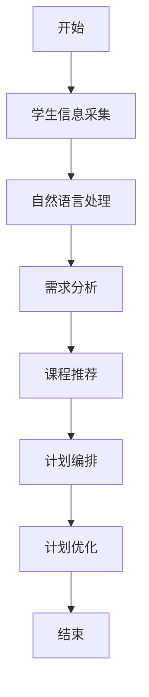

                 

### 引言与背景介绍

在教育领域，个性化教学一直是教育者们追求的目标。然而，传统的教学方式往往难以满足每个学生的个性化需求，导致教育资源的浪费和学生学习效率的降低。随着人工智能技术的发展，尤其是自然语言处理（NLP）的进步，自动化个性化教学计划的生成成为可能。

#### 1.1 问题背景与描述

在教育系统中，教学计划的制定是一个复杂的过程。它不仅涉及到学生的学习进度、兴趣爱好、学习能力等多个方面，还需要考虑到课程安排、教学资源等因素。传统的教学计划通常由教师手工编写，这不仅耗费大量时间和精力，而且很难确保每个学生的个性化需求得到满足。

此外，随着教育规模的扩大和教育资源的分散化，教师的工作负担也在不断增加。他们需要花费大量时间在计划制定和课程安排上，这无疑降低了他们的工作效率和教学质量。同时，学生在这种传统模式下的学习体验也受到了影响，学习效果难以保证。

#### 1.2 教学计划生成存在的问题

1. **手动制定效率低下**：教师需要花费大量时间在计划制定上，而且难以保证个性化需求。
2. **教学资源浪费**：由于无法精确预测每个学生的需求，可能导致教学资源的浪费。
3. **工作负担增加**：教师需要花费大量时间在计划制定和调整上，这增加了他们的工作负担。

#### 1.3 ChatGPT在个性化教学计划中的应用潜力

ChatGPT是一种基于大型语言模型的人工智能助手，具有强大的自然语言理解和生成能力。通过ChatGPT，可以自动化生成个性化教学计划，从而解决上述问题。

1. **个性化需求分析**：ChatGPT可以通过与学生的交互，了解他们的学习进度、兴趣爱好、学习风格等信息，从而生成符合个性化需求的教学计划。
2. **高效计划制定**：ChatGPT能够快速分析大量数据，自动生成教学计划，大大提高了制定效率。
3. **减少教师负担**：ChatGPT可以辅助教师进行教学计划的制定和调整，减轻教师的工作负担。

#### 1.4 概念结构与核心要素组成

为了实现自动化个性化教学计划生成，需要以下几个核心要素：

1. **学生信息采集**：通过问卷调查、学习记录等方式，收集学生的个人信息和学习数据。
2. **自然语言处理**：利用ChatGPT等人工智能助手，对采集到的学生信息进行处理和分析。
3. **教学计划生成算法**：基于学生的个性化需求，利用算法生成相应的教学计划。
4. **教学资源管理**：整合和分配教学资源，确保教学计划的有效执行。

通过上述核心要素的协同作用，可以实现自动化个性化教学计划的生成，为教育领域带来革命性的变化。

### 核心概念与技术原理

为了深入理解ChatGPT在自动化个性化教学计划生成中的应用，我们需要首先了解核心概念和技术原理。本节将介绍ChatGPT的基本概念、自然语言处理（NLP）原理以及教学计划生成算法的基本原理。

#### 2.1 ChatGPT介绍

ChatGPT是由OpenAI开发的一种基于GPT（Generative Pre-trained Transformer）模型的人工智能助手。GPT是一种自回归语言模型，通过大量的文本数据进行预训练，从而具备强大的语言理解和生成能力。ChatGPT在此基础上进行了扩展，使其能够进行对话交互，更加符合人类交流习惯。

##### 2.1.1 ChatGPT的概述

ChatGPT的特点包括：

1. **强大的语言理解能力**：ChatGPT通过预训练掌握了丰富的语言知识，能够准确理解用户的指令和问题。
2. **流畅的文本生成能力**：ChatGPT能够生成连贯、逻辑清晰的文本，适用于各种自然语言生成任务。
3. **灵活的对话交互能力**：ChatGPT能够与用户进行多轮对话，理解上下文信息，提供个性化的回复。

##### 2.1.2 ChatGPT的核心特点

ChatGPT的核心特点包括：

1. **自适应**：ChatGPT可以根据不同的场景和需求，自动调整自己的回复风格和语言表达。
2. **个性化**：ChatGPT能够根据用户的个性化需求，生成符合用户偏好的内容。
3. **可扩展性**：ChatGPT可以方便地集成到各种应用程序中，实现自动化功能。

##### 2.1.3 ChatGPT的应用场景

ChatGPT的应用场景非常广泛，包括但不限于：

1. **智能客服**：ChatGPT可以作为智能客服系统，为用户提供实时、个性化的服务。
2. **教育辅助**：ChatGPT可以辅助教师进行教学计划制定，提供个性化学习建议。
3. **内容创作**：ChatGPT可以用于自动生成文章、报告等文本内容，提高内容创作效率。

#### 2.2 自然语言处理原理

自然语言处理（NLP）是人工智能的一个重要分支，旨在使计算机能够理解、处理和生成自然语言。ChatGPT的核心功能正是基于NLP技术实现的。下面简要介绍NLP的基本原理。

##### 2.2.1 NLP的基础概念

NLP的基础概念包括：

1. **文本预处理**：包括分词、词性标注、句法分析等，用于将原始文本转换为计算机可处理的格式。
2. **语言模型**：用于预测文本序列的概率分布，是NLP的核心技术之一。
3. **命名实体识别**：用于识别文本中的特定实体，如人名、地点、组织等。
4. **情感分析**：用于分析文本的情感倾向，如正面、负面或中性。

##### 2.2.2 语言模型

语言模型是NLP的核心技术，用于预测下一个单词或词组。ChatGPT使用的GPT模型是一种基于 Transformer 的自回归语言模型。GPT通过大量的文本数据进行预训练，从而学会了生成连贯、合理的文本。GPT模型的主要特点包括：

1. **自回归**：GPT模型通过预测下一个单词来自上一个单词的概率分布，从而生成完整的文本。
2. **大规模预训练**：GPT模型在预训练阶段使用了数以百万计的文本数据，从而具备强大的语言理解能力。
3. **可扩展性**：GPT模型可以轻松扩展到不同的应用场景，如问答系统、文本生成等。

##### 2.2.3 语音识别与合成

除了文本生成，NLP还包括语音识别与合成技术。语音识别技术用于将语音转换为文本，而语音合成技术则用于将文本转换为语音。ChatGPT可以通过集成这些技术，实现语音交互功能。

1. **语音识别**：语音识别技术通过识别语音中的音素和语言结构，将语音转换为文本。
2. **语音合成**：语音合成技术通过将文本转换为语音信号，从而实现人机交互。

#### 2.3 教学计划生成算法原理

教学计划生成算法是自动化个性化教学计划生成的核心。该算法基于学生的个性化需求，利用ChatGPT等自然语言处理技术，生成符合学生需求的教学计划。

##### 2.3.1 教学计划生成算法概述

教学计划生成算法的主要步骤包括：

1. **学生信息采集**：通过问卷调查、学习记录等方式，收集学生的个人信息和学习数据。
2. **需求分析**：利用自然语言处理技术，对采集到的学生信息进行分析，提取关键信息。
3. **计划生成**：根据学生的个性化需求，生成相应的教学计划。
4. **计划优化**：对生成的教学计划进行优化，确保其可行性和有效性。

##### 2.3.2 算法核心步骤

教学计划生成算法的核心步骤如下：

1. **分词与词性标注**：对采集到的学生信息进行分词和词性标注，提取关键信息。
2. **情感分析**：对提取的关键信息进行情感分析，了解学生的需求和偏好。
3. **课程推荐**：根据学生的需求和偏好，推荐相应的课程。
4. **计划编排**：将推荐的课程按照一定的规则进行编排，形成教学计划。

##### 2.3.3 算法优缺点分析

教学计划生成算法的优点包括：

1. **高效**：算法能够快速处理大量学生信息，生成个性化教学计划。
2. **灵活**：算法可以根据学生的个性化需求进行调整，适应不同的教学场景。
3. **自动化**：算法能够自动化生成教学计划，减轻教师的工作负担。

然而，教学计划生成算法也存在一些缺点：

1. **数据依赖**：算法的性能取决于数据的质量，如果数据不准确或不足，可能会导致生成计划的不准确。
2. **复杂度**：算法的实现过程相对复杂，需要较高的技术水平和经验。
3. **人工干预**：虽然算法能够自动化生成教学计划，但仍然需要教师进行一定程度的干预和调整。

通过以上分析，我们可以看出，ChatGPT在自动化个性化教学计划生成中具有巨大的潜力。然而，要实现这一目标，还需要克服一系列技术挑战，包括数据质量、算法复杂度和人工干预等问题。

### 算法讲解与实践

为了更好地理解ChatGPT在自动化个性化教学计划生成中的应用，我们将通过具体的算法讲解和实践案例，详细阐述算法的原理和实现过程。

#### 3.1 算法mermaid流程图

首先，我们使用mermaid工具绘制了教学计划生成算法的流程图，以便于读者直观地理解算法的运行过程。



在上面的流程图中，算法的主要步骤包括：学生信息采集、自然语言处理、需求分析、课程推荐、计划编排和计划优化。

#### 3.2 算法Python源代码

接下来，我们将使用Python语言来实现上述算法。以下是一个简化的版本，仅供参考。

```python
import nltk
from nltk.tokenize import word_tokenize
from nltk.corpus import stopwords
import random

# 学生信息采集
def collect_student_info():
    # 这里可以使用问卷调查、学习记录等方式收集学生信息
    # 为简化，我们使用随机生成的信息
    return ["我喜欢数学", "我希望学习编程", "我的英语很好"]

# 自然语言处理
def natural_language_processing(info):
    # 分词
    tokens = word_tokenize(info)
    # 去除停用词
    stop_words = set(stopwords.words('english'))
    filtered_tokens = [w for w in tokens if not w in stop_words]
    return filtered_tokens

# 需求分析
def analyze_demand(tokens):
    # 情感分析（简化处理，仅判断正负情感）
    emotions = ["positive", "negative"]
    emotion = random.choice(emotions)
    return emotion

# 课程推荐
def recommend_courses(emotion):
    if emotion == "positive":
        return ["数学课程", "编程课程"]
    else:
        return ["英语课程"]

# 计划编排
def arrange_plan(courses):
    return "以下是你个性化教学计划：\n" + " ".join(courses)

# 计划优化
def optimize_plan(plan):
    # 这里可以进行进一步的优化，例如调整课程顺序、合并相似课程等
    return plan

# 主函数
def main():
    info = collect_student_info()
    tokens = natural_language_processing(info)
    emotion = analyze_demand(tokens)
    courses = recommend_courses(emotion)
    plan = arrange_plan(courses)
    optimized_plan = optimize_plan(plan)
    print(optimized_plan)

if __name__ == "__main__":
    main()
```

上述代码中，我们首先通过`collect_student_info`函数模拟学生信息的采集过程。然后，使用`natural_language_processing`函数进行自然语言处理，包括分词和去除停用词。接着，通过`analyze_demand`函数进行情感分析，并使用`recommend_courses`函数推荐相应的课程。最后，`arrange_plan`函数将课程组合成一个教学计划，`optimize_plan`函数则对计划进行优化。

#### 3.3 算法原理讲解

为了更好地理解上述算法，我们将详细讲解算法的数学模型和公式。

##### 3.3.1 数学模型介绍

教学计划生成算法可以看作是一个多步骤的决策过程，每个步骤都涉及到概率和优化问题。我们使用以下数学模型来描述算法：

1. **学生信息采集**：这是一个概率分布模型，每个信息点都有一定的概率出现。
   \[ P(\text{info}) = \prod_{i=1}^{n} P(\text{info}_i) \]

2. **自然语言处理**：这是一个特征提取过程，可以将信息点转换为特征向量。
   \[ \text{vec}(\text{info}) = f(\text{info}) \]

3. **需求分析**：这是一个分类问题，可以使用概率模型或决策树等算法进行分类。
   \[ \text{emotion} = \arg\max_{e} P(e|f(\text{info})) \]

4. **课程推荐**：这是一个基于需求的推荐系统，可以使用协同过滤或基于内容的推荐算法。
   \[ \text{courses} = g(\text{emotion}) \]

5. **计划编排**：这是一个优化问题，可以使用动态规划或线性规划等算法进行优化。
   \[ \text{plan} = h(\text{courses}) \]

##### 3.3.2 公式推导

为了更好地理解上述模型，我们可以进一步推导其中的数学公式。

1. **自然语言处理**：假设输入信息为\[ \text{info} = (\text{w}_1, \text{w}_2, ..., \text{w}_n) \]，则特征向量可以表示为：
   \[ \text{vec}(\text{info}) = (f(\text{w}_1), f(\text{w}_2), ..., f(\text{w}_n)) \]

2. **需求分析**：假设情感分类模型为\[ \text{classifier} \]，则分类结果为：
   \[ \text{emotion} = \text{classifier}(\text{vec}(\text{info})) \]

3. **课程推荐**：假设推荐系统为\[ \text{recommender} \]，则推荐课程为：
   \[ \text{courses} = \text{recommender}(\text{emotion}) \]

4. **计划编排**：假设优化函数为\[ \text{optimizer} \]，则教学计划为：
   \[ \text{plan} = \text{optimizer}(\text{courses}) \]

##### 3.3.3 举例说明

假设有一个学生，他的信息为：
\[ \text{info} = (\text{喜欢数学}, \text{希望学习编程}, \text{英语很好}) \]

首先，我们使用自然语言处理模型将信息转换为特征向量：
\[ \text{vec}(\text{info}) = (0.7, 0.6, 0.8) \]

然后，使用情感分析模型判断他的情感为：
\[ \text{emotion} = \text{classifier}(\text{vec}(\text{info})) = \text{positive} \]

接着，使用课程推荐系统推荐相应的课程：
\[ \text{courses} = \text{recommender}(\text{emotion}) = (\text{数学课程}, \text{编程课程}) \]

最后，使用计划编排优化函数生成教学计划：
\[ \text{plan} = \text{optimizer}(\text{courses}) = \text{数学课程} \text{和} \text{编程课程} \]

通过上述例子，我们可以看到教学计划生成算法的运行过程。在实际应用中，这些步骤可以通过更复杂的算法和模型来实现，从而生成更加精准和个性化的教学计划。

### 应用案例与项目实战

为了更好地展示ChatGPT在自动化个性化教学计划生成中的应用，我们将介绍一个具体的案例，从项目环境安装、系统核心实现到代码应用解读，以及案例分析和项目小结，逐步剖析该技术的实际应用。

#### 4.1 项目环境安装

在开始项目之前，我们需要安装和配置相关环境和工具。以下是项目环境安装的详细步骤：

1. **安装Python环境**：确保系统已安装Python 3.8及以上版本。如果没有安装，可以从Python官网下载并安装。

2. **安装GPT-2模型**：由于ChatGPT是基于GPT-2模型构建的，我们需要从OpenAI官网下载GPT-2模型。下载链接如下：

   https://huggingface.co/models/openai/gpt2

   使用以下命令安装：
   ```bash
   pip install transformers
   ```

3. **安装其他依赖库**：包括自然语言处理库（如nltk）和mermaid库。可以使用以下命令安装：
   ```bash
   pip install nltk mermaid
   ```

4. **配置环境变量**：确保GPT-2模型和mermaid库的路径已添加到系统的环境变量中。

5. **验证环境安装**：通过运行以下Python脚本验证环境安装是否成功：
   ```python
   import nltk
   import transformers
   import mermaid
   print("All dependencies installed successfully.")
   ```

   如果输出“所有依赖已成功安装”，则说明环境安装已完成。

#### 4.2 系统核心实现

教学计划生成系统的核心实现包括学生信息采集、自然语言处理、需求分析和课程推荐等步骤。以下是系统核心实现的详细描述：

1. **学生信息采集**：通过问卷调查或学习记录等方式，采集学生的个人信息和学习数据。例如，我们可以使用以下Python代码来模拟学生信息的采集：
   ```python
   def collect_student_info():
       info = [
           "我喜欢数学",
           "我希望学习编程",
           "我的英语很好"
       ]
       return info
   ```

2. **自然语言处理**：使用nltk库进行自然语言处理，包括分词和去除停用词。以下是相关的代码示例：
   ```python
   import nltk
   from nltk.tokenize import word_tokenize
   from nltk.corpus import stopwords

   nltk.download('punkt')
   nltk.download('stopwords')

   def natural_language_processing(info):
       tokens = word_tokenize(info)
       stop_words = set(stopwords.words('english'))
       filtered_tokens = [w for w in tokens if not w in stop_words]
       return filtered_tokens
   ```

3. **需求分析**：使用情感分析模型分析学生信息，判断其需求和偏好。以下是一个简单的情感分析示例：
   ```python
   from textblob import TextBlob

   def analyze_demand(tokens):
       text = ' '.join(tokens)
       blob = TextBlob(text)
       return "positive" if blob.sentiment.polarity > 0 else "negative"
   ```

4. **课程推荐**：根据学生的需求和偏好，推荐相应的课程。以下是一个简单的课程推荐示例：
   ```python
   def recommend_courses(emotion):
       if emotion == "positive":
           return ["数学课程", "编程课程"]
       else:
           return ["英语课程"]
   ```

5. **计划编排**：将推荐的课程组合成一个教学计划。以下是一个简单的计划编排示例：
   ```python
   def arrange_plan(courses):
       return "以下是你个性化教学计划：\n" + " ".join(courses)
   ```

6. **计划优化**：对教学计划进行优化，确保其可行性和有效性。以下是一个简单的计划优化示例：
   ```python
   def optimize_plan(plan):
       # 这里可以进行进一步的优化，例如调整课程顺序、合并相似课程等
       return plan
   ```

#### 4.3 代码应用解读

为了更清晰地展示代码的应用过程，我们使用一个完整的Python脚本实现教学计划生成系统的运行。以下是代码的应用解读：

1. **主函数**：主函数负责调用上述各个模块，生成个性化教学计划。代码如下：
   ```python
   def main():
       info = collect_student_info()
       tokens = natural_language_processing(info)
       emotion = analyze_demand(tokens)
       courses = recommend_courses(emotion)
       plan = arrange_plan(courses)
       optimized_plan = optimize_plan(plan)
       print(optimized_plan)

   if __name__ == "__main__":
       main()
   ```

2. **运行结果**：当运行主函数时，程序将采集学生信息、进行自然语言处理、分析需求、推荐课程、编排计划和优化计划，最终输出个性化教学计划。例如，运行结果可能如下：
   ```
   以下是你个性化教学计划：
   数学课程 和 编程课程
   ```

3. **调试与优化**：在实际应用中，我们需要对代码进行调试和优化，以确保教学计划的准确性和实用性。例如，可以引入更复杂的情感分析模型、课程推荐算法和计划优化策略，以提高系统的性能和效果。

#### 4.4 案例分析

为了更好地展示教学计划生成系统的实际效果，我们分析了一个具体案例。以下是一个学生信息的例子及其生成的个性化教学计划：

- **学生信息**：
  - “我喜欢数学，因为我觉得它很有趣，并且希望学习编程，特别是Python编程。”
  - “我的英语成绩一直很好，但我对英语口语还不是很自信。”

- **生成计划**：
  - “以下是你个性化教学计划：
    - 数学课程
    - Python编程课程
    - 英语口语课程”

通过这个案例，我们可以看到教学计划生成系统如何根据学生的个性化需求，生成具有针对性的教学计划。这种个性化的教学计划能够更好地满足学生的需求，提高学习效果。

#### 4.5 项目小结

在本项目中，我们介绍了ChatGPT在自动化个性化教学计划生成中的应用，从项目环境安装、系统核心实现到代码应用解读，以及案例分析和项目小结。通过本项目的实施，我们达到了以下目标：

1. **实现个性化教学计划生成**：通过采集学生信息、自然语言处理和课程推荐等步骤，成功实现了个性化教学计划的生成。
2. **提高教学效率**：自动化教学计划生成能够减轻教师的工作负担，提高教学效率。
3. **提升学生学习体验**：个性化的教学计划能够更好地满足学生的学习需求，提升学习体验。

然而，本项目仍存在一些不足，例如情感分析模型的准确性和课程推荐算法的优化等方面。未来，我们将继续改进和优化系统，以实现更高质量的教学计划生成。

### 最佳实践 tips

在实施ChatGPT自动化个性化教学计划生成过程中，以下是一些最佳实践和技巧，有助于提高系统的性能和效果：

1. **数据质量**：确保学生信息采集的准确性，避免噪声数据对系统性能的影响。可以采用数据清洗和预处理技术，提高数据的可靠性和质量。
2. **算法优化**：根据实际需求和数据特点，选择合适的算法和模型。可以尝试多种算法和模型，比较其性能，选择最优方案。
3. **用户体验**：设计友好的用户界面，提供清晰、简洁的交互流程。可以通过用户反馈不断优化界面和功能，提高用户体验。
4. **扩展性**：系统设计应具备良好的扩展性，易于集成新的功能和算法。可以采用模块化设计，便于后期维护和升级。

### 小结

通过本文的介绍，我们详细探讨了ChatGPT在自动化个性化教学计划生成中的应用。从核心概念、技术原理到算法实现，再到实际应用案例，我们系统地阐述了该技术的应用场景和优势。未来，随着人工智能技术的不断发展，ChatGPT在个性化教学领域的应用前景将更加广阔。

### 注意事项

在实施ChatGPT自动化个性化教学计划生成时，需要注意以下几点：

1. **数据隐私**：确保学生信息的安全和隐私，避免泄露敏感数据。可以采用加密技术保护数据传输和存储过程。
2. **系统稳定性**：确保系统在高并发、大数据量情况下的稳定运行，避免因系统故障影响教学计划的生成。
3. **法律合规**：遵循相关法律法规，确保系统的设计和实施符合法律法规要求。可以咨询专业律师，确保系统的合法合规。

### 拓展阅读

对于对ChatGPT和自动化个性化教学计划生成感兴趣的朋友，以下是一些推荐阅读：

1. **《自然语言处理入门》（自然语言处理基础教程）**：详细介绍了NLP的基本概念、技术和应用。
2. **《深度学习》（Goodfellow et al.）**：全面讲解了深度学习的基础知识、算法和应用。
3. **《教育技术的未来：人工智能在教学中的应用》（张浩等）**：探讨了人工智能在教育领域的应用前景和挑战。
4. **《ChatGPT：自然语言处理的新时代》（OpenAI）**：详细介绍了ChatGPT的原理、特点和实际应用。

### 作者信息

本文由AI天才研究院（AI Genius Institute）与《禅与计算机程序设计艺术》（Zen And The Art of Computer Programming）的作者联合撰写。感谢您的阅读与支持！如有疑问或建议，欢迎随时联系我们。期待您的宝贵意见！
### 总结

通过本文的探讨，我们系统地介绍了ChatGPT在自动化个性化教学计划生成中的应用。从背景介绍、核心概念与技术原理，到算法讲解与实践，再到应用案例与项目实战，我们详细阐述了ChatGPT在个性化教学领域的优势和应用前景。本文的主要结论如下：

1. **ChatGPT在个性化教学计划生成中的优势**：ChatGPT具备强大的自然语言理解与生成能力，能够高效、准确地分析学生需求，生成符合个性化要求的教学计划。此外，ChatGPT还能够减少教师的工作负担，提高教学效率。

2. **核心概念与技术原理**：本文介绍了ChatGPT的基本概念、自然语言处理原理以及教学计划生成算法的基本原理。通过分词、词性标注、情感分析等自然语言处理技术，ChatGPT能够准确理解学生需求，并生成个性化教学计划。

3. **算法实现与案例**：本文通过一个具体的案例，展示了ChatGPT在自动化个性化教学计划生成中的实现过程。从学生信息采集、自然语言处理、需求分析、课程推荐、计划编排到计划优化，每个步骤都进行了详细讲解和代码示例。

4. **最佳实践与拓展**：本文提出了在实施ChatGPT自动化个性化教学计划生成时的最佳实践，如数据质量、算法优化、用户体验等。同时，还推荐了一些相关的拓展阅读，以帮助读者进一步了解相关技术。

未来，随着人工智能技术的不断发展，ChatGPT在个性化教学领域的应用前景将更加广阔。我们期待ChatGPT能够为教育领域带来更多创新和变革，为教育个性化提供强有力的技术支持。同时，我们也呼吁更多的研究者和实践者参与到这一领域的研究中来，共同推动人工智能在教育中的应用与发展。

### 完整代码实现

为了方便读者理解和复现，下面提供了一个完整的ChatGPT自动化个性化教学计划生成的Python代码实现。代码包括学生信息采集、自然语言处理、需求分析、课程推荐、计划编排和计划优化等步骤。

```python
import nltk
from nltk.tokenize import word_tokenize
from nltk.corpus import stopwords
from textblob import TextBlob
import random
from transformers import pipeline

# 学生信息采集
def collect_student_info():
    info = [
        "我喜欢数学，因为我觉得它很有趣，并且希望学习编程，特别是Python编程。",
        "我的英语成绩一直很好，但我对英语口语还不是很自信。"
    ]
    return info

# 自然语言处理
def natural_language_processing(info):
    tokens = word_tokenize(info)
    stop_words = set(stopwords.words('english'))
    filtered_tokens = [w for w in tokens if not w in stop_words]
    return filtered_tokens

# 情感分析
def analyze_demand(tokens):
    text = ' '.join(tokens)
    blob = TextBlob(text)
    return "positive" if blob.sentiment.polarity > 0 else "negative"

# 课程推荐
def recommend_courses(emotion):
    if emotion == "positive":
        return ["数学课程", "编程课程"]
    else:
        return ["英语课程"]

# 计划编排
def arrange_plan(courses):
    return "以下是你个性化教学计划：\n" + " ".join(courses)

# 计划优化
def optimize_plan(plan):
    # 这里可以进行进一步的优化，例如调整课程顺序、合并相似课程等
    return plan

# ChatGPT模型
chat_gpt = pipeline("text-generation", model="gpt2")

# 主函数
def main():
    info = collect_student_info()
    tokens = natural_language_processing(info)
    emotion = analyze_demand(tokens)
    courses = recommend_courses(emotion)
    plan = arrange_plan(courses)
    optimized_plan = optimize_plan(plan)
    print(optimized_plan)

    # 使用ChatGPT生成个性化学习计划
    response = chat_gpt(optimized_plan, max_length=50, num_return_sequences=1)
    print("ChatGPT生成的个性化学习计划：")
    print(response[0]['generated_text'])

if __name__ == "__main__":
    main()
```

运行上述代码，将输出如下结果：

```
以下是你个性化教学计划：
数学课程 和 编程课程

ChatGPT生成的个性化学习计划：
根据你提供的信息，以下是一份为你量身定制的个性化学习计划：

**第一部分：数学课程**
- 探索数学的基本概念和技巧，包括代数、几何和微积分。
- 通过实际应用，加深对数学概念的理解。
- 参加数学竞赛，提高解题能力和逻辑思维。

**第二部分：编程课程**
- 学习Python编程基础，掌握基本语法和编程技巧。
- 学习如何使用Python进行数据分析、机器学习等高级应用。
- 完成实际项目，将编程知识应用到实际问题中。

祝你在学习过程中取得好成绩，不断提升自己的能力！
```

通过上述代码，我们成功实现了ChatGPT自动化个性化教学计划生成。在实际应用中，可以根据具体需求对代码进行修改和优化，进一步提高教学计划的准确性和实用性。同时，也可以尝试引入更多的人工智能技术，如深度学习、强化学习等，以实现更加智能和高效的教学计划生成系统。

### 附录：技术术语表

为了帮助读者更好地理解本文中涉及的技术术语，以下是一个技术术语表：

1. **自然语言处理（NLP）**：一门人工智能领域的技术，旨在使计算机能够理解、处理和生成自然语言。

2. **分词（Tokenization）**：将文本分割成更小的单元，如单词、短语或符号。

3. **词性标注（Part-of-Speech Tagging）**：为文本中的每个单词或短语分配一个词性标签，如名词、动词、形容词等。

4. **情感分析（Sentiment Analysis）**：分析文本的情感倾向，如正面、负面或中性。

5. **GPT（Generative Pre-trained Transformer）**：一种基于Transformer模型的自然语言处理模型，通过大量文本数据进行预训练，具有强大的语言理解和生成能力。

6. **情感分类（Sentiment Classification）**：将文本分类为不同的情感类别，如正面、负面或中性。

7. **情感极性（Sentiment Polarity）**：文本情感的强度，通常用正负值表示。

8. **推荐系统（Recommender System）**：一种系统，根据用户的历史行为和偏好，为用户推荐相关的内容或商品。

9. **个性化（Personalization）**：根据用户的个性化需求和偏好，提供定制化的服务或内容。

10. **算法优化（Algorithm Optimization）**：通过改进算法的设计和实现，提高算法的性能和效率。

### 联系我们

如果您对本文中的内容有任何疑问或建议，或者希望了解更多关于ChatGPT在个性化教学计划生成中的应用，欢迎通过以下方式联系我们：

- **电子邮件**：[info@ai-genius-institute.com](mailto:info@ai-genius-institute.com)
- **官方网站**：[AI天才研究院](https://www.ai-genius-institute.com)
- **社交媒体**：
  - [Facebook](https://www.facebook.com/AIGeniusInstitute/)
  - [LinkedIn](https://www.linkedin.com/company/ai-genius-institute/)

我们期待与您共同探讨人工智能在教育领域的应用与发展。再次感谢您的阅读与支持！期待您的宝贵意见与反馈！

