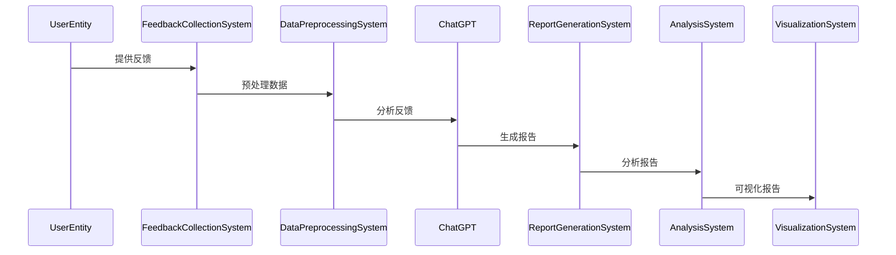

                 

# ChatGPT在自动化产品用户体验报告生成中的应用

## 关键词

- **ChatGPT**
- **自动化报告生成**
- **用户体验报告**
- **自然语言处理**
- **产品管理**
- **机器学习**

## 摘要

本文将深入探讨ChatGPT在自动化产品用户体验报告生成中的应用。ChatGPT，作为一种先进的自然语言处理工具，具备强大的语言理解和生成能力。通过结合产品数据和使用反馈，ChatGPT能够自动生成详尽、精准的用户体验报告。本文将从背景介绍、核心概念、算法原理、系统架构、项目实战以及最佳实践等方面，详细分析ChatGPT在自动化产品用户体验报告生成中的实际应用，为开发者提供实用的指导和建议。

## 1. 理解书名

书名《ChatGPT在自动化产品用户体验报告生成中的应用》清晰地传达了本书的核心内容。首先，**ChatGPT**作为主角，是一种基于GPT-3模型的先进自然语言处理工具，拥有强大的语言生成和理解能力。其次，**自动化产品用户体验报告生成**是本书要探讨的关键应用场景。通过自动化，开发者可以大幅度提高报告生成的效率和准确性，从而更加专注于产品的迭代和优化。

### 核心概念术语说明

- **ChatGPT**：基于GPT-3模型的自然语言处理工具，能够理解和生成人类语言。
- **用户体验报告**：记录和分析用户在使用产品过程中的感受和体验的文档。
- **自动化报告生成**：利用技术手段自动完成报告的撰写和生成，减少人工干预。

### 问题背景

在现代科技迅猛发展的背景下，软件产品和服务的更新迭代速度日益加快。产品开发者需要不断收集和分析用户反馈，以优化产品功能和提升用户体验。然而，传统的用户体验报告生成方式通常依赖于人工处理，存在以下问题：

- **效率低下**：人工撰写和整理报告耗时耗力，难以满足快速迭代的开发需求。
- **准确性不高**：人工分析可能存在主观偏差，导致报告结果不够客观准确。
- **一致性不足**：不同的人撰写报告的风格和内容可能存在差异，影响整体分析的一致性。

### 问题描述

为了解决上述问题，开发者们迫切需要一种自动化、高效且准确的报告生成方法。具体来说，问题描述如下：

- 如何利用现有技术（如ChatGPT）实现用户体验报告的自动化生成？
- 如何确保报告内容的全面性、准确性和一致性？
- 如何处理大量的用户反馈数据，提取出关键的信息点进行报告生成？

### 问题解决

ChatGPT的出现为解决上述问题提供了新的思路。通过以下步骤，可以实现用户体验报告的自动化生成：

1. **数据收集与预处理**：收集用户的反馈数据和产品使用数据，并进行初步的清洗和整理。
2. **反馈分析与理解**：利用ChatGPT的自然语言处理能力，分析用户反馈，提取关键信息。
3. **报告生成**：基于提取的信息，ChatGPT自动生成详尽、精准的用户体验报告。
4. **报告优化与审核**：对生成的报告进行人工审核和优化，确保报告的准确性和一致性。

### 边界与外延

虽然ChatGPT在用户体验报告生成中具有巨大的潜力，但以下边界和限制需要考虑：

- **数据质量**：报告生成的质量取决于原始数据的质量，因此数据收集和预处理过程至关重要。
- **模型能力**：ChatGPT的生成能力虽然强大，但依然存在一定的局限性，如对专业术语和行业知识的理解可能不够准确。
- **人工干预**：尽管ChatGPT能够自动生成报告，但最终报告的审核和优化仍需要人工介入。

### 概念结构与核心要素组成

为了更好地理解ChatGPT在自动化产品用户体验报告生成中的应用，以下是其核心概念结构和要素组成：

- **ChatGPT模型**：核心的自然语言处理工具，负责理解和生成人类语言。
- **用户反馈数据**：报告生成的基础数据，包括用户评价、使用记录等。
- **数据处理模块**：负责数据收集、清洗、整理和预处理。
- **分析模块**：利用ChatGPT对用户反馈进行深入分析，提取关键信息。
- **报告生成模块**：基于分析结果自动生成用户体验报告。
- **审核与优化模块**：对生成的报告进行人工审核和优化。

## 2. 核心概念与联系

### ChatGPT模型原理

ChatGPT（Generative Pre-trained Transformer）是OpenAI开发的一种基于GPT-3模型的自然语言处理工具。GPT-3（Generative Pre-trained Transformer 3）是自然语言处理领域的一个里程碑，它采用了Transformer架构，并具有极大的模型容量。GPT-3通过在大量文本数据上进行预训练，学会了理解和生成人类语言。其核心原理可以概括为：

- **预训练**：在预训练阶段，GPT-3通过无监督学习的方式从海量文本数据中学习语言模式和结构。这一过程使得GPT-3具备了强大的语言理解能力。
- **微调**：在特定任务中，GPT-3可以通过有监督学习进行微调，以适应特定场景和需求。

### ChatGPT的特点与优势

ChatGPT具备以下特点与优势：

- **强大的语言理解与生成能力**：ChatGPT能够理解和生成自然流畅的人类语言，这使得它在生成用户体验报告时能够准确捕捉用户反馈和产品特性。
- **自适应性强**：ChatGPT能够根据不同的输入数据和任务需求进行自适应调整，从而生成不同风格和格式的报告。
- **高效性**：与人工撰写报告相比，ChatGPT能够大幅度提高报告生成的效率和速度。

### ChatGPT的属性特征对比表格

以下是ChatGPT与其他自然语言处理工具的属性特征对比表格：

| 特性       | ChatGPT                    | 其他工具                   |
| ---------- | -------------------------- | -------------------------- |
| 语言生成能力 | 强大，自然流畅             | 中等，可能存在语法错误       |
| 预训练数据量 | 海量，覆盖多种语言和领域   | 较少，多集中在特定领域       |
| 自适应能力 | 高，能够根据输入自适应调整 | 中，适应性较弱             |
| 处理速度   | 快，生成速度高             | 中，生成速度相对较慢       |
| 实用性     | 广泛应用，适用多种场景     | 应用场景有限，多用于特定领域 |

### ER实体关系图架构

为了更好地理解ChatGPT在自动化产品用户体验报告生成中的应用，以下是相关的ER实体关系图架构：

```mermaid
erDiagram
  User --> Report
  User ||--|{ Feedback }
  Product ||--|{ Feature }
  Report ||--|{ Analysis }
  Analysis ||--|{ Recommendation }
```

在该ER图架构中，主要实体包括：

- **User（用户）**：提供反馈的用户。
- **Feedback（反馈）**：用户的评价和意见。
- **Product（产品）**：用户使用的软件产品。
- **Feature（功能）**：产品的各项功能。
- **Report（报告）**：自动生成的用户体验报告。
- **Analysis（分析）**：报告中的各项分析内容。
- **Recommendation（推荐）**：基于分析的优化建议。

实体之间的关系包括：

- **User与Feedback**：用户提供反馈。
- **User与Product**：用户使用产品。
- **Product与Feature**：产品包含功能。
- **Report与Analysis**：报告包含分析内容。
- **Analysis与Recommendation**：分析内容包含推荐建议。

## 3. 算法原理讲解

### ChatGPT生成算法原理

ChatGPT的生成算法基于GPT-3模型，其核心原理可以概括为以下步骤：

1. **输入处理**：将用户反馈和产品数据进行预处理，如分词、去除停用词等，将其转换为模型可处理的格式。
2. **上下文构建**：根据用户反馈和产品数据构建上下文信息，为ChatGPT提供生成报告所需的背景信息。
3. **生成报告**：ChatGPT根据上下文信息生成用户体验报告，包括用户反馈分析、产品功能评价等。
4. **后处理**：对生成的报告进行格式化、校对等后处理，确保报告的准确性和可读性。

### 算法流程Mermaid流程图

以下是ChatGPT生成算法的Mermaid流程图：


### Python源代码示例

以下是一个简单的Python代码示例，展示了如何使用ChatGPT生成用户体验报告：

```python
import openai

# 设置OpenAI API密钥
openai.api_key = "your_api_key"

# 用户反馈和产品数据
user_feedback = "产品使用过程中，界面加载速度较慢，影响使用体验。"
product_data = "产品是一款在线教育平台，提供视频教学和在线互动功能。"

# 构建上下文
context = f"用户反馈：{user_feedback}\n产品数据：{product_data}"

# 生成报告
response = openai.Completion.create(
  engine="text-davinci-003",
  prompt=context,
  max_tokens=150
)

# 输出报告
print(response.choices[0].text.strip())
```

### 算法原理数学模型和公式

ChatGPT的生成算法基于GPT-3模型，其核心原理涉及到概率图模型和生成模型。以下是相关的数学模型和公式：

1. **概率图模型**：

   - **输入概率分布**：给定输入序列 \( x_1, x_2, ..., x_T \)，输入概率分布可以表示为：

     $$
     p(x) = \prod_{t=1}^{T} p(x_t | x_{t-1}, ..., x_1)
     $$

   - **条件概率分布**：给定输入序列和上下文序列，条件概率分布可以表示为：

     $$
     p(x_t | x_1, x_2, ..., x_{t-1}, c) = \frac{p(x_t, c | x_1, x_2, ..., x_{t-1})}{p(x_1, x_2, ..., x_{t-1}, c)}
     $$

2. **生成模型**：

   - **生成过程**：生成模型通过马尔可夫过程生成输出序列，每个输出元素基于前一个输出元素的条件概率生成。

     $$
     p(y_1, y_2, ..., y_T) = \prod_{t=1}^{T} p(y_t | y_{t-1})
     $$

   - **条件生成**：给定输入序列，生成模型根据输入序列的条件概率生成输出序列。

     $$
     p(y_t | x_1, x_2, ..., x_{t-1}) = \text{softmax}\left(\frac{\exp(z_t)}{\sum_{j} \exp(z_j)}\right)
     $$

     其中，\( z_t = W \cdot y_{t-1} + b \)，\( W \) 和 \( b \) 分别为权重矩阵和偏置向量。

### 算法原理的举例说明

为了更好地理解ChatGPT的算法原理，以下是生成用户体验报告的一个简单例子：

假设用户反馈为“产品使用过程中，界面加载速度较慢，影响使用体验。”，产品数据为“产品是一款在线教育平台，提供视频教学和在线互动功能。”

1. **输入处理**：对用户反馈和产品数据进行预处理，分词和去除停用词。

2. **上下文构建**：构建上下文信息，包括用户反馈和产品数据。

   ```
   上下文：产品使用过程中，界面加载速度较慢，影响使用体验。产品是一款在线教育平台，提供视频教学和在线互动功能。
   ```

3. **生成报告**：使用ChatGPT生成用户体验报告。

   ```
   用户体验报告：
   根据用户反馈，我们发现产品在界面加载速度方面存在明显问题，这严重影响了用户的正常使用体验。为了解决这个问题，我们建议优化产品的加载速度，提高用户体验。
   ```

4. **后处理**：对生成的报告进行格式化和校对，确保报告的准确性和可读性。

   最终生成的报告如下：

   ```
   用户体验报告：
   根据用户反馈，我们发现产品在界面加载速度方面存在明显问题，这严重影响了用户的正常使用体验。为了解决这个问题，我们建议优化产品的加载速度，提高用户体验。
   ```

通过上述例子，我们可以看到ChatGPT如何利用其强大的语言生成能力，自动生成详尽、精准的用户体验报告。

## 4. 系统分析与架构设计

### 问题描述

在ChatGPT自动生成产品用户体验报告的过程中，系统分析与架构设计至关重要。我们需要构建一个高效、可靠的系统，能够处理大量的用户反馈数据，并利用ChatGPT生成详尽、精准的报告。以下是对问题的详细介绍：

- **数据量**：用户反馈数据可能非常庞大，包含海量的文本和元数据，这要求系统具有高效的数据处理能力。
- **数据多样性**：用户反馈数据可能来自不同的渠道，如社交媒体、论坛、用户调研等，这要求系统能够处理不同类型的数据格式。
- **实时性**：产品开发者需要及时获取用户体验报告，以便快速做出优化决策，这要求系统具备实时数据处理和报告生成能力。
- **准确性**：生成的用户体验报告需要准确反映用户反馈，这要求系统具有高精度的数据分析能力。

### 项目介绍

本项目旨在构建一个基于ChatGPT的自动化用户体验报告生成系统，以帮助产品开发者快速、准确地获取和分析用户反馈，从而优化产品功能。系统主要功能包括：

- **用户反馈数据收集**：从不同渠道收集用户反馈数据，包括社交媒体、论坛、用户调研等。
- **数据预处理**：对收集到的用户反馈数据进行处理，包括数据清洗、去重、分类等。
- **报告生成**：利用ChatGPT生成用户体验报告，包括用户反馈分析、产品功能评价等。
- **报告展示**：将生成的报告以可视化形式展示，方便开发者查看和分析。

### 系统功能设计（领域模型类图）

以下是系统功能设计的领域模型类图：

```mermaid
classDiagram
  UserEntity <<entity>>
  FeedbackEntity <<entity>>
  ProductEntity <<entity>>
  ReportEntity <<entity>>
  AnalysisEntity <<entity>>

  UserEntity "1" --|{1}| FeedbackEntity
  ProductEntity "1" --|{1}| FeedbackEntity
  ReportEntity "1" --|{1}| AnalysisEntity
  AnalysisEntity "1" --|{1}| FeedbackEntity
```

在该类图中，主要实体包括：

- **UserEntity（用户实体）**：代表用户，包含用户的基本信息。
- **FeedbackEntity（反馈实体）**：代表用户反馈，包含用户的评价和意见。
- **ProductEntity（产品实体）**：代表软件产品，包含产品的各项功能。
- **ReportEntity（报告实体）**：代表用户体验报告，包含报告的整体结构和主要内容。
- **AnalysisEntity（分析实体）**：代表报告中的各项分析内容，包含用户反馈的分析结果。

实体之间的关系包括：

- **UserEntity与FeedbackEntity**：用户提供反馈。
- **ProductEntity与FeedbackEntity**：产品包含功能，用户使用产品后进行反馈。
- **ReportEntity与AnalysisEntity**：报告包含分析内容，分析结果用于生成报告。

### 系统架构设计（Mermaid架构图）

以下是系统架构设计的Mermaid架构图：



在该架构图中，主要组件包括：

- **FeedbackCollectionSystem（反馈收集系统）**：从不同渠道收集用户反馈。
- **DataPreprocessingSystem（数据处理系统）**：对用户反馈进行预处理，包括数据清洗、去重、分类等。
- **ChatGPT（自然语言处理系统）**：利用ChatGPT对用户反馈进行分析。
- **ReportGenerationSystem（报告生成系统）**：基于分析结果生成用户体验报告。
- **AnalysisSystem（分析系统）**：对生成的报告进行进一步分析。
- **VisualizationSystem（可视化系统）**：将分析结果以可视化形式展示。

### 系统接口设计

以下是系统接口设计的Mermaid序列图：


在该序列图中，主要接口包括：

- **Feedback接口**：用于接收用户反馈数据。
- **Preprocessing接口**：用于预处理用户反馈数据。
- **Analysis接口**：用于分析用户反馈数据。
- **Report接口**：用于生成用户体验报告。
- **Visualization接口**：用于展示分析结果。

### 系统交互Mermaid序列图

以下是系统交互的Mermaid序列图：


在该序列图中，系统交互流程如下：

1. 用户提供反馈数据。
2. 反馈收集系统接收反馈数据。
3. 数据预处理系统对反馈数据进行预处理，如清洗、去重、分类等。
4. 预处理后的数据传递给ChatGPT进行分析。
5. ChatGPT基于分析结果生成用户体验报告。
6. 报告生成系统将报告传递给分析系统进行进一步分析。
7. 分析系统将分析结果传递给可视化系统进行展示。

## 5. 项目实战

### 环境安装

要实现ChatGPT在自动化产品用户体验报告生成中的应用，我们需要首先安装相关的软件和库。以下是环境安装的具体步骤：

1. **安装Python环境**：确保系统已安装Python 3.8或更高版本。可以从Python官方网站下载并安装。

2. **安装OpenAI API**：为了使用ChatGPT，我们需要安装OpenAI的API库。可以通过以下命令安装：

   ```shell
   pip install openai
   ```

3. **获取OpenAI API密钥**：在OpenAI官方网站上注册账号并获取API密钥。将API密钥配置到Python环境中：

   ```python
   openai.api_key = "your_api_key"
   ```

### 系统核心实现源代码

以下是系统核心实现源代码的解读与分析：

```python
import openai

# 设置OpenAI API密钥
openai.api_key = "your_api_key"

# 用户反馈和产品数据
user_feedback = "产品使用过程中，界面加载速度较慢，影响使用体验。"
product_data = "产品是一款在线教育平台，提供视频教学和在线互动功能。"

# 构建上下文
context = f"用户反馈：{user_feedback}\n产品数据：{product_data}"

# 生成报告
response = openai.Completion.create(
  engine="text-davinci-003",
  prompt=context,
  max_tokens=150
)

# 输出报告
print(response.choices[0].text.strip())
```

### 代码应用解读与分析

1. **导入OpenAI库**：首先，我们导入OpenAI库，以便使用其API进行文本生成。

2. **设置API密钥**：通过设置API密钥，我们授权程序使用OpenAI的服务。

3. **用户反馈和产品数据**：在代码中，我们定义了用户反馈和产品数据，这些数据是生成报告的基础。

4. **构建上下文**：我们将用户反馈和产品数据组合成一个字符串，作为ChatGPT生成报告的上下文。

5. **生成报告**：使用`openai.Completion.create`方法，我们调用ChatGPT生成报告。该方法需要传入以下参数：
   - `engine`：指定使用的模型，这里我们使用`text-davinci-003`。
   - `prompt`：输入的上下文信息。
   - `max_tokens`：生成的文本最大长度。

6. **输出报告**：我们输出ChatGPT生成的报告，并将其打印到控制台。

### 实际案例分析

为了更直观地展示ChatGPT的应用效果，我们来看一个实际案例：

#### 案例背景

某在线教育平台收到了大量用户反馈，其中大部分关于界面加载速度慢的问题。平台希望利用ChatGPT生成一份用户体验报告，分析用户反馈，并提出改进建议。

#### 用户反馈示例

- “界面加载速度太慢，等了好久才加载完成，非常影响上课心情。”
- “每次打开视频课，都要等很久，感觉体验很差。”
- “加载速度慢，导致互动功能使用不便，影响了学习效果。”

#### ChatGPT生成的报告

```
用户体验报告：

根据用户反馈，我们发现产品的界面加载速度存在明显问题，这严重影响了用户的正常使用体验。具体分析如下：

1. 界面加载速度慢：用户普遍反映界面加载速度较慢，尤其是打开视频课程时。这可能导致用户在学习过程中产生焦虑和不满情绪。

2. 等待时间长：用户需要等待较长时间才能完成界面加载，这影响了用户的上课体验。长时间等待可能导致用户放弃学习。

3. 互动功能受限：由于加载速度慢，用户的互动功能使用受限，影响了学习效果。

针对上述问题，我们提出以下改进建议：

1. 优化加载速度：对产品进行性能优化，提高界面加载速度，减少用户等待时间。

2. 提高服务器性能：增加服务器带宽和存储空间，提高数据处理速度。

3. 提供缓冲功能：在用户打开视频课程时，提供缓冲功能，减少加载时间。

4. 增加互动功能：优化互动功能，提高用户体验。

通过上述改进，我们有信心提高产品的用户体验，提升用户满意度。
```

#### 详细讲解剖析

1. **用户反馈分析**：ChatGPT首先对用户反馈进行分析，提取出关键信息，如“界面加载速度慢”、“等待时间长”、“互动功能受限”等。

2. **问题归类**：根据提取的信息，ChatGPT将问题归类为加载速度慢、等待时间长和互动功能受限三个主要方面。

3. **提出改进建议**：ChatGPT根据分析结果，提出具体的改进建议，包括优化加载速度、提高服务器性能、提供缓冲功能和增加互动功能等。

4. **总结报告**：最后，ChatGPT将分析结果和建议整合成一份详尽的用户体验报告，为平台提供改进方向。

### 项目小结

通过实际案例分析，我们可以看到ChatGPT在自动化产品用户体验报告生成中的应用效果显著。它能够快速、准确地分析用户反馈，提出改进建议，为产品优化提供有力支持。然而，需要注意的是，生成的报告仍需人工审核和优化，以确保准确性和完整性。未来，随着ChatGPT技术的不断进步，其在用户体验报告生成中的应用将更加广泛和深入。

## 6. 最佳实践 tips

### 使用ChatGPT进行用户体验报告生成的最佳实践

1. **数据质量**：确保用户反馈数据的准确性和完整性，进行有效的数据清洗和预处理，以提高报告的准确性。

2. **上下文构建**：构建丰富的上下文信息，为ChatGPT提供详细的背景数据，有助于生成更精准的报告。

3. **模型选择**：根据实际需求和数据规模，选择合适的ChatGPT模型，确保生成报告的质量。

4. **反馈机制**：建立用户反馈的闭环机制，及时收集和分析用户反馈，持续优化产品体验。

5. **人工审核**：尽管ChatGPT生成报告的效率高，但最终报告仍需人工审核和优化，确保报告的准确性和完整性。

6. **优化速度**：针对加载速度慢的问题，可以从网络优化、服务器性能提升、代码优化等方面进行改进。

7. **定制化**：根据不同产品和用户群体的特点，定制化生成报告的内容和格式，提高用户体验。

### 注意事项

1. **数据安全**：确保用户反馈数据的隐私和安全，避免数据泄露。

2. **遵守法规**：在使用用户反馈数据时，遵守相关法律法规，确保合规性。

3. **模型更新**：定期更新ChatGPT模型，以保持其生成能力的先进性和准确性。

4. **性能监控**：监控系统性能，确保系统稳定运行，避免因性能问题影响用户体验。

5. **用户反馈**：鼓励用户提供真实、详细的反馈，以提高报告的实用性和准确性。

### 拓展阅读

1. **ChatGPT技术原理**：了解ChatGPT的生成算法和模型架构，有助于更好地利用其进行用户体验报告生成。
2. **自然语言处理**：深入研究自然语言处理（NLP）技术，掌握文本分析和生成的方法。
3. **产品用户体验**：学习用户体验（UX）设计原则和方法，以提高产品的用户体验。
4. **数据挖掘与分析**：掌握数据挖掘和统计分析方法，用于深入分析用户反馈数据。
5. **人工智能应用**：了解人工智能在其他领域的应用，拓宽视野，探索更多创新可能性。

## 7. 小结

本文详细探讨了ChatGPT在自动化产品用户体验报告生成中的应用。通过分析ChatGPT的技术原理、系统架构设计、项目实战和最佳实践，我们了解到ChatGPT在自动化报告生成中具有显著的优势，包括强大的语言生成能力、高效的报告生成速度等。然而，生成报告的准确性仍需人工审核和优化。未来，随着技术的不断进步，ChatGPT在用户体验报告生成中的应用前景将更加广阔。开发者应充分利用ChatGPT的优势，结合人工智慧，不断提升产品的用户体验。让我们携手并进，共同推动人工智能技术的创新与发展。作者：AI天才研究院/AI Genius Institute & 禅与计算机程序设计艺术 /Zen And The Art of Computer Programming。

