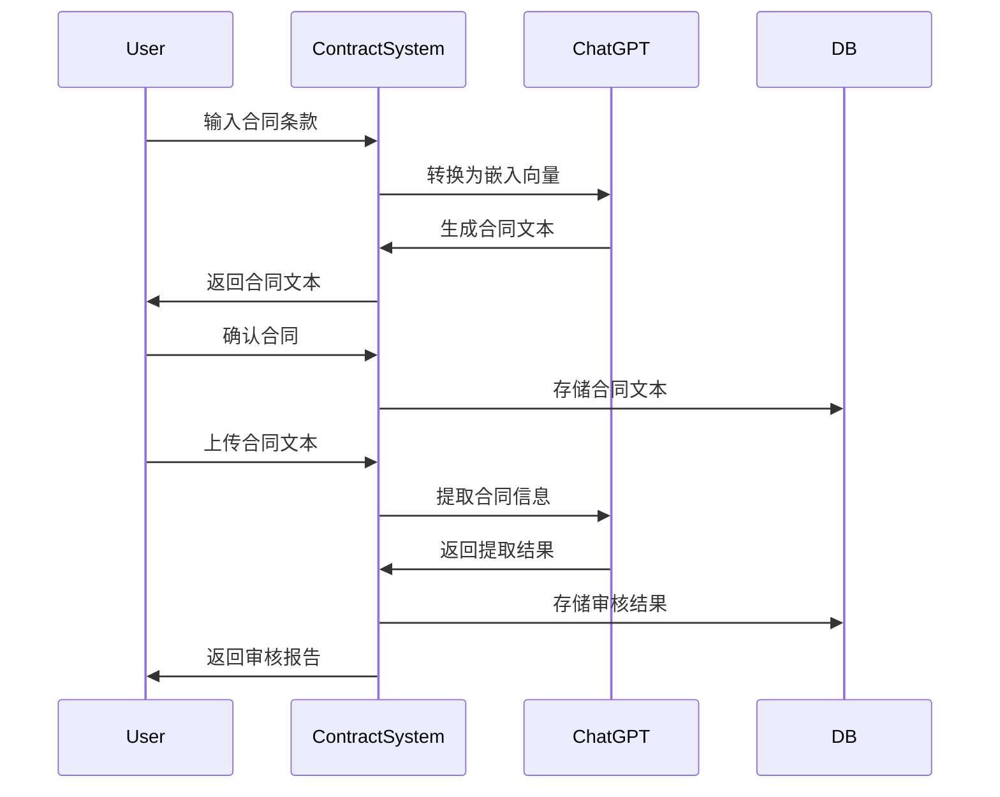

                 


### 1. 引言

**问题背景**

在当今的数字化时代，合同自动化生成与审核的需求愈发突出。传统的合同生成与审核流程繁琐、耗时且容易出错，这不仅影响了企业的运营效率，也增加了法律风险。随着人工智能技术的发展，特别是大型语言模型如ChatGPT的出现，为自动化合同生成与审核带来了新的可能性。

**核心概念**

- **ChatGPT**：一个由OpenAI开发的基于GPT-3模型的强大语言处理工具，能够理解和生成自然语言文本。
- **自动化合同生成**：利用AI技术，自动从用户输入中生成合同文本，减少人工干预和错误。
- **自动化合同审核**：利用AI技术，自动审核合同内容，确保其合法性和准确性。

**解决方法**

本文将探讨如何利用ChatGPT实现自动化合同生成与审核，从以下几个方面展开：

1. **背景介绍**：介绍合同自动化生成与审核的需求和挑战。
2. **核心概念与联系**：详细解释ChatGPT、自动化合同生成与审核的相关概念。
3. **算法原理讲解**：阐述ChatGPT的工作原理和自动化合同生成审核算法。
4. **系统分析与架构设计**：设计实现自动化合同生成审核系统的架构。
5. **项目实战**：详细介绍系统搭建、实现与测试过程。
6. **最佳实践、小结、注意事项、拓展阅读**：总结实践经验，给出建议和拓展资源。

**边界与外延**

- **边界**：本文主要关注ChatGPT在自动化合同生成与审核中的应用，不包括其他AI技术在合同领域的应用。
- **外延**：本文提到的技术可以应用于各种类型的合同，如商业合同、租赁合同、雇佣合同等。

### 1.2 核心概念与联系

#### 1.2.1 ChatGPT介绍

**定义**：ChatGPT是一个基于GPT-3模型开发的预训练语言模型，能够进行自然语言理解和生成。

**特点**：

- **强大语言理解能力**：能够理解复杂语境，生成连贯、自然的文本。
- **自适应能力**：根据输入的内容自动调整生成策略。
- **多样性**：能够生成不同风格和复杂度的文本。

**工作原理**：

1. **预训练**：在大量文本数据上进行预训练，学习语言模式和规则。
2. **微调**：针对特定任务进行微调，提高模型在特定领域的性能。

#### 1.2.2 自动化合同生成

**概念**：自动化合同生成是指利用AI技术，自动从用户输入中生成合同文本。

**流程**：

1. **输入处理**：接收用户输入，如合同条款和条件。
2. **模板匹配**：根据输入内容匹配合同模板。
3. **文本生成**：利用ChatGPT生成合同文本。

**技术挑战**：

- **文本生成准确性**：确保生成的文本符合合同规范，无遗漏或错误。
- **上下文理解**：理解用户输入的上下文，生成符合逻辑的合同文本。

#### 1.2.3 自动化合同审核

**概念**：自动化合同审核是指利用AI技术，自动审核合同内容，确保其合法性、准确性和完整性。

**流程**：

1. **内容提取**：从合同文本中提取关键信息。
2. **规则检查**：根据预定义的规则检查合同内容。
3. **结果反馈**：生成审核报告，包括合规性和潜在风险的评估。

**技术挑战**：

- **规则定义**：定义全面、精确的审核规则。
- **错误检测**：检测合同文本中的错误和潜在风险。

### 1.3 数学模型与算法原理

#### 1.3.1 ChatGPT的数学模型

ChatGPT基于GPT-3模型，其核心是Transformer架构，包括以下几个关键组成部分：

1. **嵌入层**：将输入文本转换为向量。
2. **Transformer层**：通过自注意力机制进行文本理解和生成。
3. **输出层**：将生成的文本输出为自然语言。

#### 1.3.2 自动化合同生成与审核算法

**合同生成算法**：

1. **输入处理**：将用户输入（如合同条款）转换为嵌入向量。
2. **文本生成**：利用Transformer模型生成合同文本。
3. **文本校验**：使用规则引擎校验合同文本的准确性。

**合同审核算法**：

1. **内容提取**：使用自然语言处理技术提取合同文本的关键信息。
2. **规则检查**：根据预定义的审核规则进行合同内容检查。
3. **结果反馈**：生成审核报告，包括合规性评估和风险提示。

### 1.4 系统分析与架构设计

#### 1.4.1 系统场景描述

**合同生成场景**：

- 用户输入合同条款。
- 系统利用ChatGPT生成合同文本。
- 用户审核并确认合同文本。

**合同审核场景**：

- 用户上传合同文本。
- 系统自动提取合同信息。
- 系统根据审核规则检查合同内容。
- 系统生成审核报告，反馈给用户。

#### 1.4.2 系统功能设计

**功能模块划分**：

- 用户界面：提供合同输入和输出接口。
- 合同生成模块：实现自动化合同生成功能。
- 合同审核模块：实现自动化合同审核功能。
- 数据库：存储用户输入、生成和审核的合同数据。

**数据流分析**：

1. **用户输入**：用户通过界面输入合同条款。
2. **合同生成**：系统将用户输入转换为嵌入向量，利用ChatGPT生成合同文本。
3. **用户确认**：用户审核并确认生成的合同文本。
4. **合同审核**：系统提取合同文本信息，根据审核规则进行检查。
5. **结果反馈**：系统生成审核报告，反馈给用户。

#### 1.4.3 系统架构设计

**架构总体设计**：

- **前端**：提供用户交互界面，用户可以通过前端输入合同条款。
- **后端**：包括合同生成模块、合同审核模块和数据库，负责处理用户输入和生成合同文本，以及进行合同审核。

**系统组件详解**：

- **用户界面**：使用HTML、CSS和JavaScript技术实现。
- **合同生成模块**：包括嵌入层、Transformer层和输出层，利用ChatGPT进行文本生成。
- **合同审核模块**：包括内容提取、规则检查和结果反馈三个部分。
- **数据库**：使用MySQL或MongoDB等数据库技术存储用户数据和合同信息。

#### 1.4.4 系统接口设计

**接口功能定义**：

- **合同输入接口**：用户可以通过该接口输入合同条款。
- **合同输出接口**：系统生成的合同文本将通过该接口输出给用户。
- **合同审核接口**：用户可以通过该接口上传合同文本，系统将自动进行审核并输出审核报告。

**接口规范**：

- **合同输入接口**：采用JSON格式，字段包括合同条款、合同类型等。
- **合同输出接口**：采用JSON格式，字段包括合同文本、合同编号等。
- **合同审核接口**：采用JSON格式，字段包括合同文本、审核结果等。

#### 1.4.5 系统交互设计

**交互流程**：

1. **用户输入合同条款**：用户通过前端界面输入合同条款。
2. **合同生成**：系统将用户输入转换为嵌入向量，利用ChatGPT生成合同文本，并通过输出接口返回给用户。
3. **用户确认合同**：用户审核并确认生成的合同文本，确认后存储到数据库。
4. **合同上传**：用户可以通过前端界面上传合同文本，系统将自动进行审核。
5. **审核报告生成**：系统根据审核规则检查合同文本，生成审核报告并通过前端界面返回给用户。

**Mermaid序列图**：



### 2. ChatGPT的搭建与配置

**2.1 环境搭建**

**硬件要求**：

- 处理器：至少64位CPU
- 内存：至少16GB
- 硬盘：至少200GB
- GPU：NVIDIA GPU（可选，用于加速训练过程）

**软件要求**：

- 操作系统：Windows、Linux或macOS
- Python版本：3.8或更高版本
- 环境管理器：Anaconda或Miniconda（可选，用于环境管理）

**安装步骤**：

1. 安装Python：从Python官方网站下载并安装Python，确认已成功安装。
2. 安装环境管理器：下载并安装Anaconda或Miniconda。
3. 创建Python环境：在环境管理器中创建一个名为`gpt`的新环境，并安装必要的库，如`transformers`和`torch`。

```bash
conda create -n gpt python=3.8
conda activate gpt
conda install -c conda-forge transformers torch
```

**2.2 ChatGPT的配置**

**数据集准备**：

1. 收集数据：从公开来源或企业内部数据收集合同模板和案例数据。
2. 数据预处理：对收集到的数据清洗、去重、格式化，确保数据质量。
3. 数据划分：将预处理后的数据划分为训练集、验证集和测试集。

**模型配置**：

1. **模型选择**：选择适合自动化合同生成与审核任务的模型，如GPT-2或GPT-3。
2. **超参数调整**：根据任务需求和硬件资源调整模型超参数，如学习率、批量大小等。

```python
from transformers import AutoConfig

config = AutoConfig.from_pretrained("gpt2")
config.max_position_embeddings = 1024
config.hidden_size = 512
config.num_hidden_layers = 8
config.learning_rate = 1e-4
```

### 3. 自动化合同生成

**3.1 合同模板设计**

**合同模板结构**：

- **标题**：合同名称、签约日期等。
- **正文**：合同条款和条件，包括但不限于：
  - 双方基本信息。
  - 合同目的。
  - 商品或服务描述。
  - 付款方式。
  - 违约责任。
- **签名**：签约双方签字。

**合同模板变量定义**：

- **用户输入变量**：如签约双方名称、合同金额等。
- **模板变量**：如条款编号、条款内容等。

**示例**：

```markdown
# 合同标题

## 签约日期：2023-09-01

### 双方信息
- 卖方：**公司A**
- 买方：**公司B**

### 商品描述
- 名称：**产品X**
- 数量：**100件**
- 单价：**¥1000**

### 付款方式
- 付款日期：**2023-09-10**
- 付款金额：**¥100000**

### 违约责任
- 违约方应承担违约责任。

---

## 签字
- 公司A签字：________________
- 公司B签字：________________
```

### 3.2 合同生成流程

**输入处理**：

1. **接收用户输入**：从用户获取合同条款。
2. **预处理输入**：对用户输入进行清洗、去重、格式化处理。

**文本生成**：

1. **输入嵌入**：将预处理后的输入文本转换为嵌入向量。
2. **文本生成**：利用ChatGPT模型生成合同文本。
3. **后处理**：对生成的文本进行格式化、拼写检查等处理。

**合同文本校验**：

1. **语法检查**：使用语法检查工具检查合同文本的语法错误。
2. **完整性检查**：检查合同文本是否包含所有必要的条款和条件。
3. **合规性检查**：检查合同文本是否符合法律法规要求。

```python
import spacy
from transformers import AutoTokenizer, AutoModel

# 初始化ChatGPT模型和tokenizer
tokenizer = AutoTokenizer.from_pretrained("gpt2")
model = AutoModel.from_pretrained("gpt2")

# 输入预处理
user_input = "签订日期：2023-09-01，卖方：公司A，买方：公司B，商品名称：产品X，数量：100件，单价：¥1000"

# 文本生成
inputs = tokenizer.encode(user_input, return_tensors="pt")
outputs = model.generate(inputs, max_length=512, num_return_sequences=1)

# 解码生成文本
generated_text = tokenizer.decode(outputs[0], skip_special_tokens=True)

# 校验合同文本
nlp = spacy.load("en_core_web_sm")
doc = nlp(generated_text)

# 检查语法错误
for token in doc:
    if token.is_error:
        print(f"语法错误：{token.text}")

# 检查完整性
required条款 = ["签订日期", "卖方", "买方", "商品名称", "数量", "单价", "付款方式", "违约责任"]
missing条款 = [条款 for 条款 in required条款 if not any(子条款 in token.text for 子条款 in doc)]
if missing条款:
    print(f"缺少条款：{', '.join(missing条款)}")

# 检查合规性
# （此处根据具体法律法规进行检查，示例代码省略）
```

### 4. 自动化合同审核

**4.1 合同审核标准**

**合同审核要素**：

- **合法性**：确保合同内容符合相关法律法规要求。
- **完整性**：确保合同包含所有必要的条款和条件。
- **准确性**：确保合同内容准确无误。
- **一致性**：确保合同条款前后一致，无矛盾。

**合同审核流程**：

1. **提取合同信息**：从合同文本中提取关键信息，如条款、金额、日期等。
2. **规则检查**：根据预定义的审核规则对提取的信息进行检查。
3. **结果反馈**：生成审核报告，包括合规性评估和风险提示。

**技术挑战**：

- **规则定义**：定义全面、精确的审核规则。
- **错误检测**：检测合同文本中的错误和潜在风险。

### 4.2 审核算法实现

**算法原理**：

1. **内容提取**：使用自然语言处理技术提取合同文本的关键信息。
2. **规则检查**：使用预定义的审核规则对提取的信息进行检查。
3. **结果反馈**：生成审核报告，包括合规性评估和风险提示。

**算法实现**：

1. **内容提取**：
   - **分词**：使用词法分析工具对合同文本进行分词。
   - **命名实体识别**：使用命名实体识别技术提取合同文本中的关键信息，如条款、金额、日期等。

2. **规则检查**：
   - **规则库**：定义预定义的审核规则，如条款完整性、合法性等。
   - **匹配与检查**：根据预定义的审核规则对提取的信息进行匹配和检查。

3. **结果反馈**：
   - **合规性评估**：评估合同内容的合规性。
   - **风险提示**：提示潜在的风险和问题。

```python
import spacy
from transformers import AutoTokenizer, AutoModel

# 初始化自然语言处理工具和ChatGPT模型
nlp = spacy.load("en_core_web_sm")
tokenizer = AutoTokenizer.from_pretrained("gpt2")
model = AutoModel.from_pretrained("gpt2")

# 预定义审核规则
审核规则 = [
    "所有条款必须完整",
    "合同金额必须大于0",
    "签约日期必须在有效期内"
]

# 提取合同信息
def extract合同信息(contract_text):
    doc = nlp(contract_text)
    items = []
    for ent in doc.ents:
        if ent.label_ == "DATE" or ent.label_ == "MONEY":
            items.append(ent.text)
    return items

# 规则检查
def check_rules(合同信息，审核规则):
    issues = []
    for rule in 审核规则:
        if not any(rule in item for item in 合同信息):
            issues.append(rule)
    return issues

# 结果反馈
def generate_report(合同信息，审核规则):
    issues = check_rules(合同信息，审核规则)
    if issues:
        report = "审核发现问题：\n"
        for issue in issues:
            report += "- " + issue + "\n"
        return report
    else:
        return "审核通过，无问题。"

# 示例合同文本
contract_text = "签订日期：2023-09-01，卖方：公司A，买方：公司B，商品名称：产品X，数量：100件，单价：¥1000，付款日期：2023-09-10"

# 提取合同信息
contract_items = extract合同信息(contract_text)

# 生成审核报告
report = generate_report(contract_items，审核规则)
print(report)
```

### 5. 系统集成与测试

**5.1 系统集成**

**合同生成模块集成**：

1. **用户界面集成**：将前端用户界面与后端合同生成模块集成，实现用户输入合同条款并生成合同文本的功能。
2. **后端集成**：将合同生成模块与后端数据库集成，实现合同文本的存储和管理。

**合同审核模块集成**：

1. **用户界面集成**：将前端用户界面与后端合同审核模块集成，实现用户上传合同文本并生成审核报告的功能。
2. **后端集成**：将合同审核模块与后端数据库集成，实现审核结果的存储和管理。

**5.2 系统测试**

**功能测试**：

1. **合同生成功能测试**：验证合同生成模块能否根据用户输入正确生成合同文本。
2. **合同审核功能测试**：验证合同审核模块能否正确提取合同信息并进行审核。

**性能测试**：

1. **响应时间测试**：测试系统在生成和审核合同时的响应时间，确保系统能够快速响应用户请求。
2. **并发处理能力测试**：测试系统在多用户同时使用时的性能，确保系统能够稳定运行。

**安全测试**：

1. **数据安全测试**：验证系统对用户数据和合同文本的安全性保护措施，确保数据不会被未授权访问。
2. **漏洞测试**：使用安全工具对系统进行漏洞扫描，确保系统没有潜在的安全风险。

### 6. 最佳实践、小结、注意事项、拓展阅读

**最佳实践**：

- **数据预处理**：在生成和审核合同前，对输入数据进行充分预处理，确保数据质量。
- **模型优化**：定期对ChatGPT模型进行优化和调整，提高生成和审核的准确性。
- **规则更新**：定期更新审核规则，确保系统能够适应新的法律法规要求。

**小结**：

本文详细介绍了ChatGPT在自动化合同生成与审核中的应用，从核心概念、算法原理、系统架构设计到实际实现和测试，全面阐述了如何利用ChatGPT技术实现自动化合同处理。

**注意事项**：

- **数据隐私**：确保用户输入和合同文本的数据隐私，避免数据泄露。
- **法律合规**：确保生成的合同文本符合相关法律法规要求，避免法律风险。

**拓展阅读**：

- **ChatGPT官方文档**：深入了解ChatGPT的原理和使用方法。
- **自然语言处理相关书籍**：如《自然语言处理综论》（Jurafsky和Martin著），了解NLP的基本概念和最新进展。
- **合同法相关书籍**：了解合同法的基本原理和实际应用，确保合同生成和审核的合法性。

