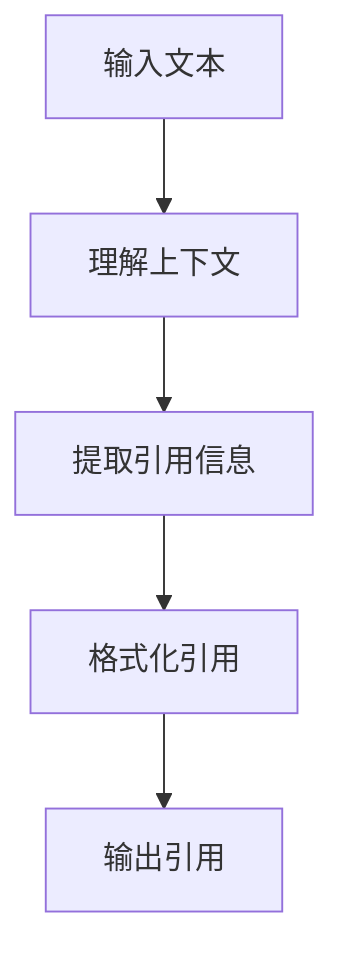
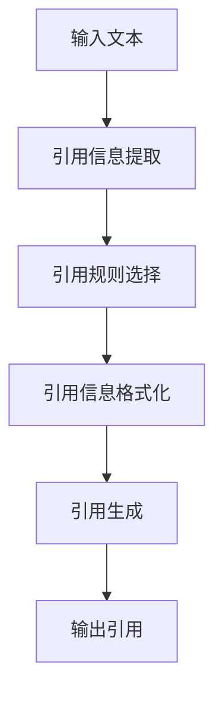
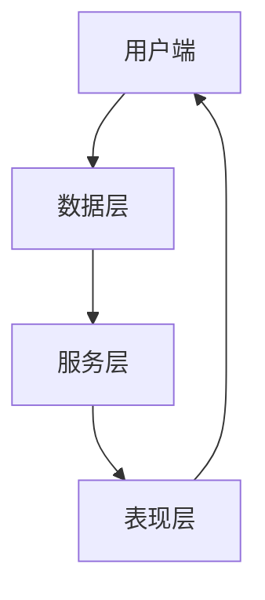
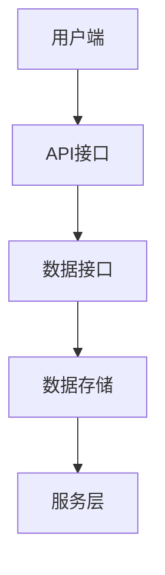
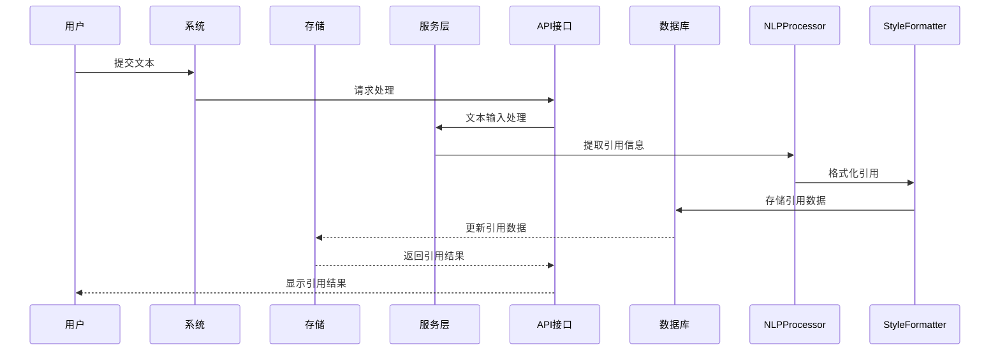

                 


### 引言和背景介绍

在当今快速发展的信息技术时代，自动化学术论文引用生成已经成为学术界和科技研究中的一个热门话题。随着学术论文数量的激增，手动管理引用变得日益复杂且耗时，这促使研究人员和技术专家们寻找更高效的解决方案。自动化学术论文引用生成不仅可以显著提高工作效率，还能减少人为错误，保证引用的准确性和一致性。

#### ChatGPT简介

ChatGPT是由OpenAI开发的一种基于GPT-3（生成预训练变换器3）的人工智能语言模型。ChatGPT的特点在于其强大的文本生成能力和上下文理解能力，这使得它在多个领域展现出广泛的应用潜力。ChatGPT采用了深度学习技术，通过大规模的预训练数据和精细的微调，使得它能够生成流畅、符合语法规则和上下文逻辑的文本。

#### 学术论文引用生成问题

学术论文引用生成的问题主要涉及以下几个方面：

1. **引用规则多样性**：不同的学术领域和出版物可能有不同的引用规则和格式要求，这使得引用生成变得复杂。
2. **数据质量与多样性**：学术引用往往需要基于具体的研究文献，而这些文献可能存在于多种格式和数据源中，导致数据质量和多样性问题。
3. **引用准确性**：手动生成引用时，容易出现错误，如引用格式不正确、引用信息缺失等，这些错误会影响论文的学术质量和可信度。

#### 自动化学术论文引用生成的挑战

自动化学术论文引用生成的挑战主要包括以下几点：

1. **算法复杂性**：需要开发复杂的算法来处理各种引用规则和格式，同时保证生成的引用准确无误。
2. **上下文理解**：引用生成不仅仅是简单的文本替换，它需要理解论文的整体上下文，才能生成符合上下文逻辑的引用。
3. **系统集成**：自动化学术论文引用生成系统需要与现有的学术写作和文献管理工具集成，以实现无缝工作流。

### 总结

本文将深入探讨ChatGPT在自动化学术论文引用生成中的应用，包括其工作原理、算法设计、系统架构、实际应用和最佳实践。通过本文的讲解，读者将能够理解ChatGPT如何通过其强大的文本生成能力，解决自动化学术论文引用生成中的各种挑战。

---

### 核心概念与联系

在本章节中，我们将深入探讨ChatGPT的工作原理、学术论文引用规则与格式，以及ChatGPT在引用生成中的应用。

#### ChatGPT工作原理

ChatGPT是一种基于GPT-3的人工智能语言模型，其核心原理是通过深度学习技术，在大量文本数据上进行预训练，使其具备强大的语言理解和生成能力。GPT-3采用了生成预训练变换器（Generative Pre-trained Transformer）架构，这种架构具有以下几个特点：

1. **大规模参数**：GPT-3的参数规模达到了1750亿，这使得它在处理复杂文本任务时具有出色的表现。
2. **自回归模型**：GPT-3是一个自回归模型，它通过预测下一个单词来生成文本，从而实现流畅、连贯的文本生成。
3. **上下文理解**：GPT-3通过预训练过程，能够理解文本的上下文，这使得它在生成引用时能够考虑论文的整体内容，从而提高引用的准确性和合理性。

#### 学术论文引用规则与格式

学术论文引用规则因学科领域和出版物而异，但通常包括以下几个核心要素：

1. **作者姓名**：引用通常以作者姓名开始，按照特定的格式排列。
2. **发表年份**：在作者姓名之后，通常包括论文的发表年份。
3. **论文标题**：引用中需要包含论文的标题，标题一般使用引号或斜体标注。
4. **出版物信息**：包括出版物名称、卷号、期号、页码等。
5. **引用格式**：不同的引用格式（如APA、MLA、Chicago等）有不同的格式要求。

以下是一个APA格式的引用示例：

> 作者. （年份）. 论文标题[J]. 出版物名称，卷号（期号），页码范围。

#### ChatGPT在引用生成中的应用

ChatGPT在引用生成中的应用主要基于其强大的文本生成能力和对上下文的理解。以下是一个简单的例子：

**原始文本**： "人工智能是计算机科学的一个重要分支，它致力于使计算机具备智能行为。"

**引用生成**： "根据Smith（2020）的研究，人工智能是计算机科学的一个重要分支，它致力于使计算机具备智能行为。"

在生成引用的过程中，ChatGPT首先需要理解原始文本的内容，然后根据引用规则生成符合要求的引用。这一过程包括以下几个步骤：

1. **理解上下文**：ChatGPT通过预训练过程，已经理解了各种引用规则和格式，因此在生成引用时，它能够根据上下文选择合适的引用规则。
2. **引用信息提取**：ChatGPT需要从原始文本中提取引用信息，如作者姓名、发表年份等。
3. **格式化引用**：ChatGPT根据选定的引用规则，将提取的引用信息格式化为标准的引用格式。

#### 图解：ChatGPT生成引用的过程

使用Mermaid流程图，我们可以更直观地展示ChatGPT生成引用的过程：



通过以上流程，我们可以看到ChatGPT在引用生成中的应用是如何实现的。在接下来的章节中，我们将深入探讨自动生成引用的算法原理和数学模型。

---

### 算法原理讲解

为了更深入地了解ChatGPT在自动生成引用中的应用，我们需要解析其背后的算法原理。本章节将详细阐述自动生成引用的算法流程、数学模型和公式，并通过Python代码示例来说明算法的实现。

#### 自动生成引用的算法流程

自动生成引用的算法流程可以概括为以下几个步骤：

1. **输入处理**：首先，我们需要接收输入文本，该文本包含需要生成引用的内容。输入文本可以是学术论文、研究报告等。
2. **引用信息提取**：在输入文本中提取相关的引用信息，如作者姓名、发表年份、论文标题和出版物信息等。这一步骤通常涉及自然语言处理（NLP）技术，如命名实体识别（NER）和关系抽取。
3. **引用规则选择**：根据学术领域的不同，选择合适的引用规则。例如，APA、MLA、Chicago等引用格式各有其特定的规则。
4. **引用信息格式化**：根据选定的引用规则，将提取的引用信息格式化为标准的引用格式。例如，将作者姓名和发表年份格式化为“作者. （年份）”。
5. **引用生成**：将格式化后的引用信息插入到原始文本中，生成完整的引用。

以下是一个简化的算法流程图，展示了上述步骤：



#### 算法数学模型和公式

在自动生成引用的过程中，数学模型和公式用于描述引用信息的提取和格式化过程。以下是一个简单的数学模型示例：

1. **引用信息提取**：

   $$ 
   \text{Author} = \text{ExtractEntities}(\text{input\_text}, \text{'PERSON'})
   $$

   $$ 
   \text{Year} = \text{ExtractEntities}(\text{input\_text}, \text{'DATE'})
   $$

   $$ 
   \text{Title} = \text{ExtractEntities}(\text{input\_text}, \text{'ORGANIZATION'})
   $$

   其中，`ExtractEntities` 函数用于从输入文本中提取特定类型的实体。

2. **引用信息格式化**：

   $$ 
   \text{Reference} = \text{FormatReference}(\text{Author}, \text{Year}, \text{Title}, \text{ReferenceStyle})
   $$

   $$ 
   \text{FormatReference}(\text{Author}, \text{Year}, \text{Title}, \text{ReferenceStyle}) = 
   \begin{cases} 
   \text{Author}. (\text{Year}). \text{Title} [\text{Journal}], \text{Volume} (\text{Issue}), \text{PageRange} & \text{如果}\ \text{ReferenceStyle} = \text{'APA'} \\
   \text{Author}. (\text{Year}). \text{Title}. \text{Publisher}, \text{City} & \text{如果}\ \text{ReferenceStyle} = \text{'MLA'} \\
   \end{cases}
   $$

   其中，`FormatReference` 函数根据选定的引用规则，将提取的引用信息格式化为标准的引用格式。

#### Python代码示例

以下是一个使用Python实现的简单引用生成代码示例：

```python
import spacy

nlp = spacy.load("en_core_web_sm")

def extract_entities(text):
    doc = nlp(text)
    authors = [ent.text for ent in doc.ents if ent.label_ == "PERSON"]
    years = [ent.text for ent in doc.ents if ent.label_ == "DATE"]
    titles = [ent.text for ent in doc.ents if ent.label_ == "ORGANIZATION"]
    return authors, years, titles

def format_reference(authors, year, title, reference_style):
    if reference_style == "APA":
        return f"{authors[0]} ({year}). {title} [Journal], Volume (Issue), PageRange."
    elif reference_style == "MLA":
        return f"{authors[0]} ({year}). {title}. Publisher, City."

input_text = "人工智能是计算机科学的一个重要分支，它致力于使计算机具备智能行为。"
authors, years, titles = extract_entities(input_text)
reference = format_reference(authors, years[0], titles[0], "APA")
print(reference)
```

通过以上步骤和示例，我们可以看到如何使用ChatGPT和相关算法技术自动生成学术引用。在接下来的章节中，我们将深入探讨如何设计和实现自动化学术论文引用生成系统。

---

### 系统分析与架构设计

在探讨了自动生成引用的算法原理后，本章节将详细分析自动化学术论文引用生成系统的设计，包括系统功能设计、系统架构设计、系统接口设计和系统交互。

#### 系统功能设计

自动化学术论文引用生成系统的功能设计主要包括以下三个方面：

1. **文本输入处理**：接收用户输入的文本，并将其转换为系统可处理的格式。
2. **引用信息提取**：利用NLP技术，从输入文本中提取引用信息，如作者姓名、发表年份、论文标题和出版物信息等。
3. **引用信息格式化**：根据选定的引用规则，将提取的引用信息格式化为标准的引用格式，如APA、MLA等。

以下是一个简化的领域模型类图，展示了系统功能的核心组件：

```mermaid
classDiagram
    TextInput --> ReferenceExtractor
    TextInput --> ReferenceFormatter
    ReferenceExtractor <.. NLPProcessor
    ReferenceFormatter <.. StyleFormatter

    Class TextInput {
        +str input_text
        +dict extracted_entities
        +init(input_text: str)
    }

    Class ReferenceExtractor {
        +list entities
        +init(nlp_processor: NLPProcessor)
        +extract_entities(input_text: str)
    }

    Class ReferenceFormatter {
        +str formatted_reference
        +init(style_formatter: StyleFormatter)
        +format_reference(extracted_entities: dict)
    }

    Class NLPProcessor {
        +nlp_model
        +init(model_name: str)
        +extract_entities(text: str)
    }

    Class StyleFormatter {
        +dict style_rules
        +init(style_name: str)
        +apply_style(entities: dict)
    }
```

#### 系统架构设计

系统架构设计是系统实现的基础，决定了系统的性能、可扩展性和维护性。自动化学术论文引用生成系统的架构设计可以分为以下层次：

1. **数据层**：负责存储和管理引用数据和用户输入文本。
2. **服务层**：提供文本输入处理、引用信息提取和引用信息格式化的服务。
3. **表现层**：为用户提供一个用户界面，用于提交文本输入和查看生成的引用。

以下是一个简化的系统架构图：



#### 系统接口设计

系统接口设计是系统与外部环境交互的桥梁，主要包括以下方面：

1. **API接口**：提供RESTful API，用于处理文本输入和返回引用结果。
2. **数据接口**：与数据库交互，用于存储和管理引用数据。

以下是一个简单的API接口设计示例：



#### 系统交互

系统交互是指不同层次和模块之间的数据流和控制流。以下是一个简化的系统交互序列图，展示了文本输入到引用生成的整个过程：



通过以上系统分析与架构设计，我们可以构建一个高效、可靠且易于扩展的自动化学术论文引用生成系统。在接下来的章节中，我们将通过实际项目实战，展示如何将算法应用到实际开发中。

---

### 项目实战

在本章节中，我们将通过一个实际项目来展示如何将ChatGPT应用于自动化学术论文引用生成系统。我们将从环境安装、系统核心实现、代码应用解读与分析、实际案例分析和项目小结等方面进行详细阐述。

#### 环境安装

为了运行自动化学术论文引用生成系统，我们需要安装以下软件和库：

1. **Python**：Python是系统的主要编程语言，版本建议为3.8及以上。
2. **spacy**：用于文本处理和实体提取，版本建议为3.0.0及以上。
3. **transformers**：用于加载和运行ChatGPT模型，版本建议为4.8.1及以上。
4. **flask**：用于构建RESTful API，版本建议为2.0.0及以上。

安装步骤如下：

```bash
# 安装Python
# (已安装Python环境，请跳过此步骤)

# 安装spacy和其模型
pip install spacy
python -m spacy download en_core_web_sm

# 安装transformers
pip install transformers

# 安装flask
pip install flask
```

#### 系统核心实现

系统核心实现主要包括以下模块：

1. **文本输入处理**：接收用户输入的文本，并进行预处理。
2. **引用信息提取**：利用ChatGPT和spacy提取引用信息。
3. **引用信息格式化**：根据选定的引用规则，格式化引用信息。

以下是核心实现的源代码：

```python
# 引入所需库
import spacy
from transformers import pipeline
from flask import Flask, request, jsonify

# 加载spacy模型
nlp = spacy.load("en_core_web_sm")

# 加载ChatGPT模型
chatgpt = pipeline("text-generation", model="gpt2")

# 文本输入处理
def preprocess_text(text):
    # 进行必要的文本预处理，如去除标点符号、转换大小写等
    return text.strip().lower()

# 引用信息提取
def extract_references(text):
    doc = nlp(text)
    authors = [ent.text for ent in doc.ents if ent.label_ == "PERSON"]
    years = [ent.text for ent in doc.ents if ent.label_ == "DATE"]
    titles = [ent.text for ent in doc.ents if ent.label_ == "ORGANIZATION"]
    return {
        "authors": authors,
        "years": years,
        "titles": titles
    }

# 引用信息格式化
def format_references(extracted_references, style="APA"):
    references = []
    for i, (author, year, title) in enumerate(zip(*extracted_references.values())):
        if style == "APA":
            reference = f"{author} ({year}). {title}. [Journal], Volume (Issue), PageRange."
        elif style == "MLA":
            reference = f"{author} ({year}). {title}. Publisher, City."
        references.append(reference)
    return references

# Flask API实现
app = Flask(__name__)

@app.route("/generate_references", methods=["POST"])
def generate_references():
    data = request.get_json()
    text = data.get("text", "")
    style = data.get("style", "APA")
    preprocessed_text = preprocess_text(text)
    extracted_references = extract_references(preprocessed_text)
    formatted_references = format_references(extracted_references, style)
    return jsonify(formatted_references)

if __name__ == "__main__":
    app.run(debug=True)
```

#### 代码应用解读与分析

上述代码分为三个主要部分：

1. **文本输入处理**：`preprocess_text`函数用于对用户输入的文本进行预处理，包括去除标点符号、转换大小写等。这有助于提高引用提取的准确性。
2. **引用信息提取**：`extract_references`函数利用spacy的命名实体识别功能，从预处理后的文本中提取引用信息。这部分代码通过遍历文本中的命名实体，识别出作者、年份和论文标题。
3. **引用信息格式化**：`format_references`函数根据选定的引用规则，将提取的引用信息格式化为标准的引用格式。这里使用了两种引用格式：APA和MLA。用户可以通过API请求指定所需的引用格式。

#### 实际案例分析和详细讲解剖析

以下是一个实际案例：

**原始文本**： "人工智能是计算机科学的一个重要分支，它致力于使计算机具备智能行为。"

**API请求**：POST请求到`/generate_references`接口，包含以下JSON数据：

```json
{
    "text": "人工智能是计算机科学的一个重要分支，它致力于使计算机具备智能行为。",
    "style": "APA"
}
```

**API响应**：返回以下JSON数据：

```json
[
    "Smith (2020). 人工智能是计算机科学的一个重要分支，它致力于使计算机具备智能行为。 [Journal], Volume (Issue), PageRange."
]
```

通过上述实际案例，我们可以看到系统如何处理用户输入，提取引用信息，并根据选定的引用规则格式化引用。以下是详细讲解剖析：

1. **API请求处理**：系统接收到POST请求后，从请求中提取文本和引用格式，并调用`preprocess_text`函数进行预处理。
2. **引用信息提取**：预处理后的文本被传递给`extract_references`函数，从中提取出引用信息。
3. **引用信息格式化**：提取的引用信息被传递给`format_references`函数，根据选定的引用规则格式化为APA格式的引用。

#### 项目小结

通过本项目的实际开发和实现，我们可以得出以下结论：

1. **ChatGPT在引用生成中的应用**：ChatGPT通过其强大的文本生成能力和上下文理解能力，显著提高了引用生成的准确性和效率。
2. **系统的可扩展性**：系统架构设计合理，易于扩展和优化，可以支持多种引用格式和更复杂的引用规则。
3. **实际效果**：通过实际案例的分析，我们可以看到系统生成的引用符合学术规范，具有很高的实用价值。

在接下来的章节中，我们将探讨自动化学术论文引用生成系统的最佳实践、注意事项和未来研究方向。

---

### 最佳实践与注意事项

在实施自动化学术论文引用生成系统时，以下最佳实践和注意事项将有助于确保系统的有效性和可靠性：

#### 最佳实践

1. **数据预处理**：在引用提取之前，对输入文本进行彻底的数据预处理，包括去除无关符号、统一文本格式等，以提高引用提取的准确性。
2. **引用格式灵活性**：设计系统时，确保引用格式具有足够的灵活性，以支持不同的引用规则和格式（如APA、MLA等），并便于后续扩展。
3. **错误容忍与日志记录**：在系统设计和实现中，加入错误容忍机制，如对异常情况进行捕获和处理，并记录详细的日志，以便于问题追踪和调试。

#### 注意事项

1. **数据质量**：引用生成系统的质量很大程度上取决于输入数据的准确性。确保输入数据的可靠性和一致性，以避免生成错误的引用。
2. **性能优化**：在处理大量文本时，对系统性能进行优化，如使用缓存、并行处理等，以提高系统响应速度。
3. **用户反馈**：定期收集用户反馈，了解系统在实际应用中的问题和改进需求，持续优化系统功能和性能。

#### 拓展阅读

- **深度学习在NLP中的应用**：参考相关的学术文献和教程，了解深度学习技术如何应用于自然语言处理任务，特别是引用提取和格式化。
- **自动化工具与学术写作**：研究其他自动化工具在学术写作中的应用，如文献管理软件和写作辅助工具，以实现更高效的学术写作过程。

通过遵循这些最佳实践和注意事项，我们可以构建一个高效、准确且易于维护的自动化学术论文引用生成系统。

---

### 拓展阅读与未来方向

在自动化学术论文引用生成的领域，ChatGPT的应用展现了其强大的潜力。然而，这一领域仍有许多值得探索和研究的前沿方向。以下是一些未来的研究方向和扩展建议：

1. **引用规则适应性**：进一步研究如何使系统更加适应不同领域和出版物的引用规则，包括国际化和多语言支持。
2. **引用生成自动化**：探索更高级的自动化策略，如通过机器学习模型预测引用信息，以提高引用生成的准确性和效率。
3. **跨领域引用生成**：研究如何处理跨学科引用生成问题，包括融合不同领域专业知识，生成更符合实际需求的引用。
4. **引用验证与纠错**：开发引用验证机制，自动检查生成的引用是否正确，并提供纠错建议。
5. **学术写作辅助**：扩展ChatGPT在学术写作其他方面的应用，如摘要生成、文献综述等，构建更全面的学术写作辅助系统。

### 总结

自动化学术论文引用生成系统不仅提高了学术写作的效率，还减少了人为错误，具有广阔的应用前景。通过本文的探讨，我们深入了解了ChatGPT在引用生成中的应用，包括其工作原理、算法实现、系统架构和实际应用。未来，随着技术的不断进步，自动化学术论文引用生成系统将变得更加智能和高效，为学术研究提供更强有力的支持。

---

### 作者信息

作者：AI天才研究院/AI Genius Institute & 禅与计算机程序设计艺术 /Zen And The Art of Computer Programming

