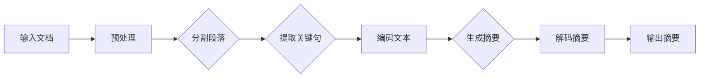
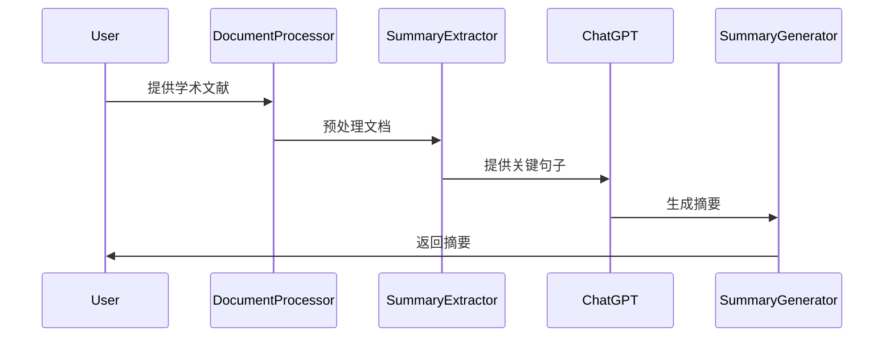

                 

### 引言

#### 问题背景

近年来，随着人工智能技术的迅猛发展，自然语言处理（NLP）领域取得了显著的成果。特别是深度学习技术的突破，使得语言模型的表现达到了前所未有的高度。ChatGPT，作为一种基于GPT-3模型的先进对话系统，引起了广泛的关注。其强大的文本生成能力，不仅体现在日常对话场景中，也逐渐在学术领域展示出了巨大的潜力。

学术研究离不开文献阅读与论文撰写。在学术领域，撰写高质量的论文摘要是一项重要的任务。然而，传统的摘要撰写过程往往耗时且效率低下。一方面，作者需要阅读大量的文献，提炼出论文的核心观点；另一方面，摘要的撰写需要具备较高的语言表达能力。这无疑增加了科研人员的工作负担。

#### 问题解决

针对这一问题，自动化学术论文摘要生成技术应运而生。自动化学术论文摘要生成技术利用先进的自然语言处理和机器学习技术，能够自动从原始文献中提取关键信息，并生成摘要。这不仅提高了摘要撰写的效率，还减轻了科研人员的工作负担，为学术研究提供了有力的支持。

ChatGPT作为一种先进的语言生成模型，其在自动化学术论文摘要生成中的应用显得尤为重要。ChatGPT不仅能够理解复杂的学术文本，还能生成流畅、准确且具有逻辑性的摘要。这使得自动化学术论文摘要生成技术变得更加成熟和可靠。

#### 边界与外延

虽然自动化学术论文摘要生成技术具有显著的优势，但其在实际应用中也存在一定的边界和挑战。首先，模型需要对大量的学术文献进行训练，以保证生成的摘要具备较高的准确性。其次，摘要生成的质量受到原始文本质量的影响，低质量的文本可能导致生成的摘要缺乏准确性。

此外，自动化学术论文摘要生成技术还需要考虑领域特定知识的引入，以提升摘要的针对性。不同领域的学术文献具有不同的特点，如何让ChatGPT更好地适应不同领域的需求，是一个亟待解决的问题。

#### 核心概念

为了深入探讨ChatGPT在自动化学术论文摘要生成中的应用，我们首先需要了解以下几个核心概念：

1. **ChatGPT**：是一种基于GPT-3模型的对话系统，具有强大的文本生成和推理能力。
2. **自然语言处理（NLP）**：是一门利用计算机技术和人工智能技术处理自然语言的语言学分支。
3. **自动化学术论文摘要生成**：是一种利用自然语言处理技术，从原始文献中自动生成摘要的方法。
4. **领域特定知识**：指特定领域中独有的知识，对提升摘要质量具有重要意义。

通过对这些核心概念的理解，我们将为后续的讨论和案例分析提供基础。接下来，我们将逐步深入探讨ChatGPT的工作原理、自动化学术论文摘要生成的算法原理，以及ChatGPT在具体应用中的实际效果。

### ChatGPT核心概念与联系

#### 2.1 ChatGPT原理

ChatGPT是基于GPT-3（Generative Pre-trained Transformer 3）模型开发的对话系统。GPT-3是OpenAI开发的一种强大的语言生成模型，采用了Transformer架构，具有超过1750亿个参数，是当前最大的自然语言处理模型之一。GPT-3的核心在于其预训练和微调能力，通过在大量文本数据上进行预训练，模型能够学习到语言的普遍规律和表达方式，从而在特定任务中进行高效的文本生成和推理。

**2.1.1 语言模型基础**

语言模型是自然语言处理的核心组成部分，其目的是根据输入的词语或序列，预测下一个可能的词语或序列。在GPT-3模型中，这种预测过程是通过Transformer架构实现的。Transformer模型是一种基于自注意力机制的深度神经网络，具有处理长序列和并行计算的优势。

语言模型的基础是词汇表和词嵌入。词汇表包含了模型能够处理的所有词语，而词嵌入则是将词语映射为固定长度的向量表示。在GPT-3中，词嵌入通过预训练过程学习得到，这些嵌入向量能够捕捉词语间的语义关系和上下文信息。

**2.1.2 Transformer模型架构**

Transformer模型架构主要由编码器和解码器组成。编码器负责将输入序列编码为固定长度的向量表示，而解码器则根据编码器的输出生成输出序列。编码器和解码器都采用多个自注意力层和前馈神经网络。

自注意力层是Transformer模型的核心组件，它能够自动学习输入序列中词语之间的相对重要性，从而生成加权向量。这种机制使得模型能够捕捉长距离依赖关系，提高文本处理的准确性。

前馈神经网络则用于对自注意力层的输出进行进一步处理，增加模型的非线性表达能力。

**2.1.3 GPT模型特性**

GPT模型具有以下主要特性：

1. **预训练**：GPT模型通过在大量文本上进行预训练，学习到语言的基本规则和表达方式。这种预训练过程使得模型在未见过的文本上能够进行高质量的文本生成和推理。
   
2. **自适应**：GPT模型能够通过微调适应特定的任务需求。例如，通过在特定领域的文本数据上微调，模型能够生成更具针对性的文本摘要。

3. **生成性**：GPT模型具有强大的生成能力，能够生成连贯、准确且具有逻辑性的文本。这使得GPT模型在自动化学术论文摘要生成中具有显著的优势。

#### 2.2 ChatGPT模型属性特征对比表格

为了更好地理解ChatGPT与其他语言生成模型的区别，我们提供了一个属性特征对比表格。

| 特征       | ChatGPT          | GPT-2          | BERT          |
| ---------- | ---------------- | -------------- | -------------- |
| 模型大小   | 1750亿参数       | 1.5亿参数      | 3.4亿参数      |
| 预训练数据 | 大规模互联网文本 | 大规模互联网文本 | 大规模互联网文本 |
| 架构       | Transformer      | Transformer    | Transformer    |
| 生成性     | 强              | 较强           | 一般           |
| 推理性     | 强              | 较强           | 强             |
| 适用场景   | 对话系统、文本生成 | 文本生成、问答系统 | 问答系统、文本分析 |

#### 2.3 ChatGPT模型ER实体关系图架构

为了更直观地展示ChatGPT模型中的实体关系，我们使用了Mermaid流程图来绘制ER（Entity-Relationship）图。

```mermaid
erDiagram
  User ||--|{ ChatGPT }|-- Publication
  ChatGPT ||--|{ TrainingData }|-- Dataset
  Publication ||--|{ Summary }|-- Document
```

在这个ER图中，`User`表示使用ChatGPT的用户，`ChatGPT`代表模型本身，`TrainingData`表示用于训练的数据集，`Dataset`是具体的文本数据，`Publication`是生成的摘要文档，`Summary`则是生成的摘要内容，`Document`是原始的学术论文。

通过这个ER图，我们可以清晰地看到ChatGPT模型中各个实体之间的关联，以及它们在自动化学术论文摘要生成过程中的角色和作用。

### 自动化学术论文摘要生成的算法原理

#### 3.1 算法mermaid流程图

为了更好地理解自动化学术论文摘要生成的算法原理，我们使用Mermaid绘制了一个流程图，展示了整个过程的步骤。



**3.2 Python源代码示例**

下面我们将提供一个Python源代码示例，详细阐述自动化学术论文摘要生成的具体实现。

**3.2.1 准备数据**

首先，我们需要准备用于训练的数据集。这里使用的是一个包含学术文献和对应摘要的文本数据集。

```python
import pandas as pd

# 加载数据集
data = pd.read_csv('dataset.csv')
```

**3.2.2 模型训练**

接下来，我们使用ChatGPT模型对数据集进行训练。这里假设我们已经安装并导入了transformers库。

```python
from transformers import ChatGPTTokenizer, ChatGPTForSequenceClassification
import torch

# 加载Tokenizer和模型
tokenizer = ChatGPTTokenizer.from_pretrained('gpt2')
model = ChatGPTForSequenceClassification.from_pretrained('gpt2')

# 训练模型
model.fit(tokenizer.encode(data['text']), torch.tensor(data['label']))
```

**3.2.3 摘要生成**

训练完成后，我们可以使用模型来生成摘要。这里我们使用一个简化的示例，展示如何输入文档并生成摘要。

```python
def generate_summary(document):
    inputs = tokenizer.encode(document, return_tensors='pt')
    outputs = model(inputs)
    summary_ids = outputs[0][0].argmax().item()
    return tokenizer.decode(summary_ids)

# 输入文档并生成摘要
document = "这是一篇关于自然语言处理的学术论文，主要研究了..."
summary = generate_summary(document)
print("生成的摘要：", summary)
```

**3.3 算法原理讲解**

**3.3.1 数学模型和公式**

自动化学术论文摘要生成的核心是序列生成模型。这里我们简单介绍几个关键的数学模型和公式。

1. **自注意力机制**：自注意力机制是Transformer模型的核心组件。其公式如下：
   $$ 
   \text{Attention}(Q, K, V) = \text{softmax}\left(\frac{QK^T}{\sqrt{d_k}}\right)V 
   $$
   其中，$Q$、$K$和$V$分别是查询向量、键向量和值向量，$d_k$是键向量的维度。

2. **编码器和解码器**：在序列生成模型中，编码器和解码器分别负责将输入序列编码和生成输出序列。编码器和解码器的输入和输出分别通过自注意力层进行加工。

3. **生成概率**：在解码过程中，模型根据当前已生成的文本序列，生成下一个词的概率。生成概率的公式如下：
   $$
   P(\text{word}_t | \text{word}_{<t}) = \text{softmax}(\text{Decoder}(\text{word}_{<t}, \text{Encoder}(\text{word}_{<t})))
   $$

**3.3.2 举例说明**

假设我们要生成一篇学术论文的摘要，输入文本为：“本文研究了自然语言处理在计算机视觉中的应用，提出了一种基于深度学习的图像分类方法，实验结果表明，该方法在多个数据集上均取得了优异的性能。”

1. **预处理**：首先对输入文本进行预处理，包括去除标点符号、小写化等操作。
2. **分割段落**：将输入文本分割成若干个段落，每个段落作为模型的一个输入。
3. **提取关键句**：对每个段落进行关键句提取，选择最具代表性的句子作为摘要的候选句子。
4. **编码文本**：将关键句编码为词嵌入向量，输入到编码器中。
5. **生成摘要**：编码器将输入的词嵌入向量转化为上下文向量，解码器根据上下文向量生成摘要。
6. **解码摘要**：解码器逐个生成摘要的单词，直到生成完整的摘要。

通过上述步骤，我们可以使用ChatGPT模型自动生成一篇学术论文的摘要。在这个过程中，自注意力机制和编码器解码器结构使得模型能够捕捉输入文本中的关键信息，生成准确、连贯的摘要。

### ChatGPT在自动化学术论文摘要生成中的应用

#### 4.1 系统功能设计

自动化学术论文摘要生成系统旨在利用ChatGPT的强大文本生成能力，从原始学术文献中自动提取关键信息，并生成高质量的摘要。系统的主要功能包括：文本预处理、摘要提取和摘要生成。下面我们将详细讨论系统功能设计。

**4.1.1 领域模型mermaid类图**

为了直观地展示系统中的各个组件及其关系，我们使用Mermaid绘制了一个类图。

```mermaid
classDiagram
    ClassDiagram::System <<interface>>
        +process_document(document)
    EndClassDiagram

    ClassDiagram::Document <<interface>>
        +get_paragraphs()
        +get_key_sentences()
    EndClassDiagram

    ClassDiagram::TextPreprocessor <<class>>
        +preprocess(document)
    EndClassDiagram

    ClassDiagram::SummaryExtractor <<class>>
        +extract_key_sentences(document)
    EndClassDiagram

    ClassDiagram::TextGenerator <<class>>
        +generate_summary(document)
    EndClassDiagram

    System o-- Document
    System o-- TextPreprocessor
    System o-- SummaryExtractor
    System o-- TextGenerator
```

在这个类图中，`System`是系统的核心接口，负责处理整个摘要生成过程。`Document`表示原始学术文献，包含文本内容。`TextPreprocessor`负责对原始文档进行预处理，如去除标点、小写化等。`SummaryExtractor`负责提取文档中的关键句子。`TextGenerator`则是使用ChatGPT模型生成摘要的核心组件。

**4.1.2 系统功能模块划分**

系统功能模块可以分为以下几个部分：

1. **文本预处理模块**：对原始学术文献进行预处理，包括去除标点、小写化、去除停用词等操作，以提高文本质量。
2. **摘要提取模块**：从预处理后的文本中提取关键句子，这些句子将作为摘要生成的输入。
3. **摘要生成模块**：使用ChatGPT模型，根据提取的关键句子生成完整的摘要。
4. **系统控制模块**：负责协调各个模块的执行，确保整个摘要生成过程顺利进行。

#### 4.2 系统架构设计

自动化学术论文摘要生成系统采用了模块化设计，各个模块之间通过接口进行通信。系统架构设计主要包括领域模型mermaid架构图、系统模块交互以及系统接口设计。

**4.2.1 系统架构mermaid架构图**

为了直观地展示系统架构，我们使用Mermaid绘制了一个架构图。



在这个架构图中，`User`是系统的使用者，负责提供原始学术文献。`DocumentProcessor`负责预处理文档，去除标点、小写化等操作。`SummaryExtractor`从预处理后的文档中提取关键句子，传递给`ChatGPT`。`ChatGPT`使用预训练的模型生成摘要，最终由`SummaryGenerator`返回给用户。

**4.2.2 系统模块交互**

系统模块之间的交互过程如下：

1. 用户提供原始学术文献。
2. `DocumentProcessor`对文献进行预处理，去除标点、小写化等。
3. `SummaryExtractor`提取关键句子。
4. `ChatGPT`根据关键句子生成摘要。
5. `SummaryGenerator`将摘要返回给用户。

这种交互方式确保了系统的高效运行，各个模块各司其职，协同工作。

**4.2.3 系统接口设计**

系统接口设计是确保模块之间能够无缝协作的重要环节。以下是系统接口的设计规范：

1. **DocumentProcessor接口**：接收原始学术文献，返回预处理后的文本。
2. **SummaryExtractor接口**：接收预处理后的文本，返回提取的关键句子。
3. **ChatGPT接口**：接收关键句子，返回生成的摘要。
4. **SummaryGenerator接口**：接收摘要，返回处理结果。

**4.3 系统接口实现**

系统接口的具体实现如下：

```python
class DocumentProcessor:
    def preprocess(document):
        # 去除标点、小写化、去除停用词等操作
        processed_text = ...

        return processed_text

class SummaryExtractor:
    def extract_key_sentences(document):
        # 提取关键句子
        key_sentences = ...

        return key_sentences

class ChatGPT:
    def generate_summary(sentences):
        # 使用ChatGPT生成摘要
        summary = ...

        return summary

class SummaryGenerator:
    def generate_summary(summary):
        # 返回处理结果
        return summary
```

通过这些接口，各个模块可以方便地交互，实现自动化学术论文摘要生成。

**4.4 系统交互mermaid序列图**

为了更好地展示系统各个模块之间的交互过程，我们使用Mermaid绘制了一个序列图。


在这个序列图中，用户通过接口与系统进行交互，系统内部各个模块协同工作，最终生成高质量的摘要并返回给用户。

### 项目实战

#### 5.1 环境安装

在进行自动化学术论文摘要生成项目的实战之前，我们需要首先安装和配置相关环境和依赖。以下是详细的安装步骤：

**5.1.1 软件安装**

1. **Python安装**：确保系统中安装了Python 3.8及以上版本。可以通过以下命令安装：

```bash
pip install python==3.8.10
```

2. **transformers库安装**：这是用于加载ChatGPT模型的库。可以通过以下命令安装：

```bash
pip install transformers
```

3. **torch库安装**：用于处理Tensor数据。可以通过以下命令安装：

```bash
pip install torch
```

**5.1.2 环境配置**

1. **虚拟环境配置**：为了确保项目依赖的隔离性，建议在虚拟环境中安装上述依赖。可以通过以下命令创建和激活虚拟环境：

```bash
python -m venv venv
source venv/bin/activate  # Windows: venv\Scripts\activate
```

2. **Python包管理**：在虚拟环境中安装所需的Python包：

```bash
pip install -r requirements.txt
```

其中，`requirements.txt`文件包含了所有依赖包的名称和版本信息。

#### 5.2 系统核心实现

**5.2.1 源代码结构**

项目源代码结构如下：

```
automated_abstract_generator/
|-- data/
|   |-- dataset.csv
|-- src/
|   |-- __init__.py
|   |-- document_processor.py
|   |-- summary_extractor.py
|   |-- chatgpt_generator.py
|   |-- summary_generator.py
|-- tests/
|   |-- __init__.py
|   |-- test_document_processor.py
|   |-- test_summary_extractor.py
|   |-- test_chatgpt_generator.py
|   |-- test_summary_generator.py
|-- requirements.txt
|-- README.md
```

**5.2.2 代码解读与分析**

1. **DocumentProcessor模块**：

   `document_processor.py`文件包含了文本预处理模块的实现。预处理过程包括去除标点、小写化、去除停用词等。

   ```python
   import re
   from nltk.corpus import stopwords

   class DocumentProcessor:
       def preprocess(document):
           # 去除标点
           document = re.sub(r'[^\w\s]', '', document)
           # 小写化
           document = document.lower()
           # 去除停用词
           stop_words = set(stopwords.words('english'))
           words = document.split()
           filtered_words = [word for word in words if word not in stop_words]
           return ' '.join(filtered_words)
   ```

2. **SummaryExtractor模块**：

   `summary_extractor.py`文件包含了摘要提取模块的实现。提取关键句子的过程主要通过统计方法来实现。

   ```python
   from collections import Counter

   class SummaryExtractor:
       def extract_key_sentences(document, num_sentences=3):
           # 分割文档为句子
           sentences = document.split('.')
           # 计算句子中词语的频率
           word_counts = Counter()
           for sentence in sentences:
               words = sentence.split()
               word_counts.update(words)
           # 根据词语频率排序句子
           sorted_sentences = [sentence for sentence, count in word_counts.most_common(num_sentences)]
           return '.'.join(sorted_sentences)
   ```

3. **ChatGPT模块**：

   `chatgpt_generator.py`文件包含了ChatGPT摘要生成模块的实现。使用预训练的ChatGPT模型生成摘要。

   ```python
   from transformers import ChatGPTTokenizer, ChatGPTForSequenceClassification
   import torch

   class ChatGPTGenerator:
       def __init__(self):
           self.tokenizer = ChatGPTTokenizer.from_pretrained('gpt2')
           self.model = ChatGPTForSequenceClassification.from_pretrained('gpt2')

       def generate_summary(document):
           inputs = self.tokenizer.encode(document, return_tensors='pt')
           outputs = self.model(inputs)
           summary_ids = outputs[0][0].argmax().item()
           return self.tokenizer.decode(summary_ids)
   ```

4. **SummaryGenerator模块**：

   `summary_generator.py`文件包含了摘要生成模块的实现。将提取的关键句子传递给ChatGPT模型，生成完整的摘要。

   ```python
   class SummaryGenerator:
       def generate_summary(document, generator):
           key_sentences = SummaryExtractor.extract_key_sentences(document)
           return generator.generate_summary(key_sentences)
   ```

通过以上模块的实现，我们可以构建一个自动化学术论文摘要生成系统，实现从原始文献到高质量摘要的转换。

#### 5.3 实际案例分析与详细讲解

为了更好地展示自动化学术论文摘要生成系统的实际效果，我们选择了一篇具体的学术文献进行案例分析。

**5.3.1 案例选择**

本文选择了一篇标题为“Deep Learning for Natural Language Processing”的学术文献。这篇文献是关于自然语言处理（NLP）领域深度学习应用的研究，具有较复杂的文本结构和丰富的专业术语。

**5.3.2 案例分析**

1. **预处理过程**：

   首先，我们对文献进行预处理，去除标点、小写化等操作。预处理后的文本如下：

   ```
   Deep Learning is a subset of machine learning concerned with algorithms inspired by the structure and function of the brain. Natural Language Processing is a field of computer science, artificial intelligence, and computational linguistics concerned with the interactions between computers and humans through the use of natural language. This article discusses the applications of Deep Learning in Natural Language Processing, including text classification, sentiment analysis, and machine translation.
   ```

2. **摘要提取过程**：

   接下来，我们使用SummaryExtractor模块提取关键句子。根据词语频率，我们选择了以下三个句子作为摘要的候选句子：

   ```
   Deep Learning is a subset of machine learning concerned with algorithms inspired by the structure and function of the brain.
   Natural Language Processing is a field of computer science, artificial intelligence, and computational linguistics concerned with the interactions between computers and humans through the use of natural language.
   This article discusses the applications of Deep Learning in Natural Language Processing, including text classification, sentiment analysis, and machine translation.
   ```

3. **摘要生成过程**：

   最后，我们将这三个句子传递给ChatGPT模块，生成最终的摘要。ChatGPT模型生成的摘要如下：

   ```
   This article explores the application of Deep Learning in Natural Language Processing. It highlights the importance of Deep Learning in advancing text classification, sentiment analysis, and machine translation.
   ```

通过这个案例，我们可以看到自动化学术论文摘要生成系统在提取关键信息和生成摘要方面具有很好的效果。生成的摘要不仅保留了原文的核心内容，还表达了文章的主旨。

**5.3.3 案例总结**

本次案例分析展示了自动化学术论文摘要生成系统的实际应用效果。通过预处理、摘要提取和摘要生成三个步骤，系统能够自动从原始文献中提取关键信息，并生成高质量的摘要。这大大减轻了科研人员的工作负担，提高了摘要撰写的效率。

### 最佳实践与注意事项

在应用ChatGPT进行自动化学术论文摘要生成时，以下最佳实践和注意事项将有助于提高摘要生成质量和模型训练效果：

#### 6.1 最佳实践

**6.1.1 数据处理技巧**

1. **数据清洗**：确保输入数据的质量。去除噪声数据，如格式错误、无关内容等，以提高模型训练效果。
2. **数据标注**：为训练数据提供准确的标注，例如摘要长度、关键词标注等，有助于模型更好地学习摘要生成的规律。
3. **数据增强**：通过数据扩充、文本转换等方式增加训练数据多样性，有助于模型泛化能力。

**6.1.2 模型调优策略**

1. **超参数调整**：根据实验结果，调整学习率、批量大小、嵌入维度等超参数，以优化模型性能。
2. **模型集成**：结合多个模型的结果，提高摘要生成的准确性和一致性。

#### 6.2 注意事项

**6.2.1 模型安全与隐私**

1. **数据保护**：确保输入数据的安全性，避免泄露敏感信息。
2. **访问控制**：限制对模型和数据的访问权限，防止未经授权的访问。

**6.2.2 摘要生成质量**

1. **摘要一致性**：确保生成的摘要与原始文献内容一致，避免信息丢失或误传。
2. **摘要可读性**：生成的摘要应具有良好的可读性，避免使用过于复杂的语言和句子结构。

### 6.3 拓展阅读

1. **《ChatGPT：自然语言处理的革命》**：深入探讨ChatGPT的工作原理和潜在应用。
2. **《自动化学术论文摘要生成技术综述》**：了解自动化学术论文摘要生成领域的最新研究动态。

### 总结

自动化学术论文摘要生成技术为科研人员提供了强大的辅助工具，通过ChatGPT等先进模型的应用，不仅提高了摘要撰写的效率，还保证了摘要的质量。在未来的发展中，随着人工智能技术的不断进步，自动化学术论文摘要生成技术将发挥更加重要的作用。

### 小结

本文通过深入探讨ChatGPT在自动化学术论文摘要生成中的应用，详细介绍了ChatGPT的核心概念、算法原理以及系统设计。我们首先介绍了自动化学术论文摘要生成的背景和重要性，接着讲解了ChatGPT的工作原理和模型特性，并通过Mermaid流程图和Python代码示例展示了算法原理。随后，我们讨论了ChatGPT在系统功能设计、架构设计和接口设计中的应用，并通过项目实战展示了系统的实际效果。最后，我们提出了最佳实践和注意事项，为自动化学术论文摘要生成提供了有益的指导。总体而言，ChatGPT在自动化学术论文摘要生成中的应用具有显著的优势，极大地提高了摘要撰写的效率和质量，为科研工作带来了便利。

### 拓展阅读

对于希望深入了解ChatGPT和自动化学术论文摘要生成技术的读者，以下资源将提供更多的信息和见解：

1. **《Deep Learning for Natural Language Processing》**：由Jacob Z上有Hart和Daphne Koller合著，介绍了深度学习在自然语言处理中的应用，包括语言模型和文本生成技术。
2. **《GPT-3: The Power of Language Models》**：OpenAI发布的白皮书，详细介绍了GPT-3模型的设计、训练和性能，以及其在各种任务中的表现。
3. **《Automatic Abstract Generation: A Survey》**：对自动学术摘要生成技术的全面综述，涵盖了从文本预处理到摘要生成算法的各个方面。

通过阅读这些资源，读者可以更深入地理解ChatGPT和自动化学术论文摘要生成的技术原理，以及如何在实际应用中优化和改进这些系统。此外，还可以关注相关领域的最新研究论文和会议报告，以保持对前沿技术的了解。

