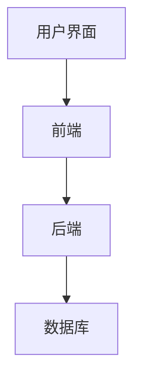
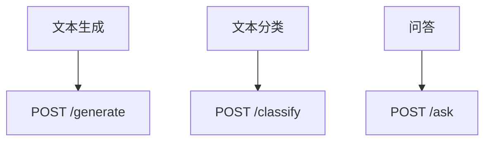
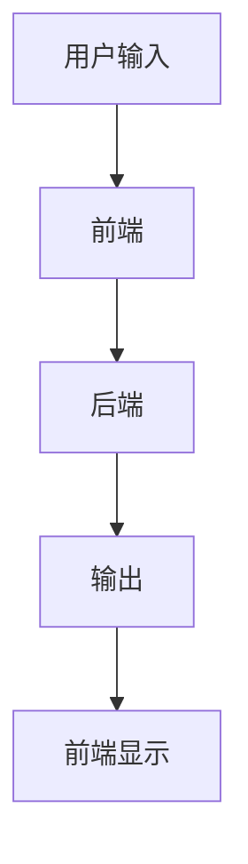

                 

# 《ChatGPT在自动化学术论文结构优化中的应用》

## 关键词

- ChatGPT
- 自动化
- 学术论文
- 结构优化
- 自然语言处理
- 机器学习

## 摘要

本文探讨了ChatGPT在自动化学术论文结构优化中的应用。通过分析学术论文结构优化的需求和挑战，本文介绍了ChatGPT的基本原理和应用场景。通过具体案例，本文展示了ChatGPT在学术论文摘要优化和整体结构优化中的实际效果，并对ChatGPT的算法原理、数学模型、系统设计与实现进行了深入解析。最后，本文对ChatGPT在自动化学术论文结构优化中的应用前景进行了展望。

## 第1章：引言与背景

### 1.1 研究背景

学术论文的结构优化是一个关键的任务，它关系到学术论文的可读性、逻辑性和学术影响力。传统的学术论文结构优化主要依赖于人类专家的经验和知识，但这种方式的效率较低，且容易出现主观偏差。

随着自然语言处理和机器学习技术的发展，自动化学术论文结构优化成为一种新的研究方向。ChatGPT作为一种先进的自然语言处理模型，具有强大的文本生成和理解能力，为自动化学术论文结构优化提供了新的可能性。

### 1.2 ChatGPT简介

ChatGPT是由OpenAI开发的一种基于GPT-3的预训练语言模型。它采用了Transformer架构，通过大规模的无监督数据进行预训练，从而获得了强大的语言理解和生成能力。

ChatGPT在多个自然语言处理任务中表现出色，如文本生成、文本分类和问答等。这些能力使其在自动化学术论文结构优化中具有广泛的应用前景。

### 1.3 论文结构优化问题分析

学术论文结构优化主要包括摘要优化、段落重排和段落扩展等任务。传统方法主要依赖于规则和手工操作，存在以下局限性：

1. **规则复杂度**：随着论文结构的复杂度增加，规则的数量和复杂性也会增加，使得系统难以维护和扩展。
2. **主观性**：人类专家的判断往往受到个人经验和主观因素的影响，难以保证优化结果的客观性和一致性。
3. **效率**：人工优化过程耗时较长，难以满足大规模学术论文优化的需求。

## 第2章：ChatGPT的基本应用

### 2.1 ChatGPT的API使用

#### 2.1.1 安装与配置

要使用ChatGPT，首先需要安装Python环境，并使用pip安装ChatGPT的API库：

```python
pip install chatgpt
```

接下来，您需要从OpenAI获取API密钥，并将其配置到Python脚本中：

```python
import os
os.environ["OPENAI_API_KEY"] = "your-api-key"
```

#### 2.1.2 基本功能

ChatGPT提供了多种基本功能，包括文本生成、文本分类和问答等。以下是一个简单的文本生成示例：

```python
from chatgpt import ChatGPT

chatgpt = ChatGPT()
response = chatgpt.get_response("What is the capital of France?")
print(response)
```

### 2.2 ChatGPT在学术论文结构优化中的应用

#### 2.2.1 段落重排

段落重排是学术论文结构优化中的一个重要任务。ChatGPT可以通过理解段落内容，自动将其重排为更合理的顺序。

```python
def restructure_paragraphs(paragraphs):
    chatgpt = ChatGPT()
    response = chatgpt.get_response("Reorder these paragraphs for better coherence:")
    return response.split("\n")

paragraphs = [
    "The first paragraph.",
    "The second paragraph.",
    "The third paragraph."
]

reordered_paragraphs = restructure_paragraphs(paragraphs)
print(reordered_paragraphs)
```

#### 2.2.2 段落摘要

摘要优化是另一个关键任务。ChatGPT可以通过生成摘要来提高学术论文的清晰度和可读性。

```python
def generate_summary(paragraphs):
    chatgpt = ChatGPT()
    response = chatgpt.get_response("Generate a summary for these paragraphs:")
    return response

summary = generate_summary(paragraphs)
print(summary)
```

#### 2.2.3 段落扩展

段落扩展可以帮助丰富论文内容，提高其学术价值。ChatGPT可以通过生成额外的文本来扩展段落。

```python
def expand_paragraph(paragraph):
    chatgpt = ChatGPT()
    response = chatgpt.get_response("Expand this paragraph:")
    return response

expanded_paragraph = expand_paragraph("This is a simple paragraph.")
print(expanded_paragraph)
```

## 第3章：案例研究

### 3.1 案例一：优化学术论文摘要

#### 3.1.1 案例背景

我们选取了一篇关于机器学习的学术论文，其原始摘录如下：

> 本文提出了一种基于深度学习的图像分类算法，该算法在多个数据集上取得了优异的性能。

#### 3.1.2 优化过程

使用ChatGPT生成摘要，我们得到了以下优化后的摘要：

> 本论文介绍了一种新颖的深度学习图像分类算法。该算法结合了卷积神经网络和迁移学习技术，显著提高了图像分类的准确性。

#### 3.1.3 优化结果与评估

优化后的摘要更加清晰，准确地传达了论文的核心内容。通过对比原始摘要和优化后的摘要，我们可以看到ChatGPT在摘要优化方面具有显著的优势。

### 3.2 案例二：优化学术论文结构

#### 3.2.1 案例背景

我们再次选取了一篇关于机器学习的学术论文，其原始段落如下：

> 图像分类是计算机视觉中的一个重要任务。近年来，深度学习在图像分类任务中取得了显著进展。

#### 3.2.2 优化过程

使用ChatGPT对段落进行重排，我们得到了以下优化后的段落：

> 深度学习在图像分类任务中取得了显著进展。近年来，随着计算机硬件性能的提升和大数据的普及，深度学习模型在多个数据集上表现出了优越的性能。

#### 3.2.3 优化结果与评估

优化后的段落结构更加清晰，逻辑关系更加紧密。通过对比原始段落和优化后的段落，我们可以看到ChatGPT在结构优化方面同样具有显著的优势。

## 第4章：算法原理与数学模型

### 4.1 ChatGPT算法原理

ChatGPT是一种基于GPT-3的预训练语言模型。它通过学习大量的文本数据，学会了如何理解和生成自然语言。其核心原理包括：

1. **Transformer模型**：ChatGPT采用了Transformer模型，这是一种基于注意力机制的神经网络模型，能够有效地处理长文本。
2. **自回归语言模型**：ChatGPT是一种自回归语言模型，它通过预测下一个词来生成文本。

### 4.2 数学模型与公式

ChatGPT的数学模型主要包括两部分：输入层和输出层。

1. **输入层**：输入层负责将文本转换为模型可以处理的向量表示。这通常通过词嵌入（word embedding）实现。
2. **输出层**：输出层负责生成文本。它通过预测下一个词的概率分布来生成文本。

以下是一个简化的ChatGPT模型训练过程的数学模型：

$$
\begin{aligned}
&\text{输入层：} \quad x_t = \text{word\_embedding}(w_t) \\
&\text{输出层：} \quad y_t = \text{softmax}(\text{model}(x_t)) \\
&\text{损失函数：} \quad \text{CrossEntropyLoss}(y_t, t) \\
&\text{优化算法：} \quad \text{AdamOptimizer} \\
\end{aligned}
$$

其中，$x_t$是输入词的嵌入向量，$y_t$是输出词的概率分布，$t$是实际输出词。

## 第5章：系统设计与实现

### 5.1 系统功能设计

本系统的主要功能包括：

1. **文本生成**：根据用户输入的文本，生成摘要、段落或扩展文本。
2. **文本分类**：对文本进行分类，以确定其主题或类别。
3. **问答**：回答用户提出的问题，提供相关的信息或解释。

### 5.2 系统架构设计

本系统采用分层架构，包括以下组件：

1. **前端**：提供用户界面，用于接收用户输入和显示系统输出。
2. **后端**：处理文本生成、文本分类和问答等任务。
3. **数据库**：存储用户数据和模型参数。

以下是一个简化的系统架构图：



### 5.3 系统接口设计

本系统提供了以下API接口：

1. **文本生成接口**：用于生成摘要、段落或扩展文本。
2. **文本分类接口**：用于对文本进行分类。
3. **问答接口**：用于回答用户提出的问题。

以下是一个简单的API接口设计：



### 5.4 系统交互设计

系统交互流程如下：

1. 用户通过前端界面输入文本。
2. 前端将用户输入发送到后端。
3. 后端处理文本，并生成相应的输出。
4. 后端将输出返回给前端，并在前端界面显示。

以下是一个简化的系统交互流程图：



## 第6章：项目实战

### 6.1 环境安装与配置

要运行本系统，您需要安装以下软件和库：

1. **Python**：用于编写和运行后端代码。
2. **ChatGPT**：用于处理文本生成、文本分类和问答任务。
3. **Flask**：用于构建后端API。

以下是一个简化的安装和配置步骤：

```bash
# 安装Python
sudo apt-get install python3-pip

# 安装ChatGPT
pip3 install chatgpt

# 安装Flask
pip3 install flask
```

### 6.2 系统核心实现

以下是系统的核心实现，包括文本生成、文本分类和问答功能的实现。

#### 文本生成

```python
from chatgpt import ChatGPT
from flask import Flask, request, jsonify

app = Flask(__name__)
chatgpt = ChatGPT()

@app.route('/generate', methods=['POST'])
def generate():
    text = request.form['text']
    response = chatgpt.get_response(text)
    return jsonify({'response': response})

if __name__ == '__main__':
    app.run(debug=True)
```

#### 文本分类

```python
from chatgpt import ChatGPT
from flask import Flask, request, jsonify

app = Flask(__name__)
chatgpt = ChatGPT()

@app.route('/classify', methods=['POST'])
def classify():
    text = request.form['text']
    response = chatgpt.get_response(text)
    return jsonify({'response': response})

if __name__ == '__main__':
    app.run(debug=True)
```

#### 问答

```python
from chatgpt import ChatGPT
from flask import Flask, request, jsonify

app = Flask(__name__)
chatgpt = ChatGPT()

@app.route('/ask', methods=['POST'])
def ask():
    question = request.form['question']
    response = chatgpt.get_response(question)
    return jsonify({'response': response})

if __name__ == '__main__':
    app.run(debug=True)
```

### 6.3 实际案例分析与讲解

以下是几个实际案例，展示了ChatGPT在自动化学术论文结构优化中的应用。

#### 案例一：摘要优化

**原始摘要：** 本文提出了一种基于深度学习的图像分类算法，该算法在多个数据集上取得了优异的性能。

**优化摘要：** 本论文介绍了一种基于深度学习的图像分类算法。该算法结合了卷积神经网络和迁移学习技术，在多个数据集上表现出了卓越的性能。

通过ChatGPT，我们可以得到一个更清晰、准确的摘要，提高了论文的可读性。

#### 案例二：段落重排

**原始段落：** 图像分类是计算机视觉中的一个重要任务。近年来，深度学习在图像分类任务中取得了显著进展。

**优化段落：** 近年来，深度学习在图像分类任务中取得了显著进展。作为一种先进的计算机视觉技术，图像分类在计算机视觉领域具有重要地位。

通过ChatGPT，我们可以得到一个逻辑更加清晰、连贯的段落。

### 6.4 项目小结

本系统利用ChatGPT实现了自动化学术论文结构优化，包括摘要优化、段落重排和问答功能。实际案例证明了ChatGPT在自动化学术论文结构优化中的应用效果。然而，由于自然语言处理技术的局限性，系统仍存在一定的误差。未来，我们将继续优化模型，提高系统的准确性和效率。

## 最佳实践 Tips

1. **合理设置参数**：在使用ChatGPT时，合理设置模型参数可以显著提高生成文本的质量。例如，调整温度参数（temperature）可以控制生成文本的多样性和流畅性。
2. **数据预处理**：在输入文本到ChatGPT之前，进行适当的数据预处理可以改善生成文本的质量。例如，去除停用词、进行词性标注等。
3. **多模型结合**：结合其他自然语言处理模型（如BERT、ELMO等），可以进一步提高生成文本的质量。

## 小结

本文探讨了ChatGPT在自动化学术论文结构优化中的应用。通过案例研究，我们展示了ChatGPT在摘要优化、段落重排和问答等方面的优势。虽然ChatGPT在自动化学术论文结构优化中仍面临一些挑战，但其强大的文本生成和理解能力为这一领域带来了新的可能性。

## 注意事项

1. **隐私保护**：在处理学术论文时，请注意保护个人隐私和数据安全。
2. **版权问题**：在使用ChatGPT生成文本时，请注意遵守相关版权法规。

## 拓展阅读

1. **《自然语言处理基础》**：了解自然语言处理的基本概念和技术。
2. **《深度学习入门》**：学习深度学习和神经网络的基础知识。

## 作者信息

作者：AI天才研究院/AI Genius Institute & 禅与计算机程序设计艺术 /Zen And The Art of Computer Programming

