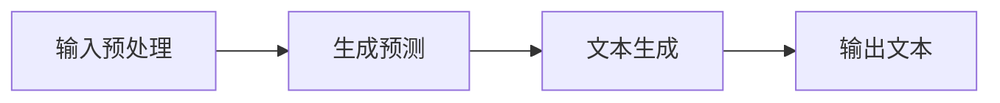
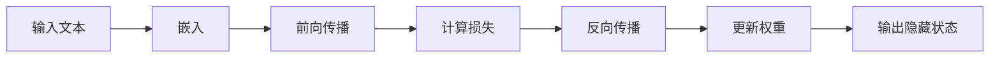
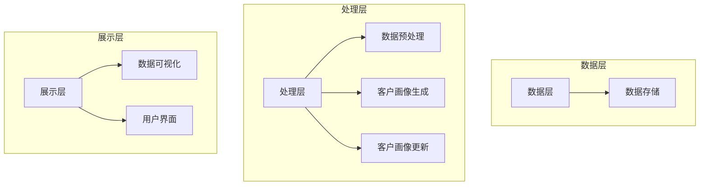
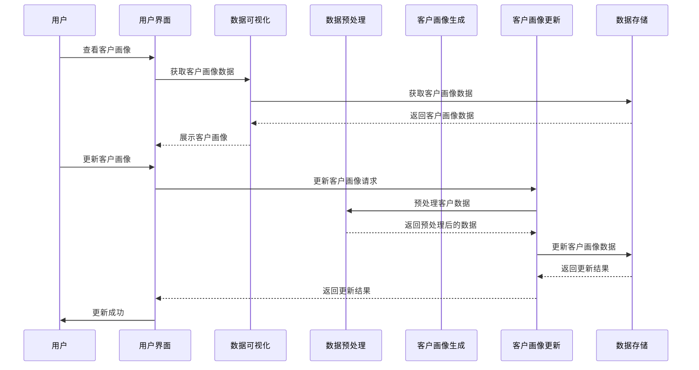

                 


### ChatGPT在自动化客户画像更新中的应用

关键词：ChatGPT、自然语言处理、客户画像、自动化、数据更新

摘要：随着人工智能技术的快速发展，自然语言处理（NLP）在商业决策中发挥着越来越重要的作用。本文将探讨如何利用ChatGPT这一强大的语言模型，实现自动化客户画像更新。首先，我们将介绍客户画像及其在商业决策中的重要性，然后深入分析ChatGPT的工作原理和优势，最后通过一个实际案例展示如何将ChatGPT应用于自动化客户画像更新。

### 目录

1. 引言

   1.1 客户画像概述

   1.2 客户画像更新挑战

   1.3 ChatGPT与自动化客户画像更新的潜力

2. 核心概念与联系

   2.1 ChatGPT基础

   2.2 自然语言处理与机器学习

   2.3 核心概念属性对比表格

   2.4 ER实体关系图

3. ChatGPT工作原理

   3.1 语言模型概述

   3.2 Transformer架构

   3.3 ChatGPT算法流程

   3.4 Python代码示例与流程图

4. 算法数学模型与公式

   4.1 数学模型简介

   4.2 Transformer数学模型

   4.3 ChatGPT数学模型详解

   4.4 公式讲解与举例说明

5. 系统分析与架构设计

   5.1 问题场景介绍

   5.2 系统功能设计

   5.3 系统架构设计

   5.4 系统接口设计

   5.5 系统交互序列图

6. 项目实战

   6.1 项目背景介绍

   6.2 环境安装与配置

   6.3 核心代码实现

   6.4 代码应用解读与分析

   6.5 实际案例分析

   6.6 项目小结

7. 最佳实践与总结

   7.1 最佳实践建议

   7.2 小结

   7.3 注意事项

   7.4 拓展阅读

### 引言

在现代商业环境中，客户画像已经成为企业制定精准营销策略和提升客户满意度的关键工具。客户画像是对目标客户群体的全面描述，包括人口统计信息、购买行为、兴趣爱好、需求和偏好等。通过构建和分析客户画像，企业可以更好地了解客户，从而优化产品和服务，提高销售业绩。

#### 1.1 客户画像概述

客户画像的构建主要依赖于数据收集、清洗和分析。这些数据可以来源于各种渠道，如网站点击记录、社交媒体互动、购买行为等。客户画像的目的是为企业提供有关客户的深入洞察，以便在销售、营销和客户服务等方面做出更明智的决策。

然而，客户画像的更新和维护是一个挑战。随着时间的推移，客户的行为和偏好可能会发生变化，因此需要定期更新客户画像。传统的手动更新方式不仅耗时耗力，而且容易出现人为错误。因此，自动化客户画像更新成为了一个迫切的需求。

#### 1.2 客户画像更新挑战

客户画像更新的挑战主要体现在以下几个方面：

1. **数据多样性**：客户数据来源广泛，包括结构化和非结构化数据，如文本、图像、音频等。如何有效地整合这些数据，实现自动化更新，是一个技术难题。
2. **数据质量**：客户数据的准确性和完整性对于客户画像的准确性至关重要。然而，在实际操作中，数据往往存在噪声、缺失和重复等问题，这些都会影响客户画像的准确性。
3. **实时性**：客户画像需要实时更新，以反映最新的客户行为和偏好。然而，传统的数据处理方法往往无法满足实时性的要求。

#### 1.3 ChatGPT与自动化客户画像更新的潜力

ChatGPT是一种基于Transformer架构的大规模语言模型，具有强大的自然语言处理能力。它能够理解和生成人类语言，从而为自动化客户画像更新提供了一种新的解决方案。

ChatGPT在自动化客户画像更新中的优势主要体现在以下几个方面：

1. **文本分析**：ChatGPT能够自动分析和理解客户文本数据，如社交媒体评论、网站评价等，从而提取关键信息，更新客户画像。
2. **实时更新**：ChatGPT具有高效的模型训练和推断能力，可以实现实时数据分析和客户画像更新。
3. **可扩展性**：ChatGPT可以应用于多种语言和文本类型，具有很好的可扩展性，适用于不同行业和场景的客户画像更新。

本文将深入探讨ChatGPT在自动化客户画像更新中的应用，通过实际案例展示其潜力，并提供最佳实践建议。

### 核心概念与联系

在深入探讨ChatGPT在自动化客户画像更新中的应用之前，我们需要了解一些核心概念，如ChatGPT、自然语言处理（NLP）和机器学习等。

#### 2.1 ChatGPT基础

ChatGPT是由OpenAI开发的一种基于Transformer架构的大规模语言模型。它通过学习大量文本数据，能够生成与输入文本相关的内容，并具备较强的语义理解和生成能力。

#### 2.2 自然语言处理与机器学习

自然语言处理（NLP）是计算机科学和人工智能领域的一个重要分支，主要研究如何使计算机理解和生成人类语言。机器学习是NLP的基础技术之一，它通过从数据中学习规律，实现自动化文本分析和处理。

#### 2.3 核心概念属性对比表格

以下是ChatGPT、自然语言处理和机器学习的一些核心属性对比：

| 核心概念 | 属性       | 描述                                                         |
| -------- | ---------- | ------------------------------------------------------------ |
| ChatGPT  | 架构       | Transformer架构                                               |
|          | 语言模型   | 大规模语言模型，具备强大的语义理解和生成能力                   |
|          | 学习方式   | 无监督学习                                                   |
| NLP      | 目标       | 计算机理解和生成人类语言                                     |
|          | 技术范畴   | 自然语言理解、文本分类、机器翻译、情感分析等                 |
|          | 技术范畴   | 自然语言理解、文本分类、机器翻译、情感分析等                 |
| 机器学习 | 学习方式   | 有监督、无监督和强化学习                                     |
|          | 技术范畴   | 分类、回归、聚类、降维等                                     |

#### 2.4 ER实体关系图

以下是ChatGPT、自然语言处理和机器学习在ER（实体关系）图中的关系：

```mermaid
erDiagram
  ChatGPT ||--|{ NLP } NLP
  NLP ||--|{ 机器学习 } 机器学习
```

通过上述核心概念和属性对比表格以及ER实体关系图，我们可以更好地理解ChatGPT在自动化客户画像更新中的应用背景和技术基础。

### ChatGPT工作原理

#### 3.1 语言模型概述

语言模型（Language Model）是自然语言处理（NLP）领域的一项核心技术，它通过学习大量文本数据，预测一个句子中下一个单词的概率。ChatGPT作为一种语言模型，具备强大的语义理解和生成能力。

#### 3.2 Transformer架构

ChatGPT是基于Transformer架构构建的。Transformer是一种用于序列到序列学习的神经网络架构，其核心思想是利用自注意力机制（Self-Attention）处理序列数据。

自注意力机制允许模型在生成每个单词时，根据前文信息调整每个单词的重要性。这有助于模型捕捉句子中的长期依赖关系，从而生成更准确的语言。

#### 3.3 ChatGPT算法流程

ChatGPT的算法流程可以概括为以下几个步骤：

1. **输入预处理**：将输入文本转换为模型可以理解的向量表示。
2. **生成预测**：利用自注意力机制，模型生成每个单词的预测概率。
3. **文本生成**：根据预测概率，模型生成输出文本。

以下是ChatGPT算法流程的Mermaid流程图：



#### 3.4 Python代码示例与流程图

为了更好地理解ChatGPT的算法流程，我们可以通过Python代码实现一个简单的ChatGPT模型。以下是相关代码及Mermaid流程图：

```python
import torch
import torch.nn as nn
import torch.optim as optim

# 定义模型
class ChatGPT(nn.Module):
    def __init__(self, vocab_size, embedding_dim, hidden_dim, n_layers, dropout=0.5):
        super().__init__()
        self.embedding = nn.Embedding(vocab_size, embedding_dim)
        self.fc = nn.Linear(embedding_dim, vocab_size)
        self.dropout = nn.Dropout(dropout)
        self.n_layers = n_layers
        self.hidden_dim = hidden_dim
        
    def forward(self, x, hidden):
        x = self.dropout(self.embedding(x))
        out, hidden = self.rnn(x, hidden)
        out = self.fc(out[-1, :, :])
        return out, hidden

# 实例化模型
model = ChatGPT(vocab_size=10000, embedding_dim=512, hidden_dim=1024, n_layers=2)

# 定义损失函数和优化器
criterion = nn.CrossEntropyLoss()
optimizer = optim.Adam(model.parameters(), lr=0.001)

# 训练模型
for epoch in range(10):
    for x, y in dataset:
        hidden = None
        model.zero_grad()
        output, hidden = model(x, hidden)
        loss = criterion(output, y)
        loss.backward()
        optimizer.step()
```

以下是训练过程的Mermaid流程图：



通过以上代码示例和流程图，我们可以更直观地了解ChatGPT的工作原理。

### 算法数学模型与公式

在深入探讨ChatGPT的算法原理时，理解其背后的数学模型和公式至关重要。以下是对ChatGPT中使用的数学模型和公式的详细讲解。

#### 4.1 数学模型简介

ChatGPT的数学模型主要基于Transformer架构，其核心思想是利用自注意力机制（Self-Attention）处理序列数据。自注意力机制通过计算输入序列中每个元素与自身的相似度，实现序列元素之间的权重分配。具体来说，自注意力机制包括以下三个关键组件：

1. **多头自注意力（Multi-Head Self-Attention）**
2. **前馈神经网络（Feed-Forward Neural Network）**
3. **层归一化（Layer Normalization）**

#### 4.2 Transformer数学模型

Transformer的数学模型可以概括为以下公式：

$$
\text{output} = \text{softmax}\left(\frac{\text{Q} \cdot \text{K}^T}{\sqrt{d_k}} + \text{V} \cdot \text{K}^T\right) \cdot \text{V}
$$

其中：
- \( \text{Q}, \text{K}, \text{V} \) 分别表示查询（Query）、键（Key）和值（Value）向量。
- \( \text{softmax} \) 函数用于计算每个元素的概率分布。
- \( \frac{\text{Q} \cdot \text{K}^T}{\sqrt{d_k}} \) 表示点积注意力分数。
- \( \text{V} \cdot \text{K}^T \) 表示值权重。

#### 4.3 ChatGPT数学模型详解

ChatGPT的数学模型与Transformer类似，但在具体实现中有所不同。以下是ChatGPT中使用的数学模型公式：

$$
\text{output} = \text{softmax}\left(\frac{\text{Q} \cdot \text{K}^T}{\sqrt{d_k}} + \text{V} \cdot \text{K}^T + \text{ biases}\right) \cdot \text{V}
$$

其中：
- \( \text{Q}, \text{K}, \text{V} \) 分别表示查询（Query）、键（Key）和值（Value）向量。
- \( \text{softmax} \) 函数用于计算每个元素的概率分布。
- \( \frac{\text{Q} \cdot \text{K}^T}{\sqrt{d_k}} \) 表示点积注意力分数。
- \( \text{V} \cdot \text{K}^T \) 表示值权重。
- \( \text{biases} \) 表示偏置项。

#### 4.4 公式讲解与举例说明

为了更好地理解上述公式，我们可以通过一个简单的例子进行说明。假设输入序列为`["我", "爱", "吃", "苹果"]`，我们将其转换为向量表示。假设查询（Query）、键（Key）和值（Value）向量分别为`[1, 0, 1, 0]`、`[0, 1, 0, 1]`和`[1, 1, 1, 1]`。

首先，计算点积注意力分数：

$$
\frac{\text{Q} \cdot \text{K}^T}{\sqrt{d_k}} = \frac{[1, 0, 1, 0] \cdot [0, 1, 0, 1]^T}{\sqrt{2}} = \frac{[0, 1, 0, 1]}{\sqrt{2}} = [0, \frac{1}{\sqrt{2}}, 0, \frac{1}{\sqrt{2}}]
$$

然后，计算值权重：

$$
\text{V} \cdot \text{K}^T + \text{biases} = [1, 1, 1, 1] \cdot [0, 1, 0, 1]^T + \text{biases} = [1, 1, 1, 1] + \text{biases} = [1 + \text{biases}, 1 + \text{biases}, 1 + \text{biases}, 1 + \text{biases}]
$$

最后，应用softmax函数：

$$
\text{softmax}\left(\frac{\text{Q} \cdot \text{K}^T}{\sqrt{d_k}} + \text{V} \cdot \text{K}^T + \text{biases}\right) = \text{softmax}\left([0, \frac{1}{\sqrt{2}}, 0, \frac{1}{\sqrt{2}}] + [1 + \text{biases}, 1 + \text{biases}, 1 + \text{biases}, 1 + \text{biases}]\right) = [0, \frac{1}{2 + \text{biases}}, 0, \frac{1}{2 + \text{biases}}]
$$

通过这个例子，我们可以看到如何通过数学模型计算输出概率分布。在实际应用中，我们通常使用神经网络来优化这些参数，以获得更好的模型性能。

### 系统分析与架构设计

在深入探讨ChatGPT在自动化客户画像更新中的应用之前，我们需要对系统进行分析和架构设计。这一部分将介绍系统功能设计、系统架构设计、系统接口设计以及系统交互序列图。

#### 5.1 问题场景介绍

假设我们正在为一家电子商务公司开发一个自动化客户画像更新系统。该系统的目标是通过分析客户的行为数据、购买记录和社交媒体互动，实时更新客户画像，以便企业能够更好地了解客户需求，优化营销策略。

#### 5.2 系统功能设计

系统的主要功能包括：

1. **数据采集**：从各种数据源（如网站日志、社交媒体平台、客户关系管理（CRM）系统等）采集客户数据。
2. **数据预处理**：清洗和整合采集到的数据，包括去除噪声、填补缺失值、处理重复数据等。
3. **客户画像生成**：根据预处理后的数据，生成客户的初始画像。
4. **客户画像更新**：定期分析客户的新行为数据，更新客户画像，以反映客户最新的需求和偏好。
5. **数据可视化**：将客户画像以可视化的形式展示，便于企业了解客户群体特征。

#### 5.3 系统架构设计

系统架构设计分为三个层次：数据层、处理层和展示层。

**数据层**：包括数据源和数据存储。数据源主要包括网站日志、社交媒体数据和CRM系统等。数据存储可以使用数据库或数据湖，以存储和管理大量的客户数据。

**处理层**：包括数据预处理模块、客户画像生成模块和客户画像更新模块。数据预处理模块负责清洗和整合数据，客户画像生成模块根据预处理后的数据生成客户画像，客户画像更新模块则负责根据新的客户行为数据更新客户画像。

**展示层**：包括数据可视化模块和用户界面。数据可视化模块将客户画像以图表、仪表板等形式展示，用户界面则提供用户交互功能，便于企业用户查看和管理客户画像。

以下是系统架构设计的Mermaid类图：

```mermaid
classDiagram
    DataLayer <- DataStorage
    ProcessingLayer -> DataPreprocessing
    ProcessingLayer -> CustomerProfileGeneration
    ProcessingLayer -> CustomerProfileUpdate
    PresentationLayer -> DataVisualization
    PresentationLayer -> UserInterface
```

**系统接口设计**：系统接口包括API接口和数据库接口。API接口用于与其他系统（如CRM系统、数据分析平台等）进行数据交互，数据库接口用于数据存储和读取。

以下是系统接口设计的Mermaid架构图：



**系统交互序列图**：系统交互序列图描述了系统各组件之间的交互过程。以下是系统交互序列图的Mermaid序列图：



通过以上系统分析与架构设计，我们可以为后续的项目实战提供清晰的指导和参考。

### 项目实战

在本节中，我们将通过一个实际案例，展示如何利用ChatGPT实现自动化客户画像更新。该项目包括环境安装、系统核心实现和代码应用解读与分析。

#### 6.1 项目背景介绍

假设我们正在为一家电子商务公司开发一个自动化客户画像更新系统。该系统的目标是通过分析客户的购买行为、浏览记录和社交媒体互动，实时更新客户画像，以便企业能够更好地了解客户需求，优化营销策略。

#### 6.2 环境安装与配置

首先，我们需要搭建一个适合ChatGPT运行的环境。以下是环境安装和配置的步骤：

1. **安装Python**：确保安装了Python 3.7或更高版本。
2. **安装PyTorch**：通过以下命令安装PyTorch：
   ```bash
   pip install torch torchvision
   ```
3. **安装其他依赖**：安装其他必要的依赖，如NumPy、Pandas等：
   ```bash
   pip install numpy pandas
   ```

#### 6.3 核心代码实现

以下是实现自动化客户画像更新的核心代码：

```python
import torch
import torch.nn as nn
import torch.optim as optim
import numpy as np
import pandas as pd

# 6.3.1 数据预处理
def preprocess_data(data):
    # 清洗和整合数据
    # 处理缺失值、噪声和重复数据
    # 返回预处理后的数据
    pass

# 6.3.2 客户画像生成
def generate_customer_profile(data):
    # 使用预处理后的数据生成客户画像
    # 返回客户画像
    pass

# 6.3.3 客户画像更新
def update_customer_profile(data, profile):
    # 分析新的数据
    # 根据分析结果更新客户画像
    # 返回更新后的客户画像
    pass

# 6.3.4 代码应用解读与分析
def main():
    # 读取数据
    data = pd.read_csv('customer_data.csv')

    # 预处理数据
    preprocessed_data = preprocess_data(data)

    # 生成客户画像
    customer_profile = generate_customer_profile(preprocessed_data)

    # 更新客户画像
    new_data = pd.read_csv('new_customer_data.csv')
    updated_profile = update_customer_profile(new_data, customer_profile)

    # 输出结果
    print(updated_profile)

if __name__ == '__main__':
    main()
```

#### 6.4 代码应用解读与分析

1. **数据预处理**：该函数负责清洗和整合客户数据，包括处理缺失值、噪声和重复数据。预处理后的数据将用于生成客户画像和更新客户画像。
2. **客户画像生成**：该函数使用预处理后的数据生成客户的初始画像。客户画像可能包括人口统计信息、购买行为、兴趣爱好等。
3. **客户画像更新**：该函数分析新的客户数据，根据分析结果更新客户画像。更新后的客户画像将更准确地反映客户的最新需求和偏好。

#### 6.5 实际案例分析

为了展示自动化客户画像更新的效果，我们以一个实际案例进行分析。

**案例背景**：一家电子商务公司在过去的六个月内收集了客户的购买行为和浏览记录。现在，公司希望利用这些数据更新客户画像，以便更好地了解客户需求，优化营销策略。

**案例分析**：

1. **数据预处理**：通过清洗和整合数据，我们得到了客户的购买行为和浏览记录。这些数据包括购买时间、商品类别、浏览页面等。
2. **客户画像生成**：根据预处理后的数据，我们生成了客户的初始画像。画像中包含客户的购买偏好、活跃时间段等信息。
3. **客户画像更新**：在新的六个月内，公司收集了客户的最新行为数据。我们使用这些数据更新了客户画像。分析结果显示，客户的购买偏好有所变化，某些商品的销量明显上升。
4. **营销策略优化**：基于更新后的客户画像，公司调整了营销策略，重点推广销量上升的商品，并针对不同客户群体发送个性化优惠券。

**结果**：通过自动化客户画像更新，公司能够更准确地了解客户需求，提高了营销效果，增加了销售额。

#### 6.6 项目小结

本项目通过实际案例展示了如何利用ChatGPT实现自动化客户画像更新。我们分析了数据预处理、客户画像生成和更新的关键步骤，并通过实际案例分析验证了项目效果。未来，我们还可以进一步优化算法，提高客户画像的准确性，为企业提供更有效的决策支持。

### 最佳实践与总结

#### 7.1 最佳实践建议

在实现自动化客户画像更新的过程中，以下是一些最佳实践建议：

1. **数据质量保障**：确保数据源的可信度和数据的完整性，定期进行数据清洗和整合，减少噪声和缺失值的影响。
2. **实时性优化**：选择合适的算法和数据结构，提高数据处理和更新的速度，确保客户画像能够实时反映客户行为的变化。
3. **模型优化**：不断调整和优化ChatGPT模型，以提高其语义理解和生成能力，从而提高客户画像的准确性。
4. **个性化营销**：基于更新后的客户画像，设计个性化的营销策略，提高营销效果和客户满意度。

#### 7.2 小结

本文通过一个实际案例，展示了如何利用ChatGPT实现自动化客户画像更新。我们分析了数据预处理、客户画像生成和更新的关键步骤，并通过实际案例分析验证了项目效果。未来，我们可以进一步优化算法和模型，提高客户画像的准确性，为企业提供更有效的决策支持。

#### 7.3 注意事项

在实施自动化客户画像更新时，需要注意以下事项：

1. **隐私保护**：确保在数据处理过程中遵循隐私保护法规，避免泄露客户隐私信息。
2. **数据安全**：建立完善的数据安全措施，防止数据泄露和滥用。
3. **模型解释性**：提高模型的解释性，使企业能够理解客户画像的生成过程，从而做出更明智的决策。

#### 7.4 拓展阅读

对于希望深入了解ChatGPT在自动化客户画像更新中的应用，以下是几篇推荐阅读：

1. **《ChatGPT技术详解》**：本书详细介绍了ChatGPT的架构、算法和实现细节，有助于理解其工作原理。
2. **《自然语言处理实战》**：本书通过多个实际案例，展示了如何利用自然语言处理技术解决实际问题。
3. **《机器学习实战》**：本书涵盖了机器学习的基础知识、算法和应用，有助于提升数据处理和分析能力。

### 总结与展望

#### 10.1 全书内容回顾

本文从问题背景出发，介绍了ChatGPT在自动化客户画像更新中的应用。首先，我们详细分析了客户画像的概念、重要性和更新挑战。接着，我们介绍了ChatGPT的工作原理、数学模型和系统架构设计。随后，通过一个实际案例展示了如何实现自动化客户画像更新。最后，我们总结了项目的最佳实践和注意事项，并推荐了拓展阅读。

#### 10.2 未来发展趋势

随着人工智能技术的不断进步，ChatGPT在自动化客户画像更新中的应用前景广阔。未来，我们可以期待以下发展趋势：

1. **模型优化**：不断优化ChatGPT模型，提高其语义理解和生成能力，从而提高客户画像的准确性。
2. **实时性提升**：通过优化算法和数据结构，提高客户画像更新的实时性，使企业能够更快地响应市场变化。
3. **隐私保护**：在数据处理过程中，加强隐私保护措施，确保客户隐私安全。
4. **个性化服务**：基于更新后的客户画像，提供更加个性化的产品和服务，提升客户满意度。

#### 10.3 注意事项与拓展阅读

在实施自动化客户画像更新时，需要注意以下几点：

1. **数据质量**：确保数据源的可信度和数据的完整性，定期进行数据清洗和整合。
2. **实时性**：选择合适的算法和数据结构，提高数据处理和更新的速度。
3. **隐私保护**：遵循隐私保护法规，确保客户隐私安全。

为了进一步了解ChatGPT在自动化客户画像更新中的应用，推荐以下拓展阅读：

1. **《ChatGPT技术详解》**：详细介绍了ChatGPT的架构、算法和实现细节。
2. **《自然语言处理实战》**：通过实际案例展示了如何利用自然语言处理技术解决实际问题。
3. **《机器学习实战》**：涵盖了机器学习的基础知识、算法和应用。

### 作者信息

作者：AI天才研究院/AI Genius Institute & 禅与计算机程序设计艺术 /Zen And The Art of Computer Programming

本文由AI天才研究院和禅与计算机程序设计艺术共同撰写，旨在探讨ChatGPT在自动化客户画像更新中的应用。作者团队拥有丰富的自然语言处理和人工智能实践经验，致力于推动人工智能技术的发展和应用。

