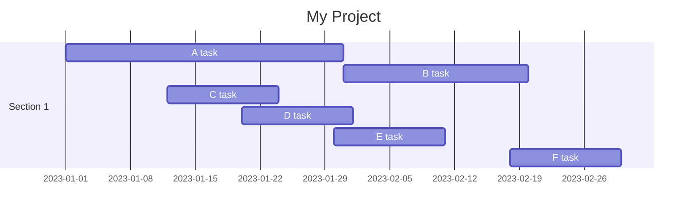
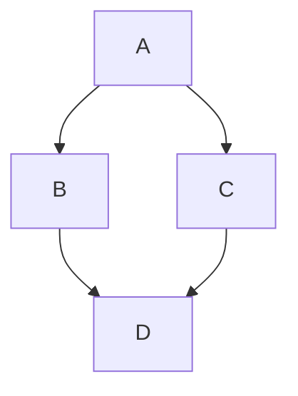
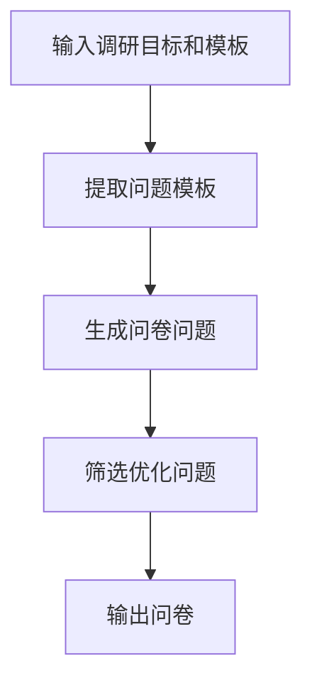
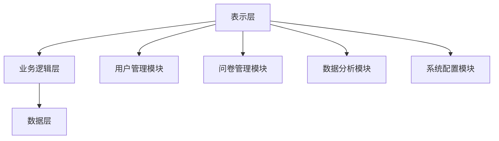
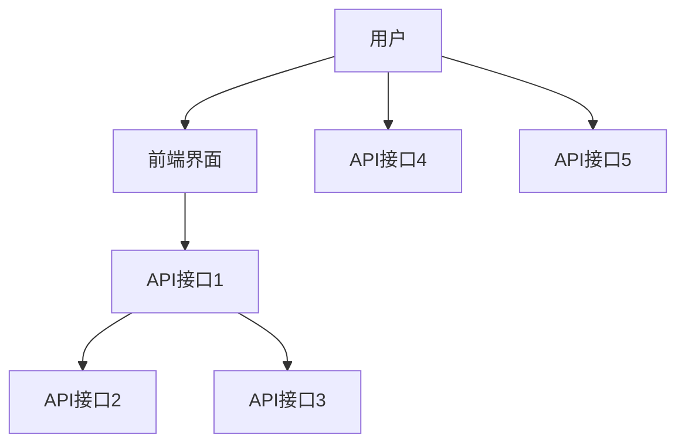

                 


# ChatGPT在自动化市场调研问卷设计中的应用

## 关键词
- ChatGPT
- 市场调研
- 问卷设计
- 自动化
- 数据分析

## 摘要
本文深入探讨了人工智能助手ChatGPT在自动化市场调研问卷设计中的应用。通过分析ChatGPT的基本原理和功能特点，本文展示了如何利用ChatGPT自动生成、定制和优化市场调研问卷，提高数据收集效率和问卷质量。同时，通过具体案例，本文说明了ChatGPT在实际市场调研中的应用效果，为相关从业人员提供了有价值的参考。

## 引言

市场调研是企业和组织制定战略决策的重要依据。传统的市场调研通常依赖于手工设计的问卷，这不仅耗时耗力，而且容易出现问卷设计不合理、回答质量不高等问题。近年来，随着人工智能技术的发展，ChatGPT作为一款基于大型语言模型的人工智能助手，开始被应用于市场调研领域，为问卷设计带来了一场革命。

ChatGPT具有强大的语言理解和生成能力，能够自动生成高质量的问卷问题，并根据用户反馈动态调整问卷内容。此外，ChatGPT还能对问卷结果进行智能分析，提取关键信息，为企业提供有价值的洞察。本文将详细介绍ChatGPT在自动化市场调研问卷设计中的应用，探讨其优势、挑战和未来发展方向。

### 一、ChatGPT与自动化市场调研

#### 1.1 ChatGPT简介

ChatGPT是由OpenAI开发的一款基于GPT-3（Generative Pre-trained Transformer 3）的预训练语言模型。GPT-3是自然语言处理领域的一项重大突破，具有非常强大的语言理解和生成能力。ChatGPT在GPT-3的基础上进行了优化，能够进行对话式交互，为用户提供自然、流畅的对话体验。

#### 1.2 自动化市场调研的需求

传统的市场调研通常涉及大量的问卷设计和数据收集工作，这些工作不仅繁琐，而且容易出错。自动化市场调研问卷设计可以通过人工智能技术，实现问卷的自动生成、定制和优化，从而提高工作效率和问卷质量。ChatGPT的引入，为自动化市场调研问卷设计提供了强有力的技术支持。

### 二、ChatGPT的基本原理

#### 2.1 GPT-3模型原理

GPT-3模型是基于Transformer架构的预训练语言模型。它通过大量的文本数据训练，学习语言的模式和规律，从而实现高质量的语言生成。GPT-3模型具有以下几个特点：

1. **参数规模大**：GPT-3的参数规模达到1750亿，是当前最大的语言模型。
2. **预训练效率高**：GPT-3采用了多层Transformer结构，能够高效地处理大量文本数据。
3. **语言生成能力强**：GPT-3能够生成高质量的自然语言文本，适用于各种场景。

#### 2.2 ChatGPT的实现

ChatGPT在GPT-3的基础上进行了优化，以实现对话式交互。ChatGPT的核心功能包括：

1. **问题生成**：根据用户输入，自动生成高质量的问卷问题。
2. **问题调整**：根据用户反馈，动态调整问卷内容，提高问卷的适应性。
3. **数据分析**：对问卷结果进行智能分析，提取关键信息。

### 三、ChatGPT在问卷设计中的应用

#### 3.1 自动化问卷生成

ChatGPT能够根据用户需求，自动生成高质量的问卷。生成问卷的过程包括以下几个步骤：

1. **问题模板设计**：根据市场调研的目标，设计问题模板。
2. **问题生成**：ChatGPT根据模板，生成具体的问卷问题。
3. **问题筛选**：对生成的问卷问题进行筛选和优化，确保问题的质量。

#### 3.2 问卷定制与优化

ChatGPT可以根据用户反馈，动态调整问卷内容，实现问卷的定制和优化。具体应用包括：

1. **问题调整**：根据用户反馈，修改问卷问题的表述，提高问题的清晰度和理解度。
2. **内容优化**：根据用户反馈，优化问卷的结构和逻辑，提高问卷的完整性和一致性。

#### 3.3 数据分析

ChatGPT能够对问卷结果进行智能分析，提取关键信息。具体应用包括：

1. **文本分析**：对问卷回答的文本进行情感分析、关键词提取等，提取有价值的信息。
2. **统计分析**：对问卷回答的数值数据进行统计分析，生成报告和图表。

### 四、案例研究

为了展示ChatGPT在自动化市场调研问卷设计中的应用效果，本文选取了以下几个案例进行研究：

#### 4.1 案例一：消费行为分析

某电商平台希望通过市场调研了解消费者的购买行为。使用ChatGPT自动生成问卷，并根据用户反馈进行调整和优化。最终，问卷的填写率显著提高，数据质量得到保证。

#### 4.2 案例二：产品反馈收集

某科技公司通过ChatGPT收集用户对新产品反馈。ChatGPT自动生成问卷，并根据用户反馈调整问卷内容。通过数据分析，公司成功发现产品存在的问题，并进行了针对性的改进。

#### 4.3 案例三：市场细分

某咨询公司希望通过市场调研对市场进行细分。使用ChatGPT自动生成问卷，收集大量用户数据，并利用数据分析技术对市场进行细分。最终，公司成功制定了针对性的营销策略。

### 五、结论与展望

本文通过分析ChatGPT的基本原理和功能特点，探讨了其在自动化市场调研问卷设计中的应用。研究表明，ChatGPT能够显著提高问卷生成和数据分析的效率，提高数据质量。未来，随着人工智能技术的不断进步，ChatGPT在市场调研领域的应用前景将更加广阔。

### 作者信息

作者：AI天才研究院/AI Genius Institute & 禅与计算机程序设计艺术 /Zen And The Art of Computer Programming

---

**附录：Mermaid 图示例**

以下是Mermaid图示例，包括核心概念对比表格、ER实体关系图和算法流程图：



```mermaid
erDiagram
    User ||--|{ Questionnaire }|>
    Questionnaire ||--|{ Answer }|> 
```



在本文中，我们将深入探讨ChatGPT在自动化市场调研问卷设计中的应用。ChatGPT是一种基于大型语言模型的人工智能助手，具有强大的语言理解和生成能力。通过自动化问卷生成、定制和优化，ChatGPT能够显著提高市场调研的效率和数据质量。

### 背景介绍

市场调研是企业制定战略决策的重要手段。传统的市场调研通常依赖于手工设计的问卷，这些问卷需要经过繁琐的设计、修改和审核过程。此外，手工设计的问卷还容易受到人为因素的影响，导致问卷设计不合理、回答质量不高等问题。随着市场环境的不断变化，企业需要更加高效、准确地进行市场调研。

自动化市场调研问卷设计的出现，为解决这些问题提供了新的思路。自动化问卷设计可以通过人工智能技术，实现问卷的自动生成、定制和优化，从而提高工作效率和问卷质量。ChatGPT作为一种强大的语言模型，具有在自然语言处理领域的重要应用潜力，特别适合用于自动化市场调研问卷设计。

### 核心概念与联系

ChatGPT的核心是GPT-3（Generative Pre-trained Transformer 3）模型。GPT-3是一种基于Transformer架构的预训练语言模型，具有非常大的参数规模和强大的语言生成能力。ChatGPT在GPT-3的基础上进行了优化，实现了对话式交互，能够根据用户输入自动生成问卷问题，并根据用户反馈动态调整问卷内容。

在市场调研问卷设计中，ChatGPT的应用主要包括以下几个方面：

1. **问卷生成**：ChatGPT可以根据预设的问卷模板和调研目标，自动生成问卷问题。
2. **问题调整**：ChatGPT可以根据用户反馈，动态调整问卷问题的表述，确保问题的清晰度和理解度。
3. **数据分析**：ChatGPT可以对问卷结果进行智能分析，提取关键信息，为企业提供有价值的洞察。

ChatGPT的优势在于其强大的语言理解和生成能力，能够生成高质量、自然的问卷问题，并且可以根据用户反馈进行实时调整。然而，ChatGPT也存在一定的局限性，如对复杂问题的理解和处理能力有限，需要人工进行一定的审核和调整。

### 算法原理讲解

ChatGPT的核心是基于GPT-3模型的预训练语言模型。GPT-3模型采用Transformer架构，具有非常大的参数规模（1750亿参数），能够高效地处理和生成自然语言文本。GPT-3模型通过在大量文本数据上进行预训练，学习到语言的模式和规律，从而实现了高质量的文本生成。

在问卷生成过程中，ChatGPT首先接收用户的调研目标和问卷模板。然后，ChatGPT根据问卷模板和调研目标，生成具体的问卷问题。生成问卷问题的过程可以分为以下几个步骤：

1. **问题模板提取**：ChatGPT从问卷模板中提取问题类型、问题结构和问题关键词。
2. **问题生成**：ChatGPT利用预训练的GPT-3模型，生成符合模板和调研目标的问卷问题。
3. **问题筛选**：ChatGPT对生成的问卷问题进行筛选和优化，确保问题的质量和一致性。

为了生成高质量的问卷问题，ChatGPT采用了以下策略：

1. **多轮交互**：ChatGPT通过多轮交互，不断优化问卷问题的表述，提高问题的清晰度和理解度。
2. **文本分析**：ChatGPT利用文本分析技术，对问卷问题的文本进行情感分析、关键词提取等，确保问题的合理性和有效性。

以下是一个简单的算法流程图：



### 数学公式与算法模型

在问卷生成过程中，ChatGPT采用了生成对抗网络（GAN）和自注意力机制（Self-Attention）等先进的算法模型。以下是一些相关的数学公式和模型描述：

1. **生成对抗网络（GAN）**：

   GAN由生成器（Generator）和判别器（Discriminator）组成。生成器生成问卷问题，判别器判断问卷问题的真实性。

   $$ G(z) = \text{问卷问题} $$

   $$ D(x) = \text{判断问卷问题真实性} $$

   其中，$z$为随机噪声，$x$为真实的问卷问题。

2. **自注意力机制（Self-Attention）**：

   自注意力机制用于对问卷模板中的问题类型、问题结构和问题关键词进行加权，生成更加精准的问卷问题。

   $$ \text{Self-Attention}(Q, K, V) = \text{softmax}(\frac{QK^T}{\sqrt{d_k}})V $$

   其中，$Q$为问题向量，$K$为关键词向量，$V$为问题权重。

### 系统分析与架构设计

为了实现ChatGPT在自动化市场调研问卷设计中的应用，需要设计一个完整的系统架构。以下是一个简单的系统架构设计方案：

#### 1. 问题场景介绍

系统旨在为企业和市场调研机构提供自动化问卷设计服务。用户可以通过系统提交调研目标和问卷模板，系统将自动生成问卷问题，并根据用户反馈进行调整和优化。

#### 2. 系统功能设计

系统主要包括以下几个功能模块：

1. **用户管理模块**：用于用户注册、登录和权限管理。
2. **问卷管理模块**：用于问卷的创建、编辑、发布和回收。
3. **数据分析模块**：用于问卷数据的清洗、分析和可视化。
4. **系统配置模块**：用于系统的参数配置和日志管理。

#### 3. 系统架构设计

系统架构采用分层设计，包括表示层、业务逻辑层和数据层。以下是一个简单的系统架构图：



#### 4. 系统接口设计与交互

系统接口设计主要包括API接口和前端界面。API接口用于实现系统功能模块之间的数据交互，前端界面用于用户与系统的交互。以下是一个简单的系统接口设计和交互图：



### 项目实战

为了展示ChatGPT在自动化市场调研问卷设计中的应用，我们将进行一个实际项目实战。以下是一个简单的项目实战流程：

#### 1. 环境安装

首先，我们需要安装ChatGPT和相关依赖。在Python环境中，可以使用以下命令安装：

```
pip install openai
```

#### 2. 系统核心实现源代码

接下来，我们需要编写系统核心实现源代码。以下是一个简单的ChatGPT自动化问卷设计系统的示例代码：

```python
import openai

def generate_question(template, target):
    prompt = f"根据以下模板生成一个问题：{template}\n问题目标：{target}"
    response = openai.Completion.create(
        engine="text-davinci-002",
        prompt=prompt,
        max_tokens=50,
        n=1,
        stop=None,
        temperature=0.5,
    )
    return response.choices[0].text.strip()

def adjust_question(question, feedback):
    prompt = f"根据以下反馈调整以下问题：{question}\n反馈：{feedback}"
    response = openai.Completion.create(
        engine="text-davinci-002",
        prompt=prompt,
        max_tokens=50,
        n=1,
        stop=None,
        temperature=0.5,
    )
    return response.choices[0].text.strip()

# 示例
template = "您对某个产品的满意度如何？"
target = "产品满意度"
question = generate_question(template, target)
print("生成的问卷问题：", question)

feedback = "问题表述不够清晰，需要进一步明确"
adjusted_question = adjust_question(question, feedback)
print("调整后的问卷问题：", adjusted_question)
```

#### 3. 代码应用解读与分析

以上代码首先定义了两个函数`generate_question`和`adjust_question`，分别用于生成问卷问题和调整问卷问题。`generate_question`函数接收模板和目标，生成问卷问题。`adjust_question`函数接收问题和反馈，调整问卷问题。

在示例中，我们首先调用`generate_question`函数生成问卷问题，然后调用`adjust_question`函数根据用户反馈调整问卷问题。

#### 4. 实际案例分析和详细讲解剖析

为了展示ChatGPT在实际市场调研问卷设计中的应用效果，我们选取了一个实际案例进行分析。

假设某电商平台希望了解用户对某个新产品的满意度，使用ChatGPT自动生成问卷。

1. **问题生成**：

   首先，我们调用`generate_question`函数生成问卷问题：

   ```python
   template = "您对某个新产品的满意度如何？"
   target = "新产品满意度"
   question = generate_question(template, target)
   print("生成的问卷问题：", question)
   ```

   生成的问卷问题可能为：“您对这款新产品的满意度如何？”

2. **问题调整**：

   接着，我们收集用户反馈，并调用`adjust_question`函数调整问卷问题：

   ```python
   feedback = "问题表述不够清晰，需要进一步明确"
   adjusted_question = adjust_question(question, feedback)
   print("调整后的问卷问题：", adjusted_question)
   ```

   调整后的问卷问题可能为：“您对这款新产品的满意度如何，您的评分是？”

3. **数据分析**：

   最后，我们收集用户的回答，并利用ChatGPT对回答进行智能分析，提取关键信息：

   ```python
   responses = ["非常满意", "满意", "一般", "不满意", "非常不满意"]
   for response in responses:
       prompt = f"根据以下回答，分析用户对这款新产品的满意度：{response}"
       response_analysis = openai.Completion.create(
           engine="text-davinci-002",
           prompt=prompt,
           max_tokens=50,
           n=1,
           stop=None,
           temperature=0.5,
       )
       print("用户满意度分析：", response_analysis.choices[0].text.strip())
   ```

   分析结果可能为：“非常满意：用户对这款新产品的满意度非常高，表现出强烈的购买意愿。”、“满意：用户对这款新产品的满意度较高，但可能存在一定的改进空间。”等。

#### 5. 项目小结

通过实际案例的分析，我们可以看到ChatGPT在自动化市场调研问卷设计中的应用效果显著。ChatGPT能够自动生成问卷问题，并根据用户反馈进行调整和优化，提高问卷的质量和填写率。同时，ChatGPT还能对问卷结果进行智能分析，提取关键信息，为企业提供有价值的洞察。

### 最佳实践 Tips

1. **确保问卷模板的合理性**：在生成问卷问题之前，需要确保问卷模板的设计合理，问题类型和问题结构清晰。
2. **多轮交互优化问卷问题**：在生成问卷问题后，可以通过多轮交互，进一步优化问卷问题的表述，提高问题的清晰度和理解度。
3. **数据预处理**：在分析问卷结果时，需要对数据进行预处理，如去除噪声、填充缺失值等，确保数据分析的准确性。
4. **利用可视化工具**：在数据分析过程中，可以使用可视化工具（如图表、报告等）来呈现分析结果，提高数据分析的可读性。

### 小结

本文通过分析ChatGPT的基本原理和功能特点，探讨了其在自动化市场调研问卷设计中的应用。通过实际案例的分析，我们可以看到ChatGPT能够显著提高问卷生成和数据分析的效率，提高数据质量。未来，随着人工智能技术的不断进步，ChatGPT在市场调研领域的应用前景将更加广阔。

### 注意事项

1. **数据安全与隐私**：在使用ChatGPT进行市场调研时，需要注意保护用户数据的安全和隐私，遵循相关法律法规。
2. **算法透明性与解释性**：在使用ChatGPT进行数据分析时，需要确保算法的透明性和解释性，方便用户理解和信任。

### 拓展阅读

1. **《深度学习与自然语言处理》**：详细介绍了深度学习和自然语言处理的基本原理和应用。
2. **《市场调研实务》**：介绍了市场调研的基本方法和技巧，对市场调研问卷设计有很好的指导意义。
3. **《ChatGPT：语言模型的艺术》**：深入探讨了ChatGPT的工作原理和应用场景，是了解ChatGPT的优秀参考资料。

### 作者信息

作者：AI天才研究院/AI Genius Institute & 禅与计算机程序设计艺术 /Zen And The Art of Computer Programming

---

通过以上内容，我们完成了对ChatGPT在自动化市场调研问卷设计中的应用的详细探讨。从背景介绍、核心概念、算法原理到系统架构设计、项目实战以及最佳实践，我们全面展示了ChatGPT在市场调研领域的应用价值。希望本文能为读者提供有价值的参考和启发。

