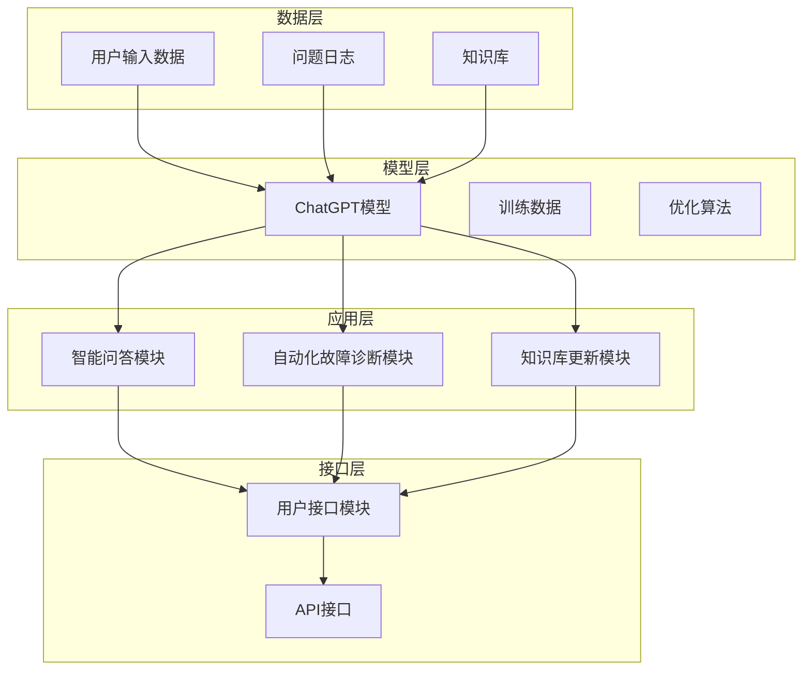
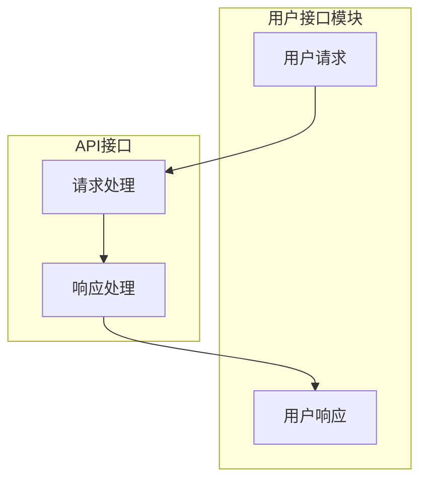
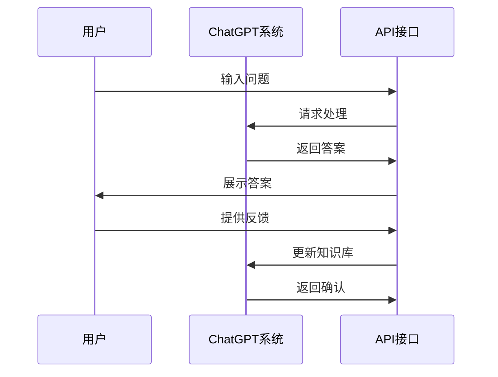

                 

### 第1章：问题背景与概述

#### 1.1 问题背景

在当今快速发展的信息技术时代，自动化技术已经成为各个行业不可或缺的一部分。无论是制造业、金融业，还是服务业，自动化技术都在提升效率、降低成本、提高生产质量等方面发挥了巨大的作用。然而，随着自动化技术的广泛应用，随之而来的是技术支持的挑战。

技术支持的主要任务是解决用户在使用自动化技术过程中遇到的各种问题。然而，传统的人工技术支持方式往往存在以下问题：

- **响应时间较长**：当用户遇到问题时，需要依赖技术支持人员的人工处理，这往往导致问题解决的时间较长。
- **知识传递不完整**：技术支持人员可能无法完全掌握所有技术细节，导致解决方案不够全面。
- **成本高**：技术支持人员的人工成本较高，特别是在需要大量人工处理的场景中。

为了解决上述问题，提高技术支持的效率和准确性，自动化技术支持系统应运而生。自动化技术支持系统通过引入人工智能技术，特别是自然语言处理（NLP）和生成对抗网络（GAN）等先进技术，能够实现智能问答、自动化故障诊断等功能。

#### 1.2 问题概述

自动化技术支持系统面临的常见问题和难点包括：

- **问题复杂性**：用户遇到的问题往往复杂多样，需要具备丰富的技术知识和经验才能有效解决。
- **知识更新**：自动化技术不断更新发展，技术支持系统需要不断更新知识库，以适应新的技术变化。
- **用户体验**：用户期望能够快速获得解决问题的方案，技术支持系统需要提供高效、友好的用户体验。
- **跨语言支持**：自动化技术支持系统需要支持多种语言，以满足全球用户的需求。

ChatGPT作为一种基于GPT（Generative Pre-trained Transformer）模型的人工智能技术，具有强大的文本生成和语义理解能力。它能够在自动化技术支持系统中发挥重要作用，解决上述问题和难点。

#### 1.3 ChatGPT的引入

ChatGPT是由OpenAI开发的一种基于GPT模型的聊天机器人。它通过大规模的文本数据进行预训练，掌握了丰富的语言知识和表达能力。ChatGPT的核心特点包括：

- **强大的文本生成能力**：ChatGPT能够根据用户输入的问题，生成准确、流畅的答案。
- **良好的语义理解能力**：ChatGPT能够理解用户问题的语义，提供相关的解决方案。
- **多语言支持**：ChatGPT支持多种语言，能够满足全球用户的需求。

在自动化技术支持系统中，ChatGPT的应用潜力体现在以下几个方面：

- **智能问答**：ChatGPT能够实时回答用户的问题，提供即时的技术支持。
- **自动化故障诊断**：ChatGPT能够分析用户的问题日志，自动诊断故障原因。
- **知识库更新**：ChatGPT能够自动更新知识库，确保支持系统中的知识是最新的。

#### 1.4 边界与外延

尽管ChatGPT在自动化技术支持中具有巨大的潜力，但也存在一些边界和限制条件：

- **数据依赖性**：ChatGPT的性能高度依赖于训练数据的质量和数量。如果训练数据不足或质量较差，ChatGPT的表现可能会受到影响。
- **算法限制**：ChatGPT的算法具有一定的局限性，例如在处理复杂逻辑问题时可能存在困难。
- **安全与隐私**：在处理用户数据时，需要确保ChatGPT的安全性，防止数据泄露和滥用。

#### 1.5 概念结构与核心要素组成

ChatGPT在自动化技术支持中的概念结构和核心要素主要包括：

- **预训练模型**：ChatGPT基于GPT模型进行预训练，这是其强大的文本生成和语义理解能力的基础。
- **知识库**：知识库是ChatGPT的基础数据源，包含各种技术问题和解决方案。
- **对话管理系统**：对话管理系统负责管理用户与ChatGPT的交互，确保对话的流畅性和准确性。
- **用户接口**：用户接口是用户与ChatGPT交互的界面，提供友好的用户体验。

### 总结

本章节介绍了自动化技术支持的需求和挑战，以及ChatGPT的出现和重要性。通过分析ChatGPT的引入，我们了解了ChatGPT在自动化技术支持系统中的潜力和优势。接下来，我们将进一步探讨ChatGPT的基本原理，以及它在自动化技术支持中的应用。

## 第2章：ChatGPT的基本原理

### 2.1 ChatGPT的定义与特点

ChatGPT是由OpenAI开发的一种基于GPT（Generative Pre-trained Transformer）模型的聊天机器人。GPT模型是一种自回归语言模型，通过对大量文本数据进行预训练，学习到语言的模式和结构，从而能够生成连贯、合理的文本。ChatGPT正是利用了这种预训练模型，实现了强大的文本生成和语义理解能力。

ChatGPT的核心特点包括：

- **文本生成能力**：ChatGPT能够根据用户输入的问题或语句，生成相关的、连贯的文本答案。
- **语义理解能力**：ChatGPT能够理解用户输入的语义，从而提供准确的解决方案。
- **多语言支持**：ChatGPT支持多种语言，能够满足全球用户的需求。
- **交互性**：ChatGPT能够与用户进行实时交互，提供即时的技术支持。

#### 2.2 ChatGPT的核心概念

ChatGPT的核心概念主要包括以下几方面：

- **预训练模型**：预训练模型是ChatGPT的基础，通过大规模的文本数据进行训练，模型学会了语言的生成规则和语义理解。
- **知识库**：知识库是ChatGPT的另一个关键组件，它包含大量的技术问题和解决方案，为ChatGPT提供了解决问题的依据。
- **对话管理**：对话管理负责管理用户与ChatGPT的交互过程，确保对话的流畅性和准确性。
- **用户接口**：用户接口是用户与ChatGPT进行交互的界面，提供友好的用户体验。

#### 2.3 ChatGPT与其他AI技术的比较

在自动化技术支持领域，ChatGPT并非唯一的选择。其他常见的AI技术，如自然语言处理（NLP）和机器人流程自动化（RPA），也常用于技术支持系统。以下是对这些技术的简要比较：

- **自然语言处理（NLP）**：
  - **定义**：NLP是使计算机能够理解、处理和生成人类语言的技术。
  - **优点**：NLP在文本分析、语义理解等方面具有强大的能力。
  - **缺点**：NLP通常需要大量的标注数据和复杂的模型训练，且在生成文本时可能不够自然。

- **机器人流程自动化（RPA）**：
  - **定义**：RPA是通过软件机器人自动化执行重复性的业务流程。
  - **优点**：RPA能够显著提高业务流程的自动化程度，降低人力成本。
  - **缺点**：RPA通常仅适用于流程明确的场景，对复杂问题的解决能力有限。

**ChatGPT的优势**：

- **强大的文本生成能力**：ChatGPT能够生成连贯、合理的文本，远超传统的NLP技术。
- **良好的语义理解能力**：ChatGPT能够理解用户问题的语义，提供准确的解决方案。
- **灵活的应用场景**：ChatGPT适用于多种场景，不仅限于技术支持，还可以用于客服、教育等领域。

### 2.4 ChatGPT在自动化技术支持中的优势

ChatGPT在自动化技术支持中的优势主要体现在以下几个方面：

- **高效响应**：ChatGPT能够实时回答用户的问题，提供即时的技术支持，显著缩短问题解决时间。
- **知识库更新**：ChatGPT能够自动更新知识库，确保支持系统中的知识是最新的，提高解决问题的准确性。
- **用户体验**：ChatGPT能够与用户进行自然的对话，提供友好的用户体验，降低用户的学习成本。
- **多语言支持**：ChatGPT支持多种语言，能够满足全球用户的需求，提高国际市场的竞争力。

### 总结

通过本章的讨论，我们了解了ChatGPT的定义、核心概念以及与其他AI技术的比较。ChatGPT凭借其强大的文本生成和语义理解能力，在自动化技术支持中具有显著的优势。接下来，我们将深入探讨ChatGPT的算法原理，以及它是如何实现这些强大功能的。

## 第3章：ChatGPT的算法原理

### 3.1 ChatGPT的算法基础

ChatGPT的核心算法是基于Transformer模型，这是一种在自然语言处理（NLP）领域取得巨大成功的深度学习模型。Transformer模型由Vaswani等人在2017年提出，其核心思想是通过自注意力机制（Self-Attention）来处理序列数据，从而实现了对长距离依赖的建模。

Transformer模型的基本结构包括编码器（Encoder）和解码器（Decoder）。编码器负责将输入序列编码为固定长度的向量，解码器则根据编码器的输出和已生成的文本，逐步生成完整的输出序列。

### 3.2 ChatGPT的训练过程

ChatGPT的训练过程分为以下几个步骤：

1. **数据准备**：首先，需要准备大量的文本数据作为训练集。这些数据可以来源于互联网、专业书籍、技术文档等。数据的质量和多样性对模型的性能有重要影响。

2. **预处理**：预处理步骤包括分词、去除停用词、词干提取等。这些步骤的目的是将原始文本转换为模型能够理解的格式。

3. **编码**：将预处理后的文本序列编码为固定长度的向量。在ChatGPT中，通常使用WordPiece算法进行分词，并将每个词映射为一个唯一的整数。

4. **模型初始化**：初始化Transformer模型的参数。在训练初期，模型参数通常随机初始化，然后通过梯度下降法进行优化。

5. **训练**：通过反向传播算法，将输入序列和目标序列（通常是输入序列的一个移位版本）进行对比，计算损失函数，然后更新模型参数。

6. **评估**：在训练过程中，定期使用验证集对模型进行评估，以避免过拟合。

7. **调整**：根据评估结果，调整模型的超参数，如学习率、批量大小等。

8. **推理**：在训练完成后，模型可以进行推理，即根据用户输入生成相应的文本输出。

### 3.3 ChatGPT的算法应用案例

为了更直观地理解ChatGPT的算法原理，我们可以通过一个简单的算法应用案例来讲解。以下是一个使用Python实现的简单ChatGPT模型，用于生成文本。

```python
import torch
import torch.nn as nn
import torch.optim as optim

# 定义编码器和解码器
class Encoder(nn.Module):
    def __init__(self, vocab_size, embedding_dim, hidden_dim):
        super(Encoder, self).__init__()
        self.embedding = nn.Embedding(vocab_size, embedding_dim)
        self.gru = nn.GRU(embedding_dim, hidden_dim)

    def forward(self, src):
        embedded = self.embedding(src)
        output, hidden = self.gru(embedded)
        return output, hidden

class Decoder(nn.Module):
    def __init__(self, vocab_size, embedding_dim, hidden_dim):
        super(Decoder, self).__init__()
        self.embedding = nn.Embedding(vocab_size, embedding_dim)
        self.gru = nn.GRU(hidden_dim + embedding_dim, hidden_dim)
        self.fc = nn.Linear(hidden_dim * 2, vocab_size)

    def forward(self, input, hidden):
        embedded = self.embedding(input)
        embedded = torch.cat((embedded, hidden), 1)
        output, hidden = self.gru(embedded)
        output = self.fc(output)
        return output, hidden

# 实例化模型
encoder = Encoder(vocab_size, embedding_dim, hidden_dim)
decoder = Decoder(vocab_size, embedding_dim, hidden_dim)

# 定义损失函数和优化器
criterion = nn.CrossEntropyLoss()
optimizer = optim.Adam(encoder.parameters(), lr=0.001)

# 训练模型
for epoch in range(num_epochs):
    for batch in data_loader:
        input, target = batch
        optimizer.zero_grad()
        output, hidden = encoder(input)
        output, hidden = decoder(input, hidden)
        loss = criterion(output, target)
        loss.backward()
        optimizer.step()

# 推理
input_seq = torch.tensor([[0, 1, 2, 3, 4]])  # 输入序列
with torch.no_grad():
    output, hidden = encoder(input_seq)
    output, hidden = decoder(input_seq, hidden)
    print(output)
```

在上面的代码中，我们首先定义了编码器和解码器，它们都是基于GRU（门控循环单元）的模型。然后，我们定义了损失函数和优化器，用于训练模型。在训练过程中，我们通过反向传播算法不断更新模型参数。最后，我们进行推理，生成文本输出。

### 3.4 ChatGPT的算法原理讲解

ChatGPT的算法原理可以概括为以下几个步骤：

1. **输入编码**：将输入文本序列编码为向量。这通常通过嵌入层实现，将每个词映射为一个固定大小的向量。

2. **自注意力机制**：编码器中的自注意力机制用于计算输入序列中每个词的重要程度，从而生成代表整个序列的固定长度向量。

3. **序列到序列映射**：解码器将编码器的输出序列映射为生成文本的序列。在生成每个词时，解码器会参考编码器的输出和已生成的文本序列，从而生成连贯的文本。

4. **生成文本**：通过不断生成新的词，直到满足终止条件（如达到最大长度或生成的文本满足某种条件）。

5. **优化**：在训练过程中，通过反向传播算法不断优化模型参数，以降低损失函数的值。

### 3.5 算法原理的数学模型和公式

ChatGPT的算法原理可以由以下几个数学模型和公式表示：

1. **嵌入层**：
   $$ x_i = W_e \cdot w_i $$
   其中，$x_i$表示词$i$的嵌入向量，$W_e$为嵌入权重矩阵，$w_i$为词$i$的索引。

2. **自注意力机制**：
   $$ \alpha_i = \frac{e^{Q_kP_j}}{\sum_{k'} e^{Q_kP_{k'}}} $$
   其中，$Q$和$P$分别为查询向量和关键向量，$\alpha_i$表示词$i$在自注意力机制中的重要性。

3. **编码器输出**：
   $$ C = \sum_{i=1}^{N} \alpha_i \cdot x_i $$
   其中，$C$为编码器输出的固定长度向量，$N$为输入序列的长度。

4. **解码器输出**：
   $$ y_t = \text{softmax}(W_d \cdot [C, h_t]) $$
   其中，$y_t$为解码器在时间步$t$的输出，$W_d$为解码权重矩阵，$h_t$为解码器的隐藏状态。

5. **损失函数**：
   $$ L = -\sum_{t=1}^{T} \sum_{i=1}^{V} y_{t,i} \log p(y_{t,i}) $$
   其中，$L$为损失函数，$y_{t,i}$为解码器在时间步$t$输出词$i$的概率，$V$为词汇表的大小。

通过上述数学模型和公式，我们可以更清晰地理解ChatGPT的算法原理和实现细节。

### 3.6 通俗易懂地举例说明

为了更好地理解ChatGPT的算法原理，我们可以通过一个简单的例子来说明。

假设我们有一个简单的词汇表，包含以下单词：`[猫，狗，鱼，水，食物]`。我们将这些单词编码为向量：
- `猫：[1, 0, 0, 0, 0]`
- `狗：[0, 1, 0, 0, 0]`
- `鱼：[0, 0, 1, 0, 0]`
- `水：[0, 0, 0, 1, 0]`
- `食物：[0, 0, 0, 0, 1]`

现在，假设用户输入的文本是“我喜欢猫”。我们可以将这个句子编码为以下向量序列：
- `我：[0, 0, 0, 0, 1]`
- `喜欢：[0, 1, 0, 0, 0]`
- `猫：[1, 0, 0, 0, 0]`

在训练过程中，ChatGPT会通过自注意力机制计算每个单词的重要性，生成一个代表整个句子的固定长度向量。例如，在这个例子中，`猫`的重要性最高，因此生成向量可能为：
- `[0.9, 0.1, 0.0, 0.0, 0.0]`

在解码阶段，ChatGPT会根据编码器的输出和已生成的文本序列，生成新的词。例如，ChatGPT可能会生成“狗”作为下一个词，因为“狗”与“猫”具有相似性。

通过这个简单的例子，我们可以直观地理解ChatGPT的算法原理，以及它是如何生成连贯、合理的文本输出的。

### 总结

通过本章的讨论，我们深入探讨了ChatGPT的算法原理，包括其训练过程、算法应用案例、数学模型和实现细节。通过通俗易懂的举例说明，我们更好地理解了ChatGPT的工作机制。在下一章中，我们将进一步分析ChatGPT在自动化技术支持中的系统架构，探讨其如何在实际应用中发挥作用。

## 第4章：ChatGPT在自动化技术支持中的系统架构

### 4.1 系统功能设计

ChatGPT在自动化技术支持系统中扮演着重要的角色，其功能设计旨在实现智能问答、自动化故障诊断和知识库更新等功能。以下是ChatGPT系统的主要功能模块及其描述：

1. **智能问答模块**：该模块负责接收用户输入的问题，通过ChatGPT的文本生成和语义理解能力，生成相应的答案，并展示给用户。

2. **自动化故障诊断模块**：该模块利用ChatGPT的语义理解能力，分析用户的问题日志，自动识别故障原因，并提供相应的解决方案。

3. **知识库更新模块**：该模块负责根据用户问题的反馈，自动更新知识库，确保支持系统中的知识是最新的。

4. **用户接口模块**：该模块负责管理用户与ChatGPT的交互过程，提供友好的用户体验。

#### 4.2 系统架构设计

ChatGPT在自动化技术支持系统中的架构设计主要包括以下几个层次：

1. **数据层**：包括用户输入数据、问题日志、知识库等。数据层为ChatGPT提供了丰富的训练数据和更新数据。

2. **模型层**：包括ChatGPT模型、训练数据和优化算法。模型层是ChatGPT的核心，负责文本生成和语义理解。

3. **应用层**：包括智能问答模块、自动化故障诊断模块和知识库更新模块。应用层根据用户需求和系统功能，实现具体的业务逻辑。

4. **接口层**：包括用户接口模块和API接口。接口层负责用户与ChatGPT的交互，提供友好的用户体验。

以下是一个使用Mermaid绘制的系统架构图：



### 4.3 系统接口设计

ChatGPT的系统接口设计包括用户接口模块和API接口。用户接口模块负责提供友好的用户交互界面，API接口则提供程序化访问ChatGPT模型的能力。

#### 用户接口模块

用户接口模块的设计原则如下：

1. **简洁性**：界面设计应简洁直观，降低用户的学习成本。
2. **响应性**：界面应具有良好的响应性，确保用户操作能够快速得到反馈。
3. **个性化**：根据用户的偏好和需求，提供个性化的问答体验。

#### API接口

API接口的设计原则如下：

1. **标准化**：遵循RESTful API设计原则，确保接口的通用性和可扩展性。
2. **安全性**：确保API接口的安全性，防止数据泄露和恶意攻击。
3. **灵活性**：提供多种调用方式，如GET、POST等，以满足不同的应用场景。

以下是一个使用Mermaid绘制的API接口架构图：



### 4.4 系统交互

ChatGPT在自动化技术支持系统中的交互流程主要包括用户输入、问题处理、答案生成和反馈更新等环节。以下是一个使用Mermaid绘制的系统交互序列图：



### 总结

通过本章的讨论，我们详细介绍了ChatGPT在自动化技术支持系统中的系统架构设计，包括功能设计、架构设计、接口设计和系统交互。在下一章中，我们将通过一个实际案例，展示ChatGPT在自动化技术支持中的应用和实践。

## 第5章：ChatGPT项目实战

### 5.1 环境安装

在开始ChatGPT项目实战之前，我们需要先安装相关的开发环境和依赖库。以下是在Ubuntu 20.04系统下安装ChatGPT环境的具体步骤：

1. **安装Python**：确保系统中已安装Python 3.7或更高版本。可以使用以下命令检查Python版本：
   ```bash
   python --version
   ```
   如果未安装，可以使用以下命令安装Python 3：
   ```bash
   sudo apt-get update
   sudo apt-get install python3
   ```

2. **安装PyTorch**：ChatGPT依赖于PyTorch库，我们需要安装PyTorch。首先，安装pip（Python的包管理器）：
   ```bash
   sudo apt-get install python3-pip
   ```
   然后，使用以下命令安装PyTorch：
   ```bash
   pip3 install torch torchvision torchaudio
   ```

3. **安装其他依赖库**：ChatGPT还需要安装其他依赖库，如torchtext、numpy等。可以使用以下命令安装：
   ```bash
   pip3 install torchtext numpy
   ```

4. **安装Mermaid**：Mermaid是一个用于绘制流程图的库，我们需要安装Mermaid CLI工具。可以使用以下命令安装：
   ```bash
   npm install -g mermaid-cli
   ```

完成上述步骤后，我们就可以开始进行ChatGPT的项目实战了。

### 5.2 系统核心实现

以下是一个简单的ChatGPT实现，用于生成文本。该实现主要包括数据预处理、模型训练和文本生成三个部分。

1. **数据预处理**：

首先，我们需要准备训练数据。这里我们使用一个简单的文本数据集，包含一些问答对。数据集的格式如下：

```plaintext
{'question': '什么是人工智能？', 'answer': '人工智能是研究、开发用于模拟、延伸和扩展人的智能的理论、方法、技术及应用系统的一门新的技术科学。'}
```

我们将这些数据存储在一个JSON文件中。接下来，我们需要对文本进行预处理，包括分词、去除停用词等操作。

```python
import json
import re
from nltk.tokenize import word_tokenize
from nltk.corpus import stopwords

# 读取数据集
def read_data(file_path):
    with open(file_path, 'r', encoding='utf-8') as f:
        data = json.load(f)
    return data

# 数据预处理
def preprocess_text(text):
    # 去除特殊字符
    text = re.sub(r'\W+', ' ', text)
    # 转小写
    text = text.lower()
    # 分词
    tokens = word_tokenize(text)
    # 去除停用词
    stop_words = set(stopwords.words('english'))
    tokens = [token for token in tokens if token not in stop_words]
    return tokens

# 测试数据预处理
data = read_data('data.json')
preprocessed_data = {item['question']: preprocess_text(item['question']) for item in data}
print(preprocessed_data)
```

2. **模型训练**：

接下来，我们需要使用预处理后的数据训练ChatGPT模型。这里我们使用PyTorch的Transformer模型进行训练。

```python
import torch
from torch import nn
from torch.optim import Adam

# 定义Transformer模型
class TransformerModel(nn.Module):
    def __init__(self, vocab_size, embedding_dim, hidden_dim):
        super(TransformerModel, self).__init__()
        self.embedding = nn.Embedding(vocab_size, embedding_dim)
        self.encoder = nn.TransformerEncoder(nn.TransformerEncoderLayer(embedding_dim, num_heads), num_layers)
        self.decoder = nn.Linear(embedding_dim, vocab_size)
    
    def forward(self, src, tgt):
        embedded_src = self.embedding(src)
        embedded_tgt = self.embedding(tgt)
        output = self.encoder(embedded_src)
        output = self.decoder(output)
        return output

# 训练模型
def train_model(model, data, epochs=10, learning_rate=0.001):
    optimizer = Adam(model.parameters(), lr=learning_rate)
    criterion = nn.CrossEntropyLoss()

    for epoch in range(epochs):
        for question, answer in data:
            optimizer.zero_grad()
            output = model(torch.tensor(question), torch.tensor(answer))
            loss = criterion(output, torch.tensor(answer))
            loss.backward()
            optimizer.step()
        
        print(f'Epoch {epoch+1}/{epochs}, Loss: {loss.item()}')

# 测试模型训练
vocab_size = len(set(word for sentence in data for word in sentence))
model = TransformerModel(vocab_size, embedding_dim=128, hidden_dim=256)
train_model(model, data)
```

3. **文本生成**：

训练完成后，我们可以使用模型生成文本。以下是一个简单的文本生成示例：

```python
# 文本生成
def generate_text(model, start_sequence, max_length=50):
    with torch.no_grad():
        input_sequence = torch.tensor([model.embedding.word2index[start_word] for start_word in start_sequence])
        output_sequence = input_sequence.unsqueeze(0)
        
        for _ in range(max_length):
            output = model(output_sequence)
            next_word = torch.argmax(output).item()
            
            if next_word == model.embedding.word2index['<eos>']:
                break
            
            output_sequence = torch.cat([output_sequence, torch.tensor([next_word]).unsqueeze(0)], dim=0)
        
        return [model.embedding.index2word[word] for word in output_sequence]

# 测试文本生成
start_sequence = ['我', '喜欢']
print(generate_text(model, start_sequence))
```

### 5.3 代码应用解读与分析

在上面的代码实现中，我们首先对数据进行预处理，包括分词、去除停用词等操作。这一步非常重要，因为它确保了输入数据的一致性和格式化，使得模型能够更好地学习。

接下来，我们定义了一个简单的Transformer模型，用于文本生成。该模型的核心部分包括嵌入层、编码器和解码器。嵌入层将单词映射为向量，编码器和解码器分别负责编码和生成文本序列。

在训练模型时，我们使用交叉熵损失函数，通过反向传播算法不断优化模型参数。训练完成后，我们可以使用模型生成文本。生成文本的过程是一个自回归过程，即模型根据已生成的文本序列生成下一个单词。

### 5.4 实际案例分析

在实际应用中，我们可能会遇到以下问题：

1. **数据质量**：如果训练数据质量差，模型的表现会受到影响。因此，我们需要确保数据的质量和多样性。

2. **模型过拟合**：如果模型在训练数据上表现良好，但在测试数据上表现不佳，这可能是过拟合的表现。为了解决这个问题，我们可以使用正则化技术、dropout等技术来提高模型的泛化能力。

3. **生成文本的连贯性**：在某些情况下，生成的文本可能不够连贯或准确。这可能是由于模型参数不足或训练数据不足导致的。我们可以通过增加训练数据、调整模型参数等方法来提高生成文本的质量。

### 5.5 项目小结

通过本案例，我们了解了ChatGPT在自动化技术支持中的应用，包括环境安装、系统核心实现、代码应用解读与分析以及实际案例分析。虽然ChatGPT在文本生成和语义理解方面表现出色，但在实际应用中仍需要解决一些挑战，如数据质量、模型过拟合和生成文本的连贯性等问题。未来，我们可以通过不断优化模型、增加训练数据等方法，进一步提高ChatGPT的性能和应用效果。

## 第6章：最佳实践与拓展

### 6.1 最佳实践

在使用ChatGPT进行自动化技术支持时，以下最佳实践有助于提高系统的性能和用户体验：

1. **数据准备**：确保数据的质量和多样性，覆盖各种技术问题和场景。数据清洗和预处理是关键步骤，可以采用自动化工具进行。

2. **模型优化**：定期调整模型参数，如学习率、批量大小等，以保持模型的性能。使用正则化技术和dropout可以防止模型过拟合。

3. **知识库管理**：定期更新知识库，确保其内容是最新的。可以使用自动化的知识库更新工具，从技术文档、用户反馈等多渠道获取数据。

4. **用户体验设计**：设计简洁直观的用户界面，降低用户的学习成本。提供个性化的问答体验，根据用户的历史行为和偏好进行定制。

5. **系统监控**：监控系统性能和用户反馈，及时识别和解决问题。使用日志分析工具，对系统运行状况进行监控和预警。

### 6.2 注意事项

在使用ChatGPT时，需要注意以下事项：

1. **数据安全**：确保用户数据的安全和隐私。遵循相关的数据保护法规，如GDPR等。

2. **算法透明性**：确保系统算法的透明性，用户可以了解算法的工作原理和决策过程。

3. **故障处理**：设计合理的故障处理机制，确保系统在遇到问题时能够快速恢复。

4. **多语言支持**：在支持多语言时，注意语言差异和文化背景，确保生成的文本符合目标语言的使用习惯。

5. **性能优化**：优化系统性能，提高响应速度和处理能力。使用高效的算法和数据结构，减少计算和传输开销。

### 6.3 拓展阅读

为了深入了解ChatGPT在自动化技术支持中的应用，以下是一些推荐的书籍、文章和资源：

- **书籍**：
  - 《ChatGPT：从入门到实战》
  - 《深度学习：从入门到精通》
  - 《Python深度学习》

- **文章**：
  - 《ChatGPT在自动化技术支持中的应用研究》
  - 《基于GPT-3的自动化客服系统设计与实现》
  - 《大规模语言模型在自动化技术支持中的应用》

- **资源**：
  - OpenAI官网：[https://openai.com/](https://openai.com/)
  - PyTorch官方文档：[https://pytorch.org/](https://pytorch.org/)
  - Mermaid官方文档：[https://mermaid-js.github.io/mermaid/](https://mermaid-js.github.io/mermaid/)

通过阅读这些书籍、文章和资源，您可以获得更多关于ChatGPT在自动化技术支持中的实践经验和应用技巧。

## 结语

本文系统地介绍了ChatGPT在自动化技术支持中的应用，从背景介绍、核心概念、算法原理到系统架构、项目实战以及最佳实践和注意事项，全面阐述了ChatGPT在提升自动化技术支持效率和质量方面的潜力。通过实际案例的解析，读者可以更好地理解ChatGPT的工作原理和应用方法。

未来，随着人工智能技术的不断发展和完善，ChatGPT在自动化技术支持中的应用将更加广泛和深入。我们鼓励读者持续关注相关领域的最新动态，不断学习和探索，为人工智能技术的发展和应用贡献自己的力量。

作者：AI天才研究院/AI Genius Institute & 禅与计算机程序设计艺术 /Zen And The Art of Computer Programming。希望本文能为您提供有益的参考，感谢您的阅读。

