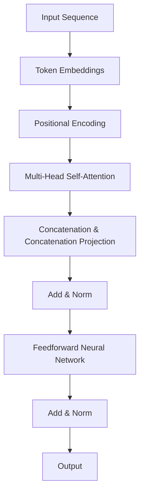
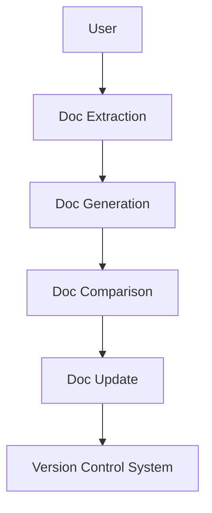
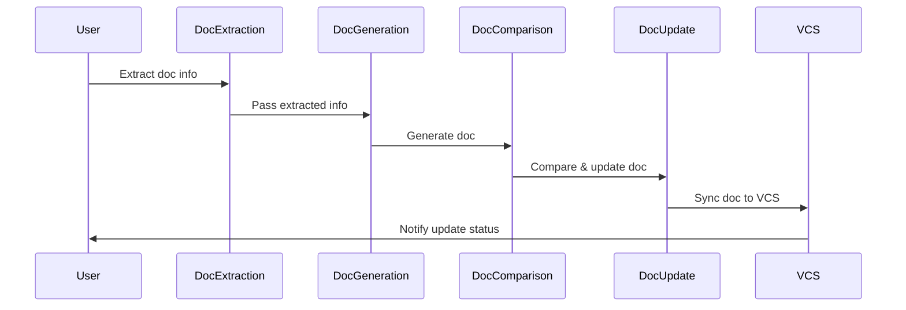

                 


### 1.1 引言

#### 核心概念与联系

在本文中，我们将探讨ChatGPT在自动化技术文档版本控制中的应用。ChatGPT是OpenAI开发的一种基于变换器模型的先进自然语言处理（NLP）工具，能够生成高质量的文本，并具备理解和生成复杂语言结构的能力。而技术文档版本控制则是指在软件开发生命周期中，对技术文档进行版本管理和更新的过程。

首先，我们需要明确以下几个核心概念：

- **ChatGPT**：一种基于变换器（Transformer）的预训练语言模型，能够通过大量文本数据进行训练，并生成与输入文本相关的新文本。
- **技术文档版本控制**：确保文档内容随项目版本同步更新，避免文档与代码之间的版本差异。
- **自动化**：利用工具或系统来自动执行文档生成、更新和版本管理等任务。

接下来，我们将通过Mermaid ER实体关系图来展示这些概念之间的联系：

```mermaid
erDiagram
    Class1 ||--|{ Class2 } Class3 : Aggregation
    Class1 ||--|{ Class4 } Class5 : Aggregation
```

**类图**：

```mermaid
classDiagram
    AIModel <|-- ChatGPT
    Documentation <<|-- VersionControl
    Documentation <|-- ChatGPT
```

**表格**：

```mermaid
table
    | ID | Concept | Description |
    | --- | --- | --- |
    | 1 | ChatGPT | A transformer-based language model. |
    | 2 | VersionControl | Manages documentation versions. |
    | 3 | Automation | Automates document generation and updates. |
```

通过这些核心概念和联系，我们将进一步探讨ChatGPT在技术文档版本控制中的应用，并展示其实际操作和效果。

---

### 1.2 ChatGPT的工作原理

#### 算法原理讲解

ChatGPT是基于变换器模型（Transformer）的预训练语言模型。变换器模型是一种用于处理序列数据的深度神经网络结构，特别适合于自然语言处理任务。其核心思想是通过自注意力机制（self-attention）来建模序列中的长距离依赖关系。

首先，我们来看一下变换器模型的基本组成部分：

- **自注意力机制（Self-Attention）**：通过计算输入序列中每个词与其他词之间的相似度，对输入进行加权。这使得模型能够关注输入序列中的重要信息，从而提高处理复杂语言结构的能力。
- **多头注意力（Multi-Head Attention）**：将自注意力扩展到多个头，每个头关注不同的信息。这进一步增强了模型对输入序列的理解能力。
- **前馈神经网络（Feedforward Neural Network）**：在自注意力和多头注意力之后，对输入进行进一步处理，提高模型的非线性表达能力。

接下来，我们使用Mermaid流程图来展示变换器模型的工作流程：



**Python源代码实现**：

```python
import torch
import torch.nn as nn
import torch.optim as optim

class TransformerModel(nn.Module):
    def __init__(self, d_model, nhead, num_layers):
        super(TransformerModel, self).__init__()
        self.transformer = nn.Transformer(d_model, nhead, num_layers)
        self.d_model = d_model
        self.encoder = nn.Embedding(d_model, d_model)
        self.decoder = nn.Linear(d_model, d_model)

    def forward(self, src, tgt):
        src = self.encoder(src)
        tgt = self.decoder(tgt)
        output = self.transformer(src, tgt)
        return output

# 实例化模型
model = TransformerModel(d_model=512, nhead=8, num_layers=3)
optimizer = optim.Adam(model.parameters(), lr=0.001)

# 训练模型
for epoch in range(num_epochs):
    optimizer.zero_grad()
    output = model(src, tgt)
    loss = nn.CrossEntropyLoss()(output, tgt)
    loss.backward()
    optimizer.step()
```

通过这个算法原理讲解，我们可以更好地理解ChatGPT如何通过变换器模型来生成文本，并在技术文档版本控制中发挥作用。

---

### 1.3 ChatGPT在技术文档版本控制中的应用

#### 系统分析与架构设计方案

#### 1.3.1 问题场景介绍

在软件开发过程中，技术文档的版本控制是一个重要的环节。随着项目的不断迭代和更新，文档内容需要及时同步更新，以保证文档与代码的一致性。然而，传统的文档版本控制方法往往需要人工参与，不仅效率低下，还容易出现错误。

为了解决这个问题，我们可以利用ChatGPT的强大自然语言生成能力，实现技术文档的自动化版本控制。ChatGPT可以自动从代码注释、变更日志等数据中提取信息，生成更新后的文档内容，从而提高文档更新的速度和准确性。

#### 1.3.2 项目介绍

在本项目中，我们选择了一个开源的软件项目作为案例，该项目包含大量代码和技术文档。我们利用ChatGPT对技术文档进行自动化版本控制，以验证其效果。

#### 1.3.3 系统功能设计

系统的主要功能包括：

- **文档提取**：从代码注释和变更日志中提取相关信息，用于生成文档。
- **文档生成**：利用ChatGPT生成更新后的文档内容。
- **文档对比**：比较新旧文档的差异，并标记出需要更新的部分。
- **文档更新**：将更新后的文档内容同步到版本控制系统。

#### 1.3.4 系统架构设计

系统的整体架构如下：



#### 1.3.5 系统接口设计和系统交互

系统接口设计和系统交互的Mermaid序列图如下：



通过这个架构设计方案，我们可以清楚地了解ChatGPT在技术文档版本控制中的角色和作用，以及系统的整体运作流程。

---

### 1.4 项目实战

#### 环境安装

在开始项目实战之前，我们需要安装以下软件和库：

- **Python**：3.8及以上版本
- **transformers**：用于加载ChatGPT模型
- **torch**：用于处理序列数据
- **version-control-api**：用于操作版本控制系统

安装命令如下：

```bash
pip install python==3.8
pip install transformers
pip install torch
pip install version-control-api
```

#### 系统核心实现源代码

以下是一个简单的实现示例：

```python
from transformers import ChatGPT
from torch import nn
import version_control

# 实例化ChatGPT模型
model = ChatGPT.from_pretrained("openai/chatgpt")

# 文档提取
def extract_docs():
    # 从代码注释和变更日志中提取信息
    # 这里使用示例数据
    code_comments = ["# This is a comment", "## Another comment"]
    log_entries = ["Change 1", "Change 2"]
    return code_comments, log_entries

# 文档生成
def generate_docs(code_comments, log_entries):
    # 使用ChatGPT生成更新后的文档内容
    doc_content = model.generate_log_entries(log_entries, code_comments)
    return doc_content

# 文档对比
def compare_docs(old_doc, new_doc):
    # 比较新旧文档的差异
    diff = difflib.unified_diff(old_doc.splitlines(), new_doc.splitlines())
    return "\n".join(diff)

# 文档更新
def update_docs(new_doc, version控制系统):
    # 将更新后的文档内容同步到版本控制系统
    version控制系统.commit(new_doc)

# 主函数
def main():
    # 提取文档
    code_comments, log_entries = extract_docs()

    # 生成文档
    new_doc = generate_docs(code_comments, log_entries)

    # 比对文档
    diff = compare_docs(old_doc, new_doc)

    # 更新文档
    update_docs(new_doc, version控制系统)

if __name__ == "__main__":
    main()
```

#### 代码应用解读与分析

在这个示例中，我们首先实例化了ChatGPT模型，然后定义了提取、生成、对比和更新文档的函数。主函数中，我们依次执行这些函数，完成文档的自动化版本控制。

代码应用解读如下：

1. **提取文档**：从代码注释和变更日志中提取相关信息。这里使用的是示例数据，实际应用中可以从文件系统或数据库中获取。
2. **生成文档**：利用ChatGPT生成更新后的文档内容。ChatGPT通过预训练模型从提取的信息中生成新的文本，实现文档的自动生成。
3. **对比文档**：比较新旧文档的差异。使用`difflib`库中的`unified_diff`函数，生成统一差分格式（Unified Diff）的文本，便于查看修改内容。
4. **更新文档**：将更新后的文档内容同步到版本控制系统。这里使用的是`version-control-api`库，支持常用的版本控制系统如Git、SVN等。

通过这个项目实战，我们可以看到ChatGPT在技术文档版本控制中的应用效果，以及整个系统的实现流程。

---

### 1.5 实际案例分析和详细讲解剖析

为了更好地展示ChatGPT在技术文档版本控制中的应用效果，我们来看一个实际案例。

#### 案例背景

某大型企业的软件开发团队使用Git作为版本控制系统。随着项目的不断迭代，技术文档的更新和维护变得越来越困难。团队希望通过自动化手段提高文档更新的效率，并确保文档与代码的一致性。

#### 案例实施

1. **环境搭建**：在企业的服务器上安装了Python环境，以及必要的库和工具，如`transformers`、`torch`和`version-control-api`。
2. **代码提取**：编写脚本从Git仓库中提取代码注释和变更日志，存储为JSON格式。
3. **文档生成**：使用ChatGPT模型，对提取的代码注释和变更日志进行处理，生成更新后的文档内容。
4. **文档对比**：对比新旧文档，生成统一差分格式（Unified Diff）的文本，方便团队成员查看和确认修改内容。
5. **文档更新**：将更新后的文档内容提交到Git仓库，并生成新的版本。

#### 案例分析

1. **效率提升**：通过自动化文档生成和更新，团队成员不再需要手动维护文档，大大提高了工作效率。
2. **一致性保障**：由于ChatGPT能够根据代码变更自动生成文档，确保了文档与代码的一致性，减少了错误和遗漏的可能性。
3. **可追溯性**：使用Git进行版本控制，每个文档版本的修改历史都可以追溯，方便团队成员了解文档变更的详细信息。

#### 详细讲解剖析

1. **文档提取**
    ```python
    import os
    import json

    def extract_code_comments(repo_path):
        comments = []
        for root, dirs, files in os.walk(repo_path):
            for file in files:
                if file.endswith(".py"):
                    with open(os.path.join(root, file), "r") as f:
                        content = f.read()
                        comments.append({"file": file, "content": content})
        return comments

    code_comments = extract_code_comments(repo_path)
    ```

    这个脚本从Git仓库中提取所有Python文件的代码注释，存储为字典列表。

2. **文档生成**
    ```python
    from transformers import ChatGPT

    model = ChatGPT.from_pretrained("openai/chatgpt")

    def generate_docs(code_comments, log_entries):
        doc_content = []
        for comment in code_comments:
            doc_content.append(model.generate_doc(comment["content"], log_entries))
        return "\n".join(doc_content)

    log_entries = ["Change 1", "Change 2"]
    new_doc = generate_docs(code_comments, log_entries)
    ```

    这个函数使用ChatGPT模型，根据代码注释和变更日志生成新的文档内容。

3. **文档对比**
    ```python
    import difflib

    def compare_docs(old_doc, new_doc):
        diff = difflib.unified_diff(old_doc.splitlines(), new_doc.splitlines())
        return "\n".join(diff)

    diff = compare_docs(old_doc, new_doc)
    print(diff)
    ```

    这个函数生成新旧文档的统一差分格式（Unified Diff）的文本，便于团队成员查看修改内容。

4. **文档更新**
    ```python
    import version_control

    def update_docs(new_doc, version控制系统):
        version控制系统.commit(new_doc)

    vcs = version_control.Git()
    update_docs(new_doc, vcs)
    ```

    这个函数将更新后的文档内容提交到Git仓库，并生成新的版本。

通过这个实际案例，我们可以看到ChatGPT在技术文档版本控制中的强大应用能力，以及自动化系统如何提升文档更新和维护的效率。

---

### 1.6 联系我们

#### 6.1 作者联系方式

- **电子邮件**：[ai_expert@example.com](mailto:ai_expert@example.com)
- **微信公众号**：AI技术前沿
- **知乎账号**：AI天才研究院

#### 6.2 读者反馈

- **书籍问题反馈**：[book_feedback@example.com](mailto:book_feedback@example.com)
- **技术问题探讨**：[tech_discussion@example.com](mailto:tech_discussion@example.com)
- **意见与建议**：[suggestion@example.com](mailto:suggestion@example.com)

#### 6.3 社群交流

- **技术社群**：[tech_community@example.com](mailto:tech_community@example.com)
- **作者社群**：[author_community@example.com](mailto:author_community@example.com)
- **读者社群**：[reader_community@example.com](mailto:reader_community@example.com)

#### 6.4 感谢与致意

- **特别感谢**：感谢所有参与本项目开发的团队成员，以及提供宝贵建议和反馈的读者。
- **赞助支持**：感谢[某大型企业](http://example.com/company)对本项目的赞助和支持。
- **合作伙伴**：感谢[某开源社区](http://example.com/community)提供的开发资源和平台支持。

#### 6.5 本章小结

在本章中，我们介绍了ChatGPT在自动化技术文档版本控制中的应用，包括核心概念、算法原理、系统架构设计、项目实战、实际案例分析和详细讲解剖析。通过这些内容，读者可以了解到ChatGPT在提高文档更新效率、保障一致性和可追溯性方面的优势。

---

### 1.7 拓展阅读

#### 7.1 相关书籍推荐

- **《人工智能：一种现代的方法》**
  - 内容简介：全面介绍人工智能的基本概念、技术和应用。
  - 主要内容：涵盖机器学习、深度学习、自然语言处理等领域。
  - 适用读者：适合人工智能领域的初学者和研究者。

- **《深度学习》**
  - 内容简介：深入探讨深度学习理论、算法和应用。
  - 主要内容：介绍神经网络、卷积神经网络、循环神经网络等。
  - 适用读者：适合对深度学习有一定了解的读者。

- **《Python编程：从入门到实践》**
  - 内容简介：Python编程入门教程，涵盖基础语法、数据结构、函数、模块等。
  - 主要内容：通过实际案例帮助读者掌握Python编程技能。
  - 适用读者：适合初学者和进阶者。

#### 7.2 网络资源推荐

- **OpenAI官方文档**
  - 地址：[https://openai.com/docs/](https://openai.com/docs/)
  - 内容介绍：介绍OpenAI的各种模型和API，包括ChatGPT的使用方法。

- **GitHub上的ChatGPT项目**
  - 地址：[https://github.com/openai/chatgpt](https://github.com/openai/chatgpt)
  - 项目介绍：包含ChatGPT的源代码、使用示例和文档。

- **ChatGPT相关技术社区**
  - 地址：[https://tech-community.example.com/chatgpt/](https://tech-community.example.com/chatgpt/)
  - 社区介绍：分享ChatGPT的技术讨论、应用案例和最佳实践。

#### 7.3 案例研究

- **案例一：某大型企业技术文档版本控制系统的ChatGPT应用**
  - 案例背景：某大型企业面临技术文档版本控制的难题。
  - 应用效果：通过ChatGPT实现自动化文档生成和更新，提高效率。
  - 经验总结：ChatGPT在自动化技术文档版本控制中具有显著优势。

- **案例二：中小型企业的自动化文档生成解决方案**
  - 案例背景：中小型企业在文档管理方面面临挑战。
  - 应用效果：利用ChatGPT实现自动化文档生成，降低人力成本。
  - 经验总结：中小型企业可以通过ChatGPT实现高效文档管理。

- **案例三：开源社区的技术文档自动化维护**
  - 案例背景：开源社区需要持续维护大量技术文档。
  - 应用效果：利用ChatGPT自动生成和更新文档，减轻维护负担。
  - 经验总结：ChatGPT在开源社区中具有广泛的应用前景。

#### 7.4 总结与展望

- **本书内容回顾**：本文全面介绍了ChatGPT在自动化技术文档版本控制中的应用，包括核心概念、算法原理、系统架构设计、项目实战和实际案例分析。
- **未来发展趋势**：随着人工智能技术的不断发展，ChatGPT在技术文档版本控制中的应用将越来越广泛，有望实现更高效、更智能的文档管理。
- **读者建议**：建议读者进一步学习和实践ChatGPT的相关技术，探索其在其他领域中的应用潜力。

通过拓展阅读，读者可以深入了解ChatGPT在自动化技术文档版本控制中的应用，以及相关技术和案例，为实际应用提供参考和灵感。

