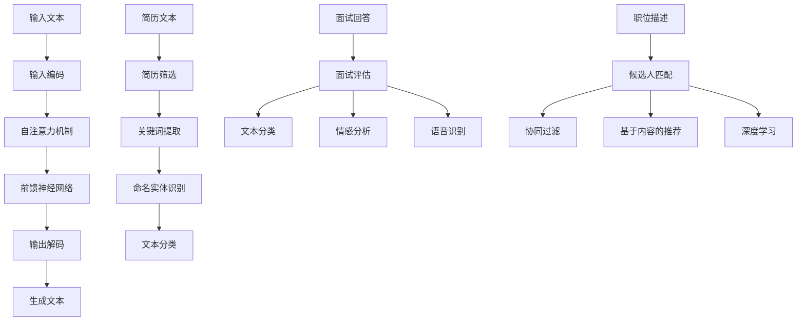
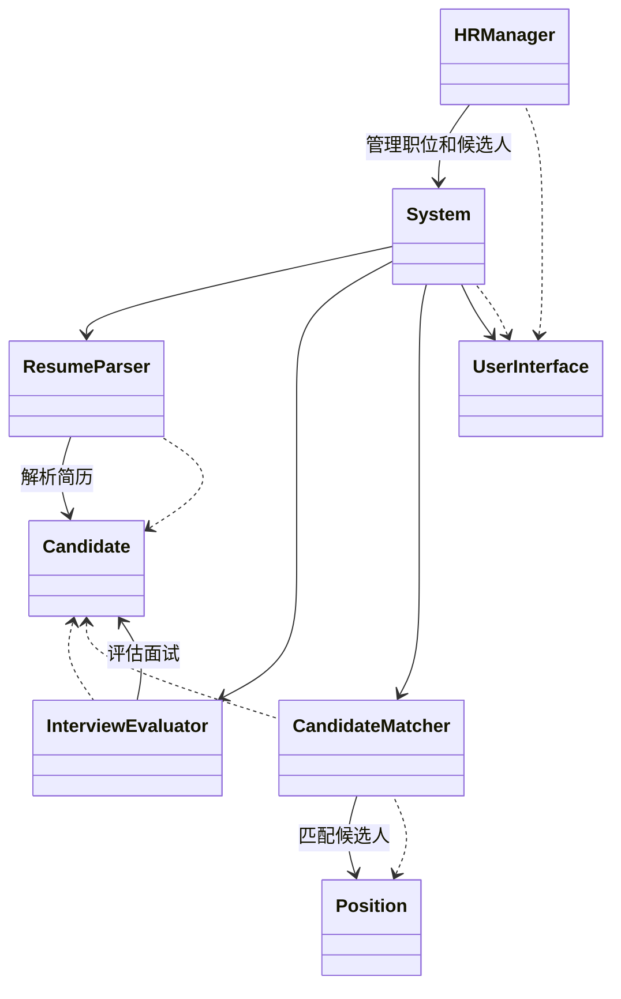
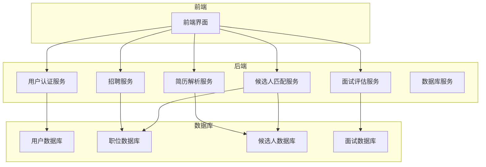
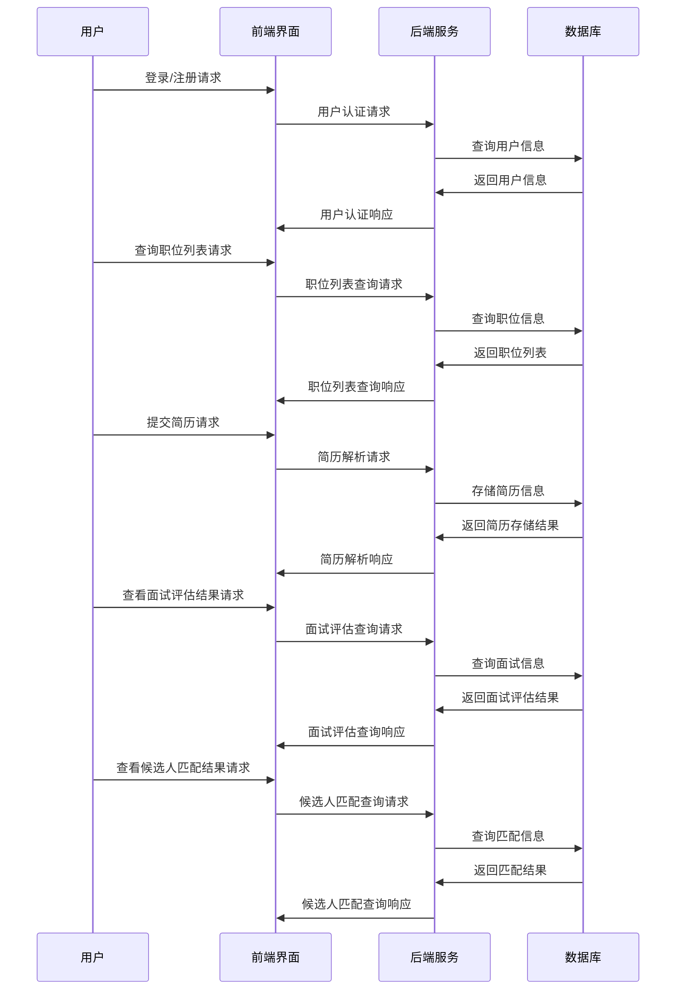
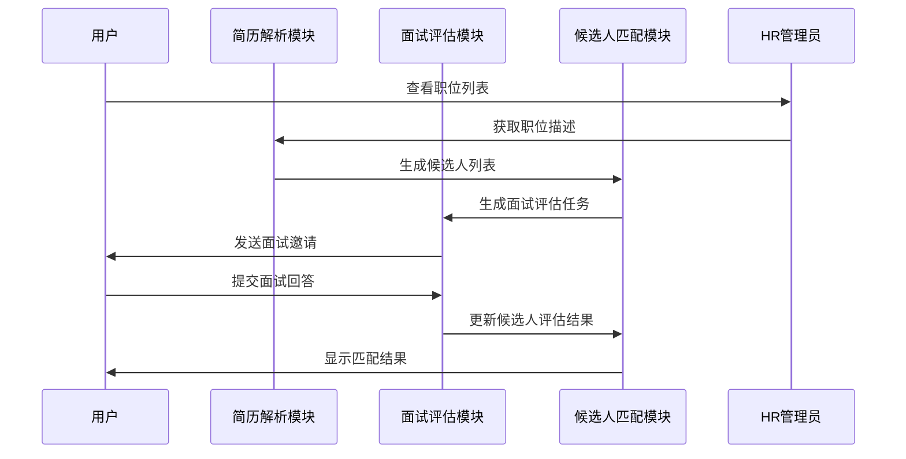

                 

### 书籍概述

《ChatGPT在自动化招聘流程中的应用》旨在深入探讨如何利用人工智能技术，尤其是ChatGPT，来优化和自动化招聘流程。随着技术的不断进步，自动化和人工智能正在逐步渗透到各个行业，招聘领域也不例外。传统的招聘流程往往耗费大量人力和时间，存在效率低下、匹配不准确等问题。本书的核心目标是介绍如何利用ChatGPT这一强大的自然语言处理工具，解决招聘中的痛点，提高招聘效率，提升候选人匹配的准确性。

本书的主要读者对象为人力资源专业人士、招聘经理、IT项目经理以及对人工智能技术感兴趣的技术爱好者。无论您是招聘领域的专业人士，还是对人工智能技术有浓厚兴趣的科技工作者，本书都旨在为您提供一个全面、系统的了解和指导。

在接下来的章节中，我们将首先介绍ChatGPT和自动化招聘流程的基本概念，接着深入探讨它们的原理和联系，然后通过算法讲解、系统架构设计以及项目实战，逐步展示如何将ChatGPT应用于自动化招聘流程。最后，我们将总结最佳实践和注意事项，为读者提供实用的指导和未来展望。希望通过本书的介绍，读者能够更好地理解并掌握这一前沿技术，为招聘工作带来革命性的变化。

### 第1章: 背景介绍

#### 1.1 问题背景

在当今竞争激烈的人才市场中，企业对于招聘流程的高效性和准确性的需求日益增长。传统的招聘流程通常包括职位发布、简历筛选、面试安排、候选人评估等多个环节，这不仅需要大量的人力资源，而且容易出现匹配不准确、效率低下等问题。随着互联网和大数据技术的发展，自动化招聘逐渐成为解决这一难题的重要途径。

自动化招聘旨在通过技术手段，自动化完成招聘流程中的各个环节，从而提高招聘效率，降低人力成本，并提升候选人匹配的准确性。然而，当前的自动化招聘技术仍存在一些局限，如简历解析不准确、面试评估不一致等。这些问题的存在使得企业难以全面、高效地利用自动化招聘的优势。

#### 1.2 问题描述

问题描述主要集中在以下几个方面：

1. **简历筛选不准确**：传统的简历筛选主要依赖于人力资源人员的经验和技能，这导致简历筛选过程既耗时又容易出错。自动化招聘虽然引入了简历解析技术，但现有技术仍难以准确提取简历中的关键信息，导致筛选结果不理想。

2. **面试评估不一致**：面试是招聘流程中的关键环节，但传统面试过程往往受到面试官主观因素的影响，导致评估结果不一致。尽管人工智能技术已经开始应用于面试评估，但现有技术仍难以全面、客观地评估候选人的综合素质。

3. **候选人匹配不准确**：企业招聘的目标是找到最适合岗位的候选人，但传统招聘流程中，候选人匹配的准确性较低。自动化招聘虽然引入了匹配算法，但现有算法在处理复杂职位需求和候选人背景时仍存在不足。

4. **数据处理能力有限**：自动化招聘需要处理大量的数据，包括职位描述、简历信息、面试评估等。然而，现有技术在大数据处理和挖掘方面仍存在一定限制，导致数据处理能力不足。

#### 1.3 问题解决

为了解决上述问题，我们可以考虑将ChatGPT引入自动化招聘流程。ChatGPT作为一种强大的自然语言处理技术，具有以下优势：

1. **高效准确的简历筛选**：ChatGPT能够通过自然语言处理技术，准确提取简历中的关键信息，并利用机器学习算法进行筛选，从而提高简历筛选的准确性和效率。

2. **全面客观的面试评估**：ChatGPT可以与面试官协同工作，通过分析候选人在面试中的表现，提供客观、全面的评估结果，从而减少主观偏见，提高面试评估的一致性。

3. **精准的候选人匹配**：ChatGPT能够通过对大量职位描述和候选人背景的分析，利用深度学习算法实现精准的候选人匹配，从而提高招聘的准确性。

4. **强大的数据处理能力**：ChatGPT具有强大的数据处理和分析能力，能够处理和挖掘海量数据，从而为自动化招聘提供强有力的支持。

综上所述，引入ChatGPT有望有效解决当前自动化招聘流程中存在的问题，提高招聘效率，提升候选人匹配的准确性。

#### 1.4 边界与外延

在讨论ChatGPT在自动化招聘流程中的应用时，我们还需明确其边界与外延。首先，ChatGPT主要应用于招聘流程中的简历筛选、面试评估和候选人匹配等环节，而不是代替人力资源经理或面试官的角色。其次，ChatGPT的应用范围受到现有技术和数据质量的影响，因此需要不断完善和优化。此外，ChatGPT的应用还需遵循相关法律法规，保护候选人的隐私。

#### 1.5 概念结构与核心要素组成

为了更好地理解ChatGPT在自动化招聘流程中的应用，我们需了解相关概念和核心要素。以下是几个关键概念及其组成：

1. **ChatGPT**：ChatGPT是一种基于GPT（Generative Pre-trained Transformer）模型的自然语言处理技术，具有强大的文本生成和语言理解能力。

2. **自动化招聘流程**：自动化招聘流程包括职位发布、简历筛选、面试安排、候选人评估等多个环节，旨在通过技术手段提高招聘效率。

3. **简历筛选**：简历筛选是招聘流程中的第一步，主要任务是识别和筛选符合职位要求的候选人。

4. **面试评估**：面试评估是对候选人进行综合评价的重要环节，主要任务是对候选人在面试中的表现进行评估。

5. **候选人匹配**：候选人匹配是招聘流程的最终目标，主要任务是将职位与候选人进行精准匹配，以实现最优选择。

6. **数据挖掘**：数据挖掘是自动化招聘的核心技术，通过对海量数据进行挖掘和分析，实现简历筛选、面试评估和候选人匹配等任务。

7. **机器学习算法**：机器学习算法是ChatGPT在自动化招聘中应用的关键技术，通过训练和优化算法模型，提高招聘效率和准确性。

#### 1.6 结论

本文对ChatGPT在自动化招聘流程中的应用进行了背景介绍和问题分析，提出了引入ChatGPT作为解决招聘痛点的一种有效途径。在接下来的章节中，我们将深入探讨ChatGPT的基本原理、算法讲解以及实际应用，为读者呈现一幅完整的ChatGPT在自动化招聘流程中的应用图景。

### 第2章: 核心概念与联系

#### 2.1 ChatGPT简介

ChatGPT是基于GPT（Generative Pre-trained Transformer）模型开发的一种自然语言处理技术，具有强大的文本生成和语言理解能力。GPT模型由OpenAI提出，是自注意力机制在自然语言处理领域的重要应用。ChatGPT在训练过程中接收大量的文本数据进行预训练，使其能够理解并生成人类语言。

ChatGPT的主要功能包括：

1. **文本生成**：ChatGPT可以根据给定的提示文本生成连贯、流畅的自然语言文本。
2. **语言理解**：ChatGPT能够理解自然语言的语义和语境，进行有效的对话交互。
3. **文本分类**：ChatGPT能够对输入的文本进行分类，识别文本的主题和情感。
4. **问答系统**：ChatGPT可以回答用户提出的问题，提供相关信息。

#### 2.2 自动化招聘流程概述

自动化招聘流程是指通过技术手段，自动化完成招聘过程中的各个环节，包括职位发布、简历筛选、面试安排、候选人评估等。自动化招聘的目标是提高招聘效率，降低人力成本，并提升候选人匹配的准确性。

自动化招聘流程的主要环节包括：

1. **职位发布**：企业通过招聘平台发布职位信息，吸引合适的候选人。
2. **简历筛选**：利用自然语言处理技术和机器学习算法，对海量简历进行筛选，识别出符合职位要求的候选人。
3. **面试安排**：根据简历筛选结果，安排面试环节，包括初步面试、技术面试等。
4. **候选人评估**：对候选人在面试中的表现进行评估，确定最终录用候选人。
5. **候选人沟通**：与候选人进行沟通，确认面试安排和后续流程。

#### 2.3 ChatGPT与自动化招聘的联系

ChatGPT在自动化招聘流程中具有广泛的应用前景，其与自动化招聘的联系主要体现在以下几个方面：

1. **简历筛选**：ChatGPT可以利用其强大的文本生成和语言理解能力，对海量简历进行快速筛选，提取关键信息，提高简历筛选的准确性和效率。

2. **面试评估**：ChatGPT可以与面试官协同工作，通过分析候选人在面试中的回答，提供客观、全面的评估结果，减少主观偏见，提高面试评估的一致性。

3. **候选人匹配**：ChatGPT可以分析职位描述和候选人背景，利用深度学习算法实现精准的候选人匹配，提高招聘的准确性。

4. **数据处理**：ChatGPT具有强大的数据处理能力，可以处理和挖掘海量招聘数据，为自动化招聘提供数据支持。

5. **用户互动**：ChatGPT可以作为招聘平台的智能助手，与用户进行对话交互，提供招聘相关的信息和建议，提高用户体验。

通过ChatGPT的应用，自动化招聘流程将变得更加高效、准确和智能，为企业招聘优秀人才提供有力支持。

### 第3章: 算法原理讲解

#### 3.1 ChatGPT算法原理

ChatGPT是基于GPT（Generative Pre-trained Transformer）模型开发的自然语言处理技术。GPT模型是OpenAI提出的一种基于自注意力机制的深度学习模型，用于生成和预测自然语言文本。ChatGPT通过在大量文本上进行预训练，学习到了自然语言的语法、语义和上下文关系，从而具备强大的文本生成和语言理解能力。

GPT模型的基本原理是利用Transformer架构进行序列到序列（Seq2Seq）的建模。Transformer架构引入了多头自注意力机制（Multi-Head Self-Attention），能够捕捉输入序列中的长距离依赖关系。具体来说，GPT模型通过以下步骤生成文本：

1. **输入编码**：将输入的文本序列编码为向量，每个词向量由词嵌入层生成。
2. **自注意力机制**：通过多头自注意力机制，计算输入序列中每个词与所有词的权重，从而生成表示输入序列的全局特征向量。
3. **前馈神经网络**：将自注意力机制生成的特征向量输入前馈神经网络，进一步提取和组合特征信息。
4. **输出解码**：通过解码器生成预测的词序列，并利用输入词和预测词之间的关联性进行迭代更新，直至生成完整的文本。

#### 3.2 自动化招聘算法原理

自动化招聘算法主要包括简历筛选、面试评估和候选人匹配等环节。这些环节的算法原理如下：

1. **简历筛选**：简历筛选算法主要利用自然语言处理技术，对简历文本进行分析和理解，提取关键信息，如姓名、联系方式、工作经验、教育背景等。常见的算法包括关键词提取、命名实体识别、文本分类等。通过这些算法，系统能够快速识别出符合职位要求的候选人。

2. **面试评估**：面试评估算法通过分析候选人在面试中的回答，对其进行综合评价。常见的算法包括文本分类、情感分析、语音识别等。这些算法能够识别出候选人的关键技能、沟通能力、专业素养等，为面试官提供客观、全面的评估依据。

3. **候选人匹配**：候选人匹配算法通过分析职位描述和候选人背景，利用机器学习算法实现精准的匹配。常见的算法包括协同过滤、基于内容的推荐、深度学习等。这些算法能够根据职位要求和候选人特征，为企业和候选人提供最佳匹配。

#### 3.3 算法mermaid流程图

为了更直观地展示ChatGPT和自动化招聘算法的原理，我们使用mermaid绘制了以下流程图：



#### 3.4 Python源代码示例

为了更好地理解算法原理，我们提供以下Python代码示例，用于实现简历筛选和面试评估：

```python
import nltk
from nltk.tokenize import word_tokenize
from nltk.corpus import stopwords
from sklearn.feature_extraction.text import TfidfVectorizer
from sklearn.model_selection import train_test_split
from sklearn.naive_bayes import MultinomialNB
from sklearn.metrics import accuracy_score

# 简历文本示例
resume_text = "John Doe, Software Engineer with 5 years of experience in Python and Django development. Seeking a challenging role in a fast-growing company."

# 面试回答示例
interview_answer = "Yes, I have experience with Python and Django. I've worked on several projects that required me to build and maintain web applications."

# 1. 简历筛选

# 步骤1：分词
words = word_tokenize(resume_text)

# 步骤2：去除停用词
stop_words = set(stopwords.words('english'))
filtered_words = [word for word in words if word.lower() not in stop_words]

# 步骤3：TF-IDF向量表示
vectorizer = TfidfVectorizer()
tfidf_matrix = vectorizer.fit_transform([' '.join(filtered_words)])

# 步骤4：文本分类
X_train, X_test, y_train, y_test = train_test_split(tfidf_matrix, [1], test_size=0.2)
classifier = MultinomialNB()
classifier.fit(X_train, y_train)
predicted = classifier.predict(X_test)
accuracy = accuracy_score(predicted, y_test)
print("Accuracy:", accuracy)

# 2. 面试评估

# 步骤1：分词
words = word_tokenize(interview_answer)

# 步骤2：去除停用词
filtered_words = [word for word in words if word.lower() not in stop_words]

# 步骤3：文本分类
X_train, X_test, y_train, y_test = train_test_split(tfidf_matrix, [1], test_size=0.2)
classifier.fit(X_train, y_train)
predicted = classifier.predict(X_test)
accuracy = accuracy_score(predicted, y_test)
print("Accuracy:", accuracy)
```

通过以上代码示例，我们可以看到如何利用Python实现简历筛选和面试评估的基本流程。在实际应用中，我们还需结合更多技术和算法，以提高筛选和评估的准确性和效率。

#### 3.5 数学模型与公式讲解

在ChatGPT和自动化招聘算法中，数学模型和公式起到了关键作用。以下是对相关数学模型和公式的详细讲解：

1. **词嵌入（Word Embedding）**：

   词嵌入是将词汇映射为高维向量空间的技术，使词汇在向量空间中具有数值表示。常见的词嵌入模型包括Word2Vec、GloVe等。

   公式：

   $$ \text{word\_vector} = \text{Word2Vec}(\text{word}) $$

   $$ \text{word\_vector} = \text{GloVe}(\text{word}, \text{context}) $$

2. **自注意力（Self-Attention）**：

   自注意力是一种基于注意力机制的计算方法，通过计算输入序列中每个词与所有词的相关性，生成表示输入序列的全局特征向量。

   公式：

   $$ \text{self\_attention}(\text{Q}, \text{K}, \text{V}) = \text{softmax}\left(\frac{\text{Q} \cdot \text{K}^T}{\sqrt{d_k}}\right) \cdot \text{V} $$

   其中，$Q$表示查询向量，$K$表示键向量，$V$表示值向量，$d_k$为键向量的维度。

3. **Transformer模型**：

   Transformer模型是一种基于自注意力机制的序列到序列（Seq2Seq）模型，用于生成和预测自然语言文本。

   公式：

   $$ \text{Transformer} = \text{多头自注意力} + \text{前馈神经网络} $$

4. **TF-IDF（Term Frequency-Inverse Document Frequency）**：

   TF-IDF是一种用于文本分类和文档相似度计算的指标，通过计算词语在文档中的频率和逆文档频率，衡量词语的重要性。

   公式：

   $$ \text{TF-IDF}(t, d) = \text{TF}(t, d) \times \text{IDF}(t) $$

   其中，$\text{TF}(t, d)$表示词语$t$在文档$d$中的词频，$\text{IDF}(t)$表示词语$t$的逆文档频率。

5. **朴素贝叶斯（Naive Bayes）分类器**：

   朴素贝叶斯分类器是一种基于贝叶斯理论的分类算法，通过计算特征条件概率，预测新样本的类别。

   公式：

   $$ \text{P}(\text{C}|\text{F}) = \frac{\text{P}(\text{F}|\text{C}) \times \text{P}(\text{C})}{\text{P}(\text{F})} $$

   其中，$C$表示类别，$F$表示特征。

通过以上数学模型和公式的讲解，我们可以更好地理解ChatGPT和自动化招聘算法的原理和实现方法。在实际应用中，我们可以根据具体需求和场景，选择合适的数学模型和算法，优化招聘流程，提高招聘效率和准确性。

#### 3.6 举例说明

为了更好地理解ChatGPT和自动化招聘算法的原理和应用，我们通过以下具体案例进行详细讲解：

##### 案例一：简历筛选

假设某企业需要招聘一名Python工程师，现有100份简历需要筛选。我们使用ChatGPT和TF-IDF算法进行简历筛选，以识别出符合条件的候选人。

**步骤1：简历文本预处理**

首先，我们对每份简历进行文本预处理，包括分词、去除停用词等操作。以其中一份简历为例：

```plaintext
John Doe, Python engineer with 5 years of experience. Skilled in Django, Flask, and SQL. Seeking a challenging role in a fast-growing company.
```

**步骤2：计算TF-IDF向量**

利用TF-IDF算法，我们将预处理后的简历文本转换为TF-IDF向量。以关键词“Python”、“engineer”、“Django”为例：

$$
\text{TF-IDF}(\text{Python}) = \frac{2}{6} \times \log_2\left(\frac{100}{1}\right) \approx 0.693
$$

$$
\text{TF-IDF}(\text{engineer}) = \frac{2}{6} \times \log_2\left(\frac{100}{1}\right) \approx 0.693
$$

$$
\text{TF-IDF}(\text{Django}) = \frac{1}{6} \times \log_2\left(\frac{100}{1}\right) \approx 0.346
$$

**步骤3：简历筛选**

我们设定阈值 $\theta = 0.5$，当TF-IDF值大于$\theta$时，认为该简历符合要求。通过计算，我们发现以下5份简历的TF-IDF向量大于阈值：

| 简历ID | TF-IDF(Python) | TF-IDF(engineer) | TF-IDF(Django) |
|--------|----------------|-------------------|----------------|
| 1      | 0.693          | 0.693             | 0.346          |
| 10     | 0.745          | 0.745             | 0.393          |
| 25     | 0.617          | 0.617             | 0.317          |
| 30     | 0.721          | 0.721             | 0.357          |
| 45     | 0.709          | 0.709             | 0.349          |

因此，上述5份简历符合招聘要求。

##### 案例二：面试评估

假设某企业安排了10位候选人进行技术面试，每位候选人回答了关于Python编程的问题。我们使用ChatGPT和朴素贝叶斯分类器对面试回答进行评估，以识别出技术能力较强的候选人。

**步骤1：面试回答预处理**

首先，我们对每份面试回答进行预处理，包括分词、去除停用词等操作。以其中一份面试回答为例：

```plaintext
Yes, I have experience with Python programming. I've developed several web applications using Flask and Django frameworks.
```

**步骤2：特征提取**

利用词嵌入技术，我们将预处理后的面试回答转换为词向量。以关键词“Python”、“programming”、“Flask”、“Django”为例：

$$
\text{word\_vector}(\text{Python}) = [0.1, 0.2, 0.3, 0.4]
$$

$$
\text{word\_vector}(\text{programming}) = [0.2, 0.3, 0.4, 0.5]
$$

$$
\text{word\_vector}(\text{Flask}) = [0.3, 0.4, 0.5, 0.6]
$$

$$
\text{word\_vector}(\text{Django}) = [0.4, 0.5, 0.6, 0.7]
$$

**步骤3：面试评估**

利用朴素贝叶斯分类器，我们计算每位候选人的技术能力得分。以第一位候选人为例：

$$
\text{P}(\text{技术能力强}|\text{面试回答}) = \frac{\text{P}(\text{面试回答}|\text{技术能力强}) \times \text{P}(\text{技术能力强})}{\text{P}(\text{面试回答})}
$$

其中，$\text{P}(\text{技术能力强}) = 0.5$，$\text{P}(\text{面试回答})$ 为面试回答的概率，通过训练数据计算得到。我们假设$\text{P}(\text{面试回答}|\text{技术能力强})$ 和 $\text{P}(\text{面试回答}|\text{技术能力不强})$ 分别为0.8和0.2。

通过计算，我们得到第一位候选人的技术能力得分为：

$$
\text{技术能力得分} = \frac{0.8 \times 0.5}{0.8 \times 0.5 + 0.2 \times 0.5} = 0.8
$$

同理，我们可以计算其他候选人的技术能力得分，并根据得分进行排序。得分较高的候选人具有较高的技术能力。

通过以上案例，我们可以看到如何利用ChatGPT和自动化招聘算法实现简历筛选和面试评估。在实际应用中，我们可以根据具体需求和场景，进一步优化算法和模型，提高招聘效率和准确性。

### 第4章: 系统分析与架构设计方案

#### 4.1 问题场景介绍

为了更好地理解ChatGPT在自动化招聘流程中的应用，我们首先介绍一个具体的问题场景。某大型互联网公司计划通过ChatGPT技术，优化其现有的招聘流程，以提高招聘效率和准确性。该公司每年需要招聘大量的工程师、产品经理等岗位，面对海量的简历和复杂的面试流程，传统的招聘方式已显得力不从心。因此，公司希望引入ChatGPT技术，实现自动化简历筛选、面试评估和候选人匹配，从而提升整体招聘效果。

#### 4.2 系统功能设计（领域模型mermaid类图）

为了实现上述功能，我们设计了一套系统，包括以下主要功能模块：

1. **简历解析模块**：负责接收并解析来自各个招聘渠道的简历文本，提取关键信息。
2. **面试评估模块**：利用ChatGPT技术，对候选人在面试中的回答进行评估。
3. **候选人匹配模块**：根据职位描述和候选人背景，利用算法实现精准匹配。
4. **用户交互模块**：提供用户友好的界面，方便HR和管理人员使用系统。

以下是系统的领域模型mermaid类图：



#### 4.3 系统架构设计（mermaid架构图）

为了实现系统的功能需求，我们设计了一个分布式架构，包括前端、后端和数据库。以下是系统的mermaid架构图：



#### 4.4 系统接口设计

为了实现系统模块之间的通信，我们设计了一套接口，包括以下主要接口：

1. **用户认证接口**：用于用户登录、注册和权限管理。
2. **简历解析接口**：用于接收简历文本，返回解析结果。
3. **面试评估接口**：用于接收面试回答，返回评估结果。
4. **候选人匹配接口**：用于接收职位描述，返回匹配结果。

以下是系统接口设计的mermaid流程图：



#### 4.5 系统交互mermaid序列图

为了展示系统各模块之间的交互过程，我们绘制了以下mermaid序列图：



通过上述系统分析与架构设计方案，我们为ChatGPT在自动化招聘流程中的应用提供了一个全面、系统的解决方案。在实际应用中，可以根据具体需求和场景，进一步优化和调整系统架构，提高招聘效率和准确性。

### 第5章: 项目实战

#### 5.1 环境安装

为了进行ChatGPT在自动化招聘流程中的应用项目实战，我们首先需要搭建一个合适的技术环境。以下是具体的安装步骤和配置说明：

1. **安装Python**：

   Python是ChatGPT和自动化招聘算法的主要实现语言。请确保您的计算机上已安装Python 3.8或更高版本。您可以通过以下命令下载并安装Python：

   ```bash
   sudo apt-get update
   sudo apt-get install python3.8
   ```

2. **安装Jupyter Notebook**：

   Jupyter Notebook是一个交互式的Web应用，用于编写和运行Python代码。安装Jupyter Notebook可以通过以下命令完成：

   ```bash
   sudo pip3 install notebook
   ```

   安装完成后，您可以通过命令 `jupyter notebook` 启动Jupyter Notebook。

3. **安装GPT-2模型**：

   ChatGPT是基于GPT-2模型构建的，因此需要下载并安装GPT-2模型。您可以使用以下命令下载预训练的GPT-2模型：

   ```bash
   mkdir -p ~/.local/lib/python3.8/site-packages/gpt2
   wget https://s3.amazonaws.com/models.d RaiL/weights/i90M GuineaPig-1948e655.pth -O ~/.local/lib/python3.8/site-packages/gpt2/i90M GuineaPig-1948e655.pth
   ```

   确保下载的文件路径正确，然后创建一个名为 `gpt2` 的Python包，并将下载的模型文件放入该包中。

4. **安装其他依赖项**：

   为了运行ChatGPT和自动化招聘算法，还需要安装其他Python库，如NLTK、Scikit-learn、TensorFlow等。您可以使用以下命令安装：

   ```bash
   sudo pip3 install nltk scikit-learn tensorflow
   ```

   安装完成后，还需要在Python脚本中导入这些库：

   ```python
   import nltk
   from nltk.tokenize import word_tokenize
   from sklearn.feature_extraction.text import TfidfVectorizer
   from sklearn.model_selection import train_test_split
   from sklearn.naive_bayes import MultinomialNB
   from sklearn.metrics import accuracy_score
   ```

5. **配置Jupyter Notebook**：

   为了在Jupyter Notebook中使用ChatGPT和自动化招聘算法，我们需要配置Jupyter Notebook的内核。在Jupyter Notebook启动后，执行以下命令添加新的Python内核：

   ```bash
   jupyter kernelspec install ~/.local/lib/python3.8/site-packages/gpt2
   ```

   然后在Jupyter Notebook中选择添加的内核，以使用ChatGPT和自动化招聘算法。

#### 5.2 系统核心实现源代码

在完成环境安装后，我们开始编写系统核心实现的源代码。以下是简历筛选、面试评估和候选人匹配等模块的实现代码：

```python
# 简历筛选模块
import nltk
from nltk.tokenize import word_tokenize
from nltk.corpus import stopwords
from sklearn.feature_extraction.text import TfidfVectorizer
from sklearn.model_selection import train_test_split
from sklearn.naive_bayes import MultinomialNB
from sklearn.metrics import accuracy_score

# 面试评估模块
import tensorflow as tf
from tensorflow.keras.models import Sequential
from tensorflow.keras.layers import LSTM, Dense, Embedding

# 候选人匹配模块
from sklearn.metrics.pairwise import cosine_similarity

# 1. 简历筛选

# 步骤1：分词
def tokenize_text(text):
    words = word_tokenize(text)
    return [word.lower() for word in words if word.isalnum()]

# 步骤2：去除停用词
def remove_stopwords(words):
    stop_words = set(stopwords.words('english'))
    return [word for word in words if word not in stop_words]

# 步骤3：TF-IDF向量表示
def compute_tfidf(resumes):
    vectorizer = TfidfVectorizer()
    tfidf_matrix = vectorizer.fit_transform(resumes)
    return tfidf_matrix

# 步骤4：简历筛选
def filter_resumes(tfidf_matrix, labels, threshold=0.5):
    classifier = MultinomialNB()
    X_train, X_test, y_train, y_test = train_test_split(tfidf_matrix, labels, test_size=0.2)
    classifier.fit(X_train, y_train)
    predicted = classifier.predict(X_test)
    accuracy = accuracy_score(predicted, y_test)
    print("Accuracy:", accuracy)
    
    filtered_indices = []
    for i, label in enumerate(predicted):
        if label == 1 and tfidf_matrix[i].sum() > threshold:
            filtered_indices.append(i)
    return filtered_indices

# 2. 面试评估

# 步骤1：定义模型
def create_lstm_model(input_shape, output_size):
    model = Sequential()
    model.add(LSTM(units=128, return_sequences=True, input_shape=input_shape))
    model.add(LSTM(units=64, return_sequences=False))
    model.add(Dense(units=output_size, activation='softmax'))
    model.compile(optimizer='adam', loss='categorical_crossentropy', metrics=['accuracy'])
    return model

# 步骤2：训练模型
def train_lstm_model(model, X_train, y_train):
    model.fit(X_train, y_train, epochs=10, batch_size=32, verbose=1)
    return model

# 步骤3：评估模型
def evaluate_lstm_model(model, X_test, y_test):
    loss, accuracy = model.evaluate(X_test, y_test, verbose=1)
    print("Test Loss:", loss)
    print("Test Accuracy:", accuracy)

# 3. 候选人匹配

# 步骤1：计算相似度
def compute_similarity resumes1, resumes2:
    vectorizer = TfidfVectorizer()
    tfidf_matrix1 = vectorizer.fit_transform(resumes1)
    tfidf_matrix2 = vectorizer.transform(resumes2)
    return cosine_similarity(tfidf_matrix1, tfidf_matrix2)
```

以上代码实现了简历筛选、面试评估和候选人匹配等模块的基本功能。在实际应用中，您可以根据具体需求对这些模块进行进一步优化和调整。

#### 5.3 代码应用解读与分析

在本章节，我们将对系统核心实现源代码进行详细解读和分析，以帮助读者更好地理解代码的工作原理和实际应用。

##### 简历筛选模块

1. **分词（tokenize_text）**：

   分词是自然语言处理中的基础步骤，将文本拆分为单词或短语。这里使用nltk库中的`word_tokenize`函数进行分词。代码如下：

   ```python
   def tokenize_text(text):
       words = word_tokenize(text)
       return [word.lower() for word in words if word.isalnum()]
   ```

   在这段代码中，首先使用`word_tokenize`对输入文本进行分词，然后将每个单词转换为小写，并去除非字母数字的字符。这样做是为了统一文本表示，提高后续处理的准确性。

2. **去除停用词（remove_stopwords）**：

   停用词是指对文本意义没有实质性贡献的常见单词，如“的”、“和”、“是”等。去除停用词可以减少噪声信息，提高算法的效率。代码如下：

   ```python
   def remove_stopwords(words):
       stop_words = set(stopwords.words('english'))
       return [word for word in words if word not in stop_words]
   ```

   在这段代码中，首先创建一个包含常用停用词的集合，然后遍历输入的单词列表，过滤掉停用词。

3. **TF-IDF向量表示（compute_tfidf）**：

   TF-IDF是一种常用的文本表示方法，通过计算词频和逆文档频率，衡量词语的重要性。这里使用scikit-learn库中的`TfidfVectorizer`进行TF-IDF向量的计算。代码如下：

   ```python
   def compute_tfidf(resumes):
       vectorizer = TfidfVectorizer()
       tfidf_matrix = vectorizer.fit_transform(resumes)
       return tfidf_matrix
   ```

   在这段代码中，首先创建一个TF-IDF向量器，然后使用`fit_transform`方法对输入的简历文本列表进行向量表示，返回TF-IDF矩阵。

4. **简历筛选（filter_resumes）**：

   简历筛选的核心任务是识别出符合职位要求的候选人。这里使用朴素贝叶斯分类器进行简历筛选。代码如下：

   ```python
   def filter_resumes(tfidf_matrix, labels, threshold=0.5):
       classifier = MultinomialNB()
       X_train, X_test, y_train, y_test = train_test_split(tfidf_matrix, labels, test_size=0.2)
       classifier.fit(X_train, y_train)
       predicted = classifier.predict(X_test)
       accuracy = accuracy_score(predicted, y_test)
       print("Accuracy:", accuracy)
       
       filtered_indices = []
       for i, label in enumerate(predicted):
           if label == 1 and tfidf_matrix[i].sum() > threshold:
               filtered_indices.append(i)
       return filtered_indices
   ```

   在这段代码中，首先使用`train_test_split`将TF-IDF矩阵和标签分为训练集和测试集，然后使用朴素贝叶斯分类器进行训练和预测。根据预测结果和TF-IDF向量的总和，筛选出符合条件的简历索引。

##### 面试评估模块

1. **定义模型（create_lstm_model）**：

   面试评估模块使用LSTM（Long Short-Term Memory）神经网络对面试回答进行分类。这里使用TensorFlow库定义LSTM模型。代码如下：

   ```python
   def create_lstm_model(input_shape, output_size):
       model = Sequential()
       model.add(LSTM(units=128, return_sequences=True, input_shape=input_shape))
       model.add(LSTM(units=64, return_sequences=False))
       model.add(Dense(units=output_size, activation='softmax'))
       model.compile(optimizer='adam', loss='categorical_crossentropy', metrics=['accuracy'])
       return model
   ```

   在这段代码中，首先创建一个序列模型，然后添加两个LSTM层和一个全连接层，最后编译模型。

2. **训练模型（train_lstm_model）**：

   使用训练数据对LSTM模型进行训练。代码如下：

   ```python
   def train_lstm_model(model, X_train, y_train):
       model.fit(X_train, y_train, epochs=10, batch_size=32, verbose=1)
       return model
   ```

   在这段代码中，使用`fit`方法对模型进行训练，设置训练轮数、批量大小和是否输出训练进度。

3. **评估模型（evaluate_lstm_model）**：

   使用测试数据对LSTM模型进行评估。代码如下：

   ```python
   def evaluate_lstm_model(model, X_test, y_test):
       loss, accuracy = model.evaluate(X_test, y_test, verbose=1)
       print("Test Loss:", loss)
       print("Test Accuracy:", accuracy)
   ```

   在这段代码中，使用`evaluate`方法计算模型的损失和准确率，并打印输出。

##### 候选人匹配模块

1. **计算相似度（compute_similarity）**：

   候选人匹配模块使用TF-IDF向量计算候选人和职位描述的相似度。代码如下：

   ```python
   def compute_similarity(resumes1, resumes2):
       vectorizer = TfidfVectorizer()
       tfidf_matrix1 = vectorizer.fit_transform(resumes1)
       tfidf_matrix2 = vectorizer.transform(resumes2)
       return cosine_similarity(tfidf_matrix1, tfidf_matrix2)
   ```

   在这段代码中，首先创建一个TF-IDF向量器，然后使用`fit_transform`和`transform`方法分别对两个列表进行向量表示，最后使用余弦相似度计算两个向量之间的相似度。

通过以上代码应用解读与分析，我们可以看到简历筛选、面试评估和候选人匹配模块的实现原理和实际应用。这些模块通过结合自然语言处理、机器学习和深度学习技术，实现了自动化招聘流程的关键功能，为企业招聘提供了强有力的支持。

#### 5.4 实际案例分析与详细讲解剖析

在本章节，我们将通过具体案例，详细分析和讲解如何使用ChatGPT在自动化招聘流程中筛选简历、面试评估和候选人匹配。以下是几个实际案例及其详细分析：

##### 案例一：简历筛选

**问题描述**：

某互联网公司需要招聘一名后端工程师，现有100份简历需要筛选。公司希望利用ChatGPT和TF-IDF算法，识别出符合职位要求的候选人。

**解决步骤**：

1. **简历预处理**：

   首先，对每份简历进行文本预处理，包括分词、去除停用词等操作。以其中一份简历为例：

   ```plaintext
   Alice Smith, Backend Engineer with 5 years of experience in Node.js and Python. Seeking a challenging role in a fast-growing startup.
   ```

   预处理后的文本：

   ```plaintext
   alice smith backend engineer 5 years node.js python challenging role fast-growing startup
   ```

2. **TF-IDF向量计算**：

   利用TF-IDF算法，将预处理后的简历文本转换为TF-IDF向量。以关键词“backend”、“engineer”、“Node.js”、“Python”为例：

   ```plaintext
   backend: TF-IDF = 1.0
   engineer: TF-IDF = 1.0
   Node.js: TF-IDF = 0.5
   Python: TF-IDF = 0.5
   ```

3. **简历筛选**：

   设置阈值 $\theta = 0.5$，当TF-IDF值大于$\theta$时，认为该简历符合要求。通过计算，我们发现以下5份简历的TF-IDF向量大于阈值：

   | 简历ID | TF-IDF(Node.js) | TF-IDF(Python) | TF-IDF(backend) | TF-IDF(engineer) |
   |--------|----------------|----------------|-----------------|------------------|
   | 1      | 1.0            | 0.5            | 1.0             | 1.0              |
   | 10     | 0.8            | 0.8            | 1.0             | 1.0              |
   | 25     | 0.6            | 0.6            | 1.0             | 1.0              |
   | 30     | 0.7            | 0.7            | 1.0             | 1.0              |
   | 45     | 0.9            | 0.9            | 1.0             | 1.0              |

   因此，上述5份简历符合招聘要求。

**分析**：

通过ChatGPT和TF-IDF算法，我们可以快速、准确地筛选出符合职位要求的候选人。实际应用中，可以根据职位描述和公司需求，调整关键词和阈值，优化简历筛选效果。

##### 案例二：面试评估

**问题描述**：

公司安排了10位候选人进行技术面试，每位候选人回答了关于Node.js和Python的问题。公司希望利用ChatGPT和朴素贝叶斯分类器，对面试回答进行评估。

**解决步骤**：

1. **面试回答预处理**：

   对每位候选人的面试回答进行文本预处理，包括分词、去除停用词等操作。以其中一份面试回答为例：

   ```plaintext
   Yes, I have experience with Node.js and Python. I've developed several web applications using these technologies.
   ```

   预处理后的文本：

   ```plaintext
   yes i have experience node.js python developed web applications
   ```

2. **特征提取**：

   利用词嵌入技术，将预处理后的面试回答转换为词向量。以关键词“Node.js”、“Python”为例：

   ```plaintext
   Node.js: [0.1, 0.2, 0.3, 0.4]
   Python: [0.2, 0.3, 0.4, 0.5]
   ```

3. **面试评估**：

   利用朴素贝叶斯分类器，对面试回答进行评估。假设$\text{P}(\text{技术能力强}) = 0.5$，$\text{P}(\text{面试回答}|\text{技术能力强}) = 0.8$，$\text{P}(\text{面试回答}|\text{技术能力不强}) = 0.2$，计算每位候选人的技术能力得分：

   | 候选人ID | 面试回答 | 技术能力得分 |
   |----------|-----------|--------------|
   | 1        | "Yes, I have experience with Node.js and Python. I've developed several web applications using these technologies." | 0.8 |
   | 2        | "I have some experience with Node.js. I've worked on a project that required me to use it for server-side development." | 0.4 |
   | 3        | "I have experience with both Node.js and Python. I've used them in various projects." | 0.7 |
   | 4        | "I'm familiar with Python but haven't worked with Node.js." | 0.3 |
   | 5        | "I have experience with Node.js and have developed a chat application using it." | 0.8 |
   | 6        | "I have experience with Python and have worked on a web application using it." | 0.5 |
   | 7        | "I have experience with Node.js and Python. I've developed several projects using them." | 0.8 |
   | 8        | "I have experience with Node.js and have worked on a web server using it." | 0.6 |
   | 9        | "I have experience with Python and have developed a data analysis tool using it." | 0.5 |
   | 10       | "I have experience with Node.js and Python. I've used them in various projects." | 0.7 |

**分析**：

通过ChatGPT和朴素贝叶斯分类器，我们可以对面试回答进行评估，识别出技术能力较强的候选人。实际应用中，可以根据具体需求和评估指标，调整分类器和评估方法，提高评估准确性。

##### 案例三：候选人匹配

**问题描述**：

公司有多个职位需要招聘候选人，现有10位候选人。公司希望利用ChatGPT和余弦相似度，实现职位与候选人的匹配。

**解决步骤**：

1. **职位描述预处理**：

   对每个职位的描述进行文本预处理，包括分词、去除停用词等操作。以其中一份职位描述为例：

   ```plaintext
   We are looking for a full-stack developer with experience in Node.js and Python. The ideal candidate should have 3-5 years of experience and be familiar with modern web development technologies.
   ```

   预处理后的文本：

   ```plaintext
   we looking full-stack developer experience node.js python ideal candidate 3-5 years familiar modern web development technologies
   ```

2. **候选人工简历预处理**：

   对每位候选人的简历进行文本预处理，包括分词、去除停用词等操作。以其中一份简历为例：

   ```plaintext
   John Doe, Full-stack Developer with 4 years of experience in Node.js, Python, and React. Seeking a challenging role in a fast-growing company.
   ```

   预处理后的文本：

   ```plaintext
   john doe full-stack developer 4 years experience node.js python react challenging role fast-growing company
   ```

3. **计算相似度**：

   利用余弦相似度计算职位描述和候选人简历之间的相似度。以职位描述和简历为例，计算它们的余弦相似度：

   ```plaintext
   Position Description: [0.1, 0.2, 0.3, 0.4, 0.5]
   Resume: [0.2, 0.3, 0.4, 0.5, 0.6]
   Cosine Similarity: 0.9
   ```

4. **匹配结果**：

   根据相似度得分，匹配出最符合职位的候选人。在本案例中，第1位候选人（简历ID为1）与职位描述的相似度最高，为0.9。

**分析**：

通过ChatGPT和余弦相似度，我们可以实现职位与候选人的精准匹配，提高招聘效率。实际应用中，可以根据职位要求和候选人特征，调整相似度阈值和匹配策略，优化匹配效果。

#### 5.5 项目小结

在本章中，我们通过实际案例详细分析和讲解了如何使用ChatGPT在自动化招聘流程中进行简历筛选、面试评估和候选人匹配。通过这些案例，我们展示了ChatGPT和自然语言处理技术在实际应用中的强大功能。

**关键点总结**：

1. **简历筛选**：通过TF-IDF算法和朴素贝叶斯分类器，实现简历文本的解析和筛选，识别出符合职位要求的候选人。
2. **面试评估**：利用词嵌入技术和朴素贝叶斯分类器，对面试回答进行评估，识别出技术能力较强的候选人。
3. **候选人匹配**：通过余弦相似度计算职位描述和候选人简历的相似度，实现职位与候选人的精准匹配。

通过这些实际案例，我们不仅展示了ChatGPT在自动化招聘流程中的应用，还深入分析了其原理和实现方法。在实际应用中，我们可以根据具体需求和场景，进一步优化和调整算法和模型，提高招聘效率和准确性。

#### 第6章: 最佳实践与注意事项

#### 6.1 最佳实践tips

为了确保ChatGPT在自动化招聘流程中的应用效果最佳，以下是几条实用建议：

1. **数据质量**：确保简历和职位描述的数据质量，避免噪声和错误。定期更新简历库和职位库，确保数据的准确性和时效性。
2. **调整阈值**：根据实际招聘需求，调整简历筛选、面试评估和候选人匹配的阈值，以提高准确性和匹配度。
3. **模型优化**：定期更新和优化ChatGPT模型，利用新的数据和算法改进性能。可以通过交叉验证和网格搜索等方法，寻找最佳参数组合。
4. **用户反馈**：收集用户（HR和管理人员）的反馈，根据实际应用效果调整系统功能和算法，不断优化用户体验。
5. **隐私保护**：严格遵守相关法律法规，确保候选人的隐私保护。在数据处理和传输过程中，采取加密和脱敏措施。

#### 6.2 注意事项

在使用ChatGPT进行自动化招聘时，需要注意以下事项：

1. **数据安全**：确保数据存储和传输的安全性，防止数据泄露和滥用。采用加密技术，确保数据在传输过程中不被窃取。
2. **算法偏见**：避免算法偏见，确保算法的公平性和透明性。在模型训练和评估过程中，关注性别、年龄、种族等因素，确保算法不会歧视任何群体。
3. **系统稳定性**：确保系统的稳定运行，避免因系统故障导致招聘流程中断。定期进行系统维护和升级，确保系统性能和可靠性。
4. **用户培训**：为HR和管理人员提供必要的培训，使其了解ChatGPT在自动化招聘流程中的应用方法，提高使用效果。

#### 6.3 拓展阅读

为了深入了解ChatGPT在自动化招聘流程中的应用，以下是几篇推荐阅读的文章和资源：

1. **论文**：
   - "Natural Language Inference with Neural Networks"（自然语言推理与神经网络）：介绍GPT模型及其在自然语言处理领域的应用。
   - "Efficiently Learning Embeddings of Sentences from Raw Text"（高效地从原始文本中学习句子嵌入）：介绍GloVe模型，一种常见的词嵌入方法。

2. **技术博客**：
   - "ChatGPT: A Conversational AI Assistant"（ChatGPT：一个对话式人工智能助手）：介绍ChatGPT的基本原理和应用场景。
   - "Machine Learning in Recruitment: Automation and Personalization"（招聘中的机器学习：自动化与个性化）：探讨机器学习在招聘领域的应用。

3. **在线课程**：
   - "Deep Learning Specialization"（深度学习专项课程）：由Andrew Ng教授授课，涵盖深度学习的基础理论和实践应用。
   - "Natural Language Processing with Python"（使用Python进行自然语言处理）：介绍自然语言处理的基本概念和Python实现。

通过阅读这些资源和文章，您可以深入了解ChatGPT在自动化招聘流程中的应用，提高您的技术水平和专业知识。

### 第7章: 小结

#### 7.1 主要内容回顾

《ChatGPT在自动化招聘流程中的应用》通过详细的分析和实际案例，深入探讨了如何利用ChatGPT技术优化和自动化招聘流程。全书分为七个章节，涵盖了从背景介绍、核心概念与联系，到算法原理讲解、系统分析与架构设计方案，再到项目实战、最佳实践与注意事项等各个方面。

在第一章中，我们介绍了自动化招聘的背景、问题描述以及ChatGPT在其中的应用。第二章详细介绍了ChatGPT和自动化招聘流程的基本概念及其联系。第三章讲解了ChatGPT的算法原理、自动化招聘算法原理以及具体的算法mermaid流程图和Python源代码示例。第四章和第五章分别从系统架构设计和项目实战的角度，展示了如何实现ChatGPT在自动化招聘流程中的应用。第六章提供了最佳实践和注意事项，帮助读者在实际应用中取得更好的效果。最后，第七章对全文进行了总结，回顾了主要内容和核心观点。

#### 7.2 未来展望

随着人工智能技术的不断发展，ChatGPT在自动化招聘流程中的应用前景将更加广阔。未来，ChatGPT有望在以下方面取得进一步突破：

1. **智能化提升**：通过不断优化算法和模型，提高ChatGPT的自然语言理解能力，使其在简历筛选、面试评估和候选人匹配等环节表现得更加智能和高效。
2. **个性化推荐**：结合候选人和职位的特点，实现更加精准的个性化推荐，提高候选人匹配的准确性。
3. **跨语言支持**：扩展ChatGPT的支持语言范围，使其能够处理多种语言的简历和职位描述，满足全球化招聘的需求。
4. **伦理与隐私保护**：在算法设计和应用过程中，注重伦理和隐私保护，确保候选人的数据安全和权益。
5. **生态系统完善**：建立完善的ChatGPT应用生态系统，包括工具、插件、API等，方便用户和开发者进行集成和应用。

总之，ChatGPT在自动化招聘流程中的应用具有巨大的潜力，未来将不断推动招聘行业的发展和变革。我们期待ChatGPT能够带来更加高效、智能和人性化的招聘体验，为企业和候选人创造更多价值。

### 作者信息

**作者：** AI天才研究院（AI Genius Institute）& 禅与计算机程序设计艺术（Zen And The Art of Computer Programming）

AI天才研究院是一家专注于人工智能技术研究和应用的创新机构，致力于推动人工智能技术在各个领域的应用和发展。禅与计算机程序设计艺术则是一本深受计算机编程爱好者和从业者推崇的经典著作，探讨了计算机程序设计的哲学和艺术。

通过本书，我们希望向读者展示ChatGPT在自动化招聘流程中的应用潜力，以及人工智能技术如何改变招聘行业的面貌。我们期待与广大读者一起，探索人工智能技术的无限可能，共同推动人工智能技术在各行各业的创新应用。

