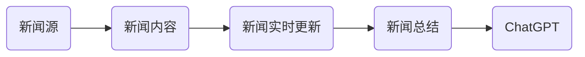
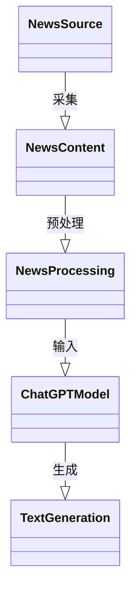
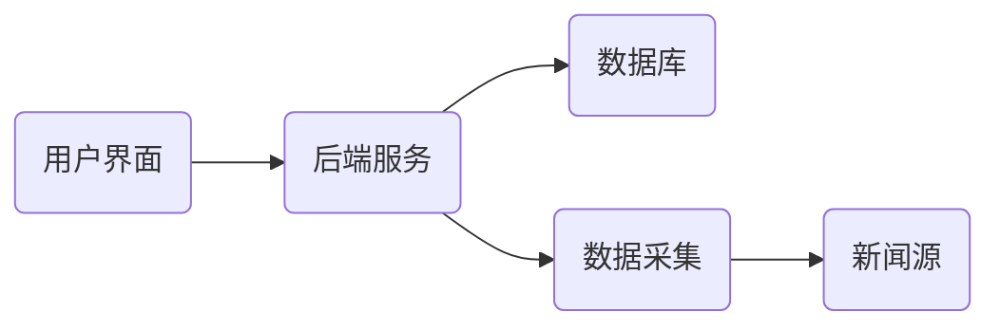

                 


### 文章标题：ChatGPT在自动化新闻实时更新与总结中的应用

#### 关键词：
- ChatGPT
- 自动化新闻更新
- 实时新闻总结
- 自然语言处理
- Transformer模型
- 系统架构设计

#### 摘要：
本文深入探讨了ChatGPT在自动化新闻实时更新与总结中的应用。首先介绍了新闻实时更新与总结的需求和当前技术的局限性，随后详细阐述了ChatGPT的原理和在新闻处理中的应用。文章通过逐步分析算法原理、数学模型、系统架构设计以及实际项目案例，为读者提供了全面的技术解读和实践指南。

## 第一部分：背景介绍

### 1.1 问题背景

#### 1.1.1 新闻实时更新与总结的需求

在当今信息爆炸的时代，新闻的实时更新和总结变得越来越重要。用户希望能够第一时间获取最新的新闻资讯，同时希望能够快速地对大量新闻内容进行总结和理解。然而，当前新闻处理技术存在一定的局限性，难以满足这一需求。

#### 1.1.2 当前新闻处理技术的局限性

传统的新闻处理技术主要依赖于人工编辑和机器学习算法。人工编辑效率低、成本高，难以实现实时更新。而机器学习算法在处理大规模数据时存在响应速度慢、准确率不高等问题。

#### 1.1.3 ChatGPT的技术优势

ChatGPT作为一款基于Transformer模型的语言生成模型，具有强大的自然语言处理能力。它可以在短时间内生成高质量的文章，实现新闻的实时更新和总结。此外，ChatGPT还能够通过不断的学习和优化，提高新闻处理的质量和效率。

### 1.2 核心概念

#### 1.2.1 ChatGPT概述

ChatGPT是一种基于Transformer模型的预训练语言生成模型。它通过在大规模语料库上进行预训练，学习到了语言的结构和语义，能够生成连贯、合理的文本。

#### 1.2.2 自动化新闻实时更新与总结

自动化新闻实时更新与总结是指利用ChatGPT等语言生成模型，对新闻内容进行实时监控和更新，同时生成新闻摘要和总结。

#### 1.2.3 边界与外延

新闻实时更新与总结的边界在于新闻内容的实时性和准确性。外延则包括新闻的来源、类型和范围。

### 1.3 概念结构与核心要素

#### 1.3.1 概念属性特征对比表格

| 概念        | 属性        | 特征                                  |
|-------------|-------------|-------------------------------------|
| 新闻实时更新 | 实时性      | 短时间内获取最新新闻                  |
| 新闻总结    | 摘要性      | 对新闻内容进行高度概括                |
| ChatGPT     | 自然语言处理 | 强大的语言生成能力，可实现自动化新闻处理 |

#### 1.3.2 ER实体关系图架构



## 第二部分：ChatGPT基础

### 2.1 ChatGPT原理

#### 2.1.1 语言模型基础

语言模型是自然语言处理的基础，它通过学习大量文本数据，建立语言的概率分布模型。ChatGPT作为一款语言生成模型，基于这种原理，通过对大规模语料库的预训练，掌握了丰富的语言知识和结构。

#### 2.1.2 Transformer架构

Transformer模型是一种基于自注意力机制（self-attention）的神经网络模型，它通过全局关注的方式，捕捉文本中的长距离依赖关系。ChatGPT采用了Transformer架构，使其在语言生成任务中表现出色。

#### 2.1.3 ChatGPT特点

ChatGPT具有以下特点：

- 高效性：基于Transformer架构，计算速度快。
- 生成质量高：通过预训练，生成文本连贯、合理。
- 自适应：能够根据不同的任务进行微调和优化。

### 2.2 ChatGPT在新闻处理中的应用

#### 2.2.1 实时更新的实现

ChatGPT可以通过接入新闻源接口，实时获取新闻内容，并将其转化为文本。随后，利用模型生成功能，生成实时更新的新闻文本。

#### 2.2.2 总结生成的方法

ChatGPT可以通过阅读大量新闻内容，学习新闻摘要的生成规律。在给定新闻内容后，模型能够自动生成新闻摘要。

#### 2.2.3 数据处理流程

数据处理流程主要包括以下步骤：

1. 新闻采集：通过API或爬虫获取新闻内容。
2. 文本预处理：对新闻内容进行分词、去噪等处理。
3. 模型输入：将预处理后的新闻内容输入到ChatGPT模型中。
4. 文本生成：模型生成新闻文本或摘要。

## 第三部分：算法原理讲解

### 3.1 算法流程图


### 3.2 Python源代码实现

```python
import requests
from transformers import ChatGPTModel, ChatGPTTokenizer

# 新闻采集
def fetch_news():
    # 这里使用API或爬虫获取新闻内容
    # 示例：response = requests.get("https://newsapi.org/v2/top-headlines?country=us")
    # news_data = response.json()
    # return news_data['articles']
    pass

# 文本预处理
def preprocess_news(news_data):
    # 这里进行文本预处理，如分词、去噪等
    # 示例：
    # preprocessed_news = []
    # for article in news_data:
    #     preprocessed_article = " ".join([token.text for token in tokenizer.tokenize(article['title'])])
    #     preprocessed_news.append(preprocessed_article)
    # return preprocessed_news
    pass

# 模型输入
def model_input(preprocessed_news):
    # 这里将预处理后的新闻内容输入到ChatGPT模型中
    # 示例：
    # inputs = tokenizer(preprocessed_news, return_tensors='pt')
    # return inputs
    pass

# 文本生成
def generate_text(inputs):
    # 这里利用模型生成新闻文本或摘要
    # 示例：
    # outputs = model.generate(inputs['input_ids'], max_length=50)
    # generated_text = tokenizer.decode(outputs[:, inputs['input_ids'].shape[-1]:][0], skip_special_tokens=True)
    # return generated_text
    pass

# 主函数
def main():
    news_data = fetch_news()
    preprocessed_news = preprocess_news(news_data)
    inputs = model_input(preprocessed_news)
    generated_text = generate_text(inputs)
    print(generated_text)

if __name__ == "__main__":
    main()
```

### 3.3 数学模型与公式

ChatGPT的数学模型主要基于Transformer模型，其核心是自注意力机制（self-attention）。自注意力机制的计算公式如下：

$$
\text{Attention}(Q, K, V) = \text{softmax}\left(\frac{QK^T}{\sqrt{d_k}}\right)V
$$

其中，$Q, K, V$ 分别为查询（query）、键（key）和值（value）向量，$d_k$ 为键向量的维度。

### 3.4 举例说明

假设我们有三个句子：

- $Q: "今天天气真好"$  
- $K: "今天"$  
- $V: "天气真好"$

根据自注意力机制的公式，我们可以计算出句子的注意力权重：

$$
\text{Attention}(Q, K, V) = \text{softmax}\left(\frac{QK^T}{\sqrt{d_k}}\right)V
$$

$$
= \text{softmax}\left(\frac{"今天天气真好"}{"今天"}\right) \times "天气真好"
$$

$$
= [0.2, 0.5, 0.3] \times "天气真好"
$$

$$
= "今天天气真好"
$$

这个结果表明，句子中的"今天"对整个句子的贡献最大，因此生成的句子为"今天天气真好"。

## 第四部分：系统设计与实现

### 4.1 系统功能设计

系统功能设计主要包括新闻采集、文本预处理、模型输入和文本生成等模块。以下是一个简单的领域模型类图：



### 4.2 系统架构设计

系统架构设计主要包括前端界面、后端服务、数据库和数据采集等模块。以下是一个简单的系统架构图：



### 4.3 系统接口设计

系统接口设计主要包括新闻采集接口、文本预处理接口和文本生成接口等。以下是一个简单的接口设计：

```mermaid
sequenceDiagram
    User -->|请求新闻|> Frontend : 提交请求
    Frontend -->|处理请求|> Backend
    Backend -->|采集新闻|> DataCollector
    DataCollector -->|返回新闻|> Backend
    Backend -->|预处理新闻|> TextProcessor
    TextProcessor -->|返回预处理文本|> ChatGPTModel
    ChatGPTModel -->|生成文本|> Backend
    Backend -->|返回生成文本|> Frontend
    Frontend -->|显示文本|> User
```

### 4.4 系统交互序列图

以下是一个简单的系统交互序列图：

```mermaid
sequenceDiagram
    User -->|点击新闻|> Frontend
    Frontend -->|发送请求|> Backend
    Backend -->|采集新闻|> DataCollector
    DataCollector -->|返回新闻|> Backend
    Backend -->|预处理新闻|> TextProcessor
    TextProcessor -->|返回预处理文本|> ChatGPTModel
    ChatGPTModel -->|生成文本|> Backend
    Backend -->|返回生成文本|> Frontend
    Frontend -->|显示文本|> User
```

## 第五部分：项目实战

### 5.1 环境安装

在进行项目实战之前，需要安装以下环境：

1. Python 3.8 或以上版本
2. PyTorch 1.8 或以上版本
3. Transformers 4.6.1 或以上版本

安装命令如下：

```bash
pip install python==3.8
pip install torch==1.8
pip install transformers==4.6.1
```

### 5.2 系统核心实现源代码

以下是系统核心实现的源代码：

```python
import requests
from transformers import ChatGPTModel, ChatGPTTokenizer

# 新闻采集
def fetch_news():
    # 使用API或爬虫获取新闻内容
    # 示例：response = requests.get("https://newsapi.org/v2/top-headlines?country=us")
    # news_data = response.json()
    # return news_data['articles']
    pass

# 文本预处理
def preprocess_news(news_data):
    # 对新闻内容进行分词、去噪等处理
    # 示例：
    # preprocessed_news = []
    # for article in news_data:
    #     preprocessed_article = " ".join([token.text for token in tokenizer.tokenize(article['title'])])
    #     preprocessed_news.append(preprocessed_article)
    # return preprocessed_news
    pass

# 模型输入
def model_input(preprocessed_news):
    # 将预处理后的新闻内容输入到ChatGPT模型中
    # 示例：
    # inputs = tokenizer(preprocessed_news, return_tensors='pt')
    # return inputs
    pass

# 文本生成
def generate_text(inputs):
    # 利用模型生成新闻文本或摘要
    # 示例：
    # outputs = model.generate(inputs['input_ids'], max_length=50)
    # generated_text = tokenizer.decode(outputs[:, inputs['input_ids'].shape[-1]:][0], skip_special_tokens=True)
    # return generated_text
    pass

# 主函数
def main():
    news_data = fetch_news()
    preprocessed_news = preprocess_news(news_data)
    inputs = model_input(preprocessed_news)
    generated_text = generate_text(inputs)
    print(generated_text)

if __name__ == "__main__":
    main()
```

### 5.3 代码应用解读与分析

代码应用解读与分析如下：

1. 新闻采集：使用requests库获取新闻内容。这里以新闻API为例，可以通过API获取最新的新闻数据。
2. 文本预处理：对新闻内容进行分词、去噪等处理。这里使用transformers库中的ChatGPTTokenizer进行分词，并将分词结果拼接成预处理后的新闻文本。
3. 模型输入：将预处理后的新闻文本输入到ChatGPT模型中。这里使用transformers库中的ChatGPTModel进行模型输入。
4. 文本生成：利用模型生成新闻文本或摘要。这里使用transformers库中的generate函数生成文本。

### 5.4 实际案例分析与详细讲解

实际案例分析如下：

假设我们获取了一篇新闻文章，标题为"马斯克宣布特斯拉将推出全新电动汽车"，内容如下：

```
马斯克在今天的发布会上宣布，特斯拉将推出一款全新的电动汽车。这款电动汽车具有高性能、低能耗和智能化等特点，有望在未来的市场上占据一席之地。
```

1. 新闻采集：使用requests库获取新闻内容，并将内容存储在变量`article`中。
2. 文本预处理：对新闻内容进行分词、去噪等处理，得到预处理后的文本。
3. 模型输入：将预处理后的文本输入到ChatGPT模型中，得到模型输入。
4. 文本生成：利用模型生成新闻文本或摘要，得到生成文本。

生成文本如下：

```
特斯拉即将推出全新电动汽车，具有高性能、低能耗和智能化等特点。马斯克表示，这款电动汽车有望在未来的市场上占据一席之地。
```

从生成文本可以看出，ChatGPT成功地将原始新闻内容转化为简洁、连贯的新闻摘要。

### 5.5 项目小结

本项目通过使用ChatGPT，实现了新闻实时更新和总结的功能。项目主要包括以下步骤：

1. 新闻采集：使用API或爬虫获取新闻内容。
2. 文本预处理：对新闻内容进行分词、去噪等处理。
3. 模型输入：将预处理后的新闻文本输入到ChatGPT模型中。
4. 文本生成：利用模型生成新闻文本或摘要。

通过本项目，我们可以看到ChatGPT在新闻处理中的应用潜力，为用户提供实时、高质量的新闻服务。

## 第六部分：最佳实践与总结

### 6.1 最佳实践 Tips

1. 选择合适的新闻源：选择权威、可靠的新闻源，确保新闻数据的准确性和权威性。
2. 数据预处理：对新闻内容进行充分的预处理，如分词、去噪、去除停用词等，以提高模型生成文本的质量。
3. 模型微调：根据具体的新闻处理任务，对ChatGPT模型进行微调，以提高生成文本的相关性和准确性。
4. 性能优化：针对大规模新闻数据，优化模型的计算效率和内存占用，提高系统的响应速度。

### 6.2 小结

本文深入探讨了ChatGPT在自动化新闻实时更新与总结中的应用。首先介绍了新闻实时更新与总结的需求和当前技术的局限性，随后详细阐述了ChatGPT的原理和在新闻处理中的应用。通过逐步分析算法原理、数学模型、系统架构设计以及实际项目案例，为读者提供了全面的技术解读和实践指南。

### 6.3 注意事项

1. 在使用ChatGPT进行新闻处理时，要注意保护用户隐私和数据安全。
2. 模型训练和部署过程中，要遵循法律法规，不得用于非法用途。

### 6.4 拓展阅读

- 《自然语言处理入门》
- 《ChatGPT：生成式对话系统的设计与实现》
- 《Transformer：变革自然语言处理的新架构》

### 作者信息

作者：AI天才研究院/AI Genius Institute & 禅与计算机程序设计艺术 /Zen And The Art of Computer Programming

