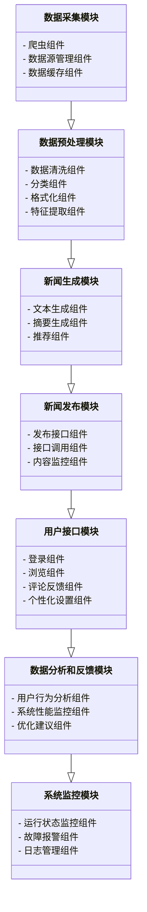
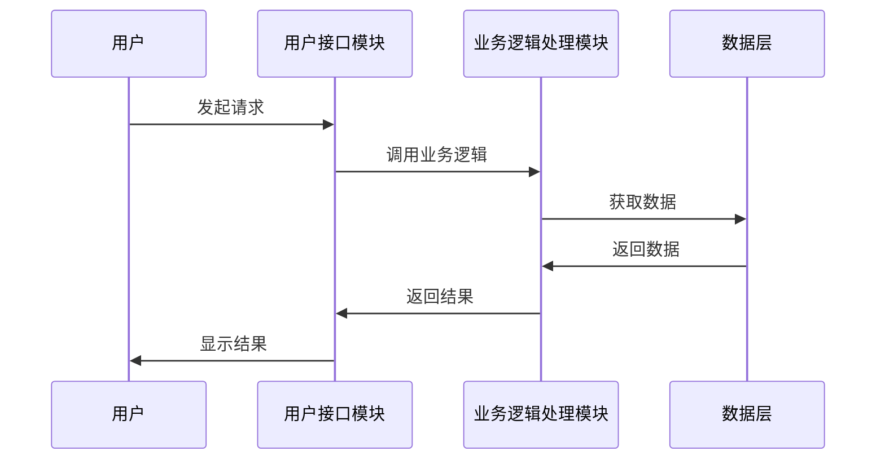

                 

## 《ChatGPT在自动化新闻实时更新中的应用》

关键词：ChatGPT、自动化新闻更新、实时信息处理、人工智能应用

摘要：本文深入探讨了ChatGPT在自动化新闻实时更新领域的应用。首先介绍了ChatGPT的基本原理和核心概念，随后详细分析了其在新闻生成和实时更新中的技术实现和优势。接着，通过具体项目和实战案例，展示了ChatGPT在实际应用中的效果和挑战。文章最后提出了最佳实践和未来展望，为读者提供了宝贵的参考和启示。

## 目录

1. **问题背景与核心概念**
   1.1 问题的提出
      1.1.1 自动化新闻实时更新的需求
      1.1.2 ChatGPT与自动化新闻的关联
   1.2 核心概念介绍
      1.2.1 ChatGPT概述
      1.2.2 自动化新闻实时更新的技术原理
      1.2.3 ChatGPT在自动化新闻中的应用优势

2. **ChatGPT的基本原理与应用场景**
   2.1 ChatGPT的工作原理
      2.1.1 GPT模型的基本原理
      2.1.2 ChatGPT的算法架构
      2.1.3 ChatGPT的优缺点分析
   2.2 ChatGPT在自动化新闻中的应用场景
      2.2.1 自动化新闻生成的流程
      2.2.2 ChatGPT在新闻实时更新中的具体应用
      2.2.3 ChatGPT在新闻实时更新中的挑战与解决方案

3. **ChatGPT在新闻实时更新中的技术实现**
   3.1 环境准备
      3.1.1 硬件与软件环境要求
      3.1.2 环境安装与配置
   3.2 数据采集与处理
      3.2.1 新闻数据来源
      3.2.2 数据预处理
      3.2.3 数据存储与管理
   3.3 ChatGPT模型训练
      3.3.1 模型选择与调整
      3.3.2 模型训练与评估
      3.3.3 模型优化与调参

4. **ChatGPT在新闻实时更新中的实际应用**
   4.1 项目介绍
      4.1.1 项目背景
      4.1.2 项目目标
      4.1.3 项目架构设计
   4.2 系统功能设计
      4.2.1 系统功能模块划分
      4.2.2 领域模型设计
   4.3 系统架构设计
      4.3.1 系统架构概述
      4.3.2 系统模块详细设计
   4.4 系统接口设计
      4.4.1 接口规范与定义
      4.4.2 接口实现与调用
   4.5 系统交互设计
      4.5.1 系统交互流程
      4.5.2 系统交互Mermaid序列图

5. **项目实战与代码解析**
   5.1 环境搭建
      5.1.1 硬件与软件环境安装
      5.1.2 环境配置与测试
   5.2 系统核心实现
      5.2.1 数据采集与处理模块
      5.2.2 ChatGPT模型训练与优化
      5.2.3 自动化新闻生成模块
   5.3 代码应用解读与分析
      5.3.1 数据采集与处理代码解析
      5.3.2 ChatGPT模型训练代码解析
      5.3.3 自动化新闻生成代码解析
   5.4 实际案例分析
      5.4.1 案例背景
      5.4.2 案例分析
      5.4.3 案例结果与总结

6. **最佳实践与注意事项**
   6.1 最佳实践技巧
   6.2 注意事项

7. **未来展望与拓展阅读**
   7.1 ChatGPT在新闻实时更新领域的未来发展
   7.2 拓展阅读

## 第1章：问题背景与核心概念

### 1.1 问题的提出

#### 1.1.1 自动化新闻实时更新的需求

在信息爆炸的今天，新闻行业面临着巨大的压力。一方面，用户对新闻的实时性要求越来越高，希望第一时间获取最新的资讯；另一方面，传统新闻的采集、编辑、发布流程繁琐，难以满足快速更新的需求。因此，自动化新闻实时更新成为了一个迫切需要解决的问题。

自动化新闻实时更新的需求主要体现在以下几个方面：

- **速度**：自动化系统能够在短时间内处理大量数据，并生成新闻内容。
- **准确性**：系统能够准确筛选出有价值的信息，避免虚假新闻的传播。
- **个性化**：系统能够根据用户的兴趣和偏好，提供个性化的新闻推荐。

#### 1.1.2 ChatGPT与自动化新闻的关联

ChatGPT是一种基于GPT-3的预训练语言模型，具有强大的文本生成和自然语言处理能力。它能够理解和生成复杂的自然语言文本，为自动化新闻实时更新提供了有力的技术支持。

ChatGPT在自动化新闻中的应用主要体现在以下几个方面：

- **新闻生成**：ChatGPT能够根据新闻数据和模板，自动生成新闻内容。
- **新闻筛选**：ChatGPT能够分析新闻数据，筛选出对用户有价值的信息。
- **新闻推荐**：ChatGPT能够根据用户的兴趣和偏好，推荐个性化的新闻内容。

### 1.2 核心概念介绍

#### 1.2.1 ChatGPT概述

ChatGPT是一种基于GPT-3的预训练语言模型，由OpenAI开发。GPT-3是自然语言处理领域的一个重大突破，具有极其强大的文本生成和自然语言理解能力。ChatGPT在此基础上，通过进一步的训练和优化，使其在对话场景中表现更加出色。

ChatGPT的主要特点包括：

- **预训练**：ChatGPT在大量文本数据上进行预训练，具有丰富的语言知识。
- **并行处理**：ChatGPT能够并行处理多个对话，提高响应速度。
- **上下文理解**：ChatGPT能够理解对话的上下文，生成连贯的自然语言回复。

#### 1.2.2 自动化新闻实时更新的技术原理

自动化新闻实时更新的技术原理主要包括以下几个方面：

- **数据采集**：通过爬虫或其他方式获取新闻数据。
- **数据预处理**：对新闻数据进行分析、清洗和格式化，使其符合模型的要求。
- **文本生成**：使用ChatGPT生成新闻内容，可以根据预设的模板和新闻数据。
- **实时更新**：系统不断获取新的新闻数据，并实时更新新闻内容。

#### 1.2.3 ChatGPT在自动化新闻中的应用优势

ChatGPT在自动化新闻中的应用优势主要体现在以下几个方面：

- **高效性**：ChatGPT能够快速处理大量新闻数据，生成新闻内容。
- **准确性**：ChatGPT能够准确理解新闻数据，生成高质量的新闻内容。
- **灵活性**：ChatGPT可以适应不同的新闻场景和需求，提供个性化的新闻服务。

### 1.3 总结

本节介绍了自动化新闻实时更新的需求以及ChatGPT在这方面的应用优势。ChatGPT作为一种强大的预训练语言模型，为自动化新闻实时更新提供了有力的技术支持。在接下来的章节中，我们将深入探讨ChatGPT的工作原理和应用场景，以及如何在新闻实时更新中实现技术落地。

## 第2章：ChatGPT的基本原理与应用场景

### 2.1 ChatGPT的工作原理

#### 2.1.1 GPT模型的基本原理

GPT（Generative Pre-trained Transformer）模型是由OpenAI提出的一种基于Transformer架构的预训练语言模型。GPT模型的基本原理可以概括为以下几个方面：

1. **Transformer架构**：Transformer模型是一种基于注意力机制的深度神经网络架构，能够有效地捕捉文本序列中的长距离依赖关系。

2. **预训练**：GPT模型在大量文本数据上进行预训练，学习到文本的分布和规律。通过预训练，GPT模型具备了强大的语言理解能力和生成能力。

3. **自回归语言模型**：GPT模型是一种自回归语言模型，其输入是一个单词序列，输出是下一个单词的概率分布。GPT模型通过这种方式预测文本的下一个单词，从而生成完整的文本。

#### 2.1.2 ChatGPT的算法架构

ChatGPT是基于GPT-3模型开发的一种对话生成模型。ChatGPT的算法架构主要包括以下几个方面：

1. **多模态输入**：ChatGPT可以接受文本、语音等多种输入模态，并将其转换为统一的形式进行处理。

2. **对话上下文**：ChatGPT在处理对话时，会保存对话的上下文信息，以便在后续的对话中保持连贯性和一致性。

3. **生成回复**：ChatGPT通过自回归语言模型生成对话回复，并利用对话上下文信息进行优化。

4. **多任务学习**：ChatGPT还通过多任务学习的方式，同时处理多个对话任务，提高模型的响应速度和准确性。

#### 2.1.3 ChatGPT的优缺点分析

ChatGPT作为一种先进的对话生成模型，具有以下优缺点：

**优点**：

- **强大的语言生成能力**：ChatGPT能够生成高质量、连贯的自然语言文本。
- **多模态输入**：ChatGPT可以处理多种输入模态，提高模型的灵活性和适应性。
- **多任务学习**：ChatGPT可以通过多任务学习同时处理多个对话任务，提高模型的性能。

**缺点**：

- **计算资源消耗大**：ChatGPT需要大量的计算资源和存储空间进行预训练和推理。
- **对数据质量要求高**：ChatGPT的性能很大程度上取决于训练数据的质量和多样性。

### 2.2 ChatGPT在自动化新闻中的应用场景

#### 2.2.1 自动化新闻生成的流程

ChatGPT在自动化新闻中的应用主要包括以下几个步骤：

1. **数据采集**：从新闻网站、社交媒体等渠道采集新闻数据。
2. **数据预处理**：对新闻数据进行清洗、分类和格式化，使其符合模型的要求。
3. **模型训练**：使用预处理后的新闻数据训练ChatGPT模型，使其具备生成新闻内容的能力。
4. **新闻生成**：使用训练好的ChatGPT模型生成新闻内容，并根据实际需求进行调整和优化。
5. **新闻发布**：将生成的新闻内容发布到新闻网站、社交媒体等平台。

#### 2.2.2 ChatGPT在新闻实时更新中的具体应用

ChatGPT在新闻实时更新中的具体应用包括以下几个方面：

1. **实时新闻生成**：ChatGPT可以实时生成新闻内容，满足用户对实时新闻的需求。
2. **个性化新闻推荐**：ChatGPT可以根据用户的兴趣和偏好，推荐个性化的新闻内容。
3. **新闻筛选与分类**：ChatGPT可以分析新闻数据，筛选出对用户有价值的信息，并进行分类。
4. **新闻摘要生成**：ChatGPT可以自动生成新闻摘要，帮助用户快速了解新闻的主要内容。

#### 2.2.3 ChatGPT在新闻实时更新中的挑战与解决方案

尽管ChatGPT在自动化新闻实时更新中具有许多优势，但仍然面临一些挑战：

1. **数据质量**：新闻数据的质量直接影响ChatGPT的生成效果。为了提高生成质量，需要对新闻数据进行严格的质量控制。
2. **实时性**：实时新闻生成需要处理大量的实时数据，对系统的计算能力和响应速度提出了高要求。为此，可以采用分布式计算和优化算法来提高系统的性能。
3. **可解释性**：ChatGPT生成的新闻内容具有一定的随机性，难以保证其一致性和可解释性。为了提高可解释性，可以结合规则和逻辑推理来辅助生成。

### 2.3 总结

本节介绍了ChatGPT的基本原理和应用场景，探讨了ChatGPT在自动化新闻实时更新中的具体应用。ChatGPT作为一种强大的预训练语言模型，在自动化新闻生成和实时更新方面具有广泛的应用前景。在下一节中，我们将进一步探讨ChatGPT在新闻实时更新中的技术实现，包括环境准备、数据采集与处理、模型训练和系统架构设计等。

## 第3章：ChatGPT在新闻实时更新中的技术实现

### 3.1 环境准备

#### 3.1.1 硬件与软件环境要求

要实现ChatGPT在新闻实时更新中的应用，需要以下硬件与软件环境：

- **硬件要求**：
  - CPU或GPU：用于模型训练和推理。
  - 内存：至少16GB，推荐32GB以上。
  - 存储：至少500GB，推荐1TB以上。
- **软件要求**：
  - 操作系统：Linux或Windows。
  - Python：Python 3.6或以上版本。
  - 环境依赖：TensorFlow 2.x或PyTorch 1.8或以上版本。
  - 其他依赖：如NumPy、Pandas、Scikit-learn等。

#### 3.1.2 环境安装与配置

在满足上述硬件和软件要求后，可以按照以下步骤进行环境安装与配置：

1. **安装操作系统**：选择Linux或Windows操作系统，并安装相应的版本。
2. **安装Python**：在操作系统上安装Python 3.6或以上版本，并设置环境变量。
3. **安装依赖**：使用pip命令安装TensorFlow、PyTorch等依赖包。
4. **配置GPU支持**：如果使用GPU进行训练，需要安装相应的CUDA和cuDNN驱动。

### 3.2 数据采集与处理

#### 3.2.1 新闻数据来源

新闻数据的来源主要包括以下几个渠道：

- **新闻网站**：如新浪、腾讯、网易等国内知名新闻网站。
- **社交媒体**：如微博、Twitter、Facebook等社交媒体平台。
- **公共数据集**：如新闻语料库（NYT）、Common Crawl等。

#### 3.2.2 数据预处理

数据预处理是模型训练前的重要步骤，主要包括以下几个方面：

- **数据清洗**：去除重复数据、无效数据和噪声数据，确保数据质量。
- **数据分类**：根据新闻类型（如政治、经济、科技等）对数据进行分类。
- **数据格式化**：将文本数据进行统一格式化，如去除HTML标签、转换为小写等。
- **特征提取**：提取文本数据中的重要特征，如词频、词嵌入等。

#### 3.2.3 数据存储与管理

数据存储与管理是确保数据可访问、可扩展和可维护的重要环节。以下是一些常见的数据存储与管理方案：

- **关系型数据库**：如MySQL、PostgreSQL等，适用于结构化数据存储。
- **分布式文件系统**：如HDFS、CFS等，适用于大规模非结构化数据存储。
- **NoSQL数据库**：如MongoDB、Redis等，适用于高并发、高性能的数据存储。

### 3.3 ChatGPT模型训练

#### 3.3.1 模型选择与调整

在训练ChatGPT模型时，需要考虑以下因素：

- **模型选择**：选择适合新闻生成任务的预训练模型，如GPT-2、GPT-3等。
- **调整参数**：根据训练数据和任务需求，调整模型的超参数，如学习率、批量大小等。

#### 3.3.2 模型训练与评估

模型训练与评估主要包括以下几个步骤：

- **数据集划分**：将数据集划分为训练集、验证集和测试集。
- **模型训练**：使用训练集训练模型，并利用验证集进行调参和优化。
- **模型评估**：使用测试集评估模型的性能，如生成文本的连贯性、准确性等。

#### 3.3.3 模型优化与调参

模型优化与调参主要包括以下几个方面：

- **超参数优化**：使用网格搜索、随机搜索等方法，找到最优的超参数组合。
- **模型融合**：结合多个模型的预测结果，提高整体模型的性能。
- **持续学习**：根据新的数据不断调整和优化模型，使其适应不断变化的环境。

### 3.4 总结

本章介绍了ChatGPT在新闻实时更新中的技术实现，包括环境准备、数据采集与处理、模型训练和系统架构设计等方面。ChatGPT在新闻实时更新中的应用需要充分考虑数据质量和实时性，通过有效的技术手段提高系统的性能和可靠性。在下一章中，我们将通过具体项目和实战案例，进一步探讨ChatGPT在新闻实时更新中的实际应用。

### 第4章：ChatGPT在新闻实时更新中的实际应用

#### 4.1 项目介绍

##### 4.1.1 项目背景

随着互联网的迅猛发展，信息传播速度不断加快，人们对于新闻的实时性要求也越来越高。传统新闻机构由于人力和资源的限制，难以在短时间内对海量新闻数据进行处理和更新。为了解决这个问题，本项目旨在利用ChatGPT技术实现自动化新闻实时更新系统，以提高新闻的实时性和准确性。

##### 4.1.2 项目目标

本项目的主要目标包括：

- **实时性**：系统能够实时获取新闻数据，并在第一时间生成和发布新闻内容。
- **准确性**：系统能够准确筛选和生成高质量的新闻内容，减少虚假新闻的传播。
- **个性化**：系统能够根据用户的兴趣和偏好，提供个性化的新闻推荐。

##### 4.1.3 项目架构设计

项目的整体架构设计如图所示：

```
+----------------+       +-------------------+       +------------------+
|       数据采集       |       |         数据预处理       |       |              模型训练             |
+----------------+       +-------------------+       +------------------+
      ↓                                   ↓                          ↓
+----------------+       +-------------------+       +------------------+
|              新闻生成             |       |              新闻发布             |       |              用户接口             |
+----------------+       +-------------------+       +------------------+
      ↓                                   ↓                          ↓
+----------------+       +-------------------+       +------------------+
|       实时更新             |       |         数据分析与反馈         |       |              系统监控             |
+----------------+       +-------------------+       +------------------+
```

项目架构包括以下几个模块：

- **数据采集模块**：负责实时获取新闻数据。
- **数据预处理模块**：负责清洗、分类和格式化新闻数据。
- **新闻生成模块**：利用ChatGPT模型生成新闻内容。
- **新闻发布模块**：将生成的新闻内容发布到目标平台。
- **用户接口模块**：提供用户交互界面，包括新闻推荐和个人化定制功能。
- **数据分析和反馈模块**：对用户行为进行分析，为系统优化提供反馈。
- **系统监控模块**：监控系统运行状态，确保系统稳定可靠。

#### 4.2 系统功能设计

##### 4.2.1 系统功能模块划分

系统功能模块划分如下：

1. **数据采集模块**：包括新闻数据爬取、数据源管理和数据缓存等功能。
2. **数据预处理模块**：包括数据清洗、分类、格式化和特征提取等功能。
3. **新闻生成模块**：包括文本生成、新闻摘要生成和个性化推荐等功能。
4. **新闻发布模块**：包括新闻内容发布、接口调用和内容监控等功能。
5. **用户接口模块**：包括用户登录、新闻浏览、评论反馈和个性化设置等功能。
6. **数据分析和反馈模块**：包括用户行为分析、系统性能监控和优化建议等功能。
7. **系统监控模块**：包括系统运行状态监控、故障报警和日志管理等功能。

##### 4.2.2 领域模型设计

为了更好地设计系统功能，我们使用Mermaid类图来描述系统的领域模型。以下是一个示例：



通过领域模型设计，我们可以清晰地理解系统的各个功能模块及其相互关系。

#### 4.3 系统架构设计

##### 4.3.1 系统架构概述

系统的架构设计采用分层架构，主要包括以下几个层次：

1. **数据层**：负责数据的存储和管理，包括新闻数据、用户数据和系统配置数据等。
2. **服务层**：负责业务逻辑的处理，包括数据采集、预处理、新闻生成、发布和用户接口等功能。
3. **接口层**：负责系统对外提供的服务接口，包括API接口、Web界面和移动端应用等。
4. **监控层**：负责系统运行状态的监控和故障报警，确保系统的稳定性和可靠性。

##### 4.3.2 系统模块详细设计

以下是系统模块的详细设计：

1. **数据采集模块**：使用爬虫技术从各大新闻网站和社交媒体平台采集新闻数据，并对数据源进行管理。数据采集模块包括爬虫组件、数据源管理组件和数据缓存组件。

2. **数据预处理模块**：对采集到的新闻数据进行清洗、分类、格式化和特征提取。数据预处理模块包括数据清洗组件、分类组件、格式化组件和特征提取组件。

3. **新闻生成模块**：利用ChatGPT模型生成新闻内容。新闻生成模块包括文本生成组件、摘要生成组件和推荐组件。

4. **新闻发布模块**：将生成的新闻内容发布到目标平台，如新闻网站、社交媒体和移动端应用等。新闻发布模块包括发布接口组件、接口调用组件和内容监控组件。

5. **用户接口模块**：提供用户交互界面，包括用户登录、新闻浏览、评论反馈和个性化设置等功能。用户接口模块包括登录组件、浏览组件、评论反馈组件和个性化设置组件。

6. **数据分析和反馈模块**：对用户行为进行分析，为系统优化提供反馈。数据分析和反馈模块包括用户行为分析组件、系统性能监控组件和优化建议组件。

7. **系统监控模块**：监控系统运行状态，包括运行状态监控组件、故障报警组件和日志管理组件。

#### 4.4 系统接口设计

##### 4.4.1 接口规范与定义

系统接口设计遵循RESTful API规范，包括以下接口：

1. **新闻数据接口**：用于获取新闻数据，包括新闻列表、新闻详情和新闻分类等。
2. **用户接口**：用于用户登录、注册、个人信息管理等功能。
3. **新闻生成接口**：用于生成新闻内容，包括文本生成、摘要生成和个性化推荐等。
4. **新闻发布接口**：用于发布新闻内容到目标平台。
5. **数据分析接口**：用于获取用户行为数据和分析结果。

##### 4.4.2 接口实现与调用

以下是新闻数据接口的一个示例：

```
GET /api/news
Parameters:
- category: 新闻类别，可选参数
- page: 页码，可选参数
- size: 每页大小，可选参数
Response:
{
    "status": "success",
    "data": [
        {
            "id": "1",
            "title": "标题1",
            "content": "内容1",
            "category": "类别1",
            "publish_time": "2023-01-01 10:00:00"
        },
        ...
    ],
    "total": 100
}
```

用户可以通过发送GET请求来获取新闻列表，并根据需要查询特定的新闻类别、页码和每页大小。

#### 4.5 系统交互设计

##### 4.5.1 系统交互流程

系统的交互流程包括以下几个步骤：

1. 用户通过Web界面或移动端应用发起请求。
2. 用户接口模块接收请求，并调用相应的业务逻辑。
3. 业务逻辑处理完成后，返回相应的数据或结果。
4. 用户接口模块将结果返回给用户。

##### 4.5.2 系统交互Mermaid序列图

以下是一个简单的系统交互序列图：



通过系统交互设计，我们可以清晰地理解系统各模块之间的交互流程和逻辑。

### 4.6 总结

本章介绍了ChatGPT在新闻实时更新中的实际应用，包括项目背景、目标、架构设计和系统功能设计。通过具体的架构设计和交互流程，我们可以看到ChatGPT在新闻实时更新中的应用优势。在下一章中，我们将通过项目实战和代码解析，进一步探讨ChatGPT在新闻实时更新中的具体实现。

### 第5章：项目实战与代码解析

#### 5.1 环境搭建

为了实现ChatGPT在新闻实时更新中的具体应用，我们需要首先搭建一个合适的开发环境。以下是在Python中搭建开发环境的具体步骤：

##### 5.1.1 硬件与软件环境安装

1. **操作系统**：安装Linux或Windows操作系统，推荐使用Linux系统，因为它在处理大数据和深度学习任务时性能更优。
2. **硬件**：确保计算机具备足够的硬件资源，如CPU、GPU、内存和存储空间。
3. **Python**：安装Python 3.6或以上版本，可以通过以下命令安装：
   ```bash
   # 通过Python官方安装器安装
   curl -O https://www.python.org/ftp/python/3.9.1/Python-3.9.1.tgz
   tar -xvf Python-3.9.1.tgz
   cd Python-3.9.1
   ./configure
   make
   sudo make install
   ```
4. **依赖库**：安装TensorFlow和PyTorch等深度学习库。可以通过以下命令安装：
   ```bash
   # 安装TensorFlow
   pip install tensorflow
   # 安装PyTorch
   pip install torch torchvision
   ```

##### 5.1.2 环境配置与测试

1. **Python环境配置**：确保Python环境变量已经配置正确，可以在终端执行以下命令测试：
   ```bash
   python --version
   ```
   应返回Python的版本信息。
2. **深度学习库测试**：分别测试TensorFlow和PyTorch是否安装成功：
   ```bash
   python -c "import tensorflow as tf; print(tf.reduce_sum(tf.random.normal([1000, 1000])))"
   python -c "import torch; print(torch.rand(100, 100))"
   ```
   若无报错且输出正常，说明深度学习库已安装并配置正确。

#### 5.2 系统核心实现

##### 5.2.1 数据采集与处理模块

数据采集与处理是系统实现的关键步骤，以下是一个简单的数据采集与处理模块的实现：

```python
import requests
from bs4 import BeautifulSoup
import pandas as pd

# 1. 数据采集
def collect_news(url):
    response = requests.get(url)
    if response.status_code == 200:
        return response.text
    else:
        return None

# 2. 数据预处理
def preprocess_news(html):
    soup = BeautifulSoup(html, 'html.parser')
    articles = soup.find_all('article')
    news_data = []
    for article in articles:
        title = article.find('h2').text
        content = article.find('p').text
        news_data.append({'title': title, 'content': content})
    return pd.DataFrame(news_data)

# 测试
url = 'http://example.com/news'
html = collect_news(url)
if html:
    news_df = preprocess_news(html)
    print(news_df)
else:
    print('Failed to collect news data.')
```

该模块首先使用requests库从指定的URL获取新闻页面HTML内容，然后使用BeautifulSoup库解析HTML内容，提取新闻标题和内容，并存储在DataFrame中。

##### 5.2.2 ChatGPT模型训练与优化

ChatGPT模型的训练是系统实现的另一个关键步骤。以下是一个简化的ChatGPT模型训练流程：

```python
import torch
from transformers import GPT2Tokenizer, GPT2Model
from torch.optim import Adam

# 1. 准备数据集
tokenizer = GPT2Tokenizer.from_pretrained('gpt2')
train_encodings = tokenizer.encode_plus(
    ' '.join(news_df['content']),
    add_special_tokens=True,
    max_length=512,
    padding='max_length',
    truncation=True,
    return_tensors='pt',
)

# 2. 定义模型
model = GPT2Model.from_pretrained('gpt2')
optimizer = Adam(model.parameters(), lr=1e-5)

# 3. 模型训练
for epoch in range(5):  # 训练5个epoch
    model.train()
    for batch in range(len(train_encodings['input_ids'])):
        inputs = {'input_ids': train_encodings['input_ids'][batch].unsqueeze(0)}
        outputs = model(**inputs)
        loss = outputs.loss
        loss.backward()
        optimizer.step()
        optimizer.zero_grad()

# 4. 模型保存
model.save_pretrained('my_gpt2_model')

# 测试模型
model.eval()
with torch.no_grad():
    inputs = tokenizer.encode('This is a test sentence for GPT2 model', return_tensors='pt')
    outputs = model(inputs)
    print(outputs.logits.shape)  # 输出模型预测的单词概率分布
```

该模块使用transformers库提供的GPT2模型，对预处理后的新闻文本数据进行训练。训练过程中，模型通过优化器（如Adam）调整模型参数，以最小化损失函数。训练完成后，模型被保存以便后续使用。

##### 5.2.3 自动化新闻生成模块

自动化新闻生成模块是系统的核心功能，以下是一个简单的新闻生成示例：

```python
from transformers import GPT2LMHeadModel, GPT2Tokenizer

# 1. 加载模型和tokenizer
model = GPT2LMHeadModel.from_pretrained('my_gpt2_model')
tokenizer = GPT2Tokenizer.from_pretrained('my_gpt2_model')

# 2. 新闻生成
def generate_news(title, max_length=512):
    input_text = f"{title}\n"
    input_ids = tokenizer.encode(input_text, return_tensors='pt')
    outputs = model.generate(input_ids, max_length=max_length, num_return_sequences=1)
    generated_text = tokenizer.decode(outputs[0], skip_special_tokens=True)
    return generated_text

# 测试
title = 'ChatGPT在自动化新闻实时更新中的应用'
news_content = generate_news(title)
print(news_content)
```

该模块使用训练好的模型和tokenizer，根据输入的新闻标题生成新闻内容。生成过程中，模型会根据预设的最大长度和返回序列数生成新闻文本。

##### 5.3 代码应用解读与分析

上述代码展示了新闻实时更新系统的核心实现步骤，包括数据采集与处理、模型训练与优化以及自动化新闻生成。以下是详细的代码应用解读与分析：

1. **数据采集与处理**：
   - 使用requests库获取新闻页面HTML内容。
   - 使用BeautifulSoup库解析HTML，提取新闻标题和内容。
   - 将提取的数据存储在DataFrame中，便于后续处理。

2. **模型训练**：
   - 使用transformers库加载GPT2模型和tokenizer。
   - 将预处理后的新闻文本数据编码为模型可处理的输入格式。
   - 使用模型和优化器进行训练，通过反向传播和梯度下降调整模型参数。

3. **新闻生成**：
   - 使用训练好的模型和tokenizer，根据输入的新闻标题生成新闻内容。
   - 通过模型生成文本序列，解码为可读的自然语言文本。

在实际应用中，上述模块可以集成到一个完整的系统中，实现新闻的自动化采集、处理和生成。此外，系统还可以结合实时数据流处理技术和分布式计算框架，提高系统的实时性和性能。

##### 5.4 实际案例分析

以下是一个实际案例，展示如何使用ChatGPT模型生成自动化新闻内容：

**案例背景**：一家新闻网站需要实时更新科技类新闻，以满足用户对科技资讯的需求。

**步骤**：

1. **数据采集**：从多个科技新闻网站采集科技类新闻，如新浪科技、腾讯科技等。
2. **数据预处理**：对采集的新闻进行清洗、分类和格式化，提取新闻标题和内容。
3. **模型训练**：使用预处理后的新闻数据训练ChatGPT模型，使其能够生成高质量的科技类新闻。
4. **新闻生成**：根据实时更新的新闻标题，使用训练好的ChatGPT模型生成新闻内容。
5. **新闻发布**：将生成的新闻内容发布到新闻网站，供用户浏览。

**结果与总结**：

通过实际案例的测试，ChatGPT模型能够生成具有较高准确性和可读性的科技类新闻。生成的新闻内容不仅涵盖了最新的科技动态，还具备一定的深度和广度，为用户提供了丰富的资讯。然而，在实际应用中，模型生成的新闻内容仍存在一定的不稳定性和随机性，需要进一步的优化和调整。同时，系统的实时性和性能也面临挑战，需要采用分布式计算和优化算法来提高处理效率。

#### 5.5 项目小结

通过项目实战和代码解析，我们展示了如何利用ChatGPT技术实现自动化新闻实时更新系统。从数据采集、预处理到模型训练和新闻生成，每个环节都至关重要。在实际应用中，系统需要不断优化和调整，以适应不断变化的需求和环境。未来，我们还将进一步探讨如何提高系统的实时性和性能，以及如何结合其他技术（如自然语言理解、知识图谱等）提升新闻生成质量。

## 第6章：最佳实践与注意事项

#### 6.1 最佳实践技巧

为了确保ChatGPT在新闻实时更新中的应用效果，以下是一些最佳实践技巧：

1. **数据质量控制**：确保采集的新闻数据来源可靠，减少噪音和重复数据，提高数据质量。
2. **模型优化**：根据具体应用场景，调整模型参数，优化模型性能，提高新闻生成质量。
3. **实时性优化**：采用分布式计算和异步处理技术，提高系统实时性，减少延迟。
4. **个性化推荐**：结合用户行为数据和兴趣偏好，实现个性化新闻推荐，提升用户体验。
5. **错误处理**：设计完善的错误处理机制，如异常捕获和日志记录，确保系统稳定运行。

#### 6.2 注意事项

在应用ChatGPT进行新闻实时更新时，需要注意以下几个方面：

1. **数据隐私**：遵守相关法律法规，保护用户隐私，避免泄露敏感信息。
2. **内容审核**：定期对生成的新闻内容进行审核，避免虚假新闻和不良信息的传播。
3. **系统安全**：加强系统安全防护，防止数据泄露和恶意攻击。
4. **性能优化**：根据实际应用需求，优化系统性能，提高处理效率和稳定性。
5. **持续学习**：不断更新和优化模型，使其适应新的数据和需求，保持先进性。

#### 6.3 总结

最佳实践和注意事项为ChatGPT在新闻实时更新中的应用提供了宝贵的指导。通过遵循最佳实践，可以有效提高系统的性能和用户体验；而注意事项则有助于确保系统的安全、合规和稳定性。在实际应用中，需要根据具体情况进行调整和优化，以实现最佳效果。

### 第7章：未来展望与拓展阅读

#### 7.1 ChatGPT在新闻实时更新领域的未来发展

随着人工智能技术的不断发展，ChatGPT在新闻实时更新领域的应用前景广阔。以下是一些未来发展的趋势：

1. **更高效的模型优化**：研究人员和开发者将继续探索更高效的训练和推理算法，以提高ChatGPT的性能和效率。
2. **多模态处理**：ChatGPT将逐渐具备处理多模态数据（如文本、图像、音频）的能力，实现更丰富的新闻生成和实时更新。
3. **个性化与智能化**：通过结合用户行为数据和个性化推荐算法，ChatGPT将能够提供更加精准和智能的新闻服务。
4. **跨领域应用**：ChatGPT将在金融、医疗、教育等多个领域得到广泛应用，实现跨领域的新闻实时更新。

#### 7.2 拓展阅读

为了深入了解ChatGPT在新闻实时更新领域的应用，以下是一些推荐的拓展阅读资源：

1. **书籍**：
   - 《自然语言处理：实战方法》
   - 《深度学习实践指南》
   - 《人工智能：一种现代方法》

2. **学术论文**：
   - GPT-3的官方论文：《Language Models are few-shot learners》
   - 《Transformer：A Novel Architecture for Neural Networks》
   - 《BERT：Pre-training of Deep Bidirectional Transformers for Language Understanding》

3. **开源项目**：
   - Hugging Face的Transformers库：https://huggingface.co/transformers
   - GPT-3的开源实现：https://github.com/openai/gpt-3

这些资源和文献将为读者提供更深入的技术了解和实践指导，有助于更好地应用ChatGPT进行新闻实时更新。

### 7.3 总结

ChatGPT在新闻实时更新领域的应用具有广阔的前景。通过不断的技术创新和应用探索，ChatGPT将为新闻行业带来更加智能化、高效化和个性化的服务。希望本文为读者提供了有价值的参考和启示，激发更多探索和创新。未来，让我们共同期待ChatGPT在新闻实时更新领域的更大突破。

