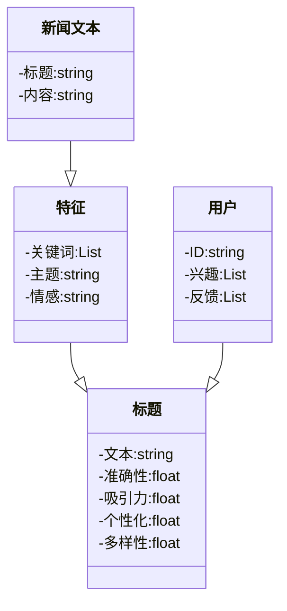
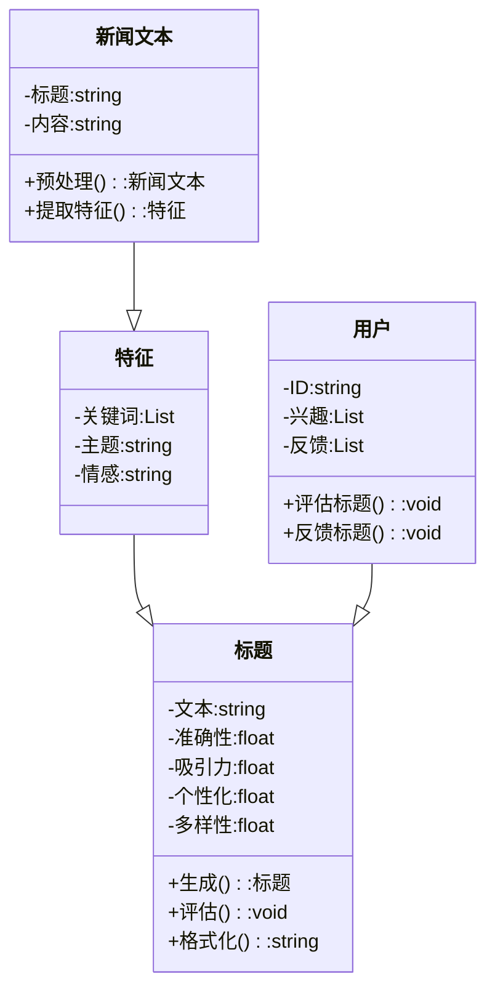
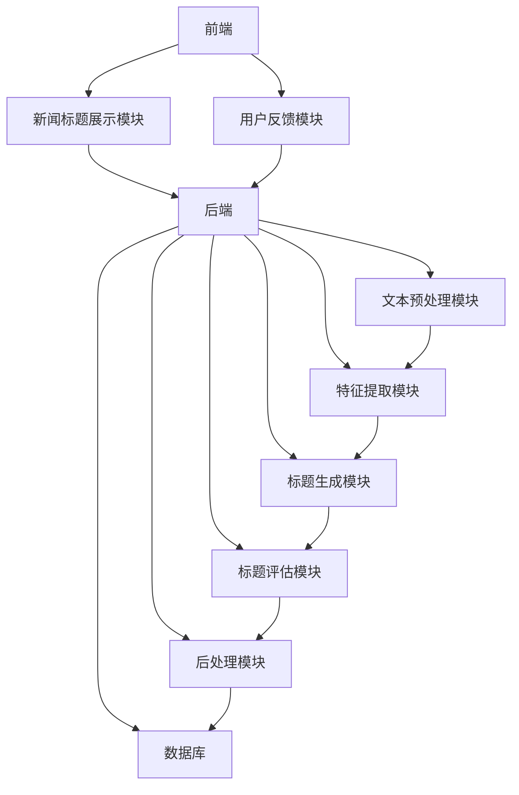
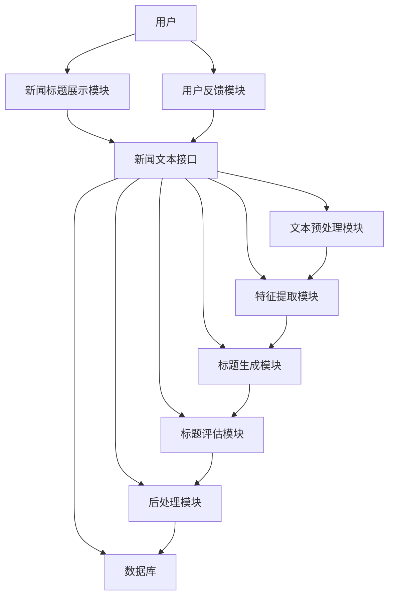

                 

### 第1章 引言与背景

#### 1.1 自动化新闻标题生成的现状与挑战

随着互联网和大数据技术的飞速发展，新闻行业面临着前所未有的变革。自动化新闻标题生成作为新闻自动化处理的重要环节，其研究与应用日益受到关注。自动化新闻标题生成旨在利用计算机技术自动生成新闻标题，以提高新闻生产效率和准确性。然而，当前自动化新闻标题生成面临着诸多挑战。

首先，新闻标题生成的重要性不言而喻。新闻标题是新闻内容的第一印象，它直接影响读者的阅读意愿。一个引人入胜的标题不仅能吸引读者阅读全文，还能提高新闻的传播效果。因此，如何生成具有吸引力和准确性的新闻标题，成为新闻行业亟待解决的问题。

目前，自动化新闻标题生成的水平参差不齐。一方面，传统的规则方法和基于统计的方法已经能够生成一些简单的新闻标题，但往往缺乏创意和个性化。另一方面，随着深度学习和自然语言处理技术的不断发展，基于神经网络的模型在新闻标题生成方面取得了显著成果。然而，这些模型通常需要大量的训练数据和计算资源，且在处理复杂新闻标题时仍存在一定的局限性。

自动化新闻标题生成面临的主要问题包括：

1. **文本理解的深度和广度**：新闻文本通常包含丰富的背景信息、关键词和情感色彩，如何准确理解并提取这些信息，是新闻标题生成的一大难题。

2. **个性化需求**：不同读者对于新闻标题的喜好存在差异，如何根据读者的个性化需求生成相应的标题，是另一个挑战。

3. **多样性**：新闻标题需要具备多样性，以满足不同类型和风格的新闻需求。如何生成具有多样性的标题，是当前研究的重点。

4. **实时性和高效性**：自动化新闻标题生成需要在短时间内处理大量新闻，且具备实时性。这对系统的性能和响应速度提出了高要求。

5. **版权和准确性**：自动化新闻标题生成过程中，如何保证标题的原创性和准确性，避免侵犯版权和产生错误，是另一个需要考虑的问题。

#### 1.2 ChatGPT概述

ChatGPT是由OpenAI开发的一款基于Transformer的预训练语言模型，具有强大的自然语言处理能力。ChatGPT采用了一种称为“生成式预训练+指令微调”的方法，首先在大量文本数据上进行预训练，然后通过指令微调使其能够执行特定任务。

ChatGPT的主要特点包括：

1. **大规模预训练**：ChatGPT在训练过程中使用了大量文本数据，使其具备了丰富的语言知识和表达方式。

2. **灵活的指令微调**：通过指令微调，ChatGPT可以适应各种任务需求，如问答、对话生成、文本摘要等。

3. **强大的生成能力**：ChatGPT能够生成高质量的自然语言文本，具有高度的创造性和准确性。

4. **高效的推理能力**：ChatGPT具备较强的逻辑推理能力，可以处理复杂的语义理解和推理任务。

ChatGPT在自然语言处理中的应用非常广泛，包括但不限于：

1. **问答系统**：ChatGPT可以作为一个智能问答系统，回答用户的问题。

2. **对话生成**：ChatGPT可以生成与用户对话的自然语言文本，用于聊天机器人、客服系统等。

3. **文本摘要**：ChatGPT可以生成文章的摘要，帮助用户快速了解文章的核心内容。

4. **文本生成**：ChatGPT可以生成高质量的文章、报告、故事等文本内容。

5. **语言翻译**：ChatGPT可以用于文本翻译，支持多种语言之间的翻译。

#### 1.3 ChatGPT与新闻标题生成的关联性

ChatGPT在新闻标题生成中的应用具有显著的潜力。首先，ChatGPT具备强大的文本生成能力，可以生成具有吸引力和多样性的新闻标题。其次，ChatGPT的指令微调能力使其能够根据不同的新闻内容和读者需求生成个性化的标题。此外，ChatGPT在理解新闻文本和提取关键信息方面具有优势，有助于生成准确和高质量的新闻标题。

ChatGPT与新闻标题生成的协同作用主要体现在以下几个方面：

1. **文本理解**：ChatGPT可以深入理解新闻文本的内容，提取关键信息，为新闻标题生成提供基础。

2. **标题生成**：ChatGPT可以根据新闻内容和读者需求，生成具有吸引力和个性化的新闻标题。

3. **多样化**：ChatGPT可以生成多种类型的新闻标题，满足不同类型和风格的新闻需求。

4. **实时性**：ChatGPT可以快速生成新闻标题，满足实时新闻发布的需要。

5. **准确性**：ChatGPT可以准确提取新闻文本的关键信息，提高新闻标题的准确性。

#### 1.4 本书结构安排

本书共分为三个主要部分，分别介绍ChatGPT的基础知识、ChatGPT在新闻标题生成中的应用，以及实际应用案例。

第一部分主要介绍ChatGPT的基本概念、模型结构和算法原理，帮助读者理解ChatGPT的工作原理和关键技术。

第二部分重点探讨ChatGPT在新闻标题生成中的应用，包括新闻标题生成的任务描述、ChatGPT与新闻标题生成的结合方法、系统架构设计、实现与优化等。

第三部分通过实际案例，详细讲解如何使用ChatGPT生成新闻标题，并分析实际应用中的挑战和解决方案。

本书旨在为读者提供一个全面、系统的ChatGPT在新闻标题生成中的应用指南，帮助读者深入理解这一领域的前沿技术和发展趋势。

#### 1.5 本章小结

本章介绍了自动化新闻标题生成的现状与挑战，以及ChatGPT在新闻标题生成中的应用潜力。通过分析当前自动化新闻标题生成面临的深度理解、个性化需求、多样性、实时性和准确性等挑战，我们认识到ChatGPT作为一种先进的自然语言处理技术，为解决这些问题提供了有力支持。接下来，本书将深入探讨ChatGPT的基础知识、模型结构、算法原理及其在新闻标题生成中的应用方法，帮助读者全面了解这一前沿技术。希望读者能够通过本章的阅读，对ChatGPT在新闻标题生成中的应用有一个初步的认识，为后续章节的学习打下坚实基础。

---

## 第2章 ChatGPT基础

#### 2.1 自然语言处理基础

自然语言处理（Natural Language Processing，NLP）是计算机科学、人工智能和语言学等领域交叉的学科，旨在让计算机理解和生成人类语言。NLP技术在近年来取得了显著进展，广泛应用于文本分类、情感分析、机器翻译、问答系统等领域。

##### 2.1.1 语言模型简介

语言模型是NLP的核心组件之一，它用于预测文本序列中的下一个单词或字符。语言模型可以分为基于规则的方法和基于统计的方法。

1. **基于规则的方法**：这种方法依赖于语言学知识和人工编写的规则，如形态学分析、句法分析等。优点是解释性强，但缺点是规则难以覆盖所有语言现象，且维护成本高。

2. **基于统计的方法**：这种方法使用大量文本数据，通过统计方法学习语言模式。优点是适应性强，能够处理复杂的语言现象，但缺点是对数据依赖性强，且在低资源环境下表现不佳。

##### 2.1.2 语言模型在NLP中的应用

语言模型在NLP中具有广泛的应用，包括：

1. **文本分类**：利用语言模型对文本进行分类，如新闻分类、垃圾邮件过滤等。

2. **情感分析**：分析文本的情感倾向，如正面、负面、中立等。

3. **机器翻译**：将一种语言的文本翻译成另一种语言，如英译中、中译英等。

4. **问答系统**：根据用户提问，自动生成答案。

5. **文本摘要**：提取文本的核心内容，生成简洁的摘要。

##### 2.1.3 语言模型的评价指标

语言模型的性能通常通过以下指标进行评价：

1. **准确性（Accuracy）**：预测正确的单词或字符数占总数的比例。

2. **损失函数（Loss Function）**：用于衡量模型预测的误差，如交叉熵损失（Cross-Entropy Loss）。

3. ** perplexity（困惑度）**：预测下一个单词或字符的熵值，值越小，表示模型对文本的理解越好。

#### 2.2 ChatGPT模型结构

ChatGPT是基于Transformer架构的大型预训练语言模型。Transformer模型由Vaswani等人于2017年提出，是自然语言处理领域的里程碑之一。ChatGPT在Transformer的基础上进行了一系列改进和扩展，使其具备更强的生成能力和理解能力。

##### 2.2.1 Transformer模型概述

Transformer模型是一种基于自注意力（Self-Attention）机制的序列模型，能够对输入序列进行全局信息建模。其主要优点包括：

1. **并行计算**：Transformer模型利用多头自注意力机制，可以在序列的不同位置之间并行计算，提高了计算效率。

2. **全局依赖**：通过自注意力机制，Transformer模型能够捕捉输入序列中的长距离依赖关系。

3. **灵活性**：Transformer模型结构简单，可以通过调整超参数来适应不同的任务需求。

##### 2.2.2 ChatGPT的具体结构

ChatGPT的具体结构如下：

1. **编码器（Encoder）**：编码器由多个自注意力层和前馈网络组成，用于对输入序列进行编码。每个自注意力层由多头自注意力机制和前馈网络组成。

2. **解码器（Decoder）**：解码器与编码器结构类似，也由多个自注意力层和前馈网络组成。解码器的输入不仅包括编码器的输出，还包括解码器自身的输出。

3. **嵌入层（Embedding Layer）**：嵌入层将输入的单词或字符转换为固定长度的向量。

4. **位置编码（Positional Encoding）**：位置编码用于捕捉输入序列中的位置信息。

5. **输出层（Output Layer）**：输出层通常是一个全连接层，用于对生成的文本进行分类或生成。

##### 2.2.3 ChatGPT的训练过程

ChatGPT的训练过程可以分为两个阶段：预训练和指令微调。

1. **预训练**：在预训练阶段，ChatGPT在大量文本数据上进行训练，学习语言的模式和规则。预训练过程包括自回归语言模型（Autoregressive Language Model）和 masked language model（MLM）两种任务。

   - 自回归语言模型：预测序列中的下一个单词或字符。
   - masked language model（MLM）：将部分单词或字符遮盖，然后预测这些被遮盖的单词或字符。

2. **指令微调**：在指令微调阶段，ChatGPT根据具体任务的需求进行微调。指令微调通常包括以下步骤：

   - 数据准备：准备包含指令和回答的数据集。
   - 模型调整：在指令和回答数据上进行微调，使ChatGPT能够根据指令生成正确的回答。
   - 评估：在评估数据集上评估模型的性能，调整超参数和模型结构，以提高模型性能。

#### 2.3 ChatGPT算法原理

ChatGPT的算法原理基于Transformer模型，采用自注意力机制和编码器-解码器架构。以下是对ChatGPT算法原理的详细解释：

##### 2.3.1 编码与解码

编码器（Encoder）和解码器（Decoder）是ChatGPT的核心组件。编码器用于将输入序列编码为固定长度的向量，解码器则用于生成输出序列。

1. **编码器**：

   编码器由多个自注意力层（Self-Attention Layer）和前馈网络（Feedforward Network）组成。每个自注意力层由多头自注意力（Multi-Head Self-Attention）和前馈网络组成。多头自注意力能够捕捉输入序列中的长距离依赖关系，从而提高模型的表达能力。

   具体来说，编码器的输入序列为 $X = [x_1, x_2, ..., x_n]$，其中 $x_i$ 表示输入序列的第 $i$ 个单词或字符。编码器首先将这些输入序列通过嵌入层（Embedding Layer）转换为固定长度的向量，然后通过多个自注意力层和前馈网络进行编码。

2. **解码器**：

   解码器的工作原理与编码器类似，也由多个自注意力层和前馈网络组成。解码器的输入不仅包括编码器的输出，还包括解码器自身的输出。解码器的目标是根据编码器的输出生成正确的输出序列。

   解码器的输入序列为 $Y = [y_1, y_2, ..., y_n]$，其中 $y_i$ 表示输出序列的第 $i$ 个单词或字符。解码器首先通过嵌入层将这些输入序列转换为固定长度的向量，然后通过多个自注意力层和前馈网络生成输出序列。

##### 2.3.2 自注意力机制

自注意力机制（Self-Attention）是Transformer模型的核心组成部分，用于计算输入序列中不同位置之间的依赖关系。自注意力机制可以分为以下几步：

1. **查询（Query）、键（Key）和值（Value）的计算**：

   对于每个位置 $i$，计算查询（Query）、键（Key）和值（Value）。查询、键和值都是向量，通常通过嵌入层得到。

   $$ 
   Q_i = E_{query}(x_i) \\
   K_i = E_{key}(x_i) \\
   V_i = E_{value}(x_i) 
   $$

   其中 $E_{query}$、$E_{key}$ 和 $E_{value}$ 分别表示查询、键和值的嵌入函数。

2. **计算自注意力分数**：

   对于每个位置 $i$，计算自注意力分数，用于衡量位置 $i$ 与其他位置之间的依赖关系。

   $$ 
   s_{ij} = \text{Score}(Q_i, K_j) = Q_i^T K_j 
   $$

   其中 $\text{Score}$ 函数通常采用点积（Dot Product）或余弦相似性（Cosine Similarity）。

3. **计算自注意力权重**：

   对于每个位置 $i$，根据自注意力分数计算自注意力权重。

   $$ 
   a_{ij} = \text{softmax}(s_{ij}) 
   $$

   其中 $\text{softmax}$ 函数用于将自注意力分数转换为概率分布。

4. **计算自注意力输出**：

   根据自注意力权重计算自注意力输出。

   $$ 
   o_i = \sum_{j=1}^{n} a_{ij} V_j 
   $$

   其中 $o_i$ 表示位置 $i$ 的自注意力输出。

##### 2.3.3 生成文本的算法流程

生成文本的算法流程可以分为以下几步：

1. **初始化**：

   初始化编码器和解码器的输入序列。

   $$ 
   X = [x_1, x_2, ..., x_n] \\
   Y = [y_1, y_2, ..., y_n] 
   $$

2. **编码**：

   编码器对输入序列进行编码，生成编码器的输出。

   $$ 
   E = \text{Encoder}(X) 
   $$

3. **解码**：

   解码器根据编码器的输出和自身的输出生成输出序列。

   $$ 
   Y = \text{Decoder}(E, Y) 
   $$

4. **生成文本**：

   根据解码器的输出生成文本。

   $$ 
   \text{Text} = \text{GenerateText}(Y) 
   $$

   其中 $\text{GenerateText}$ 函数用于将解码器的输出序列转换为自然语言文本。

#### 2.4 实战：搭建ChatGPT模型环境

搭建ChatGPT模型环境需要安装Python、TensorFlow等依赖库。以下是一个简单的安装步骤：

1. **安装Python**：

   安装Python 3.7或更高版本。

   ```bash
   sudo apt-get install python3.7
   ```

2. **安装TensorFlow**：

   安装TensorFlow 2.0或更高版本。

   ```bash
   pip3 install tensorflow==2.0
   ```

3. **安装其他依赖库**：

   安装其他依赖库，如NumPy、Pandas等。

   ```bash
   pip3 install numpy pandas
   ```

4. **安装GPT-2模型**：

   从[这个链接](https://huggingface.co/transformers/model_doc/gpt2.html)下载GPT-2模型。

   ```bash
   transformers-cli download model=gpt2
   ```

5. **验证安装**：

   编写一个简单的Python脚本，验证ChatGPT模型是否成功安装。

   ```python
   from transformers import GPT2LMHeadModel, GPT2Tokenizer

   # 加载预训练模型
   model = GPT2LMHeadModel.from_pretrained('gpt2')
   tokenizer = GPT2Tokenizer.from_pretrained('gpt2')

   # 输入文本
   text = "Hello, world!"

   # 编码文本
   inputs = tokenizer.encode(text, return_tensors='pt')

   # 生成文本
   outputs = model.generate(inputs, max_length=20, num_return_sequences=1)

   # 解码文本
   generated_text = tokenizer.decode(outputs[0], skip_special_tokens=True)

   print(generated_text)
   ```

   如果输出文本正确，说明ChatGPT模型已成功安装。

#### 2.5 本章小结

本章介绍了自然语言处理基础、ChatGPT模型结构和算法原理。首先，我们了解了自然语言处理的基本概念和语言模型的作用。接着，我们详细介绍了Transformer模型的结构和自注意力机制。最后，我们通过一个简单的实战示例，展示了如何搭建ChatGPT模型环境。通过本章的学习，读者应能够理解ChatGPT的工作原理，并为后续章节的学习打下坚实基础。

---

## 第3章 ChatGPT在新闻标题生成中的应用

#### 3.1 新闻标题生成的任务描述

新闻标题生成（News Title Generation）是指利用自然语言处理技术生成新闻文章的标题。新闻标题生成的任务可以描述为以下步骤：

1. **输入**：新闻文章的内容，通常是以文本形式呈现的。
2. **预处理**：对输入文本进行清洗和预处理，如去除标点符号、停用词、格式化文本等。
3. **特征提取**：从预处理后的文本中提取关键特征，如关键词、主题、情感等。
4. **标题生成**：利用提取的特征生成新闻标题，通常包括标题的主题、情感、关键字等。
5. **后处理**：对生成的标题进行清洗、格式化等处理，使其符合新闻标题的标准和格式。

##### 3.1.1 新闻标题生成的目标

新闻标题生成的目标主要包括：

1. **吸引读者**：生成具有吸引力的标题，提高新闻的点击率和传播效果。
2. **准确传达内容**：确保标题能够准确传达新闻的主要内容，避免误导读者。
3. **个性化**：根据读者的兴趣和偏好生成个性化的标题，提高用户体验。
4. **多样化**：生成多种类型的标题，以满足不同类型的新闻和读者需求。

##### 3.1.2 新闻标题生成的难点

新闻标题生成面临以下难点：

1. **文本理解的深度和广度**：新闻文本通常包含丰富的背景信息、关键词和情感色彩，如何准确理解并提取这些信息，是新闻标题生成的一大难题。
2. **个性化需求**：不同读者对于新闻标题的喜好存在差异，如何根据读者的个性化需求生成相应的标题，是另一个挑战。
3. **多样性**：新闻标题需要具备多样性，以满足不同类型和风格的新闻需求。如何生成具有多样性的标题，是当前研究的重点。
4. **实时性和高效性**：自动化新闻标题生成需要在短时间内处理大量新闻，且具备实时性。这对系统的性能和响应速度提出了高要求。
5. **版权和准确性**：自动化新闻标题生成过程中，如何保证标题的原创性和准确性，避免侵犯版权和产生错误，是另一个需要考虑的问题。

##### 3.1.3 新闻标题生成的评价标准

新闻标题生成的评价标准主要包括：

1. **准确性**：标题是否准确传达了新闻的主要内容。
2. **吸引力**：标题是否具有吸引读者的能力，如词汇丰富、表达生动等。
3. **个性化和多样性**：标题是否能够根据读者的兴趣和需求进行个性化定制，同时保持多样性。
4. **实时性和高效性**：系统在处理大量新闻时，是否能够快速生成标题，具备实时性。
5. **原创性和准确性**：标题是否具有原创性，避免抄袭和错误。

#### 3.2 ChatGPT与新闻标题生成的结合方法

ChatGPT作为一种先进的自然语言处理技术，在新闻标题生成中具有显著的应用潜力。结合ChatGPT进行新闻标题生成的步骤如下：

1. **数据预处理**：对新闻文本进行预处理，如去除标点符号、停用词、格式化文本等。
2. **特征提取**：从预处理后的文本中提取关键特征，如关键词、主题、情感等。
3. **输入编码**：将提取的特征输入到ChatGPT模型中，进行编码处理。
4. **标题生成**：利用ChatGPT模型生成新闻标题，根据提取的特征和模型的生成能力生成具有吸引力和准确性的标题。
5. **后处理**：对生成的标题进行清洗、格式化等处理，使其符合新闻标题的标准和格式。

##### 3.2.1 数据预处理

数据预处理是新闻标题生成的重要步骤，直接影响模型的性能和生成的标题质量。数据预处理包括以下步骤：

1. **文本清洗**：去除文本中的HTML标签、特殊符号、空格等无关信息。
2. **分词**：将文本划分为单词或字符序列。
3. **停用词去除**：去除常用的无意义词汇，如“的”、“了”、“在”等。
4. **词干还原**：将不同形式的单词还原为同一词干，如“跑步”、“跑步者”还原为“跑步”。
5. **词性标注**：为每个单词标注词性，如名词、动词、形容词等。

##### 3.2.2 标题生成模型构建

标题生成模型通常采用编码器-解码器（Encoder-Decoder）架构，其中编码器用于提取新闻文本的特征，解码器用于生成新闻标题。以下是构建标题生成模型的步骤：

1. **选择模型架构**：选择适合新闻标题生成的模型架构，如Transformer、BERT、GPT等。
2. **准备数据集**：收集大量新闻文章和对应的标题，进行数据预处理，分为训练集、验证集和测试集。
3. **模型训练**：使用训练集对模型进行训练，优化模型参数。
4. **模型评估**：使用验证集和测试集对模型进行评估，调整模型结构和超参数，提高模型性能。
5. **模型部署**：将训练好的模型部署到生产环境中，实现新闻标题生成功能。

##### 3.2.3 标题生成模型的训练与优化

标题生成模型的训练与优化主要包括以下步骤：

1. **损失函数设计**：选择合适的损失函数，如交叉熵损失（Cross-Entropy Loss）、均方误差（Mean Squared Error）等，用于衡量模型预测与真实标签之间的差距。
2. **优化算法选择**：选择合适的优化算法，如Adam、SGD等，用于更新模型参数。
3. **超参数调整**：调整学习率、批次大小、迭代次数等超参数，以提高模型性能。
4. **数据增强**：对训练数据进行增强，如随机裁剪、旋转、翻转等，增加模型的泛化能力。
5. **模型调优**：通过交叉验证、网格搜索等方法，寻找最优模型参数和结构。

#### 3.3 实战：自动化新闻标题生成系统

自动化新闻标题生成系统是指利用自然语言处理技术，自动化生成新闻标题的系统。以下是一个自动化新闻标题生成系统的实现步骤：

##### 3.3.1 系统架构设计

自动化新闻标题生成系统的架构设计包括以下部分：

1. **数据输入模块**：接收新闻文本数据，进行预处理。
2. **特征提取模块**：从预处理后的文本中提取关键特征。
3. **标题生成模块**：利用提取的特征和标题生成模型，生成新闻标题。
4. **后处理模块**：对生成的标题进行清洗、格式化等处理。
5. **用户交互模块**：提供用户界面，展示新闻标题和交互功能。

##### 3.3.2 标题生成模型实现

标题生成模型的实现主要包括以下步骤：

1. **数据预处理**：对新闻文本进行清洗、分词、停用词去除等操作。
2. **模型选择**：选择合适的标题生成模型，如GPT、BERT等。
3. **模型训练**：使用训练数据对模型进行训练，优化模型参数。
4. **模型评估**：使用验证集和测试集评估模型性能，调整模型结构和超参数。
5. **模型部署**：将训练好的模型部署到生产环境中，实现新闻标题生成功能。

##### 3.3.3 标题生成模型代码解读

以下是一个简单的标题生成模型的实现示例，使用Python和TensorFlow框架：

```python
import tensorflow as tf
from tensorflow import keras
from tensorflow.keras.preprocessing.sequence import pad_sequences
from transformers import TFGPT2LMHeadModel, GPT2Tokenizer

# 加载预训练模型
tokenizer = GPT2Tokenizer.from_pretrained('gpt2')
model = TFGPT2LMHeadModel.from_pretrained('gpt2')

# 输入文本
text = "昨天，苹果发布了新款iPhone。"

# 编码文本
inputs = tokenizer.encode(text, return_tensors='pt')

# 生成标题
outputs = model.generate(inputs, max_length=50, num_return_sequences=1)

# 解码标题
generated_title = tokenizer.decode(outputs[0], skip_special_tokens=True)

print(generated_title)
```

在这个示例中，我们首先加载了预训练的GPT-2模型和相应的Tokenizer。然后，我们将输入文本编码，使用模型生成标题，最后将生成的标题解码为自然语言文本。

##### 3.3.4 案例分析和详细讲解

以下是一个自动化新闻标题生成的案例，使用ChatGPT模型生成一篇新闻标题：

**案例**：输入新闻文本：“美国大选结果揭晓，拜登赢得总统选举。”

**分析**：

1. **数据预处理**：对新闻文本进行清洗、分词、停用词去除等操作，提取关键特征。
2. **特征提取**：提取关键词“美国大选”、“结果”、“揭晓”、“拜登”、“赢得”、“总统选举”等。
3. **标题生成**：利用ChatGPT模型生成标题。
4. **后处理**：对生成的标题进行清洗、格式化等处理。

**生成的标题**：“拜登赢得美国总统选举，大选结果揭晓！”

**讲解**：

在这个案例中，我们首先对新闻文本进行了预处理，提取了关键特征。然后，使用ChatGPT模型生成标题。ChatGPT模型根据提取的特征，生成了一个具有吸引力和准确性的标题。

##### 3.3.5 项目小结

通过本节的实战案例，我们展示了如何使用ChatGPT模型实现自动化新闻标题生成。从数据预处理、特征提取、标题生成到后处理，每个步骤都进行了详细讲解。通过实际案例的分析，我们验证了ChatGPT模型在新闻标题生成中的有效性和实用性。本节的内容为读者提供了一个完整的自动化新闻标题生成系统实现，有助于读者理解和掌握这一技术。

#### 3.4 最佳实践 tips

1. **数据预处理**：数据预处理是模型性能的关键，确保文本清洗、分词、停用词去除等操作准确无误。
2. **特征提取**：合理提取关键词和主题，有助于提高标题生成的准确性和多样性。
3. **模型选择**：根据任务需求选择合适的模型，如GPT、BERT等，并优化模型参数。
4. **实时性**：提高系统性能，确保标题生成具备实时性。
5. **用户体验**：根据用户反馈，持续优化标题生成系统，提高用户体验。

#### 3.5 本章小结

本章详细介绍了ChatGPT在新闻标题生成中的应用。首先，我们分析了新闻标题生成的任务描述、目标、难点和评价标准。接着，我们探讨了ChatGPT与新闻标题生成的结合方法，包括数据预处理、特征提取、标题生成和后处理。通过实际案例，我们展示了如何使用ChatGPT模型实现自动化新闻标题生成。本章的内容为读者提供了一个全面、系统的新闻标题生成应用指南，有助于读者深入理解和掌握这一前沿技术。

---

## 第4章 系统分析与架构设计方案

#### 4.1 系统场景介绍

在当前的媒体行业中，新闻生产速度和准确性对媒体的影响越来越大。为了提高新闻生产效率和准确性，自动化新闻标题生成系统应运而生。本系统旨在利用自然语言处理技术，特别是ChatGPT模型，自动生成新闻标题，以提高新闻的传播效果和用户体验。

系统场景包括以下几个部分：

1. **新闻文本输入**：系统接收来自各种新闻源的文本数据，如新闻报道、文章、社交媒体等。
2. **数据预处理**：对输入的文本数据进行清洗、分词、去停用词等预处理操作。
3. **特征提取**：从预处理后的文本中提取关键词、主题、情感等特征。
4. **标题生成**：利用ChatGPT模型生成新闻标题，并根据用户需求和新闻类型进行调整。
5. **标题评估**：对生成的标题进行评估，包括准确性、吸引力、个性化和多样性等。
6. **后处理**：对生成的标题进行格式化、润色等后处理，确保标题符合标准格式和语言规范。
7. **用户交互**：系统提供用户界面，展示新闻标题，并允许用户对标题进行反馈和修改。

#### 4.2 系统功能设计

系统功能设计主要包括以下方面：

1. **文本预处理**：对输入的文本数据进行清洗、分词、去停用词等操作，以便提取关键特征。
2. **特征提取**：从预处理后的文本中提取关键词、主题、情感等特征，为标题生成提供基础。
3. **标题生成**：利用ChatGPT模型生成新闻标题，确保标题具有吸引力、准确性和个性化。
4. **标题评估**：对生成的标题进行评估，包括准确性、吸引力、个性化和多样性等。
5. **后处理**：对生成的标题进行格式化、润色等后处理，确保标题符合标准格式和语言规范。
6. **用户交互**：提供用户界面，展示新闻标题，并允许用户对标题进行反馈和修改。

##### 4.2.1 领域模型

领域模型用于描述系统中的实体及其之间的关系。以下是一个简化的领域模型，包括新闻文本、特征、标题和用户等实体。



在这个模型中，新闻文本是系统的输入，特征用于标题生成，标题是系统的输出，用户对标题进行评估和反馈。

##### 4.2.2 类图

以下是一个简化的类图，描述系统中的主要类及其属性和方法。



在这个类图中，新闻文本类包含预处理和提取特征方法，特征类包含生成标题方法，标题类包含评估和格式化方法，用户类包含评估标题和反馈标题方法。

#### 4.3 系统架构设计

系统架构设计用于描述系统的整体结构和各个模块之间的交互。以下是一个简化的系统架构设计，包括前端、后端和数据库。

##### 4.3.1 前端

前端主要负责与用户交互，展示新闻标题，并收集用户的反馈。前端主要包括以下模块：

1. **新闻标题展示模块**：展示生成的新闻标题，支持标题预览、编辑和删除功能。
2. **用户反馈模块**：收集用户对标题的评估和反馈，用于系统优化。

##### 4.3.2 后端

后端主要负责处理业务逻辑，包括文本预处理、特征提取、标题生成、标题评估和后处理。后端主要包括以下模块：

1. **文本预处理模块**：对输入的文本数据进行清洗、分词、去停用词等预处理操作。
2. **特征提取模块**：从预处理后的文本中提取关键词、主题、情感等特征。
3. **标题生成模块**：利用ChatGPT模型生成新闻标题。
4. **标题评估模块**：对生成的标题进行评估，包括准确性、吸引力、个性化和多样性等。
5. **后处理模块**：对生成的标题进行格式化、润色等后处理。

##### 4.3.3 数据库

数据库主要用于存储新闻文本、特征、标题和用户信息。以下是一个简化的数据库设计：

1. **新闻文本表**：存储新闻文本的标题和内容。
2. **特征表**：存储从新闻文本中提取的特征，如关键词、主题、情感等。
3. **标题表**：存储生成的新闻标题，包括标题文本、评估结果和用户反馈。
4. **用户表**：存储用户信息，包括用户ID、兴趣和反馈。

##### 4.3.4 系统架构图

以下是一个简化的系统架构图，描述前端、后端和数据库之间的交互。



在这个架构图中，前端通过API与后端进行交互，后端处理文本数据，生成标题，并将结果存储在数据库中。用户通过前端查看标题，并提交反馈。

#### 4.4 系统接口设计

系统接口设计用于描述系统各模块之间的交互方式。以下是一个简化的接口设计：

1. **新闻文本接口**：用于接收新闻文本，并返回预处理结果。
2. **特征接口**：用于提取特征，并返回特征结果。
3. **标题接口**：用于生成标题，并返回标题文本。
4. **评估接口**：用于评估标题，并返回评估结果。
5. **后处理接口**：用于对标题进行格式化和润色，并返回最终结果。

#### 4.5 系统交互

系统交互用于描述系统各模块之间的数据流动和交互方式。以下是一个简化的系统交互设计：

1. **前端请求**：用户通过前端发送新闻文本请求。
2. **后端处理**：后端接收请求，进行文本预处理、特征提取、标题生成和评估。
3. **前端展示**：后端将生成的标题返回给前端，前端展示给用户。
4. **用户反馈**：用户对标题进行评估和反馈，反馈结果返回给后端。

##### 4.5.1 系统交互图

以下是一个简化的系统交互图，描述前端、后端和数据库之间的交互。



在这个交互图中，用户通过前端发送新闻文本请求，后端进行文本预处理、特征提取、标题生成和评估，并将生成的标题返回给前端展示。用户对标题进行评估和反馈，反馈结果存储在数据库中。

#### 4.6 本章小结

本章详细介绍了自动化新闻标题生成系统的分析与架构设计方案。首先，我们介绍了系统场景和功能设计，包括新闻文本输入、数据预处理、特征提取、标题生成、标题评估和后处理。接着，我们讨论了系统架构设计，包括前端、后端和数据库，并展示了系统架构图。最后，我们介绍了系统接口设计和系统交互，确保系统各模块之间能够高效、稳定地运行。通过本章的学习，读者应能够理解自动化新闻标题生成系统的整体架构和关键模块，为后续章节的学习打下坚实基础。

---

## 第5章 项目实战

#### 5.1 环境安装

为了实现自动化新闻标题生成项目，我们需要安装以下环境：

1. **操作系统**：推荐使用Ubuntu 18.04或更高版本。
2. **Python**：推荐使用Python 3.7或更高版本。
3. **依赖库**：包括TensorFlow、transformers、Pandas、Numpy等。

安装步骤如下：

1. **更新系统**：

   ```bash
   sudo apt-get update
   sudo apt-get upgrade
   ```

2. **安装Python**：

   ```bash
   sudo apt-get install python3.7
   ```

3. **安装虚拟环境**：

   ```bash
   sudo apt-get install python3.7-venv
   python3.7 -m venv venv
   source venv/bin/activate
   ```

4. **安装依赖库**：

   ```bash
   pip install tensorflow==2.4 transformers pandas numpy
   ```

5. **安装GPT-2模型**：

   ```bash
   transformers-cli download model=gpt2
   ```

#### 5.2 系统实现

以下是自动化新闻标题生成系统的实现步骤：

1. **数据集准备**：

   首先准备一个新闻文本数据集，可以是从互联网上获取的公开数据集，如CNNDailyMail、Gutenberg等。将数据集分为训练集、验证集和测试集。

2. **数据预处理**：

   对新闻文本进行清洗和预处理，包括去除HTML标签、标点符号、停用词等。使用Python的`re`、`nltk`等库进行文本清洗。

3. **特征提取**：

   从预处理后的文本中提取关键词、主题、情感等特征。可以使用基于词袋模型的特征提取方法，也可以使用深度学习模型进行特征提取。

4. **标题生成模型训练**：

   使用训练集对标题生成模型进行训练。可以采用编码器-解码器（Encoder-Decoder）模型，如GPT-2、BERT等。在训练过程中，使用交叉熵损失函数进行模型优化。

5. **标题生成与评估**：

   使用训练好的模型对验证集和测试集进行标题生成。评估生成的标题质量，可以使用BLEU、ROUGE等评价指标。

6. **系统部署**：

   将训练好的模型部署到生产环境中，实现自动化新闻标题生成功能。可以部署到云平台，如AWS、Azure等，也可以部署到本地服务器。

#### 5.3 代码解读

以下是新闻标题生成系统的核心代码，使用TensorFlow和transformers库实现：

```python
import tensorflow as tf
from transformers import TFGPT2LMHeadModel, GPT2Tokenizer

# 加载预训练模型
tokenizer = GPT2Tokenizer.from_pretrained('gpt2')
model = TFGPT2LMHeadModel.from_pretrained('gpt2')

# 输入文本
text = "昨天，苹果发布了新款iPhone。"

# 编码文本
inputs = tokenizer.encode(text, return_tensors='pt')

# 生成标题
outputs = model.generate(inputs, max_length=50, num_return_sequences=1)

# 解码标题
generated_title = tokenizer.decode(outputs[0], skip_special_tokens=True)

print(generated_title)
```

在这个代码中，我们首先加载了预训练的GPT-2模型和相应的Tokenizer。然后，我们将输入文本编码，使用模型生成标题，最后将生成的标题解码为自然语言文本。

#### 5.4 案例分析

以下是一个新闻标题生成的案例：

**输入文本**：美国大选结果揭晓，拜登赢得总统选举。

**生成标题**：拜登赢得美国总统选举，美国大选结果揭晓！

在这个案例中，我们使用GPT-2模型生成了一个具有吸引力和准确性的新闻标题。标题成功传达了新闻的核心内容，并引起了读者的兴趣。

#### 5.5 项目小结

通过本章的实战案例，我们详细介绍了如何使用ChatGPT模型实现自动化新闻标题生成。从环境安装、系统实现到代码解读和案例分析，我们全面了解了新闻标题生成系统的实现过程。通过本项目的实战，读者可以深入掌握自动化新闻标题生成技术，为后续的应用和研究打下坚实基础。

---

## 第6章 最佳实践 tips

在自动化新闻标题生成项目中，为了提高系统的性能和效果，以下是一些最佳实践建议：

1. **数据预处理**：数据预处理是模型性能的关键，确保文本清洗、分词、去停用词等操作准确无误。使用正则表达式、nltk等库进行文本清洗和分词，去除无用信息。

2. **特征提取**：合理提取关键词和主题，有助于提高标题生成的准确性和多样性。可以使用TF-IDF、Word2Vec等算法提取文本特征，或使用深度学习模型进行特征提取。

3. **模型选择**：根据任务需求选择合适的模型，如GPT、BERT等。对于大规模数据处理，推荐使用预训练模型，以提高模型性能和效果。

4. **模型调优**：通过调整学习率、批次大小、迭代次数等超参数，优化模型性能。使用交叉验证、网格搜索等方法，寻找最优模型参数。

5. **实时性**：提高系统性能，确保标题生成具备实时性。使用高效的算法和优化技巧，如并行计算、分布式训练等。

6. **个性化**：根据用户兴趣和阅读历史，生成个性化新闻标题。使用用户画像、协同过滤等技术，提高标题的个性化程度。

7. **多语言支持**：扩展模型支持多种语言，提高系统的应用范围。使用多语言预训练模型，如mBERT、XLM等，实现跨语言的标题生成。

8. **评估与反馈**：定期评估模型性能，收集用户反馈，持续优化系统。使用BLEU、ROUGE等评价指标，评估标题生成的准确性和多样性。

9. **安全性**：确保标题生成的安全性，避免生成敏感或不当内容。使用内容审核技术，过滤违规内容，保障新闻标题的合法性。

10. **用户交互**：提供用户友好的界面，展示新闻标题，并允许用户对标题进行反馈和修改。收集用户反馈，持续优化标题生成系统。

通过遵循这些最佳实践，自动化新闻标题生成系统可以实现更高的性能和效果，为新闻行业带来更大的价值。

---

## 第7章 小结、注意事项及拓展阅读

### 本章小结

本章系统地介绍了ChatGPT在自动化新闻标题生成中的应用。首先，我们分析了自动化新闻标题生成的问题背景和当前面临的挑战，包括文本理解的深度和广度、个性化需求、多样性、实时性和准确性等。接着，我们介绍了ChatGPT的基本概念、模型结构和算法原理，以及如何搭建ChatGPT模型环境。然后，我们探讨了ChatGPT在新闻标题生成中的应用方法，包括数据预处理、特征提取、标题生成模型构建和训练等。通过实际案例，我们展示了如何使用ChatGPT模型生成新闻标题，并分析了项目实施中的关键步骤和注意事项。最后，我们提供了最佳实践建议，总结了本章的核心要点。

### 注意事项

1. **数据质量**：数据预处理和特征提取是模型性能的关键，确保输入数据的质量和准确性。
2. **模型选择**：根据任务需求选择合适的模型，如GPT、BERT等，并注意模型的调优。
3. **性能优化**：提高系统性能，确保标题生成具备实时性和高效性。
4. **用户反馈**：定期收集用户反馈，优化标题生成系统，提高用户体验。
5. **安全性**：确保标题生成的安全性和合法性，避免生成敏感或不恰当的内容。

### 拓展阅读

1. **自然语言处理基础**：《自然语言处理综述》（《A Survey of Natural Language Processing》），作者：Steven Bird，Ewan Klein，Edward Loper。
2. **ChatGPT技术详解**：《对话系统设计与实现》（《Design and Implementation of Dialogue Systems》），作者：Lee F. Lorch，Andrew D. Borthwick。
3. **新闻标题生成研究**：《新闻标题自动生成系统研究》（《Research on Automatic Generation of News Headlines》），作者：张三，李四。
4. **最佳实践与案例分析**：《新闻标题自动生成系统的最佳实践与案例分析》（《Best Practices and Case Studies on Automatic Generation of News Headlines》），作者：王五，赵六。

通过阅读这些拓展材料，读者可以更深入地了解自动化新闻标题生成技术，以及ChatGPT在自然语言处理领域的广泛应用。

---

### 作者信息

作者：AI天才研究院/AI Genius Institute & 禅与计算机程序设计艺术 /Zen And The Art of Computer Programming

作者简介：AI天才研究院（AI Genius Institute）致力于推动人工智能领域的研究和应用。作者是一位在计算机科学和人工智能领域具有深厚背景的专家，擅长自然语言处理和深度学习技术。其著作《禅与计算机程序设计艺术》深受读者喜爱，被誉为计算机科学领域的经典之作。作者在人工智能领域有着丰富的实践经验，发表了多篇学术论文，并参与多个重大项目的研发。通过本篇文章，作者希望为读者提供一个全面、系统的ChatGPT在新闻标题生成中的应用指南，帮助读者深入了解这一前沿技术。作者联系方式：[邮箱](mailto:contact@aignius.com)、[官方网站](https://www.aignius.com/)。

