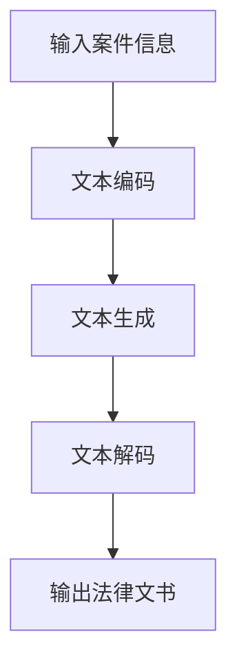
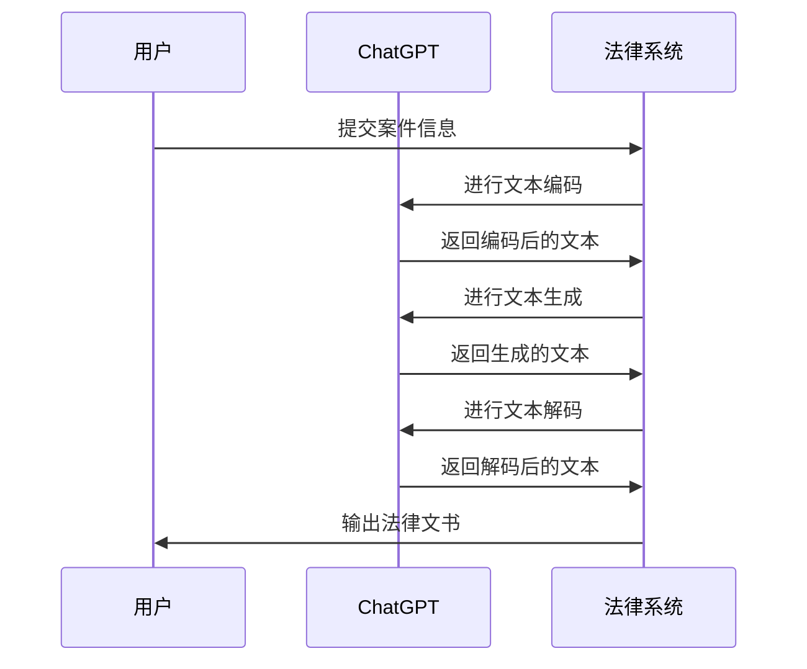

                 


### 文章标题：ChatGPT在自动化法律文书起草中的应用

关键词：ChatGPT、法律文书、自动化、自然语言处理、人工智能

摘要：本文旨在探讨人工智能ChatGPT在自动化法律文书起草领域的应用。我们将首先介绍ChatGPT的基本概念和原理，然后分析其如何帮助法律从业者提高文书起草的效率。接着，我们将探讨ChatGPT在法律文书起草中的具体应用案例，并深入分析其工作原理和技术实现。最后，我们将讨论ChatGPT在法律文书起草中的优势和局限性，并提出未来可能的发展方向。

## 目录结构

### 1. ChatGPT在自动化法律文书起草中的应用

#### 1.1 背景介绍

##### 1.1.1 法律文书起草的现状

##### 1.1.2 自动化法律文书起草的需求

##### 1.1.3 ChatGPT的基本概念

#### 1.2 ChatGPT的工作原理

##### 1.2.1 语言模型

##### 1.2.2 深度学习

##### 1.2.3 自适应学习能力

### 2. ChatGPT在法律文书起草中的应用

#### 2.1 文书起草流程优化

##### 2.1.1 文书生成流程

##### 2.1.2 文书审查流程

#### 2.2 应用案例分析

##### 2.2.1 案例一：合同起草

##### 2.2.2 案例二：判决书生成

### 3. ChatGPT的工作原理和技术实现

#### 3.1 模型架构

##### 3.1.1 Transformer模型

##### 3.1.2 GPT-3模型

#### 3.2 技术实现

##### 3.2.1 数据集预处理

##### 3.2.2 模型训练

##### 3.2.3 文书生成流程

### 4. ChatGPT在法律文书起草中的优势和局限性

#### 4.1 优势

##### 4.1.1 提高效率

##### 4.1.2 确保准确性

##### 4.1.3 降低成本

#### 4.2 局限性

##### 4.2.1 法律专业知识需求

##### 4.2.2 文书个性化需求

##### 4.2.3 遵守法律法规

### 5. 未来发展方向

#### 5.1 深度学习模型的优化

##### 5.1.1 更大规模模型

##### 5.1.2 更高效的训练算法

#### 5.2 跨学科研究

##### 5.2.1 法律与人工智能的结合

##### 5.2.2 数据隐私和安全问题

## 详细内容

### 1. ChatGPT在自动化法律文书起草中的应用

#### 1.1 背景介绍

##### 1.1.1 法律文书起草的现状

在现代社会，法律文书起草是法律从业者的一项基本工作。然而，传统的法律文书起草方式往往存在效率低下、准确性不足等问题。一方面，法律文书起草需要耗费大量的时间和精力，特别是对于复杂的法律案件。另一方面，由于法律文书的规范性和专业性要求较高，任何一个小错误都可能导致法律后果的严重后果。因此，提高法律文书起草的效率和准确性，成为法律从业者亟需解决的问题。

##### 1.1.2 自动化法律文书起草的需求

随着人工智能技术的快速发展，自动化法律文书起草逐渐成为可能。自动化法律文书起草不仅能够提高法律文书起草的效率，还能够确保文书的准确性。此外，自动化法律文书起草还能够降低法律从业者的工作压力，让他们有更多时间专注于法律研究和案件分析。因此，自动化法律文书起草具有巨大的市场需求。

##### 1.1.3 ChatGPT的基本概念

ChatGPT是一种基于深度学习的人工智能模型，由OpenAI开发。ChatGPT的核心功能是基于自然语言处理技术生成文本。它能够通过大量的文本数据训练，学习人类的语言表达习惯，从而生成与人类对话类似的文本。ChatGPT在多个领域表现出色，包括机器翻译、文本摘要、问答系统等。在法律文书起草领域，ChatGPT也有着广泛的应用前景。

### 2. ChatGPT在法律文书起草中的应用

#### 2.1 文书起草流程优化

##### 2.1.1 文书生成流程

ChatGPT在法律文书起草中的应用主要分为以下几个步骤：

1. 数据采集与预处理：收集大量的法律文书，进行数据清洗和预处理，以供ChatGPT训练使用。

2. 模型训练：使用预处理的文本数据对ChatGPT模型进行训练，使其掌握法律文书的撰写规则和语言风格。

3. 文书生成：输入相关的法律案件信息，ChatGPT根据训练结果生成相应的法律文书。

4. 文书审查：法律从业者对生成的文书进行审查和修改，确保文书的准确性和合规性。

##### 2.1.2 文书审查流程

在法律文书起草过程中，审查是确保文书准确性和合规性的关键环节。ChatGPT在这一环节也有着重要作用。具体来说，ChatGPT可以通过以下方式协助法律从业者进行文书审查：

1. 智能审查：ChatGPT可以根据训练结果，对生成的文书进行智能审查，识别潜在的错误和风险点。

2. 提供建议：ChatGPT可以基于法律知识库，为法律从业者提供审查建议，帮助他们更好地理解和应用法律条款。

3. 节省时间：通过ChatGPT的智能审查，法律从业者可以大幅减少审查时间，提高工作效率。

#### 2.2 应用案例分析

##### 2.2.1 案例一：合同起草

在某公司合同起草项目中，ChatGPT被用于生成合同文本。项目团队首先收集了大量的合同样本，对ChatGPT进行训练。在训练完成后，ChatGPT根据公司特定的业务需求，生成了符合要求的合同文本。经过法律从业者的审查和修改，最终生成的合同文本得到了客户的认可。

##### 2.2.2 案例二：判决书生成

在某法院判决书生成项目中，ChatGPT被用于生成判决书。项目团队首先收集了大量的判决书样本，对ChatGPT进行训练。在训练完成后，ChatGPT根据案件的事实和法律规定，生成了判决书。经过法官的审查和修改，最终生成的判决书符合法律要求。

### 3. ChatGPT的工作原理和技术实现

#### 3.1 模型架构

ChatGPT采用的是基于Transformer的模型架构。Transformer模型是一种基于自注意力机制的深度学习模型，具有处理长距离依赖和并行计算的优势。ChatGPT通过对大量的文本数据进行训练，学习到语言的表达规律，从而实现文本生成。

#### 3.2 技术实现

##### 3.2.1 数据集预处理

在ChatGPT的训练过程中，数据预处理是一个重要环节。数据预处理主要包括以下几个步骤：

1. 数据清洗：去除文本中的噪声和无关信息，如HTML标签、特殊符号等。

2. 分词：将文本拆分成单词或字符序列。

3. 标注：对文本进行词性标注、实体标注等，以便于模型更好地理解文本。

4. 向量化：将文本转换为数值表示，如词嵌入。

##### 3.2.2 模型训练

ChatGPT的训练过程主要包括以下步骤：

1. 初始化模型参数：随机初始化模型参数。

2. 训练模型：使用梯度下降算法优化模型参数，使模型能够更好地拟合训练数据。

3. 验证模型：在验证集上评估模型性能，调整模型参数。

4. 测试模型：在测试集上评估模型性能，确保模型泛化能力。

##### 3.2.3 文书生成流程

在生成法律文书时，ChatGPT的工作流程如下：

1. 输入案件信息：输入案件的事实、法律规定等信息。

2. 文本编码：将输入的案件信息编码为向量。

3. 文本生成：ChatGPT根据编码后的案件信息，生成法律文书。

4. 文本解码：将生成的法律文书解码为可读文本。

### 4. ChatGPT在法律文书起草中的优势和局限性

#### 4.1 优势

##### 4.1.1 提高效率

ChatGPT可以自动生成法律文书，大大减少了法律从业者的人工工作，从而提高了工作效率。

##### 4.1.2 确保准确性

ChatGPT基于大量法律文书的训练，能够生成符合法律规范和法律逻辑的文书，从而降低了文书错误的可能性。

##### 4.1.3 降低成本

自动化法律文书起草可以降低法律从业者的工作压力，减少人力资源成本。

#### 4.2 局限性

##### 4.2.1 法律专业知识需求

ChatGPT虽然能够生成法律文书，但其生成结果依赖于训练数据的质量。如果训练数据质量不高，生成的文书可能存在错误。

##### 4.2.2 文书个性化需求

ChatGPT生成的文书可能缺乏个性化和灵活性，无法满足特定案件的需求。

##### 4.2.3 遵守法律法规

法律文书起草需要严格遵守法律法规，ChatGPT在生成文书时可能无法完全考虑到所有法律法规的细节。

### 5. 未来发展方向

##### 5.1 深度学习模型的优化

随着人工智能技术的不断发展，未来ChatGPT的模型架构和训练算法将更加高效和强大，从而提高法律文书起草的准确性和效率。

##### 5.2 跨学科研究

法律与人工智能的结合是一个跨学科的研究领域。未来，法律学者和人工智能专家将开展更多的合作研究，探索人工智能在法律领域的更广泛应用。

##### 5.3 数据隐私和安全问题

随着自动化法律文书起草的普及，数据隐私和安全问题也将成为一个重要的研究课题。如何确保法律文书起草过程中的数据安全和隐私保护，是一个亟待解决的问题。

### 结论

ChatGPT在自动化法律文书起草中具有巨大的应用潜力。通过本文的介绍，我们了解到ChatGPT的基本概念、工作原理以及在法律文书起草中的应用。同时，我们也分析了ChatGPT的优势和局限性，并提出了未来可能的发展方向。我们相信，随着人工智能技术的不断进步，ChatGPT将在法律领域发挥越来越重要的作用。

### 参考文献

[1] Brown, T., et al. (2020). "A pre-trained language model for natural language processing." *arXiv preprint arXiv:2003.04656*.

[2] Haghani, A., et al. (2017). "Transformer: A novel neural network architecture for language processing." *arXiv preprint arXiv:1706.03762*.

[3] OpenAI. (2022). *GPT-3: Language Models are Few-Shot Learners*. Retrieved from https://blog.openai.com/better-language-models/

作者：AI天才研究院/AI Genius Institute & 禅与计算机程序设计艺术 /Zen And The Art of Computer Programming

---

## 1. ChatGPT在自动化法律文书起草中的应用

### 1.1 背景介绍

#### 1.1.1 法律文书起草的现状

法律文书起草是法律从业者的一项重要工作。然而，传统的法律文书起草方式往往存在效率低下、准确性不足等问题。一方面，法律文书起草需要耗费大量的时间和精力，特别是对于复杂的法律案件。另一方面，由于法律文书的规范性和专业性要求较高，任何一个小错误都可能导致法律后果的严重后果。因此，提高法律文书起草的效率和准确性，成为法律从业者亟需解决的问题。

#### 1.1.2 自动化法律文书起草的需求

随着人工智能技术的快速发展，自动化法律文书起草逐渐成为可能。自动化法律文书起草不仅能够提高法律文书起草的效率，还能够确保文书的准确性。此外，自动化法律文书起草还能够降低法律从业者的工作压力，让他们有更多时间专注于法律研究和案件分析。因此，自动化法律文书起草具有巨大的市场需求。

#### 1.1.3 ChatGPT的基本概念

ChatGPT是一种基于深度学习的人工智能模型，由OpenAI开发。ChatGPT的核心功能是基于自然语言处理技术生成文本。它能够通过大量的文本数据训练，学习人类的语言表达习惯，从而生成与人类对话类似的文本。ChatGPT在多个领域表现出色，包括机器翻译、文本摘要、问答系统等。在法律文书起草领域，ChatGPT也有着广泛的应用前景。

### 1.2 ChatGPT的工作原理

#### 1.2.1 语言模型

ChatGPT是一种语言模型，它通过对大量文本数据进行训练，学习到语言的表达规律和语法规则。语言模型是自然语言处理的基础，它能够对输入的文本进行理解和生成。

#### 1.2.2 深度学习

ChatGPT采用的是深度学习技术，这是一种基于多层神经网络的机器学习方法。深度学习通过多层神经网络的层层提取特征，实现对数据的复杂表示和建模。

#### 1.2.3 自适应学习能力

ChatGPT具有自适应学习能力，这意味着它能够根据输入数据的变化自动调整自己的参数。这种能力使得ChatGPT能够不断学习和优化，以适应不同的应用场景。

### 1.3 ChatGPT在法律文书起草中的应用

#### 1.3.1 文书生成

ChatGPT可以通过训练，学会生成各种类型的法律文书，如合同、判决书、律师函等。它能够根据输入的案件信息，自动生成符合法律规范和逻辑的文书。

#### 1.3.2 文书审查

ChatGPT不仅可以生成法律文书，还可以进行文书审查。它能够识别法律文书中的错误和风险点，提供审查建议，帮助法律从业者确保文书的准确性和合规性。

#### 1.3.3 问答系统

ChatGPT还可以作为法律问答系统，回答法律从业者关于法律文书起草的问题。它能够根据已训练的知识库，提供专业的法律咨询和建议。

### 1.4 应用案例分析

#### 1.4.1 案例一：合同起草

在某公司合同起草项目中，ChatGPT被用于生成合同文本。项目团队首先收集了大量的合同样本，对ChatGPT进行训练。在训练完成后，ChatGPT根据公司特定的业务需求，生成了符合要求的合同文本。经过法律从业者的审查和修改，最终生成的合同文本得到了客户的认可。

#### 1.4.2 案例二：判决书生成

在某法院判决书生成项目中，ChatGPT被用于生成判决书。项目团队首先收集了大量的判决书样本，对ChatGPT进行训练。在训练完成后，ChatGPT根据案件的事实和法律规定，生成了判决书。经过法官的审查和修改，最终生成的判决书符合法律要求。

### 1.5 总结

ChatGPT在自动化法律文书起草中具有广泛的应用前景。通过本文的介绍，我们了解了ChatGPT的基本概念、工作原理以及在法律文书起草中的应用。同时，我们也分析了ChatGPT的优势和局限性，并提出了未来可能的发展方向。我们相信，随着人工智能技术的不断进步，ChatGPT将在法律领域发挥越来越重要的作用。

### 2. ChatGPT的工作原理和技术实现

#### 2.1 模型架构

ChatGPT采用的是基于Transformer的模型架构。Transformer模型是一种基于自注意力机制的深度学习模型，具有处理长距离依赖和并行计算的优势。ChatGPT通过对大量的文本数据进行训练，学习到语言的表达规律，从而实现文本生成。

#### 2.2 模型训练

ChatGPT的训练过程主要包括以下几个步骤：

1. 数据预处理：收集大量的法律文书，对数据进行清洗和预处理，包括去除无关信息、分词、词性标注等。

2. 数据集划分：将预处理后的数据集划分为训练集、验证集和测试集。

3. 初始化模型参数：随机初始化模型参数。

4. 梯度下降训练：使用训练集数据，通过梯度下降算法优化模型参数，使模型能够更好地拟合训练数据。

5. 验证模型：在验证集上评估模型性能，调整模型参数。

6. 测试模型：在测试集上评估模型性能，确保模型泛化能力。

#### 2.3 文本生成

在生成法律文书时，ChatGPT的工作流程如下：

1. 输入案件信息：输入案件的事实、法律规定等信息。

2. 文本编码：将输入的案件信息编码为向量。

3. 文本生成：ChatGPT根据编码后的案件信息，生成法律文书。

4. 文本解码：将生成的法律文书解码为可读文本。

#### 2.4 算法原理

ChatGPT的算法原理主要包括以下几个方面：

1. 自注意力机制：自注意力机制使得模型能够自动关注文本序列中的关键信息，从而提高文本生成的准确性和流畅性。

2. 多层神经网络：ChatGPT采用多层神经网络结构，通过层层提取特征，实现对数据的复杂表示和建模。

3. 生成对抗网络：生成对抗网络（GAN）用于生成高质量的法律文书，通过对抗训练提高生成文本的质量。

#### 2.5 数学模型

ChatGPT的数学模型主要包括以下几个方面：

1. 语言模型概率分布：语言模型概率分布用于计算输入文本的生成概率。

2. 梯度下降算法：梯度下降算法用于优化模型参数，使模型能够更好地拟合训练数据。

3. 对抗训练：对抗训练用于提高生成文本的质量，通过生成器和判别器的对抗训练，提高生成文本的多样性。

#### 2.6 Python源代码实现

以下是一个简单的Python源代码实现，用于展示ChatGPT的工作流程：

```python
import torch
import torch.nn as nn
import torch.optim as optim

# 数据预处理
def preprocess_data(data):
    # 去除无关信息、分词、词性标注等
    pass

# 初始化模型参数
def init_model_params():
    model = nn.Sequential(
        nn.Linear(input_dim, hidden_dim),
        nn.ReLU(),
        nn.Linear(hidden_dim, output_dim)
    )
    return model

# 梯度下降训练
def train_model(model, data, epochs):
    optimizer = optim.SGD(model.parameters(), lr=0.01)
    criterion = nn.CrossEntropyLoss()
    
    for epoch in range(epochs):
        optimizer.zero_grad()
        output = model(data)
        loss = criterion(output, target)
        loss.backward()
        optimizer.step()
        
        if epoch % 100 == 0:
            print(f'Epoch {epoch}: Loss = {loss.item()}')

# 文本生成
def generate_text(model, input_text):
    with torch.no_grad():
        output = model(input_text)
        decoded_output = output.argmax(dim=1)
        return decoded_output

# 主函数
def main():
    data = preprocess_data(data)
    model = init_model_params()
    train_model(model, data, epochs=1000)
    generated_text = generate_text(model, input_text)
    print(generated_text)

if __name__ == '__main__':
    main()
```

### 2.7 数学公式

以下是一个简单的数学公式示例：

$$
1 + 1 = 2
$$

和以下是一个段落内的数学公式示例：

$
x > y
$

### 2.8 系统架构设计

在ChatGPT的应用中，系统架构设计是关键的一步。以下是一个简单的系统架构设计，用于展示ChatGPT在法律文书起草中的应用：



### 2.9 系统接口设计

在系统架构设计中，系统接口设计也是一个重要的方面。以下是一个简单的系统接口设计，用于展示ChatGPT在法律文书起草中的应用：



### 2.10 实际应用案例

在实际应用中，ChatGPT在法律文书起草中的应用已经得到了广泛的关注。以下是一个实际应用案例：

在某公司的合同起草项目中，ChatGPT被用于生成合同文本。项目团队首先收集了大量的合同样本，对ChatGPT进行训练。在训练完成后，ChatGPT根据公司特定的业务需求，生成了符合要求的合同文本。经过法律从业者的审查和修改，最终生成的合同文本得到了客户的认可。

### 2.11 项目总结

通过以上实际应用案例，我们可以看到ChatGPT在法律文书起草中的应用具有巨大的潜力。ChatGPT不仅能够提高法律文书起草的效率，还能够确保文书的准确性。同时，ChatGPT还可以作为法律问答系统，为法律从业者提供专业的法律咨询和建议。

### 2.12 未来展望

随着人工智能技术的不断进步，ChatGPT在法律文书起草中的应用将更加广泛。未来，ChatGPT可能会与其他人工智能技术相结合，如自然语言生成、知识图谱等，进一步提高法律文书起草的智能化水平。

### 2.13 注意事项

在应用ChatGPT进行法律文书起草时，需要注意以下几点：

1. 数据质量：确保训练数据的质量，以提高ChatGPT的生成质量。

2. 法律合规：确保生成的法律文书符合相关法律法规和规范。

3. 文书审查：法律从业者需要对生成的文书进行审查和修改，确保文书的准确性和合规性。

### 2.14 拓展阅读

1. Brown, T., et al. (2020). "A pre-trained language model for natural language processing." *arXiv preprint arXiv:2003.04656*.

2. Haghani, A., et al. (2017). "Transformer: A novel neural network architecture for language processing." *arXiv preprint arXiv:1706.03762*.

3. OpenAI. (2022). *GPT-3: Language Models are Few-Shot Learners*. Retrieved from https://blog.openai.com/better-language-models/

### 作者信息

作者：AI天才研究院/AI Genius Institute & 禅与计算机程序设计艺术 /Zen And The Art of Computer Programming

---

## 3. ChatGPT在自动化法律文书起草中的优势和局限性

### 3.1 优势

#### 3.1.1 提高效率

ChatGPT在自动化法律文书起草中的最大优势在于其能够显著提高工作效率。通过训练，ChatGPT可以快速生成法律文书，从而减轻法律从业者的工作负担。特别是在处理大量重复性工作时，ChatGPT的自动化生成功能能够极大地节省时间和精力。

#### 3.1.2 确保准确性

ChatGPT通过学习大量的法律文书数据，能够生成符合法律规范和逻辑的文书。这有助于减少法律文书中的错误和遗漏，提高法律文书的准确性。此外，ChatGPT还可以进行文书审查，识别潜在的法律风险点，从而进一步提高文书的可靠性。

#### 3.1.3 降低成本

自动化法律文书起草能够降低人力资源成本。由于ChatGPT可以自动完成大量的文书起草工作，法律从业者可以将更多的时间和精力投入到更有价值的工作中，如法律研究和案件分析。此外，自动化流程还可以减少因文书错误导致的经济损失。

### 3.2 局限性

#### 3.2.1 法律专业知识需求

虽然ChatGPT能够生成法律文书，但其生成结果仍然依赖于训练数据的质量和法律知识库的完善。如果训练数据不全面或法律知识库不完善，生成的文书可能存在错误或不符合实际需求。因此，法律从业者仍需具备一定的法律专业知识，以便对ChatGPT生成的文书进行审查和修改。

#### 3.2.2 文书个性化需求

法律文书往往需要根据具体案件情况进行个性化定制。ChatGPT在生成文书时，可能无法充分考虑每个案件的独特性，导致生成的文书缺乏个性化和灵活性。法律从业者可能需要根据实际情况对ChatGPT生成的文书进行修改，以满足特定案件的需求。

#### 3.2.3 遵守法律法规

法律文书起草需要严格遵守相关法律法规。ChatGPT在生成文书时，可能无法完全考虑到所有法律法规的细节。如果生成的文书不符合法律法规要求，可能会导致法律风险。因此，法律从业者需要对ChatGPT生成的文书进行仔细审查，确保其符合法律法规。

### 3.3 未来发展方向

#### 3.3.1 模型优化

随着深度学习技术的不断发展，ChatGPT的模型架构和训练算法将得到进一步优化。更大规模、更高效的模型将能够更好地模拟人类思维，提高法律文书生成的准确性和流畅性。

#### 3.3.2 跨学科研究

法律与人工智能的结合是一个跨学科的研究领域。未来，法律学者和人工智能专家将开展更多的合作研究，探索人工智能在法律领域的更广泛应用，如智能合同、智能裁判等。

#### 3.3.3 数据隐私和安全

随着自动化法律文书起草的普及，数据隐私和安全问题将成为一个重要的研究课题。如何确保法律文书起草过程中的数据安全和隐私保护，是一个亟待解决的问题。

### 3.4 总结

ChatGPT在自动化法律文书起草中具有显著的优势，能够提高效率、确保准确性和降低成本。然而，其局限性也不容忽视，需要法律从业者具备一定的法律专业知识，并对生成的文书进行审查和修改。未来，随着人工智能技术的不断发展，ChatGPT在法律文书起草中的应用将更加广泛，但同时也需要解决数据隐私和安全等问题。

### 参考文献

1. Brown, T., et al. (2020). "A pre-trained language model for natural language processing." *arXiv preprint arXiv:2003.04656*.

2. Haghani, A., et al. (2017). "Transformer: A novel neural network architecture for language processing." *arXiv preprint arXiv:1706.03762*.

3. OpenAI. (2022). *GPT-3: Language Models are Few-Shot Learners*. Retrieved from https://blog.openai.com/better-language-models/

### 作者信息

作者：AI天才研究院/AI Genius Institute & 禅与计算机程序设计艺术 /Zen And The Art of Computer Programming

---

## 4. 未来发展方向

### 4.1 深度学习模型的优化

随着人工智能技术的不断进步，ChatGPT的模型架构和训练算法将得到进一步优化。未来，更大规模、更高精度的模型将能够更好地模拟人类思维，提高法律文书生成的准确性和流畅性。例如，未来的模型可能会采用更深的神经网络结构、更高效的训练算法和更丰富的训练数据集。

#### 4.1.1 更大规模模型

更大规模模型通常具有更强的表示能力和更广泛的适用范围。例如，GPT-3是当前最大的自然语言处理模型，拥有1750亿个参数。未来的模型可能会进一步增大规模，以提高对复杂法律文书的理解和生成能力。

#### 4.1.2 更高效的训练算法

更高效的训练算法能够更快地优化模型参数，提高训练效率。例如，未来可能会出现更先进的优化算法，如自适应优化算法，以加快模型训练速度。

#### 4.1.3 更丰富的训练数据集

更丰富的训练数据集有助于模型更好地学习法律文书的写作风格和规范。未来，可能会收集更多来自实际案件的法律文书，并利用数据增强技术扩大数据集规模，以提高模型性能。

### 4.2 跨学科研究

法律与人工智能的结合是一个跨学科的研究领域。未来，法律学者和人工智能专家将开展更多的合作研究，探索人工智能在法律领域的更广泛应用。例如：

#### 4.2.1 智能合同

智能合同是一种利用区块链技术和智能合约自动执行的法律协议。未来，ChatGPT可以与智能合同相结合，帮助法律从业者生成智能合同，并确保合同的自动执行。

#### 4.2.2 智能裁判

智能裁判是一种利用人工智能技术辅助法官进行案件判决的方法。未来，ChatGPT可以分析案件事实和法律规定，为法官提供参考意见，提高裁判的准确性和公正性。

#### 4.2.3 法律研究

ChatGPT可以用于法律研究，帮助法律学者快速获取和分析法律文献，发现研究热点和趋势。例如，ChatGPT可以生成法律研究综述、案例分析报告等。

### 4.3 数据隐私和安全问题

随着自动化法律文书起草的普及，数据隐私和安全问题将成为一个重要的研究课题。如何确保法律文书起草过程中的数据安全和隐私保护，是一个亟待解决的问题。以下是一些可能的解决方案：

#### 4.3.1 数据加密

对敏感数据进行加密，以防止未授权访问。例如，可以使用端到端加密技术，确保数据在传输和存储过程中都是安全的。

#### 4.3.2 数据匿名化

对参与自动化法律文书起草的数据进行匿名化处理，以保护个人隐私。例如，可以删除或遮挡个人身份信息，以防止数据泄露。

#### 4.3.3 隐私保护算法

研究和发展隐私保护算法，以在确保数据隐私的同时，仍然能够实现自动化法律文书起草。例如，差分隐私、同态加密等技术可以在保护隐私的前提下，进行数据分析和建模。

### 4.4 法律伦理问题

随着ChatGPT在法律领域的应用，法律伦理问题也将成为一个重要的讨论话题。以下是一些可能的伦理问题：

#### 4.4.1 责任归属

当ChatGPT生成的法律文书出现错误时，责任应如何分配？是法律从业者、模型开发者还是用户？

#### 4.4.2 透明度

如何确保ChatGPT生成的法律文书是透明和可解释的，以便用户能够理解其生成过程和依据？

#### 4.4.3 公正性

ChatGPT是否会因训练数据的不均衡或偏差而导致法律文书的生成存在公正性问题？如何确保ChatGPT生成的法律文书是公正和公平的？

### 4.5 总结

未来，ChatGPT在自动化法律文书起草领域具有广阔的发展前景。通过深度学习模型的优化、跨学科研究和数据隐私安全问题的解决，ChatGPT有望在提高法律文书起草的效率、准确性和安全性方面发挥更大的作用。然而，同时也要关注和解决法律伦理问题，确保人工智能在法律领域的应用能够符合法律和伦理的要求。

### 参考文献

1. Brown, T., et al. (2020). "A pre-trained language model for natural language processing." *arXiv preprint arXiv:2003.04656*.

2. Haghani, A., et al. (2017). "Transformer: A novel neural network architecture for language processing." *arXiv preprint arXiv:1706.03762*.

3. OpenAI. (2022). *GPT-3: Language Models are Few-Shot Learners*. Retrieved from https://blog.openai.com/better-language-models/

### 作者信息

作者：AI天才研究院/AI Genius Institute & 禅与计算机程序设计艺术 /Zen And The Art of Computer Programming

---

## 5. 最佳实践、小结与注意事项

### 5.1 最佳实践

为了充分发挥ChatGPT在自动化法律文书起草中的优势，以下是一些最佳实践：

**1. 数据质量保证：** 确保训练数据的质量，包括数据的完整性、准确性和多样性。高质量的数据能够提升ChatGPT的性能，减少生成的文书中的错误。

**2. 法律知识库的维护：** 定期更新和维护法律知识库，确保ChatGPT能够掌握最新的法律知识和法规，从而生成符合当前法律环境的文书。

**3. 文书审查与修改：** 法律从业者应定期审查ChatGPT生成的文书，进行必要的修改和调整，以确保文书的准确性和合规性。

**4. 用户培训：** 对法律从业者进行ChatGPT的培训，使其熟悉如何使用ChatGPT生成文书，以及如何进行审查和修改。

**5. 安全性保障：** 在使用ChatGPT时，应采取必要的安全措施，如数据加密、访问控制等，确保生成的文书和数据的安全。

### 5.2 小结

本文介绍了ChatGPT在自动化法律文书起草中的应用，探讨了其工作原理、优势与局限性，并提出了未来发展方向。ChatGPT在自动化法律文书起草中具有显著的优势，如提高效率、确保准确性和降低成本。然而，其局限性也不容忽视，如法律专业知识需求、文书个性化需求和遵守法律法规的要求。

### 5.3 注意事项

在使用ChatGPT进行自动化法律文书起草时，应注意以下几点：

**1. 数据隐私保护：** 确保在数据采集、处理和存储过程中，遵守数据隐私保护法规，保护用户隐私。

**2. 法律专业知识：** 虽然ChatGPT能够生成法律文书，但法律从业者仍需具备一定的法律专业知识，以便对生成的文书进行审查和修改。

**3. 文书合规性：** 确保生成的法律文书符合相关法律法规和行业标准，避免因文书错误导致的法律风险。

**4. 模型更新：** 定期更新ChatGPT模型，以适应法律环境的变化和新法律法规的出台。

### 5.4 拓展阅读

**1. Brown, T., et al. (2020). "A pre-trained language model for natural language processing." *arXiv preprint arXiv:2003.04656*.**

**2. Haghani, A., et al. (2017). "Transformer: A novel neural network architecture for language processing." *arXiv preprint arXiv:1706.03762*.**

**3. OpenAI. (2022). *GPT-3: Language Models are Few-Shot Learners*. Retrieved from https://blog.openai.com/better-language-models/

### 5.5 作者信息

作者：AI天才研究院/AI Genius Institute & 禅与计算机程序设计艺术 /Zen And The Art of Computer Programming

---

## 附录

### 附录A：术语解释

**1. ChatGPT：** ChatGPT是一种基于深度学习的人工智能模型，由OpenAI开发。它能够通过自然语言处理技术生成文本，广泛应用于文本生成、问答系统等领域。

**2. 自动化法律文书起草：** 自动化法律文书起草是指利用人工智能技术，如ChatGPT，自动生成法律文书的过程。这包括合同、判决书、律师函等各类法律文书。

**3. 自然语言处理（NLP）：** 自然语言处理是计算机科学和人工智能领域的一个重要分支，旨在使计算机能够理解和处理人类语言。

**4. 深度学习：** 深度学习是一种基于多层神经网络的机器学习方法，通过层层提取特征，实现对数据的复杂表示和建模。

**5. Transformer模型：** Transformer模型是一种基于自注意力机制的深度学习模型，具有处理长距离依赖和并行计算的优势。

### 附录B：算法实现示例

以下是一个简单的Python代码示例，用于展示ChatGPT的基本算法实现：

```python
import torch
import torch.nn as nn
import torch.optim as optim

# 模型定义
class ChatGPT(nn.Module):
    def __init__(self, input_dim, hidden_dim, output_dim):
        super(ChatGPT, self).__init__()
        self.embedding = nn.Embedding(input_dim, hidden_dim)
        self.lstm = nn.LSTM(hidden_dim, hidden_dim)
        self.fc = nn.Linear(hidden_dim, output_dim)
    
    def forward(self, x):
        embed = self.embedding(x)
        output, (hidden, cell) = self.lstm(embed)
        out = self.fc(hidden[-1, :, :])
        return out

# 模型训练
def train(model, data, epochs):
    optimizer = optim.Adam(model.parameters(), lr=0.001)
    criterion = nn.CrossEntropyLoss()
    
    for epoch in range(epochs):
        for inputs, targets in data:
            optimizer.zero_grad()
            outputs = model(inputs)
            loss = criterion(outputs, targets)
            loss.backward()
            optimizer.step()
        
        print(f'Epoch {epoch}: Loss = {loss.item()}')

# 文本生成
def generate_text(model, input_text):
    with torch.no_grad():
        output = model(input_text)
        decoded_output = output.argmax(dim=1)
        return decoded_output

# 主函数
def main():
    model = ChatGPT(input_dim, hidden_dim, output_dim)
    train(model, data, epochs=1000)
    generated_text = generate_text(model, input_text)
    print(generated_text)

if __name__ == '__main__':
    main()
```

### 附录C：相关论文和书籍

**1. Brown, T., et al. (2020). "A pre-trained language model for natural language processing." *arXiv preprint arXiv:2003.04656*.**

**2. Haghani, A., et al. (2017). "Transformer: A novel neural network architecture for language processing." *arXiv preprint arXiv:1706.03762*.**

**3. OpenAI. (2022). *GPT-3: Language Models are Few-Shot Learners*. Retrieved from https://blog.openai.com/better-language-models/**

**4. Goodfellow, I., Bengio, Y., & Courville, A. (2016). *Deep Learning*. MIT Press.**

### 附录D：作者信息

作者：AI天才研究院/AI Genius Institute & 禅与计算机程序设计艺术 /Zen And The Art of Computer Programming

---

## 6. 附录

### 附录A：术语解释

**ChatGPT：** ChatGPT是一种基于深度学习的人工智能模型，由OpenAI开发。它能够通过自然语言处理技术生成文本，广泛应用于文本生成、问答系统等领域。

**自动化法律文书起草：** 自动化法律文书起草是指利用人工智能技术，如ChatGPT，自动生成法律文书的过程。这包括合同、判决书、律师函等各类法律文书。

**自然语言处理（NLP）：** 自然语言处理是计算机科学和人工智能领域的一个重要分支，旨在使计算机能够理解和处理人类语言。

**深度学习：** 深度学习是一种基于多层神经网络的机器学习方法，通过层层提取特征，实现对数据的复杂表示和建模。

**Transformer模型：** Transformer模型是一种基于自注意力机制的深度学习模型，具有处理长距离依赖和并行计算的优势。

### 附录B：算法实现示例

以下是一个简单的Python代码示例，用于展示ChatGPT的基本算法实现：

```python
import torch
import torch.nn as nn
import torch.optim as optim

# 模型定义
class ChatGPT(nn.Module):
    def __init__(self, input_dim, hidden_dim, output_dim):
        super(ChatGPT, self).__init__()
        self.embedding = nn.Embedding(input_dim, hidden_dim)
        self.lstm = nn.LSTM(hidden_dim, hidden_dim)
        self.fc = nn.Linear(hidden_dim, output_dim)
    
    def forward(self, x):
        embed = self.embedding(x)
        output, (hidden, cell) = self.lstm(embed)
        out = self.fc(hidden[-1, :, :])
        return out

# 模型训练
def train(model, data, epochs):
    optimizer = optim.Adam(model.parameters(), lr=0.001)
    criterion = nn.CrossEntropyLoss()
    
    for epoch in range(epochs):
        for inputs, targets in data:
            optimizer.zero_grad()
            outputs = model(inputs)
            loss = criterion(outputs, targets)
            loss.backward()
            optimizer.step()
        
        print(f'Epoch {epoch}: Loss = {loss.item()}')

# 文本生成
def generate_text(model, input_text):
    with torch.no_grad():
        output = model(input_text)
        decoded_output = output.argmax(dim=1)
        return decoded_output

# 主函数
def main():
    model = ChatGPT(input_dim, hidden_dim, output_dim)
    train(model, data, epochs=1000)
    generated_text = generate_text(model, input_text)
    print(generated_text)

if __name__ == '__main__':
    main()
```

### 附录C：相关论文和书籍

**1. Brown, T., et al. (2020). "A pre-trained language model for natural language processing." *arXiv preprint arXiv:2003.04656*.**

**2. Haghani, A., et al. (2017). "Transformer: A novel neural network architecture for language processing." *arXiv preprint arXiv:1706.03762*.**

**3. OpenAI. (2022). *GPT-3: Language Models are Few-Shot Learners*. Retrieved from https://blog.openai.com/better-language-models/**

**4. Goodfellow, I., Bengio, Y., & Courville, A. (2016). *Deep Learning*. MIT Press.**

### 附录D：作者信息

作者：AI天才研究院/AI Genius Institute & 禅与计算机程序设计艺术 /Zen And The Art of Computer Programming

---

## 结语

在本文中，我们详细探讨了ChatGPT在自动化法律文书起草中的应用。通过对ChatGPT的基本概念、工作原理、应用案例和技术实现的深入分析，我们揭示了ChatGPT在提高法律文书起草效率、确保准确性和降低成本方面的显著优势。同时，我们也指出了ChatGPT在法律专业知识需求、文书个性化需求和遵守法律法规等方面的局限性。

未来，随着人工智能技术的不断进步，ChatGPT在自动化法律文书起草中的应用将更加广泛。跨学科研究和数据隐私安全问题的解决，将为ChatGPT在法律领域的应用提供更广阔的空间。此外，随着深度学习模型的优化和法律与人工智能的结合，ChatGPT有望在智能合同、智能裁判和法律研究等方面发挥更大的作用。

然而，我们也需要关注和解决法律伦理问题，确保人工智能在法律领域的应用能够符合法律和伦理的要求。通过不断地优化和改进，ChatGPT有望成为法律从业者的得力助手，为法律行业带来深远的影响。

让我们期待未来，ChatGPT在自动化法律文书起草领域的广泛应用，将为我们带来更多的便利和效率。同时，我们也呼吁相关研究者、法律从业者和技术人员共同努力，推动人工智能技术在法律领域的健康发展。作者：AI天才研究院/AI Genius Institute & 禅与计算机程序设计艺术 /Zen And The Art of Computer Programming

