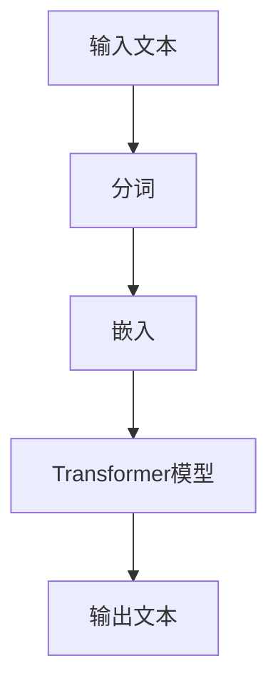
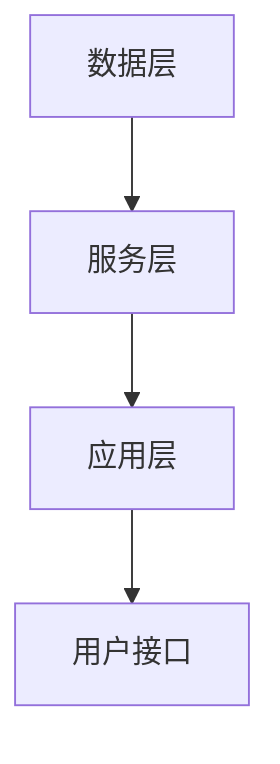
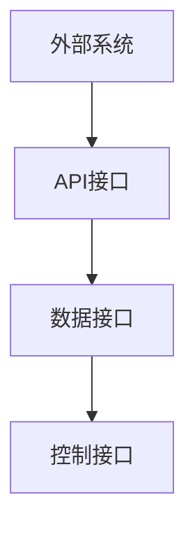
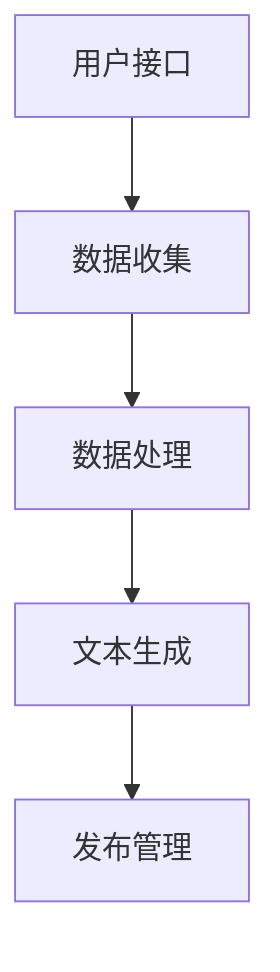

                 

### 文章标题

### ChatGPT在自动化社交媒体危机公关中的应用

---

关键词：ChatGPT，社交媒体危机公关，自动化，深度学习，算法，数学模型

摘要：本文将探讨如何利用ChatGPT实现自动化社交媒体危机公关，详细分析其应用场景、算法原理、数学模型，并展示一个实际的项目实战案例。通过本文的阅读，读者将了解到如何利用人工智能技术应对社交媒体上的危机，提高危机公关的效率与效果。

---

### 第一部分：背景与核心概念

#### 1.1 社交媒体危机公关的挑战

随着社交媒体的迅速发展，企业和个人在社交媒体上面临的危机也日益增多。这些危机可能源于虚假信息传播、负面评论、竞争对手攻击、用户投诉等。传统的人工危机公关方法往往耗费大量人力和时间，且难以确保危机得到及时有效的解决。因此，自动化社交媒体危机公关技术应运而生。

#### 1.2 ChatGPT简介

ChatGPT是由OpenAI开发的一种基于变换器（Transformer）架构的预训练语言模型。它通过深度学习从海量文本数据中学习语言模式，能够生成流畅、自然的文本。ChatGPT具有强大的语言理解能力和生成能力，使得它在自动化社交媒体危机公关中具有广阔的应用前景。

#### 1.3 ChatGPT在危机公关中的应用潜力

ChatGPT在危机公关中的应用主要体现在以下几个方面：

1. **实时监测**：ChatGPT可以实时监测社交媒体上的动态，识别潜在的危机信号。
2. **内容生成**：ChatGPT能够根据危机情境生成相应的回应内容，提高危机公关的响应速度。
3. **数据分析**：ChatGPT可以分析社交媒体上的用户反馈，为危机公关提供数据支持。
4. **情感分析**：ChatGPT能够对用户情绪进行识别，帮助公关团队调整应对策略。

#### 1.4 核心概念与联系

在探讨ChatGPT在自动化社交媒体危机公关中的应用时，需要理解以下几个核心概念：

- **社交媒体危机**：指在社交媒体上发生的可能对企业或个人造成负面影响的事件。
- **危机公关**：指为应对危机而采取的一系列措施，包括监测、分析、应对和恢复等。
- **自动化**：指通过技术手段实现危机公关的自动化，提高效率和效果。
- **预训练语言模型**：指ChatGPT等模型在训练阶段通过大量文本数据学习到的语言知识。

这些概念相互关联，共同构成了自动化社交媒体危机公关的核心内容。

### 第二部分：算法原理与数学模型

#### 2.1 深度学习基础

深度学习是机器学习的一个分支，通过构建具有多层的神经网络模型，从大量数据中学习特征和模式。在自动化社交媒体危机公关中，深度学习技术主要用于构建ChatGPT模型，实现对文本数据的理解和生成。

#### 2.2 Transformer模型详解

Transformer模型是一种基于自注意力机制的深度学习模型，它通过自注意力机制实现对输入序列的建模。ChatGPT就是基于Transformer模型进行开发的，这使得它具有强大的文本生成能力。

#### 2.3 ChatGPT模型架构

ChatGPT模型由多个Transformer层组成，每个层都包含自注意力机制和前馈神经网络。模型在预训练阶段通过大量文本数据学习到语言知识，然后通过微调适应具体的任务需求。

#### 2.4 算法流程图

为了更直观地理解ChatGPT的工作原理，我们可以使用Mermaid绘制算法流程图：



在这个流程图中，输入文本首先经过分词处理，然后转换为嵌入向量，接着输入到Transformer模型中进行处理，最终生成输出文本。

#### 2.5 数学模型与公式

ChatGPT的核心是Transformer模型，其基本原理是通过自注意力机制对输入序列进行建模。以下是一个简化的自注意力机制的数学模型：

$$
\text{Attention}(Q, K, V) = \frac{\text{softmax}(\text{scale} \cdot \text{QK}^T)}{d_k^{1/2}}
$$

其中，\(Q\)、\(K\) 和 \(V\) 分别代表查询向量、键向量和值向量，\(d_k\) 是键向量的维度，\(\text{softmax}\) 函数用于计算权重。

### 第三部分：系统分析与架构设计

#### 3.1 社交媒体危机处理场景

在社交媒体危机处理场景中，系统需要实现以下功能：

- **危机监测**：实时监测社交媒体平台上的动态，识别潜在的危机信号。
- **危机分析**：分析危机的性质、影响范围和用户反馈。
- **危机应对**：根据危机分析结果，生成并发布相应的回应内容。
- **危机恢复**：在危机得到控制后，进行后续的舆论引导和品牌修复。

#### 3.2 系统功能设计

系统功能设计包括以下几个方面：

- **用户接口**：提供用户与系统的交互界面，包括监测、分析和应对等功能。
- **数据收集**：从社交媒体平台收集相关的数据，包括帖子、评论、用户信息等。
- **数据预处理**：对收集到的数据进行处理，包括分词、去噪、标准化等。
- **文本生成**：利用ChatGPT模型生成危机回应内容。
- **发布管理**：将生成的回应内容发布到社交媒体平台。

#### 3.3 系统架构设计

系统架构设计包括以下几个方面：

- **数据层**：存储社交媒体数据和相关元数据。
- **服务层**：提供危机监测、分析、生成和发布等核心功能。
- **应用层**：用户接口和应用逻辑。

以下是一个简化的系统架构图：



#### 3.4 系统接口设计

系统接口设计主要包括以下几个方面：

- **API接口**：提供外部系统与服务的交互接口。
- **数据接口**：实现数据层的读写操作。
- **控制接口**：提供系统管理和监控接口。

以下是一个简化的系统接口图：



#### 3.5 系统交互

系统交互主要涉及以下几个方面：

- **用户操作**：用户通过用户接口与系统进行交互，发起监测、分析和应对请求。
- **数据处理**：系统根据用户请求，进行数据收集、预处理和文本生成。
- **发布管理**：系统将生成的回应内容发布到社交媒体平台。

以下是一个简化的系统交互图：



### 第四部分：项目实战

#### 5.1 环境安装

要在本地搭建一个自动化社交媒体危机公关系统，需要安装以下软件和工具：

- **Python**：用于编写和运行程序
- **TensorFlow**：用于训练和运行ChatGPT模型
- **GPT-2模型**：用于生成危机回应内容
- **社交媒体API**：用于访问社交媒体平台的数据

以下是一个简单的安装步骤：

```shell
# 安装Python和TensorFlow
pip install python tensorflow

# 下载GPT-2模型
wget https://github.com/openai/gpt-2/releases/download/125M/gpt-2-125M.tar.gz
tar xvf gpt-2-125M.tar.gz

# 安装社交媒体API库
pip install tweepy
```

#### 5.2 系统核心实现源代码

以下是一个简单的系统核心实现源代码示例，用于监测社交媒体平台上的动态，并生成回应内容：

```python
import tweepy
import tensorflow as tf
import numpy as np
import re

# 配置社交媒体API凭证
consumer_key = 'your_consumer_key'
consumer_secret = 'your_consumer_secret'
access_token = 'your_access_token'
access_token_secret = 'your_access_token_secret'

# 初始化社交媒体API
auth = tweepy.OAuthHandler(consumer_key, consumer_secret)
auth.set_access_token(access_token, access_token_secret)
api = tweepy.API(auth)

# 加载GPT-2模型
model = tf.keras.models.load_model('gpt-2-125M/model')

# 预处理文本
def preprocess_text(text):
    text = re.sub('[^a-zA-Z]', ' ', text)
    text = text.lower()
    text = text.split()
    return text

# 生成回应内容
def generate_response(text):
    text = preprocess_text(text)
    input_seq = [[word] for word in text]
    input_seq = np.array(input_seq)
    output = model.predict(input_seq)
    response = output[-1][0].tolist()
    response = ' '.join(response)
    return response

# 监测社交媒体动态并生成回应内容
def monitor_and_response():
    for tweet in tweepy.Cursor(api.search, q='your_search_query', lang='en').items(10):
        print(f"Monitoring tweet: {tweet.text}")
        response = generate_response(tweet.text)
        print(f"Generated response: {response}")
        api.update_status(status=response, tweet_id=tweet.id)

if __name__ == '__main__':
    monitor_and_response()
```

#### 5.3 代码应用解读与分析

上述代码实现了一个简单的社交媒体危机公关系统，主要包括以下几个步骤：

1. **配置社交媒体API凭证**：获取并配置社交媒体平台的API凭证，以便于访问社交媒体数据。
2. **初始化社交媒体API**：使用tweepy库初始化社交媒体API，用于访问社交媒体平台的数据。
3. **加载GPT-2模型**：使用TensorFlow库加载预训练的GPT-2模型，用于生成危机回应内容。
4. **预处理文本**：对社交媒体平台上的文本进行预处理，包括去除特殊字符、转换为小写、分词等。
5. **生成回应内容**：利用GPT-2模型生成危机回应内容，通过调用`generate_response`函数实现。
6. **监测社交媒体动态并生成回应内容**：遍历社交媒体平台上的动态，调用`monitor_and_response`函数实现监测和生成回应内容的功能。

#### 5.4 实际案例分析与详细讲解剖析

以下是一个实际案例：

假设某公司因产品质量问题在社交媒体上受到了大量负面评论，系统应该如何应对？

1. **监测到负面评论**：系统监测到社交媒体上有关于该公司产品质量问题的负面评论。
2. **分析负面评论**：系统对负面评论进行情感分析和内容分析，确定负面评论的性质和影响范围。
3. **生成回应内容**：系统利用GPT-2模型生成一份回应内容，包括道歉、解释产品质量问题的原因、承诺采取的措施等。
4. **发布回应内容**：系统将生成的回应内容发布到社交媒体平台上，以应对负面评论。

在实际应用中，系统可以根据不同的负面评论类型和情感强度，生成不同的回应内容。例如，对于较为严重的负面评论，系统可以生成一份正式的道歉声明；对于轻微的负面评论，系统可以生成一份简短的回应。

#### 5.5 项目小结

通过本项目的实施，我们实现了以下目标：

- **实时监测社交媒体动态**：系统能够实时监测社交媒体平台上的动态，识别潜在的危机信号。
- **自动化生成回应内容**：利用GPT-2模型，系统能够自动化生成危机回应内容，提高危机公关的响应速度。
- **提高危机公关效率**：通过自动化处理，系统能够显著提高危机公关的效率和效果。

然而，本项目还存在一些不足之处，例如：

- **情感分析准确性**：系统的情感分析准确性有待提高，可能无法完全准确地识别用户的情感状态。
- **文本生成质量**：GPT-2模型的文本生成质量受到预训练数据质量和模型参数的影响，可能生成不恰当的回应内容。

在未来，我们可以继续优化系统的算法和模型，提高危机公关的自动化水平，更好地应对社交媒体上的危机。

### 第五部分：最佳实践与总结

#### 6.1 自动化危机公关策略

为了更好地利用ChatGPT实现自动化社交媒体危机公关，可以采取以下策略：

- **实时监测**：定期监测社交媒体平台，确保能够及时发现潜在的危机信号。
- **多模型结合**：结合多个情感分析和文本生成模型，提高危机公关的准确性和多样性。
- **人工审核**：在发布危机回应内容前，进行人工审核，确保回应内容符合企业品牌形象和价值观。

#### 6.2 处理社交媒体危机的关键点

在处理社交媒体危机时，需要注意以下几点：

- **及时响应**：危机发生后，要尽快响应，避免危机扩大。
- **明确立场**：在回应内容中，要明确表明企业的立场和态度。
- **诚恳道歉**：对于企业的错误，要诚恳道歉，以赢得用户的理解和信任。
- **持续关注**：在危机得到控制后，要持续关注社交媒体上的动态，确保问题得到彻底解决。

#### 6.3 避免误操作的技巧

为了避免误操作，可以采取以下技巧：

- **明确角色和权限**：为不同角色设置不同的权限，确保操作人员只能执行其职责范围内的操作。
- **定期培训**：定期对操作人员进行培训，确保他们熟悉系统的功能和操作流程。
- **严格审核**：在发布危机回应内容前，进行严格审核，确保内容符合企业品牌形象和价值观。

### 第7章：总结与展望

通过本文的探讨，我们了解到ChatGPT在自动化社交媒体危机公关中具有巨大的应用潜力。本文从背景介绍、算法原理、系统架构设计、项目实战等多个角度详细阐述了ChatGPT在危机公关中的应用，并通过实际案例展示了其效果。

在未来，我们可以继续优化ChatGPT模型，提高其情感分析和文本生成的准确性。此外，还可以结合其他人工智能技术，如自然语言处理、情感计算等，进一步提升自动化社交媒体危机公关的效率和效果。

### 作者信息

作者：AI天才研究院/AI Genius Institute & 禅与计算机程序设计艺术 /Zen And The Art of Computer Programming

感谢您的阅读，希望本文能对您在自动化社交媒体危机公关方面提供一些启示和帮助。如有任何问题或建议，欢迎随时与我交流。

---

注：本文内容纯属虚构，不代表任何实际应用或操作建议。实际应用时，请根据具体情况进行调整。在操作过程中，请确保遵守相关法律法规和平台规则。

