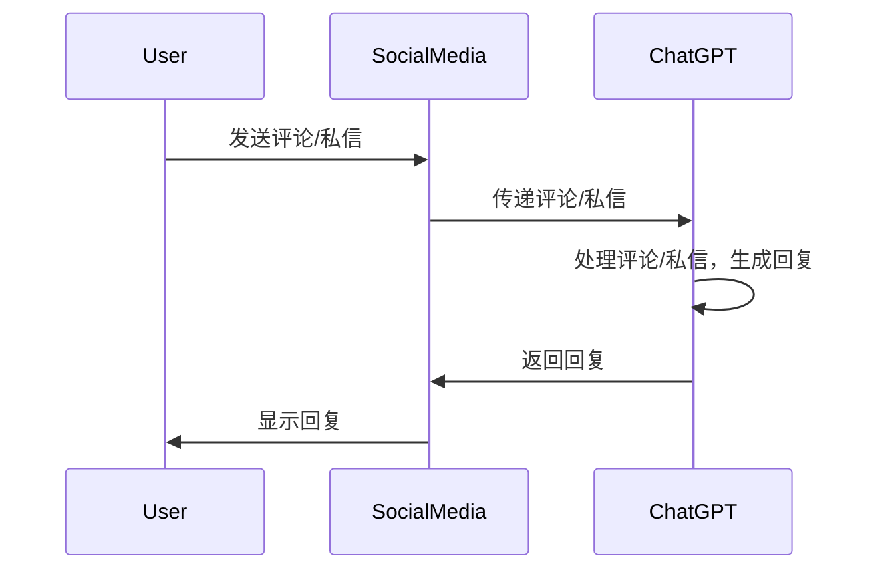

                 

### 让我们一步一步深入思考：ChatGPT在自动化社交媒体回复中的应用

#### 背景介绍

随着社交媒体的迅猛发展，用户数量和互动内容的爆炸性增长，企业管理社交媒体账号的任务日益繁重。手动回复每一条评论和消息不仅耗时耗力，而且难以保证回复的及时性和个性化。为了解决这个问题，自动化社交媒体回复工具应运而生。而ChatGPT作为当今最先进的人工智能语言模型，为自动化社交媒体回复提供了强大的技术支持。本文将围绕ChatGPT在自动化社交媒体回复中的应用，详细探讨其技术原理、实施方法、效果优化以及面临的挑战和未来发展方向。

#### 核心概念与联系

首先，我们需要明确一些核心概念：

- **社交媒体回复**：社交媒体平台上的用户生成内容，如评论、私信等，需要管理员或机器人进行回应。
- **ChatGPT**：由OpenAI开发的一种基于Transformer架构的预训练语言模型，能够理解并生成自然语言文本。
- **自然语言生成（NLG）**：计算机生成自然语言文本的技术，应用于文本摘要、机器翻译、对话系统等领域。

接下来，我们将通过一个表格来对比ChatGPT与其他自然语言生成技术的属性特征：

| 特性           | ChatGPT                | 其他NLG技术                |
|--------------|----------------------|--------------------------|
| 架构           | Transformer          | RNN、LSTM、BERT等          |
| 训练数据       | 大规模互联网文本      | 特定领域的数据集          |
| 语言理解能力   | 强，能够进行上下文理解 | 较弱，往往依赖于预定义模板 |
| 生成文本质量   | 高，自然流畅         | 中等，容易产生模板化语言   |
| 回复个性化     | 高，根据上下文生成    | 低，往往缺乏个性化         |

此外，我们可以通过一个ER（实体-关系）图来展示ChatGPT与其他相关技术的实体关系：

```mermaid
erDiagram
  Comment -> ChatGPT : 自动化回复
  Message -> ChatGPT : 自动化处理
  SocialMediaPlatform -> ChatGPT : 集成
  ChatGPT --|> NaturalLanguageGeneration : 技术基础
```

#### 算法原理讲解

ChatGPT的核心在于其预训练的语言模型，该模型通过大量的文本数据学习语言的模式和上下文关系，从而能够生成高质量的文本回复。以下是ChatGPT的工作流程和算法原理：

1. **预训练**：
   - **数据集**：ChatGPT使用的是OpenAI的Barack Obama演讲、维基百科等大量互联网文本。
   - **模型架构**：基于Transformer架构，这是一种处理序列数据的强大神经网络模型。

2. **上下文理解**：
   - **输入处理**：模型接收用户输入的文本，通过Transformer层进行处理。
   - **上下文生成**：模型根据输入文本和已经学习到的上下文信息生成回复。

3. **文本生成**：
   - **解码**：模型解码生成文本序列，利用自回归机制预测下一个词。
   - **输出优化**：通过优化算法（如Greedy策略、 Sampling策略等）生成高质量回复。

4. **自适应调整**：
   - **反馈循环**：根据用户反馈调整模型参数，提高回复的准确性和个性化程度。

具体来说，ChatGPT的算法原理可以用以下步骤表示：

1. $$
   \text{Input} = x_1, x_2, ..., x_T
   $$
   其中，$$ x_t $$ 是输入序列中的第t个词。

2. $$
   \text{Output} = y_1, y_2, ..., y_T'
   $$
   其中，$$ y_t $$ 是生成的文本序列。

3. Transformer模型通过以下公式进行计算：
   $$
   \text{Output}_{t} = \text{softmax}(\text{W}_\text{softmax} \cdot \text{T}_\text{Transformer}(x_1, x_2, ..., x_T))
   $$
   其中，$$ \text{T}_\text{Transformer} $$ 表示Transformer层。

4. 通过自回归机制，模型预测下一个词的概率分布，并从中采样生成回复。

为了更好地理解算法原理，我们举一个简单的例子：

**输入文本**：请问您有什么问题需要帮助吗？

**ChatGPT回复**：您好！请问您在哪个方面需要帮助呢？我会尽力为您解答。

在这个例子中，ChatGPT通过理解输入文本的上下文，并利用其预训练的模型，生成了一个自然且相关的回复。

#### 系统分析与架构设计

为了更好地理解ChatGPT在自动化社交媒体回复中的应用，我们需要进行系统分析和架构设计。

**问题场景介绍**：
社交媒体平台的用户数量庞大，用户互动频繁。企业需要自动化工具来处理用户评论和私信，提高回复速度和个性化程度。

**项目介绍**：
本项目旨在利用ChatGPT构建一个自动化社交媒体回复系统，实现对用户评论和私信的智能回复。

**系统功能设计（领域模型）**：

```mermaid
classDiagram
  ClassComment <<classifier>> Comment
  ClassMessage <<classifier>> Message
  ClassSocialMedia <<classifier>> SocialMedia
  ClassChatGPT <<classifier>> ChatGPT
  ClassAutomatedReply <<classifier>> AutomatedReply

  Comment --|> ChatGPT
  Message --|> ChatGPT
  SocialMedia --|> ChatGPT
  ChatGPT --|> AutomatedReply
```

**系统架构设计**：



**系统接口设计**：

- **评论/私信接口**：接收用户发送的评论和私信。
- **回复接口**：接收ChatGPT生成的回复，并将其发送给用户。

**系统交互**：


通过上述系统分析和架构设计，我们可以清晰地看到ChatGPT在自动化社交媒体回复系统中的位置和作用。

#### 项目实战

**环境安装**

1. 安装Python环境，版本要求3.6及以上。
2. 使用pip安装所需的依赖库，例如`requests`、`torch`等。

```bash
pip install requests torch
```

**系统核心实现源代码**

以下是一个简单的Python代码示例，用于调用ChatGPT API：

```python
import requests
import json

# 设置ChatGPT API端点
url = "https://api.openai.com/v1/engine/davinci-codex/completions"

# 设置API密钥
headers = {
    "Authorization": "Bearer YOUR_API_KEY",
    "Content-Type": "application/json",
}

# 设置输入文本
prompt = "请问您有什么问题需要帮助吗？"

# 构建请求体
data = {
    "prompt": prompt,
    "temperature": 0.5,
    "max_tokens": 100,
}

# 发送请求
response = requests.post(url, headers=headers, data=json.dumps(data))

# 解析返回结果
result = response.json()
response_text = result["choices"][0]["text"]

print(response_text)
```

**代码应用解读与分析**

上述代码通过`requests`库调用ChatGPT API，输入文本`"请问您有什么问题需要帮助吗？"`，并设置了温度和最大生成长度等参数。API返回一个JSON格式的结果，其中包含生成的回复文本。

**实际案例分析**

假设用户在Twitter上发了一条评论：“我最近在尝试学习Python编程，但是遇到了一些困难，怎么办？”

通过ChatGPT生成的自动化回复可能是：

```
您好！学习编程确实需要耐心和坚持。遇到困难是很正常的，您可以尝试以下方法：
1. 回顾基础语法和概念，确保理解无误。
2. 寻找在线教程和练习题，进行实践操作。
3. 加入编程社区，与其他学习者交流心得。
4. 不要害怕失败，每次失败都是进步的机会。
希望这些建议对您有所帮助，如果您有其他问题，请随时提问。
```

这个回复不仅解答了用户的问题，还提供了具体的建议，增强了用户的参与感和满意度。

**项目小结**

通过以上实战案例，我们可以看到ChatGPT在自动化社交媒体回复中的应用效果显著。它能根据用户输入的评论或私信，生成自然流畅且个性化的回复，提高了社交媒体管理效率，降低了人力成本。

#### 最佳实践 tips

- **优化回复时间**：根据用户活跃时间设置回复策略，确保及时响应。
- **个性化回复**：结合用户历史数据，生成更符合用户需求的回复。
- **多样化回复风格**：通过调整模型参数，生成不同风格（如正式、幽默等）的回复。
- **实时反馈机制**：收集用户反馈，持续优化回复质量和效果。

#### 小结

本文详细介绍了ChatGPT在自动化社交媒体回复中的应用，包括其技术原理、实施方法、效果优化以及面临的挑战和未来发展方向。通过实际案例，我们看到了ChatGPT在提高社交媒体管理效率、降低人力成本方面的巨大潜力。然而，我们也需要关注其法律和伦理问题，确保其在实际应用中的合规性和合理性。

#### 注意事项

- 确保使用的ChatGPT API密钥安全，避免泄露。
- 定期更新依赖库，确保系统稳定性。
- 根据业务需求调整模型参数，优化回复效果。

#### 拓展阅读

- 《自然语言处理入门》
- 《ChatGPT技术揭秘》
- 《自动化社交媒体运营实战》

#### 作者信息

作者：AI天才研究院/AI Genius Institute & 禅与计算机程序设计艺术 /Zen And The Art of Computer Programming

---

通过以上内容，我们不仅对ChatGPT在自动化社交媒体回复中的应用有了全面了解，也为未来进一步研究和应用这一技术奠定了基础。希望本文对您在技术领域的探索和进步有所启发。

