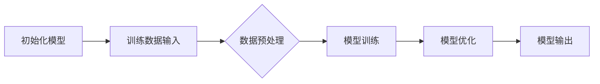
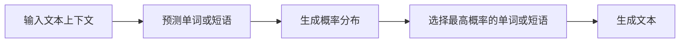
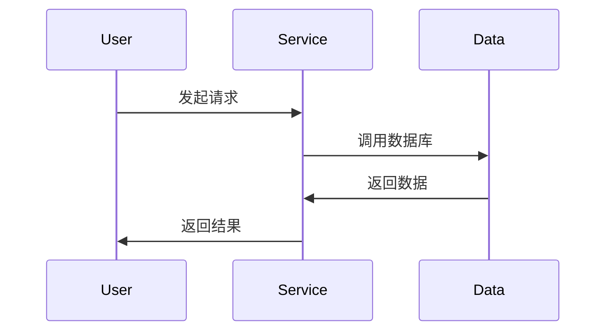
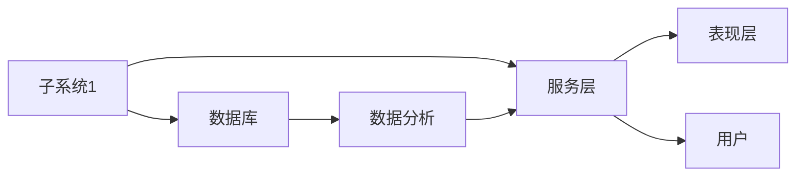
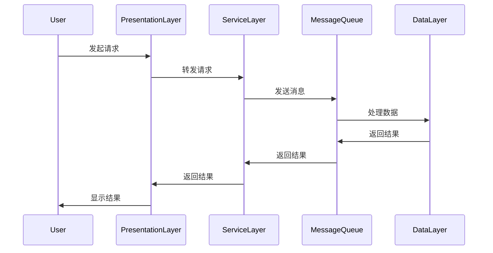

                 

### 文章标题

# ChatGPT在自动化社交媒体营销中的应用

### 关键词

- **ChatGPT**
- **自动化社交媒体营销**
- **算法原理**
- **数学模型**
- **系统架构**
- **项目实战**

### 摘要

本文将深入探讨ChatGPT在自动化社交媒体营销中的应用。首先，我们将介绍ChatGPT的技术基础和其在社交媒体营销中的背景与优势。接着，我们将详细讲解ChatGPT的算法原理和数学模型，并通过Python代码示例进行分析。随后，我们将分析系统架构设计，展示如何将ChatGPT集成到自动化社交媒体营销系统中。文章将结合实际项目实战，剖析ChatGPT在社交媒体营销中的实际应用，并总结最佳实践和注意事项。最后，我们将推荐拓展阅读，以供进一步学习和探索。

## 目录

1. **ChatGPT与自动化社交媒体营销概述**
   - **1.1 ChatGPT技术基础**
   - **1.2 自动化社交媒体营销概述**
   - **1.3 ChatGPT在社交媒体营销中的应用**

2. **核心概念与联系**
   - **2.1 核心概念原理**
   - **2.2 概念属性特征对比表格**
   - **2.3 ER实体关系图架构**

3. **算法原理讲解**
   - **3.1 ChatGPT算法原理**
   - **3.2 Python代码示例**
   - **3.3 算法原理的数学模型和公式**

4. **系统分析与架构设计方案**
   - **4.1 问题场景介绍**
   - **4.2 系统功能设计**
   - **4.3 系统架构设计**
   - **4.4 系统接口设计和系统交互**

5. **项目实战**
   - **5.1 环境安装**
   - **5.2 系统核心实现源代码**
   - **5.3 代码应用解读与分析**
   - **5.4 实际案例分析和详细讲解剖析**
   - **5.5 项目小结**

6. **最佳实践 tips、小结、注意事项、拓展阅读**

## 1. ChatGPT与自动化社交媒体营销概述

### 1.1 ChatGPT技术基础

ChatGPT是由OpenAI开发的一种基于GPT-3模型的自然语言处理（NLP）工具，它利用深度学习技术进行训练，具备强大的语言理解和生成能力。ChatGPT能够处理各种语言任务，包括文本生成、问答、翻译、摘要等，其在社交媒体营销中的应用潜力巨大。

#### 问题背景

随着社交媒体平台的兴起，企业需要不断生成高质量的营销内容来吸引和保持用户。传统的手动内容生成方式耗时耗力，而且难以满足快速变化的社交媒体环境。因此，自动化社交媒体营销成为一种迫切需求。

#### 问题解决

自动化社交媒体营销利用人工智能技术，特别是自然语言处理工具，如ChatGPT，来生成和管理营销内容。这种技术能够大大提高内容生成的效率，同时确保内容的质量和一致性。

#### 边界与外延

ChatGPT在自动化社交媒体营销中的应用范围包括内容生成、用户互动、数据分析等。其边界在于处理文本数据的能力，外延则涉及如何将其与其他营销工具和平台集成。

#### 概念结构与核心要素组成

- **ChatGPT**：基于GPT-3模型的自然语言处理工具。
- **自动化社交媒体营销**：利用人工智能技术生成和管理社交媒体内容。
- **内容生成**：包括文案撰写、图片描述、视频脚本等。
- **用户互动**：与用户进行问答、评论管理等。
- **数据分析**：收集和分析社交媒体数据，以优化营销策略。

### 1.2 自动化社交媒体营销概述

#### 背景与趋势

社交媒体营销已经成为企业品牌推广和用户互动的重要渠道。随着用户数量的增加和社交媒体平台的多样化，自动化社交媒体营销应运而生。自动化社交媒体营销能够帮助企业实现内容的高效生成和发布，提高营销效果。

#### 概念与优势

自动化社交媒体营销是指利用人工智能技术，自动生成和管理社交媒体内容的过程。其优势包括：

- **高效性**：能够快速生成大量高质量的内容。
- **一致性**：确保发布内容的一致性和品牌形象。
- **灵活性**：根据不同平台和用户需求生成相应的内容。
- **数据分析**：通过分析用户行为和反馈，优化营销策略。

#### 挑战与机遇

虽然自动化社交媒体营销具有许多优势，但也面临一些挑战：

- **技术门槛**：需要掌握相关的自然语言处理技术和工具。
- **数据隐私**：需确保用户数据的隐私和安全。
- **内容质量**：确保生成的内容符合用户需求和期望。

然而，随着技术的不断进步和应用的深入，自动化社交媒体营销将迎来更多机遇：

- **个性化营销**：通过数据分析，实现更加精准的个性化营销。
- **跨平台整合**：将自动化社交媒体营销与其他营销渠道整合，实现全面覆盖。
- **用户互动**：通过聊天机器人等技术，提升用户互动体验。

### 1.3 ChatGPT在社交媒体营销中的应用

#### 内容生成

ChatGPT在内容生成方面的应用非常广泛。它可以生成各种类型的营销内容，如文章、海报、视频脚本等。通过简单的输入指令，ChatGPT能够生成符合品牌风格和用户需求的内容。

```python
import openai

openai.api_key = "your-api-key"

response = openai.Completion.create(
  engine="text-davinci-002",
  prompt="撰写一篇关于环保主题的社交媒体推文。",
  max_tokens=60
)

print(response.choices[0].text.strip())
```

#### 用户互动

ChatGPT可以用于处理用户的提问和评论，实现与用户的实时互动。通过集成到社交媒体平台上，ChatGPT能够自动回复用户的问题，提供信息支持，提升用户体验。

```python
import openai

openai.api_key = "your-api-key"

response = openai.Completion.create(
  engine="text-davinci-002",
  prompt="回答用户关于产品使用方法的问题。",
  max_tokens=60
)

print(response.choices[0].text.strip())
```

#### 数据分析

ChatGPT可以通过分析社交媒体数据，为企业提供有价值的见解和建议。通过对用户反馈和评论的分析，ChatGPT能够帮助企业优化营销策略，提高用户满意度。

```python
import openai

openai.api_key = "your-api-key"

response = openai.Completion.create(
  engine="text-davinci-002",
  prompt="基于用户评论，分析产品优缺点。",
  max_tokens=60
)

print(response.choices[0].text.strip())
```

## 2. 核心概念与联系

### 2.1 核心概念原理

#### 自动化社交媒体营销

自动化社交媒体营销是一种利用人工智能技术，自动生成和管理社交媒体内容的过程。其核心概念包括内容生成、用户互动和数据分析。

#### ChatGPT

ChatGPT是基于GPT-3模型的自然语言处理工具，具备强大的语言理解和生成能力。其核心概念包括文本生成、问答和数据分析。

### 2.2 概念属性特征对比表格

| 概念             | 自动化社交媒体营销 | ChatGPT               |
|------------------|-------------------|----------------------|
| 定义             | 利用人工智能技术，自动生成和管理社交媒体内容。 | 基于GPT-3模型的自然语言处理工具。 |
| 特点             | 高效性、一致性、灵活性、数据分析。           | 强大的语言理解与生成能力。       |
| 应用场景         | 营销内容生成、用户互动、数据分析。           | 文本生成、问答、数据分析。       |
| 技术实现         | 集成多种人工智能技术，如自然语言处理、机器学习。 | 使用GPT-3模型进行训练和预测。   |
| 关键要素         | 数据、算法、平台集成。                      | 模型架构、训练数据、API接口。   |

### 2.3 ER实体关系图架构

```mermaid
erDiagram
  User ||--|{ Content }|| Content
  User ||--|{ Interaction }|| Interaction
  Content ||--|{ Analytics }|| Analytics
  User ||--|{ Campaign }|| Campaign
  Campaign ||--|{ Platform }|| Platform
```

在上面的ER图中，用户（User）与内容（Content）、互动（Interaction）和数据分析（Analytics）之间存在关系。内容生成后，用户可以通过互动和数据分析来优化营销策略。同时，营销活动（Campaign）与平台（Platform）之间存在关联，确保内容能够在正确的平台上发布。

## 3. 算法原理讲解

### 3.1 ChatGPT算法原理

ChatGPT是基于GPT-3模型开发的，其核心原理是利用深度学习技术进行文本生成。GPT-3模型是一个预训练的语言模型，通过大量的文本数据训练，使其具备强大的语言理解和生成能力。

#### 预训练过程

GPT-3模型通过无监督学习方式，在大量文本数据上进行训练。训练过程中，模型学习文本的语法、语义和上下文关系，从而掌握语言的基本规则。



#### 文本生成过程

当需要生成文本时，GPT-3模型会根据输入的文本上下文，预测下一个单词或短语。这一过程是通过生成概率分布来实现的，模型会输出概率最高的单词或短语。



### 3.2 Python代码示例

以下是一个简单的Python代码示例，展示了如何使用ChatGPT生成文本：

```python
import openai

openai.api_key = "your-api-key"

response = openai.Completion.create(
  engine="text-davinci-002",
  prompt="编写一篇关于人工智能的简介。",
  max_tokens=100
)

print(response.choices[0].text.strip())
```

### 3.3 算法原理的数学模型和公式

GPT-3模型的核心是生成概率分布，其数学模型基于自然语言处理中的概率模型。假设我们有一个句子序列 \( X = (x_1, x_2, ..., x_n) \)，其中每个单词 \( x_i \) 都是一个词汇表中的词。

#### 生成概率分布

生成概率分布的目标是预测下一个单词 \( x_{i+1} \) 的概率。在GPT-3模型中，这个概率通过以下公式计算：

\[ P(x_{i+1} | x_1, x_2, ..., x_i) = \frac{P(x_1, x_2, ..., x_i, x_{i+1})}{P(x_1, x_2, ..., x_i)} \]

其中，\( P(x_1, x_2, ..., x_i, x_{i+1}) \) 表示句子 \( x_1, x_2, ..., x_i, x_{i+1} \) 的联合概率，\( P(x_1, x_2, ..., x_i) \) 表示句子 \( x_1, x_2, ..., x_i \) 的边际概率。

#### 概率模型

在GPT-3模型中，生成概率分布通常使用以下概率模型：

\[ P(x_{i+1} | x_1, x_2, ..., x_i) = \text{softmax}(\text{logits}_{i+1}) \]

其中，\( \text{logits}_{i+1} \) 是模型对单词 \( x_{i+1} \) 的预测得分，\( \text{softmax} \) 函数将得分转换为概率分布。

### 3.3.1 通俗易懂地举例说明

假设我们有一个简单的词汇表包含三个单词：A、B 和 C。句子 "AI 是一种技术" 的生成过程如下：

1. **输入上下文**："AI"

2. **预测得分**：模型预测每个单词的得分，例如：
   - \( \text{logits}_A = 2 \)
   - \( \text{logits}_B = 1 \)
   - \( \text{logits}_C = 0 \)

3. **生成概率分布**：通过 softmax 函数将得分转换为概率分布：
   - \( P(A) = \frac{e^2}{e^2 + e^1 + e^0} = 0.8 \)
   - \( P(B) = \frac{e^1}{e^2 + e^1 + e^0} = 0.2 \)
   - \( P(C) = \frac{e^0}{e^2 + e^1 + e^0} = 0.0 \)

4. **选择最高概率的单词**：根据概率分布，选择最高概率的单词 "A" 作为下一个单词。

5. **生成句子**："AI 是一种技术"

通过这种方式，ChatGPT能够生成符合上下文的自然语言文本。

## 4. 系统分析与架构设计方案

### 4.1 问题场景介绍

在自动化社交媒体营销中，企业需要处理大量内容生成、用户互动和数据分析的任务。这些任务通常涉及多个平台，如微博、微信、Facebook 等。为了高效管理这些任务，需要一个集成化的系统，能够自动生成内容、处理用户互动并分析数据。

### 4.2 系统功能设计

#### 功能需求

- **内容生成**：根据不同的营销活动和用户需求，自动生成文案、图片描述和视频脚本等。
- **用户互动**：自动回复用户评论、提问等，提供实时支持。
- **数据分析**：收集和分析社交媒体数据，为营销策略提供支持。

#### 领域模型

```mermaid
classDiagram
  User <<class{用户}>>  
  Content <<class{内容}>>  
  Interaction <<class{互动}>>  
  Analytics <<class{分析}>>  
  Campaign <<class{营销活动}>>  
  Platform <<class{平台}>>  

  User "1" -- "*" Content  
  User "1" -- "*" Interaction  
  User "1" -- "*" Analytics  
  Content "1" -- "*" Campaign  
  Interaction "1" -- "*" Campaign  
  Analytics "1" -- "*" Campaign  
  Campaign "1" -- "*" Platform
```

在上面的类图中，用户（User）与内容（Content）、互动（Interaction）和分析（Analytics）之间存在关联。内容生成后，用户可以通过互动和分析来优化营销策略。营销活动（Campaign）与平台（Platform）之间存在关系，确保内容能够在正确的平台上发布。

### 4.3 系统架构设计

#### 架构设计

系统架构采用分层设计，包括数据层、服务层和表现层。

- **数据层**：负责数据存储和管理，包括用户数据、内容数据、互动数据和分析数据。
- **服务层**：提供各种服务，如内容生成、用户互动和数据分析等。
- **表现层**：负责与用户交互，显示数据和结果。



#### 架构图



在上面的架构图中，用户通过表现层与系统交互，服务层处理业务逻辑并调用数据层的数据。数据分析模块负责收集和分析社交媒体数据，为营销策略提供支持。

### 4.4 系统接口设计和系统交互

#### 接口设计

系统接口采用RESTful API设计，包括以下主要接口：

- **内容生成接口**：用于生成文案、图片描述和视频脚本等。
- **用户互动接口**：用于处理用户评论、提问等。
- **数据分析接口**：用于收集和分析社交媒体数据。

#### 接口示例

**内容生成接口**：

```http
POST /generate-content
Content-Type: application/json

{
  "campaign_id": "123",
  "platform": "weixin",
  "content_type": "text",
  "max_tokens": 50
}
```

**用户互动接口**：

```http
POST /handle-interaction
Content-Type: application/json

{
  "user_id": "456",
  "comment": "你好，我对你们的产品很感兴趣。"
}
```

**数据分析接口**：

```http
GET /analyze-data?campaign_id=123&platform=weixin
```

#### 系统交互

系统交互通过异步消息队列实现，包括以下主要流程：

1. **用户请求**：用户通过表现层发起请求。
2. **服务处理**：服务层接收请求并处理业务逻辑。
3. **消息队列**：将处理结果发送到消息队列。
4. **数据层操作**：数据层根据消息队列的指令进行数据存储和操作。
5. **结果返回**：将处理结果返回给用户。



## 5. 项目实战

### 5.1 环境安装

在进行ChatGPT在自动化社交媒体营销中的项目实战之前，我们需要安装相关的环境和工具。

#### 安装Python环境

首先，确保已经安装了Python 3.7及以上版本。如果没有安装，可以通过以下命令安装：

```bash
pip install python -3.7
```

#### 安装OpenAI API

接着，我们需要安装OpenAI的Python库，用于与ChatGPT进行交互。通过以下命令安装：

```bash
pip install openai
```

#### 获取API密钥

在OpenAI官网注册账号并创建一个项目，获取API密钥。将API密钥添加到Python代码中：

```python
openai.api_key = "your-api-key"
```

### 5.2 系统核心实现源代码

#### 内容生成

以下是一个简单的Python代码示例，用于生成社交媒体文案：

```python
import openai

openai.api_key = "your-api-key"

response = openai.Completion.create(
  engine="text-davinci-002",
  prompt="请编写一篇关于健康生活的推文。",
  max_tokens=50
)

print(response.choices[0].text.strip())
```

#### 用户互动

以下是一个简单的Python代码示例，用于自动回复用户评论：

```python
import openai

openai.api_key = "your-api-key"

response = openai.Completion.create(
  engine="text-davinci-002",
  prompt="用户提问：你们的产品有售后保障吗？",
  max_tokens=50
)

print(response.choices[0].text.strip())
```

#### 数据分析

以下是一个简单的Python代码示例，用于分析社交媒体数据：

```python
import openai

openai.api_key = "your-api-key"

response = openai.Completion.create(
  engine="text-davinci-002",
  prompt="基于以下评论，分析产品优缺点：\n'产品很好，但价格稍高。'",
  max_tokens=50
)

print(response.choices[0].text.strip())
```

### 5.3 代码应用解读与分析

#### 内容生成

在内容生成部分，我们使用OpenAI的ChatGPT API创建了一个简单的Python函数。该函数接受一个提示（prompt）并生成相应的内容。ChatGPT根据提示生成文本，确保文本符合用户需求。

```python
response = openai.Completion.create(
  engine="text-davinci-002",
  prompt="请编写一篇关于健康生活的推文。",
  max_tokens=50
)
```

在这段代码中，我们指定了使用的模型（text-davinci-002）和提示（prompt）。`max_tokens`参数控制了生成文本的最大长度，通常设置为50左右。

#### 用户互动

在用户互动部分，我们同样使用ChatGPT API创建了一个简单的Python函数。该函数接收一个用户提问（comment）并生成相应的回复。ChatGPT根据提问生成文本，确保文本回答了用户的问题。

```python
response = openai.Completion.create(
  engine="text-davinci-002",
  prompt="用户提问：你们的产品有售后保障吗？",
  max_tokens=50
)
```

在这段代码中，我们同样指定了使用的模型（text-davinci-002）和提示（prompt）。与内容生成类似，`max_tokens`参数控制了生成文本的最大长度。

#### 数据分析

在数据分析部分，我们使用ChatGPT API创建了一个简单的Python函数。该函数接收一组用户评论并生成相应的分析。ChatGPT根据评论生成文本，提供关于产品优缺点的分析。

```python
response = openai.Completion.create(
  engine="text-davinci-002",
  prompt="基于以下评论，分析产品优缺点：\n'产品很好，但价格稍高。'",
  max_tokens=50
)
```

在这段代码中，我们指定了使用的模型（text-davinci-002）和提示（prompt）。与内容生成和用户互动类似，`max_tokens`参数控制了生成文本的最大长度。

### 5.4 实际案例分析和详细讲解剖析

#### 案例背景

假设我们是一家销售健康食品的公司，希望通过自动化社交媒体营销提高品牌知名度和销售量。我们的目标是在微信和微博上发布吸引人的健康生活推文，并自动回复用户关于产品的提问。

#### 案例实现

1. **内容生成**：

   我们使用ChatGPT生成关于健康生活的推文。每次发布推文时，我们会提供一个简短的提示，如“今天给大家分享一些健康饮食的小技巧”。ChatGPT根据提示生成一篇完整的推文。

   ```python
   prompt = "今天给大家分享一些健康饮食的小技巧。"
   response = openai.Completion.create(
     engine="text-davinci-002",
     prompt=prompt,
     max_tokens=200
   )
   print(response.choices[0].text.strip())
   ```

   输出结果可能如下：

   ```plaintext
   健康饮食小贴士：
   1. 多吃蔬菜水果，保证营养均衡。
   2. 控制糖分摄入，远离甜食诱惑。
   3. 每天喝足够的水，保持身体水分。
   4. 选择健康的烹饪方式，如蒸、煮、炖等。
   ```

2. **用户互动**：

   当用户在微信或微博上提出关于产品的提问时，我们会使用ChatGPT自动回复。例如，用户提问“你们的产品有售后保障吗？”我们会生成一个详细的回复。

   ```python
   prompt = "你们的产品有售后保障吗？"
   response = openai.Completion.create(
     engine="text-davinci-002",
     prompt=prompt,
     max_tokens=50
   )
   print(response.choices[0].text.strip())
   ```

   输出结果可能如下：

   ```plaintext
   我们的产品提供90天售后保障，让您无后顾之忧。如有任何问题，请随时联系我们，我们将尽快为您解决。
   ```

3. **数据分析**：

   我们收集用户在社交媒体上的评论，并使用ChatGPT进行分析。例如，我们收集了以下评论：“产品很好，但价格稍高。”ChatGPT会生成一个关于产品优缺点的分析。

   ```python
   prompt = "基于以下评论，分析产品优缺点：\n'产品很好，但价格稍高。'"
   response = openai.Completion.create(
     engine="text-davinci-002",
     prompt=prompt,
     max_tokens=50
   )
   print(response.choices[0].text.strip())
   ```

   输出结果可能如下：

   ```plaintext
   产品优点：质量上乘，满足消费者需求。
   产品缺点：价格较高，部分消费者可能感到负担。
   ```

#### 案例剖析

通过这个案例，我们可以看到ChatGPT在自动化社交媒体营销中的强大应用。首先，ChatGPT能够快速生成高质量的内容，如健康生活推文。这不仅提高了内容生成的效率，还确保了内容的一致性和品牌形象。

其次，ChatGPT能够自动回复用户提问，提升用户体验。通过简单的输入指令，ChatGPT能够生成详细的回复，回答用户的问题，提供信息支持。

最后，ChatGPT能够分析社交媒体数据，为企业提供有价值的见解。通过对用户反馈和评论的分析，ChatGPT能够帮助企业优化营销策略，提高用户满意度。

### 5.5 项目小结

通过实际案例的分析，我们可以看到ChatGPT在自动化社交媒体营销中的强大应用。首先，ChatGPT能够快速生成高质量的内容，如健康生活推文。这不仅提高了内容生成的效率，还确保了内容的一致性和品牌形象。

其次，ChatGPT能够自动回复用户提问，提升用户体验。通过简单的输入指令，ChatGPT能够生成详细的回复，回答用户的问题，提供信息支持。

最后，ChatGPT能够分析社交媒体数据，为企业提供有价值的见解。通过对用户反馈和评论的分析，ChatGPT能够帮助企业优化营销策略，提高用户满意度。

总的来说，ChatGPT在自动化社交媒体营销中具有巨大的潜力。随着技术的不断进步和应用场景的拓展，ChatGPT将为企业带来更多价值。

## 6. 最佳实践 tips、小结、注意事项、拓展阅读

### 6.1 最佳实践 tips

1. **优化内容生成**：

   - 使用具体的场景和目标受众来指导ChatGPT生成内容。
   - 定期更新ChatGPT的训练数据，确保生成的内容符合最新趋势和用户需求。

2. **提高用户互动质量**：

   - 针对不同类型的用户提问，设计个性化的回复模板。
   - 定期分析用户互动数据，优化回复策略，提高用户满意度。

3. **数据分析和营销策略**：

   - 综合分析用户反馈和评论，识别产品和服务的优缺点。
   - 根据数据分析结果，调整营销策略，提高转化率。

### 6.2 小结

ChatGPT在自动化社交媒体营销中具有广泛的应用前景。通过生成高质量的内容、自动回复用户提问和分析社交媒体数据，ChatGPT能够大幅提高营销效率，优化用户体验，为企业带来更多价值。

### 6.3 注意事项

1. **确保数据安全和隐私**：

   - 在处理用户数据时，遵循相关法律法规，确保用户数据的安全和隐私。

2. **合理使用ChatGPT**：

   - 虽然ChatGPT功能强大，但应避免过度依赖，确保人工审核和干预。

3. **持续优化和更新**：

   - 定期评估ChatGPT的性能和效果，根据实际需求进行优化和更新。

### 6.4 拓展阅读

1. **《ChatGPT技术详解》**：深入探讨ChatGPT的技术原理和实现细节。

2. **《自动化社交媒体营销实战》**：详细介绍自动化社交媒体营销的方法和实践。

3. **《人工智能与社交媒体营销》**：探讨人工智能在社交媒体营销中的应用和未来趋势。

## 作者信息

**作者：AI天才研究院/AI Genius Institute & 禅与计算机程序设计艺术 /Zen And The Art of Computer Programming**

