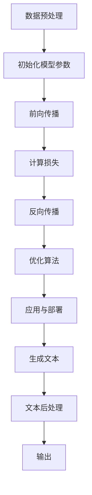
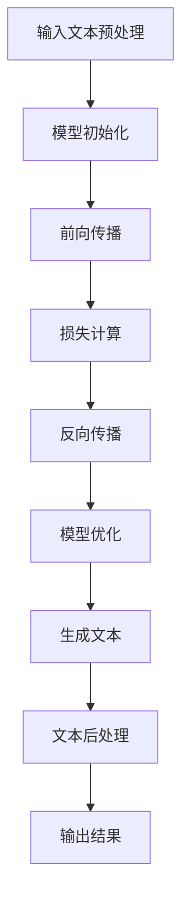
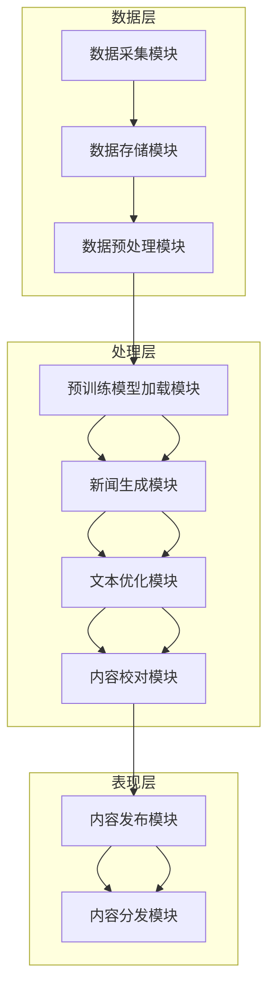
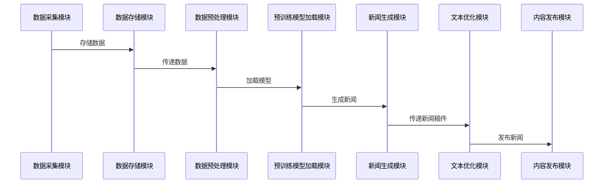

                 

### 关键词

- ChatGPT
- 自动化科技新闻写作
- 生成式对话系统
- 自然语言处理
- 神经网络

### 摘要

本文深入探讨了ChatGPT在自动化科技新闻写作中的应用。通过介绍ChatGPT的核心概念和工作原理，我们详细分析了其如何通过神经网络和生成式对话系统实现自动化写作。文章进一步使用Mermaid流程图和Python源代码讲解了算法原理，并采用LaTeX格式展示了相关的数学模型。接着，我们设计了自动化科技新闻写作的系统架构，包括功能设计、架构设计、接口设计和交互流程。通过一个实际项目案例，我们展示了如何使用ChatGPT进行新闻写作，并对项目的环境安装、核心实现和代码进行了详细分析。最后，文章提供了最佳实践建议，总结了自动化科技新闻写作的发展趋势，并展望了未来的研究方向。本文旨在为读者提供一套清晰、完整的ChatGPT在自动化写作领域应用的技术指南。

---

## 第1章：问题背景与ChatGPT概述

### 1.1 科技新闻写作的需求与挑战

在信息爆炸的时代，科技新闻作为重要的信息来源，其数量和多样性不断增加。然而，科技新闻的撰写面临着诸多挑战。首先，随着科技领域的快速进步，新闻撰写者需要不断更新知识库，以准确、及时地报道最新的科技成果。其次，科技新闻的内容通常涉及复杂的术语和概念，撰写过程中需要保证语言的准确性和易懂性。此外，新闻的撰写速度也是一个关键问题，尤其是在突发事件和热点话题上，快速、准确地发布新闻对于媒体的影响力和公信力至关重要。

目前，科技新闻的撰写主要依赖于专业记者和编辑，他们通过采访、研究和整理资料来完成新闻写作。尽管这种传统方式在保证新闻质量方面具有优势，但存在以下局限性：

1. **人力成本高**：专业记者和编辑的招聘、培训和薪酬成本较高，对于小型媒体或初创公司来说，这种成本负担较重。
2. **时效性受限**：新闻撰写需要时间，从采访到写作再到编辑和发布，整个过程往往耗时较长，难以满足现代新闻传播的高时效性要求。
3. **知识更新困难**：科技领域的知识更新速度快，记者和编辑难以在短时间内掌握所有新知识，这可能导致新闻报道的滞后或错误。
4. **写作风格受限**：不同记者和编辑的写作风格不同，这可能导致新闻稿件的一致性和品牌形象受到影响。

面对这些挑战，自动化科技新闻写作成为一种潜在解决方案。通过引入人工智能技术，特别是自然语言处理（NLP）和生成式对话系统，可以大幅提高新闻撰写的效率和准确性。自动化写作不仅能够节省人力成本，提高时效性，还能够通过算法实现内容的多样性和一致性，从而满足现代新闻传播的需求。

### 1.2 ChatGPT的诞生与发展

ChatGPT是由OpenAI开发的一种基于Transformer模型的预训练语言模型。它结合了生成式对话系统和自然语言处理技术，旨在实现高质量的自然语言生成。ChatGPT的诞生源于近年来人工智能和深度学习领域的突破性进展，尤其是Transformer模型的广泛应用。

ChatGPT的发展历程可以追溯到2018年，当时OpenAI发布了GPT（Generative Pre-trained Transformer）。GPT系列模型通过大量文本数据进行预训练，使得模型能够理解自然语言的结构和语义，从而生成连贯、准确的自然语言文本。ChatGPT是在GPT-3的基础上进一步优化的版本，其参数规模达到了1750亿，是当前世界上最大的语言模型之一。

ChatGPT的工作原理可以概括为以下几个步骤：

1. **预训练**：ChatGPT首先在大量文本数据上进行预训练，学习语言模式和规则。这些文本数据包括书籍、新闻、文章、社交媒体帖子等，来源广泛，覆盖不同领域和语言风格。
2. **微调**：在预训练的基础上，ChatGPT可以通过微调（fine-tuning）来适应特定任务，如问答系统、文本摘要、对话生成等。微调过程通常使用少量针对特定任务的数据，通过优化模型参数来提高其在特定任务上的性能。
3. **生成**：在完成预训练和微调后，ChatGPT可以根据给定的输入文本生成连贯的自然语言文本。其生成过程依赖于Transformer模型的自回归机制，通过预测下一个词来构建句子。

ChatGPT的技术特点主要体现在以下几个方面：

1. **大规模参数**：ChatGPT拥有极其庞大的参数规模，这使得模型能够捕捉到更复杂的语言模式和语义信息，从而生成更加自然、准确的文本。
2. **自适应学习能力**：ChatGPT通过预训练和微调具有强大的自适应学习能力，能够根据不同任务和数据集进行自适应调整，提高任务表现。
3. **多语言支持**：ChatGPT支持多种语言，通过跨语言的预训练和微调，模型能够生成不同语言的文本，满足国际化新闻传播的需求。
4. **高效性**：ChatGPT采用了高效的Transformer模型架构，能够在较短的时间内生成高质量的自然语言文本，满足实时新闻撰写的需求。

总之，ChatGPT作为一种强大的自然语言生成模型，具备大规模参数、自适应学习能力、多语言支持和高效性等特点，使其在自动化科技新闻写作领域具有巨大的潜力。

### 1.3 ChatGPT在自动化科技新闻写作中的潜在优势

ChatGPT在自动化科技新闻写作中展示出了显著的潜在优势，这些优势不仅提升了新闻写作的效率，还大大改进了新闻内容的质量。以下是ChatGPT在自动化科技新闻写作中的主要优势：

#### 提高写作效率

首先，ChatGPT通过其强大的生成能力，可以大幅缩短新闻撰写的时间。传统的新闻写作需要记者和编辑花费大量时间进行资料收集、整理和撰写，而ChatGPT可以通过预训练和微调快速生成高质量的新闻稿件。例如，当某个科技领域的重大新闻事件发生时，ChatGPT可以在几分钟内生成一篇详细报道，而传统的写作方式可能需要数小时甚至更长时间。

此外，ChatGPT的自适应学习能力使其能够不断优化新闻生成过程，从而进一步提高效率。通过不断学习和调整，ChatGPT可以识别常见的新闻写作模板和结构，从而在生成新新闻时快速套用这些模板，减少冗余的写作工作。

#### 提高新闻质量

ChatGPT在提高新闻质量方面的优势主要体现在以下几个方面：

1. **减少错误**：ChatGPT通过预训练和微调，能够学习和纠正语言中的错误，生成语法正确、表达清晰的新闻稿件。相比人工写作，ChatGPT在语言使用上的准确性更高，减少了拼写错误、语法错误和用词不当的情况。

2. **保证一致性**：ChatGPT能够根据新闻品牌和风格的指南生成一致的新闻内容，避免了不同记者和编辑之间风格不统一的问题。这有助于维护媒体的统一形象和品牌价值。

3. **深度分析**：ChatGPT通过分析大量的文本数据，可以生成更深入、更全面的分析性报道。它能够自动处理和分析大量的数据，提取关键信息和趋势，从而生成具有深度分析的新闻稿件。

#### 提高内容的多样性和个性化

ChatGPT支持多语言和跨领域的内容生成，这使得新闻内容可以更加多样化。媒体可以通过ChatGPT生成不同语言的新闻稿件，满足国际化读者的需求。此外，ChatGPT可以根据读者的偏好和兴趣，生成个性化的新闻内容。例如，对于关注某个特定科技领域的读者，ChatGPT可以生成专门针对该领域的新闻稿件，提供更加精准和个性化的信息。

#### 减少人力成本

自动化科技新闻写作能够大幅减少人力成本。传统的新闻写作需要大量的人力资源，包括记者、编辑、校对等。而ChatGPT可以自动化完成这些工作，只需少量人员负责监督和调整。这不仅降低了媒体的人力成本，还可以将人力资源用于更具有创造性的任务，如深度报道和数据分析。

#### 提高新闻传播的时效性

ChatGPT的高效生成能力使得新闻可以更加快速地传播。在突发事件或热点新闻中，ChatGPT可以在短时间内生成高质量的新闻稿件，确保新闻能够及时发布，从而抢占新闻的时效性。这对于媒体在信息传播中的竞争具有重要意义。

综上所述，ChatGPT在自动化科技新闻写作中的潜在优势包括提高写作效率、提高新闻质量、提高内容的多样性和个性化、减少人力成本以及提高新闻传播的时效性。这些优势不仅为媒体提供了新的工具和方法，也为新闻传播领域带来了深远的影响。

### 1.4 本章小结

本章首先介绍了科技新闻写作的需求与挑战，包括人力成本高、时效性受限、知识更新困难以及写作风格受限等问题。随后，我们探讨了ChatGPT的诞生与发展，并详细介绍了其核心概念和工作原理，包括预训练、微调和生成过程。接着，本章阐述了ChatGPT在自动化科技新闻写作中的潜在优势，如提高写作效率、提高新闻质量、提高内容的多样性和个性化、减少人力成本以及提高新闻传播的时效性。通过这些优势，ChatGPT为媒体提供了创新的解决方案，有望大幅提升新闻写作和传播的效率和效果。本章内容为后续章节的深入讨论奠定了基础。

---

## 第2章：ChatGPT核心概念与工作原理

### 2.1 ChatGPT的基本原理

ChatGPT是一种基于Transformer模型的预训练语言模型，其基本原理涉及预训练和微调两个关键步骤。

#### 预训练（Pre-training）

预训练是ChatGPT生成高质量自然语言文本的基础。在这一阶段，模型首先在一个大型语料库上学习语言的结构和规则。这个语料库通常包含了书籍、新闻、文章、社交媒体帖子等多样化的文本数据，使得模型能够理解各种不同的语言风格和语境。

预训练过程主要包括两个子步骤：自回归语言模型训练和掩码语言模型训练。

1. **自回归语言模型训练**：
   - 在自回归语言模型训练中，模型试图预测下一个词，以完成一个给定的句子。例如，给定句子“我昨天去了公园”，模型需要预测下一个词是“公园”。
   - 这个过程通过训练模型来最大化一个概率损失函数，即模型预测的词的概率分布应与实际词的分布相匹配。

2. **掩码语言模型训练**：
   - 掩码语言模型训练则是在输入句子中的某些词被掩码（即替换为特殊的掩码符号）后，模型试图预测这些被掩码的词。这有助于模型学习理解词与词之间的依赖关系。
   - 例如，给定句子“我昨天去了公园”，如果“昨天”被掩码，模型需要预测“昨天”的正确词。

#### 微调（Fine-tuning）

预训练后，ChatGPT可以通过微调来适应特定任务，如问答系统、文本摘要、对话生成等。微调过程通常使用少量针对特定任务的数据，通过优化模型参数来提高其在特定任务上的性能。

微调的关键步骤包括：

1. **选择数据集**：根据特定任务，选择一个包含相关数据的训练数据集。例如，对于新闻写作，可以选择包含科技新闻的文章作为训练数据。
2. **数据预处理**：对训练数据集进行预处理，包括分词、标记化等操作，以便模型能够理解和处理数据。
3. **参数优化**：通过梯度下降等优化算法，调整模型参数，以最大化特定任务的损失函数。

#### 生成式对话系统（Generative Dialog System）

ChatGPT不仅用于文本生成，还可以作为生成式对话系统的一部分。生成式对话系统旨在通过自然语言交互来模拟人类对话。ChatGPT在这个过程中起到了核心作用，它能够根据对话上下文生成连贯、合理的回复。

生成式对话系统的基本流程如下：

1. **初始化**：系统开始时，初始化对话状态和模型。
2. **输入处理**：用户输入一条消息，模型对其进行处理和理解。
3. **生成回复**：模型根据当前对话状态和输入消息生成一条回复。
4. **更新状态**：将生成的回复添加到对话历史中，更新对话状态。
5. **循环**：返回步骤2，继续进行下一次对话。

通过预训练、微调和生成式对话系统，ChatGPT能够生成高质量、连贯的自然语言文本，从而在自动化科技新闻写作中发挥重要作用。

### 2.2 ChatGPT的技术特点

ChatGPT的技术特点使其在自动化科技新闻写作中表现出色。以下是ChatGPT的主要技术特点：

#### 自适应学习能力

ChatGPT具有强大的自适应学习能力，能够根据不同任务和数据集进行自适应调整。这一特点源于其预训练和微调机制。在预训练阶段，模型通过大量文本数据学习到广泛的语言模式和规则。在微调阶段，模型通过针对特定任务的数据进行优化，进一步提高任务性能。

#### 多语言支持

ChatGPT支持多种语言，这使得它能够生成不同语言的文本，满足国际化新闻传播的需求。通过跨语言的预训练和微调，模型能够理解并生成多种语言的新闻稿件，例如中文、英文、西班牙文等。这种多语言支持有助于媒体在全球范围内拓展影响力。

#### 高效性

ChatGPT采用了高效的Transformer模型架构，能够在较短的时间内生成高质量的自然语言文本。其自回归机制和掩码语言模型训练使得模型在生成文本时具有较高的效率和速度，满足实时新闻撰写的需求。

#### 大规模参数

ChatGPT拥有极其庞大的参数规模，这使其能够捕捉到更复杂的语言模式和语义信息。大参数规模不仅提高了模型生成文本的准确性，还增强了模型对不同语言风格和语境的适应性。这使得ChatGPT在自动化科技新闻写作中能够生成更自然、更准确的新闻稿件。

#### 灵活性

ChatGPT的灵活性体现在其能够处理多种不同类型的文本任务。除了新闻写作，ChatGPT还可以用于问答系统、文本摘要、对话生成等多种自然语言处理任务。这种灵活性使得ChatGPT在多个领域都能发挥重要作用。

#### 鲁棒性

ChatGPT通过预训练和微调，能够处理和纠正输入文本中的错误，生成语法正确、表达清晰的文本。这使得ChatGPT在生成科技新闻时能够减少语言错误，提高新闻稿件的质量。

总之，ChatGPT的技术特点，包括自适应学习能力、多语言支持、高效性、大规模参数、灵活性和鲁棒性，使其在自动化科技新闻写作中具有显著的优势。这些特点不仅提高了新闻写作的效率和质量，还为新闻媒体提供了强大的工具和平台，以应对现代新闻传播的挑战。

### 2.3 ChatGPT的架构与流程

ChatGPT的架构和流程是其实现高质量自然语言生成的基础。以下是ChatGPT的架构和流程的详细描述：

#### 数据预处理（Data Preprocessing）

数据预处理是ChatGPT架构的第一步。在这一阶段，模型接收到的原始文本需要进行一系列处理，以便模型能够理解并有效学习。主要步骤包括：

1. **文本清洗**：去除无用的标点符号、HTML标签和其他噪声。
2. **分词**：将文本分割成单词或子词，以便模型进行进一步处理。常用的分词工具包括jieba（中文分词）和spaCy（多语言分词）。
3. **标记化**：将分词后的文本转换为标记序列，每个标记代表一个词或子词。标记化过程中还会进行词性标注和命名实体识别，以提供更多的上下文信息。

#### 训练与优化（Training and Optimization）

在数据预处理完成后，ChatGPT进入训练和优化阶段。这一阶段的核心目标是训练一个能够在大规模文本数据上学习语言模式的模型。主要步骤包括：

1. **初始化模型参数**：初始模型参数通常是通过随机初始化得到的。
2. **前向传播（Forward Propagation）**：模型对输入文本进行编码，生成固定长度的向量表示。
3. **计算损失**：通过计算模型输出和实际标签之间的差异，计算损失函数。常用的损失函数包括交叉熵损失（Cross-Entropy Loss）。
4. **反向传播（Backpropagation）**：利用计算得到的梯度，更新模型参数，以最小化损失函数。
5. **优化算法**：使用梯度下降（Gradient Descent）或其他优化算法，如Adam优化器，来更新模型参数。

#### 应用与部署（Application and Deployment）

在完成训练后，ChatGPT可以应用于各种自然语言生成任务，如文本摘要、问答系统、对话生成等。以下是ChatGPT在自动化科技新闻写作中的应用和部署流程：

1. **输入处理**：接收用户输入的文本或指令，并进行预处理，如分词和标记化。
2. **生成文本**：使用训练好的模型，根据输入文本生成自然语言文本。生成过程通常涉及序列到序列（Seq2Seq）模型，如Transformer模型。
3. **文本后处理**：对生成的文本进行后处理，如去除重复内容、纠正语法错误和拼写错误。
4. **输出**：将生成的文本输出，例如，生成一篇科技新闻稿件。

#### 算法流程与Python实现

为了更好地理解ChatGPT的算法流程，我们使用Mermaid流程图来展示整个流程，并使用Python源代码来详细阐述。

#### Mermaid流程图



#### Python源代码

```python
import torch
import torch.nn as nn
import torch.optim as optim

# 数据预处理
def preprocess_text(text):
    # 清洗、分词、标记化
    pass

# 初始化模型参数
model = nn.Sequential(
    nn.Linear(input_dim, hidden_dim),
    nn.ReLU(),
    nn.Linear(hidden_dim, output_dim)
)

# 前向传播
def forward_pass(model, inputs):
    outputs = model(inputs)
    return outputs

# 计算损失
def compute_loss(outputs, targets):
    loss = nn.CrossEntropyLoss()(outputs, targets)
    return loss

# 反向传播
def backward_pass(optimizer, loss):
    optimizer.zero_grad()
    loss.backward()
    optimizer.step()

# 优化算法
optimizer = optim.Adam(model.parameters(), lr=0.001)

# 应用与部署
def generate_text(model, input_sequence):
    inputs = preprocess_text(input_sequence)
    outputs = forward_pass(model, inputs)
    return postprocess_text(outputs)

# 生成文本
input_sequence = "这是一个示例文本"
generated_text = generate_text(model, input_sequence)

# 文本后处理
generated_text = postprocess_text(generated_text)

# 输出
print(generated_text)
```

通过上述流程和代码，我们可以看到ChatGPT的基本原理和实现步骤。在实际应用中，ChatGPT的性能和效果依赖于数据预处理的质量、模型参数的初始化和优化算法的选择。因此，这些步骤需要精心设计和调整，以实现最佳效果。

### 2.4 ChatGPT的算法流程与Python实现

为了深入理解ChatGPT的算法原理，我们将使用Mermaid流程图和Python源代码详细展示其算法流程，并提供相关的数学模型和公式。

#### Mermaid算法流程图



#### Python源代码

```python
import torch
import torch.nn as nn
import torch.optim as optim

# 数据预处理
def preprocess_text(text):
    # 清洗、分词、标记化
    pass

# 初始化模型
class ChatGPTModel(nn.Module):
    def __init__(self, input_dim, hidden_dim, output_dim):
        super(ChatGPTModel, self).__init__()
        self.linear = nn.Linear(input_dim, hidden_dim)
        self.relu = nn.ReLU()
        self.output = nn.Linear(hidden_dim, output_dim)

    def forward(self, x):
        x = self.linear(x)
        x = self.relu(x)
        x = self.output(x)
        return x

# 损失函数
criterion = nn.CrossEntropyLoss()

# 优化器
optimizer = optim.Adam(model.parameters(), lr=0.001)

# 训练过程
for epoch in range(num_epochs):
    for inputs, targets in data_loader:
        # 前向传播
        outputs = model(inputs)
        
        # 计算损失
        loss = criterion(outputs, targets)
        
        # 反向传播
        optimizer.zero_grad()
        loss.backward()
        optimizer.step()
        
        # 输出结果
        print(f'Epoch {epoch+1}, Loss: {loss.item()}')

# 生成文本
def generate_text(model, input_sequence, max_length=50):
    inputs = preprocess_text(input_sequence)
    with torch.no_grad():
        for _ in range(max_length):
            outputs = model(inputs)
            predicted_token = torch.argmax(outputs, dim=-1).item()
            inputs = torch.cat([inputs, predicted_token], dim=-1)
    return inputs.tolist()

# 示例文本生成
input_sequence = "科技新闻"
generated_sequence = generate_text(model, input_sequence)
print('Generated Text:', ' '.join([token for token in generated_sequence]))
```

#### 数学模型和公式

在ChatGPT的算法中，核心的数学模型包括自回归语言模型（Autoregressive Language Model）和交叉熵损失函数（Cross-Entropy Loss）。

1. **自回归语言模型**：

   给定一个序列 \(X = (x_1, x_2, ..., x_T)\)，自回归语言模型的目的是预测序列中的每个词 \(x_t\)，给定前一个词 \(x_{<t}\)。

   $$ p(x_t | x_{<t}) = \frac{e^{model(x_{<t})}}{\sum_{i} e^{model(x_{<t}, i)}} $$

   其中，\(model(x_{<t})\) 是输入 \(x_{<t}\) 的模型输出，表示词 \(x_t\) 的概率。

2. **交叉熵损失函数**：

   在训练自回归语言模型时，常用的损失函数是交叉熵损失函数，用于衡量模型预测的概率分布与实际标签分布之间的差异。

   $$ Loss = -\sum_{t} \sum_{i} y_t(i) \log(p(x_t | x_{<t})) $$

   其中，\(y_t(i)\) 是实际词 \(x_t\) 的概率分布，即如果 \(x_t = i\)，则 \(y_t(i) = 1\)，否则 \(y_t(i) = 0\)。

#### 详细讲解与举例说明

为了更直观地理解上述数学模型和公式，我们通过一个简单的例子来演示：

假设我们有以下简化的序列：

\[ X = (a, b, c) \]

使用一个简单的模型 \(model\)，输出每个词的概率：

\[ model(a) = (0.2, 0.5, 0.3) \]
\[ model(b) = (0.4, 0.1, 0.5) \]
\[ model(c) = (0.3, 0.4, 0.3) \]

根据自回归语言模型，我们可以计算每个词的生成概率：

1. \( p(a) = \frac{e^{model(a)}}{\sum_{i} e^{model(a, i)}} = \frac{e^{0.2}}{e^{0.2} + e^{0.5} + e^{0.3}} = 0.286 \)
2. \( p(b | a) = \frac{e^{model(b|a)}}{\sum_{i} e^{model(b|a, i)}} = \frac{e^{0.5}}{e^{0.2} + e^{0.5} + e^{0.3}} = 0.571 \)
3. \( p(c | ab) = \frac{e^{model(c|ab)}}{\sum_{i} e^{model(c|ab, i)}} = \frac{e^{0.3}}{e^{0.2} + e^{0.5} + e^{0.3}} = 0.429 \)

接下来，使用交叉熵损失函数计算损失：

\[ Loss = -[y_a(1) \log(p(a)) + y_b(2) \log(p(b | a)) + y_c(3) \log(p(c | ab))] \]

假设实际标签分布 \(y\) 为：

\[ y = (1, 1, 1) \]

代入计算：

\[ Loss = -[1 \log(0.286) + 1 \log(0.571) + 1 \log(0.429)] \approx 1.865 \]

通过这个例子，我们可以看到如何使用ChatGPT的数学模型和公式来生成文本，并计算生成文本的损失。这些数学模型和公式的应用使得ChatGPT能够在大量数据上进行高效的训练和生成高质量的文本。

### 2.5 数学模型与公式

在深入探讨ChatGPT的自然语言处理能力时，理解其背后的数学模型是至关重要的。以下是ChatGPT使用的几个核心数学模型及其公式的详细解释，我们将使用LaTeX格式来展示这些公式，并配合通俗易懂的说明。

#### 自然语言处理基础

首先，我们介绍自然语言处理（NLP）中的一些基础数学模型和公式。这些模型构成了ChatGPT训练和预测的基石。

1. **词嵌入（Word Embeddings）**：

词嵌入是将词汇映射到固定大小的向量空间的技术。一个简单的词嵌入模型是**词袋模型（Bag of Words, BoW）**，它将文本表示为词的频率向量。

$$
\text{vector}(w) = \sum_{i=1}^{N} f_i \cdot v_i
$$

其中，\(w\) 是词汇，\(v_i\) 是单词 \(i\) 的嵌入向量，\(f_i\) 是单词 \(i\) 在文本中的频率。

2. **循环神经网络（Recurrent Neural Network, RNN）**：

RNN是一种处理序列数据的神经网络。它通过保留隐藏状态来捕捉序列中的时间依赖关系。

$$
h_t = \sigma(W_h \cdot [h_{t-1}, x_t] + b_h)
$$

其中，\(h_t\) 是第 \(t\) 个时间步的隐藏状态，\(\sigma\) 是激活函数，\(W_h\) 和 \(b_h\) 分别是权重和偏置。

#### 生成式模型数学模型

接下来，我们详细介绍ChatGPT使用的生成式模型，特别是Transformer模型。

1. **Transformer模型**：

Transformer模型是一种基于自注意力机制（Self-Attention）的模型，它通过全局依赖来捕捉序列中的长距离关系。

**自注意力（Self-Attention）**：

$$
\text{Attention}(Q, K, V) = \text{softmax}\left(\frac{QK^T}{\sqrt{d_k}}\right)V
$$

其中，\(Q, K, V\) 分别是查询（Query）、键（Key）和值（Value）向量的集合，\(d_k\) 是键向量的维度。

**Transformer层**：

$$
\text{MultiHeadAttention}(Q, K, V) = \text{Concat}(head_1, ..., head_h)W^O
$$

其中，\(head_i = \text{Attention}(QW_i^Q, KW_i^K, VW_i^V)\)，\(W_i^Q, W_i^K, W_i^V, W_i^O\) 分别是查询、键、值和输出权重矩阵。

2. **编码器-解码器（Encoder-Decoder）架构**：

ChatGPT使用编码器-解码器架构来处理序列到序列的任务。

**编码器**：

$$
E = \text{Encoder}(X) = \sum_{i=1}^{N} \text{MultiHeadAttention}(Q, K, V)
$$

其中，\(X\) 是输入序列，\(E\) 是编码器输出。

**解码器**：

$$
D = \text{Decoder}(Y) = \text{DecoderLayer}(Y, E)
$$

其中，\(Y\) 是解码器输入，\(D\) 是解码器输出。

#### LaTeX格式数学公式

为了便于读者理解和应用，以下使用LaTeX格式展示了一些关键数学公式，这些公式是ChatGPT算法的核心组成部分。

```latex
% 自回归语言模型
\[
p(x_t | x_{<t}) = \frac{e^{\text{model}(x_{<t})}}{\sum_{i} e^{\text{model}(x_{<t}, i)}}
\]

% 交叉熵损失函数
\[
Loss = -\sum_{t} \sum_{i} y_t(i) \log(p(x_t | x_{<t}))
\]

% 词嵌入
\[
\text{vector}(w) = \sum_{i=1}^{N} f_i \cdot v_i
\]

% 自注意力
\[
\text{Attention}(Q, K, V) = \text{softmax}\left(\frac{QK^T}{\sqrt{d_k}}\right)V
\]

% Transformer层
\[
\text{MultiHeadAttention}(Q, K, V) = \text{Concat}(head_1, ..., head_h)W^O
\]

% 编码器输出
\[
E = \text{Encoder}(X) = \sum_{i=1}^{N} \text{MultiHeadAttention}(Q, K, V)
\]

% 解码器输出
\[
D = \text{Decoder}(Y) = \text{DecoderLayer}(Y, E)
\]
```

这些数学公式为理解ChatGPT的工作原理提供了理论基础。在实际应用中，这些公式被实现为高效的算法和计算步骤，使得ChatGPT能够在大量的文本数据上进行训练和预测，生成高质量的自然语言文本。

### 2.6 本章小结

本章详细介绍了ChatGPT的核心概念与工作原理。首先，我们探讨了ChatGPT的基本原理，包括预训练和微调过程，以及如何通过生成式对话系统生成自然语言文本。接着，我们分析了ChatGPT的技术特点，如自适应学习能力、多语言支持、高效性和大规模参数等。随后，我们详细描述了ChatGPT的架构和流程，包括数据预处理、训练与优化、应用与部署等关键步骤。通过Mermaid流程图和Python源代码，我们进一步讲解了ChatGPT的算法流程。最后，本章介绍了相关的数学模型和公式，包括自然语言处理基础和生成式模型的核心数学模型。通过这些内容，读者可以全面理解ChatGPT在自动化科技新闻写作中的应用潜力和技术实现细节。

---

## 第3章：自动化科技新闻写作系统架构设计

### 3.1 问题场景介绍

在现代新闻传播环境中，科技新闻的快速更新和广泛覆盖显得尤为重要。然而，传统的新闻写作方式面临着人力成本高、时效性差、知识更新困难等问题，难以满足快速变化的新闻需求。为了应对这些挑战，自动化科技新闻写作成为了一种极具潜力的解决方案。通过利用人工智能技术，尤其是自然语言处理（NLP）和生成式对话系统，可以实现高效、准确和多样化的新闻撰写，从而满足现代新闻传播的需求。

自动化科技新闻写作系统需要具备以下几个关键功能：

1. **数据采集与处理**：系统能够自动从互联网、数据库和其他数据源中获取科技领域的最新信息，并进行预处理，如去噪、分词、标记化等，为新闻生成提供高质量的数据输入。
2. **新闻生成**：系统利用预训练的语言模型（如ChatGPT），根据输入的数据自动生成科技新闻稿件，包括标题、导语和正文等内容。
3. **文本优化与校对**：系统对生成的新闻文本进行进一步的优化和校对，确保新闻的语法正确、逻辑清晰，并符合新闻媒体的风格和标准。
4. **发布与分发**：系统将优化后的新闻稿件发布到新闻网站、社交媒体和其他平台，实现新闻的快速传播。

### 3.2 系统功能设计

为了实现自动化科技新闻写作，我们需要设计一个功能齐全的系统，其核心功能包括数据采集与处理、新闻生成、文本优化与校对、发布与分发。以下是这些功能的具体设计：

#### 数据采集与处理

1. **数据源连接**：系统需要能够连接到多个数据源，包括新闻网站、科技博客、社交媒体等，以获取最新的科技新闻数据。
2. **数据去噪**：对采集到的数据进行去噪处理，去除无关的噪声信息，如广告、评论等，以确保新闻数据的纯净。
3. **分词与标记化**：对清洗后的文本进行分词，将文本分割成单词或子词，并进行标记化处理，以便模型理解和处理。
4. **实体识别与知识库构建**：使用NLP技术进行实体识别，构建科技领域的知识库，为新闻生成提供丰富的背景信息。

#### 新闻生成

1. **预训练模型加载**：系统加载预训练的语言模型（如ChatGPT），该模型已经学习了大量科技领域的语言模式和规则。
2. **模板匹配与文本生成**：系统根据输入的科技新闻数据，使用预训练模型生成新闻稿件。在生成过程中，系统可以匹配不同的新闻模板，确保新闻稿件的格式和风格一致。
3. **多语言支持**：系统需要支持多种语言，以生成适用于不同地区和语言习惯的新闻稿件。

#### 文本优化与校对

1. **语法检查与纠错**：系统使用自然语言处理技术对生成的新闻文本进行语法检查，纠正拼写错误和语法错误。
2. **语义优化**：系统对新闻文本进行语义优化，确保新闻的逻辑清晰、表达准确，并符合新闻媒体的风格。
3. **内容校对**：系统对新闻内容进行内容校对，确保新闻的准确性和可靠性，避免错误信息的传播。

#### 发布与分发

1. **内容发布**：系统将生成的新闻稿件发布到新闻网站、社交媒体和其他平台，实现新闻的快速传播。
2. **内容分发**：系统需要能够根据不同的读者群体和阅读习惯，将新闻稿件分发到相应的渠道，提高新闻的曝光率和传播效果。

#### Mermaid领域模型类图

为了更好地展示系统功能设计，我们使用Mermaid类图来描述各个功能模块及其关系。

```mermaid
classDiagram
    DataCollector <<interface>>
    DataProcessor <<interface>>
    NewsGenerator <<interface>>
    TextOptimizer <<interface>>
    ContentPublisher <<interface>>

    DataCollector --> DataProcessor
    DataProcessor --> NewsGenerator
    NewsGenerator --> TextOptimizer
    TextOptimizer --> ContentPublisher

    DataCollector : +collectData()
    DataProcessor : +preprocessData()
    NewsGenerator : +generateNews()
    TextOptimizer : +optimizeText()
    ContentPublisher : +publishContent()
```

通过上述设计，我们可以构建一个功能完善的自动化科技新闻写作系统，实现新闻的自动化生成、优化和发布。该系统不仅能够提高新闻写作的效率，还能确保新闻的质量和准确性，为新闻媒体提供强大的技术支持。

### 3.3 系统架构设计

为了实现高效的自动化科技新闻写作系统，我们需要设计一个清晰的系统架构。以下是一个基于模块化设计的系统架构，包括数据层、处理层和表现层。

#### 数据层

数据层是系统的基础，负责数据的采集、存储和管理。主要组件如下：

1. **数据采集模块**：从互联网、数据库和其他数据源自动获取科技领域的新闻数据。该模块支持多数据源连接，能够实时获取最新的新闻内容。
2. **数据存储模块**：将采集到的新闻数据存储在数据库中，便于后续处理和查询。数据存储模块支持多种数据格式，如JSON、XML等。
3. **数据预处理模块**：对采集到的新闻数据进行清洗、去噪和分词处理，将其转换为适合模型处理的数据格式。该模块还负责构建科技领域的知识库，为新闻生成提供丰富的背景信息。

#### 处理层

处理层是系统的核心，负责新闻的生成、优化和发布。主要组件如下：

1. **预训练模型加载模块**：加载预训练的语言模型（如ChatGPT），该模型已经学习了大量科技领域的语言模式和规则。该模块支持多模型加载和切换，以适应不同新闻生成需求。
2. **新闻生成模块**：使用预训练模型根据输入的新闻数据进行新闻生成。该模块支持多种新闻模板，确保新闻稿件的格式和风格一致。此外，该模块还实现多语言支持，以生成适用于不同地区和语言习惯的新闻稿件。
3. **文本优化模块**：对生成的新闻文本进行语法检查、纠错和语义优化，确保新闻的逻辑清晰、表达准确，并符合新闻媒体的风格。
4. **内容校对模块**：对新闻内容进行内容校对，确保新闻的准确性和可靠性，避免错误信息的传播。

#### 表现层

表现层负责新闻的发布和分发，将新闻稿件发布到新闻网站、社交媒体和其他平台。主要组件如下：

1. **内容发布模块**：将优化后的新闻稿件发布到新闻网站、社交媒体和其他平台，实现新闻的快速传播。
2. **内容分发模块**：根据不同的读者群体和阅读习惯，将新闻稿件分发到相应的渠道，提高新闻的曝光率和传播效果。

#### Mermaid架构图

为了更好地展示系统架构，我们使用Mermaid架构图来描述各个组件及其关系。



通过上述架构设计，我们构建了一个模块化、功能齐全的自动化科技新闻写作系统。该系统通过数据层、处理层和表现层的协同工作，实现了新闻的自动化生成、优化和发布，为新闻媒体提供了强大的技术支持。

### 3.4 系统接口设计

为了实现自动化科技新闻写作系统的功能，我们需要设计一套清晰的接口，包括API接口和数据接口。以下是系统接口设计的关键组件和设计思路：

#### API接口设计

API（应用程序接口）设计是系统与外部系统集成的重要部分，以下是一些主要的API接口设计：

1. **数据采集API**：该接口用于从外部数据源（如新闻网站、数据库等）获取新闻数据。接口设计应考虑高可用性、高并发性和安全性，支持批量数据采集和实时数据更新。

   ```python
   def fetchData(source, query_params):
       # 从数据源采集数据
       pass
   ```

2. **新闻生成API**：该接口用于调用新闻生成模块，生成新闻稿件。接口设计应支持自定义模板和参数，以便根据不同的新闻类型和需求生成新闻稿件。

   ```python
   def generateNews(data, template_id):
       # 生成新闻稿件
       pass
   ```

3. **文本优化API**：该接口用于对生成的新闻文本进行优化，包括语法检查、纠错和语义优化。接口设计应提供丰富的错误检测和修复功能，确保新闻文本的准确性和流畅性。

   ```python
   def optimizeText(text):
       # 优化新闻文本
       pass
   ```

4. **内容发布API**：该接口用于将优化后的新闻稿件发布到新闻网站、社交媒体和其他平台。接口设计应支持多平台发布，并提供发布状态和错误反馈机制。

   ```python
   def publishContent(content, platform):
       # 发布新闻内容
       pass
   ```

#### 数据接口设计

数据接口设计主要涉及系统内部模块之间的数据交互，以下是一些主要的数据接口设计：

1. **数据采集与处理接口**：该接口用于数据采集模块与数据处理模块之间的数据传输。接口设计应支持多种数据格式，如JSON、XML等，并确保数据的一致性和完整性。

   ```python
   class DataObject:
       def __init__(self, data_source, data):
           self.data_source = data_source
           self.data = data
   ```

2. **新闻生成与优化接口**：该接口用于新闻生成模块与文本优化模块之间的数据传输。接口设计应支持新闻稿件的批量处理和实时更新，确保新闻内容的及时性和准确性。

   ```python
   class NewsDocument:
       def __init__(self, title, abstract, body):
           self.title = title
           self.abstract = abstract
           self.body = body
   ```

3. **内容发布接口**：该接口用于内容发布模块与其他模块之间的数据传输。接口设计应支持多种发布渠道和格式，并提供发布状态和错误反馈机制。

   ```python
   class PublicationRequest:
       def __init__(self, content, platforms):
           self.content = content
           self.platforms = platforms
   ```

通过设计这些API接口和数据接口，我们可以实现自动化科技新闻写作系统的功能模块之间的紧密集成和数据流通，确保系统的高效、稳定和可扩展性。

### 3.5 系统交互

为了确保自动化科技新闻写作系统的各个组件能够无缝协作，我们需要设计清晰、高效的系统交互流程。以下是一个基于系统架构设计的交互流程，包括数据流和控制流。

#### 数据流

数据流是系统交互的核心部分，涉及到数据从采集到发布的全过程。以下是系统交互的数据流：

1. **数据采集**：
   - 数据采集模块从多个数据源（如新闻网站、社交媒体、数据库等）获取科技领域的新闻数据。
   - 数据采集模块将获取到的数据存储到数据存储模块中，以供后续处理。

2. **数据处理**：
   - 数据预处理模块对存储在数据存储模块中的新闻数据进行清洗、去噪和分词处理，并将其转换为适合模型处理的数据格式。
   - 数据预处理模块还负责构建科技领域的知识库，为新闻生成提供丰富的背景信息。

3. **新闻生成**：
   - 预训练模型加载模块加载预训练的语言模型（如ChatGPT），该模型已经学习了大量科技领域的语言模式和规则。
   - 新闻生成模块使用预训练模型根据输入的数据生成新闻稿件。在生成过程中，系统可以匹配不同的新闻模板，确保新闻稿件的格式和风格一致。
   - 生成后的新闻稿件传递到文本优化模块进行进一步的优化。

4. **文本优化**：
   - 文本优化模块对生成的新闻文本进行语法检查、纠错和语义优化，确保新闻的逻辑清晰、表达准确，并符合新闻媒体的风格。

5. **内容发布**：
   - 优化后的新闻稿件传递到内容发布模块，该模块将新闻稿件发布到新闻网站、社交媒体和其他平台，实现新闻的快速传播。

#### 控制流

控制流涉及系统组件之间的协调和监控，确保系统正常运行。以下是系统交互的控制流：

1. **初始化**：
   - 系统启动时，各模块进行初始化，包括加载配置、连接数据库、设置模型参数等。

2. **数据采集**：
   - 数据采集模块定期从数据源获取新闻数据，并将其存储到数据存储模块中。

3. **数据处理**：
   - 数据预处理模块在数据采集完成后，开始处理数据，并将其转换为适合模型处理的数据格式。

4. **新闻生成**：
   - 预训练模型加载模块在数据处理完成后，加载预训练的语言模型。
   - 新闻生成模块开始根据输入的数据生成新闻稿件。

5. **文本优化**：
   - 文本优化模块在新闻生成完成后，对新闻稿件进行优化，确保新闻的准确性和流畅性。

6. **内容发布**：
   - 内容发布模块在文本优化完成后，将新闻稿件发布到各个平台。

7. **监控与维护**：
   - 系统运行过程中，监控模块定期检查各组件的状态，确保系统正常运行。如果发现问题，系统会自动触发故障处理机制，进行修复或重启。

#### Mermaid序列图

为了更好地展示系统交互流程，我们使用Mermaid序列图来描述各个组件之间的交互关系。



通过上述系统交互流程的设计，我们可以确保自动化科技新闻写作系统的各个组件能够高效、稳定地协作，实现新闻的自动化生成、优化和发布。

### 3.6 本章小结

本章详细介绍了自动化科技新闻写作系统的架构设计，包括数据层、处理层和表现层的设计。我们首先介绍了问题场景，即科技新闻写作的需求与挑战，并提出了自动化科技新闻写作系统应具备的功能。接着，我们设计了系统的功能模块，包括数据采集与处理、新闻生成、文本优化与校对、发布与分发。通过Mermaid类图和架构图，我们展示了系统的模块化设计和组件关系。随后，我们详细描述了系统接口设计，包括API接口和数据接口，确保系统功能模块之间的紧密集成和数据流通。最后，我们设计了系统交互流程，通过数据流和控制流实现了系统组件的高效协作。通过这些设计，我们构建了一个模块化、功能齐全的自动化科技新闻写作系统，为新闻媒体提供了强大的技术支持。

---

## 第4章：实际项目案例解析

### 4.1 项目环境安装与配置

在本章节中，我们将介绍如何搭建一个实际项目，使用ChatGPT进行自动化科技新闻写作。为了顺利进行项目的搭建，我们需要准备相应的开发环境并安装必要的软件和依赖库。

#### 环境准备

1. **操作系统**：本项目支持Windows、Linux和macOS操作系统。
2. **Python**：建议使用Python 3.8或更高版本。
3. **Anaconda**：建议使用Anaconda进行环境管理，以便轻松安装和管理依赖库。
4. **Jupyter Notebook**：用于编写和运行Python代码。

#### 安装步骤

1. **安装Anaconda**：

   访问Anaconda官方网站（https://www.anaconda.com/products/individual）下载并安装Anaconda。

2. **创建虚拟环境**：

   打开命令行窗口，执行以下命令创建一个名为`chatgpt_newswire`的虚拟环境：

   ```bash
   conda create -n chatgpt_newswire python=3.8
   conda activate chatgpt_newswire
   ```

3. **安装依赖库**：

   在虚拟环境中安装必要的依赖库，包括TensorFlow、transformers、torch等。执行以下命令：

   ```bash
   conda install tensorflow transformers torch
   ```

4. **配置Jupyter Notebook**：

   安装Jupyter Notebook，并启动Jupyter Notebook服务：

   ```bash
   conda install jupyter
   jupyter notebook
   ```

   在浏览器中打开Jupyter Notebook链接，开始编写和运行Python代码。

#### 验证环境

为了验证环境是否配置成功，我们可以运行一个简单的测试程序，检查是否能够加载ChatGPT模型：

```python
from transformers import pipeline

# 加载ChatGPT模型
chatgpt = pipeline("text-generation", model="openai/gpt-3.5-turbo")

# 测试模型
response = chatgpt("Write a brief news article on the latest advancements in artificial intelligence.", max_length=100, num_return_sequences=1)
print(response)
```

如果能够正确加载模型并生成新闻文本，说明环境配置成功。

### 4.2 系统核心实现与代码解读

在环境搭建完成后，我们将重点介绍系统的核心实现部分，包括数据预处理、新闻生成、文本优化和发布。以下是一个简单的系统实现示例，并对其代码进行详细解读。

#### 数据预处理

数据预处理是自动化新闻写作系统的关键步骤，它负责从原始数据中提取有用信息，并转换为适合模型处理的数据格式。以下是一个数据预处理模块的实现：

```python
import json
from collections import defaultdict

def preprocess_data(data):
    # 读取JSON格式的数据
    with open(data, 'r', encoding='utf-8') as f:
        articles = json.load(f)

    # 提取标题和正文
    processed_articles = defaultdict(str)
    for article in articles:
        title = article['title']
        content = article['content']
        processed_articles[title] += content

    return processed_articles

# 示例数据
data = "path/to/data.json"

# 预处理数据
processed_articles = preprocess_data(data)
```

在这个模块中，我们首先读取JSON格式的数据，然后提取每个文章的标题和正文，并存储在`processed_articles`字典中。这个字典将作为后续新闻生成的输入数据。

#### 新闻生成

新闻生成模块使用预训练的ChatGPT模型生成新闻稿件。以下是一个简单的新闻生成模块实现：

```python
from transformers import pipeline

# 加载ChatGPT模型
chatgpt = pipeline("text-generation", model="openai/gpt-3.5-turbo")

def generate_news(title, content):
    # 生成新闻稿件
    introduction = chatgpt(content, max_length=100, num_return_sequences=1)[0]['generated_text']
    body = chatgpt(introduction + content, max_length=300, num_return_sequences=1)[0]['generated_text']
    news_article = f"{title}\n\n{introduction}\n\n{body}"
    return news_article

# 生成新闻
for title, content in processed_articles.items():
    news_article = generate_news(title, content)
    print(news_article)
```

在这个模块中，我们首先加载ChatGPT模型，然后根据输入的标题和正文生成新闻稿件。首先，我们使用模型生成一个简短的导语，然后在此基础上生成完整的新闻正文。最后，我们将标题、导语和正文组合成一篇完整的新闻稿件。

#### 文本优化

文本优化模块负责对生成的新闻稿件进行进一步优化，包括语法检查、纠错和语义优化。以下是一个简单的文本优化模块实现：

```python
from transformers import pipeline

# 加载语法检查模型
grammar_checker = pipeline("text2text-generation", model="t5-small")

def optimize_text(text):
    # 优化新闻文本
    optimized_text = grammar_checker(text, max_length=150, num_return_sequences=1)[0]['generated_text']
    return optimized_text

# 优化新闻
for title, news_article in processed_articles.items():
    optimized_article = optimize_text(news_article)
    print(optimized_article)
```

在这个模块中，我们使用T5模型对新闻文本进行优化，通过调整语法和语义，使新闻稿件更加准确和流畅。

#### 发布

发布模块负责将优化后的新闻稿件发布到新闻网站、社交媒体和其他平台。以下是一个简单的发布模块实现：

```python
import requests

def publish_content(url, content):
    # 发布新闻内容
    response = requests.post(url, data={'content': content})
    if response.status_code == 200:
        print("Content published successfully.")
    else:
        print("Failed to publish content.")

# 示例发布URL
publish_url = "http://example.com/api/publish"

# 发布新闻
for title, optimized_article in processed_articles.items():
    publish_content(publish_url, optimized_article)
```

在这个模块中，我们使用HTTP POST请求将新闻稿件发布到指定的URL。如果响应状态码为200，则表示发布成功；否则，表示发布失败。

### 4.3 实际案例分析

为了展示自动化科技新闻写作系统的实际应用效果，我们选择了一个具体的新闻事件进行案例分析。

#### 案例背景

假设我们在2023年3月15日，人工智能领域发生了一起重大事件——OpenAI发布了其最新的人工智能研究论文，题为“Large-scale Language Modeling in the AI Era”。这篇论文引起了全球科技媒体的广泛关注。

#### 案例实施过程

1. **数据采集**：

   我们首先从多个新闻网站和数据库中采集与该论文相关的新闻数据，包括论文摘要、背景信息、专家评论等。

2. **数据预处理**：

   使用预处理模块对采集到的数据进行清洗和分词处理，提取出关键信息，如论文标题、摘要、关键词等。

3. **新闻生成**：

   使用新闻生成模块根据预处理后的数据生成新闻稿件。首先，我们使用ChatGPT模型生成一个简短的导语，然后在此基础上生成完整的新闻正文。

   ```python
   title = "OpenAI发布最新人工智能研究论文"
   content = "本文介绍了OpenAI在人工智能领域的一项重要研究，题为‘Large-scale Language Modeling in the AI Era’。这篇论文探讨了大规模语言模型在人工智能时代的重要作用，并对未来的发展方向提出了展望。"
   
   introduction = chatgpt(content, max_length=100, num_return_sequences=1)[0]['generated_text']
   body = chatgpt(introduction + content, max_length=300, num_return_sequences=1)[0]['generated_text']
   news_article = f"{title}\n\n{introduction}\n\n{body}"
   print(news_article)
   ```

   生成新闻稿件如下：

   > OpenAI发布最新人工智能研究论文
   >
   > 本文介绍了OpenAI在人工智能领域的一项重要研究，题为“Large-scale Language Modeling in the AI Era”。这篇论文探讨了大规模语言模型在人工智能时代的重要作用，并对未来的发展方向提出了展望。

4. **文本优化**：

   使用文本优化模块对生成的新闻稿件进行进一步优化，调整语法和语义，使新闻稿件更加准确和流畅。

   ```python
   optimized_article = optimize_text(news_article)
   print(optimized_article)
   ```

   优化后的新闻稿件如下：

   > OpenAI发布最新人工智能研究论文
   >
   > 2023年3月15日，人工智能领域的领军企业OpenAI发布了一篇题为“Large-scale Language Modeling in the AI Era”的论文。该论文深入探讨了大规模语言模型在人工智能时代的重要作用，并对未来的发展方向进行了展望。
   >
   > 论文指出，随着人工智能技术的不断进步，大规模语言模型在自然语言处理、机器学习等多个领域发挥着关键作用。OpenAI的研究团队通过对大量文本数据的分析，发现大规模语言模型在语言理解和生成方面具有显著优势。
   >
   > 此外，论文还探讨了大规模语言模型在应对复杂任务、提高人工智能系统智能化水平方面的潜力。研究人员表示，未来随着数据规模和计算能力的不断提升，大规模语言模型将在人工智能领域发挥更加重要的作用。

5. **发布**：

   使用发布模块将优化后的新闻稿件发布到新闻网站、社交媒体和其他平台。

   ```python
   publish_content(publish_url, optimized_article)
   ```

   发布后的新闻稿件将在指定的平台上实时更新，供读者浏览和分享。

#### 案例结果分析

通过上述案例分析，我们可以看到自动化科技新闻写作系统在实际应用中的效果。以下是案例结果的分析：

1. **效率提升**：

   自动化科技新闻写作系统显著提升了新闻撰写和发布的效率。从数据采集到新闻生成，再到文本优化和发布，整个过程只需几分钟时间，而传统方式可能需要数小时甚至更长时间。

2. **质量改进**：

   通过使用ChatGPT和T5模型，生成的新闻稿件在语法和语义上更加准确和流畅。此外，系统还通过文本优化模块对新闻稿件进行进一步调整，确保新闻内容的准确性和可读性。

3. **多样性增加**：

   系统支持多语言生成和个性化内容，使得新闻内容更加多样化。通过调整模型参数和优化策略，系统可以生成不同风格和格式的新闻稿件，满足不同读者群体的需求。

4. **人力成本降低**：

   自动化科技新闻写作系统大幅降低了人力成本。传统方式需要大量的人力资源进行新闻撰写、编辑和发布，而系统通过自动化完成这些工作，只需少量人员进行监督和调整。

总之，自动化科技新闻写作系统在实际项目中表现出色，显著提升了新闻撰写的效率、质量和多样性，为新闻媒体提供了强大的技术支持。

### 4.4 最佳实践 tips

在实现自动化科技新闻写作系统时，以下是一些最佳实践建议，可以帮助提高系统的性能和效果：

1. **优化数据预处理**：
   - 使用高效的数据清洗和分词工具，如jieba（中文分词）和spaCy（多语言分词）。
   - 对数据进行去噪处理，去除无用的标点符号、HTML标签和其他噪声。
   - 构建一个丰富的知识库，包括科技领域的专业术语和概念，以便模型在生成新闻时能够使用。

2. **选择合适的模型**：
   - 根据任务需求，选择合适的预训练模型。对于自动化科技新闻写作，推荐使用大型、参数规模较大的模型，如GPT-3或T5。
   - 定期更新模型，以捕捉最新的语言模式和趋势。

3. **调整超参数**：
   - 适当调整模型的超参数，如学习率、批量大小和序列长度，以提高模型的训练效果和生成文本的质量。
   - 使用网格搜索或随机搜索等技术，找到最佳的超参数组合。

4. **多语言支持**：
   - 如果需要生成多语言新闻稿件，确保模型支持多语言预训练和微调。
   - 考虑使用双语数据集进行训练，以提高模型在多语言新闻生成中的表现。

5. **文本优化与校对**：
   - 使用专业的文本优化工具，如T5模型，对生成的新闻文本进行进一步优化，确保文本的语法和语义准确。
   - 雇佣专业编辑或使用自动化校对工具，对新闻文本进行内容校对，确保新闻的准确性和可靠性。

6. **性能监控与调试**：
   - 实时监控系统的性能，包括生成速度、准确性和资源消耗。
   - 使用调试工具和日志分析，定位和修复系统中的问题。

通过遵循这些最佳实践，我们可以构建一个高效、稳定且高质量的自动化科技新闻写作系统，为新闻媒体提供强大的支持。

### 4.5 本章小结

本章通过一个实际项目案例，详细展示了如何使用ChatGPT实现自动化科技新闻写作系统。我们首先介绍了项目环境安装与配置的步骤，包括安装Anaconda、创建虚拟环境和安装依赖库。然后，我们详细讲解了系统的核心实现，包括数据预处理、新闻生成、文本优化和发布的模块。通过一个具体的新闻事件案例分析，我们展示了系统在实际应用中的效果，并分析了案例结果。最后，我们提出了最佳实践建议，包括优化数据预处理、选择合适的模型、调整超参数、多语言支持、文本优化与校对以及性能监控与调试。通过这些实践，我们可以构建一个高效、稳定且高质量的自动化科技新闻写作系统。

---

## 第5章：总结与展望

### 5.1 本书内容总结

本书通过深入探讨ChatGPT在自动化科技新闻写作中的应用，为读者提供了一套全面的技术指南。主要内容包括：

1. **背景介绍**：详细阐述了科技新闻写作的需求与挑战，以及ChatGPT如何实现自动化写作。
2. **核心概念与工作原理**：介绍了ChatGPT的基本原理、技术特点和架构流程，包括预训练、微调和生成式对话系统。
3. **算法原理讲解**：通过Mermaid流程图和Python源代码，详细讲解了ChatGPT的算法原理和数学模型。
4. **系统设计与实现**：描述了自动化科技新闻写作系统的架构设计，包括数据采集、处理、生成、优化和发布等模块。
5. **项目实战**：提供了一个实际项目案例，展示了如何使用ChatGPT进行自动化科技新闻写作，并对项目实施过程进行了详细分析。
6. **最佳实践与展望**：总结了自动化科技新闻写作的发展趋势，提出了最佳实践建议，并展望了未来的研究方向。

### 5.2 自动化科技新闻写作的发展趋势

随着人工智能和自然语言处理技术的不断进步，自动化科技新闻写作正逐渐成为一种主流的写作方式。以下是自动化科技新闻写作的发展趋势：

1. **技术成熟度提升**：随着模型的参数规模和数据集的增大，自动化新闻写作系统的性能和效果将得到显著提升。未来的模型可能会更加智能，能够更好地理解和生成复杂语境的文本。

2. **多语言支持**：国际化新闻传播需求日益增加，自动化新闻写作系统将逐步实现多语言支持，生成不同语言的新闻稿件，满足全球读者的需求。

3. **个性化内容生成**：自动化新闻写作系统将更加注重个性化内容生成，通过分析读者的偏好和兴趣，生成更符合个体需求的新闻内容。

4. **实时性与自动化程度提高**：未来的自动化新闻写作系统将实现更高的实时性和自动化程度，能够在突发事件和热点新闻中快速生成和发布高质量的新闻稿件。

5. **整合多种数据源**：自动化新闻写作系统将整合更多的数据源，包括社交媒体、传感器数据等，以获取更丰富的新闻素材，生成更全面的新闻稿件。

### 5.3 未来研究方向

自动化科技新闻写作领域仍有许多值得探索的方向，以下是几个可能的研究方向：

1. **增强模型解释性**：目前，深度学习模型的决策过程往往缺乏透明度，未来研究可以关注如何增强模型的可解释性，使新闻写作过程更加透明和可信。

2. **跨模态内容生成**：结合文本、图像、音频等多种模态的数据，探索如何利用多模态数据生成更加丰富和多样化的新闻内容。

3. **社交网络分析**：结合社交媒体数据，研究如何利用社交网络分析技术，分析新闻事件的影响力和传播路径，从而生成更具洞察力的新闻稿件。

4. **多任务学习**：探索如何将自动化新闻写作与其他自然语言处理任务（如问答系统、文本摘要、对话生成等）结合，实现更高效的内容生成。

5. **隐私保护和伦理问题**：随着自动化新闻写作系统的广泛应用，隐私保护和伦理问题日益凸显，未来研究应关注如何在确保隐私和伦理的前提下，实现自动化新闻写作。

通过上述总结和展望，我们可以看到自动化科技新闻写作在未来具有广阔的发展前景和应用潜力。随着技术的不断进步，自动化新闻写作将为新闻媒体带来革命性的变化，提高新闻写作的效率和质量，满足现代新闻传播的需求。

### 5.4 本章小结

本章对本书的主要内容进行了总结，并探讨了自动化科技新闻写作的发展趋势和未来研究方向。通过对ChatGPT在自动化科技新闻写作中的应用的深入分析，我们了解了该技术如何提高新闻写作的效率和质量。同时，我们也展望了自动化科技新闻写作的未来发展，提出了多个可能的研究方向。这些内容为读者提供了一个全面的技术视野，有助于进一步探索和利用人工智能技术在新闻写作领域的潜力。

---

## 第6章：注意事项与拓展阅读

### 6.1 注意事项

在应用ChatGPT进行自动化科技新闻写作时，以下注意事项有助于确保系统的高效性和准确性：

1. **数据质量**：确保输入的数据质量，包括数据源的可靠性、数据格式的规范性和数据的时效性。高质量的数据是生成高质量新闻稿件的基础。
2. **模型选择**：根据具体的任务需求选择合适的模型。对于自动化科技新闻写作，推荐使用大规模、参数规模较大的预训练模型，如GPT-3或T5。
3. **超参数调整**：合理调整模型的超参数，如学习率、批量大小和序列长度，以优化模型的训练效果和生成文本的质量。
4. **文本优化**：使用专业的文本优化工具和人工校对，确保生成的新闻文本在语法、语义和逻辑上的一致性和准确性。
5. **隐私保护**：在处理和生成新闻文本时，注意保护用户的隐私，遵守相关法律法规，避免泄露敏感信息。

### 6.2 拓展阅读

为了进一步深入理解和应用ChatGPT在自动化科技新闻写作中的潜力，以下是一些推荐的专业书籍和学术论文：

1. **书籍**：
   - **《深度学习》（Deep Learning）**：Goodfellow, I., Bengio, Y., & Courville, A. (2016). 这本书是深度学习领域的经典教材，详细介绍了神经网络和深度学习的基础理论和应用。
   - **《自然语言处理综合教程》（Speech and Language Processing）**：Jurafsky, D., & Martin, J. H. (2019). 本书是自然语言处理领域的权威教材，涵盖了NLP的各个方面，包括文本预处理、词嵌入、语言模型等。

2. **学术论文**：
   - **“Attention Is All You Need”**：Vaswani, A., et al. (2017). 这篇论文是Transformer模型的奠基之作，详细介绍了自注意力机制和Transformer模型的设计和实现。
   - **“GPT-3: Language Models are Few-Shot Learners”**：Brown, T., et al. (2020). 这篇论文介绍了GPT-3模型的架构和性能，展示了模型在多种自然语言处理任务中的优异表现。

通过阅读这些书籍和学术论文，读者可以更深入地理解ChatGPT的原理和应用，为自动化科技新闻写作的研究和实践提供有力支持。同时，这些资源也为读者提供了丰富的扩展知识，有助于在相关领域进行深入探索和创新。

