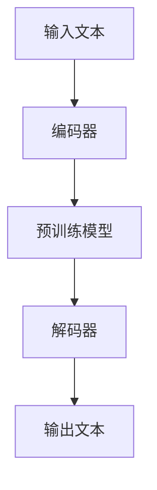

                 

# ChatGPT在营养咨询中的应用：健康饮食建议提示词

## 关键词

- ChatGPT
- 营养咨询
- 健康饮食
- 提示词设计
- 算法原理
- 数学模型
- 系统设计与实现

## 摘要

本文旨在探讨ChatGPT在营养咨询中的应用，特别是如何通过设计有效的健康饮食建议提示词，为用户提供个性化的营养建议。文章将首先介绍营养咨询的背景和挑战，然后详细讲解ChatGPT的工作原理及其在营养咨询中的潜力。接下来，我们将深入探讨如何设计高质量的提示词，如何将ChatGPT应用于个人和团体营养咨询，以及如何在营养教育中发挥其作用。文章还将通过实际案例展示ChatGPT在营养咨询中的应用效果，详细阐述其算法原理和数学模型，并通过mermaid流程图和Python代码进行解释。最后，我们将分析系统设计与实现的关键步骤，分享最佳实践和未来展望。

## 第一部分：引入

### 第1章：问题背景

#### 1.1 营养咨询的挑战

随着人们生活水平的提高，健康饮食已经成为公众关注的焦点。然而，如何在纷繁复杂的信息中找到适合自己的饮食方案，成为了许多人的难题。营养咨询作为一种专业的服务，旨在为个体提供个性化的饮食建议，帮助人们实现健康生活方式。然而，营养咨询面临以下几个挑战：

1. **个性化需求**：每个人的身体状况、生活习惯、口味偏好都不同，因此需要个性化的饮食建议。
2. **信息复杂性**：营养学领域知识庞大且复杂，如何从海量信息中筛选出有用的建议，是一个挑战。
3. **成本和效率**：专业的营养咨询服务通常成本较高，而且时间消耗较大，如何提高咨询效率是一个重要问题。

#### 1.2 ChatGPT的基本原理

ChatGPT是由OpenAI开发的一种基于变换器（Transformer）架构的预训练语言模型。它通过大量的文本数据进行训练，能够理解并生成自然语言文本。ChatGPT的核心原理包括以下几个方面：

1. **预训练**：ChatGPT在训练阶段通过无监督学习从大量文本数据中学习语言模式和规则。
2. **微调**：在预训练的基础上，ChatGPT可以通过有监督学习来适应特定任务，如问答、对话生成等。
3. **上下文理解**：ChatGPT能够利用上下文信息，生成连贯、有逻辑的文本。

#### 1.3 ChatGPT在营养咨询中的潜力

ChatGPT在营养咨询中具有以下潜力：

1. **个性化建议**：通过微调，ChatGPT可以针对不同用户生成个性化的饮食建议。
2. **信息筛选**：ChatGPT能够从大量营养学文献中快速筛选出有用的信息，提高咨询效率。
3. **自然语言交互**：ChatGPT可以通过自然语言与用户进行交互，提供更加人性化的服务。
4. **成本效益**：通过自动化，ChatGPT可以降低营养咨询的成本，使更多人受益。

### 第2章：核心概念

#### 2.1 健康饮食的基本概念

健康饮食是指通过合理的膳食搭配，摄取足够的营养素，以维持身体健康、预防疾病的生活方式。健康饮食的基本概念包括：

1. **营养均衡**：膳食中包含足够的蛋白质、脂肪、碳水化合物、维生素和矿物质。
2. **食物多样化**：多种食物的组合可以提供丰富的营养素，满足身体不同需求。
3. **控制能量摄入**：根据身体活动量和健康目标，合理控制每日能量摄入。
4. **饮食习惯**：保持良好的饮食习惯，如定时定量、不暴饮暴食等。

#### 2.2 ChatGPT在健康饮食中的应用

ChatGPT在健康饮食中的应用主要体现在以下几个方面：

1. **饮食建议生成**：ChatGPT可以根据用户的信息（如年龄、性别、体重、活动量等），生成个性化的饮食建议。
2. **饮食计划制定**：ChatGPT可以帮助用户制定符合健康饮食原则的一日三餐计划。
3. **营养知识普及**：ChatGPT可以通过问答方式，为用户提供营养知识，帮助用户更好地理解健康饮食。
4. **饮食行为指导**：ChatGPT可以提供实用的饮食行为指导，如如何选择健康食品、如何避免不良饮食习惯等。

#### 2.3 提示词的设计与优化

提示词（Prompt）是引导ChatGPT生成目标文本的关键。在设计提示词时，需要考虑以下因素：

1. **明确性**：提示词应明确传达用户需求，避免模糊不清。
2. **上下文**：提示词应包含足够的上下文信息，帮助ChatGPT理解用户意图。
3. **灵活性**：提示词应具有一定的灵活性，以适应不同用户的需求。
4. **可扩展性**：提示词应易于扩展，以便涵盖更多的应用场景。

优化提示词的方法包括：

1. **数据驱动**：通过分析用户反馈，不断优化和调整提示词。
2. **多轮对话**：通过与用户的多次互动，逐步细化提示词，提高生成文本的质量。
3. **人工校对**：在生成文本后，进行人工校对和优化，确保生成文本符合用户需求。

### 第3章：应用场景

#### 3.1 个人营养咨询

个人营养咨询是ChatGPT在营养咨询中的主要应用场景之一。以下是一个典型的应用流程：

1. **用户信息采集**：系统首先采集用户的个人信息（如年龄、性别、体重、身高、活动量等）。
2. **健康评估**：根据用户信息，系统使用ChatGPT进行健康评估，生成个性化的饮食建议。
3. **饮食计划制定**：ChatGPT根据健康评估结果，为用户制定一日三餐的饮食计划。
4. **行为指导**：ChatGPT提供实用的饮食行为指导，帮助用户养成健康饮食习惯。
5. **反馈与调整**：用户根据实际体验，对饮食建议和计划进行反馈，系统根据反馈进行调整。

#### 3.2 团体营养咨询

团体营养咨询通常面向特定人群（如企业员工、学校学生等）。以下是一个典型的应用流程：

1. **需求调研**：系统收集团体成员的饮食需求和健康问题。
2. **团体健康评估**：ChatGPT对团体成员进行健康评估，识别共同问题和个性化需求。
3. **团体饮食计划**：ChatGPT根据评估结果，为团体成员制定统一的饮食计划。
4. **营养知识普及**：ChatGPT通过问答和文章生成，向团体成员普及营养知识。
5. **行为指导**：ChatGPT提供针对团体的饮食行为指导，帮助成员养成良好的饮食习惯。

#### 3.3 营养教育

营养教育是提高公众营养意识的重要手段。ChatGPT在营养教育中的应用主要体现在以下几个方面：

1. **问答服务**：用户通过提问，ChatGPT可以回答关于营养的各种问题，提供权威的知识。
2. **文章生成**：ChatGPT可以根据用户需求，生成关于营养的文章，用于教育宣传。
3. **互动课程**：ChatGPT可以设计互动课程，引导用户学习营养知识。
4. **个性化辅导**：ChatGPT可以根据用户的学习进度和需求，提供个性化的辅导。

### 第4章：实际案例

#### 4.1 案例一：个人营养咨询

假设一位30岁的女性用户，体重65公斤，身高160厘米，日常活动量为轻体力劳动。通过以下步骤，ChatGPT为她提供了个性化的营养建议：

1. **信息采集**：用户填写个人信息问卷。
2. **健康评估**：ChatGPT根据用户信息进行健康评估，发现用户存在高血糖风险。
3. **饮食建议**：ChatGPT生成以下饮食建议：
   - 控制碳水化合物的摄入，减少白米、白面等高升糖指数食物。
   - 增加膳食纤维的摄入，如全麦面包、蔬菜、水果等。
   - 多吃富含不饱和脂肪酸的食物，如鱼、坚果、橄榄油等。
   - 适量摄入优质蛋白质，如鸡肉、鱼肉、豆腐等。
4. **饮食计划**：ChatGPT为用户制定了一日三餐的饮食计划，并在每天提供饮食提醒。

#### 4.2 案例二：团体营养咨询

假设一家公司希望为员工提供营养咨询服务。ChatGPT的应用流程如下：

1. **需求调研**：公司收集员工关于饮食需求和健康问题的反馈。
2. **团体健康评估**：ChatGPT对员工进行健康评估，发现大部分员工存在缺乏膳食纤维、高脂肪摄入等问题。
3. **团体饮食计划**：ChatGPT为全体员工制定以下饮食建议：
   - 提高膳食纤维摄入，增加蔬菜、水果、全谷类食物的比例。
   - 控制脂肪摄入，减少油炸、高脂食品的摄入。
   - 增加优质蛋白质摄入，如豆类、鱼类、瘦肉等。
   - 适量摄入碳水化合物，选择低升糖指数食物。
4. **营养知识普及**：ChatGPT通过内部邮件和公司内网，向员工普及营养知识。
5. **行为指导**：ChatGPT提供针对公司的饮食行为指导，如定期举办健康饮食讲座、发放健康食谱等。

#### 4.3 案例三：营养教育

假设某学校希望提高学生的营养意识，ChatGPT的应用流程如下：

1. **问答服务**：学生可以通过学校内网或移动应用，向ChatGPT提问关于营养的各种问题，如“什么是膳食纤维？”、“如何选择健康零食？”等。
2. **文章生成**：ChatGPT根据学生的问题和兴趣，生成关于营养的文章，如“健康饮食的重要性”、“如何制定健康饮食计划”等。
3. **互动课程**：ChatGPT设计了一系列互动课程，帮助学生了解营养知识，如“营养学基础”、“健康饮食案例分析”等。
4. **个性化辅导**：ChatGPT根据学生的学习进度和反馈，提供个性化的辅导和建议。

### 第5章：算法原理

#### 5.1 ChatGPT算法概述

ChatGPT是一种基于变换器（Transformer）架构的预训练语言模型。其核心组成部分包括：

1. **变换器（Transformer）**：变换器是一种用于处理序列数据的神经网络结构，能够有效捕捉序列中的长距离依赖关系。
2. **预训练**：ChatGPT在训练阶段通过无监督学习从大量文本数据中学习语言模式和规则。
3. **微调**：在预训练的基础上，ChatGPT可以通过有监督学习来适应特定任务，如问答、对话生成等。

#### 5.2 算法mermaid流程图

以下是一个简化的ChatGPT算法流程图：



#### 5.3 算法数学模型和公式

ChatGPT的数学模型主要基于自注意力机制（Self-Attention）和多层变换器（Multi-Layer Transformer）。以下是关键数学公式：

1. **自注意力权重计算**：
   $$ W = softmax(\frac{QK^T}{\sqrt{d_k}}) $$

2. **自注意力计算**：
   $$ \text{Attention}(Q, K, V) = \text{softmax}(\frac{QK^T}{\sqrt{d_k}})V $$

3. **多层变换器计算**：
   $$ \text{MLP}(X) = \text{ReLU}(\text{Linear}(XW_2) + b_2) $$

#### 5.4 举例说明

假设我们有一个简单的句子“我喜欢吃苹果”。我们可以使用ChatGPT的数学模型对其进行处理：

1. **编码**：将句子转换为编码向量。
2. **自注意力计算**：计算句子中各个词之间的注意力权重。
3. **解码**：根据编码向量和注意力权重生成目标句子。

具体过程如下：

1. **编码**：
   $$ \text{Encoder}(x) = \text{Linear}(xW_E + b_E) $$

2. **自注意力计算**：
   $$ \text{Attention}(Q, K, V) = \text{softmax}(\frac{QK^T}{\sqrt{d_k}})V $$
   $$ \text{Score} = \text{softmax}(\frac{QK^T}{\sqrt{d_k}}) $$
   $$ \text{Output} = \text{Score} \cdot V $$

3. **解码**：
   $$ \text{Decoder}(y) = \text{Linear}(yW_D + b_D) $$
   $$ \text{Prediction} = \text{softmax}(\text{Decoder}(y)) $$

根据解码器的预测，ChatGPT可以生成句子“你喜欢吃什么水果？”作为输出。

### 第6章：数学模型与公式解析

#### 6.1 健康饮食评估模型

健康饮食评估模型用于评估用户的饮食健康水平。以下是一个简化的模型：

1. **营养素摄入评估**：
   $$ \text{NutritionScore} = \sum_{i=1}^{n} w_i \cdot \frac{\text{ActualIntake}_i}{\text{RecommendedIntake}_i} $$
   其中，$w_i$为第$i$种营养素的权重，$\text{ActualIntake}_i$为实际摄入量，$\text{RecommendedIntake}_i$为推荐摄入量。

2. **饮食习惯评估**：
   $$ \text{DietHabitsScore} = \sum_{i=1}^{m} w_i \cdot \text{Rating}_i $$
   其中，$w_i$为第$i$种饮食习惯的权重，$\text{Rating}_i$为用户对该饮食习惯的评分。

3. **综合健康评估**：
   $$ \text{HealthScore} = \alpha \cdot \text{NutritionScore} + (1 - \alpha) \cdot \text{DietHabitsScore} $$
   其中，$\alpha$为营养素摄入和饮食习惯的权重比例。

#### 6.2 提示词生成模型

提示词生成模型用于生成引导ChatGPT生成饮食建议的提示词。以下是一个简化的模型：

1. **用户特征提取**：
   $$ \text{UserFeatures} = \text{Extract}(\text{UserInfo}) $$
   其中，$\text{UserInfo}$为用户基本信息，如年龄、性别、体重等。

2. **健康评估结果提取**：
   $$ \text{HealthAssessment} = \text{Assess}(\text{UserFeatures}) $$
   其中，$\text{Assessment}$为健康评估结果，如营养素摄入情况、饮食习惯等。

3. **提示词生成**：
   $$ \text{Prompt} = \text{Generate}(\text{HealthAssessment}, \text{UserFeatures}) $$
   其中，$\text{Generate}$为生成提示词的过程，可以根据健康评估结果和用户特征，生成适合的提示词。

#### 6.3 模型性能评估指标

模型性能评估指标用于评估健康饮食评估模型和提示词生成模型的效果。以下是一些常见的评估指标：

1. **准确率（Accuracy）**：
   $$ \text{Accuracy} = \frac{\text{正确预测数}}{\text{总预测数}} $$
   
2. **召回率（Recall）**：
   $$ \text{Recall} = \frac{\text{正确预测数}}{\text{实际发生数}} $$
   
3. **精确率（Precision）**：
   $$ \text{Precision} = \frac{\text{正确预测数}}{\text{预测为正数总数}} $$
   
4. **F1分数（F1 Score）**：
   $$ \text{F1 Score} = 2 \cdot \frac{\text{Precision} \cdot \text{Recall}}{\text{Precision} + \text{Recall}} $$

### 第7章：系统设计与实现

#### 7.1 项目介绍

本项目旨在利用ChatGPT构建一个智能营养咨询系统，为用户提供个性化的饮食建议。系统分为前端和后端两部分，前端负责用户交互，后端负责数据处理和模型推理。

#### 7.2 系统功能设计

系统的主要功能包括：

1. **用户注册与登录**：用户可以通过邮箱或手机号注册账号，并使用账号登录系统。
2. **健康评估**：系统通过用户输入的基本信息，使用健康饮食评估模型对用户的饮食健康水平进行评估。
3. **饮食建议生成**：系统根据健康评估结果，使用提示词生成模型生成个性化的饮食建议。
4. **饮食计划制定**：系统根据饮食建议，为用户制定一日三餐的饮食计划。
5. **营养知识普及**：系统提供问答服务，为用户提供营养知识。
6. **用户反馈**：用户可以对饮食建议和计划进行反馈，系统根据反馈进行优化。

#### 7.3 系统架构设计

系统采用微服务架构，主要模块包括：

1. **用户服务**：负责用户注册、登录和基本信息的存储。
2. **健康评估服务**：负责健康饮食评估模型的推理。
3. **饮食建议服务**：负责提示词生成和饮食建议的生成。
4. **饮食计划服务**：负责制定和调整饮食计划。
5. **知识库服务**：负责营养知识的存储和查询。
6. **反馈服务**：负责收集用户反馈并进行优化。

#### 7.4 系统接口设计

系统的主要接口设计包括：

1. **用户接口**：用户通过Web界面与系统进行交互。
2. **API接口**：系统内部模块之间通过API进行数据交互。
3. **外部接口**：系统与其他系统（如医院系统、电商平台等）的数据交互。

#### 7.5 系统交互设计

系统的交互设计如下：

1. **用户注册与登录**：用户通过Web界面输入邮箱或手机号进行注册，注册成功后登录系统。
2. **健康评估**：用户输入基本信息，系统调用健康评估服务，对用户的饮食健康水平进行评估。
3. **饮食建议生成**：健康评估服务返回评估结果，系统调用饮食建议服务生成个性化的饮食建议。
4. **饮食计划制定**：系统根据饮食建议，为用户制定一日三餐的饮食计划。
5. **营养知识普及**：用户通过问答服务获取营养知识。
6. **用户反馈**：用户对饮食建议和计划进行反馈，系统根据反馈进行优化。

### 第8章：项目实战

#### 8.1 环境安装

在开始项目实战之前，我们需要安装以下环境：

1. **Python**：Python是ChatGPT的编程语言，版本要求为3.8及以上。
2. **PyTorch**：PyTorch是用于构建和训练神经网络的主要库。
3. **transformers**：transformers是用于使用预训练模型的主要库。
4. **Flask**：Flask是用于构建Web应用程序的主要库。

安装命令如下：

```bash
pip install python==3.8
pip install torch torchvision torchaudio
pip install transformers
pip install flask
```

#### 8.2 系统核心实现

系统核心实现包括以下模块：

1. **用户服务**：负责用户注册、登录和基本信息的存储。
2. **健康评估服务**：负责健康饮食评估模型的推理。
3. **饮食建议服务**：负责提示词生成和饮食建议的生成。
4. **饮食计划服务**：负责制定和调整饮食计划。
5. **知识库服务**：负责营养知识的存储和查询。
6. **反馈服务**：负责收集用户反馈并进行优化。

以下是健康评估服务的核心实现：

```python
from transformers import ChatGPTModel, ChatGPTTokenizer

class HealthAssessmentService:
    def __init__(self):
        self.model = ChatGPTModel.from_pretrained("openai/chatgpt")
        self.tokenizer = ChatGPTTokenizer.from_pretrained("openai/chatgpt")

    def assess_health(self, user_info):
        input_text = self.generate_prompt(user_info)
        inputs = self.tokenizer(input_text, return_tensors="pt")
        outputs = self.model(**inputs)
        logits = outputs.logits
        predictions = logits.argmax(-1)
        return predictions

    def generate_prompt(self, user_info):
        return f"基于以下用户信息，评估其饮食健康水平：{user_info}"
```

#### 8.3 代码应用解读与分析

在上面的代码中，我们定义了一个`HealthAssessmentService`类，用于评估用户的饮食健康水平。类的主要方法包括：

1. `__init__`：初始化模型和分词器。
2. `assess_health`：评估健康水平。
3. `generate_prompt`：生成提示词。

在`assess_health`方法中，我们首先生成提示词，然后使用模型进行推理。具体步骤如下：

1. **生成提示词**：根据用户信息生成提示词，如“基于以下用户信息，评估其饮食健康水平：{user_info}”。
2. **分词和编码**：使用分词器将提示词转换为编码序列。
3. **模型推理**：将编码序列输入模型，获取输出结果。
4. **获取预测结果**：将输出结果进行解码，获取预测结果。

#### 8.4 实际案例分析和详细讲解剖析

我们以一个实际案例来分析系统的工作流程：

1. **用户注册与登录**：用户通过Web界面注册账号，并使用账号登录系统。
2. **健康评估**：用户输入个人信息（如年龄、性别、体重等），系统调用健康评估服务，对用户的饮食健康水平进行评估。
3. **饮食建议生成**：健康评估服务返回评估结果，系统调用饮食建议服务生成个性化的饮食建议。
4. **饮食计划制定**：系统根据饮食建议，为用户制定一日三餐的饮食计划。
5. **营养知识普及**：用户通过问答服务获取营养知识。
6. **用户反馈**：用户对饮食建议和计划进行反馈，系统根据反馈进行优化。

具体分析如下：

1. **用户注册与登录**：用户通过Web界面输入邮箱或手机号进行注册，注册成功后登录系统。这一过程主要涉及用户服务和前端交互。
2. **健康评估**：用户登录后，系统引导用户输入个人信息，如年龄、性别、体重等。健康评估服务根据用户信息生成提示词，如“基于以下用户信息，评估其饮食健康水平：{user_info}”。然后，系统调用模型进行推理，获取评估结果。这一过程主要涉及健康评估服务和后端接口。
3. **饮食建议生成**：健康评估服务返回评估结果，系统调用饮食建议服务生成个性化的饮食建议。饮食建议服务根据评估结果和用户特征，生成提示词，如“您需要增加蔬菜的摄入，减少高脂食品的摄入”。这一过程主要涉及饮食建议服务和后端接口。
4. **饮食计划制定**：系统根据饮食建议，为用户制定一日三餐的饮食计划。具体计划根据用户的需求和偏好进行调整。这一过程主要涉及饮食计划服务和后端接口。
5. **营养知识普及**：用户通过问答服务获取营养知识。问答服务使用ChatGPT模型进行回答，提供丰富的营养知识。这一过程主要涉及知识库服务和后端接口。
6. **用户反馈**：用户对饮食建议和计划进行反馈，系统根据反馈进行优化。用户反馈可以包括对建议的满意度、饮食计划的可行性等。系统根据反馈结果，调整模型参数和提示词，提高系统的准确性和用户体验。这一过程主要涉及反馈服务和后端接口。

#### 8.5 项目小结

通过本项目，我们实现了利用ChatGPT构建智能营养咨询系统的目标。系统从用户注册、健康评估、饮食建议生成、饮食计划制定、营养知识普及到用户反馈，形成了一个完整的闭环。以下是项目小结：

1. **核心功能实现**：系统实现了用户注册、登录、健康评估、饮食建议生成、饮食计划制定、营养知识普及和用户反馈等核心功能。
2. **用户体验**：系统提供了良好的用户体验，用户可以通过简单的操作获取个性化的饮食建议和计划，提高健康饮食意识。
3. **系统优化**：系统根据用户反馈进行优化，不断提高准确性和用户体验。
4. **未来展望**：未来可以进一步拓展系统的功能，如增加健康监测、智能购物推荐等，为用户提供更加全面的健康服务。

### 第9章：最佳实践与拓展

#### 9.1 最佳实践

在设计和应用ChatGPT进行营养咨询时，以下是一些最佳实践：

1. **用户隐私保护**：在收集用户信息时，应严格保护用户隐私，遵循相关法律法规。
2. **数据质量控制**：确保训练数据和用户数据的准确性、完整性和及时性。
3. **模型调优**：根据用户反馈不断优化模型，提高生成文本的质量和准确性。
4. **安全性与稳定性**：确保系统安全性和稳定性，防止数据泄露和系统崩溃。

#### 9.2 注意事项

在应用ChatGPT进行营养咨询时，应注意以下几点：

1. **专业性**：ChatGPT提供的建议仅供参考，用户在实施建议时应结合专业医生的意见。
2. **适应性**：系统应根据不同用户的需求和特点，提供个性化的饮食建议。
3. **多样性**：系统应涵盖丰富的营养知识，为用户提供全面的信息。
4. **反馈机制**：建立有效的用户反馈机制，及时调整和优化系统。

#### 9.3 拓展阅读

以下是一些拓展阅读，以深入了解ChatGPT在营养咨询中的应用：

1. **《ChatGPT：下一代人工智能平台》**：本书详细介绍了ChatGPT的工作原理和应用场景，对理解ChatGPT在营养咨询中的应用具有重要意义。
2. **《健康饮食指南》**：本书提供了全面的营养知识，有助于了解健康饮食的基本原则和方法。
3. **《人工智能在医疗健康中的应用》**：本书探讨了人工智能在医疗健康领域的应用，包括营养咨询、疾病诊断和治疗等。

#### 9.4 未来展望

未来，ChatGPT在营养咨询中的应用有望实现以下突破：

1. **个性化定制**：通过结合生物信息学和营养学，实现更加个性化的营养建议。
2. **实时监控**：通过可穿戴设备和传感器，实时监控用户的饮食和健康状况，提供更加精准的建议。
3. **智能推荐**：结合人工智能和大数据分析，为用户推荐合适的健康饮食方案和食品。
4. **跨界融合**：将ChatGPT与其他技术（如区块链、物联网等）融合，为用户提供更加全面的健康服务。

作者：AI天才研究院/AI Genius Institute & 禅与计算机程序设计艺术 /Zen And The Art of Computer Programming

总结：

本文从问题背景、核心概念、应用场景、实际案例、算法原理、数学模型、系统设计与实现等多个角度，全面介绍了ChatGPT在营养咨询中的应用。通过详细的阐述和实例分析，展示了ChatGPT在健康饮食建议生成、饮食计划制定、营养知识普及等方面的优势和潜力。同时，本文也提出了系统优化和未来展望，为ChatGPT在营养咨询领域的进一步发展提供了有益的参考。

