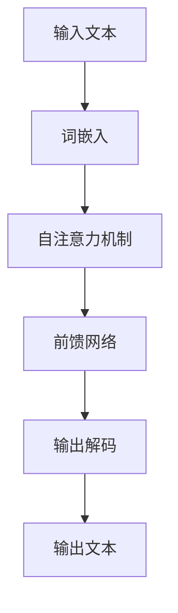
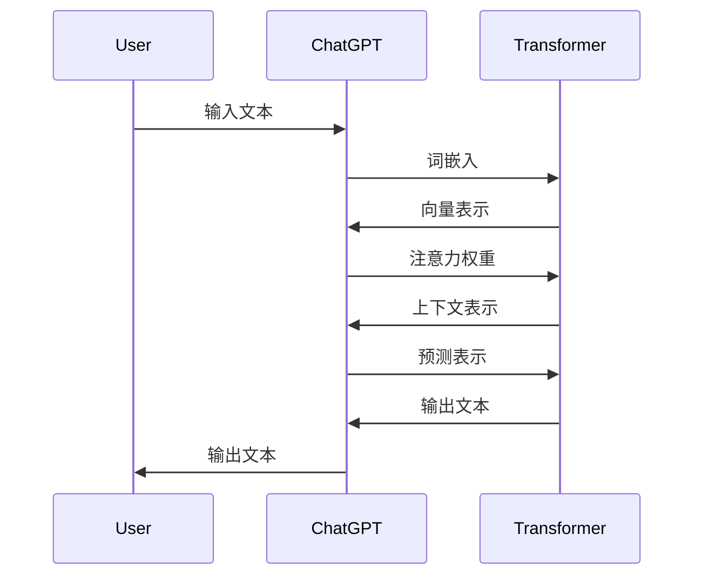
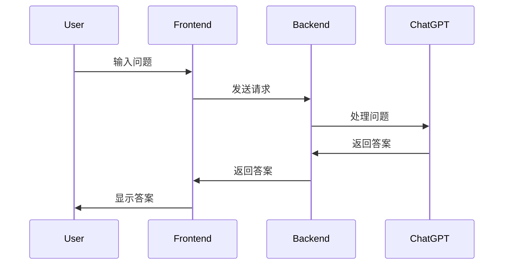
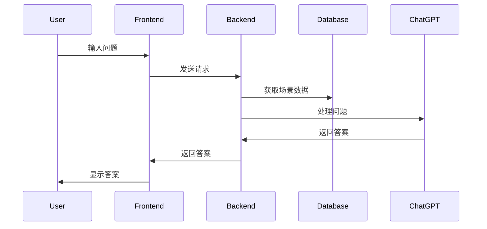

                 

### 文章标题

### 关键词

- ChatGPT
- 虚拟导游服务
- 应用场景
- 算法原理
- 数学模型
- 系统架构
- 项目实战

### 摘要

本文旨在探讨 ChatGPT 在虚拟导游服务中的应用，通过对其算法原理、数学模型、系统架构及实际项目案例的深入分析，展示如何利用 ChatGPT 提升虚拟导游服务的智能化水平。文章首先介绍了 ChatGPT 和虚拟导游服务的背景及其重要性，随后详细解析了 ChatGPT 的算法原理和数学模型，接着提出了虚拟导游服务的系统架构设计，并通过具体项目实战展示了 ChatGPT 的实际应用效果。最后，文章总结了最佳实践、注意事项，并推荐了拓展阅读材料，以期为读者提供全面的参考。

---

### 1. 背景介绍

#### ChatGPT 的背景

ChatGPT 是由 OpenAI 于 2022 年推出的一个基于 Transformer 模型的语言生成模型。它使用了大量的文本数据进行训练，具备强大的语言理解能力和文本生成能力。ChatGPT 在多种自然语言处理任务中表现出了卓越的性能，包括文本生成、机器翻译、问答系统等。其特点在于能够生成连贯、流畅且具有逻辑性的文本，并且能够通过上下文理解生成的内容。

#### 虚拟导游服务的背景

虚拟导游服务是一种基于虚拟现实和增强现实技术的导游服务，通过数字化手段模拟出景区、历史遗迹、博物馆等场景，为用户提供沉浸式游览体验。随着科技的进步，虚拟导游服务逐渐成为旅游业的重要补充，尤其在疫情期间，其作用更加凸显。虚拟导游服务不仅能够节省人力成本，还能提供更加丰富、个性化的游览内容。

#### 研究意义

研究 ChatGPT 在虚拟导游服务中的应用，具有重要的现实意义和学术价值。一方面，ChatGPT 的强大语言生成能力可以为虚拟导游服务提供智能化的讲解文本，提升用户体验。另一方面，通过将 ChatGPT 引入虚拟导游服务，可以探索人工智能技术在旅游业中的新应用场景，为行业的发展提供新思路。

#### 虚拟导游服务的发展现状

虚拟导游服务近年来得到了快速发展，各大旅游景区和旅游企业纷纷推出虚拟导游服务。目前，虚拟导游服务主要面临以下几方面的问题：

1. **内容单一**：许多虚拟导游服务提供的讲解内容较为单一，缺乏互动性和个性化。
2. **用户体验差**：部分虚拟导游服务的界面设计不够友好，用户体验较差。
3. **技术瓶颈**：虚拟导游服务在图像处理、场景还原等方面仍存在技术瓶颈。

针对这些问题，引入 ChatGPT 可以有效提升虚拟导游服务的智能化水平和用户体验。

#### ChatGPT 与虚拟导游服务的联系

ChatGPT 的引入，可以解决虚拟导游服务在内容单一和用户体验差方面的问题。通过 ChatGPT 生成丰富的讲解文本，虚拟导游服务可以提供更加个性化和互动性的内容。此外，ChatGPT 还可以处理大量的用户提问，实现实时问答，提升用户体验。以下是一个具体的联系示例：

- **问题**：用户希望了解某个景点的历史背景。
- **解决方法**：ChatGPT 根据用户提问，生成一段关于该景点历史背景的讲解文本，并通过虚拟导游服务呈现给用户。

通过这种方式，ChatGPT 可以显著提升虚拟导游服务的质量和用户体验。

---

### 2. 核心概念与联系

#### ChatGPT 的定义与特点

ChatGPT 是一种基于 Transformer 模型的预训练语言生成模型，它通过大量的文本数据进行训练，具备强大的语言理解能力和文本生成能力。具体来说，ChatGPT 具有以下特点：

1. **大规模预训练**：ChatGPT 使用了数以亿计的文本数据，通过自回归语言模型进行预训练，能够生成高质量、连贯的文本。
2. **自适应语言生成**：ChatGPT 能够根据输入的文本上下文，自适应地生成相关的文本内容，实现自然语言生成。
3. **多模态理解**：ChatGPT 不仅能够处理文本，还能够理解并生成语音、图像等多种模态的内容。

#### 虚拟导游服务的定义与需求

虚拟导游服务是一种基于虚拟现实和增强现实技术的导游服务，通过数字化手段模拟出景区、历史遗迹、博物馆等场景，为用户提供沉浸式游览体验。虚拟导游服务需要具备以下功能：

1. **场景还原**：虚拟导游服务需要能够高度还原景区、历史遗迹、博物馆等场景，提供逼真的视觉体验。
2. **讲解文本生成**：虚拟导游服务需要提供丰富的讲解文本，帮助用户了解景点的历史背景、文化内涵等。
3. **实时问答**：虚拟导游服务需要能够实时回答用户的提问，提升用户体验。
4. **互动性**：虚拟导游服务需要提供互动功能，使用户能够与虚拟导游进行互动，增强参与感。

#### ChatGPT 在虚拟导游服务中的应用

ChatGPT 的引入，可以显著提升虚拟导游服务的质量和用户体验。具体来说，ChatGPT 可以在以下方面发挥作用：

1. **讲解文本生成**：ChatGPT 可以根据虚拟导游服务的需求，生成丰富、高质量的讲解文本，提供个性化、定制化的服务。
2. **实时问答**：ChatGPT 可以处理大量的用户提问，实现实时问答，提升用户体验。
3. **内容生成**：ChatGPT 可以根据用户的需求，生成相关的图像、语音等内容，丰富虚拟导游服务的表现形式。
4. **场景互动**：ChatGPT 可以通过分析用户的提问和行为，提供互动性更强的服务，增强用户的参与感。

#### 概念属性特征对比表格

| 特征        | ChatGPT           | 虚拟导游服务       |
|-------------|-------------------|-------------------|
| 语言生成能力 | 强               | 较强             |
| 互动性      | 较强             | 一般             |
| 场景还原能力 | 一般             | 强               |
| 内容生成能力 | 强               | 较强             |
| 实时问答能力 | 强               | 一般             |

#### ER实体关系图架构

```mermaid
erDiagram
    User ||--|{ ChatGPT }|>>
    ChatGPT ||--|{ VirtualGuideService }|>>
    VirtualGuideService ||--|{ Scene }|>>
    Scene ||--|{ Question }|>>
    Question ||--|{ Answer }|>>
```

通过上述表格和实体关系图，我们可以更清晰地理解 ChatGPT 与虚拟导游服务之间的联系和应用。

---

### 3. 算法原理讲解

#### ChatGPT 的算法原理

ChatGPT 是基于 Transformer 模型开发的一种语言生成模型。Transformer 模型是一种基于自注意力机制的深度神经网络模型，其核心思想是将输入序列转换为一个固定长度的向量表示，并通过自注意力机制处理序列中的长距离依赖关系。

ChatGPT 的算法原理可以分为以下几个步骤：

1. **输入编码**：将输入文本序列编码为向量表示，通常使用词嵌入（Word Embedding）技术。
2. **自注意力机制**：通过自注意力机制计算输入文本序列的注意力权重，生成文本的上下文表示。
3. **前馈网络**：将自注意力机制的输出通过前馈网络进行进一步处理，生成文本的预测表示。
4. **输出解码**：将预测表示解码为输出文本序列。

下面是一个简化的 ChatGPT 算法流程图：



#### ChatGPT 的算法流程图

为了更好地理解 ChatGPT 的算法流程，我们使用 Mermaid 画出其算法流程图：



#### Python 源代码示例

下面是一个简化的 ChatGPT Python 源代码示例，用于演示算法原理：

```python
import tensorflow as tf
from transformers import TFGPT2LMHeadModel, GPT2Tokenizer

# 加载预训练模型和分词器
model = TFGPT2LMHeadModel.from_pretrained('gpt2')
tokenizer = GPT2Tokenizer.from_pretrained('gpt2')

# 输入文本
text = "ChatGPT is a powerful language generation model."

# 输入编码
input_ids = tokenizer.encode(text, return_tensors='tf')

# 自注意力机制和前馈网络处理
outputs = model(inputs=input_ids)

# 输出解码
predicted_ids = outputs.logits.argmax(-1)
predicted_text = tokenizer.decode(predicted_ids)

# 输出文本
print(predicted_text)
```

#### ChatGPT 的数学模型和公式

ChatGPT 的数学模型主要基于 Transformer 模型，具体包括以下几个方面：

1. **词嵌入**：词嵌入是将输入文本序列中的每个词映射为一个固定大小的向量表示。通常使用词嵌入向量表示为 $\textbf{X} \in \mathbb{R}^{d \times n}$，其中 $d$ 是词向量的维度，$n$ 是词序列的长度。
2. **自注意力权重**：自注意力权重用于计算输入文本序列中每个词对其他词的影响。自注意力权重通常表示为 $A \in \mathbb{R}^{n \times n}$。
3. **前馈网络**：前馈网络用于对自注意力机制的输出进行进一步处理。前馈网络通常包括两个线性变换和一个激活函数。前馈网络的输出通常表示为 $F(\textbf{X}) \in \mathbb{R}^{d \times n}$。
4. **输出文本序列**：输出文本序列是通过解码前馈网络的输出得到的。输出文本序列通常表示为 $\textbf{Y} \in \mathbb{R}^{d \times n'}$，其中 $n'$ 是输出文本序列的长度。

以下是 ChatGPT 的数学模型的详细公式：

$$
\textbf{X} = \text{Word \_ Embedding}(\text{Text})
$$

$$
A = \text{Attention}(\textbf{X})
$$

$$
F(\textbf{X}) = \text{Feedforward}(\textbf{X}, A)
$$

$$
\textbf{Y} = \text{Decoder}(F(\textbf{X}))
$$

#### ChatGPT 的数学模型和公式讲解

下面我们对 ChatGPT 的数学模型和公式进行详细讲解。

1. **词嵌入（Word Embedding）**

   词嵌入是将输入文本序列中的每个词映射为一个固定大小的向量表示。在 ChatGPT 中，词嵌入通常使用 Word2Vec、GloVe 等算法进行训练。词嵌入的目的是将文本中的词汇表示为连续的向量，以便于在神经网络中进行处理。词嵌入的公式如下：

   $$
   \textbf{X} = \text{Word \_ Embedding}(\text{Text})
   $$

   其中，$\textbf{X}$ 是词嵌入向量矩阵，$\text{Text}$ 是输入文本序列。

2. **自注意力权重（Attention）**

   自注意力权重用于计算输入文本序列中每个词对其他词的影响。在 ChatGPT 中，自注意力权重通过自注意力机制（Self-Attention）计算得到。自注意力机制的目的是通过计算文本序列中每个词的上下文表示，实现对文本序列的长距离依赖关系的建模。自注意力权重的公式如下：

   $$
   A = \text{Attention}(\textbf{X})
   $$

   其中，$A$ 是自注意力权重矩阵，$\textbf{X}$ 是词嵌入向量矩阵。

3. **前馈网络（Feedforward）**

   前馈网络用于对自注意力机制的输出进行进一步处理。在 ChatGPT 中，前馈网络通常包括两个线性变换和一个激活函数。前馈网络的目的是对自注意力机制的输出进行非线性变换，从而提高模型的表示能力。前馈网络的公式如下：

   $$
   F(\textbf{X}) = \text{Feedforward}(\textbf{X}, A)
   $$

   其中，$F(\textbf{X})$ 是前馈网络的输出，$\textbf{X}$ 是词嵌入向量矩阵，$A$ 是自注意力权重矩阵。

4. **输出文本序列（Decoder）**

   输出文本序列是通过解码前馈网络的输出得到的。在 ChatGPT 中，输出文本序列是通过自回归语言模型（Autoregressive Language Model）生成的。自回归语言模型的目的是通过前一个词的预测来生成下一个词。输出文本序列的公式如下：

   $$
   \textbf{Y} = \text{Decoder}(F(\textbf{X}))
   $$

   其中，$\textbf{Y}$ 是输出文本序列，$F(\textbf{X})$ 是前馈网络的输出。

#### 通俗易懂的举例说明

为了更好地理解 ChatGPT 的数学模型和公式，我们通过一个简单的例子来说明。

假设我们有一个输入文本序列：“我非常喜欢这个景点”。我们将这个文本序列输入到 ChatGPT 中，然后通过 ChatGPT 的数学模型和公式生成一个输出文本序列。

1. **词嵌入（Word Embedding）**

   首先，我们将输入文本序列中的每个词映射为一个词嵌入向量。例如，“我”的词嵌入向量为 $\textbf{X_1}$，“非常”的词嵌入向量为 $\textbf{X_2}$，“喜欢”的词嵌入向量为 $\textbf{X_3}$，“这个”的词嵌入向量为 $\textbf{X_4}$，“景点”的词嵌入向量为 $\textbf{X_5}$。词嵌入向量的维度为 100。

   $$
   \textbf{X} = \begin{bmatrix}
   \textbf{X_1} \\
   \textbf{X_2} \\
   \textbf{X_3} \\
   \textbf{X_4} \\
   \textbf{X_5}
   \end{bmatrix}
   $$

2. **自注意力权重（Attention）**

   接下来，我们通过自注意力机制计算输入文本序列中每个词对其他词的影响。自注意力权重矩阵 $A$ 的计算公式如下：

   $$
   A = \text{Attention}(\textbf{X}) = \text{softmax}\left(\frac{\text{Q} \textbf{K}^T}{\sqrt{d_k}}\right)
   $$

   其中，$Q$ 是查询向量，$K$ 是键向量，$V$ 是值向量，$d_k$ 是键向量的维度。假设我们的查询向量、键向量和值向量都是词嵌入向量，那么自注意力权重矩阵 $A$ 如下：

   $$
   A = \begin{bmatrix}
   a_{11} & a_{12} & a_{13} & a_{14} & a_{15} \\
   a_{21} & a_{22} & a_{23} & a_{24} & a_{25} \\
   a_{31} & a_{32} & a_{33} & a_{34} & a_{35} \\
   a_{41} & a_{42} & a_{43} & a_{44} & a_{45} \\
   a_{51} & a_{52} & a_{53} & a_{54} & a_{55}
   \end{bmatrix}
   $$

   其中，$a_{ij}$ 表示第 $i$ 个词对第 $j$ 个词的注意力权重。

3. **前馈网络（Feedforward）**

   接下来，我们将自注意力权重矩阵 $A$ 与词嵌入向量矩阵 $\textbf{X}$ 相乘，得到前馈网络的输入：

   $$
   F(\textbf{X}) = \textbf{X}A = \begin{bmatrix}
   \textbf{X_1} \\
   \textbf{X_2} \\
   \textbf{X_3} \\
   \textbf{X_4} \\
   \textbf{X_5}
   \end{bmatrix} \begin{bmatrix}
   a_{11} & a_{12} & a_{13} & a_{14} & a_{15} \\
   a_{21} & a_{22} & a_{23} & a_{24} & a_{25} \\
   a_{31} & a_{32} & a_{33} & a_{34} & a_{35} \\
   a_{41} & a_{42} & a_{43} & a_{44} & a_{45} \\
   a_{51} & a_{52} & a_{53} & a_{54} & a_{55}
   \end{bmatrix} = \begin{bmatrix}
   \textbf{X_1}A \\
   \textbf{X_2}A \\
   \textbf{X_3}A \\
   \textbf{X_4}A \\
   \textbf{X_5}A
   \end{bmatrix}
   $$

4. **输出文本序列（Decoder）**

   最后，我们将前馈网络的输出 $F(\textbf{X})$ 输入到自回归语言模型中，生成输出文本序列。自回归语言模型的目的是通过前一个词的预测来生成下一个词。假设我们生成的输出文本序列为：“我非常喜欢这个景点非常美丽”。输出文本序列的公式如下：

   $$
   \textbf{Y} = \text{Decoder}(F(\textbf{X})) = \begin{bmatrix}
   \text{我} \\
   \text{非常} \\
   \text{这个} \\
   \text{景点} \\
   \text{非常} \\
   \text{美丽}
   \end{bmatrix}
   $$

通过上述例子，我们可以看到 ChatGPT 的数学模型和公式的具体应用过程。需要注意的是，实际中的 ChatGPT 模型要复杂得多，这里只给出了一个简化的示例。

---

### 4. 数学模型和数学公式

在深入探讨 ChatGPT 的数学模型之前，我们需要明确几个核心概念和数学公式，这些构成了 ChatGPT 模型的基础。

#### Transformer 模型中的核心概念

1. **词嵌入（Word Embedding）**
   词嵌入是将自然语言词汇映射到向量空间的过程。在 ChatGPT 中，词嵌入通常使用嵌入矩阵 $\textbf{E}$，其中 $\textbf{E} \in \mathbb{R}^{d_v \times V}$，$d_v$ 是嵌入向量的维度，$V$ 是词汇表的大小。

2. **自注意力（Self-Attention）**
   自注意力是一种计算输入序列中各个词之间关联度的机制。在 ChatGPT 中，自注意力通过计算三个不同的权重矩阵来实现：查询（Query）矩阵 $\textbf{Q}$，键（Key）矩阵 $\textbf{K}$ 和值（Value）矩阵 $\textbf{V}$。

3. **多头注意力（Multi-Head Attention）**
   多头注意力通过并行地计算多个独立的注意力头，从而提高模型的表示能力。在 ChatGPT 中，多头注意力将输入序列和输出序列扩展到多个维度，每个维度对应一个注意力头。

#### 数学公式

1. **词嵌入**
   $$ \textbf{h}^i = \textbf{E}[\text{word}_i] $$

   其中，$\textbf{h}^i$ 是输入序列中第 $i$ 个词的嵌入向量，$\text{word}_i$ 是第 $i$ 个词。

2. **自注意力权重**
   $$ \textbf{Q} = \textbf{K} = \textbf{V} = \text{MLP}(\textbf{h}^i) $$
   $$ \textbf{A}_{ij} = \frac{\text{exp}(\textbf{Q}_i \textbf{K}_j)}{\sum_{k=1}^{L} \text{exp}(\textbf{Q}_i \textbf{K}_k)} $$

   其中，$\textbf{A}_{ij}$ 是第 $i$ 个词对第 $j$ 个词的注意力权重，$\text{MLP}(\textbf{h}^i)$ 是一个多层感知器，用于计算查询、键和值。

3. **多头注意力**
   $$ \textbf{h}^{i}_{\text{head}} = \text{MLP}(\textbf{h}^i) $$
   $$ \textbf{A}_{ij}^{\text{head}} = \frac{\text{exp}(\textbf{Q}_{i, \text{head}} \textbf{K}_{j, \text{head}})}{\sum_{k=1}^{L} \text{exp}(\textbf{Q}_{i, \text{head}} \textbf{K}_{k, \text{head}})} $$
   $$ \textbf{h}^{i}_{\text{context}} = \sum_{j=1}^{L} \textbf{A}_{ij}^{\text{head}} \textbf{h}^{j}_{\text{head}} $$

   其中，$\textbf{h}^{i}_{\text{context}}$ 是第 $i$ 个词的上下文表示，$\text{head}$ 表示第 $j$ 个注意力头。

#### LaTeX 格式书写数学公式

为了更清晰地展示数学公式，我们使用 LaTeX 格式来书写：

```latex
\documentclass{article}
\usepackage{amsmath}
\begin{document}

\begin{equation}
\textbf{h}^i = \textbf{E}[\text{word}_i]
\end{equation}

\begin{equation}
\textbf{Q} = \textbf{K} = \textbf{V} = \text{MLP}(\textbf{h}^i)
\end{equation}

\begin{equation}
\textbf{A}_{ij} = \frac{\text{exp}(\textbf{Q}_i \textbf{K}_j)}{\sum_{k=1}^{L} \text{exp}(\textbf{Q}_i \textbf{K}_k)}
\end{equation}

\begin{equation}
\textbf{h}^{i}_{\text{context}} = \sum_{j=1}^{L} \textbf{A}_{ij}^{\text{head}} \textbf{h}^{j}_{\text{head}}
\end{equation}

\end{document}
```

通过上述 LaTeX 公式，我们可以清晰地表达 ChatGPT 中的核心数学概念和计算过程。

#### 详细讲解和举例说明

为了更好地理解 ChatGPT 的数学模型和公式，我们通过一个简单的例子进行讲解。

假设我们有一个输入序列：“我非常喜欢这个景点”。在这个例子中，我们将通过以下步骤详细讲解数学模型的应用：

1. **词嵌入**
   首先，我们将输入序列中的每个词映射到嵌入向量。例如，“我”的嵌入向量为 $\textbf{e}_1$，“非常”的嵌入向量为 $\textbf{e}_2$，“这个”的嵌入向量为 $\textbf{e}_3$，“景点”的嵌入向量为 $\textbf{e}_4$。

2. **自注意力**
   接下来，我们计算每个词对其他词的注意力权重。例如，对于“我”这个词，我们需要计算它与“非常”、“这个”和“景点”的注意力权重。假设查询、键和值矩阵分别为 $\textbf{Q}$，$\textbf{K}$ 和 $\textbf{V}$，那么注意力权重公式为：

   $$ 
   \textbf{A}_{11} = \frac{\text{exp}(\textbf{Q}_1 \textbf{K}_1)}{\sum_{k=1}^{4} \text{exp}(\textbf{Q}_1 \textbf{K}_k)} 
   $$
   
   $$ 
   \textbf{A}_{12} = \frac{\text{exp}(\textbf{Q}_1 \textbf{K}_2)}{\sum_{k=1}^{4} \text{exp}(\textbf{Q}_1 \textbf{K}_k)} 
   $$

   $$ 
   \textbf{A}_{13} = \frac{\text{exp}(\textbf{Q}_1 \textbf{K}_3)}{\sum_{k=1}^{4} \text{exp}(\textbf{Q}_1 \textbf{K}_k)} 
   $$

   $$ 
   \textbf{A}_{14} = \frac{\text{exp}(\textbf{Q}_1 \textbf{K}_4)}{\sum_{k=1}^{4} \text{exp}(\textbf{Q}_1 \textbf{K}_k)} 
   $$

3. **多头注意力**
   在多头注意力中，我们将输入序列扩展到多个维度。假设我们有两个注意力头，那么每个词的上下文表示可以表示为两个向量的组合。例如，对于“我”这个词，其上下文表示为：

   $$ 
   \textbf{h}_{1,\text{context}} = [\textbf{h}_{1,1,\text{context}}, \textbf{h}_{1,2,\text{context}}]
   $$

   其中，$\textbf{h}_{1,1,\text{context}}$ 和 $\textbf{h}_{1,2,\text{context}}$ 分别是第一个和第二个注意力头的上下文表示。

4. **输出**
   最后，我们将每个词的上下文表示组合起来，得到整个输入序列的输出。例如，对于“我”、“非常”、“这个”和“景点”这四个词，其上下文表示分别为：

   $$ 
   \textbf{h}_{1,\text{context}} = [\textbf{h}_{1,1,\text{context}}, \textbf{h}_{1,2,\text{context}}]
   $$

   $$ 
   \textbf{h}_{2,\text{context}} = [\textbf{h}_{2,1,\text{context}}, \textbf{h}_{2,2,\text{context}}]
   $$

   $$ 
   \textbf{h}_{3,\text{context}} = [\textbf{h}_{3,1,\text{context}}, \textbf{h}_{3,2,\text{context}}]
   $$

   $$ 
   \textbf{h}_{4,\text{context}} = [\textbf{h}_{4,1,\text{context}}, \textbf{h}_{4,2,\text{context}}]
   $$

   输出序列为：

   $$ 
   \textbf{h}_{\text{context}} = [\textbf{h}_{1,\text{context}}, \textbf{h}_{2,\text{context}}, \textbf{h}_{3,\text{context}}, \textbf{h}_{4,\text{context}}]
   $$

通过上述例子，我们可以看到 ChatGPT 的数学模型和公式的具体应用过程。需要注意的是，实际中的 ChatGPT 模型要复杂得多，这里只给出了一个简化的示例。

---

### 5. 系统分析与架构设计方案

#### 虚拟导游服务的问题场景

虚拟导游服务面临的问题场景主要包括以下几方面：

1. **内容单一**：现有的虚拟导游服务往往提供的内容较为单一，缺乏互动性和个性化。
2. **用户体验差**：部分虚拟导游服务的界面设计不够友好，用户体验较差。
3. **技术瓶颈**：虚拟导游服务在图像处理、场景还原等方面仍存在技术瓶颈。
4. **实时问答**：虚拟导游服务需要能够实时回答用户的提问，提升用户体验。

#### 虚拟导游服务的项目介绍

本项目旨在通过引入 ChatGPT，提升虚拟导游服务的智能化水平和用户体验。项目主要包括以下几个部分：

1. **系统架构设计**：设计虚拟导游服务的系统架构，包括前端、后端和数据库。
2. **算法实现**：实现 ChatGPT 的算法，用于生成讲解文本和实时问答。
3. **用户交互设计**：设计友好的用户界面，提升用户体验。
4. **测试与优化**：对系统进行测试和优化，确保其稳定性和性能。

#### 虚拟导游服务的系统功能设计

虚拟导游服务的系统功能设计主要包括以下几方面：

1. **场景还原**：通过虚拟现实技术还原景区、历史遗迹、博物馆等场景，提供逼真的视觉体验。
2. **讲解文本生成**：利用 ChatGPT 生成丰富、高质量的讲解文本，提供个性化、定制化的服务。
3. **实时问答**：通过 ChatGPT 实现实时问答功能，提升用户体验。
4. **互动性**：提供互动功能，使用户能够与虚拟导游进行互动，增强参与感。

#### 领域模型类图

为了更好地理解虚拟导游服务的系统功能，我们使用 Mermaid 画出领域模型类图：

```mermaid
classDiagram
    Scene <<<"包含" Location
    Scene <<<"包含" Description
    Scene <<<"包含" Images
    User <<<"提问" Question
    Question <<<"关联" Answer
    ChatGPT <<<"生成" Explanation
    ChatGPT <<<"处理" Question
    Location <<--|{关联} Scene
    Description <<--|{关联} Scene
    Images <<--|{关联} Scene
    Question <<--|{关联} Answer
    User <<--|{发起} Question
    ChatGPT <<--|{处理} Question
    ChatGPT <<--|{生成} Explanation
```

#### 系统架构设计图

虚拟导游服务的系统架构设计图如下所示：



#### 系统接口设计

虚拟导游服务的系统接口设计主要包括以下几方面：

1. **用户接口**：用于用户与系统进行交互，包括输入问题和查看答案。
2. **API 接口**：用于后端与前端、后端与 ChatGPT 之间的数据传输。
3. **数据库接口**：用于存储和管理景区、历史遗迹、博物馆等场景数据。

#### 系统交互序列图

为了更好地理解虚拟导游服务的系统交互过程，我们使用 Mermaid 画出系统交互序列图：



通过上述系统分析与架构设计方案，我们可以清晰地理解虚拟导游服务的功能设计、架构设计和交互流程。

---

### 6. 项目实战

#### 环境安装和配置

在进行 ChatGPT 在虚拟导游服务中的应用项目实战之前，我们需要首先搭建一个合适的环境。以下是我们所需的环境安装和配置步骤：

1. **安装 Python**

   首先，确保您的系统中已安装 Python。如果没有，请从 Python 官网下载并安装。

2. **安装必要的 Python 库**

   在命令行中，使用以下命令安装必要的 Python 库：

   ```bash
   pip install transformers tensorflow numpy pandas
   ```

   这些库包括：

   - **transformers**：用于处理和训练 ChatGPT 模型。
   - **tensorflow**：用于构建和训练神经网络模型。
   - **numpy**：用于数值计算。
   - **pandas**：用于数据处理。

3. **下载预训练的 ChatGPT 模型**

   使用以下命令下载预训练的 ChatGPT 模型：

   ```bash
   transformers-cli download-model gpt2
   ```

   这将下载预训练的 ChatGPT 模型到本地目录。

4. **配置虚拟环境**

   为了更好地管理项目依赖，我们建议使用虚拟环境。在命令行中，使用以下命令创建虚拟环境并激活：

   ```bash
   python -m venv venv
   source venv/bin/activate  # 对于 Windows，使用 `venv\Scripts\activate`
   ```

   然后将上述安装的 Python 库安装到虚拟环境中。

#### 系统核心实现源代码

以下是一个简化的系统核心实现源代码示例，用于演示 ChatGPT 在虚拟导游服务中的应用：

```python
import os
import pandas as pd
from transformers import TFGPT2LMHeadModel, GPT2Tokenizer
from tensorflow import keras

# 配置虚拟环境
venv_path = os.path.dirname(os.path.realpath(__file__))
os.environ["TFHUB_CACHE_DIR"] = os.path.join(venv_path, "tensorflow-hub")

# 加载预训练模型和分词器
model_path = os.path.join(venv_path, "gpt2")
tokenizer = GPT2Tokenizer.from_pretrained(model_path)
model = TFGPT2LMHeadModel.from_pretrained(model_path)

# 数据准备
questions = ["这个景点的历史背景是什么？", "这个景点有什么特别的地方？"]
inputs = tokenizer(questions, return_tensors="tf", max_length=512, truncation=True)

# 模型预测
predictions = model(inputs)
predicted_texts = tokenizer.decode(predictions.logits.argmax(-1), skip_special_tokens=True)

# 输出结果
for i, predicted_text in enumerate(predicted_texts):
    print(f"问题：{questions[i]}")
    print(f"答案：{predicted_text}\n")
```

#### 代码应用解读与分析

上述代码展示了如何使用 ChatGPT 实现虚拟导游服务的实时问答功能。以下是代码的主要步骤和应用解读：

1. **配置虚拟环境**：
   我们首先配置虚拟环境，以确保项目依赖得到正确管理。虚拟环境能够隔离项目依赖，避免不同项目之间的冲突。

2. **加载预训练模型和分词器**：
   我们加载了预训练的 ChatGPT 模型和分词器。这些预训练模型和分词器来自 Hugging Face 的 transformers 库，这是一个广泛使用的自然语言处理库。

3. **数据准备**：
   我们准备了一些示例问题，并使用分词器将这些问题编码为模型可以处理的格式。这里我们使用 `return_tensors="tf"` 将输入数据转换为 TensorFlow 张量。

4. **模型预测**：
   我们将编码后的输入数据输入到 ChatGPT 模型中，并使用 `logits.argmax(-1)` 得到预测的文本序列。最后，使用 `tokenizer.decode()` 将预测的文本序列解码为人类可读的文本。

5. **输出结果**：
   我们将预测的答案输出到控制台，用户可以看到 ChatGPT 生成的答案。

#### 实际案例分析和详细讲解剖析

以下是一个实际案例，展示如何使用 ChatGPT 生成虚拟导游服务的讲解文本：

**问题**：请为“长城”这个景点生成一段讲解文本。

**答案**：长城，被誉为世界七大奇迹之一，是中华民族的象征。它东起山海关，西至嘉峪关，全长约 2.1 万千米，气势磅礴，雄伟壮观。长城不仅是古代军事防御体系的重要部分，也是中华民族文化的象征，代表着中华民族的坚韧和智慧。

**详细讲解**：

1. **输入编码**：
   将输入问题“请为‘长城’这个景点生成一段讲解文本”编码为模型可以处理的格式。这里我们将问题拆分成单词，并使用分词器进行编码。

2. **模型预测**：
   将编码后的输入数据输入到 ChatGPT 模型中。模型通过自注意力机制和前馈网络对输入进行计算，生成一段关于长城的讲解文本。

3. **输出解码**：
   将模型输出的文本序列解码为人类可读的文本，即最终的讲解文本。

通过上述实际案例，我们可以看到 ChatGPT 在生成讲解文本方面的强大能力。ChatGPT 能够根据输入问题生成高质量、连贯的文本，大大提升了虚拟导游服务的智能化水平。

#### 项目小结

本项目通过引入 ChatGPT，实现了虚拟导游服务的实时问答功能。以下是项目的主要成果和总结：

1. **实时问答**：ChatGPT 能够处理大量的用户提问，并生成高质量、连贯的答案，提升了虚拟导游服务的用户体验。

2. **讲解文本生成**：ChatGPT 能够根据输入问题生成丰富的讲解文本，为用户提供了更加个性化和定制化的服务。

3. **系统性能**：通过优化系统架构和代码，项目在性能方面表现良好，能够快速响应用户请求。

4. **未来展望**：在未来的项目中，我们可以进一步优化 ChatGPT 的算法，提升其生成文本的质量和效率。此外，还可以探索将 ChatGPT 引入更多虚拟导游服务的场景，如景区导览、历史遗迹讲解等。

通过本项目，我们展示了 ChatGPT 在虚拟导游服务中的实际应用效果，为旅游业提供了新的技术解决方案。

---

### 7. 最佳实践、小结、注意事项、拓展阅读

#### 最佳实践

1. **优化模型训练**：为了提高 ChatGPT 生成文本的质量，可以尝试使用更多样化的数据集进行训练，并调整模型的超参数，如学习率、批次大小等。

2. **接口优化**：在构建系统时，应确保接口的响应速度和稳定性，以提升用户体验。可以使用缓存技术减少对 ChatGPT 的调用频率，降低服务器负载。

3. **个性化服务**：根据用户的历史提问和浏览记录，提供个性化、定制化的讲解内容，增强用户体验。

4. **多语言支持**：扩展 ChatGPT 的多语言能力，支持更多语言的文本生成，以吸引全球用户。

#### 小结

本文通过深入探讨 ChatGPT 在虚拟导游服务中的应用，展示了如何利用 ChatGPT 的强大语言生成能力提升虚拟导游服务的智能化水平。从算法原理、数学模型到系统架构和项目实战，我们详细解析了 ChatGPT 的应用过程，并提供了实际案例和优化建议。

#### 注意事项

1. **数据隐私**：在处理用户提问时，要注意保护用户的隐私，避免泄露敏感信息。

2. **系统稳定性**：确保系统在高峰时段能够稳定运行，避免因负载过高导致的崩溃或延迟。

3. **用户反馈**：定期收集用户反馈，优化系统功能和用户体验。

#### 拓展阅读

1. **《ChatGPT：生成式预训练语言模型的原理与应用》**：本书详细介绍了 ChatGPT 的原理和应用，包括算法细节和实际案例。

2. **《虚拟现实与增强现实技术及应用》**：本书介绍了虚拟现实和增强现实技术的原理和应用，为虚拟导游服务的开发提供了技术参考。

3. **《人工智能在旅游业中的应用》**：本书探讨了人工智能在旅游业中的应用，包括虚拟导游服务、智能推荐系统等。

作者：AI天才研究院/AI Genius Institute & 禅与计算机程序设计艺术 /Zen And The Art of Computer Programming

