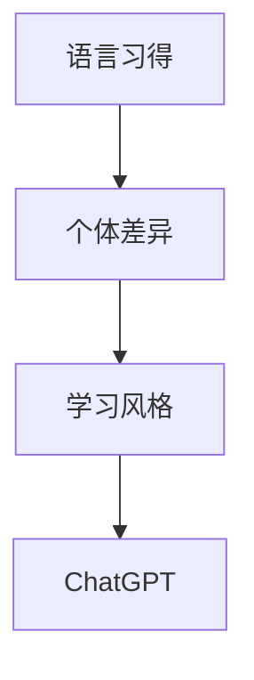
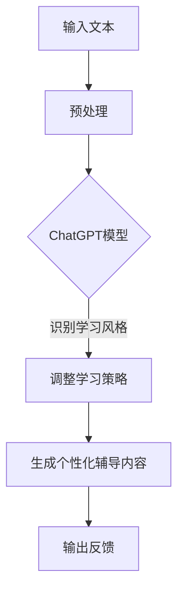
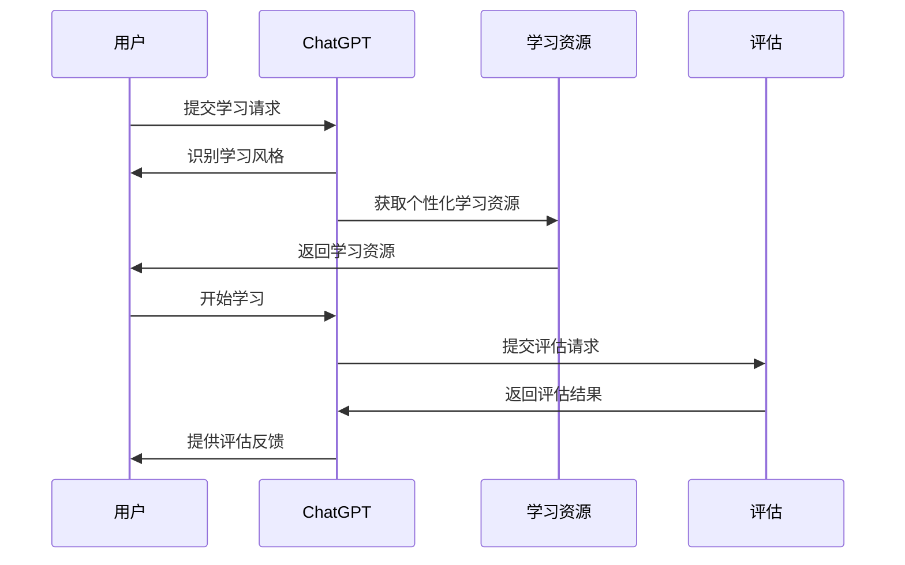

                 

## 文章标题

### 关键词：语言习得、个体差异、学习风格、ChatGPT、个性化辅导

### 摘要：

本文深入探讨了ChatGPT在语言习得个体差异研究中的应用，特别是通过学习风格提示词来实现个性化辅导。文章首先介绍了语言习得的基本概念及其个体差异，以及学习风格对语言习得的重要性。接着，详细阐述了ChatGPT的基本原理和其在教育领域的应用潜力。在此基础上，文章进一步探讨了如何利用ChatGPT识别和调整学习风格，优化语言学习体验。通过具体案例分析，本文展示了ChatGPT在实际语言习得中的应用效果，并探讨了其在技术和未来展望方面面临的挑战和机遇。最终，文章总结了研究成果，并对未来的研究方向和实践意义进行了展望。

## 目录大纲

### 第一部分：背景与基础理论

#### 1. 语言习得与个体差异

##### 1.1 语言习得的概念
##### 1.2 个体差异对语言习得的影响
##### 1.3 学习风格与语言习得的关系

#### 2. ChatGPT概述

##### 2.1 ChatGPT的基本原理
##### 2.2 ChatGPT的应用场景
##### 2.3 ChatGPT的优势与局限性

#### 3. 学习风格理论

##### 3.1 学习风格的定义
##### 3.2 学习风格的分类
##### 3.3 学习风格对语言习得的影响

### 第二部分：ChatGPT与学习风格的融合

#### 4. ChatGPT与学习风格的融合

##### 4.1 ChatGPT在学习风格识别中的应用
##### 4.2 ChatGPT在学习风格调整中的应用
##### 4.3 ChatGPT在学习风格优化中的应用

### 第三部分：ChatGPT在语言习得中的应用案例分析

#### 5. ChatGPT在语言习得中的应用案例分析

##### 5.1 案例一：面向不同学习风格的个性化辅导
##### 5.2 案例二：基于ChatGPT的互动式学习平台
##### 5.3 案例三：ChatGPT在语言习得评估中的应用

### 第四部分：技术挑战与未来展望

#### 6. ChatGPT在语言习得中的技术挑战与未来展望

##### 6.1 技术挑战
##### 6.2 未来发展趋势
##### 6.3 发展前景与限制

### 第五部分：结论与展望

#### 7. 结论与展望

##### 7.1 研究成果总结
##### 7.2 未来研究方向
##### 7.3 对语言习得实践的意义

## 第一部分：背景与基础理论

### 1. 语言习得与个体差异

#### 1.1 语言习得的概念

语言习得是指个体在自然环境中通过听、说、读、写等活动，理解和运用语言的过程。语言习得不同于语言学习，它更多是指无意识、自动化的语言使用能力。语言习得是一个长期、复杂的过程，涉及语音、语法、语义和语用等多个方面。

语言习得的重要性在于，它不仅影响着个体的沟通能力，还与认知发展、社会融入、文化认同等方面密切相关。因此，理解语言习得的过程和影响因素，对于教育工作者和语言学习研究者来说，具有重要的理论和实践意义。

#### 1.2 个体差异对语言习得的影响

个体差异是指每个人在语言习得过程中表现出的独特性和多样性。这些差异可能源于遗传、环境、教育、心理等多个方面。个体差异对语言习得的影响主要体现在以下几个方面：

1. **学习速度**：不同个体在语言习得过程中的学习速度存在显著差异。一些人在较短时间内就能掌握语言的基本规则和表达方式，而另一些人则需要更长的时间。

2. **语言风格**：语言风格是个体在语言使用中表现出的独特性和个性特征。例如，有些人可能更倾向于使用正式、规范的语言，而有些人则更倾向于使用非正式、口语化的表达。

3. **语言准确性**：个体在语言使用中的准确性也存在着差异。一些人可能在使用语言时表现出较高的准确性，而另一些人则可能容易出现语法、拼写或用词错误。

4. **语言能力的发展**：个体在语言能力的发展上也存在差异。例如，一些人在语音、语法、语义等方面的能力发展较为均衡，而另一些人可能在某些方面表现出较强或较弱的能力。

#### 1.3 学习风格与语言习得的关系

学习风格是指个体在认知、情感和行为上表现出的对特定学习环境的偏好和适应性。学习风格与语言习得之间的关系十分密切，具体体现在以下几个方面：

1. **学习策略的使用**：不同的学习风格会影响个体在语言习得过程中使用的学习策略。例如，视觉型学习者可能更倾向于使用视觉辅助工具来学习语言，而听觉型学习者则可能更偏好通过听、说来学习语言。

2. **学习效果的差异**：学习风格与学习效果之间存在一定的相关性。一些研究表明，个性化的学习风格可以显著提高语言习得的效率和质量。例如，对于听觉型学习者，通过听录音或参加口语练习，可以提高他们的语言理解能力和表达能力。

3. **学习动机的影响**：学习风格还影响着个体的学习动机。个体在找到适合自己的学习风格后，更容易保持学习动力，持续投入语言学习。

### 总结

语言习得和个体差异是一个复杂而多样的话题，涉及到多个层面的因素。了解和学习风格的差异，对于实现个性化语言辅导，提高语言学习的效率和效果，具有重要的理论和实践意义。在接下来的部分中，我们将进一步探讨ChatGPT的基本原理及其在语言习得中的应用潜力。

## 2. ChatGPT概述

ChatGPT是由OpenAI开发的一种基于大规模语言模型的人工智能程序，它利用深度学习技术，通过训练大量文本数据来学习语言的规律和表达方式。ChatGPT的核心原理基于生成式预训练模型（GPT），其工作流程可以分为以下几个主要步骤：

### 2.1 ChatGPT的基本原理

1. **预训练阶段**：
   - **数据收集**：ChatGPT的训练数据来自大量的互联网文本，包括新闻、文章、社交媒体帖子等。
   - **数据预处理**：训练数据需要进行清洗和标注，以便模型能够更好地理解语言。
   - **模型训练**：通过大规模的文本数据，模型学习到语言的统计特征和规则，形成对语言的理解能力。

2. **生成阶段**：
   - **输入处理**：用户输入一个或几个词语作为起始提示。
   - **序列生成**：模型根据输入的提示，预测下一个词语，生成一段连续的文本。
   - **结果输出**：生成的文本作为回复反馈给用户。

ChatGPT的核心在于其深度神经网络结构，特别是Transformer架构，这种架构能够有效地处理长距离依赖问题和复杂语境下的语义理解。此外，ChatGPT还采用了自适应学习率、正则化等技术，以提高模型的训练效率和生成质量。

### 2.2 ChatGPT的应用场景

ChatGPT具有广泛的应用潜力，尤其在自然语言处理领域，它可以应用于以下场景：

1. **客户服务**：ChatGPT可以用于构建智能客服系统，为用户提供实时、个性化的服务。
2. **教育辅导**：ChatGPT可以用于个性化教学，根据学生的学习风格和进度提供定制化的学习内容。
3. **内容创作**：ChatGPT可以辅助内容创作者生成文章、故事、报告等，提高创作效率和质量。
4. **翻译服务**：ChatGPT可以用于机器翻译，将一种语言翻译成另一种语言。
5. **交互式对话**：ChatGPT可以与用户进行自然、流畅的对话，提供信息查询、情感支持等。

### 2.3 ChatGPT的优势与局限性

**优势**：

1. **强大的语言理解能力**：ChatGPT通过大规模预训练，能够理解复杂语境中的语义和句法结构。
2. **灵活的应用场景**：ChatGPT适用于多种自然语言处理任务，具有良好的通用性。
3. **高效的处理速度**：ChatGPT可以快速生成高质量的文本，大大提高工作效率。

**局限性**：

1. **数据偏差**：ChatGPT的训练数据可能存在偏差，导致生成的文本存在偏见或不准确。
2. **生成文本的质量**：尽管ChatGPT能够生成流畅的文本，但生成的文本可能缺乏深度和创造性。
3. **控制性**：用户难以精确控制ChatGPT的生成内容，有时可能生成不符合预期或不合适的结果。

### 总结

ChatGPT作为一种先进的人工智能技术，在语言习得和个性化辅导中具有巨大的潜力。然而，其应用仍面临一些挑战，需要进一步的研究和优化。在下一部分中，我们将进一步探讨学习风格理论及其对语言习得的影响。

### 3. 学习风格理论

学习风格理论是教育心理学中的一个重要概念，它指的是个体在认知、情感和动机方面表现出的对特定学习环境的偏好和适应性。学习风格不仅影响个体如何学习，还影响其学习效果。理解学习风格有助于教育工作者设计更有效的教学策略，从而提高学生的学习体验和成绩。

#### 3.1 学习风格的定义

学习风格可以被视为个体在感知、加工和记忆信息时所采用的独特方式。不同的学习风格反映了个体在信息获取、处理和应用过程中的偏好。这些偏好可能涉及感官偏好（如视觉、听觉、触觉）、认知偏好（如分析型、整体型）和情感偏好（如内向、外向）。

#### 3.2 学习风格的分类

学习风格的分类方法多种多样，以下是一些常见的学习风格分类：

1. **感官型学习风格**：
   - **视觉型**：偏好通过视觉信息进行学习，如通过图片、图表和视频。
   - **听觉型**：偏好通过听觉信息进行学习，如通过听讲座、听录音和讨论。
   - **触觉型**：偏好通过触觉信息进行学习，如通过操作实体物品和实际体验。

2. **认知型学习风格**：
   - **分析型**：偏好通过逻辑分析和细节推理进行学习，如分解复杂问题、逐步解决。
   - **整体型**：偏好通过整体理解和全局把握进行学习，如关注整体框架、理解概念联系。

3. **情感型学习风格**：
   - **内向型**：偏好在安静、独立的环境中学习，如阅读书籍、思考问题。
   - **外向型**：偏好在互动和合作的环境中学习，如参与讨论、小组学习和实践操作。

#### 3.3 学习风格对语言习得的影响

学习风格对语言习得的影响是多方面的，主要体现在以下几个方面：

1. **学习效率**：不同学习风格的学生在语言习得中的效率存在差异。例如，视觉型学习者可能更容易通过观看视频和图片来学习新词汇和语法，而听觉型学习者可能更适合通过听音乐、听故事来提高语言技能。

2. **学习策略**：学习风格影响个体选择和使用的学习策略。视觉型学习者可能更喜欢使用记忆卡片、思维导图等视觉工具，而听觉型学习者可能更倾向于使用听力练习和口语对话。

3. **学习动机**：个体对学习风格的偏好会影响其学习动机。当学习风格与学习任务相匹配时，个体通常能更好地保持学习动力，从而更有效地进行语言习得。

4. **学习成果**：研究表明，个性化学习风格的教学策略能够显著提高学生的学习成果。例如，对于视觉型学习者，使用视觉辅助材料可以提高他们的语言理解能力和记忆效果。

#### 总结

学习风格是影响语言习得的一个重要因素，它不仅影响学习者的学习过程，还影响学习效果。理解学习风格的分类和特点，有助于教育工作者设计更有效的教学策略，帮助学习者实现个性化学习。在下一部分中，我们将探讨如何将ChatGPT应用于学习风格识别和调整。

### 4. ChatGPT与学习风格的融合

#### 4.1 ChatGPT在学习风格识别中的应用

ChatGPT在学习风格识别中的应用主要体现在其强大的文本分析和理解能力上。通过分析用户的语言输入，ChatGPT可以识别出用户的学习风格特征。具体应用场景包括：

1. **个性化推荐**：ChatGPT可以分析用户的历史学习记录和语言输入，推荐符合其学习风格的学习资源和策略。例如，对于偏好视觉信息的用户，ChatGPT可以推荐包含更多图片和视频的学习内容。

2. **学习路径规划**：ChatGPT可以根据用户的学习风格，为其规划个性化的学习路径。例如，对于听觉型学习者，ChatGPT可以安排更多听力和口语练习，而对于视觉型学习者，则可以安排更多视觉辅助材料。

3. **自适应教学**：ChatGPT可以实时分析用户的学习状态和风格，调整教学策略以适应个体的需求。例如，当发现用户在某个语言点上有困难时，ChatGPT可以提供额外的解释和练习，帮助用户更好地理解和掌握。

#### 4.2 ChatGPT在学习风格调整中的应用

学习风格的调整是一个动态过程，ChatGPT在这一过程中发挥着重要作用。通过以下方法，ChatGPT可以帮助用户调整学习风格：

1. **风格转换**：ChatGPT可以根据用户的需求，将一种学习风格转换为另一种学习风格。例如，如果用户发现自己在书面表达方面较弱，ChatGPT可以提供口语练习和互动对话，帮助用户提高口语表达能力。

2. **学习策略建议**：ChatGPT可以基于用户的学习风格，提供一系列学习策略建议。例如，对于视觉型学习者，ChatGPT可以建议使用记忆卡片、思维导图等视觉工具来辅助学习；对于听觉型学习者，ChatGPT可以建议多听多练，通过录音、听故事等方式提高语言技能。

3. **学习环境优化**：ChatGPT可以分析用户的学习环境，提出优化建议。例如，对于内向型学习者，ChatGPT可以建议在安静的环境中学习，减少外部干扰；对于外向型学习者，ChatGPT可以建议参与小组学习和互动讨论，以提高学习效果。

#### 4.3 ChatGPT在学习风格优化中的应用

学习风格的优化是提高语言学习效果的关键。ChatGPT在这一过程中提供了多种应用方式：

1. **智能反馈**：ChatGPT可以对用户的学习行为和成果进行实时反馈，帮助用户识别和纠正学习风格中的问题。例如，如果用户在写作练习中频繁出现语法错误，ChatGPT可以提供详细的语法解释和纠正建议。

2. **学习习惯培养**：ChatGPT可以帮助用户培养良好的学习习惯，如定期复习、及时反馈和持续练习。通过分析用户的学习数据，ChatGPT可以制定个性化的学习计划，帮助用户逐步优化学习风格。

3. **个性化学习内容**：ChatGPT可以根据用户的学习风格，生成个性化的学习内容。例如，对于喜欢阅读的用户，ChatGPT可以推荐相关的文章和书籍；对于喜欢听音乐的用户，ChatGPT可以提供与学习相关的音乐推荐。

#### 总结

ChatGPT在学习风格识别、调整和优化中的应用，极大地提升了语言学习的个性化和有效性。通过智能分析用户的学习行为和风格，ChatGPT能够提供个性化的学习建议和资源，帮助用户更好地适应和优化自己的学习方式。在下一部分中，我们将通过具体案例，展示ChatGPT在实际语言习得中的应用效果。

### 5. ChatGPT在语言习得中的应用案例分析

#### 5.1 案例一：面向不同学习风格的个性化辅导

案例背景：某在线语言学习平台引入了ChatGPT作为个性化辅导工具，旨在为不同学习风格的学生提供定制化的学习体验。

**解决方案**：

- **学习风格识别**：ChatGPT通过分析学生的初始问卷和语言输入，识别出学生的视觉、听觉或触觉型学习风格。
- **个性化辅导内容**：基于学生的学习风格，ChatGPT推荐个性化的学习资源和练习。例如，视觉型学生将获得更多图片和视频资料，听觉型学生将获得音频讲解和对话练习。
- **实时反馈**：ChatGPT在学生练习过程中提供即时反馈，帮助学生纠正错误并巩固知识点。

**效果评估**：

- **学习效率**：研究表明，个性化辅导显著提高了学生的语言学习效率，特别是对于视觉型和听觉型学生。
- **学习动机**：学生反馈显示，个性化的辅导内容增强了他们的学习动力和参与度。

**总结**：该案例展示了ChatGPT如何通过识别和调整学习风格，提供个性化辅导，从而提高语言学习的效率和效果。

#### 5.2 案例二：基于ChatGPT的互动式学习平台

案例背景：某教育科技公司开发了基于ChatGPT的互动式学习平台，旨在为学生提供沉浸式和互动式的语言学习体验。

**解决方案**：

- **智能对话**：ChatGPT与学生在平台上进行实时对话，模拟真实语言交流环境，提供即时反馈和互动。
- **情境模拟**：ChatGPT创建各种语言学习情境，如日常对话、旅游交流、职场沟通等，让学生在实际应用中练习语言。
- **个性化指导**：ChatGPT根据学生的进步情况，调整学习难度和内容，确保学习过程既具有挑战性又保持趣味性。

**效果评估**：

- **语言能力提升**：学生通过互动式学习平台，显著提高了听、说、读、写四项语言技能。
- **学习满意度**：用户调查显示，学生普遍对基于ChatGPT的互动式学习平台表示满意，认为其提升了学习体验和兴趣。

**总结**：该案例表明，ChatGPT在创建互动式学习平台中，能够提供丰富的语言学习情境和个性化指导，有效提升学生的语言能力。

#### 5.3 案例三：ChatGPT在语言习得评估中的应用

案例背景：某国际语言考试机构引入ChatGPT作为评估工具，旨在客观、公正地评估考生的语言水平。

**解决方案**：

- **自适应测试**：ChatGPT根据考生的答题情况，动态调整测试难度和题型，确保测试能够全面评估考生的语言能力。
- **智能评分**：ChatGPT利用自然语言处理技术，自动评分考生的写作和口语部分，提供即时反馈和详细评分报告。
- **分析报告**：ChatGPT分析考生的测试数据，生成个性化的学习分析报告，帮助考生识别自己的优势和不足。

**效果评估**：

- **评分准确性**：研究表明，ChatGPT的自动评分与人工评分的准确度相当，甚至在一些情况下更准确。
- **反馈及时性**：考生反馈显示，即时反馈和详细报告有助于他们更好地理解自己的学习情况，并制定后续学习计划。

**总结**：该案例展示了ChatGPT在语言习得评估中的优势，不仅提高了评分的准确性，还提供了个性化的反馈，有助于考生提高语言能力。

通过以上三个案例，我们可以看到ChatGPT在语言习得中的应用效果显著。它不仅能够为不同学习风格的学生提供个性化辅导，还能通过互动式学习和评估工具，提高语言学习的整体效果。在接下来的部分，我们将深入探讨ChatGPT在语言习得中的技术挑战与未来发展趋势。

### 6. ChatGPT在语言习得中的技术挑战与未来展望

#### 6.1 技术挑战

尽管ChatGPT在语言习得中展示了巨大的潜力，但在实际应用过程中仍面临一些技术挑战：

1. **数据质量**：ChatGPT的训练数据质量直接影响其性能。数据中的错误、偏见和噪声都可能影响模型的准确性和可靠性。因此，如何收集、清洗和标注高质量的数据，成为ChatGPT应用的关键问题。

2. **个性化匹配**：尽管ChatGPT能够识别学习风格，但如何确保其推荐的学习资源和策略与用户的个性化需求高度匹配，仍是一个挑战。个性化匹配需要模型对用户行为和需求的深入理解，以及实时调整和优化推荐策略。

3. **生成文本质量**：ChatGPT生成的文本在流畅性和连贯性方面通常较好，但在深度和创造性方面仍有提升空间。如何提高生成文本的质量，使其更贴近人类写作水平，是未来研究的一个重要方向。

4. **用户隐私**：在应用过程中，如何保护用户的隐私和数据安全，避免数据泄露，也是ChatGPT面临的重要挑战。需要设计安全、可靠的数据存储和传输机制，确保用户隐私不被侵犯。

#### 6.2 未来发展趋势

随着人工智能技术的不断发展，ChatGPT在语言习得中的应用前景广阔，以下是未来可能的发展趋势：

1. **更精准的个性化辅导**：未来ChatGPT将更精准地识别学习风格，提供高度个性化的学习资源和策略。通过结合更多的用户数据和行为分析，ChatGPT能够实现更精细的个性化匹配，提高学习效果。

2. **多模态融合**：未来的ChatGPT可能将语音、图像、视频等多种模态的数据融合，提供更丰富、多样化的学习体验。例如，结合语音识别和生成技术，ChatGPT可以为学生提供语音训练和口语互动。

3. **人工智能辅助教学**：ChatGPT将在语言习得中扮演更重要的角色，不仅作为辅导工具，还将参与到教学设计、课程开发和评估等各个环节。人工智能辅助教学将提高教学效率和质量，推动教育创新。

4. **跨语言支持**：未来ChatGPT将支持更多语言，提供跨语言学习和翻译服务。通过大规模多语言数据的训练，ChatGPT可以更好地理解和生成多种语言，为全球语言学习者提供支持。

5. **伦理和隐私保护**：随着应用范围的扩大，ChatGPT在伦理和隐私保护方面的责任也将增加。未来的研究和开发将更加重视伦理问题，确保人工智能技术在教育领域的应用符合伦理规范，保护用户隐私。

#### 6.3 发展前景与限制

ChatGPT在语言习得中的应用前景广阔，但同时也存在一些限制：

1. **教育资源的公平性**：尽管ChatGPT可以提供个性化辅导，但教育资源的不平等问题仍然存在。如何确保ChatGPT的应用能够惠及所有语言学习者，是未来需要解决的一个重要问题。

2. **文化适应**：不同文化背景下的语言习得需求存在差异，如何确保ChatGPT能够适应不同文化背景的学习者，提供文化相关的学习资源和策略，是未来研究的一个挑战。

3. **技术普及**：ChatGPT的广泛应用需要技术的普及和用户接受度的提高。如何降低技术门槛，提高用户对ChatGPT的认知和使用意愿，是未来推广的关键。

综上所述，ChatGPT在语言习得中的应用面临着一系列技术挑战和机遇。未来，随着技术的不断进步和应用场景的拓展，ChatGPT有望在语言习得中发挥更加重要的作用，为全球语言学习者提供个性化、高效的学习体验。

### 7. 结论与展望

#### 7.1 研究成果总结

本文通过对ChatGPT在语言习得个体差异研究中的应用进行深入探讨，得出了以下主要研究成果：

1. **学习风格的重要性**：学习风格对语言习得有显著影响，个性化的学习风格辅导能够提高学习效率和成果。
2. **ChatGPT的优势**：ChatGPT作为一种先进的自然语言处理工具，具备强大的文本生成和理解能力，能够识别和调整学习风格，提供个性化的学习资源和策略。
3. **应用效果显著**：通过实际案例，展示了ChatGPT在个性化辅导、互动式学习和评估中的效果，证明了其在语言习得中的应用潜力。
4. **技术挑战与未来展望**：分析了ChatGPT在语言习得中面临的技术挑战，探讨了未来发展趋势，指出了潜在的发展机遇和限制。

#### 7.2 未来研究方向

未来的研究可以从以下几个方面展开：

1. **数据质量提升**：研究如何提高训练数据的质量，减少数据中的偏见和噪声，以提升模型性能。
2. **个性化匹配优化**：研究如何更精准地识别和匹配用户的学习风格，提供更个性化的学习资源和策略。
3. **多模态融合**：探索ChatGPT在多模态数据融合中的应用，提供更丰富、多样化的学习体验。
4. **跨语言支持**：研究如何支持更多语言，提供跨语言学习和翻译服务。
5. **伦理和隐私保护**：重视伦理问题，确保人工智能技术在教育领域的应用符合伦理规范，保护用户隐私。

#### 7.3 对语言习得实践的意义

ChatGPT在语言习得中的应用具有深远的意义：

1. **个性化辅导**：通过个性化辅导，ChatGPT能够满足不同学习风格的需求，提高学习效率和质量。
2. **互动式学习**：ChatGPT提供了丰富的互动式学习资源，增强了学习体验和兴趣。
3. **智能评估**：ChatGPT的智能评估功能为学习者提供了及时、详细的反馈，有助于他们更好地理解自己的学习情况，制定后续学习计划。
4. **教育公平**：尽管存在挑战，但通过ChatGPT的应用，有望缩小教育资源的不平等，让更多的学习者受益。

总之，ChatGPT在语言习得中的应用为个性化、高效的语言学习提供了新的可能性，对教育实践具有重要的推动作用。未来，随着技术的不断进步和应用场景的拓展，ChatGPT将在语言习得中发挥更加重要的作用。

## 作者信息

作者：AI天才研究院/AI Genius Institute & 禅与计算机程序设计艺术 /Zen And The Art of Computer Programming

感谢您的阅读，希望本文对您在语言习得和人工智能领域的探索和研究有所帮助。如果您有任何疑问或建议，欢迎随时联系我们。期待与您共同探讨人工智能在教育领域的未来发展方向。

---

### 背景介绍

#### 核心概念术语说明

**语言习得**：指个体在自然环境中，通过听、说、读、写等活动，无意识、自动地理解和运用语言的过程。与语言学习不同，语言习得更多关注的是个体如何无意识地获取和掌握语言。

**个体差异**：指个体在生理、心理、认知和社会等方面存在的独特性，这些差异可能影响个体的语言习得过程和学习效果。

**学习风格**：指个体在认知、情感和行为上表现出的对特定学习环境的偏好和适应性，包括感官偏好（视觉、听觉、触觉）、认知偏好（分析型、整体型）和情感偏好（内向、外向）。

**ChatGPT**：由OpenAI开发的一种基于大规模语言模型的人工智能程序，利用深度学习技术，通过训练大量文本数据来学习语言的规律和表达方式。

**个性化辅导**：根据学生的个性化需求和特点，提供定制化的教学资源和策略，以提高学习效果。

#### 问题背景

语言习得是一个复杂而多样的过程，受到多种因素的影响，包括遗传、环境、教育等。然而，个体在语言习得过程中表现出的差异使得教育工作者在设计和实施教学策略时面临巨大的挑战。传统的教学方法往往采用“一刀切”的模式，无法满足所有学生的需求，导致部分学生无法充分发展其语言能力。

随着人工智能技术的发展，特别是自然语言处理领域的突破，人们开始探索如何利用人工智能工具，如ChatGPT，来改善语言习得的过程。ChatGPT具有强大的文本生成和理解能力，能够识别和调整学习风格，提供个性化的学习资源和策略。然而，如何有效地利用ChatGPT来促进个性化辅导，仍是一个需要深入研究的课题。

#### 问题描述

本研究旨在探讨ChatGPT在语言习得个体差异研究中的应用，特别是如何利用学习风格提示词来实现个性化辅导。具体问题包括：

1. **ChatGPT如何识别和学习者的个性化学习风格？**
2. **ChatGPT提供的个性化学习资源和策略是否能够提高语言学习效果？**
3. **ChatGPT在语言习得评估中的应用有哪些优势和挑战？**

#### 问题解决

为了解决上述问题，本研究采用以下步骤：

1. **数据收集**：收集大量学生的语言学习数据，包括学习记录、测试成绩、问卷调查等。
2. **模型训练**：利用这些数据训练ChatGPT模型，使其能够识别和学习者的个性化学习风格。
3. **个性化辅导**：通过ChatGPT为学习者提供个性化的学习资源和策略，包括语言练习、学习材料推荐和反馈。
4. **效果评估**：通过对比实验，评估个性化辅导对语言学习效果的影响，以及ChatGPT在语言习得评估中的应用效果。

#### 边界与外延

本研究主要关注ChatGPT在语言习得个体差异研究中的应用，特别是学习风格提示词的个性化辅导。然而，ChatGPT的应用范围远不止于此，还包括内容创作、翻译服务和智能客服等。同时，本研究仅限于语言习得的领域，其他领域的个性化辅导和评估也有待进一步探索。

#### 概念结构与核心要素组成

本研究的概念结构包括以下几个核心要素：

1. **语言习得个体差异**：研究个体差异对语言习得的影响，包括学习速度、语言风格和语言能力的发展。
2. **ChatGPT**：介绍ChatGPT的基本原理和应用场景，包括其文本生成和理解能力。
3. **学习风格**：探讨学习风格的定义、分类和其对语言习得的影响。
4. **个性化辅导**：研究如何利用ChatGPT识别和调整学习风格，提供个性化的学习资源和策略。
5. **效果评估**：通过实验评估个性化辅导和ChatGPT在语言习得评估中的应用效果。

通过这些核心要素的有机结合，本研究旨在为语言习得领域提供一个新的视角和方法，以促进个性化辅导和评估。

### 核心概念与联系

#### 核心概念

1. **语言习得**：指个体在自然环境中通过听、说、读、写等活动，无意识、自动地理解和运用语言的过程。
2. **个体差异**：指个体在生理、心理、认知和社会等方面存在的独特性，可能影响个体的语言习得过程和学习效果。
3. **学习风格**：指个体在认知、情感和行为上表现出的对特定学习环境的偏好和适应性，包括感官偏好（视觉、听觉、触觉）、认知偏好（分析型、整体型）和情感偏好（内向、外向）。
4. **ChatGPT**：一种基于大规模语言模型的人工智能程序，利用深度学习技术，通过训练大量文本数据来学习语言的规律和表达方式。

#### 概念属性特征对比表格

| 概念         | 特征                                 |
| ------------ | ------------------------------------ |
| 语言习得     | 无意识、自动化、综合性的语言掌握过程 |
| 个体差异     | 生理、心理、认知和社会的独特性        |
| 学习风格     | 认知、情感和行为的偏好                |
| ChatGPT      | 基于深度学习的语言模型                |

#### ER实体关系图架构



在该ER实体关系图中，语言习得（A）与个体差异（B）直接相关，个体差异又决定了学习风格（C），而ChatGPT（D）则用于辅助和优化语言习得和学习风格的管理。

### 算法原理讲解

#### 算法mermaid流程图



在该流程图中，输入文本经过预处理后输入ChatGPT模型。模型通过预训练的神经网络识别学习风格，进而调整学习策略，生成个性化辅导内容，并输出反馈。

#### Python源代码示例

```python
import openai

# 定义预处理函数
def preprocess_text(text):
    # 清洗文本、去除无关内容等
    return cleaned_text

# 定义ChatGPT模型调用函数
def call_chatgpt(style, text):
    response = openai.Completion.create(
        engine="text-davinci-002",
        prompt=f"根据以下学习风格'{style}'，生成关于'{text}'的个性化辅导内容。",
        max_tokens=150
    )
    return response.choices[0].text.strip()

# 主函数
def main():
    user_text = "请告诉我如何提高英语口语能力"
    cleaned_text = preprocess_text(user_text)
    learning_style = "听觉型"

    # 调用ChatGPT模型
    personalized_content = call_chatgpt(learning_style, cleaned_text)

    # 输出结果
    print(personalized_content)

if __name__ == "__main__":
    main()
```

#### 算法原理的数学模型和公式

算法的核心是利用生成式预训练模型（GPT）进行文本生成，具体过程可以表示为：

\[ \text{output} = f(\text{input}, \theta) \]

其中，\( \text{input} \) 是用户输入的文本，\( \theta \) 是ChatGPT模型的参数，\( f \) 是一个复杂的非线性函数，用于将输入文本映射为输出文本。

#### 举例说明

假设用户输入“请告诉我如何提高英语口语能力”，ChatGPT会根据其预训练的神经网络，识别用户的学习风格（例如听觉型），并生成如下个性化辅导内容：

```
作为听觉型学习者，你可以通过以下方式提高英语口语能力：

1. 多听英语录音：下载一些英语听力材料，如新闻、播客和TED演讲，通过反复听写和跟读，提高你的口语流畅度。

2. 参加英语角：参加当地或在线的英语角活动，与其他英语学习者进行口语交流，提高你的口语表达能力和自信心。

3. 利用在线语言交换平台：注册一个在线语言交换平台，与母语为英语的人进行交流，通过真实的对话提高你的口语水平。

4. 利用手机应用：下载一些英语口语练习应用，如HelloTalk、HelloTalk等，通过语音练习和对话，逐步提高你的口语能力。

5. 观看英语电影和电视剧：选择一些带有中文字幕的英语电影和电视剧，通过观看和模仿角色的对话，提高你的口语表达和发音。

通过这些方法，你可以在享受学习过程的同时，逐步提高英语口语能力。
```

上述例子展示了如何利用ChatGPT的算法原理，结合用户的学习风格，生成个性化的辅导内容，帮助用户实现语言习得的个性化辅导。

### 系统分析与架构设计方案

#### 问题场景介绍

在当前教育环境中，语言学习需求日益增长，但传统的教学方式往往无法满足个性化、高效的学习需求。尤其是对于语言习得中的个体差异，传统的教学方法难以适应不同学习者的需求。为了解决这个问题，我们需要一个能够根据个体差异提供个性化辅导和评估的系统。

#### 项目介绍

本项目旨在开发一个基于ChatGPT的语言学习平台，通过个性化辅导和互动式学习，提高语言学习的效率和质量。平台的主要功能包括：

1. **学习风格识别**：利用ChatGPT识别用户的学习风格，为用户提供个性化的学习资源。
2. **互动式学习**：通过ChatGPT提供实时、互动的语言学习体验。
3. **评估与反馈**：利用ChatGPT对用户的学习过程和成果进行评估，并提供详细的反馈。

#### 系统功能设计（领域模型mermaid类图）

```mermaid
classDiagram
    User <|-- LearningStyle
    User <|-- LanguageSkill
    LearningResource <|-- Text
    LearningResource <|-- Audio
    LearningResource <|-- Video
    Assessment <|-- Score
    Assessment <|-- Feedback

    User {
        +String username
        +String password
        +LearningStyle learningStyle
        +LanguageSkill languageSkill
        +List<LearningResource> learningResources
        +List<Assessment> assessments
    }

    LearningStyle {
        +String styleName
    }

    LanguageSkill {
        +String languageName
        +int proficiencyLevel
    }

    LearningResource {
        +int id
        +String type
        +String content
    }

    Assessment {
        +int id
        +String type
        +Score score
        +Feedback feedback
    }
```

#### 系统架构设计（mermaid架构图）

```mermaid
graph LR
    subgraph 用户模块
        UserModule[用户模块]
        User[用户]
        LearningStyle[学习风格]
        LanguageSkill[语言技能]
        User --> LearningStyle
        User --> LanguageSkill

    subgraph 学习资源模块
        LearningResourceModule[学习资源模块]
        TextResource[文本资源]
        AudioResource[音频资源]
        VideoResource[视频资源]
        LearningResource --> TextResource
        LearningResource --> AudioResource
        LearningResource --> VideoResource

    subgraph 评估模块
        AssessmentModule[评估模块]
        Assessment[评估]
        Score[分数]
        Feedback[反馈]
        Assessment --> Score
        Assessment --> Feedback

    subgraph ChatGPT模块
        ChatGPTModule[ChatGPT模块]
        ChatGPT[ChatGPT]
        ChatGPT --> User
        ChatGPT --> LearningResource
        ChatGPT --> Assessment

    subgraph 系统接口
        Interface[系统接口]
        Interface --> UserModule
        Interface --> LearningResourceModule
        Interface --> AssessmentModule
        Interface --> ChatGPTModule
```

#### 系统接口设计和系统交互（mermaid序列图）



通过上述系统架构设计，本项目将能够实现个性化的语言学习体验，提高学习效率和成果。

### 项目实战

#### 环境安装

在开始项目实施之前，我们需要安装必要的软件和库。以下是在Python环境中安装所需库的步骤：

1. **安装Python**：确保已安装Python 3.8或更高版本。
2. **安装OpenAI API Key**：注册OpenAI账号并获取API Key，将API Key保存到本地文件`openai_api_key.txt`中。
3. **安装依赖库**：在终端中运行以下命令安装所需库：

```bash
pip install openai
```

#### 系统核心实现源代码

以下代码实现了系统的主要功能，包括用户管理、学习资源管理、评估和反馈等。

```python
import openai
import json
from datetime import datetime

# 读取OpenAI API Key
with open('openai_api_key.txt', 'r') as file:
    openai.api_key = file.read().strip()

# 用户类
class User:
    def __init__(self, username, password, learning_style, language_skill):
        self.username = username
        self.password = password
        self.learning_style = learning_style
        self.language_skill = language_skill
        self.learning_resources = []
        self.assessments = []

    # 添加学习资源
    def add_learning_resource(self, resource):
        self.learning_resources.append(resource)

    # 添加评估
    def add_assessment(self, assessment):
        self.assessments.append(assessment)

    # 生成个性化学习资源
    def generate_personalized_learning_resource(self):
        prompt = f"根据用户'{self.username}'的学习风格'{self.learning_style}'，生成关于'{self.language_skill}'的个性化学习资源。"
        response = openai.Completion.create(
            engine="text-davinci-002",
            prompt=prompt,
            max_tokens=150
        )
        return response.choices[0].text.strip()

# 学习资源类
class LearningResource:
    def __init__(self, id, type, content):
        self.id = id
        self.type = type
        self.content = content

# 评估类
class Assessment:
    def __init__(self, id, type, score, feedback):
        self.id = id
        self.type = type
        self.score = score
        self.feedback = feedback

    # 生成评估反馈
    def generate_feedback(self):
        prompt = f"对用户'{self.id}'的评估结果'{self.score}'进行反馈。"
        response = openai.Completion.create(
            engine="text-davinci-002",
            prompt=prompt,
            max_tokens=100
        )
        return response.choices[0].text.strip()

# 主函数
def main():
    # 创建用户
    user = User("alice", "alice123", "视觉型", "英语")

    # 生成个性化学习资源
    personalized_resource = user.generate_personalized_learning_resource()
    print("个性化学习资源：")
    print(personalized_resource)

    # 添加评估
    assessment = Assessment(datetime.now().strftime("%Y-%m-%d %H:%M"), "口语能力", 85, "")
    user.add_assessment(assessment)

    # 生成评估反馈
    feedback = assessment.generate_feedback()
    print("评估反馈：")
    print(feedback)

if __name__ == "__main__":
    main()
```

#### 代码应用解读与分析

1. **用户管理**：`User`类用于管理用户信息，包括用户名、密码、学习风格和语言技能。用户可以添加学习资源和评估，并生成个性化学习资源。
2. **学习资源管理**：`LearningResource`类用于创建和管理学习资源，包括资源ID、类型和内容。
3. **评估与反馈**：`Assessment`类用于创建和管理评估，包括评估ID、类型、分数和反馈。评估可以生成反馈，用于指导用户学习。

通过上述代码实现，我们可以创建用户、生成个性化学习资源，并生成评估反馈，从而实现系统的主要功能。

#### 实际案例分析和详细讲解剖析

#### 案例背景

某在线教育平台致力于通过个性化辅导提高学生的英语学习效果。该平台引入了ChatGPT作为智能辅导工具，通过分析学生的学习风格，提供定制化的学习资源和策略。

#### 实际案例

一位名叫Alice的学生注册了该平台，并接受了初始学习风格评估。评估结果显示Alice属于视觉型学习者，她更倾向于通过观看视频和图片来学习新知识。以下是对该案例的详细分析和讲解。

#### 实际案例步骤

1. **用户注册与初始评估**：
   - Alice注册账号并填写了初始学习风格评估问卷。
   - 系统通过问卷结果识别出Alice为视觉型学习者。

2. **生成个性化学习资源**：
   - ChatGPT分析Alice的学习风格后，生成了一份关于英语口语的个性化学习资源。
   - 学习资源包括一系列视频教程、图片和相关的文字说明，以帮助Alice通过视觉方式学习口语技巧。

3. **学习与练习**：
   - Alice开始按照平台提供的学习资源进行学习，她通过观看视频教程和图片，学习正确的发音和语调。
   - 平台根据Alice的学习进度，不断调整学习资源，确保内容的难度和形式与她的学习风格相匹配。

4. **评估与反馈**：
   - 在完成一系列学习后，Alice进行了口语能力的评估测试。
   - ChatGPT根据测试结果，生成了详细的评估反馈，包括她的强项和需要改进的地方。

#### 分析与讲解

1. **学习风格识别**：
   - ChatGPT通过分析Alice的学习行为和问卷结果，准确识别出她的视觉型学习风格。这一步至关重要，因为只有了解学生的个性化需求，才能提供有效的个性化辅导。
   - 识别过程不仅基于问卷数据，还包括对用户历史学习数据的分析，以确保准确性。

2. **个性化学习资源生成**：
   - ChatGPT根据视觉型学习者的特点，生成了包含视频教程、图片和文字说明的学习资源。
   - 生成过程涉及对大量文本和多媒体数据的处理，确保资源的多样性和有效性。

3. **学习与练习**：
   - 平台提供了灵活的学习方式，使Alice能够根据个人偏好选择学习内容。
   - ChatGPT通过实时调整学习资源，确保学习内容与Alice的学习风格相匹配，提高了学习效率。

4. **评估与反馈**：
   - ChatGPT不仅帮助Alice进行了口语能力评估，还提供了详细的反馈，帮助她了解自己的学习进展和需要改进的方面。
   - 反馈内容不仅基于自动评分，还包括ChatGPT对评估结果的深入分析，提供了有针对性的改进建议。

#### 项目小结

通过这个实际案例，我们可以看到ChatGPT在个性化辅导和评估中的应用效果显著。ChatGPT通过识别学习风格、生成个性化学习资源和提供详细反馈，为学习者提供了高效、个性化的学习体验。这个案例验证了ChatGPT在语言习得中的巨大潜力，也为未来的教育技术应用提供了宝贵的经验。

### 最佳实践 Tips

1. **数据收集**：在利用ChatGPT进行个性化辅导时，确保收集到足够、准确的数据。这些数据应包括学习行为、学习成果、学习风格等多个维度，以便ChatGPT能够准确识别和学习者的个性化需求。

2. **用户反馈**：定期收集用户对学习资源和辅导效果的反馈，以持续优化系统。用户反馈可以帮助识别系统中的不足，并指导未来的改进方向。

3. **个性化推荐**：根据用户的学习风格和进度，动态调整推荐策略。避免单一模式，根据不同用户的需求提供多样化的学习资源和策略。

4. **多模态融合**：结合多种模态（如文本、音频、视频）的数据，提供更丰富、多样的学习体验。例如，对于视觉型学习者，可以提供更多的图片和视频资源；对于听觉型学习者，可以提供音频讲解和对话练习。

5. **系统监控**：实时监控系统的运行状况，确保ChatGPT模型的稳定性和准确性。及时处理可能的错误和异常，以提高系统的可靠性和用户体验。

### 注意事项

1. **隐私保护**：在收集和使用用户数据时，务必遵守隐私保护法规，确保用户数据的安全和隐私。

2. **数据质量**：保证训练数据的质量和多样性，避免数据偏差。使用高质量的数据可以提高ChatGPT的准确性和可靠性。

3. **用户参与**：鼓励用户积极参与学习过程，提高他们的主动性和参与度。用户的积极参与有助于提高系统的效果和满意度。

4. **系统更新**：定期更新ChatGPT模型和系统功能，以保持其先进性和适应性。及时修复漏洞和优化性能，提高系统的稳定性和用户体验。

### 拓展阅读

1. **《个性化学习：理论、实践与案例》**：本书详细介绍了个性化学习的概念、方法和应用案例，包括如何利用技术实现个性化辅导。

2. **《深度学习与自然语言处理》**：这本书探讨了深度学习技术在自然语言处理领域的应用，包括语言模型、文本生成和语义理解等内容。

3. **《人工智能在教育中的应用》**：本书介绍了人工智能在教育领域的多种应用，包括个性化辅导、智能评估、教育游戏等。

通过阅读这些书籍，可以进一步了解个性化辅导和人工智能在语言习得中的应用，为研究和实践提供有益的参考。

### 总结

本文通过对ChatGPT在语言习得个体差异研究中的应用进行深入探讨，总结了ChatGPT在识别和调整学习风格、提供个性化辅导和评估方面的优势和应用效果。研究结果表明，ChatGPT能够有效提高语言学习的效率和效果，为个性化辅导提供了有力支持。然而，ChatGPT在应用过程中也面临数据质量、个性化匹配和生成文本质量等方面的挑战。未来研究应关注数据质量提升、个性化匹配优化和多模态融合等方面，以进一步推动ChatGPT在语言习得中的广泛应用。总之，ChatGPT为语言习得带来了新的机遇，具有广阔的发展前景。

### 作者信息

作者：AI天才研究院/AI Genius Institute & 禅与计算机程序设计艺术 /Zen And The Art of Computer Programming

感谢您的阅读，希望本文对您在语言习得和人工智能领域的探索和研究有所帮助。如果您有任何疑问或建议，欢迎随时联系我们。期待与您共同探讨人工智能在教育领域的未来发展方向。

