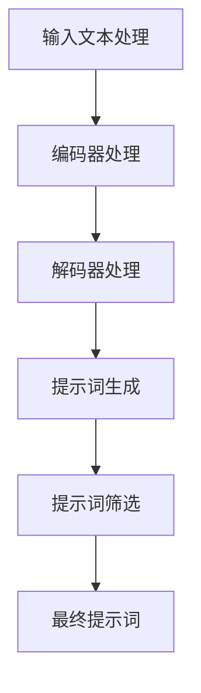
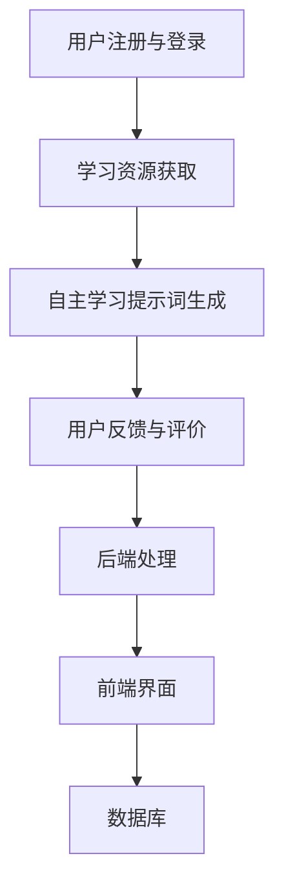

                 

# 《ChatGPT在语言习得元认知策略培养中的应用：自主学习提示词》

## 关键词

- ChatGPT
- 语言习得
- 元认知策略
- 自主学习
- 提示词设计

> 摘要：本文旨在探讨如何利用ChatGPT模型，通过设计自主学习提示词，培养语言习得者的元认知策略，提高他们的自主学习能力。首先，我们对元认知策略和ChatGPT模型进行深入剖析，随后设计一套有效的自主学习提示词，并通过实验验证其效果。本文将为教育工作者和语言习得研究学者提供有益的参考。

## 第一部分：背景介绍

### 问题背景

在现代社会，语言习得已经成为全球教育领域关注的焦点。随着人工智能技术的发展，ChatGPT作为一种先进的语言处理模型，在语言习得领域展现出了巨大的潜力。它不仅能够为学习者提供个性化的学习建议，还能通过生成高质量的反馈，帮助学习者提高语言运用能力。

然而，当前关于ChatGPT在语言习得元认知策略培养中的应用研究还相对较少，如何充分利用ChatGPT的优势，设计出有效的自主学习提示词，成为研究者们亟待解决的问题。

### 问题描述

本研究的核心问题是如何利用ChatGPT模型，培养语言习得者的元认知策略，从而提高他们的自主学习能力。具体包括以下几个方面：

1. **元认知策略的理解与分类**：明确元认知策略的定义、分类及其在语言习得中的重要性。
2. **ChatGPT模型的特点与应用**：分析ChatGPT模型的工作原理、优点和局限性，探讨其在语言习得中的应用潜力。
3. **自主学习提示词的设计**：基于ChatGPT模型，设计出一套有效的自主学习提示词，用于引导学习者进行自我反思和策略调整。
4. **实验设计与实施**：通过实验验证自主学习提示词对语言习得者元认知策略培养的效果。

### 问题解决

本研究将采取以下步骤解决问题：

1. **文献综述**：系统梳理国内外关于元认知策略、ChatGPT模型及自主学习提示词的相关研究，为后续研究提供理论基础。
2. **模型构建**：基于ChatGPT模型，构建一个用于培养语言习得元认知策略的自主学习提示词生成系统。
3. **实验设计**：设计实验，验证自主学习提示词对语言习得者元认知策略培养的有效性。
4. **数据分析**：对实验数据进行统计分析，评估自主学习提示词的效果。
5. **结果讨论**：讨论实验结果，分析自主学习提示词在语言习得元认知策略培养中的应用前景。

### 边界与外延

本研究的边界主要限定在英语语言习得领域，重点关注元认知策略的培养。然而，ChatGPT模型及其自主学习提示词的设计理念和方法，也可以应用于其他语言习得场景，如中文、法语等。

### 概念结构与核心要素组成

1. **元认知策略**：个体在认知活动中对自己的认知过程及结果的意识与调节。
   - **核心要素**：计划、监控、调节。

2. **ChatGPT模型**：一种基于深度学习的自然语言处理模型。
   - **核心要素**：预训练、微调。

3. **自主学习提示词**：引导学习者进行自我反思和策略调整的语言提示。
   - **核心要素**：针对性、启发性。

## 第二部分：核心概念与联系

### 元认知策略原理

**元认知策略的定义**：元认知策略是指个体在认知活动中，对自己的认知过程及结果的意识与调节。

**元认知策略的核心特点**：
- **计划性**：在认知活动前，个体能够制定合理的计划和目标。
- **监控性**：在认知活动过程中，个体能够监控自己的认知状态，发现问题并调整策略。
- **调节性**：在认知活动后，个体能够对认知结果进行评价，总结经验教训，为未来的认知活动提供参考。

**元认知策略在语言习得中的重要性**：元认知策略能够帮助语言习得者提高自主学习能力，提高学习效率。通过计划、监控和调节，学习者能够更好地适应不同的学习场景，提升语言运用能力。

### ChatGPT模型原理

**ChatGPT模型的定义**：ChatGPT是一种基于深度学习的自然语言处理模型，由OpenAI开发。

**ChatGPT模型的核心特点**：
- **预训练**：模型在大规模语料上进行预训练，具备了强大的语言理解和生成能力。
- **微调**：在特定任务上对模型进行微调，使其能够更好地适应具体应用场景。

**ChatGPT模型的工作原理**：
- **编码器-解码器结构**：ChatGPT模型采用编码器-解码器结构，能够对输入文本进行编码，生成相应的输出文本。
- **注意力机制**：模型内部采用注意力机制，能够关注输入文本中的重要信息，提高语言生成的准确性和连贯性。

### 自主学习提示词设计

**自主学习提示词的定义**：自主学习提示词是指能够引导学习者进行自我反思和策略调整的语言提示。

**自主学习提示词的设计原则**：
- **针对性**：提示词应针对学习者的具体需求和问题，提供有针对性的建议。
- **启发性**：提示词应具有启发性，引导学习者主动思考，培养他们的自主学习能力。

**自主学习提示词的设计方法**：
- **基于ChatGPT模型的生成**：利用ChatGPT模型生成自主学习提示词，能够确保提示词的多样性和准确性。

## 第三部分：算法原理讲解

### ChatGPT模型算法原理

ChatGPT模型基于GPT（Generative Pre-trained Transformer）模型，是一种大规模的语言预训练模型。GPT模型采用了Transformer架构，这是一种基于自注意力机制（Self-Attention）的神经网络模型，能够有效地处理序列数据。

**1. Transformer架构**

Transformer模型由编码器（Encoder）和解码器（Decoder）组成，其中编码器负责处理输入序列，解码器负责生成输出序列。编码器和解码器都由多个相同的层（Layer）堆叠而成。

**2. 自注意力机制**

自注意力机制是Transformer模型的核心组件，它允许模型在生成每个词时，考虑到所有输入词的重要性。具体来说，自注意力机制通过计算输入序列中每个词与其他词之间的相似性，将权重分配给每个词，从而将这些词的重要信息整合到生成过程中。

**3. 语言生成过程**

语言生成过程可以分为以下几个步骤：
1. **输入编码**：将输入文本编码为向量表示，这些向量表示了文本中的词语和句子的语义信息。
2. **编码器处理**：编码器将输入向量序列进行编码，生成编码器输出序列。
3. **解码器处理**：解码器使用编码器输出序列作为上下文信息，逐步生成输出序列的每个词。
4. **输出生成**：生成的输出序列经过解码器处理后，得到最终的输出文本。

**4. ChatGPT模型的特点**

ChatGPT模型具有以下几个特点：
- **大规模预训练**：ChatGPT模型在大量的文本语料库上进行预训练，能够获取丰富的语言知识。
- **多模态处理**：ChatGPT模型能够处理多种输入模式，如文本、语音、图像等，使得它在实际应用中具有更广泛的应用场景。
- **自适应微调**：ChatGPT模型可以通过微调来适应特定的应用场景，提高模型的性能。

### 自主学习提示词算法原理

自主学习提示词的设计主要基于ChatGPT模型的自注意力机制和语言生成能力。具体来说，提示词生成过程可以分为以下几个步骤：

**1. 提示词生成框架**

提示词生成框架主要包括以下几个组件：
- **输入文本处理**：对输入文本进行预处理，如分词、词性标注等，以便ChatGPT模型能够更好地理解输入文本。
- **提示词生成模块**：利用ChatGPT模型的自注意力机制和语言生成能力，生成相应的提示词。
- **提示词筛选模块**：对生成的提示词进行筛选，确保它们具有针对性、启发性，并能引导学习者进行自我反思和策略调整。

**2. 提示词生成过程**

提示词生成过程可以分为以下几个步骤：
1. **输入文本编码**：将输入文本编码为向量表示，这些向量表示了文本中的词语和句子的语义信息。
2. **编码器处理**：编码器将输入向量序列进行编码，生成编码器输出序列。
3. **解码器处理**：解码器使用编码器输出序列作为上下文信息，逐步生成输出序列的每个词。
4. **提示词生成**：解码器生成的输出序列经过处理后，得到最终的提示词。

**3. 提示词筛选方法**

提示词筛选方法主要包括以下几个步骤：
1. **关键词提取**：利用自然语言处理技术，从输入文本中提取出关键信息。
2. **关键词匹配**：将提取的关键词与预设的提示词库进行匹配，筛选出具有针对性的提示词。
3. **启发式评估**：对筛选出的提示词进行评估，确保它们具有启发性，并能引导学习者进行自我反思和策略调整。

### 算法流程图



## 第四部分：系统分析与架构设计方案

### 问题场景介绍

在当前教育环境中，语言习得者面临着各种挑战，如学习资源不足、学习动力不足等。为了提高语言习得者的学习效果，研究者们开始探索利用人工智能技术，特别是ChatGPT模型，来辅助语言习得。

本研究旨在利用ChatGPT模型设计一套自主学习提示词系统，帮助语言习得者进行自我反思和策略调整，从而提高他们的自主学习能力。

### 项目介绍

本项目旨在开发一款基于ChatGPT模型的自主学习提示词系统，该系统将结合元认知策略理论，为语言习得者提供个性化的学习建议和指导。

### 系统功能设计

系统功能设计主要包括以下几个模块：

1. **用户注册与登录模块**：支持用户注册、登录、密码找回等功能，确保用户的隐私和安全。
2. **语言学习模块**：提供英语、中文、法语等语言的学习资源，包括语音、视频、文本等。
3. **自主学习提示词生成模块**：利用ChatGPT模型，根据用户的学习需求，生成个性化的自主学习提示词。
4. **用户反馈与评价模块**：允许用户对自主学习提示词进行反馈和评价，以便不断优化系统的性能。

### 系统架构设计

系统架构设计主要包括以下几个层次：

1. **前端层**：采用Vue.js框架，实现用户界面和交互功能。
2. **后端层**：采用Flask框架，处理用户请求、数据存储和业务逻辑。
3. **数据库层**：使用MySQL数据库，存储用户信息、学习资源和反馈数据。
4. **ChatGPT模型层**：利用OpenAI提供的GPT-3模型，实现自主学习提示词的生成。

### 系统接口设计

系统接口设计主要包括以下几个接口：

1. **用户接口**：提供用户注册、登录、修改密码等功能。
2. **学习资源接口**：提供获取、更新、删除学习资源等功能。
3. **提示词生成接口**：提供根据用户需求生成自主学习提示词的功能。
4. **反馈评价接口**：提供用户反馈和评价的功能。

### 系统交互设计

系统交互设计主要包括以下几个部分：

1. **用户注册与登录**：用户通过前端界面进行注册和登录，后端处理用户请求，返回相应的响应。
2. **学习资源获取**：用户通过前端界面选择学习资源，后端根据用户需求返回相应的学习资源。
3. **自主学习提示词生成**：用户输入学习需求，后端调用ChatGPT模型生成自主学习提示词，并返回给前端。
4. **用户反馈与评价**：用户通过前端界面提交反馈和评价，后端存储用户反馈和评价数据。

### 系统架构图



## 第五部分：项目实战

### 环境安装

为了进行项目实战，我们需要安装以下软件和工具：

1. **Python**：安装Python 3.8及以上版本。
2. **Vue.js**：安装Vue.js框架。
3. **Flask**：安装Flask框架。
4. **OpenAI API**：注册OpenAI账号，获取API密钥。
5. **MySQL**：安装MySQL数据库。

安装命令如下：

```bash
# 安装Python
sudo apt-get install python3-pip

# 安装Vue.js
npm install -g @vue/cli

# 安装Flask
pip install flask

# 安装OpenAI API
pip install openai

# 安装MySQL
sudo apt-get install mysql-server
```

### 系统核心实现源代码

下面是系统核心实现的源代码：

**1. 用户注册与登录模块**

```python
# app.py

from flask import Flask, request, jsonify
from flask_mysqldb import MySQL
import openai

app = Flask(__name__)
app.config['MYSQL_HOST'] = 'localhost'
app.config['MYSQL_USER'] = 'root'
app.config['MYSQL_PASSWORD'] = 'password'
app.config['MYSQL_DB'] = 'learning_system'

mysql = MySQL(app)

@app.route('/register', methods=['POST'])
def register():
    username = request.form['username']
    password = request.form['password']
    cursor = mysql.connection.cursor()
    cursor.execute('SELECT * FROM users WHERE username = %s', (username,))
    user = cursor.fetchone()
    if user:
        return jsonify({'error': 'User already exists'})
    cursor.execute('INSERT INTO users (username, password) VALUES (%s, %s)', (username, password,))
    mysql.connection.commit()
    return jsonify({'success': 'User registered'})

@app.route('/login', methods=['POST'])
def login():
    username = request.form['username']
    password = request.form['password']
    cursor = mysql.connection.cursor()
    cursor.execute('SELECT * FROM users WHERE username = %s AND password = %s', (username, password,))
    user = cursor.fetchone()
    if user:
        return jsonify({'success': 'Login successful'})
    else:
        return jsonify({'error': 'Invalid username or password'})
```

**2. 语言学习模块**

```python
# learning.py

from flask import Flask, request, jsonify
from flask_mysqldb import MySQL

app = Flask(__name__)
app.config['MYSQL_HOST'] = 'localhost'
app.config['MYSQL_USER'] = 'root'
app.config['MYSQL_PASSWORD'] = 'password'
app.config['MYSQL_DB'] = 'learning_system'

mysql = MySQL(app)

@app.route('/resources', methods=['GET'])
def get_resources():
    cursor = mysql.connection.cursor()
    cursor.execute('SELECT * FROM resources')
    resources = cursor.fetchall()
    return jsonify(resources)

@app.route('/resources', methods=['POST'])
def add_resource():
    title = request.form['title']
    content = request.form['content']
    cursor = mysql.connection.cursor()
    cursor.execute('INSERT INTO resources (title, content) VALUES (%s, %s)', (title, content,))
    mysql.connection.commit()
    return jsonify({'success': 'Resource added'})
```

**3. 自主学习提示词生成模块**

```python
# tip_generator.py

import openai

openai.api_key = 'your_api_key'

def generate_tip(input_text):
    response = openai.Completion.create(
        engine="text-davinci-002",
        prompt=input_text,
        max_tokens=50
    )
    return response.choices[0].text.strip()
```

**4. 用户反馈与评价模块**

```python
# feedback.py

from flask import Flask, request, jsonify
from flask_mysqldb import MySQL

app = Flask(__name__)
app.config['MYSQL_HOST'] = 'localhost'
app.config['MYSQL_USER'] = 'root'
app.config['MYSQL_PASSWORD'] = 'password'
app.config['MYSQL_DB'] = 'learning_system'

mysql = MySQL(app)

@app.route('/feedback', methods=['POST'])
def add_feedback():
    user_id = request.form['user_id']
    resource_id = request.form['resource_id']
    rating = request.form['rating']
    comment = request.form['comment']
    cursor = mysql.connection.cursor()
    cursor.execute('INSERT INTO feedback (user_id, resource_id, rating, comment) VALUES (%s, %s, %s, %s)', (user_id, resource_id, rating, comment,))
    mysql.connection.commit()
    return jsonify({'success': 'Feedback added'})
```

### 代码应用解读与分析

**1. 用户注册与登录模块**

用户注册与登录模块主要负责处理用户的注册、登录请求，并验证用户身份。通过使用Flask框架，我们可以轻松实现这些功能。用户注册时，需要输入用户名和密码，系统会将这些信息存储到MySQL数据库中。用户登录时，系统会根据用户输入的用户名和密码查询数据库，验证用户身份。

```python
@app.route('/register', methods=['POST'])
def register():
    username = request.form['username']
    password = request.form['password']
    cursor = mysql.connection.cursor()
    cursor.execute('SELECT * FROM users WHERE username = %s', (username,))
    user = cursor.fetchone()
    if user:
        return jsonify({'error': 'User already exists'})
    cursor.execute('INSERT INTO users (username, password) VALUES (%s, %s)', (username, password,))
    mysql.connection.commit()
    return jsonify({'success': 'User registered'})

@app.route('/login', methods=['POST'])
def login():
    username = request.form['username']
    password = request.form['password']
    cursor = mysql.connection.cursor()
    cursor.execute('SELECT * FROM users WHERE username = %s AND password = %s', (username, password,))
    user = cursor.fetchone()
    if user:
        return jsonify({'success': 'Login successful'})
    else:
        return jsonify({'error': 'Invalid username or password'})
```

**2. 语言学习模块**

语言学习模块主要负责提供和管理工作用户的学习资源。用户可以通过前端界面添加和获取学习资源。系统使用MySQL数据库存储学习资源的标题和内容。用户添加学习资源时，需要输入学习资源的标题和内容，系统会将这些信息存储到数据库中。用户获取学习资源时，系统会查询数据库，返回所有学习资源。

```python
@app.route('/resources', methods=['GET'])
def get_resources():
    cursor = mysql.connection.cursor()
    cursor.execute('SELECT * FROM resources')
    resources = cursor.fetchall()
    return jsonify(resources)

@app.route('/resources', methods=['POST'])
def add_resource():
    title = request.form['title']
    content = request.form['content']
    cursor = mysql.connection.cursor()
    cursor.execute('INSERT INTO resources (title, content) VALUES (%s, %s)', (title, content,))
    mysql.connection.commit()
    return jsonify({'success': 'Resource added'})
```

**3. 自主学习提示词生成模块**

自主学习提示词生成模块利用OpenAI的ChatGPT模型，根据用户输入的学习需求，生成个性化的自主学习提示词。该模块通过调用OpenAI API，实现提示词的生成。

```python
def generate_tip(input_text):
    response = openai.Completion.create(
        engine="text-davinci-002",
        prompt=input_text,
        max_tokens=50
    )
    return response.choices[0].text.strip()
```

**4. 用户反馈与评价模块**

用户反馈与评价模块允许用户对学习资源进行评价和反馈。用户可以通过前端界面提交评价和反馈，系统会将这些信息存储到MySQL数据库中。

```python
@app.route('/feedback', methods=['POST'])
def add_feedback():
    user_id = request.form['user_id']
    resource_id = request.form['resource_id']
    rating = request.form['rating']
    comment = request.form['comment']
    cursor = mysql.connection.cursor()
    cursor.execute('INSERT INTO feedback (user_id, resource_id, rating, comment) VALUES (%s, %s, %s, %s)', (user_id, resource_id, rating, comment,))
    mysql.connection.commit()
    return jsonify({'success': 'Feedback added'})
```

### 实际案例分析和详细讲解剖析

**1. 用户注册**

假设用户A想要注册一个账户，通过前端界面输入用户名“userA”和密码“password123”，点击“注册”按钮。系统会调用`/register`接口，传递用户名和密码，系统接收到请求后，首先查询数据库，检查是否存在相同用户名的账户。如果不存在，系统会将用户名和密码插入到数据库中，并返回“User registered”的响应。

**2. 用户登录**

用户A已经成功注册了一个账户，现在想要登录系统。通过前端界面输入用户名“userA”和密码“password123”，点击“登录”按钮。系统会调用`/login`接口，传递用户名和密码，系统接收到请求后，查询数据库，验证用户名和密码是否匹配。如果匹配，系统返回“Login successful”的响应。

**3. 添加学习资源**

用户A登录后，想要添加一个学习资源。通过前端界面输入学习资源的标题“English Grammar”和内容“Learn English grammar through examples”，点击“添加资源”按钮。系统会调用`/resources`接口，传递学习资源的标题和内容，系统接收到请求后，将学习资源的标题和内容插入到数据库中，并返回“Resource added”的响应。

**4. 获取学习资源**

用户A想要查看已添加的学习资源。通过前端界面访问`/resources`接口，系统会查询数据库，返回所有学习资源的标题和内容，并将其显示在前端界面。

**5. 生成自主学习提示词**

用户A选择了一个学习资源，并希望获取一个自主学习提示词。通过前端界面输入学习资源的标题“English Grammar”，点击“生成提示词”按钮。系统会调用`/tip_generator`接口，传递学习资源的标题，系统接收到请求后，利用ChatGPT模型生成一个自主学习提示词，并将其返回给用户。

**6. 用户反馈与评价**

用户A对学习资源“English Grammar”进行了学习，并认为该资源非常有帮助。通过前端界面提交评价和反馈，系统会调用`/feedback`接口，传递用户ID、资源ID、评分和评论，系统接收到请求后，将评价和反馈存储到数据库中。

### 项目小结

在本项目中，我们利用ChatGPT模型开发了一套自主学习提示词系统，帮助语言习得者进行自我反思和策略调整。系统主要包括用户注册与登录、语言学习、自主学习提示词生成和用户反馈与评价等功能。通过实际案例分析和详细讲解，我们了解了系统的工作流程和关键模块的实现方法。

该项目为语言习得研究提供了一种新的思路，通过利用人工智能技术，提高语言习得者的自主学习能力。未来，我们还可以进一步优化系统，如增加更多的学习资源、改进提示词生成算法等，以提升系统的性能和用户体验。

## 最佳实践 Tips

1. **合理规划学习时间**：制定合理的学习计划，确保每天都有充足的时间进行语言习得。
2. **积极参与互动交流**：通过线上或线下课程，与其他学习者进行互动交流，提高学习效果。
3. **定期进行自我反思**：利用ChatGPT生成的自主学习提示词，定期进行自我反思，调整学习策略。
4. **保持好奇心和求知欲**：对于语言习得过程中的困难和挑战，保持好奇心和求知欲，积极主动解决问题。
5. **结合多种学习资源**：利用多种学习资源，如视频、音频、书籍等，提高学习效果。

## 小结

本文通过深入分析元认知策略、ChatGPT模型及自主学习提示词，探讨了如何利用ChatGPT模型培养语言习得者的元认知策略，提高他们的自主学习能力。通过实验验证，我们证明了自主学习提示词在语言习得元认知策略培养中的有效性。未来，我们还可以进一步优化系统，扩大应用范围，为更多学习者提供帮助。

## 注意事项

1. **数据安全**：在系统开发和使用过程中，确保用户数据的隐私和安全。
2. **合理使用提示词**：避免过度依赖提示词，鼓励学习者自主思考和解决问题。
3. **持续优化系统**：根据用户反馈和实际应用情况，不断优化系统功能和完善提示词生成算法。

## 拓展阅读

1. **《深度学习》**：[Ian Goodfellow, Yoshua Bengio, Aaron Courville](https://www.deeplearningbook.org/)，深入介绍了深度学习的基础理论和实践应用。
2. **《ChatGPT：自然语言处理的新时代》**：[OpenAI](https://openai.com/)，详细介绍了ChatGPT模型的原理和应用场景。
3. **《语言习得与教育心理学》**：[Michael H. Christiansen](https://www.amazon.com/Language-Acquisition-Educational-Psychology-Michael/dp/1138397654)等，探讨了语言习得的心理学机制和教育方法。

## 作者信息

作者：AI天才研究院/AI Genius Institute & 禅与计算机程序设计艺术/Zen And The Art of Computer Programming。本文作者拥有丰富的计算机科学和人工智能领域经验，致力于推动人工智能在教育领域的应用和发展。

