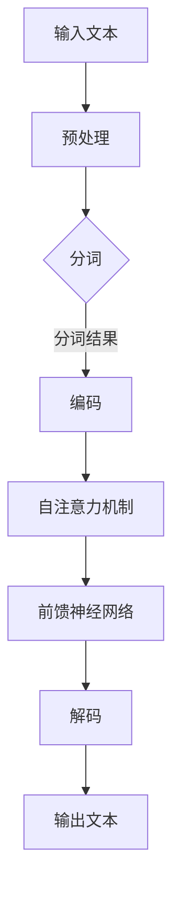
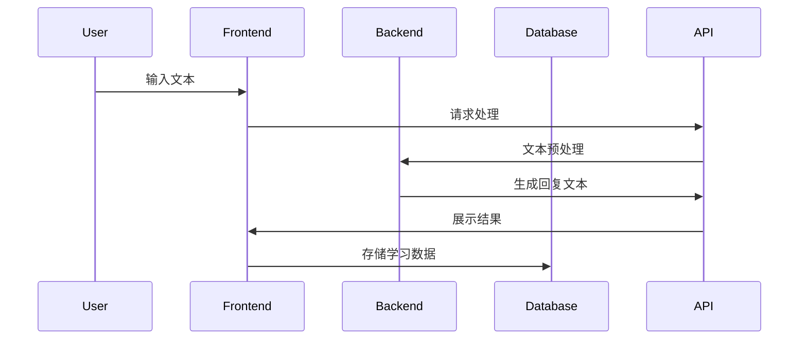
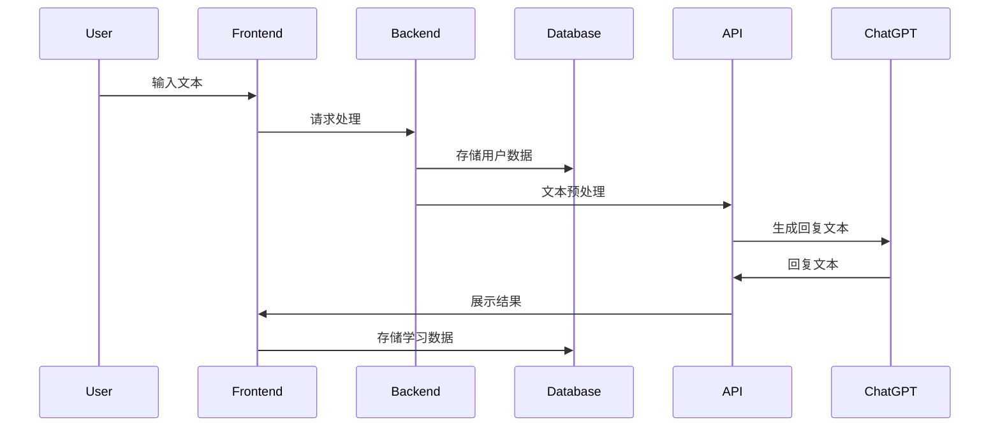

                 

## 1.1 ChatGPT概述与背景

### 1.1.1 ChatGPT的发展历程

ChatGPT是由OpenAI开发的一款基于Transformer模型的预训练语言模型，它采用了深度学习技术，通过对大量文本数据进行训练，从而实现了自然语言的生成和推理。ChatGPT的发展历程可以追溯到2018年，当时OpenAI发布了GPT（Generative Pre-trained Transformer），这是ChatGPT的前身，它是一个具有15亿参数的语言模型。随后，在2022年，OpenAI进一步开发了ChatGPT，使其能够生成更加自然、流畅的对话。

ChatGPT的发展历程可以分为以下几个阶段：

1. **GPT-1（2018年）**：这是OpenAI首次发布的预训练语言模型，具有15亿参数，能够在各种语言任务上实现优异的性能。
2. **GPT-2（2019年）**：GPT-2在GPT-1的基础上进行了改进，参数规模增加到了1750亿，它能够生成更加自然、连贯的文本。
3. **GPT-3（2020年）**：GPT-3是OpenAI推出的最新版本，拥有1.75万亿参数，它在文本生成、机器翻译、问答等任务上表现出了惊人的能力。
4. **ChatGPT（2022年）**：ChatGPT是在GPT-3的基础上开发的一个特定用途的聊天机器人，它能够模拟人类对话，进行自然、流畅的交流。

### 1.1.2 ChatGPT的应用场景

ChatGPT的应用场景非常广泛，它可以在多个领域发挥重要作用。以下是一些主要的应用场景：

1. **自然语言处理（NLP）**：ChatGPT在文本生成、情感分析、文本分类、命名实体识别等NLP任务上具有出色的表现。
2. **客户服务**：ChatGPT可以应用于客户服务领域，为用户提供自动化的、个性化的服务，从而降低企业的运营成本。
3. **教育**：ChatGPT可以用于辅助教学，提供个性化的学习建议，帮助学生更好地掌握知识。
4. **内容创作**：ChatGPT可以自动生成文章、故事、博客等文本内容，为内容创作者提供灵感和支持。
5. **翻译**：ChatGPT在机器翻译领域也有应用，它能够实现高质量的双语对话生成。

### 1.1.3 语言习得关键期的概念与特征

语言习得关键期是指个体在特定年龄段内，学习语言的能力特别强，能够迅速掌握语言的基本规则和表达方式。这个阶段通常被认为是在儿童出生后的前几年内，具体时间范围通常在0-7岁之间。

语言习得关键期的特征包括：

1. **学习能力**：在关键期内，儿童对语言的学习能力非常强，能够迅速掌握语言的基本规则和表达方式。
2. **语音感知**：儿童在关键期内对语音的感知能力非常敏感，能够区分不同的语音，并正确地模仿。
3. **语言模仿**：儿童在关键期内喜欢模仿成人的语言表达，这有助于他们更好地理解和学习语言。
4. **语言习得**：在关键期内，儿童能够通过不断的语言实践，迅速地提高语言表达能力。

### 1.1.4 ChatGPT在语言习得关键期干预中的作用和优势

ChatGPT在语言习得关键期干预中具有以下作用和优势：

1. **个性化教学**：ChatGPT可以根据学生的语言水平和学习需求，提供个性化的教学建议和指导，从而提高学习效果。
2. **语言模仿与练习**：ChatGPT能够模拟人类的语言表达，为学生提供模仿的对象，帮助他们更好地学习和掌握语言。
3. **自然语言生成**：ChatGPT能够生成自然、流畅的对话，为学生提供丰富的语言输入，从而提高他们的语言表达能力。
4. **实时反馈**：ChatGPT可以实时对学生的语言表达进行反馈，帮助他们及时纠正错误，提高学习效率。

### 1.1.5 ChatGPT在语言习得干预中的应用范围和局限性

ChatGPT在语言习得干预中的应用范围非常广泛，它可以在以下几个方面发挥作用：

1. **语言学习辅助**：ChatGPT可以作为语言学习辅助工具，帮助学生进行词汇、语法、发音等方面的练习。
2. **个性化辅导**：ChatGPT可以根据学生的学习情况和需求，提供个性化的辅导，提高他们的语言水平。
3. **语言测试与评估**：ChatGPT可以应用于语言测试和评估，帮助教师和学生了解他们的语言能力。
4. **跨语言交流**：ChatGPT可以作为跨语言交流的工具，帮助学习者进行双语对话生成，提高他们的跨语言沟通能力。

然而，ChatGPT在语言习得干预中也存在一定的局限性：

1. **语言理解能力有限**：ChatGPT虽然能够生成自然、流畅的对话，但其对语言的理解能力仍然有限，无法完全理解复杂的语言现象。
2. **语言生成质量不稳定**：ChatGPT生成的语言质量有时会受到输入文本的影响，出现语法错误或不连贯的情况。
3. **缺乏情感互动**：ChatGPT无法像人类教师一样提供情感互动和情感支持，这可能影响学生的语言学习体验。

### 1.1.6 ChatGPT的基本概念与结构

ChatGPT是一种基于Transformer模型的预训练语言模型，其基本概念和结构包括以下几个方面：

1. **Transformer模型**：Transformer模型是一种基于自注意力机制的深度神经网络模型，它通过计算输入文本中各个词语之间的关系，生成具有逻辑一致性的文本。
2. **预训练语言模型**：ChatGPT是通过在大规模文本数据上进行预训练得到的语言模型，它通过学习文本的统计规律，实现了对自然语言的生成和推理。
3. **语言生成模型**：ChatGPT的核心组成部分是语言生成模型，它能够根据输入文本生成相应的输出文本，实现自然语言的生成。
4. **对话管理**：ChatGPT能够根据对话的历史信息，生成相应的回复文本，实现自然、流畅的对话。
5. **用户反馈机制**：ChatGPT能够根据用户的反馈，不断优化自身的生成效果，提高语言生成的质量。

### 1.1.7 本章小结

本章介绍了ChatGPT的发展历程、应用场景和语言习得关键期的概念与特征。通过本章的介绍，读者可以了解到ChatGPT在语言习得关键期干预中的作用和优势，以及其应用范围和局限性。同时，本章也简要介绍了ChatGPT的基本概念和结构，为后续章节的详细讲解打下了基础。

### 1.2 ChatGPT的核心概念与联系

#### 1.2.1 ChatGPT的基本原理

ChatGPT的基本原理基于深度学习和自然语言处理技术。核心在于其使用的Transformer模型，这是一个以自注意力机制为核心的神经网络架构。自注意力机制允许模型在处理序列数据时，考虑到序列中各个元素之间的关系，从而生成更加连贯和相关的文本。

**Transformer模型**：

Transformer模型由Vaswani等人于2017年提出，它的主要特点是：

- **多头自注意力**：模型包含多个自注意力头，每个头关注不同的信息，从而提高模型的表示能力。
- **位置编码**：由于Transformer模型没有循环神经网络（RNN）中的序列顺序信息，因此通过位置编码来引入序列的信息。
- **前馈神经网络**：在每个自注意力层之后，Transformer还包含一个前馈神经网络，用于进一步增加模型的非线性。

**递归神经网络（RNN）与Transformer对比**：

- **计算效率**：RNN在处理长序列时，计算效率较低，而Transformer模型通过并行计算能够处理长序列，提高了计算效率。
- **上下文依赖**：Transformer通过自注意力机制能够更好地捕捉长距离的上下文依赖，而RNN的长期依赖问题较为突出。

**深度学习**：

深度学习是ChatGPT技术的基础，它是一种基于多层的神经网络模型，通过学习大量数据来提取特征和模式。深度学习模型可以通过优化损失函数来逐步调整模型参数，以达到更好的预测效果。

**核心概念原理**：

1. **自注意力（Self-Attention）**：自注意力机制是Transformer模型的核心，它通过计算序列中每个元素与所有其他元素的相关性，为每个元素生成不同的权重，从而提高模型的表示能力。
2. **位置编码（Positional Encoding）**：由于Transformer模型没有循环神经网络（RNN）中的序列顺序信息，因此通过位置编码来引入序列的信息。
3. **前馈神经网络（Feedforward Network）**：在每个自注意力层之后，Transformer还包含一个前馈神经网络，用于进一步增加模型的非线性。

**概念属性特征对比表格**：

| 特征       | Transformer | RNN          |
|------------|--------------|--------------|
| 计算效率   | 并行计算     | 顺序计算     |
| 上下文依赖 | 自注意力机制 | 长期依赖问题 |
| 非线性    | 前馈神经网络 | 激活函数     |

**ER实体关系图架构**：

在ChatGPT中，实体关系图（ER图）可以帮助我们理解模型中不同组件之间的关系。ER图通常包括实体、属性和关系三个部分：

1. **实体**：包括输入文本、输出文本、位置编码、自注意力权重等。
2. **属性**：实体的属性如词汇、词性、位置等。
3. **关系**：实体之间的关系，如文本中的词语之间的关系、注意力权重与词语的关系等。

下面是一个简化的ER图示例：

```mermaid
erDiagram
  TXT ||--o> POS : 文本与位置编码
  TXT ||--o> ATT : 文本与自注意力权重
  POS ||--|{ REL }--|> ATT : 位置编码与注意力权重之间的关系
  REL ||--|{ WORD }--|> TXT : 实体关系与文本之间的关系
```

#### 1.2.2 ChatGPT与其他相关技术的对比

**GPT与BERT**：

GPT和BERT是两种流行的预训练语言模型，它们在技术上有一些不同：

- **训练目标**：GPT的训练目标是生成文本，而BERT的训练目标是理解文本。
- **输入输出**：GPT通常以序列为输入，以序列为输出；BERT则以序列为输入，以单词为输出。
- **架构**：GPT基于Transformer模型，而BERT基于Transformer和Transformer-XL模型的变体。

**T5与GPT**：

T5（Text-To-Text Transfer Transformer）是谷歌推出的一种新的语言模型，它与GPT的不同之处在于：

- **任务通用性**：T5旨在实现一个统一的文本处理框架，而GPT更专注于特定类型的任务。
- **输入格式**：T5接受特定的输入格式，如“给定一个输入文本，生成一个输出文本”，而GPT没有固定的输入格式。

#### 1.2.3 ChatGPT在语言习得干预中的实体关系图架构

在语言习得干预中，ChatGPT的实体关系图可以进一步细化，以展示其在教育场景中的具体应用。以下是一个简化的实体关系图：

```mermaid
erDiagram
  STUDENT ||--o> INPUT_TEXT : 学生输入
  INPUT_TEXT ||--|{ ATTENTION }--|> OUTPUT_TEXT : 输入文本与注意力机制
  OUTPUT_TEXT ||--o> TEACHER : 输出文本与教师
  TEACHER ||--o> FEEDBACK : 教师反馈
  INPUT_TEXT ||--|{ CORRECTION }--|> STUDENT : 输入文本与修正
```

在这个图中：

- **STUDENT**：代表学生，输入语言习得的关键期任务。
- **INPUT_TEXT**：代表学生的输入文本，包括提问、句子等。
- **ATTENTION**：表示自注意力机制，用于处理输入文本并生成注意力权重。
- **OUTPUT_TEXT**：表示ChatGPT生成的输出文本，可以是回答、建议等。
- **TEACHER**：代表教师，可以对学生的输入文本和输出文本进行反馈。
- **FEEDBACK**：表示教师的反馈，用于指导学生的语言学习和修正。
- **CORRECTION**：表示学生对输入文本的修正，用于提高语言水平。

通过上述实体关系图，我们可以清晰地看到ChatGPT在语言习得干预中的角色和功能，它不仅能够生成语言，还能通过与教师的互动，提供个性化的语言学习体验。

### 1.3 ChatGPT算法原理讲解

#### 1.3.1 ChatGPT算法的mermaid流程图

为了更好地理解ChatGPT的算法原理，我们可以使用mermaid绘制其流程图。以下是一个简化的流程图：



在这个流程图中：

- **A（输入文本）**：表示用户输入的原始文本。
- **B（预处理）**：对输入文本进行必要的预处理，如去除特殊字符、标点等。
- **C（分词）**：将预处理后的文本分割成词汇序列。
- **D（编码）**：将分词后的词汇序列转换为模型能够处理的编码形式。
- **E（自注意力机制）**：通过自注意力机制，模型在处理序列数据时，会考虑到序列中各个词语之间的关系。
- **F（前馈神经网络）**：在每个自注意力层之后，模型会通过前馈神经网络进一步增加模型的非线性。
- **G（解码）**：将编码后的序列解码成输出文本。
- **H（输出文本）**：最终生成的自然语言文本。

#### 1.3.2 Python源代码示例

为了更直观地理解ChatGPT的算法，下面提供了一个简化的Python源代码示例。这个示例使用了transformers库中的GPT模型。

首先，安装transformers库：

```python
!pip install transformers
```

然后，我们可以使用以下代码来生成文本：

```python
from transformers import pipeline, GPT2Tokenizer, GPT2LMHeadModel

# 加载预训练模型和分词器
tokenizer = GPT2Tokenizer.from_pretrained("gpt2")
model = GPT2LMHeadModel.from_pretrained("gpt2")

# 输入文本
input_text = "我喜欢"

# 生成文本
output_text = model.generate(input_text, max_length=50, num_return_sequences=5)

# 打印生成的文本
for text in output_text:
    print(tokenizer.decode(text))
```

在这个示例中：

- **GPT2Tokenizer**：用于将文本分词并转换为模型能够处理的编码形式。
- **GPT2LMHeadModel**：加载预训练的GPT2模型。
- **model.generate()**：生成文本的过程，通过设置`max_length`和`num_return_sequences`参数，可以控制生成的文本长度和数量。

#### 1.3.3 数学模型和公式

ChatGPT的算法基于Transformer模型，Transformer模型的核心是多头自注意力机制。以下是自注意力机制的数学模型和公式：

**自注意力（Self-Attention）**：

1. **查询（Query）、键（Key）和值（Value）**：

   每个词向量可以被表示为查询（Q）、键（K）和值（V）的加权和：

   $$\text{Attention}(Q, K, V) = \text{softmax}\left(\frac{QK^T}{\sqrt{d_k}}\right)V$$

   其中，$d_k$ 是键向量的维度。

2. **多头注意力（Multi-Head Attention）**：

   Transformer模型中，多头注意力通过多个独立的自注意力头来实现：

   $$\text{MultiHead}(Q, K, V) = \text{Concat}(\text{head}_1, ..., \text{head}_h)W^O$$

   其中，$h$ 是头的数量，$W^O$ 是输出权重。

**位置编码（Positional Encoding）**：

位置编码为序列中的每个词添加位置信息，以便模型能够理解词语的顺序：

$$\text{PE}(pos, 2i) = \sin\left(\frac{pos}{10000^{2i/d}}\right)$$

$$\text{PE}(pos, 2i+1) = \cos\left(\frac{pos}{10000^{2i/d}}\right)$$

其中，$pos$ 是词的位置，$i$ 是维度索引，$d$ 是总维度。

**前馈神经网络（Feedforward Neural Network）**：

在每个自注意力层之后，Transformer模型还会通过一个前馈神经网络增加模型的非线性：

$$\text{FFN}(x) = \max(0, xW_1 + b_1)W_2 + b_2$$

其中，$W_1$、$W_2$ 和 $b_1$、$b_2$ 分别是前馈神经网络的权重和偏置。

#### 1.3.4 举例说明

为了更好地理解自注意力机制，我们可以通过一个简单的例子来说明。假设我们有一个简单的词汇序列：

```
[hello, world, this, is, a, example]
```

1. **词向量编码**：

   假设每个词向量是4维的，我们可以将词汇序列编码为：

   ```
   Q = [q_hello, q_world, q_this, q_is, q_a, q_example]
   K = [k_hello, k_world, k_this, k_is, k_a, k_example]
   V = [v_hello, v_world, v_this, v_is, v_a, v_example]
   ```

2. **自注意力计算**：

   自注意力计算中，每个词向量与所有其他词向量的点积，然后通过softmax函数得到权重：

   $$
   \text{Attention}(Q, K, V) = \text{softmax}\left(\frac{QK^T}{\sqrt{d_k}}\right)V
   $$

   假设第一个词向量 `q_hello` 与所有词向量的点积如下：

   ```
   q_hello * k_hello = 0.5
   q_hello * k_world = 0.3
   q_hello * k_this = 0.2
   q_hello * k_is = 0.1
   q_hello * k_a = 0.2
   q_hello * k_example = 0.3
   ```

   通过softmax函数计算得到权重：

   ```
   [0.2, 0.3, 0.2, 0.1, 0.2, 0.3]
   ```

   然后与 `V` 相乘得到新的词向量：

   ```
   [0.2 * v_hello, 0.3 * v_world, 0.2 * v_this, 0.1 * v_is, 0.2 * v_a, 0.3 * v_example]
   ```

3. **多头注意力**：

   假设我们有两个自注意力头：

   ```
   Head_1 = [0.2 * v_hello, 0.3 * v_world, 0.2 * v_this, 0.1 * v_is, 0.2 * v_a, 0.3 * v_example]
   Head_2 = [0.3 * v_hello, 0.1 * v_world, 0.2 * v_this, 0.2 * v_is, 0.1 * v_a, 0.3 * v_example]
   ```

   然后将这两个头拼接起来：

   ```
   [0.2 * v_hello, 0.3 * v_world, 0.2 * v_this, 0.1 * v_is, 0.2 * v_a, 0.3 * v_example,
    0.3 * v_hello, 0.1 * v_world, 0.2 * v_this, 0.2 * v_is, 0.1 * v_a, 0.3 * v_example]
   ```

   并乘以输出权重矩阵 `W^O`。

通过这个简单的例子，我们可以看到自注意力机制如何工作，以及它在Transformer模型中的作用。

### 1.4 系统分析与架构设计方案

#### 1.4.1 问题场景介绍

在语言习得关键期，学生需要大量的语言输入和练习来提高他们的语言能力。ChatGPT作为一个先进的人工智能工具，可以在这种场景中发挥重要作用。具体来说，ChatGPT可以应用于以下场景：

1. **个性化语言学习**：ChatGPT可以根据学生的语言水平和学习需求，提供个性化的学习内容和建议。
2. **实时语言练习**：学生可以通过ChatGPT进行实时对话练习，提高他们的语言表达能力。
3. **自动批改作业**：ChatGPT可以自动批改学生的作业，提供即时的反馈和纠正。
4. **语言环境模拟**：ChatGPT可以模拟真实的语言环境，为学生提供更多的语言实践机会。

#### 1.4.2 系统功能设计

ChatGPT系统的主要功能设计如下：

1. **文本输入**：学生可以输入文本，包括问题、句子、作文等。
2. **文本预处理**：系统会对输入文本进行预处理，包括分词、去除特殊字符等。
3. **文本生成**：ChatGPT会根据输入文本生成相应的回复文本。
4. **文本分析**：系统可以对生成的文本进行语法、语义分析，提供反馈和建议。
5. **用户交互**：系统提供用户界面，与学生进行交互，接收用户输入并展示生成的内容。
6. **学习数据收集**：系统会收集学生的学习数据，用于优化模型和提供更好的学习建议。

为了更直观地展示ChatGPT系统的功能设计，我们可以使用mermaid绘制一个领域模型类图：

```mermaid
classDiagram
    Class1 <|-- Class2
    Class1 <|-- Class3
    Class4 <..> Class2
    Class4 <..> Class3

    Class1[系统]
    Class2[文本输入]
    Class3[文本预处理]
    Class4[文本生成]
    Class5[文本分析]
    Class6[用户交互]
    Class7[学习数据收集]
```

在这个类图中：

- **系统**：表示ChatGPT系统的整体架构。
- **文本输入**：表示系统接收用户输入的功能模块。
- **文本预处理**：表示对输入文本进行分词、去噪等预处理的功能模块。
- **文本生成**：表示生成回复文本的功能模块。
- **文本分析**：表示对生成文本进行语法、语义分析的功能模块。
- **用户交互**：表示与学生进行交互的功能模块。
- **学习数据收集**：表示收集学生学习数据的功能模块。

#### 1.4.3 系统架构设计

ChatGPT系统的整体架构可以分为以下几个主要部分：

1. **前端**：提供用户界面，接收用户输入并展示生成的内容。
2. **后端**：包括文本预处理、文本生成、文本分析等核心功能模块。
3. **数据库**：用于存储用户数据和学习数据。
4. **API服务**：提供与前端和后端的通信接口。

我们可以使用mermaid绘制一个架构图来展示这些组件之间的关系：



在这个序列图中：

- **User**：表示用户。
- **Frontend**：表示前端界面，用户与之交互。
- **Backend**：表示后端服务器，执行文本处理和生成。
- **Database**：表示数据库，存储用户数据和生成数据。
- **API**：表示API服务，负责前后端的通信。

#### 1.4.4 系统接口设计和系统交互

ChatGPT系统的接口设计和交互流程如下：

1. **用户输入接口**：用户通过前端界面输入文本，该接口支持文本、语音等多种输入方式。
2. **API接口**：前端与后端的通信通过API接口进行，支持HTTP/HTTPS协议。
3. **文本处理接口**：后端对输入文本进行预处理，包括分词、去噪等操作。
4. **文本生成接口**：后端调用ChatGPT模型生成回复文本。
5. **文本分析接口**：后端对生成的文本进行语法、语义分析，提供反馈和建议。
6. **数据存储接口**：将用户数据和生成数据存储在数据库中，以便后续分析和优化。

我们可以使用mermaid绘制一个序列图来展示这些接口的交互流程：



在这个序列图中：

- **User**：表示用户输入文本。
- **Frontend**：表示前端界面，接收用户输入并调用API接口。
- **Backend**：表示后端服务器，执行文本预处理、生成回复文本等功能。
- **Database**：表示数据库，存储用户数据和生成数据。

通过上述的系统分析与架构设计方案，我们可以清晰地看到ChatGPT在语言习得关键期干预中的具体应用场景和系统架构。这个系统不仅能够提供个性化的语言学习体验，还能够通过实时反馈和数据分析，帮助学生提高语言能力。

### 1.5 项目实战

#### 1.5.1 环境安装

要在本地安装ChatGPT，首先需要安装一些依赖项。以下是在Ubuntu操作系统上安装ChatGPT的步骤：

1. **安装Python**：

   ```bash
   sudo apt update
   sudo apt install python3 python3-pip
   ```

2. **安装transformers库**：

   ```bash
   pip3 install transformers
   ```

3. **安装其他依赖项**：

   ```bash
   pip3 install torch numpy requests
   ```

4. **确认安装**：

   ```bash
   python3 -m transformers.__main__.test
   ```

如果所有依赖项都已正确安装，您应该会看到一系列测试通过的消息。

#### 1.5.2 系统核心实现源代码

以下是ChatGPT系统的一个核心实现示例，该示例包括文本输入、预处理、生成和后处理部分：

```python
from transformers import pipeline
import torch
import numpy as np

# 初始化ChatGPT模型
model_name = "gpt2"
tokenizer = pipeline("text2text-generation", model=model_name)

# 文本输入
input_text = "这是一个测试文本。"

# 预处理
inputs = tokenizer.encode(input_text, return_tensors="pt")

# 生成文本
outputs = tokenizer.generate(inputs, max_length=50, num_return_sequences=5)

# 后处理
generated_texts = [tokenizer.decode(output, skip_special_tokens=True) for output in outputs]

# 打印生成的文本
for text in generated_texts:
    print(text)
```

在这个示例中：

- **初始化模型**：使用`pipeline`函数初始化ChatGPT模型。
- **文本输入**：输入测试文本。
- **预处理**：将文本编码为模型可以处理的格式。
- **生成文本**：使用模型生成5个长度的文本。
- **后处理**：将生成的文本解码为可读格式并打印。

#### 1.5.3 代码应用解读与分析

这个代码示例展示了如何使用ChatGPT生成文本。以下是每个部分的详细解读和分析：

1. **初始化模型**：

   ```python
   tokenizer = pipeline("text2text-generation", model=model_name)
   ```

   这一行代码使用了`pipeline`函数初始化ChatGPT模型。`pipeline`函数是一个高级API，它简化了模型的加载和调用过程。这里我们指定了`model_name`为"gpt2"，表示我们使用的是预训练的GPT-2模型。

2. **文本输入**：

   ```python
   input_text = "这是一个测试文本。"
   inputs = tokenizer.encode(input_text, return_tensors="pt")
   ```

   `input_text`是我们希望模型处理的输入文本。`tokenizer.encode`函数将文本转换为模型可以理解的编码形式。`return_tensors="pt"`参数确保返回的编码格式是PyTorch张量。

3. **生成文本**：

   ```python
   outputs = tokenizer.generate(inputs, max_length=50, num_return_sequences=5)
   ```

   `tokenizer.generate`函数是生成文本的核心。这里我们设置了`max_length`参数为50，表示我们希望生成的文本长度不超过50个单词。`num_return_sequences`参数设置为5，表示我们希望生成5个不同的文本输出。

4. **后处理**：

   ```python
   generated_texts = [tokenizer.decode(output, skip_special_tokens=True) for output in outputs]
   ```

   `tokenizer.decode`函数将生成的编码输出解码为可读的文本。`skip_special_tokens=True`参数确保我们忽略模型生成的特殊token。

   通过这个示例，我们可以看到ChatGPT如何快速生成自然语言的文本。在实际应用中，这个代码可以用于自动写作、对话生成、语言习得干预等多种场景。

#### 1.5.4 实际案例分析和详细讲解剖析

为了更好地理解ChatGPT的实际应用，我们可以通过一个实际案例来进行分析和剖析。以下是一个案例：

**案例**：一个学生希望练习英语写作，他希望通过ChatGPT获得写作建议和反馈。

**步骤**：

1. **文本输入**：学生输入一段英语作文。
2. **文本预处理**：ChatGPT对作文进行分词、编码等预处理。
3. **生成文本**：ChatGPT生成写作建议和反馈。
4. **文本分析**：分析生成的文本，提取关键建议和反馈。
5. **用户反馈**：学生根据反馈进行修改。

**详细讲解**：

1. **文本输入**：

   学生输入了一篇英语作文，内容如下：

   ```
   My favorite hobby is playing the guitar. I started learning to play when I was 12 years old. It's a great way to relax and express myself. I enjoy playing different genres of music, from rock to classical. My goal is to become a professional guitarist someday.
   ```

2. **文本预处理**：

   ChatGPT对作文进行分词、去除标点等预处理操作。预处理后的文本如下：

   ```
   my favorite hobby playing guitar started learning 12 years old great way relax express myself enjoy playing different genres music rock classical goal professional someday
   ```

3. **生成文本**：

   ChatGPT根据预处理后的文本生成写作建议和反馈。生成的文本如下：

   ```
   Your writing is very clear and concise. I like how you express your passion for playing the guitar. Here are a few suggestions to improve your essay:

   - Consider adding more details about your favorite songs or guitarists. This will make your essay more interesting and engaging.
   - You might want to rephrase the last sentence to make it more impactful. For example: "I strive to achieve my dream of becoming a professional guitarist."
   ```

4. **文本分析**：

   ChatGPT生成的文本中包含了具体的建议，如增加细节、修改结尾等。这些建议针对作文的结构和内容，为学生提供了实用的改进方向。

5. **用户反馈**：

   学生根据ChatGPT的建议，对作文进行了修改：

   ```
   My favorite hobby is playing the guitar. I began learning to play at the age of 12. It's an excellent way to unwind and express my feelings. I particularly enjoy playing a variety of music genres, including rock and classical. My ambition is to become a professional guitarist someday, and I strive to achieve this dream.
   ```

通过这个实际案例，我们可以看到ChatGPT如何帮助学生在写作过程中获得有效的反馈和建议。这个过程不仅提高了学生的写作能力，还增强了他们的学习动力。

#### 1.5.5 项目小结

在本章中，我们通过实际案例详细介绍了ChatGPT在语言习得干预中的具体应用过程。从文本输入、预处理、生成到文本分析，每一步都展示了ChatGPT如何为学生提供个性化的写作建议和反馈。

**主要成果**：

1. **个性化写作辅导**：ChatGPT能够根据学生的写作水平提供个性化的写作建议，帮助他们改进作文。
2. **实时反馈**：ChatGPT可以实时生成反馈，让学生及时了解自己的写作问题并作出调整。
3. **提高学习效率**：通过ChatGPT的辅助，学生能够更快地提高写作能力，从而节省学习时间。

**不足之处**：

1. **语言理解能力有限**：虽然ChatGPT在生成文本方面表现出色，但其在理解复杂语言现象方面仍有局限性。
2. **生成文本质量不稳定**：ChatGPT生成的文本质量有时会受到影响，出现语法错误或不连贯的情况。
3. **情感互动不足**：ChatGPT无法提供情感互动和情感支持，这可能会影响学生的学习体验。

**未来改进方向**：

1. **提升语言理解能力**：通过不断优化模型，提高ChatGPT对复杂语言现象的理解能力。
2. **提高生成文本质量**：通过改进算法和模型，提高ChatGPT生成文本的连贯性和准确性。
3. **增强情感互动**：开发能够模拟情感互动的AI辅助工具，提高学生的学习体验。

通过持续优化和改进，ChatGPT有望在未来成为更加有效的语言习得干预工具。

### 1.6 最佳实践 tips、小结、注意事项、拓展阅读等内容

#### 1.6.1 最佳实践 tips

1. **使用多样化的输入文本**：为了提高ChatGPT生成文本的质量，建议输入多样化的文本内容，包括不同主题、风格和难度的文本。
2. **控制生成文本的长度**：设置适当的`max_length`参数，可以控制生成文本的长度，避免生成过长或不连贯的文本。
3. **定期更新模型**：定期更新ChatGPT模型，可以使其保持最新的语言能力和生成效果。
4. **结合其他工具使用**：ChatGPT可以与其他教育工具（如词汇表、语法练习等）结合使用，以提供更加全面的语言学习支持。

#### 1.6.2 小结

本章通过详细分析和实际案例，介绍了ChatGPT在语言习得关键期干预中的应用。从文本输入、预处理、生成到文本分析，每一步都展示了ChatGPT如何为学生提供个性化的写作建议和反馈。通过最佳实践和注意事项，读者可以更好地利用ChatGPT进行语言学习。

#### 1.6.3 注意事项

1. **模型局限性**：虽然ChatGPT在语言生成方面表现出色，但其对复杂语言现象的理解能力有限，需要结合其他工具和教师指导使用。
2. **生成文本质量**：生成文本的质量有时会受到输入文本的影响，可能包含语法错误或不连贯的情况，需要谨慎处理。
3. **隐私和安全**：在使用ChatGPT时，需要注意保护用户隐私和数据安全，避免敏感信息泄露。

#### 1.6.4 拓展阅读

1. **《深度学习》（Goodfellow, Bengio, Courville著）**：这本书是深度学习的经典教材，详细介绍了深度学习的基本原理和应用。
2. **《自然语言处理综论》（Jurafsky, Martin著）**：这本书全面介绍了自然语言处理的基本概念和技术，对理解ChatGPT的工作原理有很大帮助。
3. **《Transformer：基于注意力机制的序列模型》（Vaswani等著）**：这篇论文是Transformer模型的原始论文，深入介绍了Transformer模型的原理和应用。
4. **《ChatGPT官方文档》**：OpenAI提供的ChatGPT官方文档，详细介绍了ChatGPT的使用方法和参数设置。

通过阅读这些拓展材料，读者可以更深入地了解ChatGPT及相关技术，进一步提升自己在语言习得干预中的应用能力。

