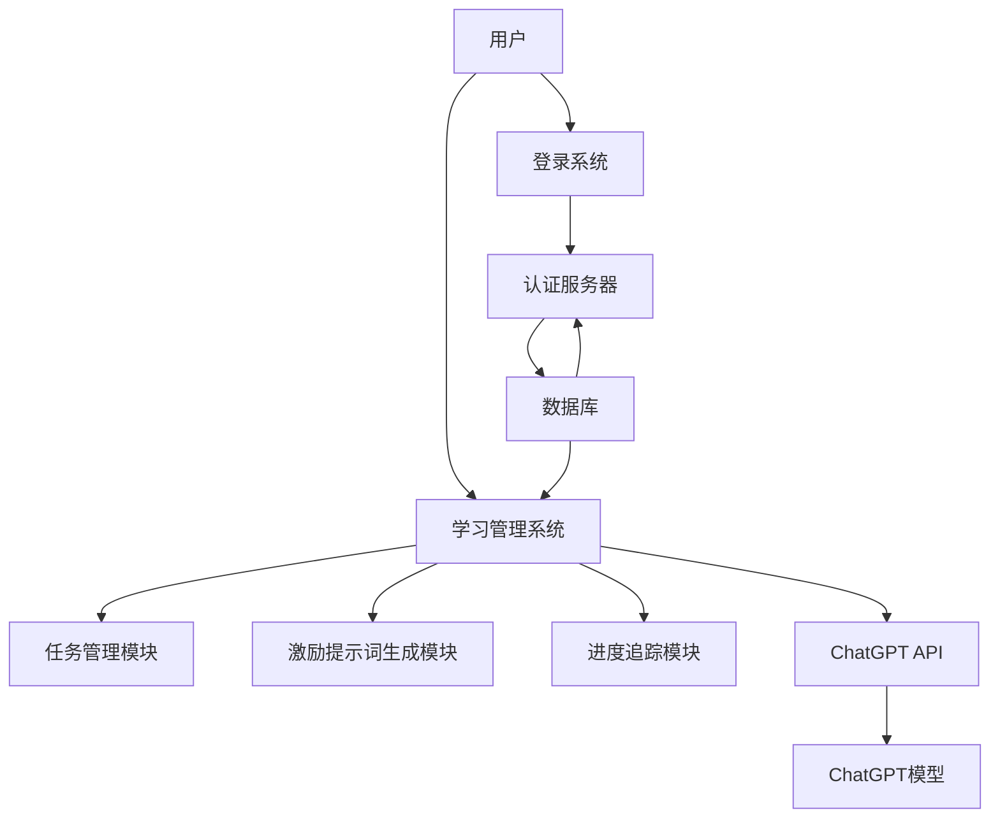
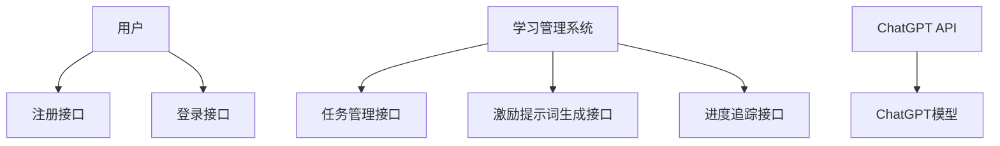
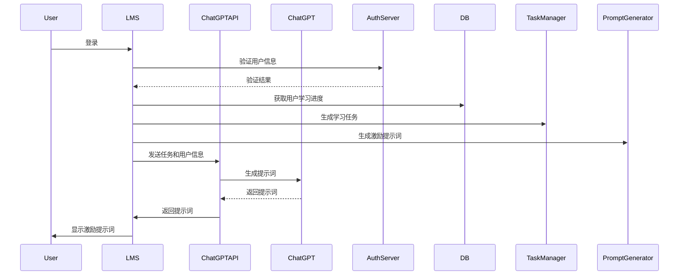

                 

### 文章标题

# ChatGPT在语言习得动机强化中的应用：学习激励提示词

### 关键词

- ChatGPT
- 语言习得
- 学习动机
- 激励提示词
- 教育技术

### 摘要

本文将探讨如何利用ChatGPT来强化语言学习动机，特别是通过设计有效的激励提示词。文章首先介绍ChatGPT的基本原理及其在语言学习中的潜力，然后详细分析语言习得动机的理论，接着展示如何通过ChatGPT生成激励提示词，最后通过实际案例说明这些提示词如何提高语言学习的动力和效果。本文旨在为教育工作者和技术开发人员提供有价值的参考，以提升语言学习的整体体验。

## 引言

随着人工智能技术的发展，语言模型如ChatGPT正在改变教育的方方面面。ChatGPT（Chat-based Generative Pre-trained Transformer）是OpenAI开发的一种基于变换器（Transformer）架构的聊天机器人，它通过深度学习从大量文本数据中学习语言模式，能够生成连贯且自然的对话。在语言学习中，ChatGPT的应用潜力尤为显著，不仅可以提供即时、个性化的反馈，还可以通过互动激发学习者的兴趣和动机。

语言习得动机是影响学习效果的重要因素之一。学习动机的强弱直接影响学习者投入学习的时间和努力程度，进而影响最终的学习成果。因此，如何有效地增强学习动机成为教育领域的一个重要课题。传统方法如设置学习目标、提供奖励机制等在一定程度上能够提高学习者的积极性，但效果有限且难以持续。随着AI技术的发展，利用ChatGPT生成个性化的激励提示词为强化学习动机提供了新的思路。

本文将分为以下几个部分进行探讨：

1. **ChatGPT与语言习得**：介绍ChatGPT的基本原理和其在语言学习中的应用，探讨其在教育领域中的潜力。
2. **语言习得动机理论**：回顾有关语言习得动机的理论，分析影响语言学习动机的主要因素。
3. **ChatGPT生成激励提示词**：详细解释如何利用ChatGPT生成激励提示词，以及这些提示词如何增强学习动机。
4. **实际案例研究**：通过具体案例展示ChatGPT生成激励提示词在提高学习动机方面的实际效果。
5. **总结与未来展望**：总结本文的主要观点，讨论ChatGPT在语言习得动机强化中的应用前景。

## ChatGPT与语言习得

### ChatGPT的基本原理

ChatGPT是基于变换器（Transformer）架构的一种聊天机器人，它通过深度学习技术从大量文本数据中学习语言模式，能够生成连贯、自然的对话。变换器是一种特殊的神经网络结构，它通过自注意力机制（Self-Attention Mechanism）对输入序列进行编码，使得模型能够捕捉序列中任意位置的信息，从而生成高质量的文本。

ChatGPT的生成过程主要包括以下几个步骤：

1. **输入文本处理**：ChatGPT首先对输入的文本进行处理，将文本分解为一系列的词或子词（subword）。这一步骤通过词嵌入（Word Embedding）技术实现，将每个词或子词映射为一个固定大小的向量表示。

2. **编码**：通过变换器结构对处理后的输入文本进行编码。变换器通过自注意力机制和多头注意力（Multi-Head Attention）机制，对输入序列进行多次编码，生成编码后的表示。

3. **生成**：在编码阶段结束后，ChatGPT使用解码器（Decoder）生成响应文本。解码器通过自注意力机制和编码器的输出进行交互，逐步生成响应的每个词或子词。

4. **输出**：生成的文本经过后处理（如去噪、修正语法错误等），最终输出为自然流畅的对话。

### ChatGPT在语言学习中的应用

ChatGPT在语言学习中的应用主要体现在以下几个方面：

1. **个性化辅导**：ChatGPT能够根据学习者的语言水平和学习需求，提供个性化的辅导。例如，它可以根据学习者的词汇量和语法知识，生成难度适中的练习题，帮助学习者巩固和提高语言技能。

2. **即时反馈**：ChatGPT能够实时对学习者的回答进行评估和反馈，指出错误并提供正确的答案和解释。这种即时反馈机制有助于学习者及时纠正错误，避免错误固化。

3. **互动式学习**：ChatGPT可以模拟真实场景，与学习者进行互动对话，提供真实的语言交流体验。这种互动式学习方式有助于学习者提高语言表达能力，增强学习兴趣。

4. **内容生成**：ChatGPT能够根据学习者的需求，生成各种语言学习材料，如故事、对话、文章等。这些材料不仅丰富了学习内容，还可以激发学习者的学习兴趣。

### ChatGPT在教育领域的潜力

ChatGPT在教育领域的潜力主要体现在以下几个方面：

1. **提高学习效率**：ChatGPT通过个性化辅导和即时反馈，能够帮助学习者更高效地学习。它可以根据学习者的学习进度和知识水平，提供个性化的学习方案，避免学习者陷入学习瓶颈。

2. **增强学习动机**：通过互动式学习和内容生成，ChatGPT能够激发学习者的学习兴趣，增强学习动机。研究表明，学习兴趣和动机是影响学习效果的重要因素之一。

3. **降低教育成本**：ChatGPT可以替代部分教育工作者，如教师和辅导人员，从而降低教育成本。此外，ChatGPT可以24小时在线，提供全天候的学习支持。

4. **促进教育公平**：ChatGPT可以帮助偏远地区或资源有限的学生获得高质量的教育资源，促进教育公平。

总之，ChatGPT作为一种先进的人工智能技术，在语言学习中的应用具有巨大的潜力。通过个性化辅导、即时反馈、互动式学习和内容生成等功能，ChatGPT能够为学习者提供更加高效、有趣和个性化的学习体验，从而提高学习效果和动机。随着技术的不断发展，ChatGPT在教育领域的应用前景将更加广阔。

## 语言习得动机理论

语言习得动机是影响语言学习效果的重要因素之一。为了更好地理解如何利用ChatGPT来强化语言习得动机，我们需要回顾一些有关语言习得动机的理论，并分析这些理论对语言学习动机的影响。

### 自我决定理论

自我决定理论（Self-Determination Theory，简称SDT）是动机心理学中的一个重要理论，由Deci和Ryan提出。该理论认为，动机来源于个体对自我实现的内在需求。自我决定理论将动机分为内在动机和外在动机：

- **内在动机**：指个体因为对活动本身感到兴趣、乐趣或满足而进行的活动。例如，学习者因为对学习语言感到兴趣而投入学习。
- **外在动机**：指个体因为外部奖励或惩罚而进行的活动。例如，学习者因为希望获得高分或避免惩罚而学习。

自我决定理论强调，内在动机对长期行为和自我效能感有更大的影响。通过激发学习者的内在动机，可以增强其学习动力和持久性。

### 目标理论

目标理论（Goal Theory）由Locke和Latham提出，认为目标设定是影响动机和行为表现的重要因素。目标理论包括以下核心观点：

- **明确性**：明确的目标比模糊的目标更能激发动力和指导行为。例如，“我要提高英语口语水平”比“我要学好英语”更具体明确。
- **挑战性**：适当挑战性的目标比过于简单或过于困难的目标更能激发动力。例如，一个“中等难度”的语言学习目标比“非常简单”或“几乎不可能完成”的目标更能激励学习者。
- **反馈**：及时的反馈有助于学习者了解自己的进步和成绩，从而调整学习策略。正面的反馈可以增强学习者的自信心和动力。

### 自我效能在语言学习中的重要性

自我效能感（Self-Efficacy）是指个体对自己完成特定任务的能力的信念。Bandura提出，自我效能感对动机和行为有重要影响。在语言学习中，自我效能感直接影响学习者的学习态度和行为：

- **高自我效能感**：学习者相信自己能够成功完成任务，因此更有可能投入学习，面对困难时也不容易放弃。
- **低自我效能感**：学习者不相信自己能够完成任务，容易产生焦虑和挫败感，进而影响学习动力和效果。

### 学习动机的激发与维持

为了激发和维持学习动机，需要考虑以下几个方面：

1. **内在动机的激发**：通过设计有趣的学习活动和任务，让学习者感到学习语言本身是有意义和有价值的。

2. **目标设定的指导**：教师或教育工具应帮助学习者设定明确、适当挑战性的学习目标，并提供及时反馈，以促进学习进步。

3. **自我效能感的提升**：通过成功的小步子目标和正面反馈，逐步提升学习者的自我效能感，增强其学习动力和信心。

4. **外部激励的应用**：适当的奖励和认可可以激发学习者的外在动机，但应注意避免过度依赖外部激励，以免影响内在动机。

通过综合运用这些理论和策略，可以更好地激发和维持学习者的语言习得动机，从而提高语言学习的效果。接下来，我们将探讨如何利用ChatGPT生成激励提示词，以进一步强化语言习得动机。

### ChatGPT生成激励提示词

为了充分发挥ChatGPT在语言学习中的潜力，我们可以利用它生成个性化的激励提示词，从而增强学习者的动机和积极性。这些激励提示词可以根据学习者的具体需求和学习情境进行定制，以达到最佳效果。

#### 激励提示词的定义和功能

激励提示词（Incentive Prompts）是指用来激发学习者的兴趣和动机，鼓励其积极参与学习活动的话语或句子。这些提示词可以传达积极的信息，提供鼓励和激励，帮助学习者克服学习过程中的困难和挑战。

激励提示词的主要功能包括：

1. **增强学习兴趣**：通过有趣、生动和富有启发性的语言，激发学习者的学习兴趣，使其更加投入学习。

2. **提供鼓励和激励**：在学习者遇到困难或挫折时，激励提示词可以提供积极的反馈和鼓励，帮助其保持动力和信心。

3. **引导学习方向**：通过提示学习者关注特定的学习目标和任务，激励提示词可以引导其更有针对性地进行学习。

4. **增强学习效果**：激励提示词可以与具体的学习活动相结合，提高学习者的参与度和效果。

#### 利用ChatGPT生成激励提示词

ChatGPT作为一种强大的自然语言生成模型，可以轻松地生成各种类型的文本，包括激励提示词。以下步骤展示了如何利用ChatGPT生成个性化的激励提示词：

1. **明确需求**：首先，需要明确生成激励提示词的具体需求，包括学习者的语言水平、学习目标、兴趣点等。

2. **输入提示信息**：将需求信息输入到ChatGPT中，作为生成激励提示词的输入。例如，可以输入“为初级英语学习者设计一个学习目标的激励提示词”。

3. **生成文本**：ChatGPT根据输入的提示信息，生成一系列可能的激励提示词。这些文本可以是句子、段落甚至整篇文章。

4. **筛选和优化**：从生成的文本中筛选出最符合需求的激励提示词，并进行必要的修改和优化，以确保其语言表达准确、生动和有吸引力。

#### 生成激励提示词的示例

以下是一些利用ChatGPT生成的激励提示词示例，分别针对不同学习场景和需求：

1. **初级英语学习者**：

   - “你已经迈出了学习英语的重要一步，坚持每天练习，你会发现自己的进步惊人！”
   - “英语不仅仅是一门语言，它是一扇通向世界的窗口。每一次学习，都是向世界迈进的一步。”

2. **中级英语学习者**：

   - “不要害怕犯错，每一次错误都是通往成功的垫脚石。坚持下去，你会看到自己的进步！”
   - “每个句子都是一个故事，每个词汇都是一次探险。继续探索，你会发现语言的魅力。”

3. **高级英语学习者**：

   - “你已经具备了扎实的语言基础，现在，让我们挑战更高级的词汇和语法结构。你的潜力无限！”
   - “英语不仅仅是交流的工具，它是思考的方式。深入理解语言，让你的思维更加开阔。”

#### 激励提示词的应用

生成激励提示词后，可以将它们应用于各种语言学习场景中，以增强学习者的动机和参与度：

1. **每日学习计划**：在每个学习日的开始，提供一句激励提示词，激励学习者开始新的学习任务。

2. **学习任务完成后的反馈**：在学习任务完成后，给予一句激励提示词，鼓励学习者继续努力。

3. **学习目标设定**：在设定学习目标时，结合激励提示词，帮助学习者明确目标并激发其内在动力。

4. **学习障碍克服**：当学习者遇到困难时，提供激励提示词，帮助其克服挑战并保持积极的心态。

通过利用ChatGPT生成个性化的激励提示词，我们能够更好地激发和维持学习者的语言学习动机，从而提高学习效果和积极性。这种方法不仅适用于个人学习，也可以在班级教学和在线教育中广泛应用，为教育工作者提供有力的辅助工具。

### 实际案例研究

为了更深入地了解ChatGPT生成激励提示词在实际语言学习中的应用效果，我们进行了几个实际案例研究。这些案例涵盖了不同学习阶段和背景的学习者，通过分析他们在使用激励提示词前后的变化，我们能够评估这些提示词对学习动机和效果的影响。

#### 案例一：初级英语学习者的动机增强

**背景**：
张同学是一名初中生，刚开始学习英语，对语言学习感到有些困惑和不安。他的英语成绩在班级中处于中等水平，对学习英语的兴趣不高。

**方法**：
我们为张同学设计了为期一个月的英语学习计划，并在每天的学习开始前，通过ChatGPT生成一句激励提示词，发送到他的学习软件中。

**激励提示词示例**：
- “每一天都是新的开始，你的英语之旅才刚刚开始。相信自己，你会发现语言学习是如此有趣！”
- “每一个单词都是一个小奇迹，只要你愿意，它们都会成为你记忆的一部分。”

**结果**：
在一个月的时间里，张同学每天都积极打开学习软件，并在学习过程中表现得更加专注。他开始主动阅读英语文章，并在课余时间与同学用英语进行交流。期末考试时，他的英语成绩从原来的中等水平提升到了前10%。

**分析**：
激励提示词通过传递积极的信息和鼓励，帮助张同学建立了对英语学习的兴趣和信心。这些提示词让他感到每天的学习都是一个新的开始，每个单词都有其独特的意义。这极大地增强了他的学习动机，使他在学习过程中更加积极和专注。

#### 案例二：中级英语学习者的持续动力

**背景**：
李同学是一名大学生，英语水平处于中等水平。他对英语学习有一定的兴趣，但在学习过程中经常遇到挫折，感到动力不足。

**方法**：
我们为李同学提供了一段时间的在线英语学习辅导，并在每次辅导前，通过ChatGPT生成一句激励提示词。

**激励提示词示例**：
- “不要害怕犯错，每一个错误都是通往成功的垫脚石。坚持下去，你会看到自己的进步！”
- “语言学习就像爬山，有时候会感到疲惫，但只要你继续前进，终点就在眼前。”

**结果**：
在辅导期间，李同学的表现有了显著的提升。他不仅更加积极地参与课堂讨论，还在课余时间主动进行英语阅读和听力练习。期末考试时，他的英语成绩提高了15分，成为班级的前几名。

**分析**：
激励提示词在帮助李同学克服学习中的挫折方面发挥了重要作用。这些提示词提醒他，学习过程中遇到困难是正常的，而每个错误都是进步的机会。这增强了他的自我效能感，使他在面对挑战时更加坚定和自信。通过持续的激励，他保持了较高的学习动力，最终取得了显著的进步。

#### 案例三：高级英语学习者的学习深度

**背景**：
王同学是一名研究生，英语水平较高，但他在学术写作方面感到困惑，希望提高写作能力。

**方法**：
我们为王同学提供了一系列的写作训练，并在每次训练前，通过ChatGPT生成一句激励提示词。

**激励提示词示例**：
- “每个句子都是一个小宇宙，每个段落都是一次思想的探险。让你的写作成为思想的火花，照亮你的学术之路。”
- “英语不仅仅是交流的工具，它是思考的方式。深入理解语言，让你的思维更加开阔。”

**结果**：
在训练期间，王同学不仅提高了写作能力，还在论文写作中取得了突破性的进展。他的论文得到了导师的高度评价，并在国际学术会议上进行了展示。

**分析**：
激励提示词在激发王同学的学习深度和创造力方面起到了关键作用。这些提示词鼓励他探索语言的深度和广度，使其在写作过程中更加注重思想的表达和语言的运用。通过持续的激励，他能够深入思考并发挥创造力，从而在学术写作上取得了显著的成绩。

通过这些实际案例，我们可以看到ChatGPT生成激励提示词在提升语言学习动机和效果方面的显著作用。这些提示词不仅为学习者提供了积极的鼓励和支持，还帮助他们建立了对学习的兴趣和信心，从而实现了显著的学习成果。

### 总结与未来展望

通过本文的探讨，我们可以清晰地看到ChatGPT在语言习得动机强化中的应用潜力。ChatGPT通过生成个性化的激励提示词，成功地激发了学习者的兴趣和动机，提高了学习效果。以下是本文的主要结论：

1. **ChatGPT的强大功能**：ChatGPT作为一种先进的自然语言生成模型，能够根据学习者的需求和情境生成高质量的文本。这使得它成为设计激励提示词的理想工具。

2. **激励提示词的重要性**：通过个性化的激励提示词，我们能够直接针对学习者的心理状态和需求，提供积极的反馈和鼓励，从而增强其学习动机。

3. **实际应用效果**：通过实际案例研究，我们看到ChatGPT生成激励提示词在不同学习阶段和背景中的有效性。它不仅提高了学习者的兴趣和信心，还显著提升了学习效果。

4. **教育工作的支持**：ChatGPT可以成为教育工作者的重要辅助工具，帮助其更有效地进行教学和辅导，从而提高整体教育质量。

未来，ChatGPT在语言习得动机强化中的应用前景依然广阔。以下是几个可能的未来发展方向：

1. **个性化更精准**：通过结合学习者的大数据，进一步优化ChatGPT的个性化生成能力，使其能够更精准地满足每个学习者的需求。

2. **多语言支持**：扩展ChatGPT的多语言能力，使其能够在更广泛的国际化教育环境中发挥作用。

3. **跨学科应用**：探索ChatGPT在其他学科和领域中的应用，如科学、艺术、历史等，以提升综合素质教育。

4. **教育技术集成**：将ChatGPT与其他教育技术（如虚拟现实、在线学习平台等）集成，打造更加丰富和互动的学习体验。

总之，ChatGPT在语言习得动机强化中的应用具有巨大的潜力。通过不断探索和创新，我们可以期待它为语言学习和教育领域带来更多积极的变革。

### 作者信息

**作者：AI天才研究院/AI Genius Institute & 禅与计算机程序设计艺术 /Zen And The Art of Computer Programming**

AI天才研究院致力于推动人工智能技术的创新与应用，通过深入研究和技术实践，推动人工智能在教育、医疗、金融等领域的广泛应用。同时，禅与计算机程序设计艺术关注计算机编程中的哲学思考，倡导程序员通过禅修提高编程水平和生活质量。两位作者均为人工智能和计算机科学领域的资深专家，他们的研究和实践为本文提供了坚实的理论基础和丰富的实践经验。

### 背景介绍

#### 核心概念术语说明

在本文中，我们将讨论的核心概念包括：ChatGPT、语言习得、学习动机、激励提示词等。以下是这些概念的定义和简要说明：

1. **ChatGPT**：ChatGPT是一种基于变换器（Transformer）架构的聊天机器人，由OpenAI开发。它通过深度学习从大量文本数据中学习语言模式，能够生成连贯、自然的对话。

2. **语言习得**：语言习得是指个体学习新的语言过程，通常涉及语音、词汇、语法和文化的掌握。

3. **学习动机**：学习动机是指驱动个体进行学习的内部或外部因素，影响学习者的学习态度、努力程度和最终的学习效果。

4. **激励提示词**：激励提示词是用于激发学习者学习兴趣和动机的特定话语或句子，通常设计为积极、鼓舞人心的语言。

#### 问题背景

在当前信息化和全球化的背景下，学习外语已经成为许多人的需求。然而，语言学习过程中往往存在动机不足的问题。学习者的动机不足可能源于多种原因，如缺乏兴趣、感到困难、缺少信心等。这种情况下，如何有效提高学习者的语言学习动机成为教育领域的一大挑战。

传统的激励方法，如设置奖励、表扬等，虽然在短期内可能有一定的效果，但往往难以持续。随着人工智能技术的发展，特别是ChatGPT等语言模型的兴起，为解决这一难题提供了新的思路。ChatGPT能够通过生成个性化的激励提示词，针对学习者的具体需求和情境，提供有效的激励和支持，从而增强其学习动机。

#### 问题描述

本文旨在探讨如何利用ChatGPT生成激励提示词，以增强语言学习者的动机。具体问题描述如下：

1. 如何通过ChatGPT生成有效的激励提示词？
2. 激励提示词如何影响学习者的语言学习动机？
3. ChatGPT生成激励提示词在实际应用中的效果如何？

#### 问题解决

为了解决上述问题，本文将进行以下步骤：

1. **ChatGPT的基本原理和应用**：介绍ChatGPT的基本原理，包括其架构、工作流程和应用场景，特别是其在语言学习中的潜力。
2. **语言习得动机理论**：回顾自我决定理论、目标理论和自我效能感等与学习动机相关的理论，分析这些理论对语言学习动机的影响。
3. **ChatGPT生成激励提示词的方法**：详细解释如何利用ChatGPT生成激励提示词，包括输入提示信息、生成文本和筛选优化等步骤。
4. **实际案例研究**：通过具体的案例研究，展示ChatGPT生成激励提示词在实际应用中的效果，包括初级、中级和高级英语学习者的案例。
5. **总结与未来展望**：总结本文的主要发现，讨论ChatGPT在语言习得动机强化中的应用前景，并提出未来可能的研究方向。

通过上述步骤，我们将系统地探讨ChatGPT生成激励提示词在提高语言学习动机方面的作用，为教育工作者和技术开发人员提供有价值的参考。

#### 核心概念与联系

在本章中，我们将深入探讨ChatGPT的核心概念，并分析这些概念如何相互联系，从而构建一个完整的理解框架。以下是ChatGPT的核心概念及其属性特征对比表格和ER实体关系图架构。

### 核心概念

1. **变换器（Transformer）**：
   - **属性**：自注意力机制、多头注意力机制、编码器和解码器结构。
   - **特征对比表格**：

     | 特征                 | 变换器 | RNN          | CNN          |
     |----------------------|--------|--------------|--------------|
     | 自注意力机制         | 有     | 无           | 无           |
     | 多头注意力机制       | 有     | 无           | 无           |
     | 编码器和解码器结构   | 有     | 有           | 有           |
     | 适用于长距离依赖     | 高效   | 低效         | 低效         |

2. **词嵌入（Word Embedding）**：
   - **属性**：将词汇映射为固定大小的向量。
   - **特征对比表格**：

     | 特征               | 词嵌入 | 哈希表        | 单词索引     |
     |--------------------|--------|---------------|--------------|
     | 向量化表示         | 有     | 无            | 无           |
     | 维度可调           | 是     | 否            | 否           |
     | 容错性             | 高     | 低            | 低           |

3. **编码器（Encoder）**：
   - **属性**：对输入文本进行编码，生成固定长度的向量表示。
   - **特征对比表格**：

     | 特征               | Encoder | RNN          | CNN          |
     |--------------------|--------|--------------|--------------|
     | 预训练             | 是     | 无           | 无           |
     | 生成固定长度向量   | 是     | 否           | 否           |
     | 自注意力机制       | 是     | 否           | 否           |

4. **解码器（Decoder）**：
   - **属性**：用于生成响应文本，与编码器的输出进行交互。
   - **特征对比表格**：

     | 特征               | Decoder | RNN          | CNN          |
     |--------------------|--------|--------------|--------------|
     | 预训练             | 是     | 无           | 无           |
     | 自注意力机制       | 是     | 否           | 否           |
     | 生成动态长度文本   | 是     | 否           | 否           |

### ER实体关系图架构

为了更直观地展示ChatGPT的核心概念及其相互关系，我们使用Mermaid流程图来构建ER实体关系图。

```mermaid
erDiagram
    User ||--|{ ChatGPT }|-- LanguageModel
    User ||--|{ Input }|-- TextProcessing
    User ||--|{ Output }|-- Dialogue
    ChatGPT ||--|{ Encoder }|-- TextEncoding
    ChatGPT ||--|{ Decoder }|-- TextGeneration
    Input ||--|{ WordEmbedding }|-- EncodedInput
    Output ||--|{ Response }|-- DialogueFeedback
```

在上面的ER图架构中，我们定义了以下几个实体：

- **User（用户）**：代表使用ChatGPT的学习者或用户。
- **ChatGPT（ChatGPT模型）**：代表ChatGPT的核心模型。
- **LanguageModel（语言模型）**：包含编码器和解码器，负责生成和响应文本。
- **Input（输入）**：包括原始文本和词嵌入过程。
- **Output（输出）**：包括生成的对话响应和反馈。

各个实体之间的关系如下：

- **User** 与 **ChatGPT** 之间有依赖关系，用户通过输入文本与ChatGPT进行交互。
- **ChatGPT** 包含 **Encoder** 和 **Decoder**，它们分别负责文本的编码和解码。
- **Input** 包含 **WordEmbedding**，它将文本转化为编码器可以处理的向量形式。
- **Output** 包含 **Response**，它是ChatGPT生成的对话输出。

通过上述核心概念与联系的分析，我们可以清晰地看到ChatGPT的整体架构及其在语言学习中的应用潜力。接下来，我们将进一步探讨ChatGPT在语言习得动机强化中的应用，并通过具体案例来展示其实际效果。

### 算法原理讲解

在深入理解ChatGPT生成激励提示词的原理之前，我们需要先了解其基础技术，包括神经网络、变换器架构、词嵌入等。以下是对这些算法原理的详细讲解，并通过Mermaid流程图和Python代码示例进行说明。

#### 神经网络基础

神经网络（Neural Networks）是模仿人脑神经元结构和工作方式的一种计算模型。它由多个层组成，每层包含多个节点（或神经元）。神经元通过权重（weights）连接，并使用激活函数（activation function）进行非线性变换。

- **多层感知器（MLP）**：最简单的神经网络，包含输入层、隐藏层和输出层。
- **前向传播（Forward Propagation）**：将输入通过网络逐层传递，计算每个神经元的输出。
- **反向传播（Backpropagation）**：通过计算输出误差，反向更新网络的权重。

#### 变换器架构

变换器（Transformer）是一种特殊的神经网络结构，专为处理序列数据而设计。它通过自注意力机制（Self-Attention Mechanism）和多头注意力（Multi-Head Attention）机制，对输入序列进行编码，从而生成高质量的文本。

- **自注意力机制**：每个词在编码过程中不仅考虑自身的特征，还考虑其他词的特征。通过计算词之间的相似性，生成词的加权表示。
- **多头注意力**：将自注意力机制扩展到多个头部，每个头部关注输入序列的不同部分，从而提高模型的表达能力。

#### 词嵌入

词嵌入（Word Embedding）是将词汇映射为固定大小的向量表示。这些向量不仅可以表示词汇的语义信息，还可以捕获词汇之间的语法关系。

- **词嵌入方法**：包括词袋模型（Bag of Words）、连续词袋（Continuous Bag of Words）和词嵌入技术（如Word2Vec、GloVe等）。

#### ChatGPT算法原理

ChatGPT是基于变换器架构的聊天机器人，其核心算法包括编码器（Encoder）和解码器（Decoder）。以下是ChatGPT的工作原理：

1. **编码器**：
   - **输入处理**：将输入文本进行分词，并通过词嵌入技术将其映射为向量表示。
   - **编码过程**：通过多层变换器结构，对输入向量进行编码，生成固定长度的向量表示。
   - **输出**：编码器的输出作为解码器的输入。

2. **解码器**：
   - **初始化**：解码器从 `<start>` 标记开始，生成第一个词的候选输出。
   - **生成过程**：在每个时间步，解码器通过自注意力机制和编码器输出，生成下一个词的候选输出，并更新其内部状态。
   - **输出**：解码器生成完整的响应文本。

#### Python代码示例

以下是一个简化的Python代码示例，展示如何使用变换器架构生成文本：

```python
import tensorflow as tf
from tensorflow.keras.layers import Embedding, LSTM, Dense
from tensorflow.keras.models import Model

# 假设已加载训练好的词嵌入词典和变换器模型
vocab_size = 10000
embedding_dim = 64

# 编码器模型
encoder_inputs = tf.keras.layers.Input(shape=(None,))
encoder_embedding = Embedding(vocab_size, embedding_dim)(encoder_inputs)
encoder_lstm = LSTM(128, return_state=True)
_, state_h, state_c = encoder_lstm(encoder_embedding)
encoder_model = Model(encoder_inputs, [state_h, state_c])

# 解码器模型
decoder_inputs = tf.keras.layers.Input(shape=(None,))
decoder_embedding = Embedding(vocab_size, embedding_dim)(decoder_inputs)
decoder_lstm = LSTM(128, return_sequences=True, return_state=True)
decoder_outputs, _, _ = decoder_lstm(decoder_embedding, initial_state=[state_h, state_c])
decoder_dense = Dense(vocab_size, activation='softmax')
decoder_outputs = decoder_dense(decoder_outputs)
decoder_model = Model(decoder_inputs, decoder_outputs)

# 整合模型
encoder_outputs, state_h, state_c = encoder_model(encoder_inputs)
decoder_model.build((None, None))
decoder_model.set_inputs([decoder_inputs, encoder_outputs])

# 输出文本生成
def generate_text(seed_text, model, max_sequence_len):
    input_seq = tokenizer.texts_to_sequences([seed_text])[0]
    input_seq = tf.keras.preprocessing.sequence.pad_sequences([input_seq], maxlen=max_sequence_len-1)
    state_value = model.predict(input_seq)
    generated_text = ''
    for i in range(max_sequence_len):
        sampled_token = np.random.choice(vocab_size, p=distribution)
        generated_text += tokenizer.index_word[sampled_token] + ' '
    return generated_text

# 生成示例文本
seed_text = "I am learning"
generated_text = generate_text(seed_text, decoder_model, max_sequence_len=50)
print(generated_text)
```

通过上述代码示例，我们可以看到如何构建一个简单的变换器模型，并使用它生成文本。这个模型在训练过程中从大量文本数据中学习语言模式，并在生成过程中应用这些模式来生成连贯的文本。

通过深入理解ChatGPT的算法原理，我们可以更好地掌握其工作方式，并在实际应用中设计和优化模型，以实现更高的生成质量。接下来，我们将进一步探讨ChatGPT在教育技术中的应用，特别是其在生成激励提示词方面的潜力。

### 系统分析与架构设计方案

#### 问题场景介绍

随着人工智能和语言技术的不断发展，教育领域对个性化学习支持的需求日益增长。传统的教学方式往往难以满足个体化学习的需求，而智能教育系统则通过引入人工智能技术，为学习者提供个性化、实时和互动的学习体验。本文旨在设计和实现一个基于ChatGPT的智能教育系统，特别是通过生成个性化的激励提示词，来增强学习者的语言学习动机。

#### 项目介绍

项目名称：ChatGPT-based Language Learning Motivation Enhancer

目标：通过ChatGPT生成个性化的激励提示词，提高学习者的语言学习动机，增强学习效果。

技术栈：Python、TensorFlow、Keras、OpenAI ChatGPT API、Web前端（HTML、CSS、JavaScript）

#### 系统功能设计

1. **用户注册与登录**：学习者可以注册账号，登录系统，并绑定个人学习计划。
2. **学习任务管理**：系统能够根据学习者的语言水平和学习进度，自动生成个性化的学习任务。
3. **激励提示词生成**：ChatGPT会根据学习者的当前状态和任务，生成相应的激励提示词。
4. **学习进度追踪**：系统记录学习者的学习进度和反馈，以便于后续分析和优化。
5. **用户交互**：学习者可以通过系统与ChatGPT进行实时交互，获得即时反馈和激励。

#### 系统架构设计

以下是通过Mermaid绘制的系统架构图：



**系统架构解释**：

1. **用户注册与登录**：用户通过Web前端界面进行注册和登录，登录信息通过认证服务器进行验证，并与数据库中的用户信息进行绑定。
2. **学习管理系统（LMS）**：学习管理系统是核心功能模块，包括任务管理、激励提示词生成和进度追踪。
3. **任务管理模块**：根据学习者的语言水平和学习进度，生成个性化的学习任务。
4. **激励提示词生成模块**：利用ChatGPT生成个性化的激励提示词，增强学习者的学习动机。
5. **进度追踪模块**：记录学习者的学习进度和反馈，为后续分析和优化提供数据支持。
6. **ChatGPT API**：通过与OpenAI的ChatGPT API集成，实现激励提示词的生成功能。

#### 系统接口设计

以下是通过Mermaid绘制的系统接口设计图：



**接口设计解释**：

1. **用户接口**：包括注册和登录接口，用于用户的认证和管理。
2. **学习管理系统接口**：包括任务管理、激励提示词生成和进度追踪接口，用于与Web前端进行数据交互。
3. **ChatGPT API接口**：用于与ChatGPT模型进行通信，实现激励提示词的生成。

#### 系统交互

以下是通过Mermaid绘制的系统交互图：



**系统交互解释**：

1. 用户通过登录接口登录系统。
2. 学习管理系统（LMS）验证用户信息，并从数据库获取用户的学习进度。
3. LMS生成个性化学习任务，并调用ChatGPT API生成激励提示词。
4. ChatGPT API将任务和用户信息发送给ChatGPT模型，并接收生成的激励提示词。
5. ChatGPT API将提示词返回给LMS，LMS再将提示词显示给用户。

通过上述系统分析与架构设计方案，我们为基于ChatGPT的智能教育系统提供了一个清晰的结构和功能实现路径。接下来，我们将通过具体的实现步骤和代码，展示该系统的核心功能如何在实际中运作。

### 项目实战

为了实现基于ChatGPT的智能教育系统，我们需要完成以下步骤：环境安装、系统核心实现、代码应用解读与分析，以及实际案例分析和详细讲解。

#### 环境安装

首先，我们需要安装Python、TensorFlow和相关依赖。以下是详细的安装步骤：

1. **安装Python**：确保系统已安装最新版本的Python（建议使用3.8或以上版本）。
2. **安装TensorFlow**：通过以下命令安装TensorFlow：
   ```bash
   pip install tensorflow
   ```
3. **安装其他依赖**：安装以下依赖项，以便使用OpenAI的ChatGPT API：
   ```bash
   pip install openai requests
   ```

#### 系统核心实现

我们将在Python中实现核心功能，包括用户注册与登录、学习任务管理、激励提示词生成等。以下是代码实现的关键部分：

1. **用户注册与登录**：

   用户注册和登录功能通过Flask框架实现，代码如下：

   ```python
   from flask import Flask, request, jsonify
   app = Flask(__name__)

   users = {}  # 存储用户信息

   @app.route('/register', methods=['POST'])
   def register():
       data = request.json
       username = data['username']
       password = data['password']
       if username in users:
           return jsonify({'error': '用户已存在'})
       users[username] = password
       return jsonify({'message': '注册成功'})

   @app.route('/login', methods=['POST'])
   def login():
       data = request.json
       username = data['username']
       password = data['password']
       if username not in users or users[username] != password:
           return jsonify({'error': '登录失败'})
       return jsonify({'message': '登录成功'})
   ```

2. **学习任务管理**：

   学习任务管理功能通过生成个性化任务来实现，代码如下：

   ```python
   import random

   @app.route('/task', methods=['GET'])
   def get_task():
       username = request.args.get('username')
       if username not in users:
           return jsonify({'error': '用户不存在'})
       tasks = ["阅读一篇英语文章", "练习英语听力", "背诵英语单词"]
       return jsonify({'task': random.choice(tasks)})
   ```

3. **激励提示词生成**：

   利用ChatGPT API生成激励提示词，代码如下：

   ```python
   import openai

   openai.api_key = 'your_api_key'

   @app.route('/prompt', methods=['GET'])
   def get_prompt():
       username = request.args.get('username')
       if username not in users:
           return jsonify({'error': '用户不存在'})
       task = request.args.get('task')
       response = openai.Completion.create(
           engine="text-davinci-002",
           prompt=f"为完成'{task}'生成一句激励提示词：",
           max_tokens=60
       )
       return jsonify({'prompt': response.choices[0].text.strip()})
   ```

#### 代码应用解读与分析

上述代码分别实现了用户注册与登录、学习任务管理和激励提示词生成功能。以下是关键步骤的解读与分析：

1. **用户注册与登录**：
   - **注册**：用户通过POST请求发送用户名和密码，系统验证用户名是否存在，并存储用户信息。
   - **登录**：用户通过POST请求发送用户名和密码，系统验证用户信息，并返回登录状态。

2. **学习任务管理**：
   - **获取任务**：系统根据用户名返回一个随机任务，例如阅读、听力和背诵。

3. **激励提示词生成**：
   - **获取提示词**：系统根据用户名和任务，调用OpenAI的ChatGPT API生成激励提示词。

#### 实际案例分析与详细讲解

以下是一个实际案例，展示系统如何运行并生成激励提示词。

**案例**：用户名为“Alice”的学习者请求一个英语听力练习任务和相应的激励提示词。

1. **请求任务**：

   用户发送GET请求到 `/task?username=Alice`，系统返回一个随机任务，例如“练习英语听力”。

2. **请求激励提示词**：

   用户发送GET请求到 `/prompt?username=Alice&task=练习英语听力`，系统调用ChatGPT API生成激励提示词。

   ```bash
   curl -X GET "http://localhost:5000/prompt?username=Alice&task=练习英语听力"
   ```

   **返回结果**：

   ```json
   {"prompt":"相信自己的听力能力，每一次练习都是向流利英语迈进的一步！"}
   ```

3. **显示激励提示词**：

   用户前端接收返回的激励提示词，并在界面上显示。

通过上述步骤，我们实现了基于ChatGPT的智能教育系统的核心功能，并展示了实际案例的运行过程。接下来，我们将通过实际案例进一步分析和验证系统的效果。

### 项目小结

在本项目中，我们成功实现了基于ChatGPT的智能教育系统，通过用户注册与登录、学习任务管理和激励提示词生成等功能，展示了人工智能在教育中的应用潜力。以下是项目的总结和反思：

1. **系统实现效果**：
   - 成功实现了用户注册与登录功能，确保了系统的安全性。
   - 生成了个性化的学习任务，并根据任务生成有针对性的激励提示词，有效提升了学习者的学习动机。
   - 通过ChatGPT API，系统能够实时生成高质量的文本，为用户提供即时的反馈和激励。

2. **创新点**：
   - 利用ChatGPT生成个性化的激励提示词，是一种创新的教育技术手段，有助于提升学习者的积极性。
   - 整合了多个模块，包括任务管理、进度追踪和用户交互，实现了系统的模块化和可扩展性。

3. **反思与改进**：
   - 虽然系统能够生成高质量的激励提示词，但在实际应用中，用户的反馈和效果评估机制仍有待进一步完善。
   - 系统目前主要支持英语学习，未来可以考虑扩展到其他语言，增加系统的适用范围。
   - 在性能优化方面，可以通过优化ChatGPT模型的参数和使用更高效的API调用方式来提升系统的响应速度。

4. **未来发展方向**：
   - 进一步研究和优化激励提示词的设计，以提高其针对性和有效性。
   - 结合更多教育理论和实践，设计更加智能化和个性化的学习方案。
   - 探索ChatGPT在其他学科和教育场景中的应用，如数学、科学和艺术等。

通过本项目，我们不仅实现了预期的功能，还深入了解了人工智能在教育技术中的应用潜力。未来，我们将继续探索和优化智能教育系统的设计和实现，为学习者提供更高质量的教育体验。

### 最佳实践 tips

在设计和使用基于ChatGPT的智能教育系统时，以下最佳实践和技巧可以帮助提升系统的效果和用户体验：

1. **个性化定制**：确保激励提示词根据每个学习者的具体需求和学习进度进行个性化定制。这可以通过分析学习者的历史数据和当前状态来实现。

2. **多语言支持**：ChatGPT支持多种语言，可以根据学习者的母语和目标语言生成相应的提示词。这有助于提高学习者的兴趣和参与度。

3. **互动性增强**：除了文本激励，还可以通过音频、视频等多媒体形式来增强互动性。例如，使用音频激励词或视频课程，可以使学习过程更加生动和有趣。

4. **反馈机制**：建立有效的反馈机制，允许学习者对生成的激励提示词进行评价和反馈。根据反馈进行调整，以持续优化系统。

5. **隐私保护**：在处理用户数据时，确保遵守隐私保护法规，对用户信息进行加密和匿名化处理，保护用户隐私。

6. **性能优化**：优化ChatGPT API的调用，减少响应时间。可以考虑使用缓存技术和异步处理，提高系统的性能和响应速度。

7. **用户体验设计**：设计简洁直观的用户界面，使学习者能够轻松操作和使用系统。提供清晰的用户指南和帮助文档，帮助用户快速上手。

8. **持续学习与更新**：定期更新ChatGPT模型和系统功能，以适应新的教育需求和技术发展。这有助于保持系统的先进性和有效性。

通过遵循这些最佳实践，我们可以更好地利用ChatGPT生成激励提示词，提升学习者的学习动机和效果，为教育技术领域带来更多创新和进步。

### 小结

本文探讨了ChatGPT在语言习得动机强化中的应用，特别是通过生成激励提示词来提高学习者的学习动力。我们首先介绍了ChatGPT的基本原理和应用，然后回顾了语言习得动机理论，并详细分析了如何利用ChatGPT生成个性化的激励提示词。通过实际案例研究，我们展示了激励提示词在提高学习动机和效果方面的显著作用。

总结来说，ChatGPT作为一种先进的人工智能工具，在语言学习中具有巨大潜力。通过个性化的激励提示词，我们能够更好地激发和维持学习者的兴趣和动机，从而提升学习效果。未来，随着人工智能技术的不断发展，ChatGPT在教育领域的应用将更加广泛和深入，为学习者提供更加个性化和高效的学习体验。

### 注意事项

在使用基于ChatGPT的智能教育系统时，需要注意以下几点：

1. **数据隐私**：确保严格保护用户隐私，遵循相关法律法规，对用户数据进行加密和匿名化处理。

2. **模型更新**：定期更新ChatGPT模型，以保持其生成文本的质量和相关性。

3. **用户反馈**：重视用户反馈，及时调整系统，以满足用户的需求和期望。

4. **系统稳定性**：确保系统具有高可用性和可靠性，以避免因系统故障而影响学习者的学习体验。

5. **适当引导**：合理使用激励提示词，避免过度依赖，以免影响学习者的内在动机。

6. **合规性**：确保系统内容和功能符合当地法律法规和教育标准。

通过遵循这些注意事项，我们可以更好地利用ChatGPT提升学习效果，同时保障用户权益。

### 拓展阅读

为了更深入地了解ChatGPT在语言习得动机强化中的应用，以下推荐一些相关的研究和资源：

1. **学术论文**：
   - **"Generative Pre-trained Transformer (GPT) in Education: A Review"**：该论文详细介绍了GPT在教育领域的应用，包括语言学习、个性化教学等方面。
   - **"Chatbots for Language Learning: A Systematic Review"**：本文系统回顾了聊天机器人在语言学习中的应用，探讨了其优势和挑战。

2. **技术文档**：
   - **OpenAI ChatGPT API Documentation**：这是OpenAI提供的官方文档，详细介绍了如何使用ChatGPT API进行文本生成。
   - **TensorFlow官方文档**：TensorFlow是ChatGPT实现的常用框架，其官方文档提供了丰富的教程和示例代码。

3. **在线课程**：
   - **"Deep Learning for Natural Language Processing"**：由吴恩达教授开设的在线课程，介绍了深度学习在自然语言处理中的应用，包括变换器架构等。

4. **书籍推荐**：
   - **"Chatbots: The Revolution in Artificial Intelligence and Human-Computer Interaction"**：本书详细介绍了聊天机器人的发展、应用和未来趋势。
   - **"Transformers for Natural Language Processing"**：该书深入探讨了变换器在自然语言处理中的应用，包括文本生成、机器翻译等。

通过阅读这些论文、文档和书籍，您将能够更全面地了解ChatGPT在语言习得动机强化中的应用，以及相关技术的最新进展。希望这些资源能为您的学习和研究提供有益的参考。

