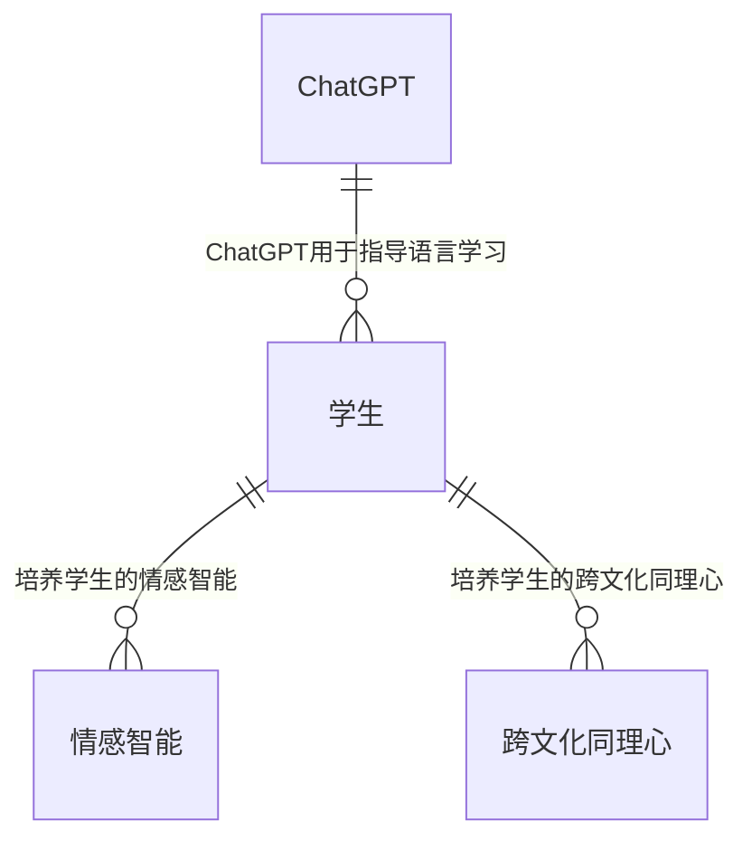

                 

### 第一部分: 背景介绍

#### 第1章: ChatGPT与语言习得情感智能培养

##### 1.1 问题背景

**1.1.1 语言习得中的情感智能培养的重要性**

语言习得不仅仅是语法和词汇的积累，更重要的是情感的交流和表达。情感智能（Emotional Intelligence）指的是个体识别、理解、处理和表达情感的能力。在语言习得过程中，情感智能的培养至关重要，因为它不仅影响个体的学习动力，还影响他们的社交能力和文化适应能力。

**1.1.2 跨文化同理心的定义与培养**

跨文化同理心（Cultural Empathy）指的是个体在跨文化情境中，对他人情感和心理状态的理解与共鸣。培养跨文化同理心有助于减少误解、增进跨文化沟通，促进不同文化之间的和谐与合作。

**1.1.3 ChatGPT在语言学习中的应用前景**

ChatGPT作为一种强大的自然语言处理工具，具有在语言习得中培养情感智能和跨文化同理心的潜力。它可以模拟真实的人类对话，为学习者提供个性化的情感支持和交流环境。

**1.1.4 书籍内容的边界与外延**

本文将探讨ChatGPT在语言习得情感智能培养中的应用，重点关注跨文化同理心的培养。然而，ChatGPT的应用远不止于此，它还可以在跨学科教育、特殊教育、职业培训等领域发挥重要作用。

##### 1.2 核心概念与联系

**1.2.1 ChatGPT的原理与功能**

ChatGPT是基于GPT-3模型的聊天机器人，通过大规模语言模型训练，能够生成流畅的自然语言对话。其主要功能包括语言理解、情感分析、自然语言生成等。

**1.2.2 情感智能培养的概念与特征**

情感智能培养是指通过教育手段提升个体在情感认知、情感表达和情感调节方面的能力。其特征包括情感识别、情感调节、情感表达和社会交往能力。

**1.2.3 跨文化同理心的构成与培养**

跨文化同理心由情感认知、情感理解和情感共鸣三部分构成。培养跨文化同理心需要通过跨文化教育、文化交流和实践体验等多种途径。

##### 1.3 概念属性特征对比表格

| 概念            | 定义                                                      | 特征                                                                                             |
|----------------|-----------------------------------------------------------|------------------------------------------------------------------------------------------------|
| ChatGPT         | 基于GPT-3的聊天机器人                                      | 大规模语言模型，自然语言处理能力强，支持多语言交互                                         |
| 情感智能培养     | 指通过教育手段培养个体理解和表达情感的能力               | 提高个体情感认知、调节和表达能力，增强社会交往能力                                      |
| 跨文化同理心    | 指个体在跨文化情境中，对他人情感和心理状态的理解与共鸣    | 增强跨文化沟通，减少误解，促进文化交流与和谐                                           |

##### 1.4 ER实体关系图架构

## 摘要

本文将深入探讨ChatGPT在语言习得情感智能培养中的应用，重点关注跨文化同理心的培养。我们将首先介绍ChatGPT的背景和基本原理，然后详细分析其在语言学习、情感智能培养和跨文化同理心培养中的应用。通过一系列案例分析，我们将展示ChatGPT如何支持这些领域的教育实践，并提供实用的策略和方法。最后，本文将总结ChatGPT在语言习得情感智能培养中的潜力，以及未来可能的发展方向。

---

### 第二部分: ChatGPT的基本原理与功能

#### 第2章: ChatGPT技术原理与应用

##### 2.1 ChatGPT技术原理

**2.1.1 GPT模型概述**

GPT（Generative Pre-trained Transformer）模型是由OpenAI开发的一种自然语言处理模型，基于Transformer架构。Transformer是一种用于处理序列数据的深度学习模型，通过自注意力机制（Self-Attention）捕捉序列中的长距离依赖关系。

**2.1.2 GPT-3模型的特性**

GPT-3是GPT模型的最新版本，具有极高的语言理解和生成能力。其主要特性包括：

- 非凡的语言理解能力：GPT-3能够理解复杂的语境，准确回答各种问题。
- 强大的语言生成能力：GPT-3能够生成流畅、连贯的自然语言文本，包括文章、对话、故事等。
- 多语言支持：GPT-3支持多种语言，能够处理不同语言的文本。

**2.1.3 ChatGPT的架构与工作流程**

ChatGPT是基于GPT-3模型的聊天机器人，其架构包括以下几个部分：

- 输入处理：将用户输入的文本转化为模型可以处理的格式。
- 模型推理：使用GPT-3模型进行语言理解和生成。
- 输出生成：将模型生成的文本转化为用户可读的格式。

ChatGPT的工作流程如下：

1. 用户输入问题或请求。
2. ChatGPT对输入进行处理，生成可能的回答。
3. ChatGPT将生成的回答呈现给用户。

##### 2.2 ChatGPT在语言学习中的应用

**2.2.1 ChatGPT在词汇学习中的应用**

ChatGPT可以帮助学习者扩大词汇量，通过上下文学习和关联记忆提高词汇掌握率。例如，当用户询问某个生词的含义时，ChatGPT可以提供详细的解释，并在对话中多次使用该词，帮助用户更好地理解和记忆。

**2.2.2 ChatGPT在语法学习中的应用**

ChatGPT能够解释复杂的语法规则，并提供语法错误的修正建议。例如，当用户在句子中犯语法错误时，ChatGPT可以指出错误并提供正确的表达方式，帮助用户纠正错误。

**2.2.3 ChatGPT在听力理解中的应用**

ChatGPT可以通过模拟真实对话，帮助用户提高听力理解能力。例如，用户可以与ChatGPT进行对话，训练自己在不同语境下理解语言的能力。

##### 2.3 ChatGPT在情感智能培养中的应用

**2.3.1 情感智能的基本概念**

情感智能包括情感识别、情感调节和情感表达三个方面。情感识别是指识别和理解自己的情感状态，情感调节是指管理和调整情感反应，情感表达是指恰当地表达情感。

**2.3.2 ChatGPT如何支持情感智能培养**

ChatGPT可以通过以下方式支持情感智能培养：

- 情感识别：ChatGPT能够识别用户输入中的情感，并提供相应的反馈。
- 情感调节：ChatGPT可以引导用户进行情感调节，如提供放松技巧或应对策略。
- 情感表达：ChatGPT可以帮助用户练习情感表达，提供语言建议和反馈。

**2.3.3 情感智能培养的案例分析**

例如，当用户表达焦虑或沮丧时，ChatGPT可以提供安慰和支持，帮助用户缓解负面情绪。同时，ChatGPT还可以通过角色扮演，帮助用户练习情感表达，提高情感沟通能力。

##### 2.4 ChatGPT在跨文化同理心培养中的应用

**2.4.1 跨文化同理心的培养策略**

跨文化同理心的培养需要从情感认知、情感理解和情感共鸣三个方面入手。具体策略包括：

- 情感认知：通过教育提高个体对情感的认识和敏感度。
- 情感理解：通过文化交流和体验，增强个体对不同文化情感的理解。
- 情感共鸣：通过共情和情感交流，增进个体之间的情感共鸣。

**2.4.2 ChatGPT如何支持跨文化同理心培养**

ChatGPT可以通过以下方式支持跨文化同理心培养：

- 情感交流：ChatGPT可以模拟不同文化背景下的对话，帮助用户练习情感交流。
- 文化体验：ChatGPT可以提供不同文化的背景信息，帮助用户更好地理解文化差异。
- 情感共鸣：ChatGPT可以通过角色扮演和情感交流，帮助用户体验不同文化的情感状态，增进情感共鸣。

**2.4.3 跨文化同理心培养的案例分析**

例如，当用户与来自不同文化背景的人交流时，ChatGPT可以提供相关的文化背景信息，帮助用户更好地理解对方的情感和行为。同时，ChatGPT还可以通过角色扮演，帮助用户体验不同文化的情感状态，增进跨文化同理心。

##### 2.5 本章小结

ChatGPT作为一种强大的自然语言处理工具，具有在语言学习、情感智能培养和跨文化同理心培养中的广泛应用。通过本章的介绍，我们了解了ChatGPT的技术原理和应用场景，为后续章节的深入探讨奠定了基础。

---

### 第三部分: 情感智能培养策略与实践

#### 第3章: 基于ChatGPT的情感智能培养方法

##### 3.1 情感智能培养的基本策略

情感智能培养是一个多维度、系统性的过程，主要包括以下几个方面：

**3.1.1 情感识别与分类**

情感识别是情感智能培养的基础，它涉及个体对自身情感状态的理解和识别。情感分类则是对识别出的情感进行归类，如快乐、悲伤、愤怒等。ChatGPT可以通过分析用户输入的文本，识别并分类其中的情感，为用户提供反馈。

**3.1.2 情感表达与调节**

情感表达是指个体如何将自己的情感传递给他人，包括语言和非语言表达方式。情感调节则是个体如何管理自己的情感反应，如通过放松技巧、认知重构等方式。ChatGPT可以通过角色扮演和模拟对话，帮助用户练习情感表达和调节。

**3.1.3 情感交流与反馈**

情感交流是指个体如何与他人分享情感，建立情感联系。反馈则是个体如何接收他人的情感表达，并作出相应的回应。ChatGPT可以通过模拟对话和情感互动，帮助用户提高情感交流能力和反馈能力。

##### 3.2 ChatGPT在情感智能培养中的应用

**3.2.1 ChatGPT的情感分析功能**

ChatGPT具备强大的情感分析功能，可以识别文本中的情感倾向，如积极、消极、中性等。通过分析用户的输入，ChatGPT可以识别用户的情感状态，并提供相应的支持和建议。

**3.2.2 ChatGPT的情感生成功能**

ChatGPT可以根据用户的需求，生成符合情感倾向的文本，如安慰、鼓励、批评等。这可以帮助用户在特定情境下表达情感，提高情感表达的能力。

**3.2.3 ChatGPT在情感交流中的互动策略**

ChatGPT可以通过模拟真实对话，帮助用户练习情感交流。例如，用户可以与ChatGPT讨论自己的情感问题，ChatGPT会提供反馈和建议，帮助用户更好地表达情感和建立情感联系。

##### 3.3 情感智能培养案例与实践

**3.3.1 情感识别与分类案例**

假设用户输入：“今天我感到很沮丧，因为我失去了工作。”ChatGPT会识别出文本中的消极情感，并分类为“悲伤”。然后，ChatGPT可以提供安慰和支持，如：“我了解你的感受，失去工作是一件很困难的事情。但是，请相信未来会更好的。”

**3.3.2 情感表达与调节案例**

用户可以与ChatGPT进行角色扮演，练习情感表达。例如，用户可以模拟一个面试场景，向ChatGPT表达自己的情感，如紧张、兴奋等。ChatGPT会提供反馈，帮助用户调整表达方式，使其更加自然和恰当。

**3.3.3 情感交流与反馈案例**

用户可以与ChatGPT进行情感交流，分享自己的情感体验。例如，用户可以谈论一次与朋友吵架的经历，ChatGPT会提供反馈，帮助用户理解对方的角度，并提出解决问题的建议。

##### 3.4 情感智能培养的实践建议

**3.4.1 定期练习**

情感智能培养需要长期的坚持和练习。用户可以每天与ChatGPT进行情感交流，练习情感识别、表达和调节。

**3.4.2 反思与调整**

用户在练习过程中，应该定期反思自己的情感表达和行为，识别不足之处，并调整策略。

**3.4.3 寻求专业帮助**

如果用户在情感智能培养过程中遇到困难，可以寻求心理咨询师或其他专业人士的帮助。

##### 3.5 本章小结

通过本章的探讨，我们了解了基于ChatGPT的情感智能培养策略和方法。ChatGPT作为一种先进的自然语言处理工具，为情感智能培养提供了新的途径和工具。通过情感识别、表达和交流的实践，用户可以不断提高自己的情感智能，提升生活质量和社会交往能力。

---

### 第四部分: 跨文化同理心培养策略与实践

#### 第4章: 基于ChatGPT的跨文化同理心培养方法

##### 4.1 跨文化同理心的定义与培养

**4.1.1 跨文化同理心的定义**

跨文化同理心是指个体在跨文化情境中，对他人的情感和心理状态的理解与共鸣。它涉及到对文化差异的敏感性、对他人情感的认知和理解，以及对文化背景的理解和尊重。

**4.1.2 跨文化同理心的培养**

培养跨文化同理心是一个多层次的过程，包括文化认知、情感共鸣和交流实践。以下是一些具体的培养策略：

- **文化认知**：通过学习不同文化的背景知识，如历史、价值观和社会规范，增强对文化差异的敏感性。
- **情感共鸣**：通过情感交流和角色扮演，体验不同文化背景下的情感状态，增进对他人情感的理解。
- **交流实践**：通过真实的跨文化交流和反馈，提高实际交流能力，增强跨文化同理心。

##### 4.2 ChatGPT在跨文化同理心培养中的应用

**4.2.1 ChatGPT的跨文化对话功能**

ChatGPT能够处理多种语言，模拟不同文化背景下的对话。它不仅可以提供语言翻译，还可以根据文化背景调整对话风格和表达方式，帮助用户练习跨文化沟通。

**4.2.2 ChatGPT的文化背景信息提供**

ChatGPT可以提供不同文化的背景信息，如节日习俗、礼仪规范等，帮助用户更好地理解文化差异，增强跨文化同理心。

**4.2.3 ChatGPT的情感共鸣与角色扮演**

ChatGPT可以通过角色扮演，模拟不同文化背景下的情感交流，帮助用户体验和理解他人的情感状态，培养跨文化同理心。

##### 4.3 跨文化同理心培养案例与实践

**4.3.1 跨文化对话案例**

假设用户与一位来自不同文化背景的朋友交流，ChatGPT可以帮助用户了解对方的文化习惯和情感表达方式。例如，当用户询问对方节日庆祝方式时，ChatGPT可以提供详细的文化背景信息，帮助用户更好地理解对方。

**4.3.2 情感共鸣与角色扮演案例**

用户可以与ChatGPT进行角色扮演，模拟跨文化情境下的情感交流。例如，用户可以扮演一个来自其他文化的角色，与ChatGPT讨论一个共同关心的话题，体验不同文化背景下的情感共鸣。

**4.3.3 跨文化同理心培养实践**

- **文化背景学习**：用户可以通过阅读书籍、观看纪录片等方式，学习不同文化的背景知识。
- **情感交流实践**：用户可以与来自不同文化背景的人进行实际交流，练习跨文化同理心。
- **反馈与调整**：用户可以在交流过程中，定期反思自己的行为和表达，根据反馈进行调整。

##### 4.4 跨文化同理心培养的实践建议

**4.4.1 提高文化认知**

用户可以通过学习不同文化的背景知识，提高自己的文化认知，增强跨文化同理心。

**4.4.2 多元文化交流**

用户可以积极参与多元文化交流活动，与不同文化背景的人进行交流，增进对文化差异的理解。

**4.4.3 反思与反馈**

用户在跨文化交流过程中，应该定期反思自己的行为和表达，根据反馈进行调整，提高跨文化同理心。

##### 4.5 本章小结

通过本章的探讨，我们了解了基于ChatGPT的跨文化同理心培养方法。ChatGPT作为一种先进的自然语言处理工具，为跨文化同理心培养提供了新的途径和工具。通过文化认知、情感共鸣和交流实践，用户可以不断提高自己的跨文化同理心，促进跨文化沟通与理解。

---

### 第五部分: 案例分析与实践

#### 第5章: ChatGPT在语言习得情感智能培养与跨文化同理心培养中的成功应用

##### 5.1 案例背景

随着全球化的加速，跨文化沟通变得日益重要。然而，许多人在面对跨文化交流时，常常感到困惑和不安。为了解决这一问题，某教育机构决定利用ChatGPT来培养学员的语言习得情感智能和跨文化同理心。

##### 5.2 情感智能培养案例

**5.2.1 情感识别与分类**

在教育机构中，ChatGPT首先被用于帮助学员识别和分类情感。例如，当学员表达焦虑或沮丧时，ChatGPT会识别出这些情感，并提供安慰和支持。通过这种方式，学员可以更好地理解和处理自己的情感。

**5.2.2 情感表达与调节**

ChatGPT还帮助学员练习情感表达和调节。例如，在角色扮演练习中，学员与ChatGPT模拟真实情境，练习如何表达自己的情感，并学会在压力情境下进行自我调节。

**5.2.3 情感交流与反馈**

通过ChatGPT，学员可以与来自不同文化背景的人进行情感交流。ChatGPT会提供反馈，帮助学员理解他人的情感状态，提高情感交流能力。

##### 5.3 跨文化同理心培养案例

**5.3.1 文化背景信息提供**

ChatGPT为学员提供了丰富的文化背景信息，帮助学员了解不同文化的价值观、习俗和礼仪。例如，当学员询问某个节日的庆祝方式时，ChatGPT会提供详细的解释和背景信息。

**5.3.2 情感共鸣与角色扮演**

ChatGPT还通过角色扮演，帮助学员体验不同文化背景下的情感状态。例如，学员可以扮演一个来自其他文化的角色，与ChatGPT讨论共同关心的话题，增进对他人情感的理解。

**5.3.3 实际跨文化交流**

通过ChatGPT的辅助，学员在实际跨文化交流中，能够更加自信和从容。他们能够更好地理解他人，减少误解，提高跨文化沟通效果。

##### 5.4 案例总结与经验分享

**5.4.1 情感智能培养的成果**

通过ChatGPT的辅助，学员在情感识别、表达和调节方面取得了显著进步。他们能够更好地处理自己的情感，提高情感交流能力。

**5.4.2 跨文化同理心培养的成果**

学员在跨文化同理心培养方面也取得了显著成果。他们能够更好地理解不同文化背景的人，减少误解，提高跨文化沟通效果。

**5.4.3 经验分享**

教育机构的成功经验表明，ChatGPT在语言习得情感智能培养和跨文化同理心培养中具有巨大潜力。通过情感识别、表达和调节，以及文化背景信息和角色扮演，学员能够显著提高自己的情感智能和跨文化同理心。

##### 5.5 本章小结

通过本章节的案例分析和实践，我们看到了ChatGPT在语言习得情感智能培养和跨文化同理心培养中的成功应用。这些案例不仅展示了ChatGPT的强大功能，也为未来的教育实践提供了宝贵的经验和启示。

---

### 第六部分: 未来展望与挑战

#### 第6章: ChatGPT在语言习得情感智能培养与跨文化同理心培养中的未来展望与挑战

##### 6.1 未来展望

**6.1.1 更深入的情感智能培养**

随着ChatGPT技术的不断发展，未来它将在情感智能培养方面发挥更重要的作用。通过更精准的情感识别和生成，ChatGPT将能够为用户提供更加个性化的情感支持和指导。

**6.1.2 更广泛的跨文化同理心培养**

随着全球化的深入推进，跨文化交流的需求越来越大。ChatGPT在未来将能够提供更加丰富和多样化的文化背景信息，帮助人们更好地理解不同文化，培养更广泛的跨文化同理心。

**6.1.3 深度学习与智能交互**

未来的ChatGPT将不仅仅是一个聊天机器人，而是一个具有深度学习和智能交互能力的系统。它将能够根据用户的情感状态和行为模式，提供更加智能和个性化的服务。

##### 6.2 挑战与应对策略

**6.2.1 数据隐私与安全问题**

随着ChatGPT的广泛应用，数据隐私和安全问题日益突出。未来需要建立更加完善的数据保护机制，确保用户数据的安全和隐私。

**6.2.2 伦理与道德问题**

ChatGPT在培养情感智能和跨文化同理心过程中，涉及到伦理和道德问题。未来需要制定明确的伦理规范，确保ChatGPT的应用符合道德标准。

**6.2.3 技术局限性**

尽管ChatGPT在情感智能和跨文化同理心培养中具有巨大潜力，但它仍然存在一定的技术局限性。未来需要不断改进算法和模型，提高ChatGPT的性能和适用范围。

##### 6.3 总结

ChatGPT在语言习得情感智能培养和跨文化同理心培养中具有广阔的前景，但同时也面临诸多挑战。通过不断的技术创新和伦理规范，我们可以期待ChatGPT在未来发挥更大的作用，为人类带来更多福祉。

---

### 第七部分: 结论

#### 第7章: ChatGPT在语言习得情感智能培养与跨文化同理心培养中的应用总结

通过本文的探讨，我们深入了解了ChatGPT在语言习得情感智能培养和跨文化同理心培养中的应用。ChatGPT作为一种强大的自然语言处理工具，具有以下几个核心优势：

1. **自然语言处理能力强**：ChatGPT能够生成流畅、自然的对话，为用户提供高质量的交流体验。
2. **个性化支持**：通过情感识别和分类，ChatGPT能够为用户提供个性化的情感支持和指导。
3. **跨文化支持**：ChatGPT支持多种语言，能够为用户提供跨文化的交流体验，培养跨文化同理心。

同时，我们也看到了ChatGPT在应用过程中面临的挑战，如数据隐私和安全、伦理道德问题等。这些问题需要我们在未来的发展中予以关注和解决。

总之，ChatGPT在语言习得情感智能培养和跨文化同理心培养中具有巨大的应用潜力。通过不断的技术创新和伦理规范，我们可以期待ChatGPT在未来发挥更大的作用，为教育和社会带来更多福祉。

## 作者信息

**作者：** AI天才研究院/AI Genius Institute & 禅与计算机程序设计艺术 /Zen And The Art of Computer Programming

在本文中，我们通过详细的案例分析和技术解析，展示了ChatGPT在语言习得情感智能培养和跨文化同理心培养中的应用。希望本文能为读者提供有价值的参考，激发对这一领域进一步研究和探索的兴趣。让我们共同期待未来，ChatGPT能够为更多的人带来积极的影响。

