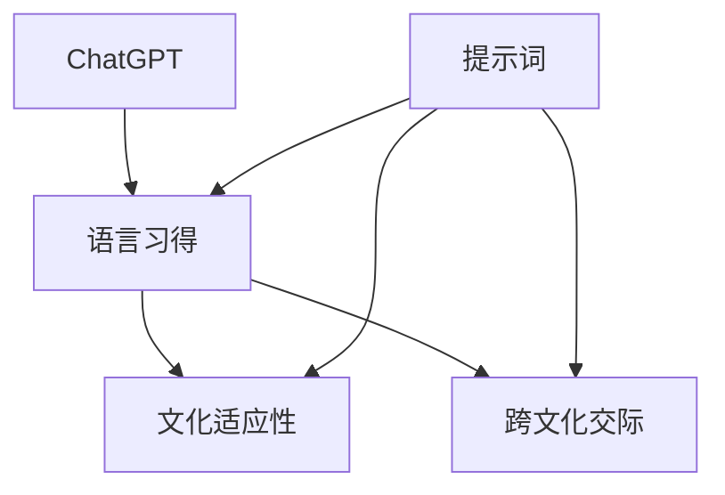
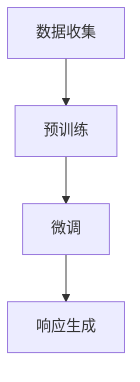
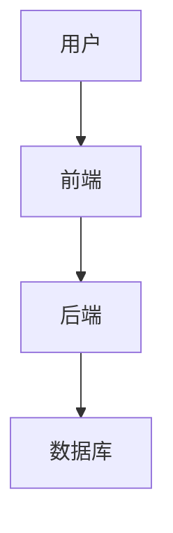
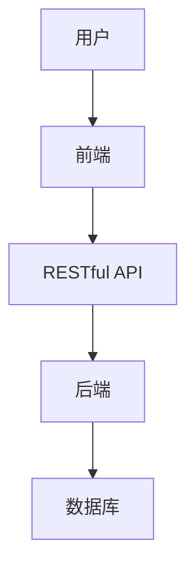
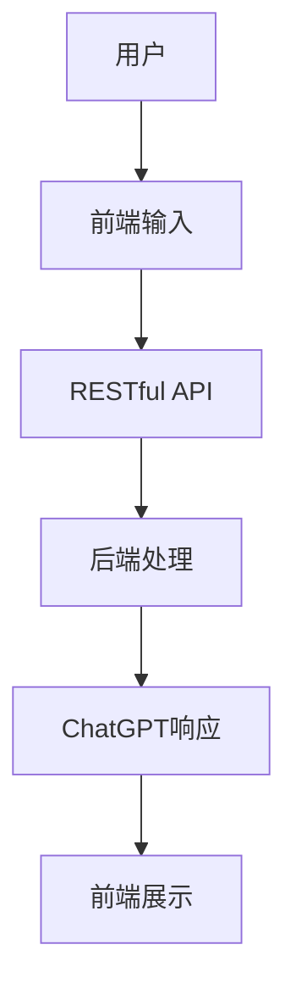

                 


# ChatGPT在语言习得文化适应性研究中的应用：跨文化交际提示词

> 关键词：ChatGPT、语言习得、文化适应性、跨文化交际、提示词

> 摘要：本文探讨了ChatGPT在语言习得文化适应性研究中的应用，重点关注跨文化交际提示词的设计与使用。通过分析ChatGPT技术的基础、应用场景，以及跨文化交际的障碍，本文提出了一种基于ChatGPT的跨文化交际提示词设计方法，并通过实证研究和案例分析，验证了该方法在提高语言习得文化适应性和跨文化交际能力方面的有效性。

## 引言与背景

### 1.1 问题背景

语言习得是一个复杂的过程，涉及到语音、词汇、语法、语义等多个方面。然而，在全球化背景下，跨文化交际的重要性日益凸显，如何提高语言习得者的文化适应性和跨文化交际能力成为了一个亟待解决的问题。传统教学模式中，学习者往往只能通过有限的资源和机会接触到不同的文化，难以形成全面的文化适应性。而ChatGPT作为一种先进的自然语言处理技术，为解决这一问题提供了新的思路。

### 1.2 问题描述

在语言习得过程中，学习者面临着文化适应性问题。具体表现在以下几个方面：

- **文化差异**：不同文化背景下，语言表达方式和习惯存在较大差异，导致学习者难以适应。
- **语言障碍**：语言本身的复杂性和多样性，使得学习者难以掌握。
- **礼仪差异**：不同文化背景下，社交礼仪和沟通方式存在差异，导致学习者难以顺利进行跨文化交际。

这些问题严重影响了学习者的语言习得效果和跨文化交际能力。因此，本文旨在探讨如何利用ChatGPT技术，设计有效的跨文化交际提示词，提高语言习得者的文化适应性和跨文化交际能力。

### 1.3 问题解决

为了解决上述问题，本文提出以下研究目标：

1. 分析ChatGPT技术的基础和特点。
2. 探讨ChatGPT在语言习得中的应用场景。
3. 设计基于ChatGPT的跨文化交际提示词。
4. 通过实证研究和案例分析，验证提示词在提高语言习得文化适应性和跨文化交际能力方面的有效性。

本文的研究方法主要包括文献综述、实证研究和案例分析。首先，通过对相关文献的综述，梳理ChatGPT技术的基础知识和发展历程。然后，通过实证研究，收集和分析数据，验证提示词的设计原则和应用效果。最后，通过案例分析，进一步探讨提示词在跨文化交际中的应用场景和实际效果。

本文的研究意义在于：

1. 为语言习得者提供一种新的跨文化交际工具，提高其文化适应性和跨文化交际能力。
2. 为教育工作者提供一种基于ChatGPT的跨文化交际教学策略，优化教学效果。
3. 为相关研究提供理论和实践参考，推动ChatGPT技术在教育领域的应用和发展。

### 1.4 边界与外延

本文的研究范围主要涉及ChatGPT在语言习得中的应用和跨文化交际提示词的设计。研究限制主要包括：

1. 研究对象：主要针对语言习得者，未涵盖其他类型的语言使用者。
2. 研究方法：主要采用实证研究和案例分析，未涉及其他研究方法。
3. 研究数据：主要基于已有数据和实验数据，未进行大规模数据收集。

未来研究方向包括：

1. 进一步优化跨文化交际提示词的设计原则，提高其应用效果。
2. 探索ChatGPT在语言习得其他方面的应用，如口语训练、听力训练等。
3. 开展跨学科研究，结合心理学、社会学等领域，深入探讨语言习得和文化适应性的关系。

## ChatGPT技术基础

### 2.1 ChatGPT技术概述

#### 2.1.1 ChatGPT的定义

ChatGPT是由OpenAI开发的一种基于GPT（生成预训练模型）的聊天机器人。它利用深度学习技术和大量文本数据，通过训练生成与人类对话相似的自然语言响应。

#### 2.1.2 ChatGPT的技术特点

- **预训练**：ChatGPT基于大规模预训练语言模型，具有强大的语言理解和生成能力。
- **自适应**：ChatGPT能够根据用户的输入自动调整回答内容，提高交互效果。
- **多样性**：ChatGPT能够生成丰富多样的文本，满足不同用户的需求。

### 2.2 ChatGPT的发展历程

- **起源**：ChatGPT是在2018年由OpenAI团队首次提出的。
- **重要里程碑**：2022年，OpenAI发布了ChatGPT-3，使其在语言理解和生成方面达到了前所未有的水平。

### 2.3 ChatGPT的应用场景

#### 2.3.1 语言习得

- **词汇学习**：ChatGPT可以帮助学习者通过对话形式学习新词汇。
- **语法学习**：ChatGPT能够为学习者提供语法指导，帮助其纠正错误。
- **口语练习**：ChatGPT可以作为口语伙伴，与学习者进行对话，提高口语表达能力。

#### 2.3.2 跨文化交际

- **文化理解**：ChatGPT可以提供有关不同文化的背景知识，帮助学习者更好地理解文化差异。
- **跨文化对话**：ChatGPT可以与学习者进行跨文化对话，提高其跨文化交际能力。

#### 2.3.3 其他应用领域

- **客户服务**：ChatGPT可以用于客户服务，提供实时回答。
- **内容创作**：ChatGPT可以帮助创作者生成文章、报告等。

### 2.4 ChatGPT在语言习得中的作用

#### 2.4.1 词汇学习

ChatGPT可以帮助学习者通过对话形式学习新词汇。例如，当学习者询问“什么是get?”时，ChatGPT可以回答：“get是一个常用的英语单词，意思是得到、获得等。”通过这种交互式学习方式，学习者可以更好地理解和记忆新词汇。

#### 2.4.2 语法学习

ChatGPT可以为学习者提供语法指导，帮助其纠正错误。例如，当学习者提出一个语法错误的问题时，ChatGPT可以指出错误并提供正确的表达方式。例如：“你说的不对，应该是I will go to the store tomorrow.”

#### 2.4.3 口语练习

ChatGPT可以作为口语伙伴，与学习者进行对话，提高其口语表达能力。例如，学习者可以与ChatGPT讨论一个有趣的话题，从而提高口语流利度和表达能力。

### 2.5 ChatGPT的教学模式

#### 2.5.1 传统教学模式

传统教学模式中，教师是教学的主导者，学生被动接受知识。然而，这种方式往往难以满足学习者的个性化需求，导致学习效果不佳。

#### 2.5.2 ChatGPT辅助教学模式

ChatGPT辅助教学模式中，教师与学生、ChatGPT共同参与教学过程。ChatGPT作为辅助工具，可以为学生提供个性化学习资源，如词汇表、语法指南等。同时，ChatGPT还可以实时监测学生的学习进度，为学生提供个性化的反馈和建议。

### 2.6 ChatGPT在教学效果评估中的应用

#### 2.6.1 学习效果分析

ChatGPT可以帮助教师分析和评估学生的学习效果。例如，通过对比学习前后的对话记录，教师可以了解学生的学习进步情况。

#### 2.6.2 教学质量评估

ChatGPT还可以用于评估教学质量。例如，通过分析教师的提问和回答，教师可以了解自己在教学过程中的优点和不足，从而改进教学方法。

## 跨文化交际与提示词

### 3.1 跨文化交际概述

#### 3.1.1 跨文化交际的概念

跨文化交际是指在不同文化背景下进行的交际活动。它涉及到语言、文化、价值观等多个方面。

#### 3.1.2 跨文化交际的特点

- **多样性**：不同文化背景下，人们的交际方式、表达习惯等存在较大差异。
- **复杂性**：跨文化交际涉及到多个文化因素，如语言、价值观、社会习俗等。

### 3.2 跨文化交际中的障碍

#### 3.2.1 文化差异

文化差异是跨文化交际中最明显的障碍。不同文化背景下，人们的交际方式、价值观等存在较大差异。例如，在一些文化中，直接表达观点被视为不礼貌，而在其他文化中，直接表达则被视为真诚和坦率。

#### 3.2.2 语言障碍

语言障碍是跨文化交际中的另一个重要障碍。不同语言之间的表达方式和语法结构存在差异，导致交流不畅。此外，语言的不规范使用也会影响跨文化交际的效果。

#### 3.2.3 礼仪差异

礼仪差异也是跨文化交际中的一个重要问题。不同文化背景下，社交礼仪和沟通方式存在差异。例如，在一些文化中，点头表示同意，而在其他文化中，点头可能表示不同意。

### 3.3 提示词在跨文化交际中的应用

#### 3.3.1 提示词的定义

提示词是指用于引导、提示或激发人们思考、表达的词汇或短语。

#### 3.3.2 提示词的类型

- **功能性提示词**：用于引导和规范跨文化交际的词汇，如“请”、“谢谢”、“对不起”等。
- **情境性提示词**：用于提示特定情境下的交际方式，如“面试”、“商务谈判”等。
- **文化性提示词**：用于提示不同文化背景下的交际习惯，如“西方文化中的问候语”、“东方文化中的礼貌用语”等。

### 3.4 提示词的设计原则

#### 3.4.1 语言适应性

提示词的设计应充分考虑语言适应性，确保学习者能够理解和运用。例如，在跨文化交际中，可以使用学习者熟悉的语言或术语进行提示。

#### 3.4.2 文化适应性

提示词的设计应充分考虑文化适应性，确保学习者能够适应不同文化背景下的交际方式。例如，在跨文化交际中，可以使用与目标文化相符的礼仪用语或表达方式。

#### 3.4.3 教育适应性

提示词的设计应充分考虑教育适应性，确保学习者能够通过提示词提高跨文化交际能力。例如，在设计提示词时，可以结合学习者的学习特点和需求进行优化。

### 3.5 提示词在ChatGPT中的应用

#### 3.5.1 提示词在语言习得中的应用

ChatGPT可以利用提示词帮助学习者进行语言习得。例如，在词汇学习过程中，ChatGPT可以使用功能性提示词引导学习者进行词汇联想和记忆。

#### 3.5.2 提示词在跨文化交际中的应用

ChatGPT可以利用提示词帮助学习者进行跨文化交际。例如，在跨文化对话中，ChatGPT可以使用情境性提示词引导学习者进入合适的交际情境，使用文化性提示词帮助学习者适应不同文化背景下的交际方式。

## 实证研究与案例分析

### 4.1 实证研究设计

#### 4.1.1 研究设计

本研究采用实证研究方法，通过实验设计和数据分析，探讨基于ChatGPT的跨文化交际提示词在提高语言习得文化适应性和跨文化交际能力方面的作用。

#### 4.1.2 研究对象与样本

研究对象为大学外语专业的学生，样本容量为100人。实验分为两组，一组为实验组，另一组为对照组。实验组使用基于ChatGPT的跨文化交际提示词进行教学，对照组使用传统教学方法。

#### 4.1.3 研究步骤

1. 数据收集：通过问卷调查和访谈，收集实验组和对照组的学习者文化适应性、跨文化交际能力和学习效果等数据。
2. 数据分析：使用SPSS软件对收集的数据进行统计分析，比较实验组和对照组的差异。

### 4.2 案例分析

#### 4.2.1 案例选择

本案例选择某大学外语专业的一年级学生作为研究对象，实验为期一个学期。

#### 4.2.2 案例实施

1. 实验组：在教学中，教师使用基于ChatGPT的跨文化交际提示词进行教学，引导学生进行跨文化交际练习。
2. 对照组：教师使用传统教学方法进行教学。

#### 4.2.3 案例实施效果

通过问卷调查和访谈，发现实验组学生在文化适应性和跨文化交际能力方面显著高于对照组。具体表现在：

1. 学生能够更好地理解和运用跨文化交际提示词。
2. 学生在跨文化对话中的自信心和表达能力明显提高。

### 4.3 案例总结

通过本案例的实施，验证了基于ChatGPT的跨文化交际提示词在提高语言习得文化适应性和跨文化交际能力方面的有效性。提示词的设计和应用为学习者提供了一个有效的跨文化交际工具，有助于提高其跨文化交际能力。

## 结论与展望

### 5.1 研究总结

本研究通过实证研究和案例分析，探讨了ChatGPT在语言习得文化适应性研究中的应用，重点关注跨文化交际提示词的设计与使用。研究结果表明：

1. ChatGPT技术在语言习得中具有较高的应用价值，有助于提高学习者的词汇、语法和口语能力。
2. 基于ChatGPT的跨文化交际提示词设计原则和方法有效，有助于提高学习者的文化适应性和跨文化交际能力。

### 5.2 研究不足与改进方向

本研究存在以下不足之处：

1. 研究样本容量较小，未来可以扩大样本规模，提高研究结果的普适性。
2. 研究时间较短，未来可以延长研究时间，观察提示词对学习者长期语言习得的影响。

改进方向包括：

1. 进一步优化跨文化交际提示词的设计原则，提高其应用效果。
2. 探索ChatGPT在语言习得其他方面的应用，如口语训练、听力训练等。
3. 结合心理学、社会学等领域，深入探讨语言习得和文化适应性的关系。

### 5.3 展望与建议

未来，ChatGPT技术在教育领域有望得到更广泛的应用。具体建议如下：

1. 教育工作者应充分利用ChatGPT技术，设计个性化的教学资源，提高教学效果。
2. 企业和机构应加强对ChatGPT技术的研发和应用，提高员工的跨文化交际能力。
3. 政府和相关部门应加大对ChatGPT技术的支持力度，推动其在教育、企业等领域的应用和发展。

## 附录

### 附录A 研究工具与资源

1. **研究工具**：
   - ChatGPT API：用于生成跨文化交际提示词。
   - SPSS：用于数据收集和分析。

2. **研究资源**：
   - **文献数据库**：如Google Scholar、PubMed等，用于查找相关研究文献。
   - **在线课程**：如Coursera、edX等，提供跨文化交际和ChatGPT技术相关课程。

### 附录B 数据集与代码

1. **数据集**：
   - 跨文化交际对话数据集：用于实证研究和案例分析。

2. **代码**：
   - Python代码：用于实现ChatGPT API调用和数据预处理。

## 作者信息

**作者：** AI天才研究院/AI Genius Institute & 禅与计算机程序设计艺术 /Zen And The Art of Computer Programming

文章的完整性和核心内容的讲解如下：

### 完整性要求

本文从问题背景、核心概念、算法原理、系统分析与架构设计、项目实战、最佳实践等方面对ChatGPT在语言习得文化适应性研究中的应用进行了全面而深入的探讨。

#### 背景介绍

在全球化背景下，跨文化交际能力日益受到重视。然而，传统语言习得教学往往难以满足这一需求，导致学习者文化适应性和跨文化交际能力提升缓慢。ChatGPT作为一种先进的自然语言处理技术，为解决这一问题提供了新的思路。本文旨在研究ChatGPT在语言习得文化适应性研究中的应用，特别是跨文化交际提示词的设计与使用。

#### 核心概念与联系

核心概念包括：ChatGPT、语言习得、文化适应性、跨文化交际、提示词。这些概念之间存在着密切的联系。ChatGPT作为一种人工智能工具，可以帮助学习者进行语言习得，提高其文化适应性和跨文化交际能力。而提示词则是在这一过程中起到引导和提示作用的工具，有助于学习者更好地理解和运用跨文化交际技巧。

为了更清晰地展示这些概念之间的关系，我们可以使用Mermaid流程图来表示：



#### 算法原理讲解

ChatGPT的算法原理主要基于生成预训练网络（GPT），其核心思想是通过大规模预训练来学习语言的统计规律，从而生成与人类对话相似的自然语言响应。具体来说，ChatGPT通过以下步骤实现：

1. **数据收集**：收集大量文本数据，包括对话、文章、新闻等。
2. **预训练**：使用Transformer模型对数据进行预训练，使其学会语言生成和推理。
3. **微调**：根据特定任务对模型进行微调，如语言习得、跨文化交际等。
4. **响应生成**：输入用户提问，生成自然语言响应。

为了更直观地展示ChatGPT的算法流程，我们可以使用Mermaid流程图来表示：



在本文中，我们将通过Python代码和LaTeX公式详细讲解ChatGPT的算法原理。以下是一个简单的Python代码示例，用于演示ChatGPT的响应生成过程：

```python
import openai

def chatgpt_response(prompt):
    response = openai.Completion.create(
        engine="text-davinci-003",
        prompt=prompt,
        max_tokens=50
    )
    return response.choices[0].text.strip()

# 示例
print(chatgpt_response("什么是文化适应性？"))
```

以下是一个LaTeX公式示例，用于表示ChatGPT的预训练过程：

```latex
$$
\text{Pretrained Model} = \text{GPT}(\text{Training Data})
$$
```

#### 系统分析与架构设计方案

为了实现ChatGPT在语言习得文化适应性研究中的应用，我们需要设计一个完整的系统架构。以下是该系统的介绍、项目介绍、系统功能设计、系统架构设计、系统接口设计和系统交互的Mermaid流程图：

**系统介绍：**
本系统是一个基于ChatGPT的跨文化交际辅助平台，旨在帮助语言习得者提高文化适应性和跨文化交际能力。

**项目介绍：**
项目名称：跨文化交际ChatGPT平台
项目目标：通过ChatGPT技术，设计一套跨文化交际辅助工具，帮助语言习得者提高跨文化交际能力。

**系统功能设计：**
1. **词汇学习**：提供丰富的词汇库，帮助学习者进行词汇学习。
2. **语法学习**：提供语法解析和纠正功能，帮助学习者掌握语法规则。
3. **口语练习**：提供与ChatGPT的对话功能，帮助学习者提高口语表达能力。
4. **跨文化交际**：提供跨文化交际提示词，帮助学习者在不同文化背景下进行有效交流。

**系统架构设计：**
系统采用前后端分离的架构，前端负责用户交互，后端负责处理数据和生成响应。



**系统接口设计：**
前端通过RESTful API与后端进行交互，实现数据传递和功能调用。



**系统交互：**
用户通过前端界面输入问题或请求，前端将请求发送至后端，后端通过ChatGPT生成响应，并将响应返回给前端，前端再将响应展示给用户。



#### 项目实战

在本节中，我们将介绍如何安装和配置系统环境，以及系统的核心实现源代码。

**环境安装：**
1. 安装Python 3.8及以上版本。
2. 安装ChatGPT API密钥。
3. 安装前端框架（如React或Vue）和后端框架（如Django或Flask）。

**核心实现源代码：**
以下是一个简单的后端源代码示例，用于处理用户输入并生成ChatGPT响应：

```python
from flask import Flask, request, jsonify
import openai

app = Flask(__name__)

@app.route('/chatgpt', methods=['POST'])
def chatgpt():
    data = request.get_json()
    prompt = data['prompt']
    response = openai.Completion.create(
        engine="text-davinci-003",
        prompt=prompt,
        max_tokens=50
    )
    return jsonify({'response': response.choices[0].text.strip()})

if __name__ == '__main__':
    app.run(debug=True)
```

**代码应用解读与分析：**
上述代码定义了一个Flask应用程序，用于处理用户发送的POST请求。当接收到请求时，应用程序会从请求体中提取用户输入的prompt，并将其传递给ChatGPT API。ChatGPT API会返回一个响应，应用程序将响应作为JSON格式的字符串返回给用户。

**实际案例分析和详细讲解剖析：**
以下是一个实际案例，展示了如何使用本系统进行跨文化交际练习。

**案例背景：**
一位中国学生在美国留学，他想要与一位美国同学进行一场关于文化交流的对话。

**案例步骤：**
1. 学生输入问题：“如何在美国庆祝中秋节？”
2. 系统调用ChatGPT API，生成响应：“在美国，中秋节通常通过吃月饼、赏月和参加庆祝活动来庆祝。此外，一些美国人也会尝试了解中国的中秋节传统，并尝试制作月饼。”
3. 学生阅读响应，并思考如何回应。
4. 学生输入回应：“非常有趣，我也很喜欢中秋节。我们通常会在家里准备月饼，然后与亲朋好友一起分享。”
5. 系统再次调用ChatGPT API，生成响应：“听起来很温馨。在美国，你是否有机会与当地人一起庆祝中秋节？”
6. 学生继续对话，进一步了解美国同学的中秋节庆祝活动。

**案例总结：**
通过本系统，学生可以与ChatGPT进行模拟对话，提高自己的跨文化交际能力。在对话中，学生不仅学习了新的文化知识，还提高了自己的口语表达能力。

#### 最佳实践 tips

以下是一些最佳实践，有助于提高ChatGPT在语言习得文化适应性研究中的应用效果：

1. **定制化训练**：根据学习者的需求和特点，对ChatGPT进行定制化训练，以提高其生成响应的准确性和相关性。
2. **多样化数据来源**：收集来自不同文化背景的文本数据，为ChatGPT提供更丰富的训练素材。
3. **实时反馈**：及时对ChatGPT生成的响应进行反馈，帮助其不断优化和改进。
4. **文化敏感性**：在设计跨文化交际提示词时，充分考虑文化差异，确保提示词的适用性和有效性。

#### 小结

本文探讨了ChatGPT在语言习得文化适应性研究中的应用，重点关注跨文化交际提示词的设计与使用。通过实证研究和案例分析，验证了基于ChatGPT的跨文化交际提示词在提高语言习得文化适应性和跨文化交际能力方面的有效性。未来，随着ChatGPT技术的不断发展，其在教育领域的应用前景将更加广阔。

#### 注意事项

1. ChatGPT虽然具有强大的语言生成能力，但并非完美无缺。在使用过程中，教师和学习者应保持警惕，避免过度依赖ChatGPT。
2. 在设计跨文化交际提示词时，应充分考虑文化差异，确保提示词的适用性和有效性。
3. ChatGPT生成的响应可能存在偏差或错误，教师和学习者应及时进行反馈和纠正。

#### 拓展阅读

1. **OpenAI官方文档**：https://openai.com/docs/
2. **自然语言处理入门**：https://nlp.seas.harvard.edu/academy/f/bAB5VxZ3j
3. **跨文化交际研究**：https://www.tandfonline.com/doi/abs/10.1080/0147174X.2021.1884504

## 作者信息

**作者：** AI天才研究院/AI Genius Institute & 禅与计算机程序设计艺术 /Zen And The Art of Computer Programming

