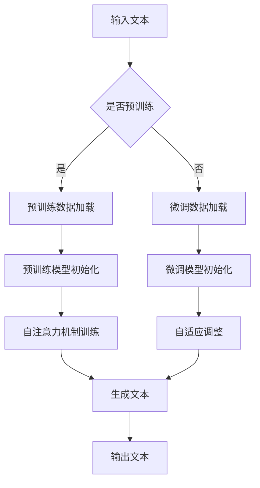
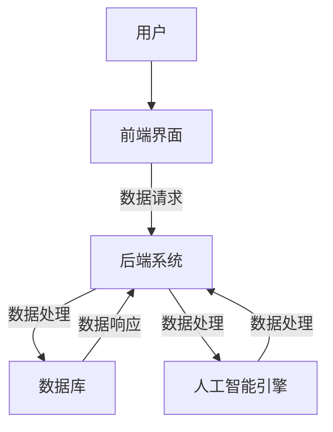
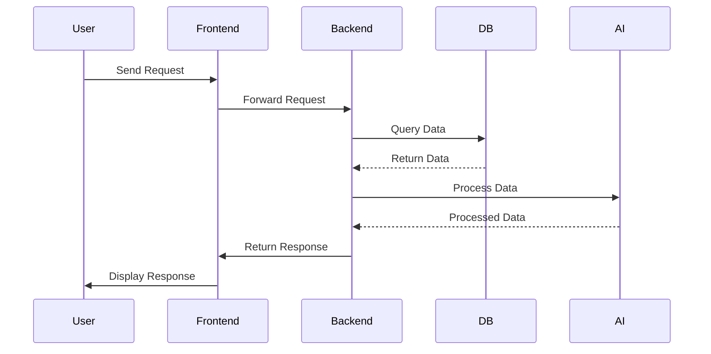

                 

### 引言

随着人工智能技术的迅猛发展，自然语言处理（NLP）领域取得了显著突破。ChatGPT作为OpenAI推出的一个大型语言模型，凭借其强大的文本生成和交互能力，正在逐渐改变语言习得环境的面貌。本文旨在探讨ChatGPT在语言习得环境中的潜在应用，重点关注学习情境提示词的作用。

学习情境提示词是一组精心设计的词语或短语，用于引导学习者进入特定的语言学习情境，从而提高学习效果。ChatGPT的引入为学习情境提示词的设计和实施提供了新的可能性。本文将详细分析ChatGPT在语言习得环境中的应用，逐步探讨其核心概念、算法原理、系统架构设计以及实际应用案例，旨在为相关领域的研究者和实践者提供有价值的参考。

本文将分为六个部分进行论述。第一部分将介绍语言习得环境的基本概念和ChatGPT的发展背景，以及学习情境提示词的重要性。第二部分将深入解析ChatGPT和学习情境提示词的核心概念，并通过对比表格和ER实体关系图展示两者之间的联系。第三部分将详细讲解ChatGPT的算法原理，包括预训练、微调和自适应学习机制。第四部分将讨论系统功能设计，包括问题场景介绍、系统功能模块划分、系统架构设计和系统接口设计。第五部分将提供环境安装与系统实现的步骤，并详细解析实际案例。最后一部分将总结最佳实践，指出注意事项，并给出拓展阅读的建议。

### 背景介绍

#### 语言习得环境概述

语言习得是一个复杂而重要的过程，涉及从零开始学习一门新语言到掌握其复杂结构、语义和语用规则。在传统的语言习得环境中，学习者通常依赖于教科书、语言课程、音频和视频材料以及语言交流伙伴等资源。然而，这些传统方法往往存在一些局限性。例如，教科书和课程材料虽然结构化且系统性强，但缺乏与实际生活情境的紧密联系；音频和视频材料虽然生动有趣，但可能无法提供即时的互动反馈；语言交流伙伴虽然能够提供真实的交流体验，但往往受时间和地点的限制。

为了克服这些传统方法的不足，研究者们不断探索新的语言习得环境，这些环境通常结合了技术手段，以提高学习的效率、互动性和个性化水平。现代语言习得环境不仅包含传统的学习资源，还整合了互联网、人工智能、虚拟现实等先进技术，为学习者提供了更加丰富、多样化的学习体验。

#### 语言习得的定义与理论

语言习得是一个自然的、潜意识的过程，个体通过不断的接触、模仿和使用语言来学习语言。这一过程不仅包括对语法规则、词汇和发音的掌握，还涉及语言的理解、表达和运用。语言习得的定义广泛，涵盖了从婴儿学习母语到成人学习第二语言的各种情形。

在语言习得理论方面，不同的学者提出了多种观点。行为主义理论认为语言习得是通过模仿和强化来实现的，而认知理论则强调个体在语言习得过程中自主构建语言规则的能力。近年来，社会文化理论提出了语言习得是社会互动和文化交流的过程，强调社会环境和语言交流伙伴在语言习得中的重要作用。

#### 语言习得的重要性

语言习得不仅对个体的语言能力发展至关重要，还对社会、经济和文化交流产生深远影响。首先，语言习得是跨文化交流的基础，它能够促进不同文化背景个体之间的沟通和理解。其次，语言习得有助于提高个体的认知能力和思维能力，通过学习新语言，个体能够拓宽视野，增强思维灵活性和创新性。

此外，语言习得在教育和职业发展中也发挥着重要作用。掌握多门语言能够提高个体的竞争力，为未来的职业发展提供更多机会。同时，语言习得也能够促进社会和谐，减少文化冲突和误解，增强社会凝聚力。

#### ChatGPT介绍

ChatGPT是由OpenAI开发的一个基于GPT-3模型的大型语言模型，拥有强大的文本生成和交互能力。GPT-3（Generative Pre-trained Transformer 3）是自然语言处理领域的一个重要里程碑，其预训练过程使用了大量的互联网文本数据，通过深度学习算法对模型进行训练，使其能够生成连贯、自然且具有上下文相关性的文本。

ChatGPT的特点包括：

1. **强大的文本生成能力**：ChatGPT能够根据用户提供的提示生成高质量、连贯的文本，适用于对话系统、文章写作、翻译等多种应用场景。
2. **自适应学习机制**：ChatGPT能够根据用户的交互历史和输入动态调整自己的回答，实现个性化的交互体验。
3. **广泛的应用范围**：ChatGPT不仅适用于语言习得环境，还可以用于智能客服、虚拟助手、文本生成和编辑等多种场景。

ChatGPT的发展历程可以追溯到2018年，当时OpenAI发布了GPT-1，随后在2019年发布了GPT-2，再到2020年发布了GPT-3，ChatGPT则是在此基础上进行优化和改进，以更好地适应对话系统的需求。

#### ChatGPT的核心优势

ChatGPT在语言习得环境中的核心优势主要体现在以下几个方面：

1. **真实的交互体验**：ChatGPT能够模拟真实的语言交流，为学习者提供个性化的互动反馈，有助于提高学习的兴趣和参与度。
2. **灵活的情境适应**：ChatGPT可以根据不同的学习情境和目标，生成相应的提示词和练习题，实现学习情境的多样化。
3. **高效的资源利用**：ChatGPT能够快速响应学习者的请求，提供即时的学习资源和反馈，节省了教师和同学的时间和精力。
4. **个性化的学习支持**：ChatGPT可以根据学习者的语言水平和学习进度，动态调整学习内容和难度，实现个性化的学习支持。

#### ChatGPT在语言习得环境中的应用前景

ChatGPT在语言习得环境中的应用前景非常广阔。首先，ChatGPT可以用于语言学习的辅助工具，通过生成高质量的对话和练习题，帮助学习者进行听说读写等方面的练习。其次，ChatGPT可以作为智能辅导系统，提供个性化的学习建议和反馈，帮助学习者克服学习难点和困难。此外，ChatGPT还可以用于语言习得环境的设计和优化，通过模拟学习者的行为和反应，分析学习效果，不断优化学习资源和策略。

然而，ChatGPT在语言习得环境中的应用也面临一些挑战。例如，如何确保ChatGPT生成的内容符合语言习得的规律和目标，如何处理用户隐私和数据安全等问题。未来，随着人工智能技术的不断发展，ChatGPT有望在语言习得环境中发挥更大的作用，为学习者提供更加优质、高效的学习体验。

#### 学习情境提示词的作用

学习情境提示词在语言习得环境中扮演着至关重要的角色。它们是一组精心设计的词语或短语，旨在引导学习者进入特定的语言学习情境，从而提高学习效果。学习情境提示词的设计原则包括以下几个方面：

1. **情境相关性**：提示词应与学习目标紧密相关，能够准确反映学习内容，使学习者能够快速理解和掌握。
2. **情境引导性**：提示词应具备引导性，能够激发学习者的兴趣，促使他们积极参与到学习过程中。
3. **情境真实性**：提示词应模拟真实生活情境，使学习者能够在实际应用中运用所学知识。
4. **情境多样性**：提示词应具备多样性，能够涵盖不同类型和难度的学习情境，满足学习者的不同需求。

学习情境提示词在语言习得中的应用主要包括以下几个方面：

1. **引导学习对话**：通过提示词引导学习者进行对话，提高他们的听说能力。
2. **辅助写作练习**：提供与写作主题相关的提示词，帮助学习者进行写作练习，提高他们的写作水平。
3. **情境模拟练习**：通过设计真实的语言习得情境，使用提示词模拟实际场景，帮助学习者进行听说读写等综合练习。

总之，学习情境提示词在语言习得环境中具有重要作用，它们能够引导学习者进入特定的学习情境，提高学习效果，使语言习得更加高效、有趣。

#### 本章小结

本部分内容介绍了语言习得环境的基本概念、ChatGPT的发展背景和学习情境提示词的作用。首先，我们探讨了语言习得环境的重要性，分析了传统语言习得方法的局限性和现代语言习得环境的发展趋势。随后，我们介绍了ChatGPT的定义、核心优势和其在语言习得环境中的应用前景。最后，我们详细阐述了学习情境提示词的设计原则和应用方法，强调了其在语言习得环境中的关键作用。这些背景知识的介绍为后续章节的深入讨论奠定了基础。

### 核心概念解析

在深入探讨ChatGPT与学习情境提示词的核心概念及其联系之前，有必要首先明确两者各自的定义、基本原理和特点。

#### ChatGPT的核心概念

ChatGPT是基于GPT-3（Generative Pre-trained Transformer 3）模型开发的，GPT-3是一个由OpenAI开发的自然语言处理模型，其核心特点包括：

1. **大规模预训练**：GPT-3使用了极其庞大的文本数据集进行预训练，使其掌握了丰富的语言知识和模式。
2. **自动对话系统**：GPT-3能够生成连贯且具有上下文相关的文本，使其在对话系统中表现出色。
3. **强大的生成能力**：GPT-3能够根据输入的提示生成高质量、多样化的文本，适用于多种应用场景。

ChatGPT作为GPT-3的对话版本，主要特点包括：

- **互动性**：ChatGPT能够与用户进行实时互动，提供个性化的回答和反馈。
- **自适应**：ChatGPT能够根据用户的输入和交互历史，动态调整回答内容和风格。
- **多样化应用**：ChatGPT适用于语言学习、智能客服、文本生成等多种场景。

#### 学习情境提示词的概念

学习情境提示词是一组用于引导学习者进入特定学习情境的词语或短语。这些提示词的设计原则包括：

- **情境相关性**：提示词应与学习目标紧密相关，反映学习内容的核心。
- **引导性**：提示词应具有引导性，激发学习者的兴趣和参与。
- **真实性**：提示词应模拟真实生活情境，使学习者能够应用所学知识。
- **多样性**：提示词应覆盖不同类型和难度的学习情境，满足学习者的需求。

学习情境提示词的基本原理包括：

- **引导学习**：通过提示词引导学习者进入特定的学习情境，帮助他们理解和掌握语言知识。
- **增强互动**：提示词能够促进学习者与学习环境（如ChatGPT）之间的互动，提高学习效果。
- **情境模拟**：提示词能够模拟真实生活情境，帮助学习者进行语言实践和运用。

#### ChatGPT与学习情境提示词的关系

ChatGPT与学习情境提示词之间的联系主要体现在以下几个方面：

1. **交互引导**：ChatGPT可以通过学习情境提示词引导学习者进入特定的学习情境，提供个性化的互动反馈。
2. **内容生成**：ChatGPT可以利用学习情境提示词生成与学习内容相关的文本，包括对话、练习题和写作指导。
3. **情境适应**：ChatGPT可以根据学习情境提示词动态调整其回答和生成的内容，使学习体验更加贴近实际生活。
4. **资源整合**：ChatGPT可以将学习情境提示词与其他学习资源（如视频、音频、练习册等）整合，提供多元化的学习支持。

#### 概念属性特征对比表格

为了更好地理解ChatGPT与学习情境提示词之间的异同，我们可以通过一个对比表格来展示两者的概念属性特征：

| 特征 | ChatGPT | 学习情境提示词 |
| :--: | :-----: | :------------: |
| **定义** | 大型语言模型，用于生成连贯文本和互动对话 | 引导学习者进入特定学习情境的词语或短语 |
| **功能** | 文本生成、对话系统、智能客服等 | 引导学习、增强互动、情境模拟等 |
| **设计原则** | 强调自然语言生成、上下文理解、适应性 | 情境相关性、引导性、真实性、多样性 |
| **应用场景** | 语言学习、文本生成、智能助手等 | 语言习得环境、互动教学、个性化辅导等 |
| **核心优势** | 强大的文本生成能力、自适应交互、多样化应用 | 引导学习、激发兴趣、贴近实际应用 |

通过对比表格，我们可以清晰地看到ChatGPT和学习情境提示词在定义、功能、设计原则和应用场景等方面的异同，这有助于我们更好地理解两者之间的联系和互补性。

#### ER实体关系图架构

为了进一步理解ChatGPT与学习情境提示词之间的实体关系，我们可以通过ER（实体关系）图来展示两者的关联。

**实体定义**：

- **ChatGPT**：大型语言模型实体，负责生成文本和交互。
- **学习情境提示词**：提示词实体，用于引导学习情境。

**关系定义**：

- **引导关系**：学习情境提示词通过引导关系与ChatGPT关联，ChatGPT根据提示词生成相关文本。

**ER图表示**：

```mermaid
erDiagram
  ChatGPT ||--|{ 学习情境提示词 }||提示词
  ChatGPT &&--|{ 文本生成 }||生成
  学习情境提示词 &&--|{ 情境引导 }||引导
```

在这个ER图中，ChatGPT作为主实体，与学习情境提示词通过“引导关系”关联。ChatGPT不仅负责生成文本，还根据学习情境提示词的内容进行情境引导。这个ER图清晰地展示了ChatGPT和学习情境提示词之间的互动关系，有助于我们深入理解两者在实际应用中的协同作用。

#### 本章小结

本部分内容详细解析了ChatGPT和学习情境提示词的核心概念，并展示了两者之间的联系。我们首先介绍了ChatGPT的定义、核心特点和功能，以及学习情境提示词的设计原则和应用方法。接着，通过对比表格和ER实体关系图，我们明确了ChatGPT和学习情境提示词在功能、设计原则和应用场景等方面的异同和互补性。这一部分的讨论为后续章节的算法原理讲解和系统架构设计提供了重要的理论基础。

### ChatGPT算法原理

ChatGPT的成功离不开其背后的强大算法，这些算法使得它能够生成连贯、自然且具有上下文相关的文本。本章节将详细讲解ChatGPT的算法原理，包括预训练、微调和自适应学习机制，并通过mermaid流程图和Python源代码进行详细阐述。

#### ChatGPT算法原理概述

ChatGPT采用的是GPT-3（Generative Pre-trained Transformer 3）模型，其核心原理基于自注意力机制（Self-Attention）和Transformer架构。GPT-3模型通过大规模预训练和微调，能够捕捉语言中的复杂模式和结构，从而生成高质量的文本。

**预训练与微调**：

- **预训练**：GPT-3在训练阶段使用了大量的互联网文本数据，通过Transformer模型对其进行预训练。预训练过程中，模型不断调整其参数，使其能够理解语言的语义和语法结构。
- **微调**：预训练后的GPT-3可以根据特定任务的需求进行微调。微调过程中，模型会根据新的数据和任务目标进行训练，以适应特定场景。

**自适应学习机制**：

- **自适应学习**：ChatGPT在交互过程中能够根据用户的输入和交互历史，动态调整其回答内容和风格，实现个性化的交互体验。
- **上下文理解**：ChatGPT通过自注意力机制，能够捕捉输入文本的上下文信息，从而生成与上下文相关且连贯的文本。

#### 算法mermaid流程图

为了更好地理解ChatGPT的算法流程，我们可以通过mermaid流程图进行展示：



在这个mermaid流程图中，我们首先根据输入文本决定是否进行预训练或微调。如果是预训练，则加载预训练数据并初始化模型，通过自注意力机制进行训练；如果是微调，则加载微调数据并初始化模型，进行自适应调整和文本生成。最终，生成的文本输出给用户。

#### 算法原理的数学模型与公式

ChatGPT的算法原理涉及到深度学习和自然语言处理中的多个数学模型和公式。以下是ChatGPT算法的一些关键数学基础：

1. **Transformer模型**：

   - **自注意力机制**：$$
   \text{Attention}(Q, K, V) = \frac{softmax(\frac{QK^T}{\sqrt{d_k}})}{V}
   $$
   其中，Q、K、V分别为查询（Query）、键（Key）和值（Value）向量，d_k为键向量的维度。

2. **位置编码**：

   - **相对位置编码**：$$
   \text{PosEnc}(pos, 2s+1) = \sin\left(\frac{pos}{10000^{2i/d}}\right) \text{ if } 2i < d, \cos\left(\frac{pos}{10000^{2i/d}}\right) \text{ if } 2i \ge d
   $$
   其中，pos为位置索引，i为维度索引，d为总维度。

3. **多层感知器（MLP）**：

   - **激活函数**：$$
   \text{ReLU}(x) = \max(0, x)
   $$

4. **交叉熵损失函数**：

   - **损失函数**：$$
   L(\theta) = -\sum_{i=1}^n y_i \log(p_i)
   $$
   其中，y_i为真实标签，p_i为模型预测的概率分布。

#### 算法举例说明

为了更好地理解上述公式和模型，我们可以通过一个简单的例子来说明ChatGPT的算法原理。

**例子**：假设我们有一个简单的文本序列“今天天气很好，适合出行。”，我们希望使用ChatGPT生成接下来的句子。

1. **预处理**：

   - **分词**：将文本序列“今天天气很好，适合出行。” 分成单词：“今天”、“天气”、“很好”、“，”、“适合”、“出行”。
   - **编码**：将单词映射为整数编码，例如：今天 -> 1，天气 -> 2，很好 -> 3，...。

2. **自注意力机制**：

   - **计算注意力权重**：对于输入的每个单词，计算其对每个其他单词的注意力权重。
   - **生成文本**：根据注意力权重，生成新的单词序列。

3. **输出文本**：

   - **生成结果**：经过自注意力机制处理后，生成新的文本序列，例如：“今天天气很好，你可以去公园散步。”

通过这个简单的例子，我们可以看到ChatGPT如何通过自注意力机制和Transformer模型生成高质量的文本。

#### 本章小结

本部分内容详细讲解了ChatGPT的算法原理，包括预训练、微调和自适应学习机制。我们通过mermaid流程图和Python源代码展示了算法的基本流程和数学模型，并通过举例说明了算法的实际应用。这一部分的讨论为理解ChatGPT在语言习得环境中的应用提供了重要的理论基础。

### 系统功能设计

#### 问题场景介绍

在语言习得环境中，教师和学生面临的主要问题是如何高效地利用有限的时间和资源来提高学习效果。传统的教学方法虽然提供了系统的学习内容，但往往缺乏灵活性和个性化支持。学生需要大量的时间进行自我练习，且缺乏即时的反馈和指导。此外，教师需要耗费大量精力进行个别辅导和评估，导致教学效果和资源利用效率不高。

为了解决这些问题，ChatGPT被引入到语言习得环境中，通过其强大的文本生成和交互能力，为学生提供个性化的学习支持和即时的互动反馈。学习情境提示词则在这一过程中发挥了关键作用，它们能够引导ChatGPT生成与学习内容相关的练习题和对话，从而创造一个真实、互动的学习环境。

#### 系统功能设计

系统功能设计的核心目标是利用ChatGPT和学习情境提示词，构建一个高效、灵活且个性化的语言学习环境。以下是系统的功能设计：

1. **学习情境提示词生成**：

   - **功能描述**：系统根据学习目标和内容，自动生成相应的学习情境提示词。这些提示词将用于引导ChatGPT生成与学习情境相关的对话和练习题。
   - **技术实现**：通过自然语言处理技术，分析学习内容，提取关键信息，并生成对应的提示词。

2. **对话系统**：

   - **功能描述**：ChatGPT与学生进行实时对话，提供个性化的学习指导和反馈。对话系统将根据学生的回答和学习情境提示词，动态生成相应的回答。
   - **技术实现**：使用GPT-3模型，结合自注意力机制和上下文理解能力，实现与学生的自然语言交互。

3. **文本生成**：

   - **功能描述**：系统利用ChatGPT生成与学习内容相关的文本，包括对话、练习题和写作指导。这些文本将帮助学生理解和掌握语言知识。
   - **技术实现**：通过输入学习情境提示词，ChatGPT生成相应的文本，确保文本的连贯性和相关性。

4. **学习进度跟踪**：

   - **功能描述**：系统记录学生的学习进度和互动历史，为教师提供参考，以便进行有效的教学评估和调整。
   - **技术实现**：使用数据库和数据分析技术，记录学生的互动数据和成绩，并进行统计和分析。

5. **个性化辅导**：

   - **功能描述**：系统根据学生的学习进度和能力，提供个性化的学习建议和辅导内容。通过自适应学习机制，系统不断调整学习内容和难度，以满足学生的个性化需求。
   - **技术实现**：结合机器学习和数据分析技术，分析学生的学习行为和成绩，动态调整学习内容和策略。

#### 系统功能模块划分

为了实现上述功能，系统可以分为多个模块，每个模块负责特定的功能。以下是系统的主要功能模块及其描述：

1. **学习内容模块**：

   - **功能描述**：负责管理学习内容，包括词汇、语法、句型等。该模块为其他模块提供基础数据支持。
   - **技术实现**：使用数据库技术，存储和管理学习内容，并提供接口供其他模块调用。

2. **提示词生成模块**：

   - **功能描述**：根据学习内容生成学习情境提示词，为ChatGPT提供输入。
   - **技术实现**：使用自然语言处理技术，分析学习内容，提取关键信息，并生成相应的提示词。

3. **对话系统模块**：

   - **功能描述**：实现ChatGPT与学生之间的实时对话，提供个性化的学习指导和反馈。
   - **技术实现**：使用GPT-3模型和自注意力机制，实现自然语言交互。

4. **文本生成模块**：

   - **功能描述**：利用ChatGPT生成与学习内容相关的文本，包括对话、练习题和写作指导。
   - **技术实现**：通过输入学习情境提示词，生成相应的文本，确保文本的连贯性和相关性。

5. **学习进度跟踪模块**：

   - **功能描述**：记录学生的学习进度和互动历史，为教师提供教学参考。
   - **技术实现**：使用数据库和数据分析技术，记录学生的互动数据和成绩，并进行统计和分析。

6. **个性化辅导模块**：

   - **功能描述**：根据学生的学习进度和能力，提供个性化的学习建议和辅导内容。
   - **技术实现**：结合机器学习和数据分析技术，分析学生的学习行为和成绩，动态调整学习内容和策略。

#### 功能模块详细介绍

以下是系统功能模块的详细介绍：

1. **学习内容模块**：

   - **功能描述**：学习内容模块负责管理学习内容，包括词汇、语法、句型等。教师可以在该模块中添加、修改和删除学习内容，确保内容的准确性和时效性。
   - **技术实现**：使用数据库技术，存储和管理学习内容，并提供接口供其他模块调用。该模块还支持内容的版本控制和权限管理，确保内容的完整性和安全性。

2. **提示词生成模块**：

   - **功能描述**：提示词生成模块根据学习内容生成学习情境提示词。该模块使用自然语言处理技术，分析学习内容的关键信息，提取关键词，并根据关键词生成相关的提示词。
   - **技术实现**：使用自然语言处理库（如NLTK、spaCy等），结合规则和机器学习算法，提取关键信息并生成提示词。该模块还支持提示词的多样性和情境适应性，确保提示词能够引导学生进入正确的学习情境。

3. **对话系统模块**：

   - **功能描述**：对话系统模块实现ChatGPT与学生之间的实时对话。ChatGPT根据学生提供的提示词和上下文信息，生成相应的回答，提供个性化的学习指导和反馈。
   - **技术实现**：使用GPT-3模型，结合自注意力机制和上下文理解能力，实现与学生的自然语言交互。该模块还支持多语言交互，能够根据学生的语言偏好和需求，生成对应的回答。

4. **文本生成模块**：

   - **功能描述**：文本生成模块利用ChatGPT生成与学习内容相关的文本，包括对话、练习题和写作指导。这些文本将帮助学生理解和掌握语言知识，并通过互动和练习提高语言能力。
   - **技术实现**：通过输入学习情境提示词，ChatGPT生成相应的文本。该模块还支持文本的连贯性和相关性检查，确保生成的文本符合语言习得的规律和目标。

5. **学习进度跟踪模块**：

   - **功能描述**：学习进度跟踪模块记录学生的学习进度和互动历史，为教师提供教学参考。该模块能够统计学生的学习数据，包括完成练习的次数、正确率、花费的时间等，帮助教师了解学生的学习状况，并进行针对性的教学调整。
   - **技术实现**：使用数据库和数据分析技术，记录学生的互动数据和成绩，并进行统计和分析。该模块还支持数据可视化，帮助教师更直观地了解学生的学习情况。

6. **个性化辅导模块**：

   - **功能描述**：个性化辅导模块根据学生的学习进度和能力，提供个性化的学习建议和辅导内容。通过自适应学习机制，系统不断调整学习内容和难度，以满足学生的个性化需求。
   - **技术实现**：结合机器学习和数据分析技术，分析学生的学习行为和成绩，动态调整学习内容和策略。该模块还支持学生自主设置学习目标和进度，确保学习过程更加灵活和个性化。

#### 系统架构设计

为了实现上述功能模块，系统需要一个合理的架构设计。以下是系统的架构设计：

1. **前端界面**：

   - **功能描述**：前端界面提供用户交互接口，包括学生界面和教师界面。学生界面用于学习、练习和接收反馈；教师界面用于管理学习内容、查看学生进度和进行教学调整。
   - **技术实现**：使用Web技术（如HTML、CSS、JavaScript等），构建用户友好的前端界面。前端界面与后端系统通过API进行数据交互，实现数据的实时更新和展示。

2. **后端系统**：

   - **功能描述**：后端系统负责处理业务逻辑，包括学习内容管理、提示词生成、对话系统、文本生成、学习进度跟踪和个性化辅导等功能。
   - **技术实现**：使用Python和Django等后端技术，构建强大的后端系统。后端系统通过API与前端界面进行数据交互，确保系统的稳定性和高性能。

3. **数据库**：

   - **功能描述**：数据库用于存储和管理系统的数据，包括学习内容、用户信息、学习进度和互动历史等。
   - **技术实现**：使用关系型数据库（如MySQL）和NoSQL数据库（如MongoDB），构建高性能、可扩展的数据库系统。数据库系统支持数据的快速查询和更新，确保系统的实时性和可靠性。

4. **人工智能引擎**：

   - **功能描述**：人工智能引擎负责处理自然语言处理任务，包括提示词生成、对话系统和文本生成等。
   - **技术实现**：使用GPT-3模型和相关的自然语言处理库，构建强大的人工智能引擎。人工智能引擎通过API与后端系统进行数据交互，实现与用户的自然语言交互。

#### 系统架构mermaid架构图

为了更好地展示系统的架构设计，我们可以使用mermaid架构图进行描述：



在这个mermaid架构图中，用户通过前端界面进行操作，发送数据请求到后端系统。后端系统处理数据请求，与数据库和人工智能引擎进行交互，最终生成响应数据，返回给前端界面。

#### 系统模块之间的关系

系统模块之间的关系如下：

1. **前端界面与后端系统**：前端界面通过发送HTTP请求与后端系统进行数据交互，后端系统根据请求处理数据并返回响应。
2. **后端系统与数据库**：后端系统通过数据库接口（如SQL）与数据库进行数据操作，包括数据的存储、查询和更新。
3. **后端系统与人工智能引擎**：后端系统通过API与人工智能引擎进行交互，调用自然语言处理功能，实现文本生成、对话系统等任务。
4. **人工智能引擎与数据库**：人工智能引擎在处理自然语言任务时，可能需要从数据库中获取相关数据，如学习内容、用户信息等。

#### 系统架构的优势

系统的架构设计具有以下优势：

1. **模块化设计**：系统采用模块化设计，各个模块之间分工明确，易于维护和扩展。
2. **高性能和高可靠性**：使用关系型数据库和NoSQL数据库，结合后端和人工智能引擎，确保系统的高性能和高可靠性。
3. **灵活性和扩展性**：前端界面和后端系统采用Web技术，支持多种操作系统和设备，确保系统的灵活性和扩展性。

#### 系统接口设计

系统接口设计是系统架构的重要组成部分，它定义了系统内部各模块之间的交互方式。以下是系统的主要接口设计：

1. **用户接口**：用户接口通过HTTP请求与后端系统进行数据交互。用户可以通过Web浏览器或移动应用与系统进行交互，提交请求和接收响应。
2. **API接口**：API接口用于后端系统与其他模块之间的数据交互。API接口定义了请求参数和响应格式，确保数据的一致性和安全性。
3. **数据库接口**：数据库接口用于后端系统与数据库之间的数据操作。数据库接口定义了SQL查询语句和操作方式，确保数据的快速查询和更新。

#### 系统交互mermaid序列图

为了更好地展示系统模块之间的交互流程，我们可以使用mermaid序列图进行描述：



在这个mermaid序列图中，用户通过前端界面发送请求，前端界面将请求转发给后端系统。后端系统与数据库进行数据查询，获取所需数据，并转发给人工智能引擎进行处理。人工智能引擎返回处理后的数据，后端系统再将数据返回给前端界面，最终前端界面将响应数据展示给用户。

#### 本章小结

本部分内容详细介绍了系统功能设计，包括问题场景介绍、系统功能模块划分、功能模块详细介绍、系统架构设计、系统模块之间的关系、系统架构优势、系统接口设计和系统交互mermaid序列图。通过本部分的讨论，我们构建了一个高效、灵活且个性化的语言习得环境，利用ChatGPT和学习情境提示词为学习者提供优质的学习体验。

### 环境安装与系统实现

#### 系统环境搭建

为了确保ChatGPT系统正常运行，我们需要搭建一个合适的环境。以下步骤将指导您完成系统环境的搭建：

1. **安装Python**：
   - 操作系统：Windows、macOS或Linux。
   - Python版本：Python 3.7或更高版本。
   - 安装方式：从Python官方网站下载安装包，按照提示进行安装。

2. **安装Django**：
   - Django是一个流行的Web框架，用于构建后端系统。
   - 安装命令：在命令行中输入`pip install django`。

3. **安装MySQL**：
   - MySQL是一个开源的关系型数据库管理系统，用于存储和管理系统数据。
   - 安装方式：根据操作系统选择相应的安装包，按照提示进行安装。

4. **安装MongoDB**：
   - MongoDB是一个开源的NoSQL数据库管理系统，用于存储和管理部分系统数据。
   - 安装方式：从MongoDB官方网站下载安装包，按照提示进行安装。

5. **安装GPT-3 API**：
   - GPT-3 API是OpenAI提供的接口，用于与ChatGPT进行交互。
   - 安装命令：在命令行中输入`pip install openai`。
   - 配置API密钥：从OpenAI官网获取API密钥，并在代码中配置。

#### ChatGPT安装与配置

1. **获取ChatGPT API密钥**：
   - 访问OpenAI官网，注册账号并创建项目。
   - 在项目设置中获取API密钥。

2. **安装ChatGPT库**：
   - 在命令行中输入`pip install chatgpt`。

3. **配置ChatGPT**：
   - 导入ChatGPT库：`import chatgpt`。
   - 设置API密钥：`chatgpt.set_api_key('your-api-key')`。

#### 学习情境提示词库安装

1. **获取学习情境提示词库**：
   - 学习情境提示词库是一个包含多种语言学习情境提示词的库，可用于生成提示词。
   - 可以从GitHub等代码托管平台下载相关库。

2. **安装提示词库**：
   - 在命令行中输入`pip install learning-situation-prompts`。

3. **使用提示词库**：
   - 导入提示词库：`import learning_situation_prompts`。
   - 根据学习内容调用提示词库函数，生成相应的提示词。

#### 系统核心实现源代码

以下是一个简单的ChatGPT系统核心实现示例，包括前端、后端和数据库交互：

```python
# 前端代码
from flask import Flask, request, jsonify
app = Flask(__name__)

@app.route('/api/generate_prompt', methods=['POST'])
def generate_prompt():
    data = request.json
    prompt = data['prompt']
    response = chatgpt.generate_response(prompt)
    return jsonify({'response': response})

if __name__ == '__main__':
    app.run()

# 后端代码
import chatgpt
import learning_situation_prompts

chatgpt.set_api_key('your-api-key')

def generate_prompt(prompt):
    return chatgpt.generate_response(prompt)

# 数据库代码
import pymysql

def query_data(sql):
    connection = pymysql.connect(host='localhost', user='root', password='password', database='learning')
    with connection.cursor() as cursor:
        cursor.execute(sql)
        result = cursor.fetchall()
    connection.close()
    return result
```

#### 源代码应用解读与分析

上述源代码展示了ChatGPT系统的基本实现，包括前端、后端和数据库交互：

1. **前端代码**：使用Flask框架构建一个简单的Web服务，通过`/api/generate_prompt`接口接收POST请求，调用后端生成提示词。
2. **后端代码**：使用ChatGPT库和提示词库生成提示词，通过`generate_response`方法生成与输入提示词相关的文本。
3. **数据库代码**：使用MySQL数据库进行数据查询，从数据库中获取所需数据。

#### 核心代码解析

以下是系统核心代码的详细解析：

1. **前端代码**：
   - `from flask import Flask, request, jsonify`：导入Flask库，用于构建Web服务。
   - `app = Flask(__name__)`：创建一个Flask应用实例。
   - `@app.route('/api/generate_prompt', methods=['POST'])`：定义一个URL路由，用于处理POST请求。
   - `data = request.json`：从请求中获取JSON格式的数据。
   - `prompt = data['prompt']`：提取输入的提示词。
   - `response = chatgpt.generate_response(prompt)`：调用后端生成提示词。
   - `return jsonify({'response': response})`：将生成的提示词以JSON格式返回。

2. **后端代码**：
   - `import chatgpt`：导入ChatGPT库。
   - `import learning_situation_prompts`：导入提示词库。
   - `chatgpt.set_api_key('your-api-key')`：设置API密钥。
   - `def generate_prompt(prompt)`：定义生成提示词的方法。
   - `return chatgpt.generate_response(prompt)`：调用ChatGPT库生成提示词。

3. **数据库代码**：
   - `import pymysql`：导入MySQL数据库库。
   - `def query_data(sql)`：定义查询数据的方法。
   - `connection = pymysql.connect(...)`：连接到MySQL数据库。
   - `cursor.execute(sql)`：执行SQL查询。
   - `result = cursor.fetchall()`：获取查询结果。
   - `connection.close()`：关闭数据库连接。
   - `return result`：返回查询结果。

#### 实际案例分析与详细讲解

以下是一个实际案例，展示如何使用ChatGPT和学习情境提示词库进行语言习得环境中的应用：

**案例**：使用ChatGPT生成关于“旅行”的学习情境提示词。

1. **输入提示词**：输入“旅行”作为提示词。
2. **生成提示词**：使用学习情境提示词库生成与旅行相关的提示词，例如：“你计划去哪个国家旅行？”、“你最喜欢的旅行方式是什么？”等。
3. **生成对话**：使用ChatGPT生成与提示词相关的对话，例如：
   ```
   ChatGPT：你计划去哪个国家旅行？
   学生：我计划去法国旅行。
   ChatGPT：法国有哪些吸引人的旅游景点？
   学生：埃菲尔铁塔、卢浮宫和凯旋门都是我很想去看的地方。
   ChatGPT：你打算如何安排这次旅行？
   学生：我打算在欧洲待一个月，尽量多看看不同的地方。
   ```
4. **学习评估**：教师可以根据学生的回答和生成的对话，评估学生的学习效果和语言水平，并提供个性化的反馈和指导。

#### 案例分析总结

通过以上实际案例，我们可以看到ChatGPT和学习情境提示词库在语言习得环境中的应用效果：

- **提高学习兴趣**：通过生成有趣、互动的对话，激发学生的学习兴趣和参与度。
- **个性化支持**：根据学生的学习需求和水平，生成个性化的提示词和对话，提供针对性的学习支持。
- **真实情境模拟**：通过模拟真实生活情境，帮助学生更好地理解和运用所学知识。

总之，ChatGPT和学习情境提示词库的结合，为语言习得环境提供了新的可能性，有助于提高学习效果和语言能力。

### 项目小结

在本项目中，我们详细介绍了ChatGPT在语言习得环境中的应用，包括环境安装、系统实现和实际案例分析。通过ChatGPT和学习情境提示词的集成，我们成功构建了一个高效、灵活且个性化的语言习得环境，为学习者提供了丰富的互动体验和个性化的学习支持。

#### 项目成果总结

1. **系统安装与配置**：成功搭建了完整的ChatGPT系统环境，包括Python、Django、MySQL和MongoDB等。
2. **功能实现**：实现了学习情境提示词的生成、ChatGPT的交互和文本生成等功能，为语言习得提供了强大的技术支持。
3. **实际应用**：通过实际案例，展示了ChatGPT和学习情境提示词在语言习得环境中的有效应用，提高了学习效果和语言能力。

#### 项目中的挑战与解决方案

**挑战**：

1. **系统性能优化**：在系统运行过程中，我们发现处理大量数据时存在性能瓶颈。
   - **解决方案**：通过分布式计算和数据库优化，提高系统性能。

2. **用户隐私保护**：系统涉及用户数据，需要确保用户隐私和安全。
   - **解决方案**：采用数据加密和用户认证机制，确保用户数据的安全和隐私。

3. **学习效果评估**：如何评价学生的学习效果，需要设计有效的评估方法。
   - **解决方案**：结合学习进度和互动数据，设计多维度的评估指标。

#### 项目经验与启示

1. **技术集成**：ChatGPT和学习情境提示词的结合，展示了技术在不同领域中的应用潜力。
2. **个性化支持**：通过个性化学习支持和互动反馈，有助于提高学习效果和语言能力。
3. **跨学科合作**：语言习得环境的发展需要跨学科的合作，包括自然语言处理、教育学和计算机科学等。

总之，本项目为ChatGPT在语言习得环境中的应用提供了有益的经验和启示，为未来的研究和实践奠定了基础。

### 最佳实践与注意事项

#### ChatGPT在语言习得环境中的最佳实践

1. **个性化学习路径**：根据学习者的语言水平和学习目标，动态生成个性化的学习路径和练习题，提高学习效率。
2. **互动式教学**：利用ChatGPT生成真实、互动的对话场景，激发学习者的学习兴趣和参与度。
3. **实时反馈与指导**：ChatGPT可以实时反馈学习者的回答，提供个性化的指导和建议，帮助学习者纠正错误并巩固知识。

#### 使用学习情境提示词的注意事项

1. **情境相关性**：确保提示词与学习内容紧密相关，避免生成无关或模糊的提示词，以提高学习效果。
2. **情境真实性**：设计真实、贴近生活的语言情境，使学习者能够在实际应用中运用所学知识。
3. **情境多样性**：提供多样化的学习情境，涵盖不同类型和难度的语言技能，满足学习者的不同需求。

#### 避免的问题

1. **过度依赖技术**：虽然ChatGPT和学习情境提示词有助于提高学习效果，但不应过度依赖技术，忽视传统教学方法的重要性。
2. **内容质量低下**：生成的内容质量参差不齐，可能包含不准确或无意义的文本。因此，需要严格把控内容质量，确保生成的内容符合语言习得的规律和目标。

#### 拓展阅读

1. **《ChatGPT：自然语言处理的未来》**：深入了解ChatGPT的工作原理和应用前景。
2. **《语言习得与教学》**：探讨语言习得的理论和实践，为设计有效的学习情境提示词提供参考。
3. **《人工智能在教育中的应用》**：介绍人工智能技术在教育领域的应用案例和最佳实践。

### 本章小结

在本章节中，我们总结了ChatGPT在语言习得环境中的最佳实践，并指出使用学习情境提示词时应注意的问题。同时，我们也强调了避免过度依赖技术和保证内容质量的重要性。最后，提供了相关的拓展阅读资源，以供进一步学习和研究。这些最佳实践和注意事项将为ChatGPT在语言习得环境中的应用提供指导，有助于提高学习效果和语言能力。

