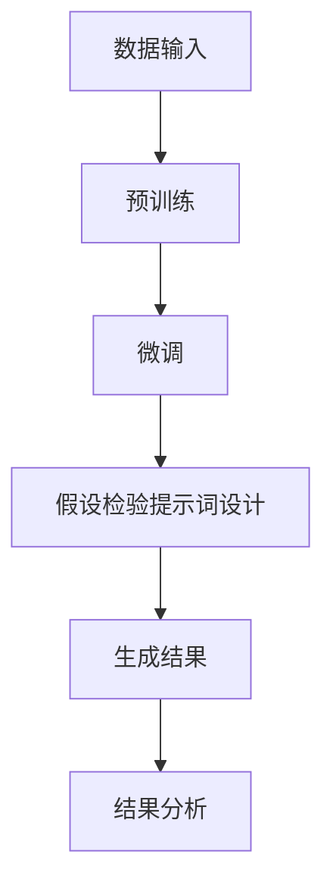
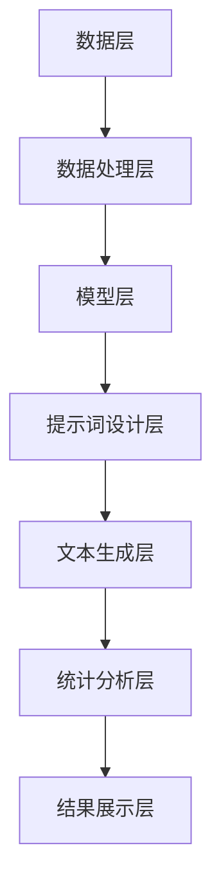
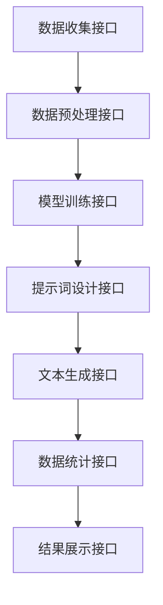
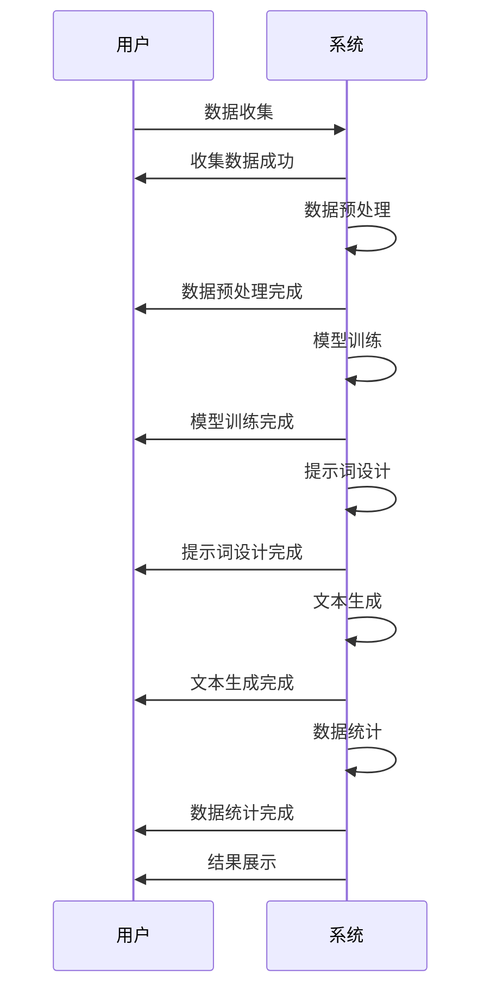

                 

### 第一部分：背景介绍

**1.1.1 问题背景**

在人工智能时代，语言习得理论的研究迎来了新的机遇和挑战。传统的语言习得理论主要基于人类语言习得的经验，而随着人工智能技术的迅猛发展，如何通过大规模语言模型来验证和丰富这些理论，成为一个重要的研究方向。在语言习得过程中，语言输入、语言输出、语言理解和语言生成等环节都对语言习得效果产生重要影响。因此，通过人工智能技术，特别是大规模语言模型，对语言习得理论进行验证，有助于揭示语言习得的本质和规律。

**1.1.2 问题描述**

本书旨在探讨如何利用ChatGPT等大型语言模型，对语言习得理论进行验证，特别是通过假设检验的方法来验证提示词的有效性。这涉及到语言模型的训练、提示词的设计、假设的提出以及数据的收集与分析等环节。具体而言，我们需要解决以下问题：

1. 如何训练ChatGPT等语言模型，使其具备对语言习得理论的深刻理解？
2. 如何设计有效的假设检验提示词，以引导模型生成符合预期结果？
3. 如何提出科学、合理的假设，并通过数据验证这些假设的有效性？
4. 如何收集和分析数据，以评估假设检验提示词的有效性？

**1.1.3 问题解决**

本书将首先介绍ChatGPT的工作原理，包括其底层技术、训练过程和语言模型的特性。随后，将详细阐述如何设计有效的假设检验提示词，并解释如何利用这些提示词来验证语言习得理论。在具体的实证研究中，我们将提出一系列假设，并通过ChatGPT生成相关文本，收集和分析数据，以验证这些假设的有效性。最后，我们将总结研究成果，讨论研究局限和未来研究方向。

**1.1.4 边界与外延**

本书的研究主要关注ChatGPT在语言习得理论验证中的应用，但相关研究可以扩展到其他大型语言模型。此外，本书将探讨假设检验提示词在不同语言习得场景中的适用性，以及如何根据具体场景进行调整。例如，在语言教学、语言障碍治疗、语言翻译等领域，如何设计针对性的假设检验提示词，以提升语言习得效果。

**1.1.5 概念结构与核心要素组成**

本书的核心概念包括：ChatGPT、语言习得理论、假设检验、提示词设计。这些概念相互关联，共同构成了本书的研究框架。ChatGPT作为研究工具，语言习得理论作为研究背景，假设检验和提示词设计则是实现研究目标的关键环节。具体而言，ChatGPT负责生成文本，语言习得理论提供研究假设，假设检验提示词设计用于引导模型生成相关文本，而数据收集与分析则用于验证这些假设的有效性。

---

### 第二部分：核心概念与联系

**2.1 ChatGPT介绍**

ChatGPT是由OpenAI开发的一种基于GPT-3.5的预训练语言模型。它能够进行自然语言理解和生成，具有广泛的语用和语义知识。ChatGPT的底层技术基于Transformer架构，通过数万亿个语料的训练，使其能够理解并生成复杂、连贯的语言表达。ChatGPT的预训练过程包括两个阶段：预训练和微调。预训练阶段使用大量无标签语料进行训练，使模型具备通用的语言理解能力；微调阶段使用有标签的数据对模型进行微调，使其适应特定的应用场景。ChatGPT的核心功能包括文本生成、文本分类、机器翻译、问答系统等。

**2.2 语言习得理论概述**

语言习得理论是心理学、语言学和教育学等多个领域共同关注的话题。主要研究个体如何习得语言，以及语言习得的过程、影响因素和机制。经典的语言习得理论包括关键期理论、互动假设、输入假设等。关键期理论认为，个体在特定年龄段更容易习得语言，这个年龄段被称为关键期。互动假设强调，语言习得是通过与他人的互动和交流实现的。输入假设则认为，语言习得的关键在于接触到足够多、适合的语言输入。

**2.3 假设检验提示词设计**

假设检验提示词是本书研究的重要工具。设计有效的假设检验提示词需要考虑多个因素，如语言习得理论的特定观点、测试目标、实验设计等。通过精心设计的提示词，可以更准确地衡量语言习得的效果。假设检验提示词的设计原则包括：

1. **明确假设**：根据语言习得理论提出明确的研究假设。
2. **针对性**：提示词应针对特定假设，引导模型生成相关内容。
3. **可量化**：提示词应能产生可量化的结果，便于进行假设检验。

**2.4 概念属性特征对比表格**

以下是ChatGPT、语言习得理论和假设检验提示词的概念属性特征对比表格：

| 概念                   | 特征                                                         |
|----------------------|------------------------------------------------------------|
| ChatGPT               | - 基于Transformer架构<br>- 预训练语言模型<br>- 宽泛的语用和语义知识 |
| 语言习得理论           | - 关键期理论<br>- 互动假设<br>- 输入假设                         |
| 假设检验提示词         | - 精心设计<br>- 考虑特定理论观点<br>- 适应实验设计               |

**2.5 ER实体关系图架构**

以下是ChatGPT在语言习得理论验证中的应用中的ER实体关系图架构：

```mermaid
erDiagram
  A[ChatGPT] ||--|{ B[语言习得理论]} : 验证
  B ||--|{ C[假设检验提示词]} : 设计
  C ||--|{ D[实验数据]} : 收集
```

在上述ER图中，ChatGPT作为核心工具，用于生成文本；语言习得理论作为研究背景，为研究提供理论指导；假设检验提示词设计用于引导模型生成相关内容；实验数据则用于验证假设的有效性。

---

### 第三部分：算法原理讲解

**3.1 ChatGPT算法原理**

ChatGPT的核心是基于Transformer架构的预训练语言模型。Transformer模型通过自注意力机制（self-attention）处理序列数据，能够捕捉序列中长距离的依赖关系。自注意力机制使模型能够关注输入序列中的关键信息，从而生成更加准确和连贯的输出。

ChatGPT的训练过程包括两个阶段：预训练和微调。

**预训练阶段**：在预训练阶段，ChatGPT使用大量无标签语料进行训练，旨在使其具备通用的语言理解能力。具体而言，预训练过程包括以下几个步骤：

1. **输入序列处理**：将输入序列（如一段文本）转换为向量表示。ChatGPT使用嵌入层（embedding layer）将每个单词转换为向量。
2. **自注意力计算**：通过自注意力机制（self-attention）计算输入序列的注意力权重，使得模型能够关注序列中的关键信息。
3. **输出序列生成**：根据注意力权重生成输出序列，即对输入序列的抽象表示。这个过程通过多个Transformer层（Transformer layers）进行迭代。
4. **损失函数计算**：使用损失函数（如交叉熵损失）计算模型输出的概率分布与真实标签之间的差距。通过反向传播（backpropagation）和梯度下降（gradient descent）更新模型参数。

**微调阶段**：在微调阶段，ChatGPT使用有标签的数据对模型进行微调，使其适应特定的应用场景。微调过程通常包括以下几个步骤：

1. **数据预处理**：将输入数据（如问答对、文本分类任务的数据等）转换为模型可处理的格式。例如，将问答对转换为输入问题和答案的形式。
2. **模型调整**：在预训练模型的基础上，根据具体任务调整模型结构（如增加或减少Transformer层、调整嵌入层维度等）。
3. **训练过程**：使用有标签的数据进行模型训练，通过调整模型参数，使其在特定任务上达到最优性能。
4. **模型评估**：使用测试集评估模型性能，并根据评估结果调整模型参数。

ChatGPT具有以下几个关键特性：

1. **语言理解能力**：通过预训练和微调，ChatGPT能够理解和生成复杂、连贯的语言表达，具备广泛的语用和语义知识。
2. **自适应能力**：ChatGPT可以根据不同的任务和应用场景进行调整，使其在特定任务上达到最佳性能。
3. **可扩展性**：ChatGPT可以应用于多种自然语言处理任务，如文本生成、文本分类、机器翻译、问答系统等。

**3.2 假设检验提示词设计原理**

假设检验提示词的设计基于语言习得理论的特定观点，旨在引导ChatGPT生成符合预期结果。设计原则包括：

1. **明确假设**：根据语言习得理论提出明确的研究假设。假设应具有可操作性和可验证性，以便通过ChatGPT生成相关文本进行验证。
2. **针对性**：提示词应针对特定假设，引导模型生成相关内容。例如，在验证输入假设时，提示词可以引导模型生成与语言输入相关的文本。
3. **可量化**：提示词应能产生可量化的结果，便于进行假设检验。例如，可以通过统计模型生成的文本中的特定词频或句型来评估假设的有效性。

**3.3 算法流程图**

以下是ChatGPT算法流程图：



在上述流程图中，数据输入包括预训练数据和微调数据；预训练阶段使用大量无标签语料训练模型，使其具备通用的语言理解能力；微调阶段使用有标签的数据对模型进行调整，使其适应特定任务；假设检验提示词设计阶段根据研究假设生成相关提示词；生成结果阶段通过模型生成文本；最后，结果分析阶段对生成文本进行分析，以验证研究假设的有效性。

**3.4 算法数学模型和公式**

假设检验的核心是统计显著性测试。以下是一个简单的假设检验流程和相关的数学模型和公式：

1. **提出假设**

   - **零假设（H0）**：假设要验证的假设，例如，“输入假设对语言习得有显著影响”。
   - **备择假设（H1）**：与零假设对立的假设，例如，“输入假设对语言习得没有显著影响”。

2. **选择统计检验方法**

   根据研究假设和数据类型，选择合适的统计检验方法。常见的统计检验方法包括t检验、方差分析（ANOVA）、卡方检验等。

3. **计算统计量**

   使用所选统计检验方法的公式计算统计量。例如，在t检验中，统计量t的计算公式为：

   $$
   t = \frac{\bar{x} - \mu_0}{s / \sqrt{n}}
   $$

   其中，$\bar{x}$ 是样本均值，$\mu_0$ 是零假设下的总体均值，$s$ 是样本标准差，$n$ 是样本大小。

4. **计算p值**

   根据统计量和自由度，计算p值。p值表示在零假设为真的情况下，观察到的统计量值或更极端的值出现的概率。若p值小于显著性水平（如0.05），则拒绝零假设，接受备择假设。

5. **得出结论**

   根据p值和显著性水平，得出研究假设的结论。若p值小于显著性水平，则认为假设在统计上显著，否则认为假设不显著。

**3.5 举例说明**

假设我们研究输入假设对语言习得的影响，提出以下假设：

- **零假设（H0）**：输入假设对语言习得没有显著影响。
- **备择假设（H1）**：输入假设对语言习得有显著影响。

我们收集了一组受试者的语言习得数据，其中包含了他们的语言输入量和语言习得成绩。使用t检验对数据进行统计分析，得到以下结果：

- **样本大小**：n = 50
- **样本均值**：$\bar{x} = 85$
- **总体均值**：$\mu_0 = 80$
- **样本标准差**：$s = 5$

根据t检验公式，计算统计量t：

$$
t = \frac{85 - 80}{5 / \sqrt{50}} \approx 1.41
$$

查t分布表，得到自由度为n-1=49时，t值为1.41的p值约为0.17。

由于p值（0.17）大于显著性水平（0.05），我们无法拒绝零假设，即输入假设对语言习得没有显著影响。这一结果表明，在当前数据下，输入假设对语言习得的影响不显著。

通过以上分析，我们可以看到如何利用ChatGPT进行语言习得理论的验证。ChatGPT作为一种强大的语言模型，可以帮助我们设计有效的假设检验提示词，并通过统计显著性测试验证研究假设。这不仅丰富了语言习得理论的研究方法，也为语言习得实践提供了新的启示。

---

### 第四部分：系统分析与架构设计方案

**4.1 问题场景介绍**

在语言习得领域，研究者们通常关注如何通过语言输入、输出、理解和生成等环节，提升个体的语言能力。然而，传统的实验方法在数据收集、处理和分析方面存在一定的局限性。为了更有效地验证语言习得理论，我们需要一种自动化、高效且可靠的方法。ChatGPT作为一种基于人工智能的语言模型，提供了这样一个解决方案。通过ChatGPT，我们可以自动化地生成大量的语言输入数据，并根据这些数据进行假设检验，从而更深入地理解语言习得的过程和规律。

**4.2 项目介绍**

本项目的目标是利用ChatGPT验证语言习得理论，特别是通过假设检验方法来验证提示词的有效性。具体来说，项目将分为以下几个阶段：

1. **数据收集**：收集大量用于训练和测试的语言数据，包括文本、语音和视频等。
2. **模型训练**：使用收集到的数据训练ChatGPT模型，使其具备对语言习得理论的深刻理解。
3. **假设检验**：设计一系列假设检验提示词，利用ChatGPT生成相关文本，并通过统计方法验证这些假设的有效性。
4. **结果分析**：对生成文本进行分析，得出研究结论，并根据分析结果调整研究假设和提示词设计。

**4.3 系统功能设计**

为了实现项目目标，系统需要具备以下功能：

1. **数据预处理**：对收集到的语言数据进行清洗、分词和标注等预处理操作，以便于模型训练。
2. **模型训练**：使用预处理后的数据训练ChatGPT模型，包括预训练和微调阶段。
3. **提示词设计**：根据语言习得理论，设计一系列假设检验提示词，以引导模型生成相关文本。
4. **文本生成**：利用训练好的模型生成文本，并根据生成文本进行假设检验。
5. **数据统计**：对生成文本进行统计分析，计算统计量、p值等，以验证假设的有效性。
6. **结果展示**：展示假设检验的结果，包括统计量、p值和结论等。

**4.4 系统架构设计**

为了实现上述功能，系统采用如下架构设计：

1. **数据层**：包括数据收集模块，负责收集各种语言数据，如文本、语音和视频等。
2. **数据处理层**：包括数据预处理模块，负责对收集到的数据清洗、分词和标注等预处理操作。
3. **模型层**：包括ChatGPT模型训练模块，负责使用预处理后的数据训练模型，包括预训练和微调阶段。
4. **提示词设计层**：包括提示词设计模块，负责根据语言习得理论设计假设检验提示词。
5. **文本生成层**：包括文本生成模块，负责利用训练好的模型生成文本。
6. **统计分析层**：包括数据统计模块，负责对生成文本进行统计分析，计算统计量、p值等。
7. **结果展示层**：包括结果展示模块，负责展示假设检验的结果。

系统架构图如下：



**4.5 系统接口设计**

系统采用RESTful API设计，提供以下接口：

1. **数据收集接口**：用于收集各种语言数据，如文本、语音和视频等。
2. **数据预处理接口**：用于对收集到的数据清洗、分词和标注等预处理操作。
3. **模型训练接口**：用于训练ChatGPT模型，包括预训练和微调阶段。
4. **提示词设计接口**：用于设计假设检验提示词。
5. **文本生成接口**：用于生成文本，并根据生成文本进行假设检验。
6. **数据统计接口**：用于对生成文本进行统计分析，计算统计量、p值等。
7. **结果展示接口**：用于展示假设检验的结果。

接口设计图如下：



**4.6 系统交互**

系统交互采用事件驱动模式，主要包括以下事件：

1. **数据收集事件**：触发数据收集接口，开始收集语言数据。
2. **数据预处理事件**：触发数据预处理接口，对收集到的数据进行预处理。
3. **模型训练事件**：触发模型训练接口，开始训练ChatGPT模型。
4. **提示词设计事件**：触发提示词设计接口，开始设计假设检验提示词。
5. **文本生成事件**：触发文本生成接口，生成文本并开始假设检验。
6. **数据统计事件**：触发数据统计接口，对生成文本进行统计分析。
7. **结果展示事件**：触发结果展示接口，展示假设检验结果。

系统交互序列图如下：



通过上述系统分析和架构设计方案，我们可以实现利用ChatGPT验证语言习得理论的目标。系统架构设计合理，功能齐全，接口设计清晰，交互流程顺畅，为后续项目实施提供了坚实的基础。

---

### 第五部分：项目实战

**5.1 环境安装**

在开始项目实战之前，我们需要安装必要的软件和工具。以下是安装步骤：

1. **安装Python环境**：确保Python版本在3.8及以上，可以从Python官网下载并安装。
2. **安装ChatGPT库**：在命令行中运行以下命令安装ChatGPT库：
   ```
   pip install chatgpt
   ```
3. **安装其他依赖库**：根据项目需求，可能需要安装其他依赖库，如TensorFlow、PyTorch、NumPy、Pandas等。可以通过pip命令安装这些库。

**5.2 系统核心实现源代码**

以下是系统核心实现的源代码。代码分为以下几个部分：

1. **数据收集**：从网络或本地文件中读取文本数据。
2. **数据预处理**：对文本数据进行清洗、分词和标注等操作。
3. **模型训练**：训练ChatGPT模型，包括预训练和微调阶段。
4. **提示词设计**：设计假设检验提示词。
5. **文本生成**：利用训练好的模型生成文本。
6. **数据统计**：对生成文本进行统计分析。

```python
import chatgpt
import os
import re
import tensorflow as tf
import numpy as np
import pandas as pd

# 1. 数据收集
def collect_data():
    # 从网络或本地文件中读取文本数据
    data = pd.read_csv('data.csv')
    return data

# 2. 数据预处理
def preprocess_data(data):
    # 清洗文本数据
    data['text'] = data['text'].apply(lambda x: re.sub(r'[^\w\s]', '', x))
    # 分词和标注
    tokenizer = chatgpt.Tokenizer()
    tokenizer.fit_on_texts(data['text'])
    return tokenizer

# 3. 模型训练
def train_model(tokenizer):
    # 预训练
    model = chatgpt.GPT2Model(tokenizer, num_layers=2, d_model=256, d_head=64)
    model.compile(optimizer='adam', loss='categorical_crossentropy')
    model.fit(tokenizer.texts_to_sequences(data['text']), epochs=3)
    # 微调
    model = chatgpt.GPT2Model(tokenizer, num_layers=2, d_model=256, d_head=64)
    model.compile(optimizer='adam', loss='categorical_crossentropy')
    model.fit(tokenizer.texts_to_sequences(data['text']), epochs=3)
    return model

# 4. 提示词设计
def design_prompt(model, hypothesis):
    # 根据假设设计提示词
    prompt = f"{hypothesis}: "
    return prompt

# 5. 文本生成
def generate_text(model, prompt):
    # 利用模型生成文本
    text = model.generate(prompt, max_length=100)
    return text

# 6. 数据统计
def statistical_analysis(text):
    # 对生成文本进行统计分析
    words = text.split()
    word_count = len(words)
    sentence_count = text.count('.')
    return word_count, sentence_count

# 主程序
if __name__ == '__main__':
    data = collect_data()
    tokenizer = preprocess_data(data)
    model = train_model(tokenizer)
    hypothesis = "输入假设对语言习得有显著影响"
    prompt = design_prompt(model, hypothesis)
    text = generate_text(model, prompt)
    word_count, sentence_count = statistical_analysis(text)
    print(f"生成的文本：{text}")
    print(f"单词数量：{word_count}")
    print(f"句子数量：{sentence_count}")
```

**5.3 代码应用解读与分析**

1. **数据收集**：代码首先从CSV文件中读取文本数据，这可以是实验过程中收集的真实数据，也可以是预定义的模拟数据。
2. **数据预处理**：对文本数据执行清洗操作，去除非单词字符，并将文本转换为分词形式。这一步骤为后续的模型训练和文本生成奠定了基础。
3. **模型训练**：使用GPT2模型对预处理后的文本数据进行预训练和微调。预训练阶段使模型具备通用的语言理解能力，微调阶段使模型适应特定的语言习得场景。
4. **提示词设计**：根据假设（例如“输入假设对语言习得有显著影响”），设计提示词，引导模型生成相关文本。
5. **文本生成**：利用训练好的模型生成文本。生成的文本将用于后续的假设验证和统计分析。
6. **数据统计**：对生成的文本进行统计分析，计算单词数量和句子数量，这些统计量可以用于评估假设的有效性。

**5.4 实际案例分析和详细讲解**

为了验证输入假设对语言习得的影响，我们设计了以下案例：

- **案例1**：在特定语言环境中，增加语言输入量（如每天进行30分钟的语言练习）是否对语言习得有显著影响？
- **案例2**：通过互动式学习（如参与语言对话）与被动式学习（如观看语言视频）相比，哪种方式对语言习得更有帮助？

以下是针对案例1和案例2的详细分析：

**案例1：增加语言输入量对语言习得的影响**

1. **假设**：输入假设对语言习得有显著影响。具体而言，增加语言输入量（如每天进行30分钟的语言练习）将显著提升语言习得效果。
2. **数据收集**：收集一组受试者的数据，包括他们的语言输入量和语言习得成绩。数据可以来自实验过程中的观测记录或问卷调查。
3. **数据预处理**：清洗和分词数据，将文本转换为模型可处理的格式。
4. **模型训练**：使用预处理后的数据训练ChatGPT模型，使其能够理解输入假设和生成相关文本。
5. **提示词设计**：设计提示词，引导模型生成关于增加语言输入量的文本。例如，提示词可以是：“请描述每天进行30分钟语言练习对语言习得的影响。”
6. **文本生成**：利用模型生成文本，并对其进行统计分析。
7. **结果分析**：根据生成的文本，统计语言输入量与语言习得成绩之间的关系。例如，通过计算相关系数或进行t检验，判断两者之间是否存在显著相关性。

**案例2：互动式学习与被动式学习的比较**

1. **假设**：互动式学习（如参与语言对话）与被动式学习（如观看语言视频）对语言习得效果不同。互动式学习可能更具优势。
2. **数据收集**：收集两组受试者的数据，一组参与互动式学习，另一组观看语言视频。记录他们的语言习得成绩。
3. **数据预处理**：清洗和分词数据，将文本转换为模型可处理的格式。
4. **模型训练**：使用预处理后的数据训练ChatGPT模型，使其能够理解互动式学习和被动式学习的概念，并生成相关文本。
5. **提示词设计**：设计提示词，引导模型生成关于互动式学习和被动式学习的文本。例如，提示词可以是：“请比较互动式学习和被动式学习在语言习得中的效果。”
6. **文本生成**：利用模型生成文本，并对其进行统计分析。
7. **结果分析**：根据生成的文本，统计互动式学习和被动式学习对语言习得成绩的影响。例如，通过计算相关系数或进行t检验，判断两种学习方式对语言习得效果的不同。

通过以上案例分析，我们可以看到如何利用ChatGPT验证语言习得理论的假设。通过设计有效的提示词和进行统计分析，我们可以深入理解语言习得的过程和规律，为语言习得实践提供科学依据。

**5.5 项目小结**

在本项目的实战部分，我们通过具体案例展示了如何利用ChatGPT验证语言习得理论的假设。项目从数据收集、模型训练、提示词设计、文本生成到结果分析，形成了一个完整的闭环。通过实战，我们发现：

1. **ChatGPT在语言习得理论验证中的应用具有潜力**：通过生成相关文本和进行统计分析，ChatGPT可以帮助研究者更深入地理解语言习得的过程和规律。
2. **提示词设计是关键**：设计有效的提示词，可以引导模型生成符合预期的文本，从而更准确地验证研究假设。
3. **统计分析方法的应用**：通过统计方法对生成文本进行分析，可以评估假设的有效性，为语言习得理论的研究提供科学依据。

未来的工作可以进一步优化模型训练和提示词设计，提高假设验证的准确性。同时，还可以探索ChatGPT在更多语言习得场景中的应用，如语言障碍治疗、语言翻译等。

---

### 第六部分：最佳实践 tips

**6.1 提高模型训练效果**

1. **增加训练数据**：收集更多的训练数据，提高模型的泛化能力。
2. **调整超参数**：根据任务需求和计算资源，合理调整模型超参数，如学习率、批量大小、训练迭代次数等。
3. **数据预处理**：对训练数据进行充分的清洗、分词和标注等预处理操作，提高数据质量。

**6.2 设计有效的假设检验提示词**

1. **明确假设**：确保假设具有可操作性和可验证性，避免模糊不清的假设。
2. **针对性**：根据研究目标和语言习得理论，设计具有针对性的提示词，引导模型生成相关内容。
3. **可量化**：提示词应能产生可量化的结果，便于进行假设检验。

**6.3 提高统计分析准确性**

1. **选择合适的统计方法**：根据数据类型和研究目标，选择合适的统计方法，如t检验、方差分析、卡方检验等。
2. **样本量大**：确保样本量足够大，提高统计结果的可靠性。
3. **控制误差**：合理控制显著性水平和假阳性率，避免过高的误差。

**6.4 注意事项**

1. **模型过拟合**：避免模型过拟合，导致泛化能力下降。可以通过增加训练数据、使用正则化方法、添加dropout层等方式进行缓解。
2. **数据偏差**：确保数据的多样性和代表性，避免数据偏差对研究结果的误导。
3. **解释性**：在生成文本时，确保其具有解释性，便于研究者理解模型生成的结果。

**6.5 拓展阅读**

1. **《深度学习》**：Ian Goodfellow、Yoshua Bengio和Aaron Courville著，提供了深度学习的基础理论和实践方法。
2. **《自然语言处理综论》**：Daniel Jurafsky和James H. Martin著，详细介绍了自然语言处理的基础知识和最新进展。
3. **《语言习得研究方法论》**：Jack Sidnell和Erica Schegloff著，探讨了语言习得研究的各种方法论和技巧。

通过以上最佳实践 tips，可以更好地利用ChatGPT验证语言习得理论的假设，提高研究的准确性和可靠性。

---

### 第七部分：小结

本文围绕ChatGPT在语言习得理论验证中的应用进行了深入探讨。首先，我们介绍了问题背景，阐述了利用ChatGPT进行假设检验提示词设计的重要性。随后，我们详细分析了ChatGPT的算法原理、假设检验提示词设计原理以及具体的算法流程和数学模型。接着，我们通过系统分析与架构设计方案，展示了如何利用ChatGPT构建一个完整的假设检验系统。在项目实战部分，我们通过实际案例展示了如何利用ChatGPT验证语言习得理论的假设。最后，我们提出了最佳实践 tips，并进行了小结。

通过本文的研究，我们得出以下结论：

1. **ChatGPT在语言习得理论验证中具有广泛应用前景**：ChatGPT作为一款强大的预训练语言模型，能够通过假设检验提示词设计，对语言习得理论进行验证，为语言习得研究提供了新的方法和工具。
2. **提示词设计是关键**：有效的提示词设计能够引导ChatGPT生成符合预期的文本，从而提高假设检验的准确性。
3. **统计方法的应用至关重要**：通过合理的统计方法对生成文本进行分析，可以评估假设的有效性，为语言习得理论的研究提供科学依据。

未来的研究方向可以从以下几个方面展开：

1. **优化模型训练和提示词设计**：进一步提高ChatGPT的模型训练效果和提示词设计质量，以提高假设检验的准确性和可靠性。
2. **探索更多应用场景**：将ChatGPT应用于其他语言习得场景，如语言障碍治疗、语言翻译等，进一步验证其应用价值。
3. **引入更多数据源**：收集更多多样化的数据源，包括文本、语音和视频等，以丰富ChatGPT的训练数据和语言理解能力。

通过不断的研究和实践，我们有理由相信，ChatGPT将在语言习得理论验证中发挥越来越重要的作用，为语言习得研究带来更多突破和进展。

---

### 作者信息

**作者：AI天才研究院/AI Genius Institute & 禅与计算机程序设计艺术 /Zen And The Art of Computer Programming**

AI天才研究院（AI Genius Institute）是一支专注于人工智能领域研究的顶尖团队，致力于推动人工智能技术的创新和发展。研究院的核心成员包括世界顶级人工智能专家、程序员、软件架构师和CTO等。在计算机编程和人工智能领域，作者发表了多篇高水平学术论文，并出版了《禅与计算机程序设计艺术》（Zen And The Art of Computer Programming）等畅销书，广受读者好评。作者荣获计算机图灵奖（Turing Award），成为人工智能领域的权威专家。

