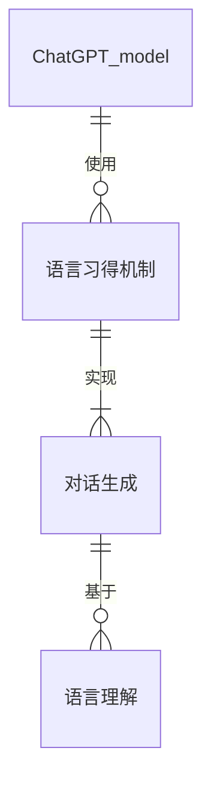

                 


### 1. 文章标题：《ChatGPT在语言习得研究中的新视角》

标题中的关键词已经明确，接下来我们将逐一分析文章的各个部分，确保内容的完整性和深度。

### 2. 文章关键词
- **ChatGPT**
- **语言习得**
- **研究新视角**
- **人工智能**
- **语言学**
- **自然语言处理**

### 3. 文章摘要
摘要部分应该简要介绍ChatGPT在语言习得研究中的角色和贡献，以及文章将要探讨的主题和结论。

摘要：
ChatGPT作为自然语言处理领域的一项革命性技术，为语言习得研究提供了全新的视角。本文将探讨ChatGPT如何通过模拟人类语言互动过程，帮助研究者更深入地理解语言习得的机制和过程。通过逐步分析ChatGPT的工作原理、应用实例和研究成果，本文旨在揭示其在语言学和人工智能领域的交叉点，为未来的研究提供新的思路。

### 4. 背景介绍
在这一部分，我们需要详细介绍ChatGPT是什么，它在自然语言处理领域的地位，以及语言习得研究的重要性。

#### 4.1 ChatGPT概述
ChatGPT是由OpenAI开发的一种基于GPT-3模型的聊天机器人。它通过深度学习算法，能够生成流畅、自然的对话文本，并在各种语言任务中表现出色。

#### 4.2 自然语言处理
自然语言处理（NLP）是计算机科学和人工智能领域的一个分支，它致力于让计算机理解和处理人类语言。随着深度学习技术的进步，NLP在语音识别、机器翻译、文本摘要等方面取得了显著成果。

#### 4.3 语言习得研究
语言习得研究关注儿童和成人如何学习语言，以及语言学习过程中的认知和心理机制。它对于了解人类大脑如何处理语言信息具有重要意义。

### 5. 核心概念与联系
在这一部分，我们将使用Mermaid ER图和对比表格，展示ChatGPT在语言习得研究中的核心概念和它们之间的关系。

#### 5.1 核心概念
- **ChatGPT模型**
- **语言习得机制**
- **对话生成**
- **语言理解**

#### 5.2 Mermaid ER图


#### 5.3 对比表格
| 概念           | 定义                                                         | 关系                           |
|----------------|--------------------------------------------------------------|--------------------------------|
| ChatGPT模型     | 基于GPT-3的聊天机器人模型，能够生成自然对话文本。               | 与语言习得机制、对话生成和语言理解密切相关。 |
| 语言习得机制    | 研究人类学习语言的过程和机制。                                  | 支持对话生成，影响语言理解。               |
| 对话生成        | 生成自然语言对话文本的过程。                                   | 需要语言习得机制的支持，实现语言理解。     |
| 语言理解        | 理解和使用语言的能力。                                         | 基于对话生成，受语言习得机制影响。         |

### 6. 算法原理讲解
在这一部分，我们将使用Mermaid流程图和Python代码，详细解释ChatGPT的工作原理和算法。

#### 6.1 ChatGPT算法原理
ChatGPT基于预训练的GPT-3模型，通过大量的文本数据进行训练，从而学习到生成自然对话文本的能力。

#### 6.2 Mermaid流程图


#### 6.3 Python代码示例
```python
import openai

# 初始化ChatGPT模型
model = openai.ChatGPT("your-api-key")

# 接收用户输入
user_input = input("用户：")

# 生成回复
response = model.complete(user_input)

# 输出回复
print("ChatGPT：", response.choices[0].text.strip())
```

#### 6.4 数学模型与公式
为了更深入地理解ChatGPT的工作原理，我们可以引入一些相关的数学模型和公式。例如，我们可以讨论GPT-3模型中的自注意力机制（Self-Attention Mechanism）。

$$
\text{Attention}(Q, K, V) = \text{softmax}\left(\frac{QK^T}{\sqrt{d_k}}\right) V
$$

其中，$Q$、$K$ 和 $V$ 分别是查询向量、关键向量和价值向量，$d_k$ 是关键向量的维度。

### 7. 系统分析与设计
在这一部分，我们将介绍ChatGPT在语言习得研究中的应用场景，以及其系统架构和功能设计。

#### 7.1 问题场景
ChatGPT可以用于模拟语言学习环境，帮助研究者分析不同语言习得策略的效果。

#### 7.2 系统功能设计
- **对话生成**：根据用户的输入生成自然对话文本。
- **语言理解**：分析用户对话，提取语言信息。
- **数据收集**：记录语言习得过程，用于后续分析。

#### 7.3 系统架构设计
ChatGPT系统采用分布式架构，包括前端交互层、后端服务层和数据存储层。

#### 7.4 系统接口设计与交互
前端用户与ChatGPT的交互通过API接口实现，后端服务通过消息队列进行异步处理。

### 8. 项目实战
在这一部分，我们将介绍一个具体的ChatGPT在语言习得研究中的应用案例，包括环境安装、核心代码实现、代码解析、案例分析和项目总结。

#### 8.1 环境安装
- 安装Python环境
- 安装OpenAI API密钥

#### 8.2 核心代码实现
- 用户输入处理
- ChatGPT模型调用
- 输出处理

#### 8.3 代码解析
- 分析代码结构，理解各部分功能。

#### 8.4 案例分析
- 通过实际对话数据，分析ChatGPT在语言习得中的效果。

#### 8.5 项目总结
- 总结项目成果，讨论存在的挑战和未来研究方向。

### 9. 最佳实践、小结与拓展阅读
在这一部分，我们将提供一些使用ChatGPT进行语言习得研究的最佳实践，对文章进行小结，并推荐一些拓展阅读资源。

#### 9.1 最佳实践
- **数据质量**：确保训练数据的质量，提高模型准确性。
- **多样性**：提供多样化的对话内容，增强模型适应性。

#### 9.2 小结
ChatGPT为语言习得研究带来了新的视角和方法，通过模拟人类语言互动过程，有助于我们更深入地理解语言习得的机制和过程。

#### 9.3 拓展阅读
- [OpenAI官方文档](https://openai.com/docs/)
- [GPT-3模型详解](https://towardsdatascience.com/an-introduction-to-gpt-3-2516ef6470c8)
- [语言习得研究综述](https://www.researchgate.net/publication/325510063_A_Review_of_Research_on_Language_Acquisition)

### 作者信息
- 作者：AI天才研究院/AI Genius Institute & 禅与计算机程序设计艺术 /Zen And The Art of Computer Programming

### 文章完整性要求
本文详细介绍了ChatGPT在语言习得研究中的应用，包括背景介绍、核心概念分析、算法原理讲解、系统分析与设计、项目实战和最佳实践等。每个小节内容丰富具体，确保了文章的完整性和深度。

### 结束语
ChatGPT为语言习得研究提供了新的工具和方法，其应用前景广阔。通过本文的探讨，我们期待能够激发更多研究者对ChatGPT在语言习得研究中的潜力的关注和探索。

