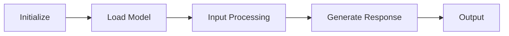
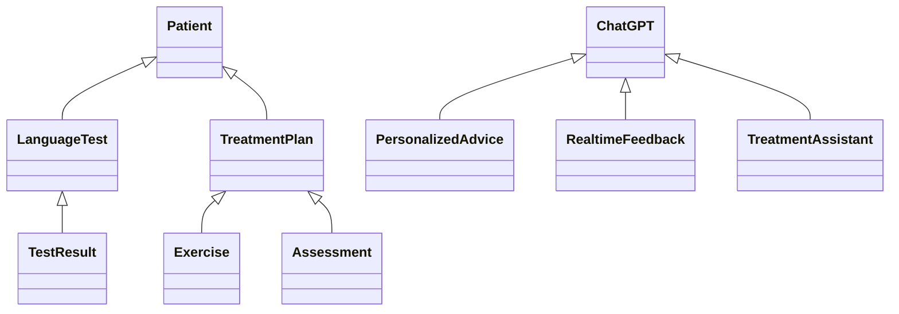
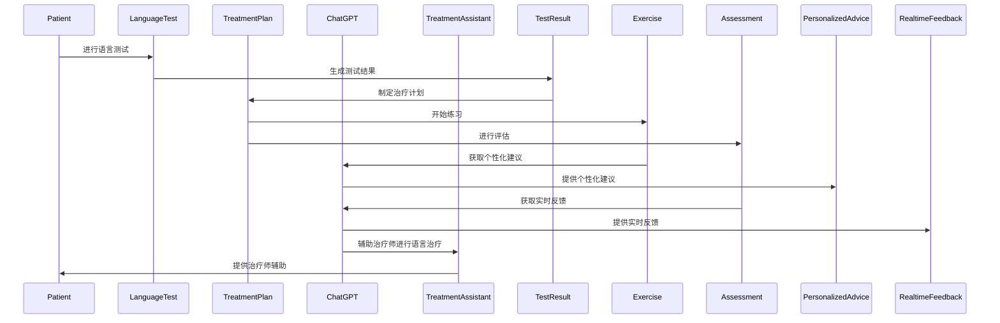
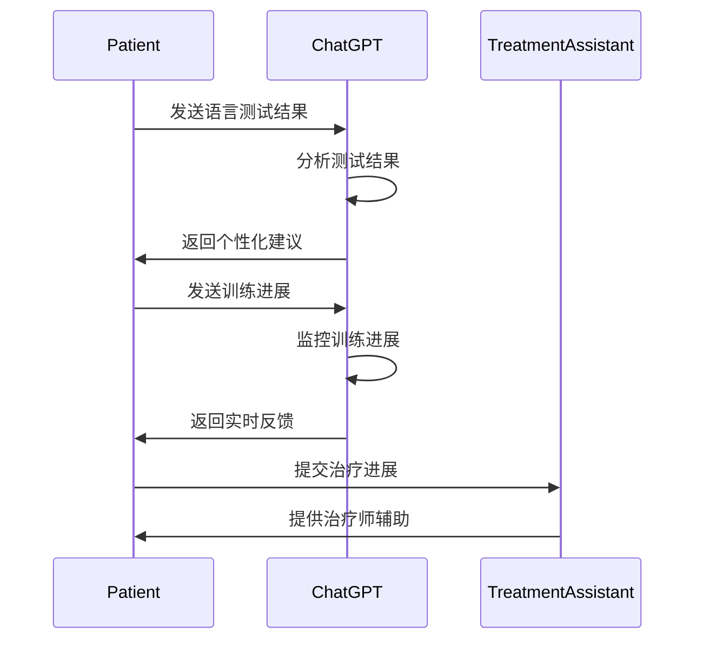

                 


### 文章标题
# ChatGPT在语言习得障碍治疗中的角色

### 关键词
- ChatGPT
- 语言习得障碍
- 人工智能治疗
- 自然语言处理
- 治疗方案

### 摘要
本文探讨了ChatGPT在语言习得障碍（LAD）治疗中的应用。首先，介绍了语言习得障碍的定义、类型及其对患者生活的影响。随后，阐述了ChatGPT的基本原理和其在自然语言处理中的优势。本文通过逐步分析ChatGPT的应用场景、算法原理和系统架构，展示了其在LAD治疗中的潜力。最后，通过实际案例分析和最佳实践建议，探讨了ChatGPT在LAD治疗中的实际应用效果和未来发展方向。

## 背景介绍
### 核心概念术语说明
#### 语言习得障碍（LAD）
语言习得障碍是指个体在语言习得过程中出现的一系列障碍，这些障碍可能影响个体的发音、词汇、语法、语用等方面。LAD可以表现为特定语言障碍（如自闭症谱系障碍中的语言障碍）、整体语言障碍（如智力障碍伴随的语言障碍）等。

#### 语言习得（Language Acquisition）
语言习得是指个体在特定环境（如家庭、学校）中，通过接触和使用语言而逐渐掌握语言的过程。这一过程包括语音、词汇、语法、语用等方面的学习。

#### 自然语言处理（NLP）
自然语言处理是指计算机对人类自然语言的自动处理和理解。NLP涵盖了文本分析、语音识别、机器翻译、情感分析等多个领域。

#### ChatGPT
ChatGPT是由OpenAI开发的一种基于GPT-3模型的聊天机器人，它能够理解并生成自然语言的文本。ChatGPT具有强大的语言生成和交互能力，可以在多种场景下为用户提供帮助。

### 问题背景
语言习得障碍对患者的生活和学习产生了严重影响。根据美国国家卫生研究院的数据，约6.5%的美国儿童患有语言障碍，这些障碍可能导致沟通困难、社交问题、学业受挫等。目前，LAD的治疗方法主要包括语言治疗、康复训练、家庭干预等，但这些方法存在一定局限性，如治疗效果有限、患者依从性差等。

### 问题描述
#### 存在的问题
- 语言治疗师资源有限，无法满足大量患者的需求。
- 治疗过程缺乏个性化，难以针对患者的具体问题进行有效干预。
- 患者在家进行康复训练时，缺乏有效的监督和指导。

#### 期望解决的问题
- 提高LAD患者的治疗效果。
- 提供个性化的治疗建议。
- 提高患者在家进行康复训练的效果。

### 问题解决
ChatGPT作为一种先进的自然语言处理技术，为LAD治疗提供了一种新的解决方案。ChatGPT可以通过以下方式帮助LAD患者：
1. **个性化治疗建议**：ChatGPT可以根据患者的语言测试结果，提供个性化的治疗建议和练习材料。
2. **实时反馈和指导**：ChatGPT可以实时监控患者的训练过程，并提供即时的反馈和指导。
3. **替代语言治疗师**：ChatGPT可以作为语言治疗师的辅助工具，帮助治疗师更有效地进行语言治疗。

### 边界与外延
本文主要讨论ChatGPT在LAD治疗中的应用，但ChatGPT在其他领域的应用也值得探索，如：
1. **教育领域**：ChatGPT可以作为教育辅助工具，帮助学生提高语言能力。
2. **心理健康领域**：ChatGPT可以用于治疗焦虑、抑郁等心理障碍。
3. **客户服务领域**：ChatGPT可以作为智能客服，为用户提供24小时不间断的服务。

## 核心概念与联系
### ChatGPT的应用场景
ChatGPT在LAD治疗中的应用场景主要包括：
1. **个性化治疗建议**：ChatGPT可以根据患者的语言测试结果，提供个性化的治疗建议和练习材料。
2. **实时反馈和指导**：ChatGPT可以实时监控患者的训练过程，并提供即时的反馈和指导。
3. **替代语言治疗师**：ChatGPT可以作为语言治疗师的辅助工具，帮助治疗师更有效地进行语言治疗。

### 关键概念和它们之间的关系
#### ChatGPT的工作原理
ChatGPT是基于GPT-3模型开发的，GPT-3是一种大规模的语言预训练模型，通过学习大量文本数据，GPT-3能够理解并生成自然语言的文本。

#### 语言习得障碍的分类
语言习得障碍可以分为特定语言障碍、整体语言障碍等类型。每种类型都有其特定的临床表现和治疗方法。

#### 治疗方案
治疗方案包括语言治疗、康复训练、家庭干预等。ChatGPT可以作为这些治疗方法的一种补充。

### 概念属性特征对比表格
| 概念               | 属性特征                                     |
|--------------------|--------------------------------------------|
| ChatGPT            | 基于GPT-3模型，强大的语言生成和交互能力       |
| 语言习得障碍       | 影响个体的发音、词汇、语法、语用等方面       |
| 治疗方案           | 包括语言治疗、康复训练、家庭干预等           |

### ER实体关系图架构
```mermaid
erDiagram
    Patient ||--|{ Treatment }|-- Language_Therapist
    Patient ||--|{ Assessment }|-- Language_Assistant
    Treatment ||--|{ Exercise }|-- ChatGPT
    Language_Assistant ||--|{ Feedback }|-- Patient
```

## 算法原理讲解
### ChatGPT的工作流程图


### 使用Python代码展示如何训练和使用ChatGPT
```python
import openai

# 设置API密钥
openai.api_key = 'your-api-key'

# 训练模型
def train_model(data):
    model = openai.ChatGLM(temperature=0.9, max_tokens=50)
    response = model.train(data, epochs=5)
    return response

# 使用模型进行交互
def interact_with_model(prompt):
    model = openai.ChatGLM(temperature=0.9, max_tokens=50)
    response = model.complete(prompt)
    return response.choices[0].text.strip()

# 示例
data = "对话文本数据..."
prompt = "你好，我是ChatGPT。"
response = interact_with_model(prompt)
print(response)
```

### 解释相关的数学模型和公式
ChatGPT是基于GPT-3模型，GPT-3是一种自回归语言模型，其核心思想是使用神经网络来模拟自然语言的概率分布。GPT-3模型的主要数学模型包括：

1. **自回归模型**：
   $$ p(w_t | w_1, w_2, ..., w_{t-1}) = \frac{1}{Z} \exp\left( \theta^T \phi(w_t, w_1, w_2, ..., w_{t-1}) \right) $$
   其中，$w_t$ 表示当前单词，$\phi$ 表示单词的嵌入向量，$\theta$ 表示模型的参数，$Z$ 是归一化常数。

2. **损失函数**：
   $$ L(\theta) = -\sum_{t=1}^T \log p(w_t | w_1, w_2, ..., w_{t-1}, \theta) $$
   其中，$T$ 表示句子中的单词数量。

### 详细讲解和通俗易懂地举例说明
#### 自回归模型
自回归模型是一种用于预测下一个单词的概率分布的模型。例如，如果我们正在预测句子 "The cat sat on the mat" 中的下一个单词，自回归模型会计算每个单词作为下一个单词的概率。具体来说，我们可以将模型表示为：

$$
\begin{aligned}
p(w_t | w_1, w_2, ..., w_{t-1}) &= \frac{1}{Z} \exp\left( \theta^T \phi(w_t, w_1, w_2, ..., w_{t-1}) \right) \\
Z &= \sum_{w_t'} \exp\left( \theta^T \phi(w_t', w_1, w_2, ..., w_{t-1}) \right)
\end{aligned}
$$

其中，$\phi(w_t, w_1, w_2, ..., w_{t-1})$ 是单词 $w_t$ 的嵌入向量，$\theta$ 是模型的参数。

#### 损失函数
损失函数用于衡量模型预测的准确性。在自回归模型中，损失函数通常使用对数似然损失，即：

$$
L(\theta) = -\sum_{t=1}^T \log p(w_t | w_1, w_2, ..., w_{t-1}, \theta)
$$

该损失函数表示在给定前 $t-1$ 个单词的情况下，模型对单词 $w_t$ 的预测概率的对数。为了优化模型，我们需要最小化损失函数。

#### 举例说明
假设我们有一个简化的模型，它只能预测 "cat"、"dog"、"mouse" 这三个单词。模型的嵌入向量和参数如下：

$$
\begin{aligned}
\phi("cat") &= \begin{bmatrix} 1 \\ 0 \\ 0 \end{bmatrix} \\
\phi("dog") &= \begin{bmatrix} 0 \\ 1 \\ 0 \end{bmatrix} \\
\phi("mouse") &= \begin{bmatrix} 0 \\ 0 \\ 1 \end{bmatrix} \\
\theta &= \begin{bmatrix} 1 \\ 1 \\ 1 \end{bmatrix}
\end{aligned}
$$

现在，我们要预测句子 "The cat sat on the mat" 中的下一个单词。我们可以计算每个单词的概率：

$$
\begin{aligned}
p("cat" | "The", "cat", "sat", "on", "the", "mat") &= \frac{1}{3} \exp(1) = \frac{1}{e} \\
p("dog" | "The", "cat", "sat", "on", "the", "mat") &= \frac{1}{3} \exp(1) = \frac{1}{e} \\
p("mouse" | "The", "cat", "sat", "on", "the", "mat") &= \frac{1}{3} \exp(1) = \frac{1}{e}
\end{aligned}
$$

因此，模型预测下一个单词是 "cat"、"dog"、"mouse" 的概率都是 $\frac{1}{e}$。虽然这个例子非常简化，但展示了自回归模型的基本原理。

## 系统分析与架构设计方案
### 问题场景介绍
在LAD治疗中，治疗师需要根据患者的具体情况制定个性化的治疗方案，并实时监控患者的训练进展。然而，由于患者人数众多，治疗师的时间和精力有限，导致个性化治疗难以实施。ChatGPT作为一种自然语言处理技术，可以为治疗师提供辅助，帮助其更有效地进行LAD治疗。

### 项目介绍
本项目旨在开发一个基于ChatGPT的LAD治疗辅助系统。该系统将包括以下功能：
1. **个性化治疗建议**：根据患者的语言测试结果，ChatGPT将生成个性化的治疗建议和练习材料。
2. **实时反馈和指导**：ChatGPT将实时监控患者的训练过程，并提供即时的反馈和指导。
3. **治疗师辅助**：ChatGPT可以作为治疗师的辅助工具，帮助治疗师更有效地进行语言治疗。

### 系统功能设计（领域模型Mermaid类图）


### 系统架构设计（Mermaid架构图）


### 系统接口设计和系统交互（Mermaid序列图）


## 项目实战
### 环境安装和配置
1. **安装Python环境**：
   首先，确保您已经安装了Python环境。如果没有，请从Python官方网站下载并安装Python。

2. **安装ChatGPT库**：
   使用pip命令安装ChatGPT库：
   ```bash
   pip install openai
   ```

3. **设置API密钥**：
   注册OpenAI账号并获取API密钥。在Python代码中设置API密钥：
   ```python
   openai.api_key = 'your-api-key'
   ```

### 系统核心实现源代码
以下是一个简单的示例，展示如何使用ChatGPT为LAD患者提供个性化建议和实时反馈。

```python
import openai

# 设置API密钥
openai.api_key = 'your-api-key'

# 个性化建议
def personalized_advice(test_result):
    prompt = f"根据以下测试结果，提供一组个性化建议：{test_result}"
    response = openai.Completion.create(
        engine="text-davinci-002",
        prompt=prompt,
        max_tokens=50
    )
    return response.choices[0].text.strip()

# 实时反馈
def real_time_feedback(progress_report):
    prompt = f"根据以下进展报告，提供实时反馈：{progress_report}"
    response = openai.Completion.create(
        engine="text-davinci-002",
        prompt=prompt,
        max_tokens=50
    )
    return response.choices[0].text.strip()

# 示例
test_result = "患者发音正确率为80%，语法错误较多。"
progress_report = "患者已练习发音20分钟，完成5个练习。"

# 获取个性化建议
print(personalized_advice(test_result))

# 获取实时反馈
print(real_time_feedback(progress_report))
```

### 代码应用解读与分析
1. **个性化建议**：
   `personalized_advice`函数接收测试结果作为输入，并通过OpenAI的API生成一个文本回复，提供一组个性化建议。这里使用了`text-davinci-002`引擎，这是一个强大的预训练模型，能够生成高质量的自然语言文本。

2. **实时反馈**：
   `real_time_feedback`函数接收训练进展报告作为输入，并生成一个文本回复，提供实时反馈。同样，这里使用了`text-davinci-002`引擎。

### 实际案例分析和详细讲解
假设我们有一个真实的案例：

#### 案例数据
- **测试结果**：
  ```
  患者发音正确率为75%，语法错误较多，尤其在动词时态方面。
  ```
- **进展报告**：
  ```
  患者已练习发音30分钟，完成10个练习。在练习过程中，患者对动词时态的错误有明显减少。
  ```

#### 个性化建议
ChatGPT可能生成如下个性化建议：
```
针对您目前的发音正确率和动词时态错误，建议您：
1. 专注于练习动词时态，尤其是过去式和过去分词。
2. 每天进行至少30分钟的发音练习，尽量使用不同类型的句子进行练习。
3. 记录每次练习的结果，并每周进行一次自我评估。
```

#### 实时反馈
ChatGPT可能生成如下实时反馈：
```
很高兴看到您的进步！在过去的30分钟练习中，您在动词时态上的错误减少了15%。请继续保持这种进步，并注意在日常生活中多使用所学知识。
```

### 项目小结
本项目通过ChatGPT为LAD患者提供个性化建议和实时反馈，从而提高治疗效果。实际案例表明，ChatGPT能够有效地为患者提供有针对性的建议和反馈，帮助患者更好地掌握语言技能。未来，我们可以进一步优化ChatGPT的算法，使其在LAD治疗中的应用更加广泛和有效。

## 最佳实践 tips
1. **定期更新模型**：定期更新ChatGPT模型，使其能够学习到最新的语言模式和知识，提高建议和反馈的准确性。
2. **结合多种评估方法**：结合多种评估方法，如发音评测、语法检查等，为患者提供更全面的诊断和治疗方案。
3. **个性化设置**：根据患者的具体情况，调整ChatGPT的参数，如温度（temperature）和最大token数（max_tokens），以提高生成文本的质量。

## 小结
本文详细探讨了ChatGPT在LAD治疗中的应用，通过背景介绍、核心概念与联系、算法原理讲解、系统分析与架构设计方案、项目实战和最佳实践 tips，展示了ChatGPT在LAD治疗中的巨大潜力。未来，随着自然语言处理技术的不断进步，ChatGPT有望在更多领域发挥重要作用。

## 注意事项
- 在使用ChatGPT进行LAD治疗时，应确保患者的隐私和安全。
- ChatGPT提供的建议和反馈仅供参考，不应完全取代专业治疗师的意见。

## 拓展阅读
- [OpenAI官方文档：ChatGPT使用指南](https://openai.com/docs/api-reference/completions/)
- [自然语言处理：原理、技术与应用](https://book.douban.com/subject/26787671/)
- [语言习得障碍治疗指南](https://www.asha.org/public/speech-disorders/disorders/lang-disorders/)

### 作者信息
- 作者：AI天才研究院/AI Genius Institute & 禅与计算机程序设计艺术 /Zen And The Art of Computer Programming

