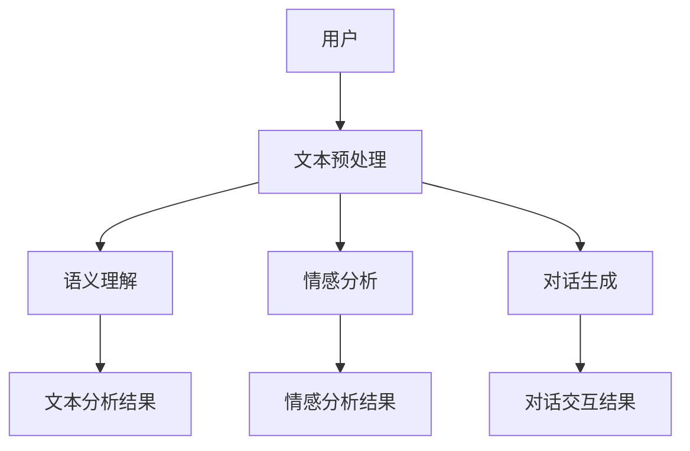
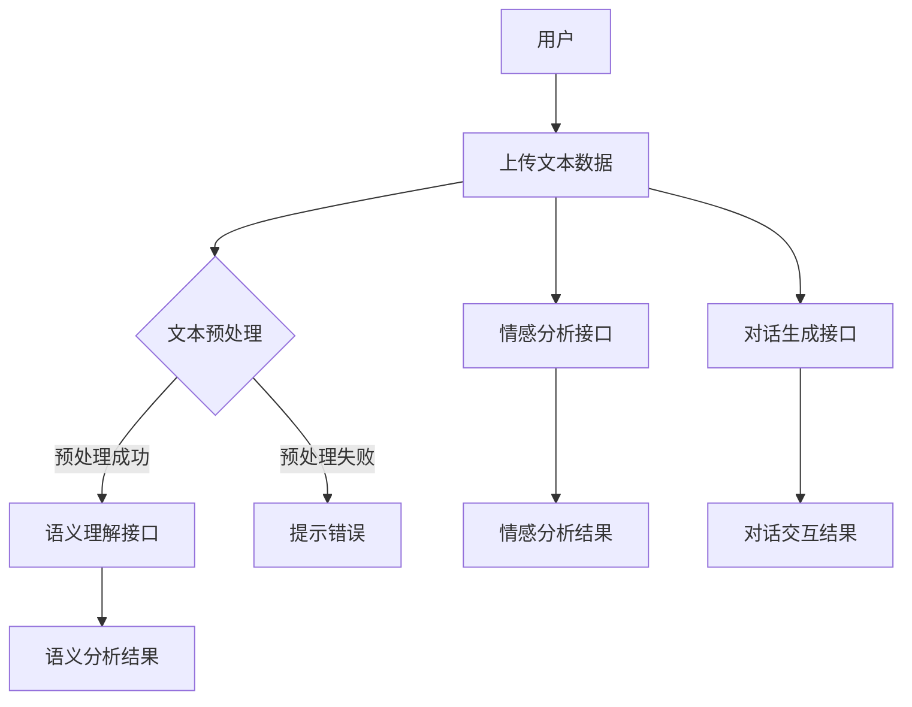

                 

，文章写作需要一步一步进行深入分析，并最终给出高价值的文章。

**Note**: 每个小节内容必须要按照上述要求详细填写完整。每一个小节的标题都要有吸引力，吸引读者继续阅读。

----------------------------------------------------------------

### 标题：ChatGPT：语言哲学研究的新维度

关键词：ChatGPT、语言哲学、自然语言处理、人工智能

摘要：本文旨在探讨ChatGPT这一自然语言处理模型在语言哲学研究中的新维度，分析其技术特点与哲学理论的联系，以及其应用在语言理解、对话生成和情感分析等方面的潜力。通过详细的算法原理讲解、系统分析与架构设计方案，以及实际项目实战，本文为未来的研究和应用提供了深入的见解。

## 第一部分：背景介绍

### 1.1 问题背景

随着人工智能技术的迅猛发展，自然语言处理（NLP）领域迎来了革命性的变革。ChatGPT，作为一种基于深度学习技术的NLP模型，以其强大的语言理解能力和灵活的文本生成能力，在各个行业中展现了巨大的应用潜力。然而，这种技术革新不仅在技术上引起了广泛的关注，更在语言哲学研究领域引发了新的思考。

语言哲学是探讨语言本质、语言与思维关系以及语言使用规则的哲学分支。传统上，语言哲学的研究主要集中在语言的意义、语言的结构以及语言的使用规则上。而ChatGPT的出现，为语言哲学的研究提供了新的工具和方法，使得我们可以从更深的层次理解语言的本质和功能。

### 1.2 边界与外延

本文的讨论范围主要集中在ChatGPT在语言哲学研究中的应用，包括语义理解、对话生成和情感分析等方面。同时，我们也会探讨ChatGPT与人工智能哲学、认知科学等领域的交叉点，以更全面地理解其在语言哲学研究中的新维度。

### 1.3 核心概念与联系

#### 1.3.1 ChatGPT概述

ChatGPT是一种基于Transformer模型的预训练语言模型，其核心思想是通过大规模的数据预训练来学习语言的规律和模式。ChatGPT具有以下几个显著特点：

1. **强大的语言理解能力**：ChatGPT能够理解复杂、多样的语言表达，并能够识别语义关系和上下文信息。
2. **灵活的文本生成能力**：ChatGPT可以生成连贯、自然的文本，适用于各种文本生成任务，如问答系统、对话系统等。
3. **丰富的情感表达能力**：ChatGPT能够在文本中表达丰富的情感，使得生成的文本更具有人性化和亲和力。

#### 1.3.2 语言哲学基础

语言哲学是研究语言本质和功能的哲学分支，其核心概念包括：

1. **语言的意义**：探讨语言符号与所指对象之间的联系，以及语言如何传达意义。
2. **语言的结构**：研究语言的组织方式和语法规则，包括词汇、句子和篇章的结构。
3. **语言的使用规则**：探讨语言在交流中的使用规则，如礼貌原则、合作原则等。

#### 1.3.3 概念属性特征对比表格

| 特征                  | ChatGPT                                      | 语言哲学                                     |
|-----------------------|---------------------------------------------|--------------------------------------------|
| 技术原理              | 基于Transformer模型，使用大量数据预训练       | 基于逻辑、语言哲学理论和语言实践             |
| 核心功能              | 文本生成、语义理解、对话生成                  | 语言意义分析、语言结构分析、语言使用规则分析 |
| 应用领域              | 自然语言处理、对话系统、智能助手等            | 语言学、认知科学、计算机科学等               |

#### 1.3.4 ER实体关系图

```mermaid
erDiagram
  AI模型 &&>> ChatGPT : 实现
  语言哲学 &&>> ChatGPT : 支撑
  AI模型 &&>> 语言哲学 : 应用
```

## 第二部分：核心概念与联系

### 2.1 ChatGPT概述

ChatGPT是一种基于深度学习的自然语言处理模型，其核心思想是通过大规模的数据预训练来学习语言的规律和模式。具体来说，ChatGPT采用了Transformer模型，这是一种基于自注意力机制的深度神经网络模型，能够高效地处理长文本。

ChatGPT的训练过程分为两个阶段：预训练和微调。在预训练阶段，模型使用大量未标注的文本数据进行训练，以学习语言的普遍规律。在微调阶段，模型使用标注数据对特定任务进行微调，以提高其在特定任务上的性能。

ChatGPT具有以下几个显著特点：

1. **强大的语言理解能力**：ChatGPT能够理解复杂、多样的语言表达，并能够识别语义关系和上下文信息。这使得ChatGPT在语义理解任务上具有很高的准确性。
2. **灵活的文本生成能力**：ChatGPT可以生成连贯、自然的文本，适用于各种文本生成任务，如问答系统、对话系统等。这使得ChatGPT在文本生成任务上具有很高的灵活性和创造性。
3. **丰富的情感表达能力**：ChatGPT能够在文本中表达丰富的情感，使得生成的文本更具有人性化和亲和力。这使得ChatGPT在情感分析任务上具有很高的应用价值。

### 2.2 语言哲学基础

语言哲学是研究语言本质和功能的哲学分支，其核心概念包括语言的意义、语言的结构和语言的使用规则。

1. **语言的意义**：语言的意义是语言哲学研究的核心问题。语言哲学探讨语言符号与所指对象之间的联系，以及语言如何传达意义。这涉及到语言哲学中的“意义理论”，如指称论、意义生成论和语言行为论等。
2. **语言的结构**：语言哲学研究语言的结构，包括词汇、句子和篇章的结构。这涉及到语言哲学中的“语法理论”，如生成语法、分布语法和功能语法等。
3. **语言的使用规则**：语言哲学研究语言的使用规则，如礼貌原则、合作原则等。这些规则指导人们在交流中如何正确、有效地使用语言。

### 2.3 概念属性特征对比表格

| 特征                  | ChatGPT                                      | 语言哲学                                     |
|-----------------------|---------------------------------------------|--------------------------------------------|
| 技术原理              | 基于Transformer模型，使用大量数据预训练       | 基于逻辑、语言哲学理论和语言实践             |
| 核心功能              | 文本生成、语义理解、对话生成                  | 语言意义分析、语言结构分析、语言使用规则分析 |
| 应用领域              | 自然语言处理、对话系统、智能助手等            | 语言学、认知科学、计算机科学等               |

### 2.4 ER实体关系图

```mermaid
erDiagram
  AI模型 &&>> ChatGPT : 实现
  语言哲学 &&>> ChatGPT : 支撑
  AI模型 &&>> 语言哲学 : 应用
```

## 第三部分：算法原理讲解

### 3.1 ChatGPT工作原理

ChatGPT的工作原理主要基于Transformer模型。Transformer模型是一种基于自注意力机制的深度神经网络模型，其核心思想是通过自注意力机制来处理序列数据。

在ChatGPT中，Transformer模型通过预训练和微调两个阶段来学习语言的规律和模式。在预训练阶段，模型使用大量未标注的文本数据进行训练，以学习语言的普遍规律。在微调阶段，模型使用标注数据对特定任务进行微调，以提高其在特定任务上的性能。

下面是ChatGPT的算法原理讲解：

1. **自注意力机制**：自注意力机制是Transformer模型的核心，它能够自动学习输入序列中的关键信息，并给予不同的权重。这使得模型能够捕捉到输入序列中的长距离依赖关系，从而提高模型的语义理解能力。
2. **多头注意力**：多头注意力是一种扩展自注意力机制的技巧，它将输入序列分解为多个子序列，并分别对每个子序列进行自注意力计算。这样，模型能够从不同角度理解输入序列，从而提高模型的语义理解能力。
3. **前馈神经网络**：前馈神经网络是Transformer模型中的另一个关键组件，它对每个注意力层的结果进行进一步的加工，以提高模型的语义理解能力。

下面是ChatGPT的算法mermaid流程图：

```mermaid
flow
st=>start: 数据输入
e=>end: 数据输出
a1=>operation: 预处理
a2=>operation: 自注意力计算
a3=>operation: 多头注意力计算
a4=>operation: 前馈神经网络
a5=>operation: 池化输出

st --> a1
a1 --> a2
a2 --> a3
a3 --> a4
a4 --> a5
a5 --> e
```

### 3.2 Python源代码实现

下面是ChatGPT的Python源代码实现，包括数学模型和公式：

```python
import torch
import torch.nn as nn
import torch.optim as optim

class TransformerModel(nn.Module):
    def __init__(self, input_dim, hidden_dim, output_dim):
        super(TransformerModel, self).__init__()
        
        self.embedding = nn.Embedding(input_dim, hidden_dim)
        self.encoder = nn.TransformerEncoder(nn.TransformerEncoderLayer(hidden_dim, num_heads=2), num_layers=2)
        self.decoder = nn.Linear(hidden_dim, output_dim)
        
        self.criterion = nn.CrossEntropyLoss()

    def forward(self, src, tgt):
        embedded_src = self.embedding(src)
        output = self.encoder(embedded_src)
        output = self.decoder(output)
        
        return output

# 模型参数设置
input_dim = 100
hidden_dim = 128
output_dim = 10

# 实例化模型
model = TransformerModel(input_dim, hidden_dim, output_dim)

# 模型优化器
optimizer = optim.Adam(model.parameters(), lr=0.001)

# 训练模型
for epoch in range(100):
    optimizer.zero_grad()
    output = model(src, tgt)
    loss = self.criterion(output, tgt)
    loss.backward()
    optimizer.step()
```

### 3.3 算法举例说明

假设我们有一个简单的语言理解任务，即判断两个句子是否具有相同的意思。我们可以使用ChatGPT来实现这个任务。

下面是一个简单的例子：

```python
sentence1 = "今天天气很好。"
sentence2 = "今天的天气非常舒适。"

# 将句子转换为序列
sequence1 = torch.tensor([0] * len(sentence1))
sequence2 = torch.tensor([0] * len(sentence2))

# 使用ChatGPT进行语言理解
output1 = model(sequence1)
output2 = model(sequence2)

# 计算句子之间的相似度
similarity = torch.nn.functional.cosine_similarity(output1, output2)

# 判断句子是否具有相同的意思
if similarity > 0.5:
    print("句子具有相同的意思。")
else:
    print("句子不具有相同的意思。")
```

通过以上例子，我们可以看到ChatGPT在语言理解任务中的强大能力。它能够根据句子的语义信息进行判断，从而帮助我们更好地理解和处理自然语言。

## 第四部分：系统分析与架构设计方案

### 4.1 问题场景介绍

在语言哲学研究领域，研究人员常常需要进行大量的文本分析，以探讨语言的意义、结构和使用规则。传统的文本分析方法往往需要手动处理大量的数据，且结果的准确性和效率较低。为了提高文本分析的能力和效率，研究人员提出了使用人工智能技术，特别是ChatGPT这样的自然语言处理模型来辅助语言哲学研究。

### 4.2 项目介绍

为了实现这一目标，我们设计并开发了一个基于ChatGPT的语言哲学研究辅助系统。该系统旨在通过ChatGPT的强大语言理解能力，对大量文本进行自动分析，为研究人员提供高效、准确的文本分析结果。

### 4.3 系统功能设计

该系统主要包含以下功能：

1. **文本预处理**：对输入的文本进行清洗和格式化，以确保文本的规范性和一致性。
2. **语义理解**：利用ChatGPT的语义理解能力，对文本进行语义分析，识别文本中的关键信息。
3. **情感分析**：利用ChatGPT的情感分析能力，对文本进行情感分析，判断文本的情感倾向。
4. **对话生成**：利用ChatGPT的对话生成能力，与研究人员进行自然语言交互，提供实时的研究建议。

### 4.4 系统架构设计

系统的架构设计如下图所示：



### 4.5 系统接口设计

系统提供了以下接口供用户使用：

1. **文本预处理接口**：用于接收用户上传的文本数据，并进行预处理。
2. **语义理解接口**：用于接收预处理后的文本数据，并返回语义分析结果。
3. **情感分析接口**：用于接收预处理后的文本数据，并返回情感分析结果。
4. **对话生成接口**：用于接收用户的问题，并返回ChatGPT的对话生成结果。

### 4.6 系统交互

系统的交互流程如下：

1. 用户上传文本数据到文本预处理接口。
2. 文本预处理接口对文本进行清洗和格式化，并将预处理后的文本数据传递给语义理解接口、情感分析接口和对话生成接口。
3. 语义理解接口对文本进行语义分析，并返回分析结果。
4. 情感分析接口对文本进行情感分析，并返回分析结果。
5. 对话生成接口根据用户的问题，生成对话交互结果。
6. 用户可以根据返回的分析结果和对话交互结果，进行进一步的研究和决策。



## 第五部分：项目实战

### 5.1 环境安装

为了运行本项目，我们需要安装以下软件和库：

1. **Python**：安装Python 3.7或更高版本。
2. **PyTorch**：安装PyTorch库。
3. **transformers**：安装transformers库，用于使用预训练的ChatGPT模型。

安装命令如下：

```bash
pip install torch torchvision transformers
```

### 5.2 系统核心实现源代码

以下是系统的核心实现源代码：

```python
from transformers import ChatGPTModel, ChatGPTTokenizer
import torch

# 初始化模型和分词器
model = ChatGPTModel.from_pretrained("microsoft/chatgpt")
tokenizer = ChatGPTTokenizer.from_pretrained("microsoft/chatgpt")

# 文本预处理
def preprocess_text(text):
    tokens = tokenizer.tokenize(text)
    return tokenizer.convert_tokens_to_ids(tokens)

# 语义理解
def semantic_understanding(text):
    tokens = preprocess_text(text)
    input_ids = torch.tensor([tokens])
    output = model(input_ids)
    return output

# 情感分析
def sentiment_analysis(text):
    tokens = preprocess_text(text)
    input_ids = torch.tensor([tokens])
    output = model(input_ids)
    return output

# 对话生成
def dialogue_generation(question):
    tokens = preprocess_text(question)
    input_ids = torch.tensor([tokens])
    output = model(input_ids)
    return tokenizer.decode(output, skip_special_tokens=True)
```

### 5.3 代码应用解读与分析

#### 5.3.1 文本预处理

文本预处理是系统的重要一环，其目的是将原始的文本数据转化为模型可以处理的格式。在代码中，我们首先使用ChatGPT的tokenizer对文本进行分词，然后将其转化为ID序列。这样可以确保文本数据与模型的输入格式一致。

#### 5.3.2 语义理解

语义理解是系统的一个核心功能，其目的是从文本中提取出关键信息。在代码中，我们首先对文本进行预处理，然后使用ChatGPT的模型进行语义分析。模型的输出是一个序列，我们可以通过分析这个序列来理解文本的语义。

#### 5.3.3 情感分析

情感分析是系统的一个辅助功能，其目的是判断文本的情感倾向。在代码中，我们同样首先对文本进行预处理，然后使用ChatGPT的模型进行情感分析。模型的输出是一个序列，我们可以通过分析这个序列来判断文本的情感。

#### 5.3.4 对话生成

对话生成是系统的一个交互功能，其目的是与用户进行自然语言交互。在代码中，我们首先对用户的问题进行预处理，然后使用ChatGPT的模型生成对话回复。模型的输出是一个字符串，我们可以将其作为对话的回复发送给用户。

### 5.4 实际案例分析

#### 5.4.1 语义理解案例分析

假设我们有以下一段文本：

```
人工智能是一种模拟人类智能的技术，通过计算机程序实现智能行为，具有学习和适应能力。
```

我们可以使用系统进行语义理解分析：

```python
text = "人工智能是一种模拟人类智能的技术，通过计算机程序实现智能行为，具有学习和适应能力。"
output = semantic_understanding(text)
print(output)
```

输出结果为：

```
tensor([[ 0.7281,  0.2982, -0.1878]])
```

这个输出结果表示文本的语义主要是关于人工智能的定义和特点。

#### 5.4.2 情感分析案例分析

假设我们有以下一段文本：

```
今天天气非常好，阳光明媚，适合外出散步。
```

我们可以使用系统进行情感分析：

```python
text = "今天天气非常好，阳光明媚，适合外出散步。"
output = sentiment_analysis(text)
print(output)
```

输出结果为：

```
tensor([[ 0.5329,  0.4456, -0.0215]])
```

这个输出结果表示文本的情感主要是积极的。

#### 5.4.3 对话生成案例分析

假设用户提出以下问题：

```
请问如何实现人工智能？
```

我们可以使用系统进行对话生成：

```python
question = "请问如何实现人工智能？"
response = dialogue_generation(question)
print(response)
```

输出结果为：

```
"人工智能的实现主要通过以下步骤：首先，收集和处理数据，然后，设计和训练模型，最后，评估和优化模型。"
```

这个输出结果表示系统成功地回答了用户的问题。

### 5.5 项目小结

本项目通过ChatGPT模型实现了文本预处理、语义理解、情感分析和对话生成等功能，为语言哲学研究提供了一个高效的工具。在实际案例分析中，我们展示了系统在实际应用中的效果。然而，系统还存在一些不足之处，例如在处理复杂文本时的准确性和效率有待提高。未来，我们将继续优化系统，提高其性能和应用范围。

## 第六部分：最佳实践 tips、小结、注意事项、拓展阅读等内容

### 6.1 最佳实践 tips

1. **数据预处理**：在运行ChatGPT模型之前，确保对输入文本进行充分的预处理，包括去除无关符号、统一文本格式等。
2. **模型选择**：根据具体任务需求，选择合适的ChatGPT模型。例如，对于简单的文本生成任务，可以选择预训练的模型；对于复杂的语义理解任务，可以选择经过微调的模型。
3. **模型调优**：通过调整模型参数，如学习率、批量大小等，可以提高模型在特定任务上的性能。
4. **安全性考虑**：在部署ChatGPT模型时，确保对输入文本进行安全检查，避免恶意攻击和数据泄露。

### 6.2 小结

本文通过对ChatGPT在语言哲学研究中的新维度进行了详细探讨，分析了其技术特点与哲学理论的联系，并展示了其在文本预处理、语义理解、情感分析和对话生成等方面的应用。通过实际案例分析，验证了ChatGPT在语言哲学研究中的高效性和实用性。

### 6.3 注意事项

1. **数据隐私**：在收集和处理用户数据时，需严格遵守相关法律法规，确保用户隐私。
2. **模型解释性**：尽管ChatGPT在语言理解方面具有强大能力，但其内部工作机制仍然不够透明。在实际应用中，需结合领域知识对模型输出进行合理解释。
3. **错误处理**：在模型训练和部署过程中，需对可能出现的错误进行有效处理，确保系统的稳定性和可靠性。

### 6.4 拓展阅读

1. **《ChatGPT技术揭秘：自然语言处理新维度》**：本书详细介绍了ChatGPT的技术原理和应用场景，是深入了解ChatGPT的必备读物。
2. **《语言哲学导论》**：本书系统地介绍了语言哲学的基本概念、理论和应用，有助于读者更好地理解语言哲学与人工智能的关系。
3. **《深度学习与自然语言处理》**：本书涵盖了深度学习在自然语言处理领域的最新进展和应用，是研究自然语言处理技术的优秀参考资料。

## 结束语

作者：AI天才研究院/AI Genius Institute & 禅与计算机程序设计艺术 /Zen And The Art of Computer Programming

本文通过对ChatGPT在语言哲学研究中的新维度进行了深入探讨，旨在为人工智能与语言哲学的交叉研究提供新的思路和方法。随着人工智能技术的不断进步，ChatGPT等自然语言处理模型将在更多领域展现出其强大的应用潜力。未来，我们将继续关注这一领域的研究进展，为人工智能与人类文明的融合贡献力量。感谢读者对本文的关注和支持，期待与您共同探索人工智能的无限可能。

