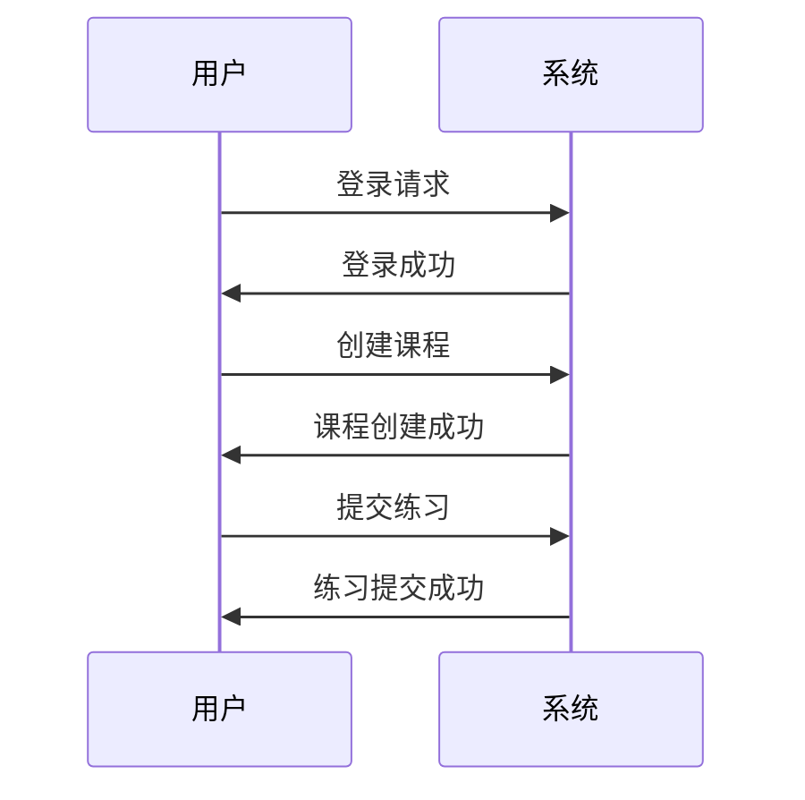

                 

## 《ChatGPT在语言学习中的应用：个性化语言教学提示词》

关键词：ChatGPT，语言学习，个性化教学，提示词设计，教育技术

摘要：随着人工智能技术的飞速发展，教育领域迎来了新的变革。ChatGPT作为一种强大的语言生成模型，在语言学习中展现出巨大的潜力。本文将从问题背景、问题描述、问题解决、边界与外延等方面，深入探讨ChatGPT在语言学习中的应用，尤其是如何设计个性化语言教学提示词，从而提升语言学习效果。

## 引言

### 1.1 问题背景

语言学习是一个复杂而长期的过程，涉及到词汇、语法、听力、口语和阅读等多个方面。传统的语言学习方法往往依赖于教师的经验和教材的固定内容，缺乏个性化和互动性。随着互联网和人工智能技术的发展，语言学习的方式正在发生革命性的变化。ChatGPT作为一种基于深度学习的自然语言处理模型，能够理解和生成人类语言，为个性化语言教学提供了新的可能性。

### 1.2 问题描述

如何利用ChatGPT提高语言学习效果，实现个性化教学是一个亟待解决的问题。个性化语言教学提示词作为连接学生与ChatGPT的关键，其设计和应用显得尤为重要。问题描述不仅需要明确如何利用ChatGPT，还需要探索如何设计出适应不同学习需求的提示词。

### 1.3 问题解决

ChatGPT在语言学习中的应用场景丰富，包括词汇学习、语法学习、听力练习、口语练习和阅读理解等。个性化语言教学提示词的设计原则包括适应性、互动性和创新性。通过合理的场景设置和提示词设计，可以最大化ChatGPT在语言学习中的作用。

### 1.4 边界与外延

ChatGPT在语言学习中的应用边界取决于其训练数据和模型的能力。个性化语言教学提示词的外延拓展包括对不同语言学习需求的适应、对新兴语言学习场景的探索等。这些边界与外延的探索，将不断推动语言学习技术的发展。

### 1.5 概念结构与核心要素组成

ChatGPT的核心特性是其强大的语言生成能力，这依赖于其深度学习模型和大规模的训练数据。个性化语言教学提示词的构成要素包括语言学习目标、学生特点和教学场景等。理解这些核心概念和要素，是深入研究和应用ChatGPT的基础。

## 第2章 ChatGPT核心概念与原理

### 2.1 ChatGPT的定义与特点

ChatGPT是由OpenAI开发的基于GPT（Generative Pre-trained Transformer）模型的一种对话系统。其特点包括：

- **预训练**：ChatGPT在大规模语料库上进行预训练，具备强大的语言理解能力。
- **生成能力**：能够根据输入生成连贯、有逻辑的语言。
- **适应性**：能够根据不同的问题和场景生成相应的回答。

### 2.2 ChatGPT的工作原理

ChatGPT的工作原理基于Transformer模型，这是一种在自然语言处理领域取得突破性进展的模型。Transformer模型的核心思想是将输入的序列转化为固定长度的向量表示，然后通过自注意力机制（Self-Attention）对这些向量进行处理，最终生成输出。

#### 语言模型基础知识

- **词汇表示**：ChatGPT使用词嵌入（Word Embedding）技术将词汇映射到高维空间，以便模型能够理解词汇之间的相似性和关系。
- **序列处理**：Transformer模型通过自注意力机制（Self-Attention）对输入序列进行处理，使得模型能够捕捉到输入序列中的长距离依赖关系。

#### ChatGPT的生成过程

1. **初始化**：给定一个输入序列，ChatGPT首先初始化一个输出序列。
2. **迭代生成**：在每次迭代中，模型根据当前生成的序列和输入序列，通过自注意力机制更新每个词的表示，并生成下一个词。
3. **终止条件**：当生成的序列达到预定的长度或满足特定的终止条件时，生成过程结束。

### 2.3 ChatGPT的应用领域

ChatGPT在多个领域展现了其强大的应用潜力：

- **语言学习**：通过生成个性化的教学内容和练习题，帮助学习者提高语言技能。
- **客服与咨询**：提供24/7的客服支持，回答用户的问题。
- **内容生成**：生成文章、报告、代码等，为创作者提供灵感。

## 第3章 个性化语言教学提示词设计

### 3.1 设计原则

个性化语言教学提示词的设计原则包括：

- **适应性原则**：提示词应能够根据学习者的语言水平和学习需求进行动态调整。
- **互动性原则**：提示词应鼓励学习者积极参与，提高学习互动性。
- **创新性原则**：提示词应具有创新性，激发学习者的学习兴趣。

### 3.2 设计流程

个性化语言教学提示词的设计流程包括：

1. **需求分析**：了解学习者的学习目标、背景和需求。
2. **提示词库构建**：根据需求分析，构建一个包含多种类型提示词的库。
3. **提示词优化**：通过测试和反馈，不断优化提示词库，提高其效果。

### 3.3 提示词类型

个性化语言教学提示词可以分为以下几种类型：

- **基础提示词**：用于帮助学习者掌握基础词汇和语法。
- **进阶提示词**：用于提高学习者的语言运用能力。
- **高级提示词**：用于培养学习者的高级语言技能，如批判性思维和创造性表达。

## 第4章 ChatGPT在语言学习中的应用

### 4.1 词汇学习

ChatGPT在词汇学习中的应用主要体现在：

- **词汇拓展**：通过生成与学习者已有词汇相关的句子和例句，帮助学习者扩大词汇量。
- **词汇用法分析**：通过生成不同语境下的句子，帮助学习者理解词汇的具体用法。

### 4.2 语法学习

ChatGPT在语法学习中的应用包括：

- **语法规则解析**：通过生成包含特定语法规则的句子，帮助学习者理解并掌握语法规则。
- **语法应用练习**：通过生成不同难度的语法练习题，帮助学习者巩固语法知识。

### 4.3 听力练习

ChatGPT在听力练习中的应用包括：

- **听力材料选择**：根据学习者的语言水平，生成适合的听力材料。
- **听力技巧指导**：通过生成听力技巧相关的提示词，帮助学习者提高听力技巧。

### 4.4 口语练习

ChatGPT在口语练习中的应用包括：

- **口语互动**：通过与学习者进行实时对话，帮助学习者提高口语交流能力。
- **口语表达技巧**：通过生成口语表达技巧相关的提示词，帮助学习者提高口语表达能力。

### 4.5 阅读理解

ChatGPT在阅读理解中的应用包括：

- **阅读材料选择**：根据学习者的语言水平和兴趣，生成适合的阅读材料。
- **阅读理解策略**：通过生成阅读理解策略相关的提示词，帮助学习者提高阅读理解能力。

## 第5章 实战案例：个性化语言教学提示词设计与应用

### 5.1 项目介绍

本案例旨在通过设计并应用个性化语言教学提示词，利用ChatGPT提升语言学习者的学习效果。项目目标是：

- 设计一套适应不同学习需求的个性化提示词。
- 应用ChatGPT生成个性化的教学内容和练习。
- 评估个性化提示词在提升学习效果方面的有效性。

### 5.2 系统功能设计

系统功能设计包括以下模块：

- **用户管理模块**：负责用户注册、登录和权限管理。
- **课程管理模块**：负责课程内容的管理，包括课程创建、修改和删除。
- **提示词生成模块**：根据用户的学习需求和语言水平，生成个性化的提示词。
- **练习生成模块**：根据提示词生成相应的练习题。
- **评估模块**：对学习者的学习效果进行评估。

#### 领域模型类图

```mermaid
classDiagram
Class01 <|-- Class02
Class03 --|Deprecated Class04
Class05 <<interface>>
Class06 <<interface>> Class07
Class01 {
color : red
# put fields here
}
Class02 {
# put fields here
}
Class03 {
# put fields here
}
Class04 {
# put fields here
}
Class05 {
# put fields here
}
Class06 {
# put fields here
}
Class07 {
# put fields here
}
```

### 5.3 系统架构设计

系统架构设计包括以下层次：

- **展示层**：负责用户界面设计和与用户的交互。
- **逻辑层**：负责业务逻辑的处理，包括用户管理、课程管理和提示词生成等。
- **数据层**：负责数据的存储和管理，包括用户数据、课程数据和练习数据等。

#### 系统架构图



### 5.4 系统核心实现

#### 环境安装与配置

1. 安装Python环境。
2. 安装ChatGPT库：`pip install openai`。
3. 配置API Key：在OpenAI官网注册账号，获取API Key。

#### 代码实现与分析

```python
import openai

# 设置API Key
openai.api_key = 'your-api-key'

# 生成个性化提示词
def generate_prompt(level, topic):
    prompt = f"请为一名语言水平为{level}的学习者，就{topic}生成一组个性化语言教学提示词。"
    response = openai.Completion.create(
        engine="text-davinci-002",
        prompt=prompt,
        max_tokens=100
    )
    return response.choices[0].text.strip()

# 测试提示词生成
prompt = generate_prompt("初级", "词汇学习")
print(prompt)
```

#### 实际案例分析和讲解

**案例背景**：

一名初级英语学习者，希望提高词汇学习效果。

**案例分析**：

通过ChatGPT生成的提示词，学习者可以进行以下活动：

- **词汇拓展**：根据新学的词汇生成相关句子。
- **用法分析**：通过生成不同语境下的句子，了解词汇的具体用法。

**案例讲解**：

```plaintext
请用“excited”这个词写一个句子。
I am excited to start my new job next week.

请用“excited”这个词写一个句子，描述一个有趣的活动。
We were all excited about going to the zoo for the first time.

请用“excited”这个词写一个句子，表达期待。
I am excited about the upcoming school year and all the new opportunities it will bring.

请用“excited”这个词写一个句子，表达失望。
I was excited for the concert, but it got canceled due to bad weather.
```

**项目小结**：

通过实际案例可以看到，ChatGPT能够生成适应不同学习需求的个性化提示词，有效提高了学习者的词汇学习效果。未来，可以进一步优化提示词生成算法，提高生成的质量和针对性。

## 第6章 个性化语言教学提示词的最佳实践

### 6.1 最佳实践 tips

1. **根据学习目标设置提示词**：确保提示词与学习者的具体目标紧密相关。
2. **多样性和灵活性**：设计不同类型的提示词，满足学习者的多样化需求。
3. **实时调整和反馈**：根据学习者的反馈，实时调整提示词，提高其效果。

### 6.2 注意事项

1. **避免过度依赖**：提示词仅作为辅助工具，不能替代教师的指导和学生的自主学习。
2. **数据安全和隐私保护**：确保学习者的数据安全和隐私。

### 6.3 拓展阅读

1. **《人工智能与教育技术》**：探讨了人工智能在教育中的应用。
2. **《自然语言处理实战》**：介绍了自然语言处理技术的应用和实践。

## 第7章 结论

### 7.1 研究总结

ChatGPT在语言学习中的应用展现了其强大的潜力，通过设计个性化的语言教学提示词，可以有效提升学习效果。未来，应进一步优化提示词生成算法，探索更多应用场景，以推动语言学习技术的发展。

### 7.2 未来展望

随着人工智能技术的不断进步，ChatGPT在语言学习领域的应用将更加广泛和深入。未来，个性化语言教学提示词的设计将更加智能化，更好地满足学习者的个性化需求。同时，ChatGPT在语言学习中的潜力也将得到更全面和深入的挖掘。

