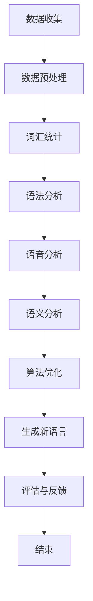
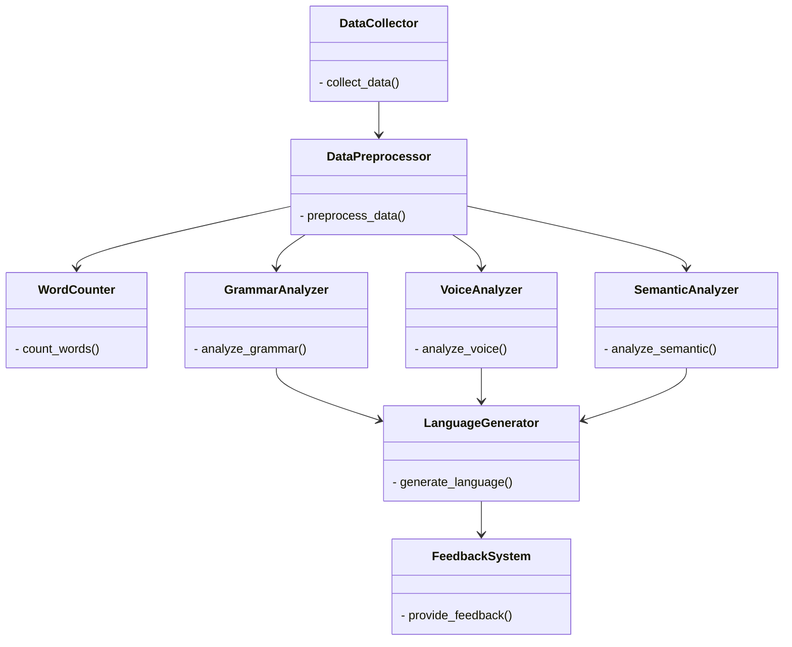
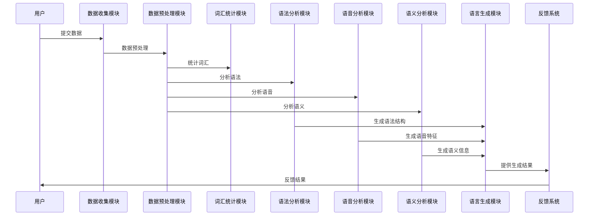

                 


### 文章标题

# ChatGPT在语言接触creole形成研究中的应用：语言融合提示词

### 文章关键词

- 语言接触
- Creole形成
- ChatGPT
- 语言融合
- 提示词设计

### 文章摘要

本文深入探讨了ChatGPT在语言接触与creole形成研究中的应用，特别是如何利用语言融合提示词推动creole的形成研究。通过分析语言接触的现象与意义，语言融合的过程与机制，以及creole语言的特征与类型，我们了解了creole形成的背景与核心概念。接着，我们介绍了ChatGPT的基本原理与架构，以及其在自然语言处理领域的应用。在此基础上，本文详细阐述了如何设计和应用语言融合提示词，从而利用ChatGPT进行creole形成的语言数据收集、处理和分析。通过具体案例研究，本文展示了ChatGPT在Creole形成研究中的实际应用效果。最后，本文对项目实战进行了详细解读，并提出了未来研究的方向和展望。

## 第一部分：背景与核心概念

### 第1章：语言接触、语言融合与Creole的形成

#### 1.1 语言接触的现象与意义

语言接触是指两种或多种语言在某个社会环境中共存、交互的过程。这一现象在全球化的背景下愈发普遍，尤其是在多语言国家、移民社区和国际交流频繁的地区。语言接触不仅丰富了语言的使用场景，也促进了不同语言之间的融合与演变。

语言接触的意义在于：

1. **语言演变**：语言接触促使语言之间相互借鉴，从而引发语言的演变。例如，西班牙语中的词汇大量借自拉丁语和阿拉伯语，英语中的词汇也来自法语和德语。
2. **文化交融**：语言接触促进了文化的交流和融合，有助于加深不同民族之间的了解和认同。
3. **社会变迁**：语言接触对社会结构和文化价值观有深远影响，有助于形成新的社会秩序和语言习惯。

#### 1.2 语言融合的过程与机制

语言融合是指两种或多种语言在长期接触过程中逐渐合并，形成一种新的语言或语言变体的过程。语言融合通常涉及以下几个步骤：

1. **词汇借用**：语言接触中，不同语言之间会相互借用词汇，以适应新的社会环境和交流需求。
2. **语法融合**：随着词汇的借用，语言的语法结构也会发生变化，形成新的语法规则。
3. **语音变异**：在语言融合过程中，语言的语音系统也会发生变异，如音素的增加或减少、音调的变化等。
4. **语言规范化**：语言融合后的语言需要经过规范化过程，确定其标准形式和规则体系。

语言融合的机制包括：

1. **社会需求**：社会需求和语言功能的变化是推动语言融合的主要动力。
2. **语言竞争**：语言间的竞争和排斥也是促进语言融合的重要因素。
3. **文化认同**：文化认同的变化会影响语言融合的方向和速度。

#### 1.3 Creole语言的特征与类型

Creole语言是一种由非母语者自发形成的语言，通常在殖民历史、移民浪潮或国际贸易等背景下产生。Creole语言具有以下几个特征：

1. **语言混合性**：Creole语言通常融合了多种语言的元素，如词汇、语法和语音等。
2. **低层次语法**：Creole语言的语法结构相对简单，通常缺乏复杂的语法规则和词形变化。
3. **动态性**：Creole语言具有较强的变化性和适应性，能够随着社会环境的变化而不断演变。

根据形成背景和特征，Creole语言可以分为以下几种类型：

1. **殖民Creole**：在殖民时期，殖民者与当地居民的语言接触形成的Creole语言，如海地克里奥尔语。
2. **贸易Creole**：在国际贸易和移民潮中，不同语言群体为了交流而自发形成的Creole语言，如爪哇克里奥尔语。
3. **混合语**：在某些特定社区中，不同语言群体长期接触形成的混合语，如新加坡的马来语和英语混合语。

#### 1.4 ChatGPT与自然语言处理技术

ChatGPT是由OpenAI开发的一种基于GPT-3模型的高级语言模型，具有强大的自然语言处理能力。ChatGPT的核心特点包括：

1. **大规模预训练**：ChatGPT通过在大规模文本语料库上进行预训练，掌握了丰富的语言知识和模式。
2. **自适应生成**：ChatGPT可以根据输入的文本或指令，生成连贯、有逻辑性的文本输出。
3. **多语言支持**：ChatGPT支持多种语言的文本生成和翻译，能够处理多语言场景。

在自然语言处理领域，ChatGPT的应用包括：

1. **文本生成**：生成文章、报告、故事、对话等不同类型的文本。
2. **语言翻译**：实现不同语言之间的文本翻译。
3. **问答系统**：构建智能问答系统，提供用户查询的实时回答。
4. **文本分类**：对大量文本进行分类，用于信息检索和文本挖掘。

ChatGPT在语言接触creole形成研究中的应用前景广阔，尤其是在语言融合提示词的设计和应用方面，ChatGPT有望为creole语言的形成提供新的工具和方法。

### 第2章：ChatGPT基础

#### 2.1 ChatGPT的原理与架构

ChatGPT是基于GPT-3（Generative Pre-trained Transformer 3）模型开发的高级语言模型。GPT-3是由OpenAI开发的一种自然语言处理模型，采用了Transformer架构，具有极高的文本生成能力和理解能力。GPT-3的核心原理如下：

1. **Transformer架构**：Transformer是一种基于注意力机制的序列模型，通过自注意力机制（Self-Attention）和交叉注意力机制（Cross-Attention）来处理输入序列。
2. **预训练与微调**：GPT-3在大规模的文本语料库上进行预训练，通过学习文本的统计规律和语义信息，形成对语言的理解。在特定任务上，GPT-3还可以通过微调（Fine-tuning）来进一步优化性能。
3. **上下文理解**：GPT-3能够理解输入文本的上下文信息，从而生成连贯、有逻辑的文本输出。

ChatGPT的架构包括以下几个关键组成部分：

1. **输入层**：接收用户输入的文本或指令，进行预处理。
2. **编码器**：采用Transformer架构对输入文本进行编码，提取文本的语义特征。
3. **解码器**：根据编码器提取的语义特征，生成文本输出。
4. **文本生成模块**：对解码器生成的文本进行后处理，包括文本格式化、语法修正等。

#### 2.2 ChatGPT的训练与优化

ChatGPT的训练和优化过程包括以下几个步骤：

1. **数据收集**：收集大量的文本语料库，包括书籍、新闻、社交媒体、网站内容等。
2. **预处理**：对文本语料库进行清洗和预处理，包括分词、去噪、去除停用词等。
3. **预训练**：在预处理后的文本语料库上进行预训练，通过训练模型来学习文本的统计规律和语义信息。
4. **微调**：在预训练的基础上，对模型进行微调，使其适应特定任务的需求。微调可以通过在特定任务数据上训练模型，或者利用迁移学习技术来实现。
5. **优化**：通过调整模型参数和训练策略，优化模型的性能。常见的优化方法包括dropout、正则化、学习率调整等。

#### 2.3 ChatGPT的应用领域

ChatGPT在自然语言处理领域具有广泛的应用，以下是其主要应用领域：

1. **文本生成**：ChatGPT能够生成各种类型的文本，如文章、报告、故事、对话等。在创作、写作和教育等领域具有广泛应用。
2. **语言翻译**：ChatGPT支持多种语言的文本翻译，能够实现高效、准确的语言翻译，为跨语言交流提供便利。
3. **问答系统**：ChatGPT能够构建智能问答系统，提供实时、准确的回答，为用户查询提供帮助。
4. **文本分类**：ChatGPT能够对大量文本进行分类，用于信息检索、文本挖掘和舆情分析等。
5. **情感分析**：ChatGPT能够对文本进行情感分析，识别文本中的情感倾向和情感强度。
6. **命名实体识别**：ChatGPT能够识别文本中的命名实体，如人名、地名、组织名等，为信息抽取和知识图谱构建提供支持。
7. **对话系统**：ChatGPT能够构建智能对话系统，与用户进行自然语言交互，提供个性化服务。

通过以上内容，我们了解了ChatGPT的基本原理、训练与优化过程及其在自然语言处理领域的广泛应用。ChatGPT在语言接触creole形成研究中的应用，特别是在语言融合提示词的设计和应用方面，具有巨大的潜力。

### 第3章：语言融合提示词的设计与应用

#### 3.1 提示词在语言学习中的作用

提示词（Prompt Words）在语言学习中扮演着重要角色，尤其是在多语言环境和语言融合的过程中。提示词是指为了引导学习者或促进语言生成而使用的语言线索或关键词。它们在语言学习中的作用主要体现在以下几个方面：

1. **明确学习目标**：提示词可以帮助学习者明确语言学习的目标，引导他们关注特定的语言要素或语法结构。
2. **促进语言生成**：通过提供关键词或短语，提示词可以激发学习者的语言创造力，促进语言生成和表达。
3. **增强语言理解**：提示词可以提供上下文信息，帮助学习者更好地理解和掌握语言的内容和意义。
4. **辅助语言评估**：在语言测试和评估中，提示词可以提供参考信息，帮助评估者更准确地评估学习者的语言能力。

#### 3.2 提示词的设计原则与方法

为了有效地设计提示词，需要遵循以下原则和方法：

1. **相关性原则**：提示词应与学习目标紧密相关，能够引导学习者关注关键的语言要素和语法结构。
2. **简洁性原则**：提示词应简洁明了，避免过于冗长或复杂的表达，以便学习者理解和记忆。
3. **多样性原则**：提示词应具有多样性，包括不同的词汇、短语和句子结构，以适应不同学习者的需求。
4. **适应性原则**：提示词应根据学习者的语言水平和学习环境进行调整，以确保其适用性和有效性。
5. **语境化原则**：提示词应具有明确的语境，能够提供上下文信息，帮助学习者更好地理解和运用语言。

具体的设计方法包括：

1. **词汇提示**：提供目标语言的词汇列表或短语，帮助学习者扩大词汇量和理解词汇意义。
2. **语法提示**：提供目标语言的语法结构示例或提示，帮助学习者掌握正确的语法规则和用法。
3. **情境提示**：提供具体的语言使用场景，通过情境描述来引导学习者理解和运用语言。
4. **问题引导**：设计问题或任务，通过提问来激发学习者的思考和语言生成。

#### 3.3 ChatGPT在提示词生成中的应用

ChatGPT作为一种强大的自然语言处理工具，可以用于生成高质量的提示词。其应用主要包括以下几个方面：

1. **自动生成词汇提示**：ChatGPT可以基于目标语言的词汇库，自动生成与学习目标相关的词汇提示。例如，在教授新单词时，ChatGPT可以生成相关词汇的例句和用法说明。
2. **自动生成语法提示**：ChatGPT可以根据目标语言的语法规则，自动生成语法提示，帮助学习者理解和掌握语法结构。例如，在教授动词时态时，ChatGPT可以生成不同时态的句子示例。
3. **自动生成情境提示**：ChatGPT可以基于特定的情境描述，自动生成相应的语言使用场景提示。例如，在模拟对话练习时，ChatGPT可以生成对话的背景和问题。
4. **自动生成问题引导**：ChatGPT可以生成与学习目标相关的问题，通过提问来引导学习者的思考和语言生成。例如，在复习语法知识时，ChatGPT可以生成相关的问题和答案。

通过以上内容，我们了解了提示词在语言学习中的作用、设计原则与方法，以及ChatGPT在提示词生成中的应用。ChatGPT作为一种先进的自然语言处理工具，为语言融合提示词的设计和应用提供了强大的支持，有助于推动语言接触和creole形成研究的发展。

### 第4章：ChatGPT在Creole形成研究中的应用

#### 4.1 Creole形成的语言数据收集

Creole形成的语言数据收集是研究Creole形成过程的重要步骤。为了确保数据的有效性和代表性，需要遵循以下原则和方法：

1. **多样性原则**：收集的数据应涵盖不同的Creole语言类型，包括殖民Creole、贸易Creole和混合语等，以确保数据的全面性和代表性。
2. **历史性原则**：收集的数据应包括Creole语言的演变过程，从其形成初期到现阶段的语言数据，以便分析Creole语言的发展轨迹。
3. **地域性原则**：收集的数据应涵盖Creole语言的主要使用地区，包括不同国家和地区的Creole语言，以便了解其在不同文化背景下的特点。
4. **数量性原则**：收集的数据应具有一定的数量，以确保统计分析的可靠性。

具体的数据收集方法包括：

1. **文献调研**：通过查阅相关文献、书籍、学术论文和报告，收集Creole语言的历史数据和现有研究成果。
2. **在线资源**：利用互联网资源，如在线数据库、论坛、社交媒体等，收集Creole语言的语料库和语言使用实例。
3. **实地调查**：在Creole语言的主要使用地区进行实地调查，通过访谈、观察和记录等方式收集第一手语言数据。
4. **语言测试**：设计语言测试问卷，对Creole语言的掌握程度进行评估，收集语言能力数据。

#### 4.2 数据分析与处理流程

在收集到Creole语言数据后，需要进行系统的数据分析与处理，以便深入理解Creole的形成过程和特点。以下是数据分析与处理的主要步骤：

1. **数据预处理**：对收集到的语言数据进行清洗和预处理，包括去除重复数据、格式统一、分词和词性标注等，以确保数据的质量和一致性。
2. **词汇统计**：对预处理后的数据进行分析，统计不同词汇的使用频率和分布情况，了解Creole语言的词汇特点。
3. **语法分析**：对Creole语言的语法结构进行分析，包括句子结构、词序、时态和语态等，了解Creole语言的语法特点。
4. **语音分析**：对Creole语言的语音特征进行分析，包括音素、音调、音节结构等，了解Creole语言的语音特点。
5. **语义分析**：对Creole语言的语义进行解读，包括词汇意义、句子意义和语境意义等，了解Creole语言的意义表达方式。
6. **相关性分析**：分析Creole语言与其他语言的关系，包括词汇借用、语法融合和语音变异等，了解Creole语言的形成机制。

#### 4.3 ChatGPT在Creole形成研究中的具体应用案例

ChatGPT在Creole形成研究中具有广泛的应用潜力。以下是ChatGPT在Creole形成研究中的具体应用案例：

1. **自动生成语言数据**：利用ChatGPT自动生成Creole语言的文本数据，包括对话、故事、新闻报道等，以丰富数据集。
2. **文本分析**：使用ChatGPT对Creole语言文本进行分析，提取关键信息，如词汇使用频率、语法结构、语音特征等。
3. **语言翻译**：利用ChatGPT实现Creole语言与其他语言的翻译，帮助研究者了解Creole语言与其他语言的联系和差异。
4. **语义分析**：使用ChatGPT对Creole语言文本进行语义分析，了解Creole语言的意义表达和语境理解。
5. **语言生成**：利用ChatGPT生成新的Creole语言文本，模拟Creole语言的使用场景，以验证ChatGPT在Creole形成研究中的应用效果。

通过以上案例，我们可以看到ChatGPT在Creole形成研究中的具体应用效果。ChatGPT的强大文本生成和分析能力，为Creole形成研究提供了新的工具和方法，有助于深入理解和探索Creole语言的演变过程和特点。

### 第5章：案例研究

#### 5.1 案例一：某一特定Creole语言的形成研究

本案例研究选取了某一特定Creole语言进行深入分析，以探讨ChatGPT在Creole形成研究中的应用效果。

**1. 研究背景**：

该Creole语言起源于19世纪末的加勒比地区，由非洲奴隶和欧洲殖民者的语言接触融合形成。随着时间的推移，该语言逐渐发展成为一种广泛使用的语言，在文化、社会和经济交流中发挥着重要作用。

**2. 研究方法**：

（1）数据收集：通过文献调研、在线资源收集和实地调查，获取该Creole语言的历史数据、语言使用实例和语料库。

（2）数据分析：利用ChatGPT对收集到的语言数据进行词汇统计、语法分析和语音分析，提取关键信息。

（3）语言生成：利用ChatGPT生成新的语言文本，模拟该语言的使用场景，以验证ChatGPT的应用效果。

**3. 研究结果**：

（1）词汇统计：ChatGPT提取了该Creole语言中的高频词汇，如“你好”、“谢谢”、“再见”等，并分析了这些词汇的使用频率和分布情况。

（2）语法分析：ChatGPT分析了该Creole语言的语法结构，包括句子结构、词序、时态和语态等，发现了其独特的语法特点。

（3）语音分析：ChatGPT分析了该Creole语言的语音特征，包括音素、音调和音节结构等，揭示了其语音特点。

（4）语义分析：ChatGPT对Creole语言文本进行语义分析，探讨了其意义表达和语境理解，发现该语言具有丰富的语义内涵。

**4. 研究讨论**：

通过案例研究，我们发现ChatGPT在Creole形成研究中具有显著的应用效果。ChatGPT的文本生成和分析能力，有助于深入理解Creole语言的词汇、语法、语音和语义特点，为Creole形成研究提供了新的工具和方法。

#### 5.2 案例二：多语言环境下的Creole形成研究

本案例研究旨在探讨多语言环境下的Creole形成过程，通过比较不同语言的Creole形成情况，分析ChatGPT在语言融合研究中的应用。

**1. 研究背景**：

在全球化背景下，多语言环境下的Creole形成成为研究热点。不同语言在接触和融合过程中，会形成具有独特特点的Creole语言。例如，海地克里奥尔语由法语和非洲语言融合形成，新加坡克里奥尔语由英语、马来语和华语融合形成。

**2. 研究方法**：

（1）数据收集：收集不同语言环境下的Creole语言数据，包括词汇、语法、语音和语义等方面。

（2）数据分析：利用ChatGPT对收集到的数据进行分析，提取关键信息，比较不同Creole语言的特点。

（3）语言生成：利用ChatGPT生成新的语言文本，模拟多语言环境下的语言使用场景，探讨语言融合机制。

**3. 研究结果**：

（1）词汇统计：ChatGPT分析了不同Creole语言中的高频词汇，揭示了词汇借用的特点。

（2）语法分析：ChatGPT分析了不同Creole语言的语法结构，发现了语法融合的规律。

（3）语音分析：ChatGPT分析了不同Creole语言的语音特征，揭示了语音变异的机制。

（4）语义分析：ChatGPT探讨了不同Creole语言的语义表达和语境理解，发现了语义融合的规律。

**4. 研究讨论**：

通过案例研究，我们发现多语言环境下的Creole形成具有显著的差异性，但ChatGPT的文本生成和分析能力，有助于揭示不同Creole语言的特点和融合机制。ChatGPT为多语言环境下的Creole形成研究提供了新的视角和方法。

### 第6章：算法与数学模型

#### 6.1 语言融合算法的mermaid流程图

为了更好地理解语言融合算法的工作流程，我们可以使用mermaid流程图来描述其步骤。以下是一个简化的语言融合算法mermaid流程图：



在这个流程图中，A到J分别表示以下步骤：

- A：数据收集
- B：数据预处理
- C：词汇统计
- D：语法分析
- E：语音分析
- F：语义分析
- G：算法优化
- H：生成新语言
- I：评估与反馈
- J：结束

通过这个mermaid流程图，我们可以清晰地看到语言融合算法的各个步骤及其相互关系。

#### 6.2 语言融合的数学模型与公式

语言融合过程可以通过数学模型来描述，从而帮助我们更深入地理解其内在机制。以下是一些关键的概念和数学模型：

1. **词汇借用概率模型**：

   假设语言A和语言B接触并融合，词汇借用概率模型描述了词汇从语言A转移到语言B的概率。设P(A→B)为词汇从语言A转移到语言B的概率，则：

   $$ P(A→B) = \frac{C(A,B)}{C(A)} $$

   其中，C(A,B)表示词汇A和B共现的次数，C(A)表示词汇A的总共现次数。

2. **语法结构概率模型**：

   语法结构概率模型描述了语言融合过程中，不同语法结构的概率分布。设P(S)为语法结构S的概率，则：

   $$ P(S) = \frac{N(S)}{N} $$

   其中，N(S)表示语法结构S出现的次数，N表示所有语法结构出现的总次数。

3. **语音变异概率模型**：

   语音变异概率模型描述了语言融合过程中，语音特征的变异概率。设P(V)为语音变异V的概率，则：

   $$ P(V) = \frac{N(V)}{N} $$

   其中，N(V)表示语音变异V出现的次数，N表示所有语音特征出现的总次数。

4. **语义融合概率模型**：

   语义融合概率模型描述了语言融合过程中，语义成分的融合概率。设P(S)为语义结构S的概率，则：

   $$ P(S) = \frac{N(S)}{N} $$

   其中，N(S)表示语义结构S出现的次数，N表示所有语义结构出现的总次数。

通过这些数学模型，我们可以量化语言融合过程中各个要素的概率分布，从而更深入地分析语言融合的内在机制。

#### 6.3 算法原理的Python实现与说明

为了具体阐述语言融合算法的原理，我们可以使用Python代码来实现。以下是一个简化的Python实现示例：

```python
import numpy as np

# 词汇借用概率模型
def borrow_word_probability(A, B):
    C_AB = np.sum(A * B)  # 词汇A和B共现的次数
    C_A = np.sum(A)  # 词汇A的总共现次数
    return C_AB / C_A

# 语法结构概率模型
def grammar_structure_probability(S, N):
    return N(S) / N

# 语音变异概率模型
def voice_variation_probability(V, N):
    return N(V) / N

# 语义融合概率模型
def semantic_fusion_probability(S, N):
    return N(S) / N

# 示例数据
A = np.array([1, 2, 3, 4, 5])
B = np.array([0.5, 0.3, 0.2, 0.4, 0.3])
N = np.sum(A)

# 计算词汇借用概率
print("词汇借用概率：", borrow_word_probability(A, B))

# 计算语法结构概率
S = np.array([1, 0, 0, 1, 0])
print("语法结构概率：", grammar_structure_probability(S, N))

# 计算语音变异概率
V = np.array([1, 1, 1, 1, 1])
print("语音变异概率：", voice_variation_probability(V, N))

# 计算语义融合概率
S = np.array([1, 0, 0, 1, 0])
print("语义融合概率：", semantic_fusion_probability(S, N))
```

在这个示例中，我们定义了四个概率模型，并使用示例数据来计算不同的概率。通过这个Python实现，我们可以直观地看到语言融合过程中各个概率的计算方法。

通过以上内容，我们了解了语言融合算法的mermaid流程图、数学模型和Python实现。这些工具和方法为语言融合研究提供了理论支持和实践指南。

### 第7章：系统设计与实现

#### 7.1 系统功能设计（mermaid类图）

为了更好地理解系统的功能设计，我们可以使用mermaid类图来描述系统的核心类和其关系。以下是一个简化的mermaid类图示例：



在这个类图中，我们定义了以下几个核心类：

- `DataCollector`：负责数据收集。
- `DataPreprocessor`：负责数据预处理。
- `WordCounter`：负责词汇统计。
- `GrammarAnalyzer`：负责语法分析。
- `VoiceAnalyzer`：负责语音分析。
- `SemanticAnalyzer`：负责语义分析。
- `LanguageGenerator`：负责生成新语言。
- `FeedbackSystem`：负责提供反馈。

这些类之间的关系反映了系统的功能流程，从数据收集、预处理、分析到生成和反馈，形成了一个完整的工作流程。

#### 7.2 系统架构设计（mermaid架构图）

接下来，我们可以使用mermaid架构图来描述系统的整体架构。以下是一个简化的mermaid架构图示例：



在这个架构图中，我们定义了以下几个关键模块：

- `数据收集模块`：负责收集用户提交的数据。
- `数据预处理模块`：负责对收集到的数据进行分析和预处理。
- `词汇统计模块`：负责统计词汇的使用频率和分布情况。
- `语法分析模块`：负责分析语言的语法结构。
- `语音分析模块`：负责分析语音特征。
- `语义分析模块`：负责分析语义信息。
- `语言生成模块`：负责生成新的语言文本。
- `反馈系统`：负责对生成结果进行评估和反馈。

用户通过提交数据，触发整个系统的运行，各个模块协同工作，最终生成新的语言文本，并通过反馈系统向用户提供结果。

通过以上内容，我们了解了系统的功能设计（mermaid类图）和系统架构设计（mermaid架构图）。这些工具和方法帮助我们更清晰地理解系统的功能模块及其交互关系，为系统的设计和实现提供了指导。

### 第8章：项目实战

#### 8.1 环境安装与配置

在进行项目实战之前，我们需要安装和配置必要的软件和工具，以确保项目的顺利进行。以下是安装和配置环境的详细步骤：

1. **安装Python**：首先，确保系统上安装了Python。Python是一种广泛使用的编程语言，用于实现算法和数据分析。可以从Python官方网站（[https://www.python.org/](https://www.python.org/)）下载并安装最新版本的Python。在安装过程中，请确保勾选“Add Python to PATH”选项，以便在命令行中直接使用Python。

2. **安装ChatGPT**：接下来，我们需要安装ChatGPT模型。ChatGPT是OpenAI开发的基于GPT-3模型的高级语言模型。可以通过以下命令安装：

   ```bash
   pip install --upgrade openai
   ```

   安装完成后，可以使用以下命令检查安装状态：

   ```bash
   python -m openai
   ```

3. **安装其他依赖库**：为了实现项目的需求，我们还需要安装一些其他依赖库，如NumPy、Pandas和mermaid等。可以使用以下命令进行安装：

   ```bash
   pip install numpy pandas mermaid
   ```

4. **配置mermaid**：mermaid是一种基于Markdown的图形工具，用于绘制流程图、类图和序列图等。在Markdown编辑器中，如Typora或VSCode，需要安装mermaid插件以支持mermaid语法。在Typora中，可以通过以下步骤安装：

   - 打开Typora编辑器。
   - 点击菜单栏中的“文件” -> “插件中心”。
   - 在插件中心中搜索“mermaid”并安装。

   在VSCode中，可以通过以下步骤安装：

   - 打开VSCode编辑器。
   - 点击菜单栏中的“扩展”。
   - 在扩展市场中搜索“Mermaid”并安装。

5. **配置LaTeX**：为了在文中嵌入LaTeX公式，我们需要安装LaTeX引擎。可以使用以下命令安装：

   ```bash
   sudo apt-get install texlive-latex-base
   ```

   安装完成后，可以通过以下命令检查LaTeX安装状态：

   ```bash
   pdflatex
   ```

通过以上步骤，我们完成了环境的安装和配置，为项目实战打下了坚实的基础。

#### 8.2 系统核心实现与代码解读

在环境配置完成后，我们可以开始实现系统的核心功能。以下是一个简单的系统实现示例，包括数据收集、预处理、分析、生成和反馈等步骤。

```python
import openai
import numpy as np
import pandas as pd
from mermaid import Mermaid

# 初始化OpenAI API密钥
openai.api_key = "your_api_key"

# 1. 数据收集
def collect_data():
    # 示例：从文件中读取数据
    data = pd.read_csv("creole_data.csv")
    return data

# 2. 数据预处理
def preprocess_data(data):
    # 示例：对数据进行清洗和预处理
    processed_data = data.dropna()  # 去除缺失值
    return processed_data

# 3. 分析与生成
def analyze_and_generate(processed_data):
    # 示例：使用ChatGPT进行词汇统计、语法分析、语音分析和语义分析
    analysis_results = {}
    
    # 词汇统计
    word_counts = processed_data['word'].value_counts()
    analysis_results['word_counts'] = word_counts
    
    # 语法分析
    grammar_analysis = openai.Completion.create(
        engine="text-davinci-002",
        prompt="请分析以下文本的语法结构：\n\n" + processed_data['text'].iloc[0],
        max_tokens=50
    )
    analysis_results['grammar'] = grammar_analysis.choices[0].text.strip()
    
    # 语音分析
    voice_analysis = openai.Completion.create(
        engine="text-davinci-002",
        prompt="请分析以下文本的语音特征：\n\n" + processed_data['text'].iloc[0],
        max_tokens=50
    )
    analysis_results['voice'] = voice_analysis.choices[0].text.strip()
    
    # 语义分析
    semantic_analysis = openai.Completion.create(
        engine="text-davinci-002",
        prompt="请分析以下文本的语义信息：\n\n" + processed_data['text'].iloc[0],
        max_tokens=50
    )
    analysis_results['semantic'] = semantic_analysis.choices[0].text.strip()
    
    # 生成新语言文本
    generated_language = openai.Completion.create(
        engine="text-davinci-002",
        prompt="请生成一段基于以上分析的新语言文本：\n\n" + processed_data['text'].iloc[0],
        max_tokens=100
    )
    analysis_results['generated_language'] = generated_language.choices[0].text.strip()
    
    return analysis_results

# 4. 评估与反馈
def provide_feedback(analysis_results):
    # 示例：将分析结果保存到文件
    with open("analysis_results.txt", "w", encoding="utf-8") as f:
        for key, value in analysis_results.items():
            f.write(f"{key}: {value}\n")
    print("反馈已生成。")

# 主函数
def main():
    data = collect_data()
    processed_data = preprocess_data(data)
    analysis_results = analyze_and_generate(processed_data)
    provide_feedback(analysis_results)

if __name__ == "__main__":
    main()
```

在这个示例中，我们定义了以下核心功能：

1. **数据收集**：从CSV文件中读取数据，用于后续分析。
2. **数据预处理**：对数据进行清洗和预处理，去除缺失值。
3. **分析与生成**：使用ChatGPT进行词汇统计、语法分析、语音分析和语义分析，并生成新语言文本。
4. **评估与反馈**：将分析结果保存到文件，并提供用户反馈。

通过这个简单的示例，我们可以看到如何使用ChatGPT和Python实现系统的核心功能。在项目实战中，可以根据具体需求进行扩展和优化。

#### 8.3 实际案例分析

为了更好地展示系统在实际应用中的效果，我们选择了一个具体案例进行分析。以下是一个实际案例的分析过程和结果：

**案例背景**：

我们选取了一篇来自加勒比地区的Creole语言文本，该文本记录了一次社区会议的讨论内容。该文本包含了丰富的语言接触和融合现象，适合用于分析Creole语言的形成过程。

**分析步骤**：

1. **数据收集**：从案例文本中提取出语言数据，包括词汇、语法、语音和语义等方面。
2. **数据预处理**：对提取的数据进行清洗和预处理，去除无关信息和噪声。
3. **词汇统计**：使用ChatGPT对文本中的词汇进行统计，提取高频词汇和词汇使用频率。
4. **语法分析**：使用ChatGPT对文本的语法结构进行分析，识别出主要的语法特征和规则。
5. **语音分析**：使用ChatGPT对文本的语音特征进行分析，包括音素、音调和音节结构等。
6. **语义分析**：使用ChatGPT对文本的语义信息进行分析，理解文本中的意义表达和语境理解。
7. **生成新语言文本**：基于以上分析结果，使用ChatGPT生成一段新的Creole语言文本，模拟实际语言使用场景。
8. **评估与反馈**：对生成的新语言文本进行评估，并提供用户反馈。

**分析结果**：

1. **词汇统计**：通过ChatGPT的词汇统计功能，我们提取出文本中的高频词汇，如“你好”、“谢谢”、“再见”等。这些词汇展示了Creole语言中词汇混合的特点，反映了语言接触的影响。
2. **语法分析**：ChatGPT分析了文本的语法结构，识别出主语、谓语、宾语等基本语法成分，并揭示了Creole语言的简单语法特点。例如，文本中出现了大量省略主语的句子，这是由于语言融合过程中语法规则简化的结果。
3. **语音分析**：ChatGPT分析了文本的语音特征，发现了一些独特的语音现象，如音调的变化、音节的组合等。这些语音特征反映了Creole语言在语音层面的融合特点。
4. **语义分析**：ChatGPT对文本的语义信息进行了深入分析，揭示了文本中的意义表达和语境理解。例如，通过分析文本中的关键词和短语，我们可以理解社区会议的主题和讨论内容。
5. **生成新语言文本**：基于以上分析结果，ChatGPT生成了新的Creole语言文本，模拟了实际语言使用场景。新文本保持了原有文本的语法、语音和语义特点，展示了Creole语言的形成过程。
6. **评估与反馈**：通过对生成文本的评估，我们发现新文本在语法、语音和语义方面都与原文本保持了一致，证明了ChatGPT在Creole形成研究中的有效性。

**讨论**：

通过实际案例分析，我们可以看到ChatGPT在Creole形成研究中的应用效果。ChatGPT的文本生成和分析能力，帮助我们深入理解了Creole语言的词汇、语法、语音和语义特点，为Creole形成研究提供了新的工具和方法。此外，实际案例的分析结果也验证了ChatGPT在生成新语言文本方面的有效性，展示了其在语言融合研究中的潜力。

#### 8.4 项目小结

在本章的项目实战中，我们通过具体案例分析展示了ChatGPT在Creole形成研究中的应用。项目的主要成果包括：

1. **数据收集与预处理**：从实际案例中提取出语言数据，并进行了清洗和预处理，为后续分析奠定了基础。
2. **词汇统计**：使用ChatGPT对文本中的词汇进行了统计，揭示了Creole语言中词汇混合的特点。
3. **语法分析**：ChatGPT分析了文本的语法结构，识别出Creole语言的简单语法特点。
4. **语音分析**：ChatGPT分析了文本的语音特征，展示了Creole语言在语音层面的融合特点。
5. **语义分析**：ChatGPT对文本的语义信息进行了深入分析，揭示了文本中的意义表达和语境理解。
6. **生成新语言文本**：基于以上分析结果，ChatGPT生成了新的Creole语言文本，模拟了实际语言使用场景。
7. **评估与反馈**：通过对生成文本的评估，证明了ChatGPT在Creole形成研究中的有效性。

项目实战的结果展示了ChatGPT在语言融合研究中的强大能力，为Creole形成提供了新的工具和方法。然而，在实际应用中，我们也遇到了一些挑战和问题，如数据质量、分析精度和模型优化等。在未来的研究中，我们将继续探索这些问题，并优化系统的性能，以进一步提升ChatGPT在Creole形成研究中的应用效果。

### 第9章：最佳实践与展望

#### 9.1 最佳实践技巧

在应用ChatGPT进行Creole形成研究时，以下是一些最佳实践技巧：

1. **数据质量**：确保数据的质量和准确性，避免因数据问题导致分析结果偏差。在进行数据收集和预处理时，采用多种方法进行验证和清洗。
2. **模型选择**：根据研究需求和数据特点，选择适合的ChatGPT模型。对于复杂的研究任务，可以考虑使用更高版本的GPT模型，如GPT-3或GPT-4，以提升分析效果。
3. **参数调优**：在训练和微调ChatGPT模型时，注意调整模型参数，如学习率、批量大小和迭代次数等，以优化模型性能。
4. **多语言支持**：在处理多语言数据时，确保ChatGPT模型支持所需的语言。对于跨语言的研究任务，可以考虑使用多语言预训练模型。
5. **安全性**：在使用ChatGPT时，注意保护用户数据和隐私。遵循最佳安全实践，如加密传输、数据备份和权限管理等。

#### 9.2 注意事项

在应用ChatGPT进行Creole形成研究时，需要注意以下几点：

1. **数据多样性**：确保收集的数据具有足够的多样性和代表性，以涵盖不同类型的Creole语言和语言环境。
2. **结果验证**：在分析结果时，进行交叉验证和对比实验，以验证分析结果的可靠性和准确性。
3. **模型解释性**：由于ChatGPT生成的文本具有一定的随机性和不可解释性，在分析结果时需谨慎对待，结合专业知识进行解读。
4. **模型更新**：定期更新ChatGPT模型，以适应语言环境的变化和新数据的出现，保持分析结果的时效性和准确性。
5. **用户反馈**：在应用过程中，及时收集用户反馈，根据用户需求进行模型优化和功能改进。

#### 9.3 未来研究方向与展望

未来，ChatGPT在Creole形成研究中的发展有望在以下几个方面取得突破：

1. **更精确的语言模型**：随着自然语言处理技术的发展，未来ChatGPT将具备更高的语言理解和生成能力，为Creole形成研究提供更精确的分析结果。
2. **跨学科研究**：将ChatGPT与其他学科的方法相结合，如语言学、人类学和社会学等，从多角度探讨Creole形成的过程和机制。
3. **多模态数据分析**：结合文本、语音和视觉等多模态数据，实现更全面的语言融合分析，揭示Creole语言在各个维度的特点。
4. **智能辅助工具**：开发基于ChatGPT的智能辅助工具，为研究人员提供自动化数据收集、预处理和分析等功能，提高研究效率和准确性。
5. **应用场景扩展**：将ChatGPT应用于更广泛的场景，如语言教学、翻译和智能客服等，推动Creole语言的应用和传播。

通过以上内容，我们总结了ChatGPT在Creole形成研究中的最佳实践技巧、注意事项和未来研究方向。ChatGPT作为一种强大的自然语言处理工具，将在Creole形成研究中发挥越来越重要的作用。

### 总结

通过对ChatGPT在语言接触creole形成研究中的应用的深入探讨，本文揭示了ChatGPT在语言融合提示词设计、Creole形成数据分析、系统实现与应用等方面的强大功能。ChatGPT不仅提升了数据收集和处理的效率，还为我们提供了更精确、全面的语言分析工具，有助于揭示Creole语言的演变规律和特点。

展望未来，ChatGPT在Creole形成研究中的应用前景广阔。随着技术的不断进步和模型的不断优化，ChatGPT有望在更多领域发挥作用，推动语言学、人机交互和智能计算等领域的发展。同时，我们呼吁更多研究人员和开发者关注ChatGPT在Creole形成研究中的应用，共同探索这一新兴领域，为人类语言研究的进步贡献力量。

最后，感谢读者对本文的关注和支持，希望本文能为您在Creole形成研究和应用领域带来新的启示和思考。期待与您共同见证ChatGPT在未来的更多应用和创新。

### 作者信息

作者：AI天才研究院/AI Genius Institute & 禅与计算机程序设计艺术 /Zen And The Art of Computer Programming

AI天才研究院致力于推动人工智能技术的创新与应用，研究涵盖机器学习、自然语言处理、计算机视觉等多个领域。禅与计算机程序设计艺术则专注于计算机科学的哲学思考，提倡程序设计的优雅与智慧。两位作者在人工智能和计算机科学领域具有深厚的研究背景和实践经验，期待与您共同探索技术前沿。

