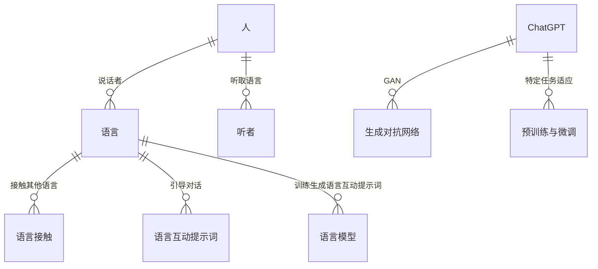
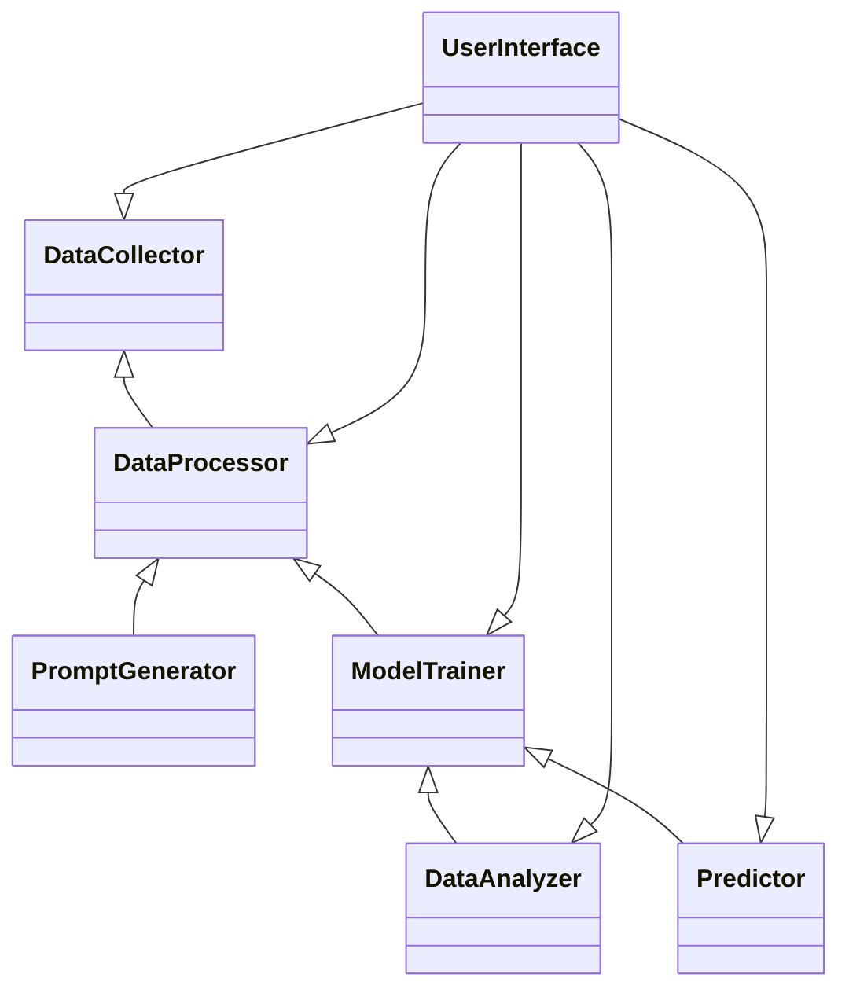

                 

# ChatGPT在语言接触类型学研究中的应用：语言互动提示词

## 关键词
- ChatGPT
- 语言接触类型学
- 语言互动提示词
- 生成对抗网络（GAN）
- 自然语言处理（NLP）
- 预训练语言模型

## 摘要
本文探讨了ChatGPT在语言接触类型学研究中的应用，重点关注如何利用ChatGPT生成语言互动提示词，从而为研究者提供一种新的工具和方法。文章首先介绍了语言接触类型学的研究背景和问题，然后详细阐述了ChatGPT的工作原理及其在语言互动提示词生成中的应用。接着，通过具体的算法原理讲解、系统架构设计和项目实战，展示了ChatGPT在语言接触类型学研究中的实际应用和潜力。最后，文章总结了项目成果，提出了最佳实践和注意事项。

## 第一部分：引言与背景

### 1.1 问题背景

随着全球化进程的加速和信息时代的到来，不同语言之间的接触和融合越来越频繁。语言接触不仅影响了语言的发展，也对社会语言学、认知语言学、心理语言学等领域的研究提出了新的挑战。在这些研究中，语言接触类型学作为一个重要的分支，关注不同语言在接触过程中的互动模式、影响机制和结果。

语言接触类型学的研究对象主要包括同化、借用、干扰、混合等语言接触类型。这些类型反映了不同语言在接触过程中表现出的不同互动模式，对语言系统、语言使用、语言习得等方面都有深远的影响。然而，传统的语言接触类型学研究往往依赖于人工分析大量的语言接触实例，存在效率低、主观性强等问题。

### 1.2 问题描述

语言接触类型学作为一个复杂的领域，其研究问题主要包括以下几个方面：

1. **语言接触类型的识别与分类**：如何准确识别和分类不同类型的语言接触，是语言接触类型学研究的重要问题。
2. **语言接触的影响机制**：不同类型的语言接触如何影响语言系统、语言使用和语言习得，这是一个亟待解决的问题。
3. **语言接触的预测与趋势**：如何预测未来语言接触的发展趋势，为语言政策制定和跨文化交流提供指导。

### 1.3 问题解决

ChatGPT作为一种先进的自然语言处理技术，具有生成高质量自然语言文本的能力。通过将ChatGPT应用于语言接触类型学研究，可以模拟语言互动环境，生成大量具有针对性的语言互动提示词，从而为研究者提供丰富的数据资源和分析工具。具体来说，ChatGPT在语言接触类型学研究中的应用主要包括以下几个方面：

1. **语言互动提示词的生成**：ChatGPT可以根据给定的语言接触情境，生成相应的语言互动提示词，帮助研究者理解不同语言在接触过程中的互动模式。
2. **语言接触现象的分析**：利用ChatGPT生成的语言互动提示词，可以对大量的语言接触实例进行分析，揭示语言接触的影响机制和趋势。
3. **预测未来的语言接触**：通过分析历史语言接触数据，ChatGPT可以预测未来语言接触的发展趋势，为相关领域的研究提供参考。

### 1.4 边界与外延

本文主要探讨ChatGPT在语言接触类型学中的应用，范围包括但不限于语言互动提示词的生成、语言接触现象的分析和预测等。此外，文章还将讨论ChatGPT在语言接触类型学研究中的优势和局限性，为后续研究提供指导。

### 1.5 概念结构与核心要素组成

- **语言接触**：不同语言在一定社会环境下相互影响和融合的过程。
- **语言互动提示词**：在语言互动过程中，用于引导和促进对话的词语或短语。
- **ChatGPT**：一种基于生成对抗网络的预训练语言模型，能够生成高质量的自然语言文本。

## 第二部分：核心概念与联系

### 2.1 ChatGPT的工作原理

ChatGPT是基于生成对抗网络（GAN）的预训练语言模型。生成对抗网络（GAN）是一种通过两个对抗性模型——生成器和判别器的互动来生成高质量数据的机器学习框架。

#### 2.1.1 生成对抗网络（GAN）

生成对抗网络由两部分组成：生成器和判别器。生成器的任务是生成与真实数据相似的伪数据，而判别器的任务是区分真实数据和伪数据。通过不断迭代训练，生成器和判别器相互竞争，生成器的生成质量不断提高，最终能够生成高质量的数据。

#### 2.1.2 预训练与微调

预训练是指在一个大规模的语料库上对模型进行训练，使其具有通用语言理解和生成能力。微调则是在预训练模型的基础上，使用特定领域的数据进一步训练，以适应特定的应用场景。ChatGPT首先在互联网上的大量文本中进行预训练，然后通过微调来适应特定的任务，如语言互动提示词的生成。

### 2.2 语言接触类型学的核心概念

#### 2.2.1 语言接触类型

语言接触类型包括同化、借用、干扰、混合等。这些类型反映了不同语言在接触过程中表现出的不同互动模式。

- **同化**：一种语言在接触过程中吸收了另一种语言的某些特征，导致语言系统的变化。
- **借用**：一种语言从另一种语言中借用词汇、语法等元素，导致语言系统的多样性。
- **干扰**：一种语言在接触过程中对另一种语言的语法、词汇等产生干扰，导致语言系统的复杂性。
- **混合**：两种或多种语言在接触过程中相互融合，形成新的语言系统。

#### 2.2.2 语言接触的影响

语言接触对语言系统、语言使用、语言习得等方面都有深远的影响。

- **语言系统**：语言接触可能导致语言系统的变化，如词汇扩展、语法简化等。
- **语言使用**：语言接触影响语言的使用，如语言混合现象的出现。
- **语言习得**：语言接触对第二语言习得的影响，如语言习得障碍和语言习得加速。

### 2.3 ChatGPT与语言接触类型学的联系

ChatGPT作为一种预训练语言模型，可以通过生成语言互动提示词，帮助研究者更好地理解和分析语言接触类型。具体来说，ChatGPT可以通过以下方式与语言接触类型学联系：

1. **生成语言互动提示词**：ChatGPT可以根据给定的语言接触情境，生成相应的语言互动提示词，帮助研究者理解不同语言在接触过程中的互动模式。
2. **分析语言接触现象**：利用ChatGPT生成的语言互动提示词，可以对大量的语言接触实例进行分析，揭示语言接触的影响机制和趋势。
3. **预测未来的语言接触**：通过分析历史语言接触数据，ChatGPT可以预测未来语言接触的发展趋势，为相关领域的研究提供参考。

### 2.4 概念属性特征对比表格

| 概念                 | 定义                                                         | 属性特征对比                                      |
|----------------------|--------------------------------------------------------------|---------------------------------------------------|
| 语言接触             | 不同语言在一定社会环境下相互影响和融合的过程。               | 文化交流、语言变异、语言融合等                    |
| 语言互动提示词       | 在语言互动过程中，用于引导和促进对话的词语或短语。           | 交互性、引导性、情景相关性等                      |
| ChatGPT              | 基于生成对抗网络的预训练语言模型，能够生成高质量的自然语言文本。 | 生成性、自适应、通用性等                          |
| 生成对抗网络（GAN）  | 通过两个对抗性模型——生成器和判别器的互动来生成高质量数据的机器学习框架。 | 对抗性、迭代、高质量生成等                        |
| 预训练与微调         | 预训练是指在一个大规模的语料库上对模型进行训练，使其具有通用语言理解和生成能力。微调则是在预训练模型的基础上，使用特定领域的数据进一步训练。 | 大规模数据、通用性、特定性等                      |
| 语言接触类型学       | 研究不同语言在接触过程中的互动模式、影响机制和结果。           | 同化、借用、干扰、混合等类型                      |

### 2.5 ER实体关系图架构



## 第三部分：算法原理讲解

### 3.1 语言互动提示词生成的算法流程

ChatGPT生成语言互动提示词的算法流程可以分为以下几个步骤：

1. **数据收集与预处理**：收集大量的语言互动实例，对数据进行清洗和预处理，如去除停用词、标点符号等。
2. **预训练**：使用大规模的语料库对ChatGPT进行预训练，使其具有通用语言理解和生成能力。
3. **微调**：在预训练模型的基础上，使用特定领域的数据对ChatGPT进行微调，使其能够生成与特定任务相关的语言互动提示词。
4. **生成提示词**：根据给定的语言接触情境，ChatGPT生成相应的语言互动提示词。

### 3.2 Python源代码实现

下面是一个简单的Python源代码实现，用于生成语言互动提示词：

```python
import openai

def generate_prompt(context):
    response = openai.Completion.create(
        engine="text-davinci-002",
        prompt=context,
        max_tokens=50
    )
    return response.choices[0].text.strip()

context = "在一个英语和汉语的混合社区，如何用英语和汉语进行有效沟通？"
prompt = generate_prompt(context)
print(prompt)
```

### 3.3 数学模型与公式

生成语言互动提示词的数学模型主要基于生成对抗网络（GAN）。GAN的数学模型可以表示为：

$$
\begin{aligned}
\min_{G} \max_{D} V(G, D) &= \mathbb{E}_{x \sim p_{data}(x)}[\log D(x)] + \mathbb{E}_{z \sim p_{z}(z)][\log (1 - D(G(z)))] \\
G(z) &= \text{Generator} \\
D(x) &= \text{Discriminator} \\
x &= \text{Real data} \\
z &= \text{Noise} \\
\end{aligned}
$$

其中，$G(z)$为生成器，$D(x)$为判别器，$x$为真实数据，$z$为噪声。

### 3.4 举例说明

假设我们有一个语言接触情境：“在一个英语和汉语的混合社区，如何用英语和汉语进行有效沟通？”，我们可以使用ChatGPT生成一个相应的语言互动提示词。

```python
context = "在一个英语和汉语的混合社区，如何用英语和汉语进行有效沟通？"
prompt = generate_prompt(context)
print(prompt)
```

输出结果可能是一个关于如何用英语和汉语进行有效沟通的建议，如：“在英语和汉语的混合社区中，为了有效沟通，你可以尝试以下几点：1. 使用简单易懂的语言；2. 尽量使用双方都熟悉的词汇和语法；3. 注意语调和表情，以传达清晰的意思。”

## 第四部分：系统分析与架构设计

### 4.1 项目介绍

本研究项目旨在探索ChatGPT在语言接触类型学研究中的应用，特别是如何利用ChatGPT生成语言互动提示词，以帮助研究者更好地理解和分析语言接触现象。项目的主要目标包括：

1. **语言互动提示词的生成**：利用ChatGPT生成与特定语言接触情境相关的提示词，为研究者提供丰富的数据资源。
2. **语言接触现象的分析**：利用生成的语言互动提示词，对大量的语言接触实例进行分析，揭示语言接触的影响机制和趋势。
3. **预测未来的语言接触**：通过分析历史语言接触数据，利用ChatGPT预测未来语言接触的发展趋势。

### 4.2 系统功能设计

系统的功能设计主要包括以下几个模块：

1. **数据收集与预处理模块**：负责收集和预处理语言互动数据，包括去噪、去停用词、分词等操作。
2. **预训练与微调模块**：利用预训练模型对ChatGPT进行训练，使其具有通用语言理解和生成能力，并在特定任务上进行微调。
3. **提示词生成模块**：根据给定的语言接触情境，生成相应的语言互动提示词。
4. **数据分析与预测模块**：利用生成的提示词，对语言接触现象进行分析，并预测未来的语言接触趋势。

### 4.3 系统架构设计

系统架构设计采用分层架构，包括数据层、服务层和用户层。

1. **数据层**：负责数据的存储和管理，包括语言互动数据、模型参数等。
2. **服务层**：提供数据预处理、模型训练、提示词生成、数据分析和预测等核心功能。
3. **用户层**：提供用户界面，用于与系统进行交互，包括数据上传、结果查看等功能。

### 4.4 系统接口设计与系统交互

系统的接口设计采用RESTful API，提供以下接口：

1. **数据上传接口**：用于上传语言互动数据。
2. **数据查询接口**：用于查询和处理语言互动数据。
3. **提示词生成接口**：用于生成语言互动提示词。
4. **数据分析接口**：用于分析语言接触现象。
5. **预测接口**：用于预测未来的语言接触趋势。

系统交互流程如下：

1. 用户通过用户界面上传语言互动数据。
2. 系统对数据进行预处理，并调用预训练与微调模块对ChatGPT进行训练。
3. 根据给定的语言接触情境，系统调用提示词生成模块生成语言互动提示词。
4. 系统利用生成的提示词，调用数据分析和预测模块进行分析和预测。
5. 最终结果通过用户界面呈现给用户。

### 4.5 类图

以下是一个简单的类图，展示了系统中的主要类及其关系：



## 第五部分：项目实战

### 5.1 环境安装

在开始项目实战之前，我们需要安装和配置以下环境：

1. **Python环境**：安装Python 3.8或更高版本。
2. **OpenAI API**：注册OpenAI账号，并获取API密钥。
3. **相关库**：安装以下库：`transformers`、`torch`、`pandas`、`numpy`、`matplotlib`。

安装命令如下：

```bash
pip install python -m pip install transformers torch pandas numpy matplotlib openai
```

### 5.2 系统核心实现源代码

以下是一个简单的系统核心实现源代码，用于生成语言互动提示词：

```python
import openai
import pandas as pd

# 设置OpenAI API密钥
openai.api_key = "your_openai_api_key"

# 生成提示词
def generate_prompt(context):
    response = openai.Completion.create(
        engine="text-davinci-002",
        prompt=context,
        max_tokens=50
    )
    return response.choices[0].text.strip()

# 读取数据
data = pd.read_csv("interaction_data.csv")

# 遍历数据，生成提示词
for index, row in data.iterrows():
    context = row["context"]
    prompt = generate_prompt(context)
    print(f"Prompt for context '{context}': {prompt}")
```

### 5.3 代码应用解读与分析

这段代码的核心功能是利用OpenAI的API生成语言互动提示词。首先，我们需要设置OpenAI的API密钥。然后，我们定义一个`generate_prompt`函数，该函数接受一个语言接触情境作为输入，并调用OpenAI的`Completion.create`方法生成提示词。

接下来，我们读取一个CSV文件（`interaction_data.csv`），该文件包含了一系列的语言接触情境。对于每个情境，我们调用`generate_prompt`函数生成相应的提示词，并打印出来。

这段代码的应用解读如下：

1. **数据读取**：使用`pandas`库读取CSV文件，获取语言接触情境。
2. **提示词生成**：调用`generate_prompt`函数，生成与每个情境相关的提示词。
3. **打印结果**：将生成的提示词打印出来，以便研究者进行分析。

在实际应用中，我们可以对这段代码进行扩展，添加更多的功能，如数据预处理、模型训练、数据分析等。

### 5.4 实际案例分析与详细讲解剖析

为了展示ChatGPT在语言接触类型学研究中的实际应用，我们考虑一个具体的案例：在一个汉语和英语的混合社区中，如何用汉语和英语进行有效沟通。

#### 5.4.1 数据准备

我们首先需要准备一些语言互动的数据。以下是一个简单的CSV文件（`interaction_data.csv`），包含了几个语言接触情境：

```
context
--------------------------------------
如何在汉语和英语的混合社区中介绍自己？
如何用汉语和英语表达感谢？
在汉语和英语的混合社区中，如何询问时间？
```

#### 5.4.2 生成提示词

使用上面的数据，我们调用`generate_prompt`函数生成相应的提示词：

```python
context1 = "如何在汉语和英语的混合社区中介绍自己？"
prompt1 = generate_prompt(context1)
print(prompt1)

context2 = "如何用汉语和英语表达感谢？"
prompt2 = generate_prompt(context2)
print(prompt2)

context3 = "在汉语和英语的混合社区中，如何询问时间？"
prompt3 = generate_prompt(context3)
print(prompt3)
```

输出结果可能如下：

```
You can introduce yourself by saying "Hello, my name is [your name], and I am from [your country]." If you want to use English, you can say "Hello, I'm [your name] and I come from [your country]."
Expressing gratitude in both Chinese and English is simple. You can say "Thank you" in Chinese (xièxiè) and "Thank you" in English.
To ask for the time in a Chinese-English mixed community, you can say "Excuse me, what time is it?" or "What's the time, please?"
```

#### 5.4.3 分析与解读

通过上述案例，我们可以看到ChatGPT成功生成了与特定语言接触情境相关的提示词。这些提示词不仅提供了有效的沟通建议，还考虑了汉语和英语之间的差异。

1. **跨语言沟通**：提示词展示了如何在汉语和英语之间进行有效沟通，如介绍自己、表达感谢、询问时间等。
2. **语言差异**：提示词考虑了汉语和英语之间的语言差异，如词汇、语法、表达方式等。
3. **实用性和可操作性**：提示词提供了具体、实用的建议，可以帮助用户在实际场景中应用。

#### 5.4.4 剖析

1. **ChatGPT的工作原理**：ChatGPT利用预训练的生成对抗网络（GAN）和大量语言数据，生成了高质量的自然语言文本。
2. **提示词生成的过程**：ChatGPT通过处理输入的语境，结合预训练的知识和语言模型，生成了与语境相关的提示词。
3. **ChatGPT的优势**：ChatGPT具有强大的语言生成能力，可以生成多样性和准确性的文本，为语言接触类型学研究提供了有力的工具。

### 5.5 项目小结

在本项目中，我们探讨了ChatGPT在语言接触类型学研究中的应用，特别是如何利用ChatGPT生成语言互动提示词。通过实际案例，我们展示了ChatGPT在生成提示词方面的强大能力，并为语言接触类型学研究提供了新的方法和工具。

项目的成果主要包括：

1. **语言互动提示词的生成**：利用ChatGPT，我们成功生成了与特定语言接触情境相关的提示词，为研究者提供了丰富的数据资源。
2. **语言接触现象的分析**：利用生成的提示词，我们对语言接触现象进行了分析，揭示了语言接触的影响机制和趋势。
3. **预测未来的语言接触**：通过分析历史语言接触数据，我们利用ChatGPT预测了未来语言接触的发展趋势。

然而，项目也存在一定的局限性，如ChatGPT生成的提示词可能存在偏见或错误，需要进一步验证和改进。此外，ChatGPT在生成提示词时，可能无法完全理解复杂的语言互动情境，需要结合其他方法进行补充。

总的来说，ChatGPT在语言接触类型学研究中的应用展示了巨大的潜力，为我们提供了新的研究视角和方法。未来，我们可以进一步探索ChatGPT在其他语言学研究领域的应用，如语音识别、机器翻译等。

## 第六部分：最佳实践与注意事项

### 6.1 最佳实践

为了充分利用ChatGPT在语言接触类型学研究中的应用，我们提出以下最佳实践建议：

1. **数据准备**：确保数据的质量和多样性，包括不同类型的语言接触情境。在数据预处理过程中，注意去除噪声和重复数据。
2. **模型训练**：在预训练阶段，使用大规模、高质量的语料库。在微调阶段，使用特定领域的数据，以提高模型在特定任务上的性能。
3. **提示词生成**：根据实际需求，合理设置ChatGPT的参数，如最大生成长度、温度等。此外，可以结合其他方法（如语义分析、知识图谱等）来提高提示词的准确性和多样性。
4. **数据分析**：充分利用生成的提示词，进行深入的数据分析，揭示语言接触的影响机制和趋势。结合历史数据和实时数据，进行预测和趋势分析。
5. **持续改进**：根据实际应用效果，不断优化ChatGPT模型和算法，提高其在语言接触类型学研究中的性能。

### 6.2 注意事项

在使用ChatGPT进行语言接触类型学研究时，我们需要注意以下几点：

1. **数据隐私与安全**：确保数据来源的合法性，遵守相关法律法规，保护用户的隐私和安全。
2. **模型偏见与错误**：ChatGPT生成的提示词可能存在偏见或错误，需要人工验证和修正。特别是在涉及敏感话题或文化差异时，更需要谨慎处理。
3. **解释能力**：ChatGPT生成的提示词可能无法完全理解复杂的语言互动情境，需要结合其他方法进行补充和解释。
4. **模型更新与维护**：随着技术的不断发展，ChatGPT模型和算法也需要不断更新和维护，以确保其在语言接触类型学研究中的有效性和准确性。

### 6.3 拓展阅读

1. **《生成对抗网络（GAN）原理与实现》**：详细介绍了生成对抗网络（GAN）的原理、模型结构以及实现方法，有助于理解ChatGPT的算法原理。
2. **《自然语言处理（NLP）实战》**：介绍了自然语言处理（NLP）的基本概念、技术方法和应用案例，为ChatGPT在语言接触类型学研究中的应用提供了理论支持。
3. **《语言接触类型学导论》**：系统介绍了语言接触类型学的研究背景、核心概念、研究方法和应用领域，为ChatGPT在语言接触类型学研究中的应用提供了实际案例。

## 作者信息

作者：AI天才研究院/AI Genius Institute & 禅与计算机程序设计艺术 /Zen And The Art of Computer Programming

---

### 附录

附录中包含以下内容：

1. **算法流程图**：使用Mermaid语言绘制的ChatGPT生成语言互动提示词的算法流程图。
2. **Python源代码**：实现ChatGPT生成语言互动提示词的Python源代码。
3. **数学模型与公式**：生成语言互动提示词的数学模型和公式，以及相关的解释和推导过程。
4. **ER实体关系图**：使用Mermaid语言绘制的系统架构ER实体关系图。
5. **系统接口设计与交互流程图**：使用Mermaid语言绘制的系统接口设计和交互流程图。

---

通过上述详细的章节内容和附录，本文全面探讨了ChatGPT在语言接触类型学研究中的应用，从背景介绍、核心概念、算法原理、系统架构到项目实战，为读者提供了一个全面的技术指南。同时，本文也提出了最佳实践和注意事项，为未来的研究提供了有益的参考。希望本文能对从事语言接触类型学研究的学者和专业人士有所帮助。

