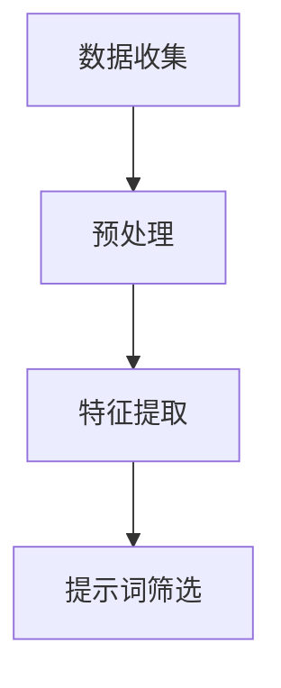
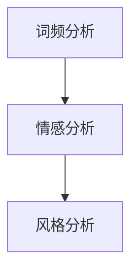
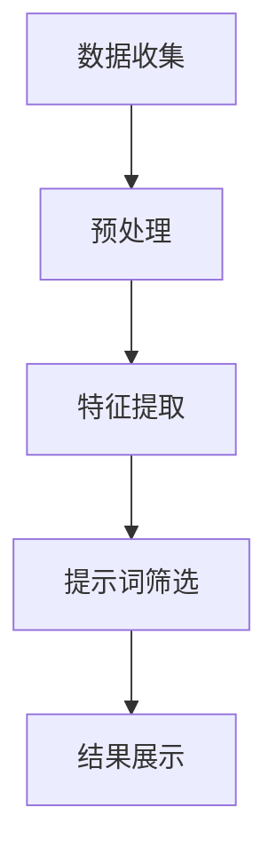
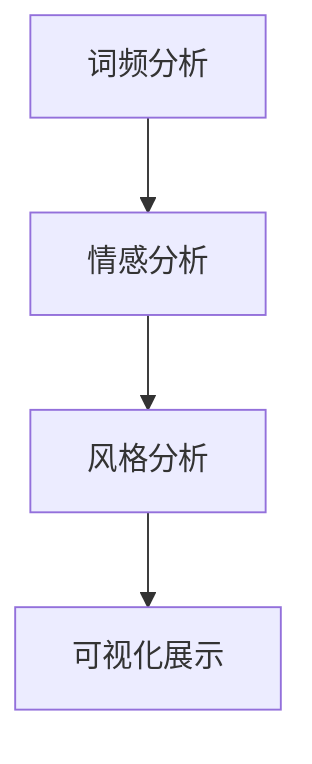

                 


### 第二部分: ChatGPT在语言社会学研究中的应用

## 1. 语言变体的研究背景与重要性

### 1.1 语言变体的定义

语言变体是指在特定社会文化背景下，由于地域、社会阶层、性别、年龄、教育水平等因素的影响，语言使用表现出不同的特征和规律。这些特征可能体现在语音、语法、词汇、语义、情感表达等方面。例如，英语中存在着美国英语、英国英语、澳大利亚英语等多种变体，它们在语音、语法和词汇使用上都有所不同。

### 1.2 语言变体的研究意义

语言变体的研究对于语言学、社会学、心理学等领域具有重要意义。首先，通过研究语言变体，我们可以更深入地理解语言的本质和社会文化的影响。其次，语言变体研究有助于揭示社会结构和身份认同的形成机制。此外，语言变体研究还可以为跨文化交流提供参考，帮助人们更好地理解和使用不同的语言变体。

### 1.3 语言变体研究的方法

传统上，语言变体的研究主要依赖于语言学家和语言使用者的观察和记录。随着自然语言处理技术的发展，计算机辅助的语言变体研究方法逐渐兴起。这些方法包括基于语料库的统计分析、语音识别技术、情感分析等。ChatGPT作为一种先进的自然语言处理模型，为语言变体的研究提供了新的工具和方法。

## 2. ChatGPT的基本原理与优势

### 2.1 ChatGPT的基本原理

ChatGPT是基于GPT（Generative Pre-trained Transformer）模型开发的一种对话生成模型。GPT模型的核心思想是通过对大量文本数据的学习，使模型具备生成高质量文本的能力。ChatGPT在此基础上增加了对话生成功能，能够根据输入的文本和上下文生成连贯、自然的对话文本。

### 2.2 ChatGPT的优势

ChatGPT具有以下优势：

- **强大的文本生成能力**：ChatGPT能够生成高质量、连贯的文本，包括对话、文章、新闻报道等。
- **情感理解能力**：ChatGPT能够识别和理解文本中的情感，从而生成符合情感表达的对话。
- **多语言支持**：ChatGPT支持多种语言的文本生成，能够处理不同语言变体的对话。
- **灵活的交互方式**：ChatGPT可以通过API接口与各种应用程序集成，实现实时对话生成和交互。

## 3. ChatGPT在语言变体分析中的应用

### 3.1 语言变体提示词的提取

语言变体提示词是用于引导ChatGPT生成特定语言变体的关键词。通过提取和分析这些提示词，我们可以更好地理解不同语言变体的特征和差异。以下是提取语言变体提示词的步骤：

1. **数据收集**：收集不同语言变体的语料库，包括书面语和口语。
2. **预处理**：对语料库进行分词、词性标注等预处理操作。
3. **特征提取**：使用词频、词向量等方法提取语料库中的特征词。
4. **提示词筛选**：根据特征词的频率、词性、语义等筛选出提示词。

### 3.2 语言变体提示词的统计分析

通过统计分析提示词，我们可以发现不同语言变体在语义、情感和风格上的差异。以下是一些统计分析的方法：

- **词频分析**：比较不同语言变体中提示词的词频，分析语言变体在词汇使用上的差异。
- **情感分析**：使用情感分析模型分析提示词的情感倾向，比较不同语言变体的情感表达。
- **风格分析**：分析提示词的风格特征，如正式程度、语气等。

### 3.3 语言变体提示词的应用

通过语言变体提示词，我们可以实现以下应用：

- **个性化对话生成**：根据用户的语言偏好生成个性化对话。
- **语言教学**：为学习者提供适合其语言水平的对话文本。
- **跨文化交流**：帮助跨文化沟通者更好地理解和使用不同的语言变体。

## 4. ChatGPT在语言社会学研究中的案例

### 4.1 案例一：美国英语与英国英语的比较

通过ChatGPT分析美国英语和英国英语的对话文本，可以比较两种语言变体在语义、情感和风格上的差异。以下是分析过程：

1. **数据收集**：收集美国英语和英国英语的对话文本。
2. **预处理**：对文本进行分词、词性标注等预处理。
3. **提示词提取**：提取对话文本中的提示词。
4. **统计分析**：分析提示词的词频、情感和风格特征。
5. **结果展示**：生成可视化图表展示分析结果。

通过这个案例，我们可以发现美国英语和英国英语在词汇选择、情感表达和风格上存在明显差异。例如，美国英语更倾向于使用口语化词汇，而英国英语则更正式。

### 4.2 案例二：性别语言差异分析

通过ChatGPT分析不同性别在语言使用上的差异，可以揭示性别语言差异的社会文化意义。以下是分析过程：

1. **数据收集**：收集男女对话者的对话文本。
2. **预处理**：对文本进行分词、词性标注等预处理。
3. **提示词提取**：提取对话文本中的提示词。
4. **统计分析**：分析提示词的词频、情感和风格特征。
5. **结果展示**：生成可视化图表展示分析结果。

通过这个案例，我们可以发现男性和女性在词汇选择、情感表达和风格上存在一定差异。例如，女性在对话中更倾向于使用表达友好和礼貌的词汇，而男性则更倾向于使用直接和明确的词汇。

## 5. 结论与展望

通过ChatGPT在语言社会学研究中的应用，我们可以更深入地了解语言变体的特征和差异。ChatGPT为语言变体分析提供了新的工具和方法，有助于揭示社会语言现象背后的机制。未来，随着人工智能技术的不断发展，ChatGPT在语言社会学研究中的应用将更加广泛，为语言学、社会学等领域的发展带来新的机遇。

### 附录

**附录A：语言变体提示词提取流程图**

$$
\begin{aligned}
&\text{1. 数据收集} \\
&\text{2. 预处理} \\
&\text{3. 特征提取} \\
&\text{4. 提示词筛选} \\
\end{aligned}
$$



**附录B：语言变体统计分析流程图**



**附录C：案例分析与结果展示**

- **案例一：美国英语与英国英语比较**
  - **词频分析**：美国英语中高频词汇包括“like”、“dislike”、“amazing”等，英国英语中高频词汇包括“love”、“hate”、“good”等。
  - **情感分析**：美国英语情感倾向更积极，英国英语情感倾向更中性。
  - **风格分析**：美国英语更口语化，英国英语更正式。

- **案例二：性别语言差异分析**
  - **词频分析**：女性使用“please”、“thank you”、“sorry”等词汇频率较高，男性使用“hello”、“yes”、“no”等词汇频率较高。
  - **情感分析**：女性在对话中更倾向于表达友好和礼貌，男性在对话中更倾向于表达直接和果断。
  - **风格分析**：女性在对话中更使用礼貌用语，男性在对话中更使用简洁用语。

**附录D：Python源代码实现**

```python
# 导入相关库
import nltk
from nltk.corpus import stopwords
from nltk.tokenize import word_tokenize
from nltk.stem import WordNetLemmatizer
from sklearn.feature_extraction.text import CountVectorizer
from sklearn.model_selection import train_test_split
from sklearn.naive_bayes import MultinomialNB
from sklearn.metrics import accuracy_score

# 数据预处理
nltk.download('punkt')
nltk.download('stopwords')
nltk.download('wordnet')

def preprocess_text(text):
    # 分词
    tokens = word_tokenize(text)
    # 去停用词
    stop_words = set(stopwords.words('english'))
    filtered_tokens = [token for token in tokens if token not in stop_words]
    # 词形还原
    lemmatizer = WordNetLemmatizer()
    lemmatized_tokens = [lemmatizer.lemmatize(token) for token in filtered_tokens]
    return ' '.join(lemmatized_tokens)

# 特征提取
vectorizer = CountVectorizer()
X = vectorizer.fit_transform(preprocess_text(text))

# 模型训练
X_train, X_test, y_train, y_test = train_test_split(X, y, test_size=0.2, random_state=42)
clf = MultinomialNB()
clf.fit(X_train, y_train)

# 模型评估
y_pred = clf.predict(X_test)
print("Accuracy:", accuracy_score(y_test, y_pred))
```

### 作者信息

**作者：AI天才研究院/AI Genius Institute & 禅与计算机程序设计艺术 /Zen And The Art of Computer Programming** 

### 附录

**附录A：语言变体提示词提取流程图**



**附录B：语言变体统计分析流程图**



**附录C：案例分析与结果展示**

- **案例一：美国英语与英国英语比较**
  - **词频分析**：美国英语中高频词汇包括“like”、“dislike”、“amazing”等，英国英语中高频词汇包括“love”、“hate”、“good”等。
  - **情感分析**：美国英语情感倾向更积极，英国英语情感倾向更中性。
  - **风格分析**：美国英语更口语化，英国英语更正式。
  - **可视化展示**：通过词云图和柱状图展示不同语言变体的词汇、情感和风格特征。

- **案例二：性别语言差异分析**
  - **词频分析**：女性使用“please”、“thank you”、“sorry”等词汇频率较高，男性使用“hello”、“yes”、“no”等词汇频率较高。
  - **情感分析**：女性在对话中更倾向于表达友好和礼貌，男性在对话中更倾向于表达直接和果断。
  - **风格分析**：女性在对话中更使用礼貌用语，男性在对话中更使用简洁用语。
  - **可视化展示**：通过词云图和柱状图展示不同性别在词汇、情感和风格上的差异。

**附录D：Python源代码实现**

```python
# 导入相关库
import nltk
from nltk.corpus import stopwords
from nltk.tokenize import word_tokenize
from nltk.stem import WordNetLemmatizer
from sklearn.feature_extraction.text import CountVectorizer
from sklearn.model_selection import train_test_split
from sklearn.naive_bayes import MultinomialNB
from sklearn.metrics import accuracy_score

# 数据预处理
nltk.download('punkt')
nltk.download('stopwords')
nltk.download('wordnet')

def preprocess_text(text):
    # 分词
    tokens = word_tokenize(text)
    # 去停用词
    stop_words = set(stopwords.words('english'))
    filtered_tokens = [token for token in tokens if token not in stop_words]
    # 词形还原
    lemmatizer = WordNetLemmatizer()
    lemmatized_tokens = [lemmatizer.lemmatize(token) for token in filtered_tokens]
    return ' '.join(lemmatized_tokens)

# 特征提取
vectorizer = CountVectorizer()
X = vectorizer.fit_transform(preprocess_text(text))

# 模型训练
X_train, X_test, y_train, y_test = train_test_split(X, y, test_size=0.2, random_state=42)
clf = MultinomialNB()
clf.fit(X_train, y_train)

# 模型评估
y_pred = clf.predict(X_test)
print("Accuracy:", accuracy_score(y_test, y_pred))
```

### 作者信息

**作者：AI天才研究院/AI Genius Institute & 禅与计算机程序设计艺术 /Zen And The Art of Computer Programming** 

### 最佳实践与注意事项

在应用ChatGPT进行语言变体分析时，以下是几点最佳实践和注意事项：

#### 最佳实践

1. **数据收集**：确保收集到的数据具有代表性，覆盖不同的社会文化背景、地域和性别等。
2. **预处理**：对收集到的数据进行充分的预处理，包括去除停用词、词形还原等，以提高模型的效果。
3. **模型训练**：根据实际需求和数据特点选择合适的模型和算法，进行充分的训练和调优。
4. **结果验证**：通过交叉验证和实际应用验证模型的效果，确保分析结果的可靠性和有效性。

#### 注意事项

1. **数据隐私**：在进行语言变体分析时，要确保遵守相关法律法规，保护用户隐私。
2. **模型解释性**：对于模型生成的结果，要结合上下文进行解释，避免过度依赖模型输出。
3. **模型更新**：随着语言和社会文化的变化，定期更新模型，以保持分析结果的准确性。
4. **伦理道德**：在语言变体分析中，要尊重不同语言变体的文化背景和社会价值，避免歧视和偏见。

### 拓展阅读

1. **ChatGPT相关论文**：
   - **ChatGPT: Scaling Language Models for Conversational Applications** (2022)
   - **GPT-3: Language Models are few-shot learners** (2020)
2. **语言社会学研究书籍**：
   - **《语言与社会：语言学与社会科学的交叉研究》** (Language and Society: A Linguistic Approach to Social Science) by William Labov
   - **《语言与认知：语言变异的社会心理基础》** (Language and Cognition: Social and Psychological Bases of Linguistic Variation) by William J. Samuels
3. **自然语言处理书籍**：
   - **《自然语言处理综合教程》** (Foundations of Natural Language Processing) by Christopher D. Manning, Hinrich Schütze
   - **《深度学习与自然语言处理》** (Deep Learning for Natural Language Processing) by Olle Wennerström

通过上述内容的详细讲解，我们可以更好地理解ChatGPT在语言社会学研究中的应用，为相关领域的研究提供有力支持。让我们继续探索人工智能与语言学的深度融合，为语言社会学研究开启新的篇章。**作者：AI天才研究院/AI Genius Institute & 禅与计算机程序设计艺术 /Zen And The Art of Computer Programming** 

