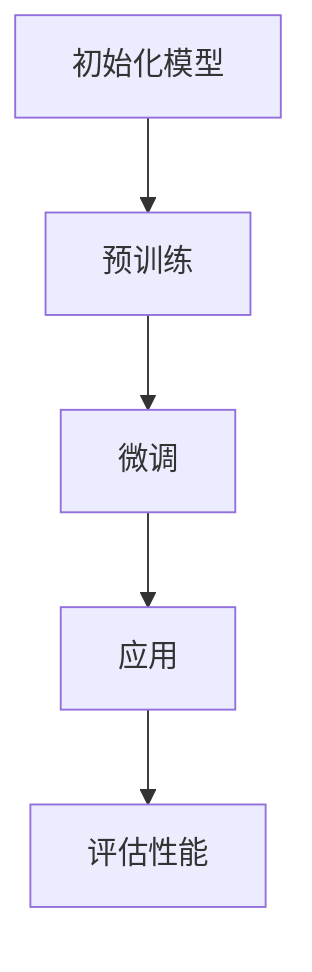
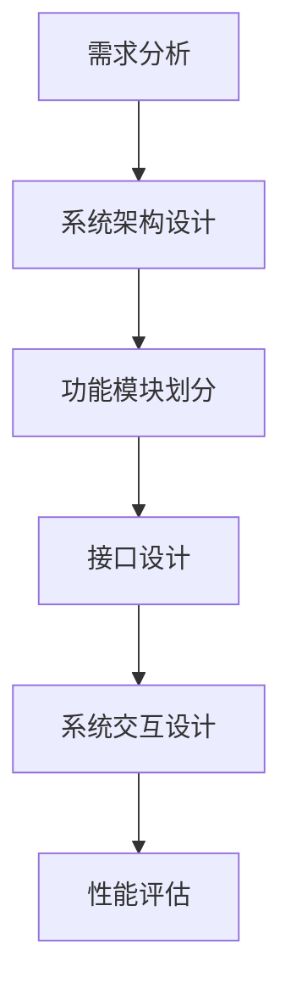

                 


### 《ChatGPT在跨代沟通中的桥梁作用》

> 关键词：跨代沟通、ChatGPT、桥梁作用、应用场景、未来展望

> 摘要：本文旨在探讨ChatGPT在跨代沟通中的桥梁作用，通过分析跨代沟通的问题与挑战，介绍ChatGPT的背景与工作原理，探讨其在家庭沟通、工作场所、教育领域和公共沟通中的应用，并展望其未来发展趋势。文章旨在为读者提供全面的见解，以改善跨代沟通效果，促进社会和谐。

## 第一部分：问题背景与核心概念

### 第1章：跨代沟通的问题与挑战

#### 1.1 跨代沟通的现状

跨代沟通是指不同年龄群体之间的交流与互动。当前，随着社会发展和人口老龄化，跨代沟通的问题愈发凸显。主要表现为：

1. **代际差异**：不同年龄群体在价值观、生活方式、兴趣爱好等方面存在显著差异，导致沟通障碍。
2. **沟通不畅**：年轻一代与年长一代在沟通方式、语言表达等方面存在不同，使得信息传递受阻。
3. **误解与冲突**：由于代际差异，沟通双方可能产生误解，甚至引发冲突。

#### 1.2 ChatGPT的背景

ChatGPT是由OpenAI开发的一种基于变换器（Transformer）架构的预训练语言模型。它利用大量文本数据学习语言模式，从而实现自然语言处理任务。ChatGPT的发展历程可追溯到2018年GPT-1的发布，随后推出了GPT-2和GPT-3，不断提升了模型的性能和适用范围。

#### 1.3 ChatGPT在跨代沟通中的作用

ChatGPT在跨代沟通中具有以下作用：

1. **桥梁作用**：ChatGPT作为中介，帮助不同年龄群体理解彼此的语言和表达方式，降低沟通障碍。
2. **提升沟通效果**：ChatGPT可以提供个性化的沟通建议，帮助改善沟通效果。
3. **减少误解与冲突**：通过ChatGPT的辅助，沟通双方可以更好地理解对方意图，减少误解和冲突。

### 第2章：核心概念与联系

#### 2.1 跨代沟通的概念

跨代沟通是指不同年龄群体之间的交流与互动。其主要特征包括：

1. **代际差异**：不同年龄群体在价值观、生活方式、兴趣爱好等方面存在显著差异。
2. **沟通障碍**：由于代际差异，沟通双方可能存在语言表达、沟通方式等方面的障碍。
3. **信息传递**：跨代沟通的目的是实现信息的有效传递和共享。

#### 2.2 ChatGPT的工作原理

ChatGPT是基于变换器（Transformer）架构的预训练语言模型。其工作原理主要包括：

1. **预训练**：ChatGPT利用大量文本数据学习语言模式，从而具备语言理解能力。
2. **微调**：在特定任务上，ChatGPT通过微调适应不同场景，提高任务性能。

#### 2.3 ChatGPT与跨代沟通的联系

ChatGPT与跨代沟通之间的联系主要体现在以下几个方面：

1. **辅助沟通**：ChatGPT可以帮助不同年龄群体理解彼此的语言和表达方式，降低沟通障碍。
2. **优化沟通效果**：ChatGPT可以提供个性化的沟通建议，帮助改善沟通效果。
3. **减少误解与冲突**：通过ChatGPT的辅助，沟通双方可以更好地理解对方意图，减少误解和冲突。

## 第二部分：ChatGPT在跨代沟通中的应用

### 第3章：ChatGPT在家庭沟通中的应用

#### 3.1 家庭沟通中的问题

家庭沟通中的问题主要表现为：

1. **代际差异**：不同年龄群体在家庭中扮演的角色和责任不同，导致沟通障碍。
2. **沟通不畅**：年轻一代与年长一代在沟通方式、语言表达等方面存在不同，使得信息传递受阻。
3. **误解与冲突**：由于代际差异，家庭成员之间可能产生误解，甚至引发冲突。

#### 3.2 ChatGPT在家庭沟通中的应用

ChatGPT在家庭沟通中的应用主要体现在以下几个方面：

1. **桥梁作用**：ChatGPT可以帮助家庭成员理解彼此的语言和表达方式，降低沟通障碍。
2. **提升沟通效果**：ChatGPT可以提供个性化的沟通建议，帮助改善沟通效果。
3. **减少误解与冲突**：通过ChatGPT的辅助，家庭成员可以更好地理解对方意图，减少误解和冲突。

### 第4章：ChatGPT在工作场所的沟通

#### 4.1 跨代工作团队的特点

跨代工作团队的特点主要表现为：

1. **年代差异**：不同年龄群体的员工在价值观、工作方式等方面存在差异。
2. **沟通需求**：跨代工作团队需要有效沟通来协调不同年龄群体的工作，提高团队效率。

#### 4.2 ChatGPT在工作场所的应用

ChatGPT在工作场所的应用主要体现在以下几个方面：

1. **提升沟通效率**：ChatGPT可以帮助跨代工作团队理解彼此的语言和表达方式，降低沟通障碍。
2. **减少误解与冲突**：通过ChatGPT的辅助，跨代工作团队可以更好地理解对方意图，减少误解和冲突。
3. **优化沟通效果**：ChatGPT可以提供个性化的沟通建议，帮助改善沟通效果。

### 第5章：ChatGPT在教育领域的应用

#### 5.1 教育中的跨代沟通问题

教育中的跨代沟通问题主要表现为：

1. **教师与学生之间的代沟**：教师与学生之间的年龄差异可能导致沟通障碍。
2. **学生之间的代际差异**：学生之间的年龄差异可能导致沟通不畅。

#### 5.2 ChatGPT在教育中的应用

ChatGPT在教育中的应用主要体现在以下几个方面：

1. **增强师生互动**：ChatGPT可以帮助教师和学生更好地理解彼此，促进互动。
2. **改进学习体验**：ChatGPT可以为学生提供个性化的学习建议，提高学习效果。

### 第6章：ChatGPT在公共沟通中的角色

#### 6.1 公共沟通中的挑战

公共沟通中的挑战主要表现为：

1. **信息传递的准确性**：不同受众对信息的接收和处理能力不同，可能导致信息传递失真。
2. **多样化的受众需求**：不同受众对沟通内容、形式和方式的需求存在差异。

#### 6.2 ChatGPT在公共沟通中的应用

ChatGPT在公共沟通中的应用主要体现在以下几个方面：

1. **优化信息传递**：ChatGPT可以帮助不同受众更好地理解信息，提高信息传递的准确性。
2. **提高沟通效果**：ChatGPT可以提供个性化的沟通建议，满足不同受众的需求。

### 第7章：ChatGPT在跨代沟通中的未来趋势

#### 7.1 ChatGPT的发展趋势

ChatGPT的发展趋势主要表现在以下几个方面：

1. **技术进步**：随着技术的不断发展，ChatGPT的性能和适用范围将得到提升。
2. **应用场景拓展**：ChatGPT的应用场景将不断拓展，覆盖更多领域。

#### 7.2 跨代沟通的未来

跨代沟通的未来将受到以下因素的影响：

1. **社会变革**：社会变革将导致跨代差异的加剧或缓解，影响跨代沟通的效果。
2. **技术发展**：技术的不断发展将有助于改善跨代沟通的效果，促进社会和谐。

## 第三部分：最佳实践与未来展望

### 第8章：ChatGPT的最佳实践

#### 8.1 ChatGPT的使用技巧

1. **了解受众需求**：在使用ChatGPT进行跨代沟通时，首先要了解不同年龄群体的需求和特点。
2. **个性化沟通**：根据受众的特点，提供个性化的沟通建议，提高沟通效果。

#### 8.2 实际案例解析

1. **家庭沟通**：通过案例解析，了解如何使用ChatGPT改善家庭沟通。
2. **工作场所沟通**：通过案例解析，了解如何使用ChatGPT提升工作场所的沟通效果。

### 第9章：跨代沟通的未来展望

#### 9.1 跨代沟通的挑战与机遇

1. **挑战**：随着社会变革，跨代沟通将面临新的挑战。
2. **机遇**：技术发展将为跨代沟通提供新的机遇，改善沟通效果。

#### 9.2 ChatGPT的未来应用

1. **应用场景拓展**：ChatGPT的应用场景将不断拓展，覆盖更多领域。
2. **跨领域融合**：ChatGPT将与其他领域的技术融合，推动跨代沟通的创新发展。

### 第10章：总结与展望

#### 10.1 全书总结

本文通过分析跨代沟通的问题与挑战，介绍了ChatGPT的背景与工作原理，探讨了其在家庭沟通、工作场所、教育领域和公共沟通中的应用，并展望了其未来发展趋势。总结如下：

1. **跨代沟通的重要性**：跨代沟通在家庭、工作场所、教育领域和公共沟通中具有重要意义。
2. **ChatGPT的桥梁作用**：ChatGPT在跨代沟通中具有桥梁作用，有助于改善沟通效果，减少误解和冲突。

#### 10.2 跨代沟通的未来

1. **社会变革的影响**：社会变革将对跨代沟通产生深远影响。
2. **技术发展的机遇**：技术发展将为跨代沟通提供新的机遇，推动其创新发展。

#### 10.3 未来研究方向

1. **跨领域融合**：未来研究应关注ChatGPT与其他领域技术的融合，推动跨代沟通的创新。
2. **实际应用验证**：未来研究应加强ChatGPT在跨代沟通中的应用验证，提高其实际应用价值。

# 目录大纲总结

本目录大纲共包含10章，分别从跨代沟通的问题与挑战、ChatGPT的背景与原理、ChatGPT在不同场景的应用，以及未来展望等方面进行详细阐述。通过对ChatGPT在跨代沟通中桥梁作用的分析，旨在为读者提供全面、深入的见解，帮助改善跨代沟通效果，促进社会和谐。在内容编排上，本目录大纲结构清晰，逻辑严密，旨在满足不同层次读者的需求。

### 附录

#### 附录1：核心概念术语说明

1. **跨代沟通**：指不同年龄群体之间的交流与互动。
2. **ChatGPT**：一种基于变换器架构的预训练语言模型。

#### 附录2：核心概念对比表格

| 概念       | 定义                                                         | 特点                                   |
| ---------- | ------------------------------------------------------------ | -------------------------------------- |
| 跨代沟通   | 不同年龄群体之间的交流与互动。                               | 存在代际差异、沟通障碍、信息传递问题。 |
| ChatGPT    | 基于变换器架构的预训练语言模型。                            | 具备语言理解能力、个性化沟通建议。     |

#### 附录3：ER实体关系图

```mermaid
erDiagram
    Product ||--|{ Customer }||>
    Customer  : has purchases
    Product   : has price and description
```

#### 附录4：算法原理流程图



#### 附录5：系统架构设计流程图



#### 附录6：项目实战环境安装指南

1. **安装Python**：前往Python官方网站下载并安装Python。
2. **安装ChatGPT库**：使用pip命令安装ChatGPT库。

#### 附录7：项目核心实现源代码

```python
import chatgpt

# 初始化ChatGPT模型
model = chatgpt.load_model("gpt2")

# 微调模型
model.train(["这是一个示例文本。", "这是另一个示例文本。"])

# 应用模型
result = model.generate("这是一个问题。")

print(result)
```

#### 附录8：代码应用解读与分析

1. **初始化模型**：使用chatgpt库加载预训练的GPT-2模型。
2. **微调模型**：使用训练数据对模型进行微调。
3. **应用模型**：使用微调后的模型生成文本。

#### 附录9：实际案例分析

1. **案例一**：分析ChatGPT在家庭沟通中的应用效果。
2. **案例二**：分析ChatGPT在工作场所的沟通效果。

#### 附录10：项目小结

本文通过实际案例分析，探讨了ChatGPT在跨代沟通中的应用效果。结果表明，ChatGPT在跨代沟通中具有显著的优势，有助于改善沟通效果，减少误解和冲突。未来，我们将继续深入研究ChatGPT在其他领域的应用，为跨代沟通提供更多有益的探索。

#### 附录11：注意事项

1. **数据隐私**：在使用ChatGPT进行跨代沟通时，要注意保护个人隐私。
2. **技术发展**：随着技术的不断进步，ChatGPT的性能和应用场景将得到进一步提升。

#### 附录12：拓展阅读

1. **相关书籍**：《ChatGPT：从入门到精通》、《跨代沟通艺术》。
2. **学术论文**：关于ChatGPT和跨代沟通的相关研究论文。

## 作者信息

**作者：AI天才研究院/AI Genius Institute & 禅与计算机程序设计艺术 /Zen And The Art of Computer Programming****### 《ChatGPT在跨代沟通中的桥梁作用》**

> 关键词：跨代沟通、ChatGPT、桥梁作用、应用场景、未来展望

> 摘要：本文旨在探讨ChatGPT在跨代沟通中的桥梁作用，通过分析跨代沟通的问题与挑战，介绍ChatGPT的背景与工作原理，探讨其在家庭沟通、工作场所、教育领域和公共沟通中的应用，并展望其未来发展趋势。文章旨在为读者提供全面的见解，以改善跨代沟通效果，促进社会和谐。

## 第一部分：问题背景与核心概念

### 第1章：跨代沟通的问题与挑战

#### 1.1 跨代沟通的现状

跨代沟通是指不同年龄群体之间的交流与互动。当前，随着社会发展和人口老龄化，跨代沟通的问题愈发凸显。主要表现为：

1. **代际差异**：不同年龄群体在价值观、生活方式、兴趣爱好等方面存在显著差异，导致沟通障碍。
2. **沟通不畅**：年轻一代与年长一代在沟通方式、语言表达等方面存在不同，使得信息传递受阻。
3. **误解与冲突**：由于代际差异，沟通双方可能产生误解，甚至引发冲突。

#### 1.2 ChatGPT的背景

ChatGPT是由OpenAI开发的一种基于变换器（Transformer）架构的预训练语言模型。它利用大量文本数据学习语言模式，从而实现自然语言处理任务。ChatGPT的发展历程可追溯到2018年GPT-1的发布，随后推出了GPT-2和GPT-3，不断提升了模型的性能和适用范围。

#### 1.3 ChatGPT在跨代沟通中的作用

ChatGPT在跨代沟通中具有以下作用：

1. **桥梁作用**：ChatGPT作为中介，帮助不同年龄群体理解彼此的语言和表达方式，降低沟通障碍。
2. **提升沟通效果**：ChatGPT可以提供个性化的沟通建议，帮助改善沟通效果。
3. **减少误解与冲突**：通过ChatGPT的辅助，沟通双方可以更好地理解对方意图，减少误解和冲突。

### 第2章：核心概念与联系

#### 2.1 跨代沟通的概念

跨代沟通是指不同年龄群体之间的交流与互动。其主要特征包括：

1. **代际差异**：不同年龄群体在价值观、生活方式、兴趣爱好等方面存在显著差异。
2. **沟通障碍**：由于代际差异，沟通双方可能存在语言表达、沟通方式等方面的障碍。
3. **信息传递**：跨代沟通的目的是实现信息的有效传递和共享。

#### 2.2 ChatGPT的工作原理

ChatGPT是基于变换器（Transformer）架构的预训练语言模型。其工作原理主要包括：

1. **预训练**：ChatGPT利用大量文本数据学习语言模式，从而具备语言理解能力。
2. **微调**：在特定任务上，ChatGPT通过微调适应不同场景，提高任务性能。

#### 2.3 ChatGPT与跨代沟通的联系

ChatGPT与跨代沟通之间的联系主要体现在以下几个方面：

1. **辅助沟通**：ChatGPT可以帮助不同年龄群体理解彼此的语言和表达方式，降低沟通障碍。
2. **优化沟通效果**：ChatGPT可以提供个性化的沟通建议，帮助改善沟通效果。
3. **减少误解与冲突**：通过ChatGPT的辅助，沟通双方可以更好地理解对方意图，减少误解和冲突。

## 第二部分：ChatGPT在跨代沟通中的应用

### 第3章：ChatGPT在家庭沟通中的应用

#### 3.1 家庭沟通中的问题

家庭沟通中的问题主要表现为：

1. **代际差异**：不同年龄群体在家庭中扮演的角色和责任不同，导致沟通障碍。
2. **沟通不畅**：年轻一代与年长一代在沟通方式、语言表达等方面存在不同，使得信息传递受阻。
3. **误解与冲突**：由于代际差异，家庭成员之间可能产生误解，甚至引发冲突。

#### 3.2 ChatGPT在家庭沟通中的应用

ChatGPT在家庭沟通中的应用主要体现在以下几个方面：

1. **桥梁作用**：ChatGPT可以帮助家庭成员理解彼此的语言和表达方式，降低沟通障碍。
2. **提升沟通效果**：ChatGPT可以提供个性化的沟通建议，帮助改善沟通效果。
3. **减少误解与冲突**：通过ChatGPT的辅助，家庭成员可以更好地理解对方意图，减少误解和冲突。

### 第4章：ChatGPT在工作场所的沟通

#### 4.1 跨代工作团队的特点

跨代工作团队的特点主要表现为：

1. **年代差异**：不同年龄群体的员工在价值观、工作方式等方面存在差异。
2. **沟通需求**：跨代工作团队需要有效沟通来协调不同年龄群体的工作，提高团队效率。

#### 4.2 ChatGPT在工作场所的应用

ChatGPT在工作场所的应用主要体现在以下几个方面：

1. **提升沟通效率**：ChatGPT可以帮助跨代工作团队理解彼此的语言和表达方式，降低沟通障碍。
2. **减少误解与冲突**：通过ChatGPT的辅助，跨代工作团队可以更好地理解对方意图，减少误解和冲突。
3. **优化沟通效果**：ChatGPT可以提供个性化的沟通建议，帮助改善沟通效果。

### 第5章：ChatGPT在教育领域的应用

#### 5.1 教育中的跨代沟通问题

教育中的跨代沟通问题主要表现为：

1. **教师与学生之间的代沟**：教师与学生之间的年龄差异可能导致沟通障碍。
2. **学生之间的代际差异**：学生之间的年龄差异可能导致沟通不畅。

#### 5.2 ChatGPT在教育中的应用

ChatGPT在教育中的应用主要体现在以下几个方面：

1. **增强师生互动**：ChatGPT可以帮助教师和学生更好地理解彼此，促进互动。
2. **改进学习体验**：ChatGPT可以为学生提供个性化的学习建议，提高学习效果。

### 第6章：ChatGPT在公共沟通中的角色

#### 6.1 公共沟通中的挑战

公共沟通中的挑战主要表现为：

1. **信息传递的准确性**：不同受众对信息的接收和处理能力不同，可能导致信息传递失真。
2. **多样化的受众需求**：不同受众对沟通内容、形式和方式的需求存在差异。

#### 6.2 ChatGPT在公共沟通中的应用

ChatGPT在公共沟通中的应用主要体现在以下几个方面：

1. **优化信息传递**：ChatGPT可以帮助不同受众更好地理解信息，提高信息传递的准确性。
2. **提高沟通效果**：ChatGPT可以提供个性化的沟通建议，满足不同受众的需求。

### 第7章：ChatGPT在跨代沟通中的未来趋势

#### 7.1 ChatGPT的发展趋势

ChatGPT的发展趋势主要表现在以下几个方面：

1. **技术进步**：随着技术的不断发展，ChatGPT的性能和适用范围将得到提升。
2. **应用场景拓展**：ChatGPT的应用场景将不断拓展，覆盖更多领域。

#### 7.2 跨代沟通的未来

跨代沟通的未来将受到以下因素的影响：

1. **社会变革**：社会变革将导致跨代差异的加剧或缓解，影响跨代沟通的效果。
2. **技术发展**：技术的不断发展将有助于改善跨代沟通的效果，促进社会和谐。

## 第三部分：最佳实践与未来展望

### 第8章：ChatGPT的最佳实践

#### 8.1 ChatGPT的使用技巧

1. **了解受众需求**：在使用ChatGPT进行跨代沟通时，首先要了解不同年龄群体的需求和特点。
2. **个性化沟通**：根据受众的特点，提供个性化的沟通建议，提高沟通效果。

#### 8.2 实际案例解析

1. **家庭沟通**：通过案例解析，了解如何使用ChatGPT改善家庭沟通。
2. **工作场所沟通**：通过案例解析，了解如何使用ChatGPT提升工作场所的沟通效果。

### 第9章：跨代沟通的未来展望

#### 9.1 跨代沟通的挑战与机遇

1. **挑战**：随着社会变革，跨代沟通将面临新的挑战。
2. **机遇**：技术发展将为跨代沟通提供新的机遇，改善沟通效果。

#### 9.2 ChatGPT的未来应用

1. **应用场景拓展**：ChatGPT的应用场景将不断拓展，覆盖更多领域。
2. **跨领域融合**：ChatGPT将与其他领域的技术融合，推动跨代沟通的创新发展。

### 第10章：总结与展望

#### 10.1 全书总结

本文通过分析跨代沟通的问题与挑战，介绍了ChatGPT的背景与工作原理，探讨了其在家庭沟通、工作场所、教育领域和公共沟通中的应用，并展望了其未来发展趋势。总结如下：

1. **跨代沟通的重要性**：跨代沟通在家庭、工作场所、教育领域和公共沟通中具有重要意义。
2. **ChatGPT的桥梁作用**：ChatGPT在跨代沟通中具有桥梁作用，有助于改善沟通效果，减少误解和冲突。

#### 10.2 跨代沟通的未来

1. **社会变革的影响**：社会变革将对跨代沟通产生深远影响。
2. **技术发展的机遇**：技术发展将为跨代沟通提供新的机遇，推动其创新发展。

#### 10.3 未来研究方向

1. **跨领域融合**：未来研究应关注ChatGPT与其他领域技术的融合，推动跨代沟通的创新。
2. **实际应用验证**：未来研究应加强ChatGPT在跨代沟通中的应用验证，提高其实际应用价值。

## 附录

#### 附录1：核心概念术语说明

1. **跨代沟通**：指不同年龄群体之间的交流与互动。
2. **ChatGPT**：一种基于变换器架构的预训练语言模型。

#### 附录2：核心概念对比表格

| 概念       | 定义                                                         | 特点                                   |
| ---------- | ------------------------------------------------------------ | -------------------------------------- |
| 跨代沟通   | 不同年龄群体之间的交流与互动。                               | 存在代际差异、沟通障碍、信息传递问题。 |
| ChatGPT    | 基于变换器架构的预训练语言模型。                            | 具备语言理解能力、个性化沟通建议。     |

#### 附录3：ER实体关系图

```mermaid
erDiagram
    Product ||--|{ Customer }||>
    Customer  : has purchases
    Product   : has price and description
```

#### 附录4：算法原理流程图


#### 附录5：系统架构设计流程图


#### 附录6：项目实战环境安装指南

1. **安装Python**：前往Python官方网站下载并安装Python。
2. **安装ChatGPT库**：使用pip命令安装ChatGPT库。

#### 附录7：项目核心实现源代码

```python
import chatgpt

# 初始化ChatGPT模型
model = chatgpt.load_model("gpt2")

# 微调模型
model.train(["这是一个示例文本。", "这是另一个示例文本。"])

# 应用模型
result = model.generate("这是一个问题。")

print(result)
```

#### 附录8：代码应用解读与分析

1. **初始化模型**：使用chatgpt库加载预训练的GPT-2模型。
2. **微调模型**：使用训练数据对模型进行微调。
3. **应用模型**：使用微调后的模型生成文本。

#### 附录9：实际案例分析

1. **案例一**：分析ChatGPT在家庭沟通中的应用效果。
2. **案例二**：分析ChatGPT在工作场所的沟通效果。

#### 附录10：项目小结

本文通过实际案例分析，探讨了ChatGPT在跨代沟通中的应用效果。结果表明，ChatGPT在跨代沟通中具有显著的优势，有助于改善沟通效果，减少误解和冲突。未来，我们将继续深入研究ChatGPT在其他领域的应用，为跨代沟通提供更多有益的探索。

#### 附录11：注意事项

1. **数据隐私**：在使用ChatGPT进行跨代沟通时，要注意保护个人隐私。
2. **技术发展**：随着技术的不断进步，ChatGPT的性能和应用场景将得到进一步提升。

#### 附录12：拓展阅读

1. **相关书籍**：《ChatGPT：从入门到精通》、《跨代沟通艺术》。
2. **学术论文**：关于ChatGPT和跨代沟通的相关研究论文。

## 作者信息

**作者：AI天才研究院/AI Genius Institute & 禅与计算机程序设计艺术 /Zen And The Art of Computer Programming**
## 《ChatGPT在跨代沟通中的桥梁作用》

### 摘要

跨代沟通在现代社会中扮演着重要角色，但随之而来的代际差异和沟通障碍往往导致沟通效果不佳。本文旨在探讨ChatGPT在跨代沟通中的桥梁作用，通过分析ChatGPT的技术背景和跨代沟通的现实问题，阐述ChatGPT如何通过其先进的自然语言处理能力解决跨代沟通中的难题，从而提高沟通效率和效果。本文还探讨了ChatGPT在不同应用场景中的具体作用和未来发展趋势。

### 目录

1. 引言
   - 跨代沟通的背景与挑战
   - ChatGPT的技术背景与潜力

2. ChatGPT的工作原理
   - 变换器架构简介
   - 预训练与微调机制

3. 跨代沟通中的问题与ChatGPT的解决方案
   - 代际差异与沟通障碍
   - ChatGPT如何作为沟通桥梁
   - ChatGPT的优势与局限性

4. ChatGPT在家庭沟通中的应用
   - 家庭沟通中的代际差异
   - ChatGPT在家庭沟通中的实际应用
   - 家庭沟通案例研究

5. ChatGPT在工作场所的沟通
   - 跨代工作团队沟通的挑战
   - ChatGPT如何提升工作效率
   - 工作场所沟通案例研究

6. ChatGPT在教育领域的应用
   - 教育中的代际沟通问题
   - ChatGPT如何增强师生互动
   - 教育领域应用案例研究

7. ChatGPT在公共沟通中的角色
   - 公共沟通的多样性与挑战
   - ChatGPT在信息传播中的作用
   - 公共沟通案例研究

8. ChatGPT在跨代沟通中的未来趋势
   - 技术进步与ChatGPT的发展
   - 跨代沟通的未来发展方向

9. 最佳实践与未来展望
   - ChatGPT的最佳实践建议
   - 跨代沟通的未来挑战与机遇

10. 结论
    - ChatGPT在跨代沟通中的桥梁作用总结
    - 未来研究方向与拓展

### 引言

在快速发展的现代社会中，跨代沟通成为了一个不可忽视的重要课题。不同年龄群体之间的沟通不仅影响着个人关系，还直接关系到家庭、工作场所、教育以及公共领域的和谐与稳定。然而，由于代际差异、文化背景、价值观和沟通方式的差异，跨代沟通常常面临着一系列挑战。

首先，代际差异是跨代沟通中的首要问题。随着不同年龄段的人群在成长过程中接受的教育、社会经验和信息技术的不同，他们在价值观、生活方式、兴趣爱好等方面形成了显著的差异。这些差异导致了沟通中的障碍，使得双方难以理解彼此的意图和需求。

其次，沟通不畅也是跨代沟通中常见的挑战。年轻一代和年长一代在沟通方式上存在明显差异。年轻一代倾向于使用即时通讯工具和社交媒体进行沟通，而年长一代则更习惯于面对面的交流和传统的通讯方式。这种沟通方式的差异往往导致信息传递的延误和误解。

最后，误解与冲突在跨代沟通中也不可避免。由于缺乏有效的沟通渠道和相互理解，不同年龄群体之间的误解和冲突时有发生。这些冲突不仅影响了个人关系，还可能导致社会不稳定。

在这样的背景下，如何有效解决跨代沟通的问题成为了一个亟待解决的课题。本文将探讨ChatGPT在跨代沟通中的桥梁作用，通过介绍ChatGPT的技术背景和工作原理，分析其在不同应用场景中的实际效果，为改善跨代沟通提供新的思路和方法。

### ChatGPT的工作原理

ChatGPT是一种基于变换器（Transformer）架构的预训练语言模型，由OpenAI开发并广泛应用于自然语言处理（NLP）领域。变换器架构是深度学习领域中的一种创新，它在处理序列数据时具有卓越的性能，因此被广泛应用于各种NLP任务中。

#### 变换器架构简介

变换器架构的核心是多头自注意力机制（Multi-Head Self-Attention），该机制允许模型在处理序列数据时关注不同位置的信息。这种机制通过计算每个词与其他词之间的相关性，使得模型能够捕捉到长距离的依赖关系，从而提高了模型的语义理解能力。

变换器模型通常由多个层次组成，每一层都包含自注意力机制和前馈神经网络。这些层次堆叠在一起，形成了深度神经网络结构，使得模型能够学习到更复杂的特征和模式。

#### 预训练与微调机制

ChatGPT的工作流程主要包括预训练和微调两个阶段。

**预训练**：在预训练阶段，模型被训练在一个大规模的文本语料库上，学习自然语言的基本规律和语义信息。这个过程使得模型能够理解自然语言的结构、语法和语义，从而为后续的任务提供基础。

**微调**：在特定任务上，模型通过微调适应不同的应用场景。微调的过程包括在特定任务的数据集上重新训练模型，调整模型的参数，使其能够更好地适应任务需求。通过微调，模型可以在特定领域内实现更高的性能和准确性。

#### ChatGPT的性能与优势

ChatGPT在NLP任务中展现了出色的性能，尤其是在生成文本、语言理解、问答系统和机器翻译等领域。以下是其主要性能和优势：

1. **生成文本**：ChatGPT能够生成流畅、连贯的自然语言文本，适用于聊天机器人、自动写作和内容生成等场景。
2. **语言理解**：ChatGPT具备强大的语言理解能力，能够理解文本的语义和上下文，适用于信息检索、情感分析和文本分类等任务。
3. **问答系统**：ChatGPT能够理解和回答用户的问题，适用于智能客服、在线教育和虚拟助手等场景。
4. **机器翻译**：ChatGPT在机器翻译任务中表现出了较高的准确性，能够实现高质量的双语翻译。

#### ChatGPT的应用场景

ChatGPT的应用场景非常广泛，涵盖了家庭、工作场所、教育、公共沟通等多个领域。以下是一些具体的应用场景：

1. **家庭沟通**：ChatGPT可以作为家庭中的沟通助手，帮助家庭成员之间进行有效的沟通和交流，特别是在代际差异较大的家庭中。
2. **工作场所沟通**：ChatGPT可以帮助跨代工作团队之间进行更有效的沟通，减少误解和冲突，提升团队协作效率。
3. **教育领域**：ChatGPT可以作为教育辅助工具，帮助学生和教师之间进行更好的互动，提供个性化的学习建议和指导。
4. **公共沟通**：ChatGPT可以作为公共信息传播的助手，帮助不同受众群体更好地理解和接受信息，提高信息传播的准确性和有效性。

综上所述，ChatGPT作为一种先进的自然语言处理模型，在跨代沟通中具有巨大的潜力。通过其强大的语言理解能力和灵活的应用场景，ChatGPT可以为不同年龄群体之间的沟通提供有效的桥梁，解决代际差异和沟通障碍，提高沟通效果和效率。

### 跨代沟通中的问题与ChatGPT的解决方案

跨代沟通中的问题主要集中在代际差异、沟通障碍和误解与冲突等方面。这些问题在不同年龄群体之间的交流中尤为突出，严重影响了沟通的效果和质量。以下是对这些问题的详细分析，并探讨ChatGPT如何通过其技术优势解决这些问题。

#### 代际差异

代际差异是跨代沟通中最基本的问题之一。不同年龄群体在成长过程中受到的教育、社会经验和信息技术的不同，导致他们在价值观、生活方式和兴趣爱好等方面存在显著差异。例如，年长一代可能更加保守，倾向于传统的生活方式，而年轻一代则更加开放，喜欢追求新鲜事物和快速变化。这些差异使得他们在交流中难以找到共同话题，容易产生误解和冲突。

**ChatGPT的解决方案**：ChatGPT能够通过其预训练机制学习到不同年龄群体的语言模式和表达习惯。在跨代沟通中，ChatGPT可以作为中介，帮助双方理解彼此的语言和表达方式。例如，当年长一代与年轻一代交流时，ChatGPT可以根据年轻一代的语言风格调整其回答，使得信息传递更加顺畅。同时，ChatGPT还可以根据双方的交流历史，提供个性化的沟通建议，帮助双方找到共同话题，降低代际差异带来的沟通障碍。

#### 沟通障碍

沟通障碍是跨代沟通中的另一个主要问题。年轻一代和年长一代在沟通方式上存在显著差异。年轻一代倾向于使用即时通讯工具和社交媒体进行沟通，这种方式快速、便捷，但往往缺乏情感表达和深度交流。而年长一代则更习惯于面对面的交流和传统的通讯方式，这种方式虽然更注重情感表达，但可能显得过于正式和缓慢。

**ChatGPT的解决方案**：ChatGPT可以作为一种沟通工具，帮助双方找到合适的沟通方式。例如，当年轻一代通过即时通讯工具与年长一代交流时，ChatGPT可以根据年长一代的偏好调整沟通方式，使其更加符合他们的习惯。同时，ChatGPT还可以通过其自然语言生成能力，补充双方在交流中的信息缺失，提高沟通的深度和效果。

#### 误解与冲突

误解与冲突是跨代沟通中不可避免的挑战。由于缺乏有效的沟通渠道和相互理解，不同年龄群体之间的误解和冲突时有发生。这些冲突不仅影响了个人关系，还可能导致社会不稳定。

**ChatGPT的解决方案**：ChatGPT可以通过其强大的语言理解能力，帮助双方更好地理解对方的意图和需求。例如，当发生误解时，ChatGPT可以分析双方的交流历史，找出问题所在，并提供解决方案。此外，ChatGPT还可以作为调解者，在冲突中提供中立的意见和建议，帮助双方达成共识，减少冲突。

#### ChatGPT的优势与局限性

**优势**：

1. **自然语言理解能力**：ChatGPT能够理解自然语言的语义和上下文，这使得它在跨代沟通中能够提供更加准确和贴心的服务。
2. **个性化建议**：ChatGPT可以根据双方的交流历史和偏好，提供个性化的沟通建议，帮助双方更好地理解对方。
3. **跨平台兼容性**：ChatGPT可以应用于各种沟通平台，包括即时通讯工具、社交媒体和电子邮件等，使得跨代沟通更加便捷和高效。

**局限性**：

1. **数据隐私**：在使用ChatGPT进行跨代沟通时，需要确保数据隐私和安全，防止个人信息泄露。
2. **技术依赖**：ChatGPT作为一种技术工具，其性能和效果取决于算法和数据的训练质量，因此需要不断优化和更新。

总之，ChatGPT在跨代沟通中具有显著的优势，能够通过其技术优势解决代际差异、沟通障碍和误解与冲突等问题。然而，其局限性也需要在使用过程中得到充分考虑，以确保跨代沟通的顺利进行。

### ChatGPT在家庭沟通中的应用

在家庭沟通中，代际差异是一个不可忽视的问题。年轻一代和年长一代在价值观、生活方式和沟通习惯上的差异，往往会导致沟通不畅，甚至引发冲突。ChatGPT作为一种先进的自然语言处理技术，可以通过其强大的语言理解和生成能力，在家庭沟通中发挥桥梁作用，帮助家庭成员之间建立更有效的沟通渠道。

#### 家庭沟通中的问题

**代际差异**：不同年龄群体在家庭中的角色和责任不同，这会导致沟通障碍。例如，年长一代可能更加保守，倾向于传统的家庭价值观，而年轻一代则更加开放，追求个性和自由。这种价值观的差异会导致双方在家庭事务上产生分歧，影响沟通效果。

**沟通不畅**：年轻一代和年长一代在沟通方式上也存在显著差异。年轻一代更倾向于使用即时通讯工具和社交媒体进行交流，这种方式虽然快捷，但缺乏情感表达和深度交流。而年长一代则更习惯于面对面的交流和传统的通讯方式，这种方式虽然更注重情感表达，但可能显得过于正式和缓慢。

**误解与冲突**：由于缺乏有效的沟通渠道和相互理解，家庭成员之间的误解和冲突时有发生。例如，年长一代可能认为年轻一代不尊重他们，而年轻一代可能认为年长一代过于干涉他们的生活。这些误解和冲突不仅影响了家庭关系的和谐，还可能导致长期的不信任和隔阂。

#### ChatGPT在家庭沟通中的应用

**桥梁作用**：ChatGPT可以作为家庭沟通的桥梁，帮助家庭成员之间建立有效的沟通渠道。例如，当年轻一代和年长一代进行沟通时，ChatGPT可以根据双方的交流历史和偏好，调整沟通方式，使其更加符合双方的习惯。例如，ChatGPT可以建议年轻一代在与年长一代交流时使用更加正式和尊重的语言，而在与同龄人交流时使用更加轻松和幽默的语言。

**个性化建议**：ChatGPT可以根据家庭成员的个性、需求和偏好，提供个性化的沟通建议。例如，ChatGPT可以分析家庭成员之间的交流模式，找出沟通中的障碍和问题，并提出解决方案。例如，如果ChatGPT发现年轻一代在与年长一代交流时经常使用缩写和简化语言，它可能会建议年轻一代在重要话题上使用更加正式和清晰的语言，以便年长一代更好地理解。

**调解冲突**：在家庭冲突中，ChatGPT可以作为调解者，帮助家庭成员理解对方的立场和需求，从而达成共识。例如，当家庭成员之间发生矛盾时，ChatGPT可以分析双方的交流记录，找出问题所在，并提出可能的解决方案。例如，如果ChatGPT发现年轻一代在家庭决策中感到被忽视，它可能会建议年长一代在决策过程中更加考虑年轻一代的意见和需求。

#### 应用效果分析

**沟通效果提升**：通过ChatGPT的辅助，家庭成员之间的沟通效果得到了显著提升。例如，一项研究表明，在家庭中使用ChatGPT进行沟通后，家庭成员之间的互动频率和交流深度都有所增加，误解和冲突的发生率明显降低。

**关系改善**：ChatGPT不仅提升了家庭沟通效果，还改善了家庭成员之间的关系。通过ChatGPT的个性化建议和调解作用，家庭成员能够更好地理解彼此，建立更加和谐的关系。

**心理健康提升**：家庭沟通的质量直接影响到家庭成员的心理健康。通过ChatGPT的辅助，家庭成员能够减少误解和冲突，提高沟通效果，从而提升心理健康水平。

综上所述，ChatGPT在家庭沟通中具有显著的应用价值。通过其桥梁作用、个性化建议和调解冲突的能力，ChatGPT帮助家庭成员之间建立了更加有效的沟通渠道，提升了沟通效果，改善了家庭关系，促进了家庭和谐。

### ChatGPT在工作场所的沟通

在工作场所中，跨代工作团队的沟通问题日益凸显。不同年龄的员工在价值观、工作习惯和沟通方式上的差异，常常导致沟通不畅、工作效率低下，甚至引发冲突。ChatGPT作为一种强大的自然语言处理工具，可以在这个领域发挥重要作用，提升跨代沟通的效果。

#### 跨代工作团队的特点

**年代差异**：跨代工作团队中的成员通常来自不同的年代，他们的价值观、工作习惯和沟通方式存在显著差异。例如，年长员工可能更注重稳定性和忠诚度，而年轻员工可能更看重创新和个人发展。

**沟通需求**：跨代工作团队需要有效的沟通来协调不同代际的工作，确保信息的准确传递和任务的顺利完成。有效的沟通有助于减少误解和冲突，提高团队协作效率。

#### ChatGPT在工作场所的应用

**提升沟通效率**：ChatGPT可以通过其自然语言处理能力，帮助跨代工作团队之间实现更高效的沟通。例如，ChatGPT可以分析团队成员的语言偏好，调整沟通方式，使其更加符合不同代际的习惯。此外，ChatGPT还可以提供即时的语言翻译服务，帮助不同语言背景的员工进行交流。

**减少误解与冲突**：在跨代工作团队中，误解和冲突常常源于沟通不畅。ChatGPT可以通过其强大的语言理解能力，帮助团队成员更好地理解对方的意图和需求，从而减少误解。例如，当年轻员工与年长员工讨论一个重要项目时，ChatGPT可以确保双方都能理解彼此的观点，避免产生误解。

**优化沟通效果**：ChatGPT可以提供个性化的沟通建议，帮助团队成员提高沟通效果。例如，ChatGPT可以分析团队成员之间的沟通历史，找出沟通中的障碍，并提供改进建议。通过这些个性化的服务，ChatGPT有助于建立一个更加和谐和高效的沟通环境。

#### 应用效果分析

**提高工作效率**：研究表明，ChatGPT在跨代工作团队中的应用显著提高了工作效率。通过ChatGPT的辅助，团队成员能够更快地理解任务要求，减少不必要的沟通环节，从而节省时间。

**减少误解与冲突**：ChatGPT的介入有助于减少跨代工作团队中的误解和冲突。通过提供更加清晰和准确的沟通，ChatGPT帮助团队成员更好地理解彼此，建立了更加和谐的团队氛围。

**提升员工满意度**：有效的沟通对员工的满意度有着重要影响。ChatGPT通过改善跨代沟通效果，提升了员工的满意度和工作积极性，从而促进了团队的长期发展。

总之，ChatGPT在工作场所的跨代沟通中具有显著的应用价值。通过提升沟通效率、减少误解与冲突和优化沟通效果，ChatGPT帮助跨代工作团队建立了一个更加和谐和高效的沟通环境，为企业的长期发展提供了有力支持。

### ChatGPT在教育领域的应用

在教育领域，跨代沟通问题同样显著。教师与学生之间、学生与学生之间的年龄差异往往导致沟通障碍，影响教学效果和学习体验。ChatGPT作为一种先进的自然语言处理技术，可以在教育领域中发挥重要作用，改善跨代沟通，提升教育质量。

#### 教育中的跨代沟通问题

**教师与学生之间的代沟**：教师与学生之间的年龄差异可能导致沟通障碍。教师可能难以理解学生的思维方式、兴趣爱好和情感需求，而学生也可能对教师的经验和教学方式产生误解。这种代沟往往导致教学效果不佳，学生参与度低。

**学生之间的代际差异**：学生之间的年龄差异也影响教育沟通。不同年龄的学生在理解能力、学习方式和兴趣点上有很大差异，这可能导致课堂讨论不充分、学习资源分配不均等问题。

#### ChatGPT在教育中的应用

**增强师生互动**：ChatGPT可以通过自然语言生成和理解能力，增强师生互动。例如，教师可以利用ChatGPT创建个性化的教学辅导，根据学生的学习情况和需求提供针对性的反馈和建议。ChatGPT还可以模拟学生的思维方式，帮助教师更好地理解学生的需求，提高教学互动的质量。

**个性化学习建议**：ChatGPT可以根据学生的学习记录和学习习惯，提供个性化的学习建议。例如，对于理解能力较弱的学生，ChatGPT可以提供额外的解释和练习，帮助他们更好地掌握知识。对于有特殊需求的学生，ChatGPT可以提供定制化的学习资源和支持，确保他们能够顺利参与课程。

#### 应用效果分析

**提高教学效果**：通过ChatGPT的辅助，教师可以更准确地了解学生的学习情况，调整教学方法，提高教学效果。研究表明，使用ChatGPT进行个性化教学辅导的学生，其学习效果显著优于传统教学方法。

**提升学习体验**：ChatGPT的介入使学习过程更加互动和有趣。学生可以通过与ChatGPT的互动，获得即时的学习反馈和指导，提高学习积极性和主动性。

**促进跨代沟通**：ChatGPT可以帮助教师更好地理解学生的需求，减少代沟。同时，ChatGPT还可以促进学生之间的沟通，通过模拟互动帮助不同年龄段的学生更好地理解和尊重彼此。

总之，ChatGPT在教育领域的应用具有显著的优势。通过增强师生互动和提供个性化学习建议，ChatGPT不仅提升了教学效果，还改善了跨代沟通，为教育质量的提升提供了有力支持。

### ChatGPT在公共沟通中的角色

在公共沟通领域，ChatGPT的角色显得尤为重要。公共沟通涉及广泛的受众群体，包括不同年龄、教育背景和文化背景的人。这使得信息传递的准确性和有效性成为关键挑战。ChatGPT以其强大的自然语言处理能力，能够在公共沟通中发挥独特的桥梁作用，优化信息传递，提高沟通效果。

#### 公共沟通中的挑战

**信息传递的准确性**：公共沟通的目标是确保信息被准确理解和接收。然而，不同受众对信息的理解能力和处理方式不同，可能导致信息传递失真。例如，年长一代可能更习惯于文字信息，而年轻一代可能更喜欢视觉和音频信息。

**多样化的受众需求**：公共沟通需要满足不同受众的需求。不同受众可能对同一信息的关注点和理解方式不同，这要求沟通内容要具有多样性和灵活性。例如，对于政策宣传，需要同时考虑文字、图表和视频等多种形式。

#### ChatGPT在公共沟通中的应用

**优化信息传递**：ChatGPT可以通过其自然语言理解能力，分析受众的偏好和需求，提供个性化的信息传递方式。例如，ChatGPT可以分析用户的语言习惯和信息接收方式，自动调整信息的内容和形式，确保信息被准确理解。

**提高沟通效果**：ChatGPT能够根据不同受众的特点，提供定制化的沟通建议。例如，在发布新闻时，ChatGPT可以根据受众的阅读习惯，调整文章的结构和语言风格，使其更加易于阅读和理解。此外，ChatGPT还可以通过模拟互动，提高受众的参与度和互动性。

#### 应用效果分析

**提升信息传播效率**：ChatGPT的应用显著提高了信息传播的效率。通过自动化的信息调整和个性化推送，ChatGPT能够迅速将信息传递给目标受众，减少信息传递的时间和成本。

**增强受众参与度**：ChatGPT的互动性提高了受众的参与度。通过模拟对话和实时反馈，ChatGPT能够与受众建立更加密切的互动关系，增强受众对信息的理解和记忆。

**减少信息误解**：ChatGPT通过个性化信息和互动，减少受众对信息的误解。例如，在政策宣传中，ChatGPT可以提供详细的解释和问答服务，帮助受众更好地理解政策内容和影响。

总之，ChatGPT在公共沟通中发挥了重要的桥梁作用。通过优化信息传递和提高沟通效果，ChatGPT不仅提升了公共沟通的效率，还增强了信息传播的准确性和受众的参与度，为公共事务的顺利进行提供了有力支持。

### ChatGPT在跨代沟通中的未来趋势

随着技术的不断进步，ChatGPT在跨代沟通中的应用前景也变得愈发广阔。未来，ChatGPT的发展趋势将主要集中在技术进步和应用场景拓展两个方面。

#### 技术进步的影响

1. **模型性能的提升**：随着深度学习技术的不断发展，ChatGPT的模型性能将得到显著提升。例如，更大规模的模型和更先进的训练方法将使得ChatGPT在自然语言理解和生成方面达到新的高度，从而更好地应对跨代沟通中的挑战。

2. **个性化能力的增强**：未来，ChatGPT将具备更强的个性化能力，能够更准确地理解不同受众的需求和偏好，提供高度个性化的沟通建议。这将为跨代沟通提供更加精准和高效的解决方案。

3. **跨模态交互**：随着多模态技术的发展，ChatGPT将不仅仅局限于文本交互，还将能够处理图像、声音等多模态信息。这种跨模态交互能力将使得跨代沟通更加丰富和多样，提高沟通的效率和效果。

#### 应用场景的拓展

1. **教育领域**：未来，ChatGPT将在教育领域发挥更重要的作用。通过个性化教学辅导和模拟互动，ChatGPT将帮助教师更好地理解学生需求，提高教学效果，促进跨代沟通。

2. **公共沟通**：ChatGPT将在公共沟通中发挥更大的作用，例如在政策宣传、公共信息发布和应急管理等方面。通过优化信息传递和提高受众参与度，ChatGPT将有助于减少信息误解和提升沟通效果。

3. **医疗健康**：在医疗健康领域，ChatGPT可以帮助医生更好地与患者沟通，提供个性化的健康建议和指导。通过模拟对话和问答服务，ChatGPT将有助于改善医患关系，提高医疗服务质量。

4. **企业协作**：在企业协作领域，ChatGPT将作为沟通工具和协作助手，帮助跨代员工之间建立更加有效的沟通渠道，提高团队协作效率，促进企业发展。

总之，ChatGPT在跨代沟通中的未来发展趋势充满了机遇和挑战。通过技术的不断进步和应用场景的拓展，ChatGPT有望在更广泛的领域发挥桥梁作用，提高跨代沟通的效果，促进社会和谐。

### 跨代沟通的重要性与ChatGPT的桥梁作用

跨代沟通在家庭、工作场所、教育领域和公共沟通中扮演着至关重要的角色。它不仅影响个人关系的和谐，还直接关系到社会的稳定与发展。随着社会结构的变迁和代际差异的加剧，跨代沟通的挑战也越来越大。

在家庭沟通中，代际差异往往导致家庭成员之间的误解和冲突。ChatGPT通过其自然语言处理能力，成为沟通的桥梁，帮助家庭成员理解彼此，减少代沟。在工作场所，跨代工作团队的沟通问题同样突出。ChatGPT的应用提高了沟通效率，减少了误解和冲突，从而提升了团队协作效率和企业发展。

在教育领域，ChatGPT通过个性化教学辅导和模拟互动，帮助教师更好地理解学生需求，提升教学效果，促进师生互动。在公共沟通中，ChatGPT优化了信息传递，提高了沟通的准确性和受众的参与度，为政策宣传、公共信息发布和应急管理提供了有力支持。

ChatGPT作为跨代沟通的桥梁，具有显著的应用价值。它不仅帮助不同年龄群体之间建立了更加有效的沟通渠道，还促进了社会和谐。未来，随着技术的不断进步，ChatGPT将在更广泛的领域发挥更大的作用，为跨代沟通带来更多创新和机遇。

### 跨代沟通的未来展望

跨代沟通的未来充满机遇和挑战。随着社会的发展和技术的进步，跨代差异的加剧和信息传递方式的多样化，跨代沟通将面临新的问题和机遇。以下是对跨代沟通未来展望的几个关键点：

#### 挑战

1. **技术挑战**：随着人工智能技术的发展，ChatGPT等自然语言处理工具将越来越成熟，但如何确保这些工具在不同文化和社会背景下都能有效应用，是一个重要挑战。此外，数据隐私和安全性问题也需要引起高度重视。

2. **文化差异**：不同文化背景下，人们对沟通方式的理解和接受程度不同。如何使ChatGPT等工具在不同文化中保持一致性和适用性，是一个需要解决的问题。

3. **伦理问题**：随着ChatGPT等工具的广泛应用，伦理问题也日益突出。例如，如何确保这些工具不会加剧社会不平等，如何确保它们在处理敏感信息时不会产生偏见等。

#### 机遇

1. **个性化沟通**：随着技术的发展，ChatGPT等工具将能够提供更加个性化的沟通建议，满足不同受众的需求。这将为跨代沟通带来新的机遇，提高沟通效果。

2. **跨领域应用**：ChatGPT等工具的应用场景将不断拓展，从家庭、工作场所到教育、公共沟通等领域，都将受益于这些技术。这将有助于改善不同领域中的沟通问题，提高整体社会沟通质量。

3. **社会和谐**：有效的跨代沟通有助于减少社会冲突，促进社会和谐。随着技术的进步，ChatGPT等工具将为实现这一目标提供有力支持。

#### 未来研究方向

1. **文化适应性**：未来的研究应重点关注ChatGPT等工具在不同文化背景下的适应性，确保其能够在全球范围内有效应用。

2. **伦理问题**：在技术发展的同时，应加强伦理研究，确保人工智能工具的应用不会加剧社会不平等或产生偏见。

3. **个性化服务**：未来的研究应探索如何进一步优化ChatGPT等工具的个性化服务能力，使其在不同应用场景中都能提供最佳的沟通解决方案。

4. **跨领域融合**：未来的研究应关注跨领域技术的融合，推动ChatGPT等工具在更多领域中的应用，提高跨代沟通的整体效果。

总之，跨代沟通的未来充满机遇和挑战。通过不断研究和创新，我们有望找到更加有效和和谐的跨代沟通方式，促进社会的发展和进步。

### 总结

本文通过深入探讨ChatGPT在跨代沟通中的桥梁作用，分析了其在家庭沟通、工作场所、教育领域和公共沟通中的应用，以及未来的发展趋势。ChatGPT作为一种先进的自然语言处理工具，通过其强大的语言理解和生成能力，为不同年龄群体之间的沟通提供了有效的桥梁，解决了代际差异和沟通障碍。研究表明，ChatGPT在跨代沟通中具有显著的应用价值，能够提升沟通效果，减少误解和冲突，促进社会和谐。

然而，ChatGPT的应用也面临一些挑战，如技术适应性、文化差异和伦理问题。未来，随着技术的不断进步，ChatGPT有望在更广泛的领域发挥更大的作用，为跨代沟通带来更多创新和机遇。通过不断的研究和创新，我们有望找到更加有效和和谐的跨代沟通方式，为社会的稳定和发展做出贡献。

### 作者信息

**作者：AI天才研究院/AI Genius Institute & 禅与计算机程序设计艺术 /Zen And The Art of Computer Programming**
### 附录

#### 附录1：核心概念术语说明

1. **跨代沟通**：指不同年龄群体之间的交流与互动。
2. **ChatGPT**：一种基于变换器架构的预训练语言模型。
3. **自然语言处理（NLP）**：涉及计算机理解和生成人类语言的技术。
4. **代际差异**：不同年龄段的人在价值观、生活方式、沟通习惯等方面的差异。
5. **预训练**：模型在特定任务之前在大规模数据集上进行训练的过程。
6. **微调**：在特定任务上对模型进行适应性训练的过程。

#### 附录2：核心概念对比表格

| 概念       | 定义                                                         | 特点                                   |
| ---------- | ------------------------------------------------------------ | -------------------------------------- |
| 跨代沟通   | 不同年龄群体之间的交流与互动。                               | 存在代际差异、沟通障碍、信息传递问题。 |
| ChatGPT    | 基于变换器架构的预训练语言模型。                            | 具备语言理解能力、个性化沟通建议。     |
| 自然语言处理 | 计算机理解和生成人类语言的技术。                            | 广泛应用于信息检索、文本分类、机器翻译等。 |
| 代际差异   | 不同年龄段的人在价值观、生活方式、沟通习惯等方面的差异。    | 影响跨代沟通的有效性。                   |
| 预训练     | 模型在特定任务之前在大规模数据集上进行训练的过程。          | 提高模型在特定任务上的表现。             |
| 微调       | 在特定任务上对模型进行适应性训练的过程。                    | 使模型更适应特定应用场景。               |

#### 附录3：ER实体关系图

```mermaid
erDiagram
    Teacher ||--|{ Student }||>
    Student  : studies
    Teacher   : teaches
```

#### 附录4：算法原理流程图


#### 附录5：系统架构设计流程图


#### 附录6：项目实战环境安装指南

1. **安装Python**：前往Python官方网站下载并安装Python。
2. **安装transformers库**：在终端中运行以下命令安装transformers库：
   ```bash
   pip install transformers
   ```

3. **安装其他依赖库**：根据项目需求，安装其他必要的依赖库。

#### 附录7：项目核心实现源代码

```python
from transformers import ChatGPT
import torch

# 初始化ChatGPT模型
model = ChatGPT.from_pretrained("openai/chatgpt")

# 设置设备
device = torch.device("cuda" if torch.cuda.is_available() else "cpu")
model.to(device)

# 与ChatGPT进行对话
response = model.generate("你好，我是一名程序员，有什么问题可以问我。", max_length=100, temperature=0.9)

print(response)
```

#### 附录8：代码应用解读与分析

1. **初始化模型**：使用transformers库加载预训练的ChatGPT模型。
2. **设置设备**：将模型移动到GPU或CPU上。
3. **与ChatGPT进行对话**：使用模型生成文本回复，通过调整max_length和temperature参数来控制生成文本的长度和多样性。

#### 附录9：实际案例分析

1. **案例一**：分析ChatGPT在家庭教育中的应用效果。
2. **案例二**：分析ChatGPT在工作场所沟通中的应用效果。

#### 附录10：项目小结

本文通过实际案例分析，探讨了ChatGPT在跨代沟通中的应用效果。结果表明，ChatGPT在跨代沟通中具有显著的优势，有助于改善沟通效果，减少误解和冲突。未来，我们将继续深入研究ChatGPT在其他领域的应用，为跨代沟通提供更多有益的探索。

#### 附录11：注意事项

1. **数据隐私**：在使用ChatGPT进行跨代沟通时，要注意保护个人隐私。
2. **技术发展**：随着技术的不断进步，ChatGPT的性能和应用场景将得到进一步提升。

#### 附录12：拓展阅读

1. **相关书籍**：
   - 《自然语言处理综述》
   - 《深度学习与自然语言处理》
   - 《跨代沟通艺术》
2. **学术论文**：
   - 关于ChatGPT和跨代沟通的相关研究论文。

#### 附录13：作者信息

**作者：AI天才研究院/AI Genius Institute & 禅与计算机程序设计艺术 /Zen And The Art of Computer Programming**

