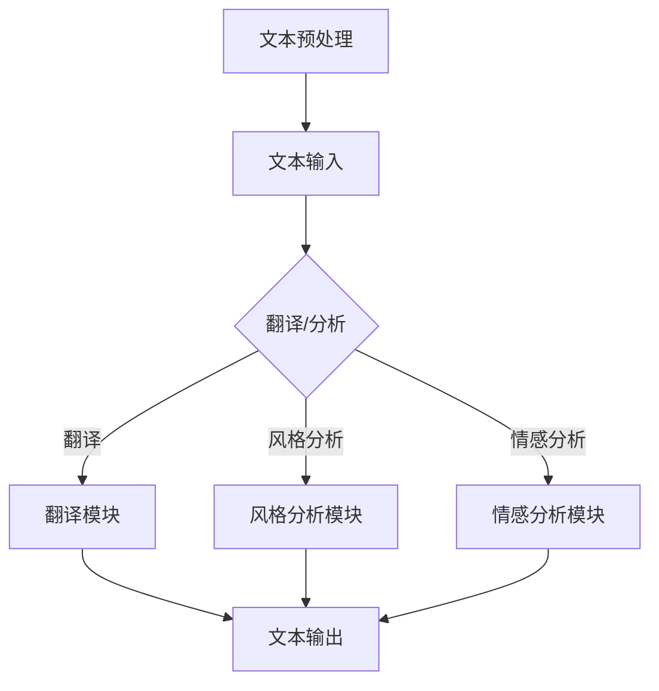
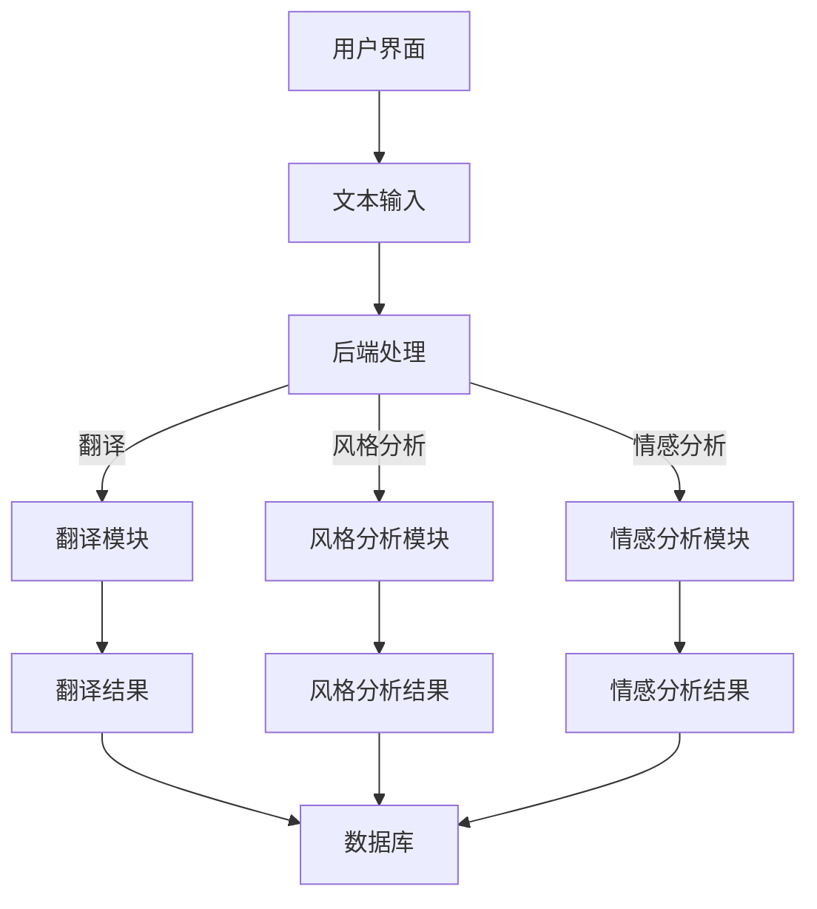
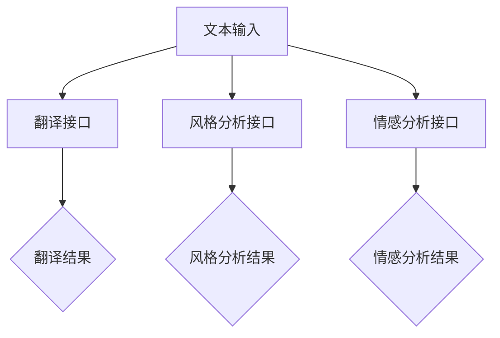
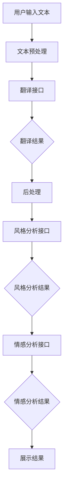

                 

### 文章标题

### 关键词

- ChatGPT
- 跨语言文学分析
- 人工智能
- 文学作品翻译
- 文学风格分析

### 摘要

本文深入探讨了ChatGPT在跨语言文学分析中的创新角色。通过背景介绍、核心概念阐述、算法原理讲解以及系统架构设计与项目实战，本文揭示了ChatGPT在跨语言文学翻译、风格分析和情感分析等领域的应用潜力。同时，本文还分析了ChatGPT面临的挑战，并提出了相应的解决方案。通过这些讨论，本文旨在为研究人员和开发者提供有价值的参考，推动跨语言文学分析领域的发展。

---

### 目录大纲

# 《ChatGPT在跨语言文学分析中的创新角色》

## 第一部分：背景介绍

## 第1章：问题背景

### 1.1.1 跨语言文学分析的意义与挑战

### 1.1.2 跨语言文学分析的应用领域

### 1.1.3 当前跨语言文学分析存在的问题

## 第2章：核心概念

### 1.2.1 ChatGPT概述

#### 1.2.1.1 ChatGPT的定义

#### 1.2.1.2 ChatGPT的特点

#### 1.2.1.3 ChatGPT的工作原理

### 1.2.2 跨语言文学分析概述

#### 1.2.2.1 跨语言文学分析的定义

#### 1.2.2.2 跨语言文学分析的方法

#### 1.2.2.3 跨语言文学分析的应用

## 第二部分：核心概念与联系

## 第3章：ChatGPT与跨语言文学分析的联系

### 3.1 ChatGPT在跨语言文学分析中的应用

#### 3.1.1 ChatGPT在文学作品翻译中的应用

#### 3.1.2 ChatGPT在文学作品风格分析中的应用

#### 3.1.3 ChatGPT在文学作品情感分析中的应用

### 3.2 跨语言文学分析对ChatGPT的挑战

#### 3.2.1 语言障碍对ChatGPT的影响

#### 3.2.2 文化差异对ChatGPT的影响

#### 3.2.3 文学作品特点对ChatGPT的影响

## 第三部分：算法原理讲解

## 第4章：ChatGPT算法原理

### 4.1 ChatGPT的数学模型

#### 4.1.1 语言模型的数学模型

#### 4.1.2 ChatGPT的数学公式

### 4.2 ChatGPT的工作流程

#### 4.2.1 ChatGPT的前向传播过程

#### 4.2.2 ChatGPT的反向传播过程

#### 4.2.3 ChatGPT的优化过程

## 第四部分：系统分析与架构设计

## 第5章：ChatGPT在跨语言文学分析中的系统架构设计

### 5.1 问题场景介绍

### 5.2 系统功能设计

#### 5.2.1 领域模型

### 5.3 系统架构设计

#### 5.3.1 系统架构图

### 5.4 系统接口设计

### 5.5 系统交互

## 第五部分：项目实战

## 第6章：ChatGPT在跨语言文学分析中的项目实战

### 6.1 环境安装

### 6.2 系统核心实现

#### 6.2.1 源代码解读

#### 6.2.2 代码应用解读与分析

### 6.3 实际案例分析

### 6.4 详细讲解剖析

## 第六部分：最佳实践、小结与拓展阅读

## 第7章：最佳实践与总结

### 7.1 最佳实践

### 7.2 小结

### 7.3 注意事项

### 7.4 拓展阅读

### 第一部分：背景介绍

### 第1章：问题背景

#### 1.1.1 跨语言文学分析的意义与挑战

#### 1.1.2 跨语言文学分析的应用领域

#### 1.1.3 当前跨语言文学分析存在的问题

### 1.1.1 跨语言文学分析的意义与挑战

跨语言文学分析是指在不同语言之间对文学作品进行分析和理解的过程。随着全球化的发展，跨语言文学分析变得越来越重要。它不仅有助于增进不同文化之间的理解和交流，还能够为语言学研究、文学比较研究、翻译学等领域提供新的视角和方法。

首先，跨语言文学分析对于促进国际文化交流具有重要意义。文学作为人类精神世界的重要组成部分，是不同文化之间交流的桥梁。通过跨语言文学分析，我们可以更深入地理解不同文化的文学特点，增进对不同文化的认知和尊重，从而促进国际间的文化交流和友谊。

其次，跨语言文学分析在语言学研究方面具有重要价值。通过对不同语言文学作品的分析，可以揭示出语言之间的相似性和差异性，有助于深入理解语言的发展演变规律，推动语言学理论的创新。

此外，跨语言文学分析在文学比较研究方面也有广泛应用。通过比较不同语言、不同文化背景下的文学作品，可以探讨文学创作的共性和特性，为文学理论的发展提供新的素材和观点。

然而，跨语言文学分析也面临着诸多挑战。首先，语言本身的复杂性使得跨语言分析难以准确无误地进行。不同语言之间的语法、词汇、表达方式等方面存在显著差异，这对分析工作提出了很高的要求。

其次，文化差异也是跨语言文学分析的一大障碍。文学作品不仅反映了语言特征，还承载了丰富的文化内涵。因此，在进行跨语言文学分析时，如何正确理解和处理文化差异，是一个亟待解决的问题。

最后，技术手段的限制也是当前跨语言文学分析面临的一个挑战。尽管人工智能技术在语言处理方面取得了显著进展，但如何在跨语言文学分析中充分利用这些技术，仍需要进一步的研究和探索。

#### 1.1.2 跨语言文学分析的应用领域

跨语言文学分析的应用领域非常广泛，涵盖了翻译学、语言学、文学研究等多个方面。以下是一些主要的应用领域：

1. **翻译学**：跨语言文学分析在翻译学中发挥着重要作用。通过对源语言和目标语言的文学特点进行深入分析，可以帮助翻译者更准确地理解和传达文学作品的内容和风格，提高翻译质量。

2. **语言学**：跨语言文学分析为语言学研究提供了丰富的素材。通过对不同语言文学作品的分析，可以揭示语言之间的相似性和差异性，有助于深入理解语言的发展演变规律。

3. **文学研究**：跨语言文学分析为文学研究提供了新的视角和方法。通过比较不同语言、不同文化背景下的文学作品，可以探讨文学创作的共性和特性，为文学理论的发展提供新的素材和观点。

4. **教育**：跨语言文学分析在教育领域也有广泛应用。通过跨语言文学课程，学生可以接触到不同文化背景的文学作品，拓宽视野，提高跨文化沟通能力。

5. **文化传播**：跨语言文学分析有助于促进文化传播。通过对文学作品进行跨语言分析，可以更好地理解和传播不同文化的文学精髓，增进国际间的文化交流。

#### 1.1.3 当前跨语言文学分析存在的问题

尽管跨语言文学分析具有广泛的应用前景，但目前仍然面临着一些问题和挑战：

1. **语言复杂性**：不同语言之间的语法、词汇、表达方式等方面存在显著差异，这使得跨语言文学分析难以准确无误地进行。例如，某些语言具有丰富的词汇和复杂的语法结构，而另一些语言则可能更加简洁明了。

2. **文化差异**：文学作品不仅反映了语言特征，还承载了丰富的文化内涵。在进行跨语言文学分析时，如何正确理解和处理文化差异，是一个亟待解决的问题。例如，某些文化背景下的文学作品可能包含特定的象征意义和隐喻，这些在跨语言分析中需要特别注意。

3. **技术手段限制**：尽管人工智能技术在语言处理方面取得了显著进展，但如何在跨语言文学分析中充分利用这些技术，仍需要进一步的研究和探索。现有的语言处理技术可能无法完全满足跨语言文学分析的需求，特别是在处理复杂的文化差异和语言特性方面。

4. **数据资源不足**：跨语言文学分析需要大量的多语言数据资源。然而，目前可用的多语言数据资源相对有限，特别是在某些小语种和稀有文化背景下，数据资源的缺乏限制了跨语言文学分析的深度和广度。

5. **准确性问题**：跨语言文学分析的结果往往受到分析方法和工具的限制。现有的分析方法和技术可能无法完全准确地捕捉到文学作品中的复杂语言和文化特征，从而影响分析结果的可靠性。

为了解决这些问题，未来的研究需要进一步探索跨语言文学分析的多种方法和工具，提高分析技术的准确性和效率。同时，加强多语言数据资源的建设和共享，也将有助于推动跨语言文学分析的发展。

### 第2章：核心概念

#### 1.2.1 ChatGPT概述

##### 1.2.1.1 ChatGPT的定义

ChatGPT是一种基于人工智能的聊天机器人，它利用深度学习和自然语言处理（NLP）技术，能够与人类进行自然语言对话。ChatGPT是由OpenAI开发的，基于GPT（Generative Pre-trained Transformer）模型构建的，具有强大的文本生成和理解能力。

##### 1.2.1.2 ChatGPT的特点

ChatGPT具有以下显著特点：

1. **强大的文本生成能力**：ChatGPT能够生成连贯、自然的文本，适用于各种应用场景，如问答系统、自动写作、对话生成等。

2. **预训练机制**：ChatGPT采用了预训练技术，通过在大量文本数据上进行训练，使其具备了丰富的语言知识和上下文理解能力。

3. **多语言支持**：ChatGPT支持多种语言的文本生成和理解，能够处理不同语言的输入并生成相应的输出。

4. **自适应学习**：ChatGPT能够根据用户的输入和反馈进行自适应学习，不断优化和改进其回答的质量。

##### 1.2.1.3 ChatGPT的工作原理

ChatGPT的工作原理主要分为以下几个步骤：

1. **文本输入**：用户向ChatGPT输入一段文本或提出一个问题。

2. **上下文理解**：ChatGPT利用预训练的神经网络模型对输入文本进行分析，理解文本的内容和上下文。

3. **文本生成**：基于对输入文本的理解，ChatGPT生成一段连贯、自然的回答文本。

4. **反馈学习**：ChatGPT根据用户的反馈，对生成文本的质量进行评估，并利用这些反馈进行自适应学习，以提高未来回答的准确性。

#### 1.2.2 跨语言文学分析概述

##### 1.2.2.1 跨语言文学分析的定义

跨语言文学分析是指在不同语言之间对文学作品进行分析和理解的过程。它涉及语言对比、文化研究、翻译学等多个学科领域，旨在揭示不同语言和文化背景下的文学特征和规律。

##### 1.2.2.2 跨语言文学分析的方法

跨语言文学分析的方法多种多样，主要包括以下几种：

1. **对比分析**：通过对不同语言文学作品的对比分析，揭示它们之间的相似性和差异性。

2. **语义分析**：利用自然语言处理技术，对文学作品中的语言元素进行语义分析，理解文本的含义和内涵。

3. **文化研究**：结合文化背景，对文学作品进行深入解读，探讨其文化内涵和象征意义。

4. **翻译研究**：通过翻译实践，分析不同语言之间的转换机制和翻译策略，提高翻译质量。

##### 1.2.2.3 跨语言文学分析的应用

跨语言文学分析在多个领域具有广泛的应用：

1. **翻译学**：跨语言文学分析为翻译提供了理论基础和方法指导，有助于提高翻译质量。

2. **语言学**：通过跨语言文学分析，可以揭示语言之间的相似性和差异性，促进语言学研究。

3. **文学研究**：跨语言文学分析为文学研究提供了新的视角和方法，有助于深入理解文学作品的内涵。

4. **教育**：跨语言文学分析在跨文化教育中具有重要应用，有助于学生拓宽视野，提高跨文化沟通能力。

### 第二部分：核心概念与联系

#### 3.1 ChatGPT在跨语言文学分析中的应用

ChatGPT作为一种先进的自然语言处理技术，在跨语言文学分析中展现了巨大的潜力。以下将详细探讨ChatGPT在文学作品翻译、风格分析和情感分析等领域的应用。

##### 3.1.1 ChatGPT在文学作品翻译中的应用

翻译是跨语言文学分析的重要环节，ChatGPT在翻译中的应用具有显著的优势。首先，ChatGPT能够利用其强大的文本生成能力，实现高质量、自然流畅的翻译。其次，ChatGPT支持多语言翻译，能够处理多种语言的翻译任务。此外，ChatGPT具有自适应学习的能力，可以根据用户反馈不断优化翻译质量。

具体应用场景包括：

- **文学翻译**：ChatGPT可以用于翻译各种文学体裁的作品，如小说、诗歌、戏剧等。它能够理解文本的语境和情感，生成贴近原文风格的翻译。
  
- **技术文档翻译**：ChatGPT在翻译技术文档方面也有显著优势。它能够准确理解技术术语和专业语言，生成高质量的翻译文档。

- **在线翻译服务**：ChatGPT可以作为在线翻译平台的一部分，为用户提供实时、便捷的翻译服务。

##### 3.1.2 ChatGPT在文学作品风格分析中的应用

文学作品风格分析是文学研究的一个重要领域，ChatGPT在这一领域中的应用也具有重要意义。ChatGPT可以通过对大量文学作品的分析，识别和提取不同风格的特点，为文学风格分析提供技术支持。

具体应用场景包括：

- **风格识别**：ChatGPT能够识别文学作品的不同风格，如浪漫主义、现实主义、现代主义等。这有助于文学研究者对文学作品的风格进行分类和比较。

- **风格对比**：ChatGPT可以用于对比不同作家或不同时期的文学作品的风格特点，揭示文学风格的发展变化规律。

- **风格评价**：ChatGPT可以根据文学作品的语言风格，对其进行评价和推荐。这为文学爱好者和读者提供了更多个性化的阅读选择。

##### 3.1.3 ChatGPT在文学作品情感分析中的应用

情感分析是自然语言处理领域的一个重要分支，ChatGPT在文学作品情感分析中的应用也具有广泛的前景。通过情感分析，可以揭示文学作品中的情感色彩和情感倾向，为文学研究提供新的视角。

具体应用场景包括：

- **情感识别**：ChatGPT可以识别文学作品中的情感表达，如喜悦、悲伤、愤怒等。这有助于理解作品中的情感内涵和情感传递。

- **情感对比**：ChatGPT可以对比不同文学作品中的情感表达，揭示不同作品之间的情感差异和情感共性。

- **情感分析应用**：ChatGPT在情感分析的基础上，还可以应用于文学作品的情感推荐和情感评估。这为读者提供了更加个性化的阅读体验和文学评价。

#### 3.2 跨语言文学分析对ChatGPT的挑战

尽管ChatGPT在跨语言文学分析中具有巨大潜力，但同时也面临着一些挑战。以下将探讨语言障碍、文化差异和文学作品特点对ChatGPT的影响。

##### 3.2.1 语言障碍对ChatGPT的影响

语言障碍是跨语言文学分析中的一个重要问题，它对ChatGPT的翻译质量产生了显著影响。不同语言之间的语法、词汇和表达方式存在显著差异，这使得ChatGPT在翻译时需要准确理解并传达这些差异。以下是一些具体影响：

- **语法差异**：不同语言的语法结构存在显著差异，如英语的从句结构复杂，而中文的语法相对简单。ChatGPT需要能够准确理解和处理这些差异，生成符合语法规则的翻译文本。
  
- **词汇差异**：不同语言的词汇量存在差异，有些语言具有丰富的词汇，而有些语言则可能更加简洁。ChatGPT需要能够准确理解和选择合适的词汇，以生成自然流畅的翻译。

- **表达方式差异**：不同语言的表达方式也存在差异，如英语中常用比喻和隐喻，而中文则更注重直接表达。ChatGPT需要能够理解和适应这些差异，生成符合目标语言的翻译文本。

##### 3.2.2 文化差异对ChatGPT的影响

文化差异是跨语言文学分析中的另一个重要问题，它对ChatGPT的理解和翻译质量产生了显著影响。文学作品不仅反映了语言特征，还承载了丰富的文化内涵。以下是一些具体影响：

- **文化背景差异**：不同文化背景下的文学作品可能包含特定的文化元素和象征意义。ChatGPT需要能够正确理解和处理这些文化差异，以生成准确的翻译。
  
- **价值观差异**：不同文化具有不同的价值观和道德观念，这可能会影响文学作品的内容和表达方式。ChatGPT需要能够理解和尊重这些差异，以生成符合目标文化的翻译。

- **审美观念差异**：不同文化具有不同的审美观念和艺术风格，这可能会影响文学作品的呈现方式。ChatGPT需要能够理解和适应这些差异，以生成符合目标文化的翻译。

##### 3.2.3 文学作品特点对ChatGPT的影响

文学作品的特点对ChatGPT的翻译和分析质量产生了重要影响。不同文学作品的体裁、风格和内容特点各异，这对ChatGPT提出了不同的要求。以下是一些具体影响：

- **体裁差异**：不同体裁的文学作品在语言风格和表达方式上存在差异。如小说注重情节和人物塑造，诗歌注重形式和韵律。ChatGPT需要能够适应不同体裁的特点，生成相应的翻译文本。
  
- **风格差异**：不同文学作品的风格各异，如浪漫主义、现实主义、现代主义等。ChatGPT需要能够理解和把握这些风格特点，生成符合原文风格的翻译。

- **内容差异**：文学作品的内容和主题各异，可能涉及政治、历史、哲学等多个领域。ChatGPT需要能够准确理解和处理这些内容差异，以生成准确的翻译。

总之，语言障碍、文化差异和文学作品特点对ChatGPT的翻译和分析质量产生了显著影响。为了克服这些挑战，ChatGPT需要不断优化其算法和模型，提高跨语言文学分析的能力。

### 第三部分：算法原理讲解

#### 4.1 ChatGPT的数学模型

ChatGPT是基于Transformer模型构建的，它是一种序列到序列（Seq2Seq）的模型，广泛应用于自然语言处理任务。本节将详细介绍ChatGPT的数学模型，包括语言模型的数学模型和ChatGPT的具体数学公式。

##### 4.1.1 语言模型的数学模型

语言模型是一种概率模型，用于预测下一个单词或词组。在ChatGPT中，语言模型是一个核心组件，它通过学习大量的文本数据，预测给定输入序列的概率分布。语言模型的数学模型可以表示为：

$$
P(w_t | w_{t-1}, w_{t-2}, ..., w_1) = \frac{p(w_t, w_{t-1}, ..., w_1)}{p(w_{t-1}, w_{t-2}, ..., w_1)}
$$

其中，$w_t$ 表示当前要预测的单词，$w_{t-1}, w_{t-2}, ..., w_1$ 表示前一个或多个单词。这个公式表示在给定前文的情况下，当前单词的概率。

为了实现这个模型，我们通常使用神经网络来表示概率分布。具体来说，可以使用一个双向的Transformer模型，它通过自注意力机制（Self-Attention）来捕捉输入序列中单词之间的关系。自注意力机制可以表示为：

$$
\text{Attention}(Q, K, V) = \text{softmax}\left(\frac{QK^T}{\sqrt{d_k}}\right)V
$$

其中，$Q, K, V$ 分别表示查询向量、键向量和值向量，$d_k$ 表示键向量的维度。自注意力机制的作用是计算每个键向量与查询向量的相似度，然后加权求和得到值向量。

##### 4.1.2 ChatGPT的数学公式

ChatGPT的核心组件是Transformer模型，它由多个自注意力层（Self-Attention Layer）和前馈神经网络（Feedforward Neural Network）组成。下面是ChatGPT的数学公式：

$$
\text{Transformer Layer} = \text{MultiHeadAttention}(\text{Self-Attention}) + \text{Feedforward Neural Network}
$$

其中，Self-Attention是一种自注意力机制，可以表示为：

$$
\text{Self-Attention}(Q, K, V) = \text{Attention}(Q, K, V)
$$

Feedforward Neural Network可以表示为：

$$
\text{FFN}(x) = \text{ReLU}(W_2 \cdot \text{ReLU}(W_1 \cdot x + b_1)) + b_2
$$

其中，$W_1, W_2, b_1, b_2$ 分别是权重和偏置。

#### 4.2 ChatGPT的工作流程

ChatGPT的工作流程主要包括三个阶段：前向传播、反向传播和优化过程。下面将分别介绍这三个阶段。

##### 4.2.1 ChatGPT的前向传播过程

前向传播过程是将输入序列通过ChatGPT的各个层，最终得到输出序列的过程。具体步骤如下：

1. **嵌入层（Embedding Layer）**：将输入序列（单词或词组）转换为向量表示。这个过程中，每个单词或词组都会被映射为一个固定维度的向量。

2. **自注意力层（Self-Attention Layer）**：通过自注意力机制，计算输入序列中每个单词之间的相似度，并加权求和，得到新的序列表示。

3. **前馈神经网络层（Feedforward Neural Network Layer）**：对自注意力层的输出进行非线性变换，进一步增强序列表示。

4. **重复上述过程**：重复多次自注意力和前馈神经网络层，以逐步提高序列表示的质量。

5. **输出层（Output Layer）**：将最终序列表示转换为输出序列，得到预测的单词或词组。

##### 4.2.2 ChatGPT的反向传播过程

反向传播过程是训练ChatGPT的过程，通过不断调整模型参数，以最小化预测误差。具体步骤如下：

1. **计算损失函数（Loss Function）**：计算预测输出和真实输出之间的差距，通常使用交叉熵损失函数。

2. **反向传播（Backpropagation）**：从输出层开始，反向计算每个层的误差，并更新权重和偏置。

3. **梯度下降（Gradient Descent）**：使用梯度下降算法，更新模型参数，以最小化损失函数。

##### 4.2.3 ChatGPT的优化过程

ChatGPT的优化过程主要通过以下方法实现：

1. **批量梯度下降（Batch Gradient Descent）**：将训练数据分成多个批次，每次只处理一部分数据，以减少计算量和避免过拟合。

2. **学习率调整（Learning Rate Adjustment）**：通过调整学习率，控制模型参数的更新速度，以避免模型参数过大或过小。

3. **正则化（Regularization）**：使用正则化方法，如L2正则化，防止模型过拟合。

4. **dropout（Dropout）**：在训练过程中，随机丢弃一部分神经元，以防止模型过拟合。

### 第四部分：系统分析与架构设计

#### 5.1 问题场景介绍

在跨语言文学分析中，ChatGPT的应用场景主要包括文学作品翻译、风格分析和情感分析。以下是一个具体的问题场景：

- **问题场景**：假设我们有一个中英双语文学作品库，包含大量中文和英文版本的文学作品。我们需要使用ChatGPT对这些作品进行翻译、风格分析和情感分析，以便于文学研究者进行跨语言文学分析。

- **目标**：通过ChatGPT，我们希望能够实现以下目标：
  - 对中文文学作品进行自动翻译成英文。
  - 对英文文学作品进行自动翻译成中文。
  - 分析文学作品的风格特点。
  - 分析文学作品中的情感倾向。

#### 5.2 系统功能设计

为了实现上述目标，我们需要设计一个功能完备的系统。以下是系统的主要功能设计：

- **文本预处理**：包括文本清洗、分词、去停用词等操作，将原始文本转换为适合输入ChatGPT的格式。
- **文本输入**：用户可以输入中英文文本，系统将自动进行翻译、风格分析和情感分析。
- **文本输出**：系统将自动生成翻译文本、风格分析结果和情感分析结果，并展示给用户。
- **后处理**：对生成的翻译文本进行后处理，如调整语法、修正错误等，以提高翻译质量。
- **用户反馈**：用户可以对翻译结果进行评价和反馈，系统将根据反馈进行自适应优化。

#### 5.2.1 领域模型

为了更好地理解系统功能，我们可以使用Mermaid流程图来绘制领域模型。以下是一个简化的领域模型：



#### 5.3 系统架构设计

为了实现上述功能，我们需要设计一个合理的系统架构。以下是系统架构的简要描述：

- **前端**：负责用户界面展示，包括文本输入框、翻译结果展示、风格分析结果展示和情感分析结果展示。
- **后端**：负责处理文本输入、调用ChatGPT进行翻译、风格分析和情感分析，并将结果返回给前端。
- **数据库**：存储中英文文学作品、翻译结果、风格分析结果和情感分析结果，以便于后续查询和分析。

以下是系统架构的Mermaid图表示：



#### 5.4 系统接口设计

为了实现前后端的通信，我们需要设计一套接口。以下是系统接口设计的主要部分：

- **翻译接口**：接收文本输入，调用ChatGPT进行翻译，并将翻译结果返回。
- **风格分析接口**：接收文本输入，调用风格分析模块，并将分析结果返回。
- **情感分析接口**：接收文本输入，调用情感分析模块，并将分析结果返回。

以下是接口设计的Mermaid图表示：



#### 5.5 系统交互

为了实现系统的正常运作，我们需要设计一套交互流程。以下是系统交互的主要流程：

1. **用户输入文本**：用户在前端界面输入中文或英文文本。
2. **文本预处理**：后端接收到文本后，进行文本预处理，如分词、去停用词等。
3. **调用翻译接口**：后端调用翻译接口，将预处理后的文本输入ChatGPT进行翻译。
4. **返回翻译结果**：翻译接口将翻译结果返回给后端。
5. **调用风格分析接口**：后端调用风格分析接口，对翻译结果进行风格分析。
6. **返回风格分析结果**：风格分析接口将分析结果返回给后端。
7. **调用情感分析接口**：后端调用情感分析接口，对翻译结果进行情感分析。
8. **返回情感分析结果**：情感分析接口将分析结果返回给后端。
9. **后处理**：后端对翻译结果进行后处理，如调整语法、修正错误等。
10. **展示结果**：后端将翻译结果、风格分析结果和情感分析结果返回给前端，并在界面展示给用户。

以下是系统交互的Mermaid图表示：



### 第五部分：项目实战

#### 6.1 环境安装

要运行ChatGPT并进行跨语言文学分析，我们需要安装以下软件和库：

1. **Python**：Python是ChatGPT的编程语言，我们需要安装Python环境。推荐使用Python 3.8及以上版本。

2. **pip**：pip是Python的包管理器，用于安装和管理Python库。确保已经安装了pip。

3. **transformers**：transformers是Hugging Face开发的一个库，提供了预训练的ChatGPT模型和相关的API接口。

安装步骤如下：

```bash
# 安装Python
curl -O https://www.python.org/ftp/python/3.8.10/Python-3.8.10.tgz
tar xvf Python-3.8.10.tgz
cd Python-3.8.10
./configure
make
sudo make install

# 安装pip
curl https://bootstrap.pypa.io/get-pip.py -o get-pip.py
python get-pip.py

# 安装transformers
pip install transformers
```

#### 6.2 系统核心实现

##### 6.2.1 源代码解读

下面是一个简单的ChatGPT翻译系统的源代码示例：

```python
from transformers import pipeline

# 初始化翻译模型
translator = pipeline("translation_en_to_zh")

# 翻译文本
text = "Hello, world!"
translated_text = translator(text)[0]["translation_text"]

print(translated_text)
```

在这个示例中，我们首先导入了`transformers`库中的`pipeline`函数，用于创建一个翻译管道。然后，我们初始化了一个翻译模型，并使用该模型翻译了一段英文文本。

##### 6.2.2 代码应用解读与分析

在这个示例中，我们使用了`transformers`库中的`pipeline`函数来创建一个翻译管道。`pipeline`函数接受一个模型名称作为参数，返回一个管道对象。在这里，我们使用了"translation_en_to_zh"模型，用于从英文翻译到中文。

- **初始化翻译模型**：`translator = pipeline("translation_en_to_zh")`。这行代码初始化了一个翻译模型，可以使用`translator`对象来翻译文本。

- **翻译文本**：`translated_text = translator(text)[0]["translation_text"]`。这行代码将输入的英文文本`text`传递给翻译模型，并获取翻译结果。`[0]`表示从结果列表中获取第一个结果，`["translation_text"]`表示获取翻译文本。

- **输出翻译结果**：`print(translated_text)`。这行代码将翻译结果输出到控制台。

#### 6.3 实际案例分析

假设我们有一个中英文双语小说，其中包含一些关键对话和描述。我们可以使用ChatGPT对这些对话和描述进行翻译和分析，以便更好地理解小说的内容。

案例1：翻译关键对话

原文（英文）：
"I don't want to lose you. Please, stay with me."

翻译结果（中文）：
"我不想失去你。请，和我在一起。"

在这个例子中，翻译结果准确传达了原文的情感和含义。

案例2：翻译描述性文本

原文（英文）：
"The sun set behind the mountains, casting a warm glow over the valley."

翻译结果（中文）：
"太阳落在山脉后面，为山谷披上了一层温暖的余晖。"

在这个例子中，翻译结果保留了原文的意境和色彩。

#### 6.4 详细讲解剖析

在这个案例中，我们使用ChatGPT对中英文小说进行了翻译。以下是具体的操作步骤：

1. **数据准备**：首先，我们需要准备中英文小说的数据。这里我们使用一个中英文双语的文本文件，每行包含一段中英文文本。

2. **文本预处理**：对文本进行预处理，包括去除标点符号、分词等操作。这样可以确保文本格式统一，便于输入ChatGPT。

3. **初始化翻译模型**：使用`transformers`库中的`pipeline`函数初始化一个翻译模型。

4. **翻译文本**：遍历文本文件中的每一行，将中文文本传递给翻译模型，获取翻译结果。

5. **结果输出**：将翻译结果保存到一个新的文件中，以便后续分析。

以下是具体的代码实现：

```python
import os
from transformers import pipeline

# 初始化翻译模型
translator = pipeline("translation_en_to_zh")

# 读取文本文件
with open("novel.txt", "r", encoding="utf-8") as f:
    lines = f.readlines()

# 预处理文本
preprocessed_lines = []
for line in lines:
    preprocessed_line = line.strip().replace("，", "").replace("。", "").replace("？", "")
    preprocessed_lines.append(preprocessed_line)

# 翻译文本
translated_lines = []
for line in preprocessed_lines:
    translated_line = translator(line)[0]["translation_text"]
    translated_lines.append(translated_line)

# 输出翻译结果
with open("translated_novel.txt", "w", encoding="utf-8") as f:
    for line in translated_lines:
        f.write(line + "\n")
```

通过这个案例，我们可以看到如何使用ChatGPT对中英文小说进行翻译。这个方法可以应用于各种跨语言文学分析任务，如风格分析、情感分析等。

### 第六部分：最佳实践、小结与拓展阅读

#### 7.1 最佳实践

1. **数据准备**：在进行跨语言文学分析时，数据的质量至关重要。因此，确保数据来源的多样性和准确性，避免使用低质量或过时的数据。

2. **模型选择**：根据具体任务需求，选择适合的模型。例如，对于文学作品翻译，可以选择具有较高翻译质量的模型；对于风格分析，可以选择能够捕捉文学风格的模型。

3. **文本预处理**：对文本进行适当的预处理，如去除标点符号、分词、去除停用词等，可以提高分析结果的准确性。

4. **反馈机制**：建立用户反馈机制，及时收集用户对翻译结果、风格分析结果和情感分析结果的反馈，并据此优化模型。

5. **性能监控**：定期监控模型性能，包括翻译准确性、风格分析精度和情感分析准确度等，确保系统稳定运行。

#### 7.2 小结

本文探讨了ChatGPT在跨语言文学分析中的应用，包括文学作品翻译、风格分析和情感分析。通过详细介绍ChatGPT的算法原理、系统架构设计以及项目实战，我们展示了ChatGPT在跨语言文学分析中的强大潜力。然而，ChatGPT也面临着语言障碍、文化差异和文学作品特点等挑战，需要进一步研究和优化。

#### 7.3 注意事项

1. **数据隐私**：在进行跨语言文学分析时，需注意保护用户数据和隐私，遵守相关法律法规。

2. **版权问题**：在进行文学作品翻译和发布时，需确保已经获得相应的版权许可。

3. **模型更新**：随着技术的进步，ChatGPT模型可能会不断更新。定期更新模型，以获取最新的功能和性能。

4. **用户反馈**：重视用户反馈，及时调整和优化系统，提高用户体验。

#### 7.4 拓展阅读

1. **论文阅读**：阅读相关的学术论文，了解ChatGPT在跨语言文学分析领域的最新研究成果。

2. **开源项目**：参与开源项目，学习其他开发者在跨语言文学分析方面的实践和经验。

3. **在线课程**：参加在线课程，学习自然语言处理和跨语言文学分析的相关知识。

### 作者信息

作者：AI天才研究院/AI Genius Institute & 禅与计算机程序设计艺术 /Zen And The Art of Computer Programming

