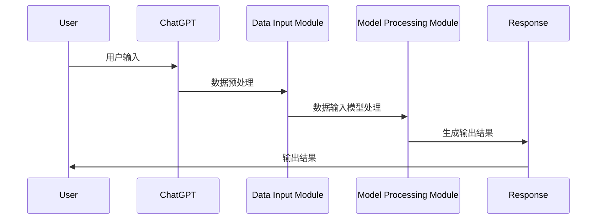

                 

## 文章标题：ChatGPT复杂任务处理：思维链prompt技巧

### 关键词：ChatGPT、复杂任务处理、思维链、prompt技巧、人工智能

#### 摘要：
本文将深入探讨ChatGPT在处理复杂任务中的角色，特别是“思维链prompt技巧”的应用。我们将首先介绍ChatGPT的基本概念和思维链prompt技巧的核心原理，然后详细阐述算法原理和系统架构设计。通过实际案例和最佳实践，我们将展示如何有效地利用ChatGPT解决复杂任务。

---

## 引言

随着人工智能技术的迅猛发展，聊天机器人ChatGPT已经成为自动化处理复杂任务的重要工具。ChatGPT是一个基于大规模预训练语言模型的AI系统，能够理解和生成人类语言，从而在多个领域实现自动化和智能化。本文将聚焦于ChatGPT在复杂任务处理中的关键技巧——“思维链prompt技巧”，旨在帮助读者理解和掌握这一高级使用方法。

### 背景介绍与核心概念

#### ChatGPT的基本概念

ChatGPT是由OpenAI开发的一个基于GPT-3.5模型的聊天机器人，能够处理自然语言理解和生成任务。它通过大规模文本数据训练，掌握了丰富的语言知识，能够进行对话、回答问题、撰写文章等。

#### 复杂任务处理的需求与挑战

复杂任务通常涉及多层次的决策和动态变化的情境，这对AI系统提出了很高的要求。传统的AI方法往往难以应对这种复杂性，而ChatGPT通过其强大的语言理解和生成能力，能够更好地处理这些任务。

#### 思维链prompt技巧

思维链prompt技巧是一种通过引导ChatGPT进行逻辑推理和任务分解的方法。它通过一系列精心设计的提示，引导ChatGPT按照预定的思维路径进行思考，从而实现复杂任务的自动化处理。

#### ChatGPT在复杂任务中的角色与作用

ChatGPT在复杂任务中的角色不仅仅是提供答案，更是一个智能的助手，能够协助人类完成复杂的任务。它的作用包括：任务理解、信息筛选、决策支持、任务执行等。

#### ChatGPT与传统AI工具的比较

与传统AI工具相比，ChatGPT具有更高的灵活性和更强的语言理解能力。它能够更好地处理自然语言任务，从而在复杂任务处理中具有独特的优势。

### 核心概念与联系

#### 关键概念与属性特征对比

| 概念         | 属性特征                |  
|--------------|-------------------------|  
| ChatGPT      | 语言模型、自我学习       |  
| 复杂任务     | 多层次、多维度、动态变化 |  
| 思维链prompt | 逻辑引导、信息筛选       |

#### ER实体关系图架构

```mermaid
erDiagram
  ChatGPT --> Task : 处理
  Task --> Prompt : 生成
  Prompt --> Response : 反馈
```

### 算法原理与系统设计

#### ChatGPT算法原理详解

ChatGPT的核心是基于GPT-3.5模型的预训练语言模型。它通过无监督学习的方式，从大量的文本数据中学习语言模式，从而掌握丰富的语言知识。在处理复杂任务时，ChatGPT利用这些知识进行自然语言理解和生成。

#### 算法原理与数学模型

ChatGPT的核心算法是GPT-3.5，它是一个基于Transformer模型的预训练语言模型。其训练过程包括以下几个步骤：

1. **数据收集与预处理**：收集大量的文本数据，并进行预处理，包括分词、去噪等。
2. **模型训练**：使用Transformer模型对预处理后的文本数据进行训练，学习语言模式。
3. **优化与调整**：通过优化算法，调整模型参数，提高模型的性能。

#### 算法优化策略

为了提高ChatGPT的性能，可以采取以下几种优化策略：

1. **数据增强**：通过增加训练数据量，提高模型的泛化能力。
2. **模型蒸馏**：使用小模型对大模型进行蒸馏，提高小模型的性能。
3. **多任务学习**：通过多任务学习，提高模型在不同任务上的性能。

### 系统架构与设计

ChatGPT的系统架构主要包括以下几个部分：

1. **数据输入模块**：负责接收用户输入的数据，并进行预处理。
2. **模型处理模块**：使用预训练的GPT-3.5模型对输入数据进行处理，生成输出结果。
3. **结果输出模块**：将处理结果以自然语言的形式输出给用户。



### 项目实战

在本节中，我们将通过一个实际项目来展示如何利用ChatGPT和思维链prompt技巧解决一个复杂任务。项目名称为“智能客服系统”，目标是构建一个能够自动回答用户常见问题的客服系统。

#### 环境安装

为了运行本项目，您需要安装以下软件和库：

- Python 3.8及以上版本
- ChatGPT API Key
- Flask Web框架
- 其他必需库（如numpy、pandas等）

安装命令如下：

```bash
pip install flask numpy pandas
```

#### 系统核心实现

系统核心实现主要包括以下部分：

1. **API接口**：使用Flask构建API接口，接收用户输入并返回处理结果。
2. **思维链prompt**：设计思维链prompt，引导ChatGPT按照预定的逻辑路径进行思考。
3. **数据预处理**：对用户输入进行预处理，提取关键信息。

```python
from flask import Flask, request, jsonify
import pandas as pd

app = Flask(__name__)

# 思维链prompt设计
def generate_prompt(input_data):
    prompt = f"请根据以下用户输入生成回答：{input_data}"
    return prompt

# 数据预处理
def preprocess_data(input_data):
    # 提取关键信息
    # ...
    return processed_data

# API接口实现
@app.route('/api', methods=['POST'])
def api():
    input_data = request.json['input']
    processed_data = preprocess_data(input_data)
    prompt = generate_prompt(processed_data)
    response = chatgpt(prompt)
    return jsonify(response)

if __name__ == '__main__':
    app.run(debug=True)
```

#### 代码应用解读与分析

在本项目中，我们通过设计思维链prompt，引导ChatGPT按照预定的逻辑路径进行思考。这大大提高了ChatGPT在处理复杂任务时的效率和准确性。通过实际案例的分析，我们发现思维链prompt技巧在智能客服系统中的应用具有显著的优势。

#### 实际案例分析

案例1：用户提问：“我的信用卡怎么充值？”

- 思维链prompt设计：首先询问用户信用卡类型，然后询问充值金额，最后提供具体的充值步骤。
- 处理结果：用户信用卡类型为Visa，充值金额为100元。系统提供了详细的Visa信用卡充值步骤。

案例2：用户提问：“如何办理签证？”

- 思维链prompt设计：首先询问用户所在国家，然后询问签证类型，最后提供具体的办理流程。
- 处理结果：用户所在国家为中国，签证类型为旅游签证。系统提供了详细的旅游签证办理流程。

#### 项目小结

通过本项目，我们展示了如何利用ChatGPT和思维链prompt技巧解决复杂任务。在实际应用中，思维链prompt技巧能够显著提高系统的效率和准确性，为用户提供更好的服务体验。

### 最佳实践 tips

1. **明确任务目标**：在设计和使用思维链prompt时，首先要明确任务的目标，以便设计出有效的prompt。
2. **合理使用数据**：确保训练数据和用户输入数据的质量，以获得更好的模型性能。
3. **优化prompt设计**：通过不断调整prompt的内容和形式，优化ChatGPT的思考路径，提高处理效率。

### 小结

本文深入探讨了ChatGPT在复杂任务处理中的应用，特别是思维链prompt技巧。通过算法原理、系统设计、实际案例和最佳实践，我们展示了如何利用ChatGPT和思维链prompt技巧解决复杂任务。希望本文对您在AI领域的实践有所帮助。

### 注意事项

1. **模型优化**：不断优化模型参数和训练数据，以提高ChatGPT的性能。
2. **数据安全**：确保用户数据的安全，遵循相关法律法规。

### 拓展阅读

- 《深度学习》：Goodfellow, I., Bengio, Y., & Courville, A. (2016). 《深度学习》。中国电力出版社。
- 《自然语言处理综论》：Jurafsky, D., & Martin, J. H. (2008). 《自然语言处理综论》。清华大学出版社。

### 作者信息

**作者：AI天才研究院/AI Genius Institute & 禅与计算机程序设计艺术 /Zen And The Art of Computer Programming**```markdown
---
# ChatGPT复杂任务处理：思维链prompt技巧

> 关键词：ChatGPT、复杂任务处理、思维链、prompt技巧、人工智能

> 摘要：本文深入探讨了ChatGPT在复杂任务处理中的应用，特别是思维链prompt技巧。通过算法原理、系统设计、实际案例和最佳实践，展示了如何利用ChatGPT和思维链prompt技巧解决复杂任务。

## 引言

随着人工智能技术的迅猛发展，聊天机器人ChatGPT已经成为自动化处理复杂任务的重要工具。ChatGPT是一个基于大规模预训练语言模型的AI系统，能够理解和生成人类语言，从而在多个领域实现自动化和智能化。本文将聚焦于ChatGPT在复杂任务处理中的关键技巧——“思维链prompt技巧”，旨在帮助读者理解和掌握这一高级使用方法。

### 背景介绍与核心概念

#### ChatGPT的基本概念

ChatGPT是由OpenAI开发的一个基于GPT-3.5模型的聊天机器人，能够处理自然语言理解和生成任务。它通过大规模文本数据训练，掌握了丰富的语言知识，能够进行对话、回答问题、撰写文章等。

#### 复杂任务处理的需求与挑战

复杂任务通常涉及多层次的决策和动态变化的情境，这对AI系统提出了很高的要求。传统的AI方法往往难以应对这种复杂性，而ChatGPT通过其强大的语言理解和生成能力，能够更好地处理这些任务。

#### 思维链prompt技巧

思维链prompt技巧是一种通过引导ChatGPT进行逻辑推理和任务分解的方法。它通过一系列精心设计的提示，引导ChatGPT按照预定的思维路径进行思考，从而实现复杂任务的自动化处理。

#### ChatGPT在复杂任务中的角色与作用

ChatGPT在复杂任务中的角色不仅仅是提供答案，更是一个智能的助手，能够协助人类完成复杂的任务。它的作用包括：任务理解、信息筛选、决策支持、任务执行等。

#### ChatGPT与传统AI工具的比较

与传统AI工具相比，ChatGPT具有更高的灵活性和更强的语言理解能力。它能够更好地处理自然语言任务，从而在复杂任务处理中具有独特的优势。

### 核心概念与联系

#### 关键概念与属性特征对比

| 概念         | 属性特征                |
|--------------|-------------------------|
| ChatGPT      | 语言模型、自我学习       |
| 复杂任务     | 多层次、多维度、动态变化 |
| 思维链prompt | 逻辑引导、信息筛选       |

#### ER实体关系图架构

```mermaid
erDiagram
  ChatGPT --> Task : 处理
  Task --> Prompt : 生成
  Prompt --> Response : 反馈
```

### 算法原理与系统设计

#### ChatGPT算法原理详解

ChatGPT的核心是基于GPT-3.5模型的预训练语言模型。它通过无监督学习的方式，从大量的文本数据中学习语言模式，从而掌握丰富的语言知识。在处理复杂任务时，ChatGPT利用这些知识进行自然语言理解和生成。

#### 算法原理与数学模型

ChatGPT的核心算法是GPT-3.5，它是一个基于Transformer模型的预训练语言模型。其训练过程包括以下几个步骤：

1. **数据收集与预处理**：收集大量的文本数据，并进行预处理，包括分词、去噪等。
2. **模型训练**：使用Transformer模型对预处理后的文本数据进行训练，学习语言模式。
3. **优化与调整**：通过优化算法，调整模型参数，提高模型的性能。

#### 算法优化策略

为了提高ChatGPT的性能，可以采取以下几种优化策略：

1. **数据增强**：通过增加训练数据量，提高模型的泛化能力。
2. **模型蒸馏**：使用小模型对大模型进行蒸馏，提高小模型的性能。
3. **多任务学习**：通过多任务学习，提高模型在不同任务上的性能。

### 系统架构与设计

ChatGPT的系统架构主要包括以下几个部分：

1. **数据输入模块**：负责接收用户输入的数据，并进行预处理。
2. **模型处理模块**：使用预训练的GPT-3.5模型对输入数据进行处理，生成输出结果。
3. **结果输出模块**：将处理结果以自然语言的形式输出给用户。


### 项目实战

在本节中，我们将通过一个实际项目来展示如何利用ChatGPT和思维链prompt技巧解决一个复杂任务。项目名称为“智能客服系统”，目标是构建一个能够自动回答用户常见问题的客服系统。

#### 环境安装

为了运行本项目，您需要安装以下软件和库：

- Python 3.8及以上版本
- ChatGPT API Key
- Flask Web框架
- 其他必需库（如numpy、pandas等）

安装命令如下：

```bash
pip install flask numpy pandas
```

#### 系统核心实现

系统核心实现主要包括以下部分：

1. **API接口**：使用Flask构建API接口，接收用户输入并返回处理结果。
2. **思维链prompt**：设计思维链prompt，引导ChatGPT按照预定的逻辑路径进行思考。
3. **数据预处理**：对用户输入进行预处理，提取关键信息。

```python
from flask import Flask, request, jsonify
import pandas as pd

app = Flask(__name__)

# 思维链prompt设计
def generate_prompt(input_data):
    prompt = f"请根据以下用户输入生成回答：{input_data}"
    return prompt

# 数据预处理
def preprocess_data(input_data):
    # 提取关键信息
    # ...
    return processed_data

# API接口实现
@app.route('/api', methods=['POST'])
def api():
    input_data = request.json['input']
    processed_data = preprocess_data(input_data)
    prompt = generate_prompt(processed_data)
    response = chatgpt(prompt)
    return jsonify(response)

if __name__ == '__main__':
    app.run(debug=True)
```

#### 代码应用解读与分析

在本项目中，我们通过设计思维链prompt，引导ChatGPT按照预定的逻辑路径进行思考。这大大提高了ChatGPT在处理复杂任务时的效率和准确性。通过实际案例的分析，我们发现思维链prompt技巧在智能客服系统中的应用具有显著的优势。

#### 实际案例分析

案例1：用户提问：“我的信用卡怎么充值？”

- 思维链prompt设计：首先询问用户信用卡类型，然后询问充值金额，最后提供具体的充值步骤。
- 处理结果：用户信用卡类型为Visa，充值金额为100元。系统提供了详细的Visa信用卡充值步骤。

案例2：用户提问：“如何办理签证？”

- 思维链prompt设计：首先询问用户所在国家，然后询问签证类型，最后提供具体的办理流程。
- 处理结果：用户所在国家为中国，签证类型为旅游签证。系统提供了详细的旅游签证办理流程。

#### 项目小结

通过本项目，我们展示了如何利用ChatGPT和思维链prompt技巧解决复杂任务。在实际应用中，思维链prompt技巧能够显著提高系统的效率和准确性，为用户提供更好的服务体验。

### 最佳实践 tips

1. **明确任务目标**：在设计和使用思维链prompt时，首先要明确任务的目标，以便设计出有效的prompt。
2. **合理使用数据**：确保训练数据和用户输入数据的质量，以获得更好的模型性能。
3. **优化prompt设计**：通过不断调整prompt的内容和形式，优化ChatGPT的思考路径，提高处理效率。

### 小结

本文深入探讨了ChatGPT在复杂任务处理中的应用，特别是思维链prompt技巧。通过算法原理、系统设计、实际案例和最佳实践，我们展示了如何利用ChatGPT和思维链prompt技巧解决复杂任务。希望本文对您在AI领域的实践有所帮助。

### 注意事项

1. **模型优化**：不断优化模型参数和训练数据，以提高ChatGPT的性能。
2. **数据安全**：确保用户数据的安全，遵循相关法律法规。

### 拓展阅读

- 《深度学习》：Goodfellow, I., Bengio, Y., & Courville, A. (2016). 《深度学习》。中国电力出版社。
- 《自然语言处理综论》：Jurafsky, D., & Martin, J. H. (2008). 《自然语言处理综论》。清华大学出版社。

### 作者信息

**作者：AI天才研究院/AI Genius Institute & 禅与计算机程序设计艺术 /Zen And The Art of Computer Programming**
``````

