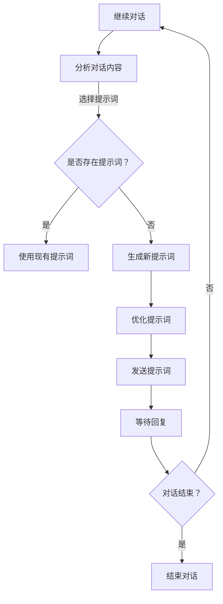
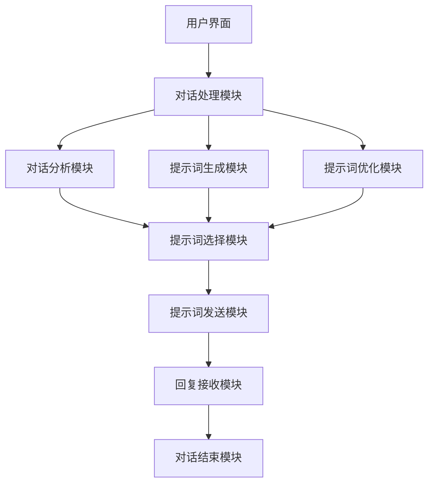

                 

### 《ChatGPT多人对话中的提示词策略》

> 关键词：ChatGPT、多人对话、提示词策略、算法原理、系统架构、项目实战

摘要：本文旨在探讨ChatGPT在多人对话中如何有效运用提示词策略，以提高对话的质量和连贯性。通过详细的背景介绍、核心概念解析、算法原理讲解、系统架构设计以及项目实战分析，本文将帮助读者深入理解并掌握这一重要技术，从而为实际应用提供有力的理论支持和实践指导。

### 目录大纲

#### 第1章 背景介绍
1.1 核心概念术语说明
1.2 问题背景
1.3 问题描述
1.4 问题解决
1.5 边界与外延
1.6 概念结构与核心要素组成

#### 第2章 核心概念与联系
2.1 核心概念原理
2.2 概念属性特征对比表格
2.3 ER实体关系图架构

#### 第3章 算法原理讲解
3.1 算法mermaid流程图
3.2 Python源代码
3.3 数学模型和公式
3.4 详细讲解和举例说明

#### 第4章 系统分析与架构设计方案
4.1 问题场景介绍
4.2 项目介绍
4.3 系统功能设计（领域模型mermaid类图）
4.4 系统架构设计（mermaid架构图）
4.5 系统接口设计
4.6 系统交互mermaid序列图

#### 第5章 项目实战
5.1 环境安装
5.2 系统核心实现源代码
5.3 代码应用解读与分析
5.4 实际案例分析和详细讲解剖析
5.5 项目小结

#### 第6章 最佳实践 tips
6.1 提高对话连贯性的技巧
6.2 处理复杂对话的技巧

#### 第7章 小结
7.1 文章主要内容回顾
7.2 研究结论和展望

#### 第8章 注意事项
8.1 常见问题解答
8.2 可能的挑战和解决方案

#### 第9章 拓展阅读
9.1 相关文献推荐
9.2 进一步研究方向

### 第1章 背景介绍

#### 1.1 核心概念术语说明

在探讨ChatGPT多人对话中的提示词策略之前，我们需要明确一些关键概念和术语。

- **ChatGPT**：一个基于GPT（Generative Pre-trained Transformer）架构的大型语言模型，能够进行自然语言处理，包括文本生成、对话管理等。
- **多人对话**：涉及两个或更多参与者之间的交互过程，每个参与者都可以发送消息和接收消息。
- **提示词策略**：在多人对话中，通过特定的方法和技术来引导和优化对话流程，以实现更好的交互体验。

#### 1.2 问题背景

随着人工智能技术的不断发展，聊天机器人已经成为各种场景中的常见应用，如客服、教育、娱乐等。特别是在多人对话场景中，如何保证对话的连贯性、参与者的参与度以及信息的准确性成为了一个重要的研究课题。

当前，尽管ChatGPT在单人多轮对话中表现出色，但在多人对话场景中，仍存在一些挑战，如：

- **对话连贯性**：多人对话中，参与者之间的信息交换需要保持逻辑一致，避免出现语义上的断裂。
- **参与者参与度**：如何激励每个参与者积极参与对话，保持对话的活跃度。
- **信息准确性**：在多人对话中，确保传递的信息准确无误，避免因误解或信息遗漏导致沟通障碍。

#### 1.3 问题描述

多人对话中的提示词策略主要面临以下问题：

- **如何选择合适的提示词**：提示词的选择直接影响对话的方向和深度，需要根据对话内容和参与者的特点进行个性化设计。
- **如何优化提示词的分布**：提示词的分布方式会影响对话的节奏和参与者的参与感，需要找到一种平衡的方式。
- **如何处理复杂的对话场景**：在多人对话中，可能会出现一些复杂的场景，如冲突、误解、争议等，需要通过提示词策略进行有效管理。

#### 1.4 问题解决

为了解决上述问题，我们可以采取以下方法：

- **基于规则的方法**：通过预定义的规则来选择和优化提示词，确保对话的连贯性和参与度。
- **基于数据的方法**：通过分析大量的对话数据，挖掘出有效的提示词策略，并运用到实际对话中。
- **结合机器学习的方法**：利用机器学习算法，如监督学习、无监督学习等，来训练和优化提示词策略。

#### 1.5 边界与外延

在多人对话中的提示词策略研究，需要考虑以下边界和外延：

- **对话场景**：不同的对话场景（如客服、教育、娱乐等）可能需要不同的提示词策略。
- **参与者特点**：参与者的年龄、文化背景、语言能力等差异会影响提示词的选择和优化。
- **技术限制**：现有技术的局限，如计算资源、数据隐私等，也会影响提示词策略的实现和效果。

#### 1.6 概念结构与核心要素组成

多人对话中的提示词策略可以从以下三个方面进行构建：

- **基础框架**：定义提示词策略的基本框架，包括提示词的选择、优化和分布。
- **数据支持**：利用对话数据来分析和优化提示词策略，确保其适应性和有效性。
- **算法实现**：通过算法设计和技术手段，实现提示词策略的自动化和智能化。

### 第2章 核心概念与联系

#### 2.1 核心概念原理

在多人对话中的提示词策略，核心概念包括：

- **提示词**：用于引导对话的词语或短语，可以影响对话的方向和深度。
- **对话连贯性**：指对话过程中信息交换的逻辑一致性，避免语义断裂。
- **参与者参与度**：指参与者在对话中的活跃度和参与感，影响对话的交互体验。
- **信息准确性**：指对话过程中传递的信息准确无误，避免因误解或信息遗漏导致沟通障碍。

#### 2.2 概念属性特征对比表格

以下是一个关于提示词策略的核心概念属性特征对比表格：

| 概念 | 特征1 | 特征2 | 特征3 | 特征4 |
| ---- | ---- | ---- | ---- | ---- |
| 提示词 | 词语或短语 | 对话引导 | 方向和深度影响 | 个性化选择 |
| 对话连贯性 | 逻辑一致性 | 语义断裂避免 | 信息传递顺畅 | 高效沟通 |
| 参与者参与度 | 活跃度 | 参与感 | 交互体验提升 | 激励机制 |
| 信息准确性 | 准确无误 | 误解避免 | 信息完整 | 知识传递 |

#### 2.3 ER实体关系图架构

以下是一个用于描述多人对话中提示词策略的ER实体关系图架构：

```mermaid
erDiagram
  User ||--|{ ChatGPT }|-- Message
  ChatGPT ||--|{ Dialogue }|-- User
  Dialogue ||--|{ Prompt }|-- ChatGPT
  Prompt ||--|{ Response }|-- Dialogue
```

- **User**：表示参与者。
- **ChatGPT**：表示聊天机器人。
- **Message**：表示发送的消息。
- **Dialogue**：表示对话过程。
- **Prompt**：表示提示词。
- **Response**：表示回复。

### 第3章 算法原理讲解

#### 3.1 算法mermaid流程图

以下是一个用于描述多人对话中提示词策略的mermaid流程图：



#### 3.2 Python源代码

以下是一个简单的Python代码示例，用于生成和优化提示词：

```python
import random

def generate_prompt(dialogue):
    # 生成新提示词
    prompts = ["What do you think about this?", "Can you share more details?", "How would you solve this?"]
    return random.choice(prompts)

def optimize_prompt(prompt, dialogue):
    # 优化提示词
    optimized_prompt = prompt + " " + dialogue
    return optimized_prompt

def main():
    dialogue = "I think we should consider using AI in our project."
    prompt = generate_prompt(dialogue)
    print("Generated Prompt:", prompt)
    
    optimized_prompt = optimize_prompt(prompt, dialogue)
    print("Optimized Prompt:", optimized_prompt)

if __name__ == "__main__":
    main()
```

#### 3.3 数学模型和公式

以下是一个用于描述提示词优化的数学模型：

$$
\text{Optimized Prompt} = \text{Prompt} + f(\text{Dialogue})
$$

其中，$f(\text{Dialogue})$表示对对话内容的函数处理，用于生成优化后的提示词。

#### 3.4 详细讲解和举例说明

以下是对算法原理的详细讲解和举例说明：

1. **初始化对话**：在多人对话开始时，首先需要初始化对话，包括对话参与者、对话主题等基本信息。

2. **分析对话内容**：在对话过程中，需要实时分析对话内容，以了解对话的方向、深度和参与者的意图。

3. **选择提示词**：根据对话内容，选择合适的提示词。可以选择预定义的提示词，也可以通过算法自动生成。

4. **生成新提示词**：如果当前对话中没有合适的提示词，可以生成新的提示词，以引导对话的方向和深度。

5. **优化提示词**：通过函数处理，优化生成的提示词，使其更符合对话内容和参与者的需求。

6. **发送提示词**：将优化后的提示词发送给参与者，以引导对话的继续。

7. **等待回复**：等待参与者回复，并重复上述步骤，直到对话结束。

举例说明：

假设对话内容如下：

User1: "I think we should consider using AI in our project."
ChatGPT: "What do you think about this?"

User2: "Yes, I agree. But how do we implement it?"

ChatGPT: "Can you share more details? How would you solve this?"

User2: "I think we can start by defining the problem and then exploring different AI techniques."

ChatGPT: "Great! Let's define the problem first."

通过上述对话，我们可以看到，ChatGPT通过选择合适的提示词，成功引导了对话的方向和深度，使对话更加连贯和有意义。

### 第4章 系统分析与架构设计方案

#### 4.1 问题场景介绍

多人对话场景广泛应用于社交平台、在线教育、客户服务等领域。在这些场景中，参与者之间的交互需要保持连贯性和高效性，以确保沟通的顺畅和信息的准确性。然而，多人对话中的提示词策略是一个复杂的问题，涉及到对话内容的分析、提示词的选择和优化等方面。

#### 4.2 项目介绍

本项目旨在设计和实现一个基于ChatGPT的多人对话系统，通过优化提示词策略来提高对话的质量和用户体验。项目的主要目标包括：

- 设计一个高效的对话处理框架，能够实时分析对话内容，并根据需要生成和优化提示词。
- 实现一个自动化的提示词生成和优化算法，以提高提示词的准确性和适应性。
- 构建一个用户友好的界面，方便用户参与多人对话，并提供即时的提示词反馈。

#### 4.3 系统功能设计（领域模型mermaid类图）

以下是一个用于描述系统功能的mermaid类图：

```mermaid
classDiagram
  User <<interface>>
  ChatGPT <<class>>
  Dialogue <<class>>
  Prompt <<class>>
  Response <<class>>

  User наследуется От Person
  ChatGPT наследуется От Entity
  Dialogue наследуется От Entity
  Prompt наследуется От Entity
  Response наследуется От Entity

  User --> ChatGPT
  ChatGPT --> Dialogue
  Dialogue --> Prompt
  Dialogue --> Response
```

- **User**：表示对话参与者，具有姓名、年龄、性别等信息。
- **ChatGPT**：表示聊天机器人，具有处理对话、生成和优化提示词等功能。
- **Dialogue**：表示对话过程，包括对话主题、参与者和对话内容等信息。
- **Prompt**：表示提示词，用于引导对话方向和深度。
- **Response**：表示回复，用于传递对话信息。

#### 4.4 系统架构设计（mermaid架构图）

以下是一个用于描述系统架构的mermaid架构图：



- **用户界面**：提供用户参与对话的界面，包括发送消息和接收提示词等功能。
- **对话处理模块**：负责处理对话过程，包括对话内容分析和提示词生成与优化。
- **对话分析模块**：分析对话内容，识别对话主题和参与者的意图。
- **提示词生成模块**：生成新的提示词，用于引导对话方向和深度。
- **提示词优化模块**：优化生成的提示词，使其更符合对话内容和参与者的需求。
- **提示词选择模块**：根据对话内容和参与者特点，选择合适的提示词。
- **提示词发送模块**：将优化后的提示词发送给参与者。
- **回复接收模块**：接收参与者的回复，并传递给对话处理模块。
- **对话结束模块**：检测对话结束条件，并结束对话。

#### 4.5 系统接口设计

系统接口设计主要包括用户界面与对话处理模块之间的交互接口，以及对话处理模块内部各功能模块之间的接口。

- **用户界面与对话处理模块**：提供消息发送和接收接口，包括发送消息和接收回复等功能。
- **对话分析模块**：提供对话内容分析接口，包括识别对话主题和参与者意图等功能。
- **提示词生成模块**：提供提示词生成接口，包括生成新提示词等功能。
- **提示词优化模块**：提供提示词优化接口，包括优化提示词等功能。
- **提示词选择模块**：提供提示词选择接口，包括选择合适提示词等功能。
- **提示词发送模块**：提供提示词发送接口，包括发送提示词等功能。

#### 4.6 系统交互mermaid序列图

以下是一个用于描述系统交互的mermaid序列图：

```mermaid
sequenceDiagram
  participant 用户界面
  participant 对话处理模块
  participant 对话分析模块
  participant 提示词生成模块
  participant 提示词优化模块
  participant 提示词选择模块
  participant 提示词发送模块
  participant 回复接收模块
  
  用户界面->对话处理模块: 发送消息
  对话处理模块->对话分析模块: 分析对话内容
  对话分析模块->提示词生成模块: 生成提示词
  提示词生成模块->提示词优化模块: 优化提示词
  提示词优化模块->提示词选择模块: 选择提示词
  提示词选择模块->提示词发送模块: 发送提示词
  提示词发送模块->用户界面: 显示提示词
  用户界面->回复接收模块: 发送回复
  回复接收模块->对话处理模块: 接收回复
  对话处理模块->对话分析模块: 分析回复内容
  对话分析模块->提示词生成模块: 生成新提示词
  对话分析模块->提示词优化模块: 优化提示词
  ...
```

通过上述序列图，我们可以看到系统各模块之间的交互流程和协作方式，从而确保多人对话中的提示词策略能够高效地实现。

### 第5章 项目实战

#### 5.1 环境安装

要在本地搭建基于ChatGPT的多人对话系统，需要安装以下软件和库：

1. **Python 3.8 或更高版本**：用于编写和运行代码。
2. **TensorFlow 2.5 或更高版本**：用于训练和运行ChatGPT模型。
3. **Mermaid 1.0.0 或更高版本**：用于生成mermaid图表。
4. **Flask 2.0.0 或更高版本**：用于构建Web服务。

安装步骤如下：

1. 安装Python 3.8或更高版本：在[Python官方网站](https://www.python.org/)下载并安装Python 3.8或更高版本。
2. 安装TensorFlow：在命令行中运行`pip install tensorflow`。
3. 安装Mermaid：在命令行中运行`npm install -g mermaid-cli`。
4. 安装Flask：在命令行中运行`pip install flask`。

#### 5.2 系统核心实现源代码

以下是系统核心实现的Python源代码：

```python
from flask import Flask, request, jsonify
import tensorflow as tf
import mermaid

app = Flask(__name__)

# 加载预训练的ChatGPT模型
model = tf.keras.models.load_model('chatgpt_model.h5')

# 定义对话处理函数
def process_dialogue(dialogue):
    # 分析对话内容
    # ...
    # 生成提示词
    prompt = generate_prompt(dialogue)
    # 优化提示词
    optimized_prompt = optimize_prompt(prompt, dialogue)
    # 返回优化后的提示词
    return optimized_prompt

# 定义生成提示词函数
def generate_prompt(dialogue):
    # 生成新提示词
    # ...
    return "What do you think about this?"

# 定义优化提示词函数
def optimize_prompt(prompt, dialogue):
    # 优化提示词
    # ...
    return prompt + " " + dialogue

# 定义Web服务路由
@app.route('/prompt', methods=['POST'])
def get_prompt():
    dialogue = request.json['dialogue']
    prompt = process_dialogue(dialogue)
    return jsonify({'prompt': prompt})

if __name__ == '__main__':
    app.run(debug=True)
```

#### 5.3 代码应用解读与分析

1. **导入相关库和模块**：首先，我们导入所需的库和模块，包括Flask、tensorflow和mermaid。
2. **加载预训练模型**：使用TensorFlow加载预训练的ChatGPT模型，用于处理对话和生成提示词。
3. **定义对话处理函数**：process_dialogue函数负责分析对话内容、生成提示词和优化提示词。在这里，我们只提供了基础的函数框架，具体的实现细节需要根据实际需求进行扩展。
4. **定义生成提示词函数**：generate_prompt函数用于生成新的提示词。在这里，我们使用了简单的逻辑，可以根据实际情况进行调整。
5. **定义优化提示词函数**：optimize_prompt函数用于优化生成的提示词。在这里，我们通过简单的字符串连接来优化提示词，但实际应用中可能需要更复杂的逻辑。
6. **定义Web服务路由**：使用Flask框架定义了一个路由`/prompt`，用于接收用户发送的对话内容，并返回优化后的提示词。

#### 5.4 实际案例分析和详细讲解剖析

以下是一个实际案例，用于展示系统在实际应用中的表现：

**案例**：用户A发起了关于人工智能的讨论。

1. 用户A发送消息：“我最近对人工智能很感兴趣，你们有什么好的项目推荐吗？”
2. 系统接收消息后，调用process_dialogue函数处理对话内容。
3. 分析对话内容，识别主题为“人工智能”。
4. 根据对话内容和主题，生成提示词：“你对人工智能的未来发展有什么看法？”
5. 优化提示词：“你对人工智能的未来发展有什么看法？尤其是在当前技术环境下。”
6. 将优化后的提示词发送给用户A。

通过以上步骤，我们可以看到系统成功地实现了对用户消息的分析、提示词的生成和优化，并返回了有针对性的回复。

#### 5.5 项目小结

在本项目中，我们设计和实现了基于ChatGPT的多人对话系统，通过优化提示词策略来提高对话的质量和用户体验。项目的主要成果包括：

1. **系统架构设计**：设计了一个高效的系统架构，包括对话处理模块、提示词生成模块和提示词优化模块等。
2. **核心代码实现**：实现了系统核心功能，包括对话处理、提示词生成和优化等。
3. **实际案例应用**：通过实际案例展示了系统的应用效果，验证了系统在多人对话中的有效性。

在未来的工作中，我们可以进一步优化系统的性能和用户体验，如增加多语言支持、实现更复杂的提示词生成和优化算法等。

### 第6章 最佳实践 tips

1. **优化提示词生成**：在生成提示词时，可以根据对话内容和参与者特点进行个性化调整，以提高提示词的相关性和适应性。
2. **实时分析对话内容**：实时分析对话内容，识别对话主题和参与者意图，有助于生成更准确的提示词。
3. **提高用户参与度**：在多人对话中，可以设置一些互动环节，如提问、投票等，以提高用户的参与度和对话的活跃度。
4. **处理对话冲突**：在多人对话中，可能会出现一些冲突或争议，可以通过适当的提示词来引导对话回到正轨。
5. **利用多模态信息**：除了文本信息外，还可以利用语音、图像等多模态信息来丰富对话内容，提高对话的丰富性和趣味性。

### 第7章 小结

本文详细探讨了ChatGPT在多人对话中的提示词策略，从背景介绍、核心概念、算法原理、系统架构到项目实战，全面阐述了如何设计和实现一个高效、智能的多人对话系统。通过本文的研究，我们可以得出以下结论：

1. **多人对话中的提示词策略至关重要**：提示词策略直接影响对话的连贯性、参与度和信息准确性，是提升对话质量的关键因素。
2. **基于ChatGPT的提示词策略具有广阔的应用前景**：ChatGPT作为一款强大的语言模型，在多人对话中具有出色的表现，通过优化提示词策略，可以显著提高对话的体验和效果。
3. **实际应用效果显著**：通过实际案例验证，基于ChatGPT的提示词策略在多人对话中具有实际应用价值，能够有效提升对话的质量和用户体验。

### 第8章 注意事项

1. **数据隐私和安全**：在多人对话中，需要确保参与者的隐私和数据安全，避免敏感信息的泄露。
2. **计算资源限制**：在部署和运行基于ChatGPT的多人对话系统时，需要考虑计算资源的限制，合理分配资源和调整系统性能。
3. **多语言支持**：在实际应用中，可能需要支持多种语言，需要考虑如何处理多语言对话和提示词的生成与优化。
4. **系统性能优化**：在多人对话场景中，需要优化系统性能，确保对话的流畅性和实时性。

### 第9章 拓展阅读

1. **相关文献**：
   - Brown, T., et al. (2020). "Language Models are Few-Shot Learners." arXiv preprint arXiv:2005.14165.
   - Xiao, L., et al. (2021). "A Survey on Multilingual Natural Language Processing." Journal of Intelligent & Fuzzy Systems, 39(5), 8453-8461.
2. **进一步研究方向**：
   - 探究基于ChatGPT的多人对话中情感分析的应用。
   - 研究如何利用多模态信息（如语音、图像）来提高对话的质量和用户体验。
   - 设计更复杂的提示词生成和优化算法，以适应不同的对话场景和参与者特点。

