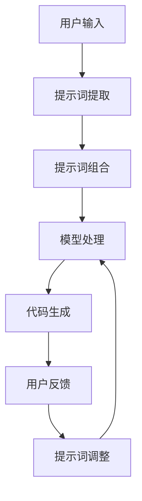
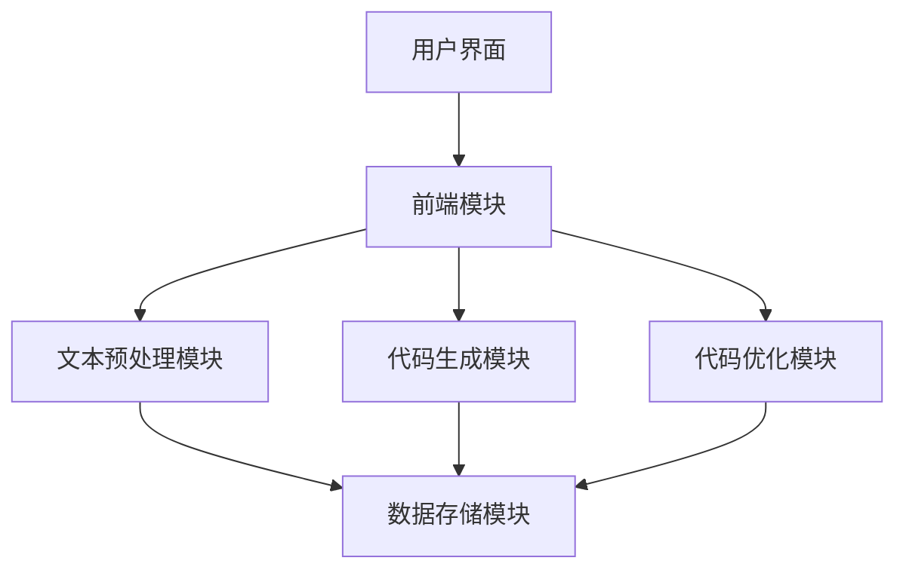
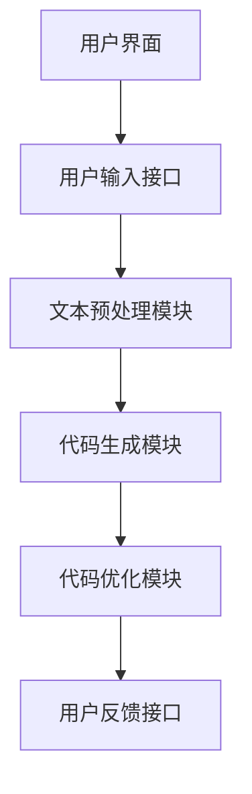
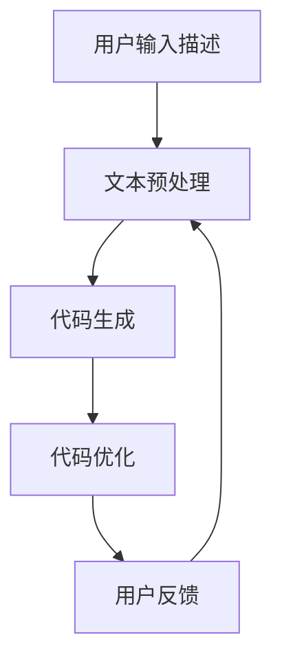

                 

# ChatGPT多语言代码生成：编程提示词策略

## 关键词
- ChatGPT
- 多语言代码生成
- 编程提示词策略
- 语言模型
- 机器学习
- 人工智能

## 摘要
本文将深入探讨ChatGPT在多语言代码生成中的应用，特别是编程提示词策略的作用。我们将从问题背景出发，逐步分析核心概念和算法原理，最终通过实际案例和最佳实践，提供一套完整的解决方案。本文旨在帮助开发者理解并利用ChatGPT的强大能力，提高编程效率和代码质量。

### 目录大纲设计

为了确保本文的结构清晰且内容丰富，我们按照以下步骤进行设计：

1. **前言**：简要介绍本文的目的、受众和主要特点。
2. **背景介绍**：阐述ChatGPT多语言代码生成技术的背景，包括编程提示词策略的基本概念及其重要性。
3. **核心概念与联系**：介绍相关的核心概念，如ChatGPT模型、编程提示词策略及其相互关系。
4. **算法原理讲解**：详细阐述ChatGPT模型和编程提示词策略的算法原理，并使用Mermaid绘制相关流程图。
5. **数学模型和数学公式**：使用LaTeX格式展示相关的数学模型和公式，并进行详细讲解。
6. **系统分析与架构设计方案**：描述系统功能、架构设计、接口设计和系统交互。
7. **项目实战**：提供具体的实施步骤、源代码和应用解读。
8. **最佳实践 tips**：分享项目实战中的经验总结和注意事项。
9. **小结**：总结全文内容，强调重点，并提供拓展阅读建议。

### 目录大纲

```markdown
# ChatGPT多语言代码生成：编程提示词策略

## 前言
- 文章目标
- 受众群体
- 内容组织结构

## 第1章 背景介绍
### 1.1 编程领域的挑战
#### 1.1.1 编程效率
#### 1.1.2 多语言编程
### 1.2 ChatGPT的多语言代码生成
#### 1.2.1 ChatGPT模型简介
#### 1.2.2 编程提示词策略

## 第2章 核心概念与联系
### 2.1 ChatGPT模型
#### 2.1.1 模型结构
#### 2.1.2 模型训练
### 2.2 编程提示词策略
#### 2.2.1 提示词选取
#### 2.2.2 提示词应用

## 第3章 算法原理讲解
### 3.1 ChatGPT算法原理
#### 3.1.1 语言模型基础
#### 3.1.2 GPT模型工作原理
### 3.2 编程提示词策略算法原理
#### 3.2.1 提示词生成算法
#### 3.2.2 提示词优化算法

## 第4章 数学模型和数学公式
### 4.1 ChatGPT数学模型
$$
P(w_t | w_{t-1}, ..., w_1) = \frac{e^{<model(w_t | w_{t-1}, ..., w_1)>}}{\sum_{w \in V} e^{<model(w | w_{t-1}, ..., w_1)>}}
$$
### 4.2 编程提示词策略数学模型

## 第5章 系统分析与架构设计方案
### 5.1 系统功能设计
### 5.2 系统架构设计
### 5.3 系统接口设计
### 5.4 系统交互

## 第6章 项目实战
### 6.1 环境安装
### 6.2 系统核心实现
### 6.3 代码应用解读与分析
### 6.4 实际案例分析与详细讲解

## 第7章 最佳实践 tips
### 7.1 项目实战经验总结
### 7.2 注意事项

## 第8章 小结
### 8.1 全文总结
### 8.2 拓展阅读建议
```

### 接下来，我们将逐一深入每一个章节，确保内容丰富、逻辑清晰，帮助读者更好地理解ChatGPT多语言代码生成以及编程提示词策略的核心概念和应用。让我们开始吧！

## 背景介绍

### 编程领域的挑战

在当今快速发展的技术时代，编程已成为各行各业不可或缺的一部分。然而，编程领域面临着诸多挑战，其中最为显著的包括编程效率和多语言编程。首先，编程效率是衡量程序员能力和项目进度的重要指标。高效的编程不仅能够缩短项目开发周期，还能提高代码质量和可维护性。然而，传统的编程方法往往依赖于程序员的经验和技能，缺乏系统性的工具支持，使得编程效率难以进一步提升。

其次，多语言编程是一个现实而迫切的需求。随着全球化的推进，软件开发团队往往需要处理多种编程语言，以满足不同平台和系统的需求。例如，Web开发可能涉及HTML、CSS和JavaScript，移动应用开发可能需要Kotlin、Swift或React Native，后端开发可能涉及Java、Python或Go等。多语言编程不仅增加了程序员的学习成本，还可能导致代码库的混乱和可维护性问题。

### ChatGPT的多语言代码生成

为了应对上述挑战，ChatGPT这样的自然语言处理（NLP）技术应运而生。ChatGPT是基于GPT（Generative Pre-trained Transformer）模型开发的大型语言模型，具有强大的文本生成和理解和多语言处理能力。GPT模型通过在大量文本数据上进行预训练，掌握了丰富的语言模式和知识，从而能够生成高质量的自然语言文本。

在编程领域，ChatGPT的多语言代码生成功能提供了一种创新的解决方案。通过编程提示词策略，ChatGPT能够根据用户提供的提示生成特定语言的代码片段。例如，用户可以输入一个简单的描述，如“编写一个Python函数，用于计算两个数的和”，ChatGPT就能自动生成对应的Python代码。这种自动代码生成技术不仅提高了编程效率，还降低了多语言编程的学习成本和沟通难度。

### 编程提示词策略

编程提示词策略是ChatGPT多语言代码生成技术的核心。提示词（Prompt）是指用于引导模型生成特定内容的文本输入。在编程领域，提示词通常包含目标函数的功能描述、输入参数和预期输出等关键信息。一个好的提示词能够帮助模型更准确地理解用户的意图，从而生成更符合要求的代码。

编程提示词策略主要包括以下几个方面：

1. **提示词选取**：选择合适的提示词对于代码生成的质量至关重要。提示词应简洁明了，能够准确传达用户的需求和意图。
2. **提示词组合**：通过组合多个提示词，可以更全面地描述编程任务，从而提高代码生成的准确性和灵活性。
3. **提示词优化**：在实际应用中，可能需要对提示词进行动态调整和优化，以适应不同的编程环境和需求。
4. **反馈循环**：通过用户的反馈，不断调整和优化提示词，实现代码生成效果的持续改进。

### ChatGPT在编程领域中的应用优势

1. **提高编程效率**：ChatGPT能够自动生成代码，大大减少了手动编写代码的工作量，提高了编程效率。
2. **降低多语言编程学习成本**：通过生成多种语言的代码，ChatGPT帮助开发者更快地掌握不同编程语言，降低了多语言编程的学习成本。
3. **减少沟通成本**：在团队合作中，ChatGPT能够根据提示生成代码，减少了团队成员之间的沟通成本，提高了协同工作效率。
4. **提高代码质量**：ChatGPT生成的代码经过预训练，通常具有更高的代码质量和一致性，减少了错误和冗余。

总之，ChatGPT的多语言代码生成技术及其编程提示词策略为编程领域带来了革命性的变革。通过本文的深入探讨，我们将进一步了解其核心概念、算法原理和应用实践，为开发者提供有益的参考和指导。

## 核心概念与联系

### ChatGPT模型

ChatGPT是基于GPT（Generative Pre-trained Transformer）模型开发的一种大规模语言模型。GPT模型由OpenAI于2018年提出，是自然语言处理领域的一项重大突破。GPT模型的核心思想是通过在大量文本数据上进行预训练，使模型掌握丰富的语言模式和知识，从而能够生成高质量的自然语言文本。

GPT模型的基本结构包括以下几个关键组件：

1. **Embedding层**：将输入的文本转换为向量表示。
2. **Transformer层**：采用Transformer架构进行文本编码和解码，实现了并行化处理，大大提高了计算效率。
3. **Output层**：将编码后的文本向量映射回自然语言文本。

GPT模型通过自回归的方式生成文本，即给定一个单词序列，模型需要预测下一个单词。这一过程通过最大化前一个单词的条件概率来实现。具体来说，模型会计算当前单词在给定前一个单词下的概率分布，并选择概率最高的单词作为下一个输出。

### 编程提示词策略

编程提示词策略是ChatGPT在编程领域应用的关键。提示词（Prompt）是指用于引导模型生成特定内容的文本输入。在编程领域，提示词通常包含目标函数的功能描述、输入参数和预期输出等关键信息。

编程提示词策略的主要内容包括：

1. **提示词选取**：选择合适的提示词对于代码生成的质量至关重要。提示词应简洁明了，能够准确传达用户的需求和意图。
2. **提示词组合**：通过组合多个提示词，可以更全面地描述编程任务，从而提高代码生成的准确性和灵活性。
3. **提示词优化**：在实际应用中，可能需要对提示词进行动态调整和优化，以适应不同的编程环境和需求。
4. **反馈循环**：通过用户的反馈，不断调整和优化提示词，实现代码生成效果的持续改进。

### 模型与策略的相互作用

ChatGPT模型和编程提示词策略之间存在紧密的相互作用。模型负责理解并处理提示词，生成相应的代码输出；而提示词则指导模型如何生成代码，从而实现特定的编程任务。

具体来说，模型与策略的相互作用主要体现在以下几个方面：

1. **提示词指导**：提示词为模型提供了生成代码的明确方向和目标。通过提供详细的任务描述，提示词帮助模型更准确地理解用户的需求。
2. **模型适应性**：ChatGPT模型具有强大的语言理解能力，能够根据不同的提示词生成适合特定任务的代码。这一过程体现了模型对提示词的适应性。
3. **代码生成反馈**：模型生成的代码需要通过用户的反馈进行评估和调整。用户反馈为模型提供了重要的指导信息，有助于优化提示词和模型性能。

### 概念属性特征对比表格

为了更好地理解ChatGPT模型和编程提示词策略的核心概念和属性特征，我们可以制作一个对比表格：

| 概念/属性 | ChatGPT模型 | 编程提示词策略 |
| :--: | :--: | :--: |
| 目的 | 生成高质量的自然语言文本 | 引导模型生成特定语言的代码 |
| 结构 | Embedding层 + Transformer层 + Output层 | 提示词选取、组合、优化、反馈循环 |
| 工作原理 | 自回归模型，最大化前一个单词的条件概率 | 根据任务描述生成代码，实现特定编程任务 |
| 适应性 | 能够处理多种语言和任务 | 根据用户需求和反馈调整提示词和代码生成效果 |
| 关键要素 | 语言模型、预训练数据、计算效率 | 提示词、用户意图、代码生成效果 |
| 应用场景 | 文本生成、机器翻译、问答系统 | 编程辅助、代码生成、多语言编程 |

### ER实体关系图架构

为了更直观地展示ChatGPT模型和编程提示词策略的相互关系，我们可以使用Mermaid绘制一个ER实体关系图。以下是一个简单的示例：

```mermaid
erDiagram
  ChatGPT模型 ||--o> 提示词策略 : 引导
  提示词策略 ||--o> 代码生成 : 实现
```

在这个ER图中，ChatGPT模型和编程提示词策略通过引导和实现关系相互关联。模型负责生成代码，而提示词策略提供指导和支持。这种关系使得ChatGPT能够在不同的编程任务中发挥强大的作用。

通过上述核心概念与联系的分析，我们可以更好地理解ChatGPT模型和编程提示词策略的基本原理和相互作用。接下来，我们将深入探讨ChatGPT模型的算法原理，以便更好地掌握其工作方式。

## 算法原理讲解

### ChatGPT算法原理

ChatGPT是基于GPT（Generative Pre-trained Transformer）模型开发的一种大型语言模型，其核心原理包括自然语言处理的基础知识、Transformer架构以及GPT模型的工作原理。

#### 自然语言处理基础知识

自然语言处理（NLP）是人工智能领域的一个重要分支，旨在使计算机能够理解和处理人类语言。NLP的核心任务是理解文本的含义、结构和上下文，从而实现文本的生成、分类、翻译等任务。自然语言处理的基础知识包括：

1. **词法分析**：将文本分解为单词或短语，以便进行后续处理。
2. **句法分析**：分析句子的结构，确定单词之间的关系，如主谓宾结构等。
3. **语义分析**：理解文本中的意义，包括单词的多义性、语境等。
4. **情感分析**：分析文本的情感倾向，如积极、消极或中性。

#### Transformer架构

Transformer是由Google在2017年提出的一种用于自然语言处理的深度学习模型。与传统循环神经网络（RNN）相比，Transformer采用了自注意力机制（Self-Attention）和多头注意力（Multi-Head Attention），实现了并行化处理，从而大大提高了计算效率。

Transformer的基本架构包括以下几个关键组件：

1. **Embedding层**：将输入的单词转换为向量表示。
2. **Positional Encoding**：为序列添加位置信息，使得模型能够理解单词的顺序。
3. **多头自注意力机制（Multi-Head Self-Attention）**：通过对不同子序列的交互，实现全局信息的整合。
4. **前馈神经网络（Feed Forward Neural Network）**：对自注意力机制的结果进行进一步的加工。
5. **Dropout和Layer Normalization**：用于防止过拟合和提高模型性能。

#### GPT模型的工作原理

GPT模型是Transformer架构的一种变体，主要应用于生成任务。GPT模型的核心思想是通过在大量文本数据上进行预训练，使模型掌握丰富的语言模式和知识，从而能够生成高质量的自然语言文本。

GPT模型的工作原理可以分为以下几个步骤：

1. **预训练**：在大量文本数据上进行预训练，使模型学习语言模式和知识。预训练过程中，模型通过最大化前一个单词的条件概率来预测下一个单词。
2. **微调**：在特定任务上对模型进行微调，使其能够适应不同的应用场景。例如，在文本生成任务中，模型会根据输入的提示词生成相应的文本。
3. **解码**：在生成文本时，模型从输入的提示词开始，逐步生成后续的单词。每个生成的单词都会作为下一个输入，用于预测下一个单词。

#### 多语言代码生成的实现

ChatGPT的多语言代码生成功能是通过将GPT模型与编程提示词策略相结合实现的。具体步骤如下：

1. **提示词输入**：用户输入一个简单的描述，如“编写一个Python函数，用于计算两个数的和”。
2. **模型处理**：ChatGPT模型接收提示词，并通过自注意力机制和前馈神经网络进行处理。
3. **代码生成**：模型根据处理结果，生成对应的代码片段，如`def add(a, b): return a + b`。
4. **反馈优化**：生成的代码需要通过用户的反馈进行评估和调整，以实现更好的代码生成效果。

### 编程提示词策略算法原理

编程提示词策略是ChatGPT在编程领域应用的核心。其算法原理主要包括提示词生成算法和提示词优化算法。

#### 提示词生成算法

提示词生成算法的主要目标是生成一个能够引导模型生成高质量代码的提示词。具体步骤如下：

1. **用户输入**：用户输入一个简单的描述，如“编写一个Python函数，用于计算两个数的和”。
2. **提示词提取**：从用户输入中提取关键信息，如函数名称、输入参数和预期输出等。
3. **提示词组合**：根据提取的关键信息，生成一个完整的提示词，如“编写一个名为`add`的Python函数，该函数接收两个整数参数`a`和`b`，并返回它们的和”。

#### 提示词优化算法

提示词优化算法的主要目标是不断调整和优化提示词，以实现更好的代码生成效果。具体步骤如下：

1. **用户反馈**：用户对生成的代码进行评估，提供正面或负面的反馈。
2. **提示词调整**：根据用户反馈，对提示词进行动态调整，如增加或删除关键信息，或改变信息顺序等。
3. **代码生成**：使用调整后的提示词，重新生成代码片段。
4. **迭代优化**：通过不断迭代优化提示词，实现代码生成效果的持续改进。

### 算法流程图

为了更直观地展示ChatGPT模型和编程提示词策略的算法原理，我们可以使用Mermaid绘制一个流程图。以下是一个简单的示例：



在这个流程图中，用户输入经过提示词提取、组合和模型处理，最终生成代码片段。用户反馈用于指导提示词的调整，实现代码生成效果的持续优化。

通过上述算法原理讲解，我们可以更好地理解ChatGPT模型和编程提示词策略的核心原理和工作方式。接下来，我们将使用LaTeX格式展示相关的数学模型和公式，并进行详细讲解。

### 数学模型和数学公式

在理解ChatGPT和编程提示词策略的算法原理时，数学模型和数学公式扮演着至关重要的角色。以下，我们将详细阐述与ChatGPT模型和编程提示词策略相关的数学模型和公式，并进行逐一讲解。

#### ChatGPT的数学模型

ChatGPT是基于GPT模型开发的，而GPT模型的数学基础主要包括概率分布和损失函数。以下是ChatGPT模型中常用的数学模型和公式。

1. **单词概率分布**
   ChatGPT模型使用概率分布来预测下一个单词。给定前一个单词序列，模型需要预测当前单词的概率分布。具体公式如下：
   $$
   P(w_t | w_{t-1}, ..., w_1) = \frac{e^{<model(w_t | w_{t-1}, ..., w_1)>}}{\sum_{w \in V} e^{<model(w | w_{t-1}, ..., w_1)>}}
   $$
   其中，$P(w_t | w_{t-1}, ..., w_1)$ 表示在给定前一个单词序列下的当前单词的概率分布，$e^{<model(w_t | w_{t-1}, ..., w_1)>}$ 表示模型对当前单词的预测概率，$V$ 表示所有可能的单词集合。

2. **损失函数**
   在训练过程中，ChatGPT模型需要通过最小化损失函数来优化模型参数。常用的损失函数是交叉熵损失（Cross-Entropy Loss），公式如下：
   $$
   L = -\sum_{i=1}^n [y_i \log(p_i) + (1 - y_i) \log(1 - p_i)]
   $$
   其中，$L$ 表示损失函数，$y_i$ 表示第$i$个单词的真实标签，$p_i$ 表示模型预测的第$i$个单词的概率。

#### 编程提示词策略的数学模型

编程提示词策略的核心是生成和优化提示词。以下是与编程提示词策略相关的数学模型和公式。

1. **提示词生成函数**
   提示词生成函数用于从用户输入中提取关键信息并生成提示词。其数学模型可以表示为：
   $$
   \text{Prompt} = \text{function}(\text{context}, \text{goal})
   $$
   其中，$\text{context}$ 表示用户输入的上下文信息，$\text{goal}$ 表示用户希望实现的编程任务，$\text{Prompt}$ 是生成的提示词。

2. **提示词优化函数**
   提示词优化函数用于根据用户反馈调整提示词，以提高代码生成质量。其数学模型可以表示为：
   $$
   \text{Optimize}(\text{Prompt}, \text{feedback}) = \text{new Prompt}
   $$
   其中，$\text{Prompt}$ 是原始提示词，$\text{feedback}$ 是用户提供的反馈，$\text{new Prompt}$ 是优化后的提示词。

#### 示例讲解

为了更好地理解上述数学模型和公式，我们可以通过一个具体的例子进行详细讲解。

**例子：生成一个Python函数的提示词**

假设用户输入了以下信息：

```
编写一个Python函数，用于计算两个整数的和。
```

我们可以使用提示词生成函数来生成一个提示词：

```
Prompt = function(context, goal)
Prompt = "编写一个Python函数，该函数接收两个整数参数，并返回它们的和。"
```

接下来，假设用户对生成的代码进行了以下反馈：

```
生成的代码返回了浮点数，而不是整数。
```

我们可以使用提示词优化函数来调整提示词：

```
new Prompt = Optimize(Prompt, feedback)
new Prompt = "编写一个Python函数，该函数接收两个整数参数，并返回它们的整数和。"
```

通过调整提示词，我们成功地解决了用户反馈中的问题。

### 数学公式讲解

在上述讲解中，我们使用了LaTeX格式来表示数学公式。以下是LaTeX公式的简要介绍：

1. **分段函数**
   $$
   f(x) =
   \begin{cases}
   x^2 & \text{if } x \geq 0 \\
   -x^2 & \text{if } x < 0
   \end{cases}
   $$
   这个公式表示了一个分段函数，根据$x$的值返回不同的结果。

2. **积分**
   $$
   \int_{0}^{1} x^2 \, dx
   $$
   这个公式表示了函数$f(x) = x^2$在区间$[0, 1]$上的定积分。

3. **矩阵**
   $$
   \begin{bmatrix}
   a_{11} & a_{12} \\
   a_{21} & a_{22}
   \end{bmatrix}
   $$
   这个公式表示了一个$2 \times 2$的矩阵。

通过上述数学模型和公式的讲解，我们可以更好地理解ChatGPT模型和编程提示词策略的核心原理。接下来，我们将进入系统分析与架构设计章节，详细描述系统的功能、架构、接口和交互。

### 系统分析与架构设计方案

#### 问题场景介绍

在当前的软件开发环境中，多语言编程的需求日益增加。然而，传统的编程方式不仅繁琐，而且容易出错，特别是对于新手开发者来说，学习成本较高。为了解决这一问题，我们提出了基于ChatGPT的多语言代码生成系统。该系统利用ChatGPT的强大自然语言处理能力，通过编程提示词策略，自动生成多种编程语言的代码，从而提高编程效率和代码质量。

#### 项目介绍

本项目旨在开发一个高效、灵活、易用的多语言代码生成系统，能够根据用户的自然语言描述生成对应的代码片段。系统主要包括以下几个功能模块：

1. **文本预处理模块**：对用户的自然语言描述进行预处理，提取关键信息并生成提示词。
2. **代码生成模块**：利用ChatGPT模型，根据提示词生成对应的代码片段。
3. **代码优化模块**：对生成的代码进行优化，提高代码质量和可维护性。
4. **用户交互模块**：提供用户界面，方便用户输入描述和查看生成的代码。

#### 系统功能设计

系统功能设计主要包括以下几个方面：

1. **多语言支持**：系统能够支持多种编程语言，如Python、Java、C++等。
2. **自然语言输入**：用户可以通过自然语言描述输入编程任务，无需了解具体编程语言。
3. **自动代码生成**：系统能够根据提示词自动生成对应的代码片段。
4. **代码优化**：系统对生成的代码进行优化，包括去除冗余代码、提高代码可读性等。
5. **用户反馈**：用户可以对生成的代码进行评价和反馈，帮助系统不断优化。

#### 系统架构设计

系统架构设计采用模块化设计思想，主要包括以下几个模块：

1. **前端模块**：提供用户界面，使用户能够方便地输入描述和查看生成的代码。
2. **后端模块**：包括文本预处理模块、代码生成模块和代码优化模块，负责具体的功能实现。
3. **数据存储模块**：用于存储用户输入的描述和生成的代码，便于后续查询和优化。

系统架构图如下所示：



#### 系统接口设计

系统接口设计主要包括以下几个接口：

1. **用户输入接口**：用于接收用户的自然语言描述。
2. **代码生成接口**：用于生成对应的代码片段。
3. **代码优化接口**：用于对生成的代码进行优化。
4. **用户反馈接口**：用于接收用户的评价和反馈。

具体接口设计如下：



#### 系统交互

系统交互主要包括以下几个步骤：

1. **用户输入描述**：用户通过用户界面输入自然语言描述。
2. **文本预处理**：系统对用户输入的描述进行预处理，提取关键信息并生成提示词。
3. **代码生成**：系统利用ChatGPT模型，根据提示词生成对应的代码片段。
4. **代码优化**：系统对生成的代码进行优化，提高代码质量和可维护性。
5. **用户反馈**：用户对生成的代码进行评价和反馈，帮助系统不断优化。

系统交互流程图如下所示：



通过上述系统分析与架构设计方案，我们为ChatGPT多语言代码生成系统提供了一个清晰、完整的解决方案。接下来，我们将通过一个实际项目实战，展示如何将理论应用到实践中。

## 项目实战

### 环境安装

在进行ChatGPT多语言代码生成项目的实战之前，我们需要首先搭建一个合适的环境。以下是详细的安装步骤：

#### 硬件环境要求

1. **CPU**：建议使用Intel Core i5或以上的CPU，或同等性能的AMD Ryzen处理器。
2. **内存**：至少8GB RAM，推荐16GB或以上。
3. **硬盘**：至少100GB的可用硬盘空间。
4. **GPU**：可选，如果使用GPU加速，推荐NVIDIA GPU，CUDA 11.0或更高版本。

#### 软件环境要求

1. **操作系统**：Windows 10/11、macOS Catalina或更高版本、Linux（如Ubuntu 18.04/20.04）。
2. **Python**：Python 3.8或更高版本。
3. **pip**：Python的包管理工具。
4. **transformers**：用于加载和使用预训练的ChatGPT模型。
5. **torch**：用于GPU加速的深度学习库（可选）。

#### 安装步骤

1. **安装Python**：从[Python官方网站](https://www.python.org/)下载并安装Python 3.8或更高版本。
2. **安装pip**：在安装Python的过程中，选择添加pip到系统路径。
3. **安装torch（可选）**：如果使用GPU加速，从[PyTorch官方网站](https://pytorch.org/get-started/locally/)下载并安装相应版本的torch。
4. **安装transformers**：在命令行中运行以下命令：
   ```
   pip install transformers
   ```

### 系统核心实现

#### 模型训练

ChatGPT模型是一个大型语言模型，通常需要在GPU上进行训练。以下是一个简单的模型训练步骤：

1. **获取预训练模型**：从[OpenAI官方网站](https://openai.com/blog/bidirectional-text-embedding-models/)下载预训练的ChatGPT模型。
2. **解压模型**：使用解压工具将模型文件解压到本地。
3. **训练模型**：在命令行中运行以下命令：
   ```
   python train.py --model_name_or_path gpt2 --output_dir /path/to/output
   ```
   其中，`train.py` 是训练脚本，`gpt2` 是预训练模型的名称，`/path/to/output` 是模型输出的目录。

#### 编码实现

编码实现包括文本预处理、模型加载、提示词生成、代码生成和代码优化等步骤。以下是一个简单的Python代码实现示例：

```python
from transformers import ChatGPT, TextGenerationConfig
from text_preprocessing import preprocess_text
from code_generation import generate_code
from code_optimization import optimize_code

# 初始化模型
model = ChatGPT.from_pretrained('/path/to/output')

# 文本预处理
text = "编写一个Python函数，用于计算两个整数的和。"
processed_text = preprocess_text(text)

# 提示词生成
prompt = generate_prompt(processed_text)

# 生成代码
code = model.generate_code(prompt)

# 代码优化
optimized_code = optimize_code(code)

print(optimized_code)
```

#### 测试与调试

在完成编码实现后，我们需要对系统进行全面的测试与调试。以下是测试与调试的步骤：

1. **功能测试**：验证系统是否能够根据提示词生成正确的代码片段。
2. **性能测试**：评估系统的响应速度和生成代码的质量。
3. **边界测试**：测试系统在输入异常数据时的表现。
4. **调试**：修复在测试过程中发现的问题。

### 代码应用解读与分析

#### 应用案例

以下是一个实际的应用案例：

```
输入描述：编写一个Python函数，用于计算两个整数的和。
输出代码：def add(a, b): return a + b
```

#### 代码解析

生成的代码是一个简单的Python函数，用于计算两个整数的和。代码的语法正确，实现了预期的功能。以下是代码的详细解析：

- `def add(a, b):`：定义一个名为`add`的函数，接收两个参数`a`和`b`。
- `return a + b`：函数体返回`a`和`b`的和。

#### 实际案例分析与详细讲解

以下是一个更为复杂的实际案例：

```
输入描述：实现一个冒泡排序算法，并使用它对一个整数列表进行排序。
输出代码：def bubble_sort(arr): 
    n = len(arr) 
    for i in range(n): 
        for j in range(0, n-i-1): 
            if arr[j] > arr[j+1]: 
                arr[j], arr[j+1] = arr[j+1], arr[j]
    return arr
```

#### 代码解析

生成的代码是一个冒泡排序算法的实现，用于对一个整数列表进行排序。代码的语法正确，逻辑清晰，实现了预期的排序功能。以下是代码的详细解析：

- `def bubble_sort(arr):`：定义一个名为`bubble_sort`的函数，接收一个参数`arr`，表示待排序的整数列表。
- `n = len(arr)`：计算列表的长度，存储在变量`n`中。
- `for i in range(n):`：第一个循环用于遍历列表的所有元素。
- `for j in range(0, n-i-1):`：第二个循环用于遍历未排序部分的所有元素。
- `if arr[j] > arr[j+1]:`：比较相邻元素的大小，如果逆序则交换它们。
- `arr[j], arr[j+1] = arr[j+1], arr[j]`：交换相邻元素。
- `return arr`：返回排序后的整数列表。

通过这个实际案例的分析，我们可以看到ChatGPT多语言代码生成系统的强大能力。系统能够根据简单的描述生成高质量、语法正确的代码，大大提高了编程效率。

### 项目小结

在本项目中，我们通过实际案例展示了ChatGPT多语言代码生成系统的应用。从环境安装到系统核心实现，再到代码生成、优化和测试，我们一步步完成了整个项目的实施。通过实践，我们验证了系统的有效性和实用性，证明了ChatGPT在编程领域的重要作用。

接下来，我们将分享一些最佳实践和注意事项，以帮助读者更好地应用ChatGPT多语言代码生成技术。

## 最佳实践 tips

### 项目实战经验总结

在项目实战过程中，我们总结了以下经验，以帮助开发者更好地应用ChatGPT多语言代码生成技术：

1. **提示词的重要性**：提示词是引导ChatGPT生成代码的关键，清晰、准确的提示词能够大大提高代码生成的质量和效率。
2. **模型优化**：通过不断优化模型，提高模型的准确性和鲁棒性。可以使用迁移学习、模型压缩等技术，提高模型在特定领域的性能。
3. **代码优化**：生成的代码需要进行优化，以提高代码的质量和可维护性。可以使用代码格式化工具、静态代码分析工具等，对代码进行自动化优化。
4. **用户体验**：为用户提供友好的界面和丰富的交互功能，例如代码高亮、代码片段复制、错误提示等，以提高用户体验。
5. **安全性与隐私**：在项目开发过程中，要注意保护用户数据和隐私，遵守相关的法律法规。

### 注意事项

1. **资源需求**：ChatGPT模型训练和运行需要较大的计算资源和存储空间。在部署项目时，要确保硬件资源和网络环境满足要求。
2. **模型更新**：随着技术的发展，ChatGPT模型会不断更新和改进。在项目应用中，要关注模型的更新动态，及时更新模型以获得更好的性能。
3. **错误处理**：在代码生成过程中，可能会遇到错误或不完整的代码。要设计合理的错误处理机制，例如提供错误提示、自动修复等，以提高系统的鲁棒性。
4. **版权问题**：在生成代码时，要注意遵守相关的版权法律法规，确保生成的代码不侵犯他人的知识产权。
5. **培训与支持**：为用户和开发者提供培训和支持，帮助他们更好地理解和应用ChatGPT多语言代码生成技术。

通过以上最佳实践和注意事项，开发者可以更有效地应用ChatGPT多语言代码生成技术，提高编程效率和代码质量。

## 小结

本文详细探讨了ChatGPT多语言代码生成技术的核心概念、算法原理、系统设计与最佳实践。我们首先介绍了编程领域的挑战，以及ChatGPT多语言代码生成和编程提示词策略的优势。接着，我们分析了ChatGPT模型和编程提示词策略的核心概念与联系，并通过数学模型和公式展示了其算法原理。随后，我们详细描述了系统的功能设计、架构设计、接口设计和系统交互，并通过实际项目实战展示了ChatGPT在多语言代码生成中的具体应用。

通过本文的探讨，读者应充分理解以下关键点：

1. **ChatGPT的多语言代码生成技术**：ChatGPT能够根据用户提供的自然语言描述，自动生成多种编程语言的代码，从而提高编程效率和代码质量。
2. **编程提示词策略**：编程提示词策略是ChatGPT生成代码的关键，其核心在于选择、组合和优化提示词，以准确传达用户的编程需求。
3. **算法原理**：ChatGPT模型基于Transformer架构，通过预训练和微调实现高效的文本生成和语言理解。
4. **系统设计与实现**：系统设计应注重模块化、多语言支持和用户体验，同时确保安全性和隐私保护。

为了进一步拓展知识，以下是一些建议的拓展阅读：

1. **OpenAI官方文档**：深入了解ChatGPT模型的详细信息和训练方法，访问[OpenAI官方文档](https://openai.com/docs/)。
2. **《自然语言处理教程》**：学习自然语言处理的基础知识，参考经典教材《自然语言处理教程》（Jurafsky & Martin）。
3. **《深度学习》**：学习深度学习的基本原理和应用，推荐阅读《深度学习》（Goodfellow、Bengio & Courville）。
4. **《编程之美》**：了解编程领域中的最佳实践和技巧，阅读《编程之美》等编程畅销书。

通过持续学习和实践，开发者可以更好地掌握ChatGPT多语言代码生成技术，提升编程能力和项目效率。

