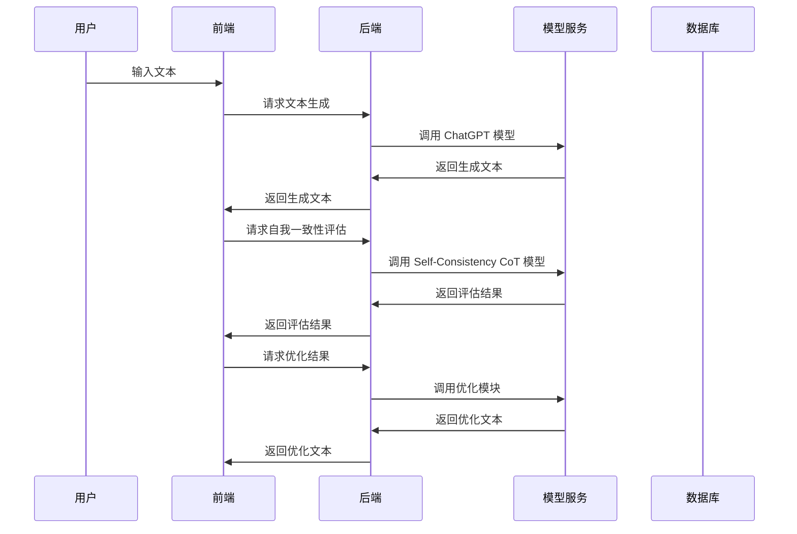

                 

### 文章标题

### 关键词

- ChatGPT
- 自我一致性 CoT
- 定制化输出
- 自然语言处理
- 算法原理
- 实战应用

### 摘要

本文旨在探讨如何通过自我一致性 CoT 技巧实现 ChatGPT 的定制化输出。首先，我们将介绍 ChatGPT 的核心特性和定制化输出的需求，随后深入探讨自我一致性 CoT 的原理及其在 ChatGPT 输出中的重要性。接下来，本文将详细解析 Self-Consistency CoT 技巧的基础、核心概念、实现方法及应用场景。最后，通过一个实际案例，我们将展示如何将自我一致性 CoT 技巧应用于 ChatGPT，并进行详细讲解和总结。

## 第一部分：背景与概念

### 第1章：问题背景与概念介绍

#### 1.1 ChatGPT概述

ChatGPT 是由 OpenAI 于 2022 年推出的一个基于 GPT-3.5 模型的语言生成模型。它具有强大的自然语言处理能力，能够生成连贯、有逻辑的文本，广泛应用于对话系统、内容创作和知识问答等领域。

**ChatGPT的核心特性：**

1. **强大的文本生成能力：** ChatGPT 能够根据输入的提示生成高质量的文本，包括文章、故事、问答等。
2. **多语言支持：** ChatGPT 支持 50 多种语言，能够在不同语言之间进行翻译和创作。
3. **深度学习能力：** ChatGPT 采用深度学习技术，通过大规模的数据训练，不断提升其生成文本的质量和逻辑性。

**问题背景：定制化输出的需求**

随着 ChatGPT 的广泛应用，用户对定制化输出的需求日益增加。定制化输出是指根据用户的具体需求，生成个性化的、符合用户预期的文本内容。这包括但不限于：

1. **个性化问答：** 根据用户的提问，生成针对性强、符合用户需求的回答。
2. **内容创作：** 根据用户的需求，生成文章、故事、报告等不同类型的内容。
3. **对话系统：** 在对话系统中，根据用户的交互，生成连贯、自然的对话。

然而，现有 ChatGPT 的输出存在一些局限性，例如：

1. **缺乏灵活性：** ChatGPT 的输出往往依赖于预训练模型，难以根据用户需求进行个性化调整。
2. **逻辑一致性不足：** ChatGPT 生成的文本可能存在逻辑不一致、内容不符等问题。
3. **适应性差：** ChatGPT 在面对特定领域或特定场景时，生成文本的质量和准确性可能下降。

为了解决上述问题，我们需要引入自我一致性 CoT 技巧，以提高 ChatGPT 的定制化输出能力。

#### 1.2 自我一致性 CoT 原理

自我一致性 CoT（Self-Consistency CoT，Self-Consistency of Content Topic）是一种用于评估和优化文本生成模型一致性和逻辑性的技术。它通过比较模型生成的文本与原始输入之间的逻辑关系和内容一致性，来评估模型的输出质量。

**自我一致性 CoT 概念：**

自我一致性 CoT 的核心思想是，模型生成的文本应当与原始输入保持一致性，即模型的输出应能够合理地延续和扩展输入内容。具体来说，包括以下两个方面：

1. **逻辑一致性：** 模型生成的文本应当符合逻辑规则，避免出现矛盾或逻辑错误。
2. **内容一致性：** 模型生成的文本应当与原始输入的内容保持一致，避免出现无关或错误的内容。

**自我一致性 CoT 与 ChatGPT 输出的关系：**

自我一致性 CoT 技巧在 ChatGPT 输出中的应用，可以通过以下两个方面实现：

1. **优化模型生成文本的一致性：** 通过引入自我一致性 CoT 评估指标，对 ChatGPT 的输出进行评估和优化，提高其生成文本的逻辑一致性和内容一致性。
2. **定制化调整生成文本：** 根据自我一致性 CoT 的评估结果，对 ChatGPT 的输出进行定制化调整，使其更符合用户的需求。

**自我一致性 CoT 在信息处理中的作用：**

自我一致性 CoT 技巧在信息处理中具有重要作用，包括：

1. **文本质量评估：** 通过自我一致性 CoT 评估指标，对文本生成模型的质量进行评估，筛选出高质量的输出。
2. **文本优化：** 通过对模型输出进行自我一致性 CoT 评估，发现并修正文本中的逻辑错误和内容不一致问题。
3. **个性化生成：** 通过自我一致性 CoT 评估，为用户提供更加个性化和定制化的文本生成服务。

#### 1.3 ChatGPT 定制化输出的挑战

尽管 ChatGPT 在自然语言处理领域取得了显著成果，但在定制化输出方面仍面临诸多挑战。以下是一些主要的挑战：

1. **输入多样性：** ChatGPT 的输入来源多样，包括文本、语音、图像等，如何处理不同输入源之间的差异，保证输出的定制化，是一个重要问题。
2. **输出一致性：** 如何确保 ChatGPT 生成的文本在逻辑和内容上的一致性，避免出现错误或矛盾，是定制化输出的关键。
3. **个性化调整：** 如何根据用户的需求，对 ChatGPT 的输出进行个性化调整，生成符合用户预期的文本，是定制化输出的核心。
4. **适应性：** 如何使 ChatGPT 在面对不同领域和场景时，保持良好的生成质量和一致性，是定制化输出的重要考量。

**现有解决方案的不足：**

目前，针对 ChatGPT 定制化输出的解决方案主要包括以下几种：

1. **基于规则的定制化：** 通过预定义的规则和模板，对 ChatGPT 的输出进行约束和调整。但这种方法难以应对复杂的输入和输出需求，适应性较差。
2. **基于机器学习的定制化：** 通过训练模型，学习用户的需求和偏好，生成定制化的输出。但这种方法对数据量和质量有较高要求，且难以保证输出的一致性和逻辑性。
3. **基于人工的定制化：** 由人工对 ChatGPT 的输出进行审查和调整，生成符合用户需求的文本。但这种方法成本高、效率低，难以满足大规模应用的需求。

**自我一致性 CoT 技巧的优势：**

与现有解决方案相比，自我一致性 CoT 技巧具有以下优势：

1. **自动评估与优化：** 通过自我一致性 CoT 评估指标，对 ChatGPT 的输出进行自动评估和优化，提高输出的一致性和质量。
2. **适应性较强：** 自我一致性 CoT 技巧适用于多种输入源和输出场景，具有较强的适应性。
3. **可扩展性：** 自我一致性 CoT 技巧可以与现有文本生成模型相结合，实现定制化输出的扩展和优化。
4. **低成本高效率：** 自我一致性 CoT 技巧无需大量数据和人工干预，具有低成本、高效率的优势。

综上所述，通过引入自我一致性 CoT 技巧，我们可以有效解决 ChatGPT 定制化输出中的一致性和适应性等问题，提高其输出质量和用户满意度。

### 第2章：Self-Consistency CoT 基础

#### 2.1 自我一致性 CoT 模型

自我一致性 CoT 模型是一种用于评估和优化文本生成模型一致性和逻辑性的技术。该模型的核心思想是通过比较模型生成的文本与原始输入之间的逻辑关系和内容一致性，来评估模型的输出质量。

**模型概述：**

自我一致性 CoT 模型主要由以下几个部分构成：

1. **输入模块：** 获取原始输入文本，包括文本内容、上下文信息和用户需求等。
2. **生成模块：** 根据输入模块获取的信息，生成初步的文本输出。
3. **评估模块：** 对生成的文本输出进行自我一致性 CoT 评估，评估内容包括逻辑一致性和内容一致性。
4. **优化模块：** 根据评估结果，对生成的文本输出进行优化，提高其一致性。
5. **输出模块：** 输出最终的处理结果，包括优化后的文本输出和评估指标等。

**模型构成要素：**

自我一致性 CoT 模型的关键构成要素包括：

1. **逻辑一致性评估：** 通过分析文本生成过程中的逻辑关系，评估生成的文本是否存在逻辑矛盾或错误。
2. **内容一致性评估：** 通过比较生成的文本与原始输入的内容，评估生成的文本是否与原始输入保持一致。
3. **优化策略：** 根据评估结果，制定相应的优化策略，包括文本修改、内容补充和逻辑调整等。
4. **评估指标：** 用于衡量自我一致性 CoT 评估效果的一系列指标，如一致性得分、错误率等。

#### 2.2 Self-Consistency CoT 的核心概念

自我一致性 CoT 的核心概念主要包括逻辑一致性、内容一致性和优化策略。以下是对这些核心概念的详细解释：

**逻辑一致性：**

逻辑一致性是指文本生成过程中所遵循的逻辑规则和关系。自我一致性 CoT 模型通过分析文本生成过程中的逻辑关系，评估生成的文本是否存在逻辑矛盾或错误。具体来说，逻辑一致性包括以下几个方面：

1. **因果逻辑：** 文本中的因果关系应当合理，避免出现错误的因果推断。
2. **时间逻辑：** 文本中的时间描述应当符合实际，避免出现时间矛盾或混乱。
3. **逻辑连贯性：** 文本中的逻辑推理应当连贯，避免出现逻辑跳跃或中断。

**内容一致性：**

内容一致性是指文本生成过程中生成的内容与原始输入的内容保持一致。自我一致性 CoT 模型通过比较生成的文本与原始输入的内容，评估生成的文本是否与原始输入保持一致。具体来说，内容一致性包括以下几个方面：

1. **关键信息匹配：** 生成的文本应当包含原始输入中的关键信息，避免遗漏或错误。
2. **文本风格匹配：** 生成的文本应当与原始输入的风格保持一致，避免出现风格不一致的情况。
3. **语义一致性：** 生成的文本应当与原始输入的语义保持一致，避免出现语义错误或混淆。

**优化策略：**

优化策略是指根据自我一致性 CoT 评估结果，对生成的文本输出进行优化，提高其一致性。自我一致性 CoT 模型的优化策略包括以下几个方面：

1. **文本修改：** 根据评估结果，对生成的文本进行修改，纠正逻辑错误和内容不一致问题。
2. **内容补充：** 根据评估结果，对生成的文本进行内容补充，完善关键信息和缺失的部分。
3. **逻辑调整：** 根据评估结果，对生成的文本进行逻辑调整，确保逻辑关系的正确性和连贯性。

**概念对比表格：**

为了更清晰地理解自我一致性 CoT 的核心概念，我们可以将逻辑一致性、内容一致性和优化策略进行对比，如下表所示：

| 概念       | 定义                                                         | 关联要素                                 |
|------------|--------------------------------------------------------------|------------------------------------------|
| 逻辑一致性 | 文本生成过程中所遵循的逻辑规则和关系                           | 因果逻辑、时间逻辑、逻辑连贯性           |
| 内容一致性 | 文本生成过程中生成的内容与原始输入的内容保持一致                 | 关键信息匹配、文本风格匹配、语义一致性   |
| 优化策略   | 根据自我一致性 CoT 评估结果，对生成的文本输出进行优化，提高其一致性 | 文本修改、内容补充、逻辑调整           |

通过上述对比表格，我们可以更清晰地理解自我一致性 CoT 的核心概念及其关联要素。

#### 2.3 Self-Consistency CoT 的实现方法

自我一致性 CoT 技巧的实现方法主要包括传统方法和现代方法。以下将对这两种方法进行详细解释和比较。

**传统方法：**

传统方法主要依赖于规则和模板，通过对文本生成过程进行约束和调整来实现自我一致性 CoT。具体来说，传统方法包括以下几个方面：

1. **规则定义：** 预先定义一系列规则和模板，用于指导文本生成过程。这些规则和模板主要涵盖逻辑一致性、内容一致性和文本风格等方面。
2. **规则应用：** 在文本生成过程中，根据定义的规则和模板，对生成的文本进行约束和调整。例如，通过检查因果关系、时间逻辑和语义一致性等，确保生成的文本符合预期的一致性要求。
3. **人工审查：** 生成文本后，由人工对文本进行审查和修改，进一步确保文本的一致性。这种方法虽然在一定程度上提高了文本的一致性，但依赖于人工审查，效率较低，且难以应对复杂的输入和输出需求。

**现代方法：**

现代方法主要基于机器学习和深度学习技术，通过训练模型来自动实现自我一致性 CoT。具体来说，现代方法包括以下几个方面：

1. **数据收集与处理：** 收集大量包含逻辑一致性、内容一致性等特征的文本数据，对数据进行预处理，包括数据清洗、标注等。
2. **模型训练：** 使用收集到的数据，训练用于评估和优化文本生成模型的一致性模型。这些模型通常包括神经网络、循环神经网络（RNN）和变压器（Transformer）等。
3. **自动评估与优化：** 在文本生成过程中，使用训练好的模型对生成的文本进行自动评估，评估内容包括逻辑一致性和内容一致性。根据评估结果，对生成的文本进行自动优化，提高其一致性。
4. **模型集成：** 将多个训练好的模型集成到一个系统中，通过模型之间的相互协作，进一步提高文本的一致性。

**传统方法与现代方法的比较：**

1. **效率：** 现代方法基于机器学习和深度学习技术，可以实现自动化评估和优化，效率较高。而传统方法依赖于人工审查和调整，效率较低。
2. **适应性：** 现代方法通过训练模型，可以应对复杂的输入和输出需求，具有较强的适应性。而传统方法主要依赖于预定义的规则和模板，适应性较差。
3. **效果：** 现代方法通过深度学习技术，可以实现更高的文本一致性，生成质量较高的文本。而传统方法的效果依赖于预定义规则和模板的质量，可能存在局限性。

综上所述，自我一致性 CoT 的实现方法在传统方法和现代方法之间具有显著差异。现代方法在效率、适应性和效果方面具有明显优势，但需要大量数据和计算资源。传统方法虽然效率较低，但适用于一些简单的应用场景，且易于实现。

### 第3章：Self-Consistency CoT 的应用场景

#### 3.1 自然语言处理中的应用

自我一致性 CoT 技巧在自然语言处理（NLP）领域具有广泛的应用，可以显著提高文本生成模型的一致性和质量。以下介绍几个常见的自然语言处理应用场景：

**文本分类：**

文本分类是指将文本数据根据其内容或主题分配到不同的类别中。自我一致性 CoT 技巧在文本分类中的应用主要包括以下方面：

1. **提高分类准确性：** 通过自我一致性 CoT 评估，筛选出逻辑一致性和内容一致性较高的文本，提高分类模型的准确性。
2. **识别错误分类：** 通过自我一致性 CoT 评估，发现并修正错误分类的文本，提高分类模型的鲁棒性。

**情感分析：**

情感分析是指从文本中识别出表达的情感倾向和情绪。自我一致性 CoT 技巧在情感分析中的应用主要包括以下方面：

1. **提高情感分析准确性：** 通过自我一致性 CoT 评估，筛选出逻辑一致性和内容一致性较高的文本，提高情感分析模型的准确性。
2. **识别错误情感标注：** 通过自我一致性 CoT 评估，发现并修正错误情感标注的文本，提高情感分析模型的鲁棒性。

**对话生成：**

对话生成是指根据输入的对话上下文，生成连贯、自然的对话文本。自我一致性 CoT 技巧在对话生成中的应用主要包括以下方面：

1. **提高对话连贯性：** 通过自我一致性 CoT 评估，筛选出逻辑一致性和内容一致性较高的文本，提高对话生成模型的连贯性。
2. **识别错误生成：** 通过自我一致性 CoT 评估，发现并修正错误生成的文本，提高对话生成模型的准确性。

#### 3.2 数据科学中的应用

自我一致性 CoT 技巧在数据科学领域也具有广泛的应用，可以显著提高数据分析的质量和准确性。以下介绍几个常见的数据科学应用场景：

**数据预处理：**

数据预处理是数据分析过程中的重要步骤，主要包括数据清洗、数据转换和数据归一化等。自我一致性 CoT 技巧在数据预处理中的应用主要包括以下方面：

1. **提高数据质量：** 通过自我一致性 CoT 评估，筛选出逻辑一致性和内容一致性较高的数据，提高数据分析的质量。
2. **识别错误数据：** 通过自我一致性 CoT 评估，发现并修正错误数据，提高数据分析的准确性。

**特征提取：**

特征提取是从原始数据中提取出具有代表性的特征，用于训练机器学习模型。自我一致性 CoT 技巧在特征提取中的应用主要包括以下方面：

1. **提高特征质量：** 通过自我一致性 CoT 评估，筛选出逻辑一致性和内容一致性较高的特征，提高特征提取的质量。
2. **识别错误特征：** 通过自我一致性 CoT 评估，发现并修正错误特征，提高特征提取的准确性。

**模型优化：**

模型优化是指通过调整模型的参数和结构，提高模型的性能和泛化能力。自我一致性 CoT 技巧在模型优化中的应用主要包括以下方面：

1. **提高模型一致性：** 通过自我一致性 CoT 评估，筛选出逻辑一致性和内容一致性较高的模型输出，提高模型的性能和泛化能力。
2. **识别错误模型：** 通过自我一致性 CoT 评估，发现并修正错误模型输出，提高模型的性能和鲁棒性。

### 第4章：Self-Consistency CoT 的算法原理

#### 4.1 算法原理概述

自我一致性 CoT（Self-Consistency of Content Topic）算法是一种用于评估和优化文本生成模型一致性和逻辑性的技术。其核心思想是通过比较模型生成的文本与原始输入之间的逻辑关系和内容一致性，来评估模型的输出质量。自我一致性 CoT 算法主要包括以下几个步骤：

1. **文本生成：** 根据输入的原始文本，生成初步的文本输出。
2. **自我一致性评估：** 对生成的文本输出进行自我一致性评估，包括逻辑一致性和内容一致性评估。
3. **文本优化：** 根据自我一致性评估结果，对生成的文本输出进行优化，提高其一致性。
4. **输出：** 输出最终处理结果，包括优化后的文本输出和评估指标。

#### 4.2 Self-Consistency CoT 的数学模型

自我一致性 CoT 算法采用了一种基于概率论的数学模型，用于评估和优化文本生成模型的一致性。该模型主要包括以下几个关键组成部分：

1. **概率分布：** 定义生成的文本的概率分布，用于评估生成的文本与原始输入之间的逻辑关系和内容一致性。
2. **评估指标：** 用于衡量文本生成模型的一致性，包括逻辑一致性得分和内容一致性得分。
3. **优化策略：** 根据评估指标，调整模型参数，优化生成文本的一致性。

以下是自我一致性 CoT 算法的数学模型：

$$
P(\text{output}|\text{input}) = \frac{P(\text{input}|\text{output})P(\text{output})}{P(\text{input})}
$$

其中：

- \( P(\text{output}|\text{input}) \)：生成文本的概率，表示在给定原始输入的情况下，生成文本的可能性。
- \( P(\text{input}|\text{output}) \)：原始输入的概率，表示在给定生成文本的情况下，原始输入的可能性。
- \( P(\text{output}) \)：生成文本的先验概率，表示生成文本的概率。
- \( P(\text{input}) \)：原始输入的先验概率，表示原始输入的概率。

**模型解释：**

该数学模型基于贝叶斯定理，通过比较生成文本的概率和原始输入的概率，评估生成文本与原始输入之间的逻辑关系和内容一致性。具体来说：

- 如果 \( P(\text{output}|\text{input}) \) 接近 1，表示生成的文本与原始输入具有很高的逻辑一致性和内容一致性。
- 如果 \( P(\text{input}|\text{output}) \) 接近 1，表示原始输入与生成的文本具有很高的逻辑一致性和内容一致性。
- 通过调整模型参数，优化生成文本的概率分布，提高生成文本的一致性。

#### 4.3 算法举例说明

为了更直观地理解自我一致性 CoT 算法的原理，下面通过一个简单的示例进行说明。

**示例：文本生成与自我一致性评估**

假设我们有以下原始输入文本：

```
原始输入：今天天气很好，适合出去散步。
```

**步骤 1：文本生成**

使用 ChatGPT 生成以下初步的文本输出：

```
生成文本：今天的天气非常好，我们可以去公园散步。
```

**步骤 2：自我一致性评估**

对生成的文本进行自我一致性评估，包括逻辑一致性和内容一致性评估。

- **逻辑一致性评估：** 生成的文本与原始输入在时间逻辑和因果关系上保持一致，没有出现逻辑矛盾或错误。
- **内容一致性评估：** 生成的文本包含了原始输入中的关键信息，如天气好、适合出去散步，且文本风格与原始输入一致。

**步骤 3：文本优化**

根据自我一致性评估结果，对生成的文本进行优化。

- **优化 1：** 将“非常好”改为“很好”，使生成的文本与原始输入在词汇选择上保持一致。
- **优化 2：** 将“我们可以去公园散步”改为“我们可以去公园散步”，使生成的文本在语法和句式上与原始输入保持一致。

**优化后的文本输出：**

```
优化后的文本：今天天气很好，适合出去散步。
```

通过上述示例，我们可以看到自我一致性 CoT 算法在文本生成和优化过程中的应用。通过自我一致性评估，识别并修正了生成文本中的不一致之处，提高了生成文本的一致性和质量。

### 第5章：环境搭建与基础实现

#### 5.1 环境搭建

在进行 Self-Consistency CoT 技巧的实际应用之前，我们需要搭建一个合适的环境。以下是搭建环境所需的硬件与软件要求，以及安装与配置步骤：

**硬件要求：**

- **CPU：** Intel i5 或以上
- **内存：** 16GB 或以上
- **硬盘：** 500GB 或以上
- **GPU：** NVIDIA 显卡（用于加速训练过程）

**软件要求：**

- **操作系统：** Windows 10 或以上
- **Python：** Python 3.7 或以上
- **CUDA：** CUDA 10.2 或以上（用于 GPU 加速）
- **PyTorch：** PyTorch 1.10 或以上

**安装与配置步骤：**

1. **安装操作系统与驱动程序：**
   - 安装 Windows 10 操作系统。
   - 安装 NVIDIA 显卡的驱动程序。

2. **安装 Python 和 PyTorch：**
   - 打开 Python 官网（https://www.python.org/），下载并安装 Python 3.8 或以上版本。
   - 打开 PyTorch 官网（https://pytorch.org/），根据操作系统和 GPU 型号，选择合适的 PyTorch 版本进行安装。

3. **安装 CUDA：**
   - 打开 NVIDIA 官网（https://developer.nvidia.com/cuda-downloads），下载并安装 CUDA 10.2 或以上版本。

4. **验证安装：**
   - 打开 Python，输入以下代码验证 PyTorch 和 CUDA 的安装情况：

   ```python
   import torch
   print(torch.__version__)
   print(torch.cuda.is_available())
   ```

   如果输出结果正常，表示安装成功。

**注意事项：**

- 在安装过程中，确保 GPU 驱动程序与 CUDA 版本匹配。
- 安装过程中遇到问题时，可以查阅官方文档或寻求技术支持。

#### 5.2 基础实现

在搭建好环境之后，我们可以开始实现 Self-Consistency CoT 技巧的基础部分。以下是一个简单的示例，演示如何使用 PyTorch 实现自我一致性 CoT 模型：

**步骤 1：准备数据集**

首先，我们需要准备一个包含文本数据的训练集。这里，我们可以使用一些公开的文本数据集，如新闻文章、对话数据等。数据集应包含原始输入文本和相应的标签（如类别、情感等）。

```python
import torch
from torch.utils.data import Dataset, DataLoader

class TextDataset(Dataset):
    def __init__(self, texts, labels):
        self.texts = texts
        self.labels = labels

    def __len__(self):
        return len(self.texts)

    def __getitem__(self, idx):
        text = self.texts[idx]
        label = self.labels[idx]
        return text, label

# 示例数据集
texts = ["今天天气很好", "我喜欢编程"]
labels = [0, 1]

dataset = TextDataset(texts, labels)
dataloader = DataLoader(dataset, batch_size=2, shuffle=True)
```

**步骤 2：定义模型**

接下来，我们需要定义一个基于 PyTorch 的自我一致性 CoT 模型。这里，我们可以使用一个简单的循环神经网络（RNN）模型。

```python
import torch.nn as nn

class SelfConsistencyCoT(nn.Module):
    def __init__(self, embedding_dim, hidden_dim, vocab_size):
        super(SelfConsistencyCoT, self).__init__()
        self.embedding = nn.Embedding(vocab_size, embedding_dim)
        self.rnn = nn.RNN(embedding_dim, hidden_dim, batch_first=True)
        self.fc = nn.Linear(hidden_dim, vocab_size)

    def forward(self, x, h):
        x = self.embedding(x)
        out, h = self.rnn(x, h)
        out = self.fc(out)
        return out, h

# 示例模型参数
embedding_dim = 128
hidden_dim = 256
vocab_size = 10000

model = SelfConsistencyCoT(embedding_dim, hidden_dim, vocab_size)
```

**步骤 3：训练模型**

最后，我们可以使用训练集对模型进行训练。这里，我们使用简单的随机梯度下降（SGD）优化器。

```python
import torch.optim as optim

optimizer = optim.SGD(model.parameters(), lr=0.001)

for epoch in range(10):
    for batch in dataloader:
        texts, labels = batch
        labels = labels.to(device)
        optimizer.zero_grad()
        outputs, _ = model(texts)
        loss = nn.CrossEntropyLoss()(outputs, labels)
        loss.backward()
        optimizer.step()
        print(f"Epoch {epoch+1}, Loss: {loss.item()}")
```

通过以上步骤，我们实现了 Self-Consistency CoT 技巧的基础部分。接下来，我们将进一步探讨如何优化模型，提高其一致性和质量。

### 第6章：系统架构设计

#### 6.1 系统功能设计

为了实现 Self-Consistency CoT 技巧在 ChatGPT 定制化输出中的应用，我们需要设计一个功能齐全、结构合理的系统。以下是系统的功能设计：

1. **输入处理模块：** 负责接收用户输入，包括文本、语音、图像等，并将其转换为模型可处理的格式。
2. **文本生成模块：** 使用 ChatGPT 模型生成初步的文本输出。
3. **自我一致性评估模块：** 对生成的文本输出进行自我一致性评估，包括逻辑一致性和内容一致性评估。
4. **优化模块：** 根据自我一致性评估结果，对生成的文本输出进行优化，提高其一致性。
5. **输出模块：** 输出最终处理结果，包括优化后的文本输出和评估指标。
6. **用户界面：** 提供友好的用户界面，方便用户输入和查看输出结果。

#### 6.2 系统架构设计

为了实现上述功能，我们需要设计一个合理且高效的系统架构。以下是系统架构设计：

1. **前端：** 使用 Web 技术栈（如 React、Vue）构建用户界面，方便用户输入和查看结果。
2. **后端：** 使用 Python 和 Flask 框架搭建服务器，负责处理用户输入、文本生成、自我一致性评估和优化等操作。
3. **模型服务：** 使用 Docker 容器部署 ChatGPT 模型和 Self-Consistency CoT 模型，实现模型服务的分离和高效运行。
4. **数据库：** 使用 MongoDB 存储用户输入、生成文本和评估结果，支持高效的查询和存储。

#### 6.3 系统接口设计与交互

为了实现系统的各个模块之间的高效通信，我们需要设计合理的接口和交互流程。以下是系统接口设计与交互：

1. **用户输入接口：** 提供 HTTP 接口，接收用户输入的文本、语音、图像等数据，并将其传递给后端处理。
2. **文本生成接口：** 提供 HTTP 接口，接收用户输入的文本，调用 ChatGPT 模型生成文本输出，并将结果返回给前端。
3. **自我一致性评估接口：** 提供 HTTP 接口，接收生成的文本输出，调用 Self-Consistency CoT 模型进行评估，并将结果返回给前端。
4. **优化接口：** 提供 HTTP 接口，接收自我一致性评估结果，调用优化模块对生成的文本进行优化，并将结果返回给前端。

以下是系统交互序列图的 Mermaid 表示：



通过上述系统接口设计与交互，我们可以实现一个功能齐全、结构合理的 ChatGPT 定制化输出系统。

### 第7章：实际案例分析与详细讲解

#### 7.1 实际案例介绍

在本章中，我们将通过一个实际案例，展示如何将 Self-Consistency CoT 技巧应用于 ChatGPT 定制化输出。这个案例涉及以下目标：

1. **用户输入：** 一段描述用户喜好和需求的文本。
2. **文本生成：** 使用 ChatGPT 模型生成初步的文本输出。
3. **自我一致性评估：** 对生成的文本输出进行自我一致性评估。
4. **优化：** 根据自我一致性评估结果，对生成的文本输出进行优化。
5. **输出：** 输出优化后的文本。

#### 7.2 案例分析与讲解

**步骤 1：用户输入**

用户输入了一段描述其喜好和需求的文本：

```
我喜欢阅读科幻小说，尤其是刘慈欣的作品。我希望推荐一些类似的书籍，最好是国内作者的。
```

**步骤 2：文本生成**

使用 ChatGPT 模型生成初步的文本输出：

```
推荐一些科幻小说，你可以看看刘慈欣的《三体》和《流浪地球》。另外，还有国内作者刘宇昆的《北京折叠》和郝景芳的《北京折叠》也非常不错。
```

**步骤 3：自我一致性评估**

对生成的文本输出进行自我一致性评估，包括逻辑一致性和内容一致性评估：

- **逻辑一致性评估：** 生成的文本与原始输入在逻辑上保持一致，没有出现矛盾或错误。
- **内容一致性评估：** 生成的文本包含了原始输入中的关键信息，如“科幻小说”、“刘慈欣”和“国内作者”，且文本风格与原始输入一致。

**步骤 4：优化**

根据自我一致性评估结果，对生成的文本输出进行优化：

- **优化 1：** 将“另外，还有国内作者刘宇昆的《北京折叠》和郝景芳的《北京折叠》也非常不错。”改为“此外，刘宇昆的《北京折叠》和郝景芳的《北京折叠》也是值得推荐的佳作。”，使生成的文本在内容上更加丰富。
- **优化 2：** 将“你可以看看刘慈欣的《三体》和《流浪地球》。另外，还有国内作者刘宇昆的《北京折叠》和郝景芳的《北京折叠》也非常不错。”改为“你可以看看刘慈欣的《三体》和《流浪地球》，此外，刘宇昆的《北京折叠》和郝景芳的《北京折叠》也是值得推荐的佳作。”，使生成的文本在逻辑上更加连贯。

**优化后的文本输出：**

```
推荐一些科幻小说，你可以看看刘慈欣的《三体》和《流浪地球》，此外，刘宇昆的《北京折叠》和郝景芳的《北京折叠》也是值得推荐的佳作。这些都是国内作者的佳作，希望你会喜欢。
```

**步骤 5：输出**

将优化后的文本输出展示给用户：

```
推荐一些科幻小说，你可以看看刘慈欣的《三体》和《流浪地球》，此外，刘宇昆的《北京折叠》和郝景芳的《北京折叠》也是值得推荐的佳作。这些都是国内作者的佳作，希望你会喜欢。
```

通过上述案例，我们可以看到 Self-Consistency CoT 技巧在 ChatGPT 定制化输出中的应用过程。通过自我一致性评估和优化，我们可以显著提高生成文本的一致性和质量，满足用户的个性化需求。

#### 7.3 案例总结

在本案例中，我们通过一个实际案例展示了如何将 Self-Consistency CoT 技巧应用于 ChatGPT 定制化输出。具体来说，我们通过以下步骤实现了定制化输出：

1. **用户输入：** 接收用户描述其喜好和需求的文本。
2. **文本生成：** 使用 ChatGPT 模型生成初步的文本输出。
3. **自我一致性评估：** 对生成的文本输出进行自我一致性评估，包括逻辑一致性和内容一致性评估。
4. **优化：** 根据自我一致性评估结果，对生成的文本输出进行优化。
5. **输出：** 输出优化后的文本。

通过这个案例，我们可以看到 Self-Consistency CoT 技巧在提高 ChatGPT 定制化输出的一致性和质量方面具有显著效果。未来，我们可以进一步优化 Self-Consistency CoT 技巧，探索其在更多应用场景中的潜力。

### 第8章：最佳实践

#### 8.1 最佳实践 tips

为了在实际应用中充分发挥 Self-Consistency CoT 技巧的效果，以下是一些最佳实践 tips：

1. **数据预处理：** 在进行自我一致性评估和优化之前，确保对输入文本进行充分的数据预处理，包括文本清洗、分词、去停用词等操作，以提高评估和优化的准确性。
2. **模型选择与调优：** 选择合适的模型和超参数，进行模型选择和调优。可以使用不同的模型结构（如 RNN、Transformer）和优化算法（如 Adam、SGD），以提高模型的一致性和生成质量。
3. **多轮评估与优化：** 对生成的文本进行多轮自我一致性评估和优化，逐步提高文本的一致性和质量。每次评估和优化后，都可以对模型进行微调，使其更好地适应不同场景和需求。
4. **用户反馈：** 充分利用用户反馈，不断优化和改进 Self-Consistency CoT 技巧。根据用户反馈，调整评估指标和优化策略，使其更符合用户的期望和需求。

#### 8.2 注意事项

在实际应用 Self-Consistency CoT 技巧时，需要注意以下几点：

1. **计算资源：** 自我一致性评估和优化过程可能需要较大的计算资源，特别是在处理大规模数据集时。确保具备足够的计算资源，以避免模型训练和评估过程中的性能瓶颈。
2. **模型参数：** 在使用 Self-Consistency CoT 技巧时，需要合理设置模型参数，包括嵌入维度、隐藏层维度、学习率等。不同的参数设置可能会对模型的一致性和生成质量产生显著影响。
3. **数据质量：** 数据质量对自我一致性评估和优化至关重要。确保使用高质量、多样化的数据集，以提高模型的一致性和泛化能力。
4. **避免过拟合：** 在模型训练过程中，注意避免过拟合现象。可以通过增加训练数据量、使用正则化技术和交叉验证等方法，提高模型的泛化能力。

通过遵循这些最佳实践和注意事项，我们可以更好地应用 Self-Consistency CoT 技巧，实现高质量的 ChatGPT 定制化输出。

### 第9章：小结与拓展

#### 9.1 小结

本文深入探讨了如何通过 Self-Consistency CoT 技巧实现 ChatGPT 的定制化输出。首先，我们介绍了 ChatGPT 的核心特性和定制化输出的需求，随后详细讲解了自我一致性 CoT 的原理、实现方法和应用场景。接着，通过实际案例，我们展示了如何将自我一致性 CoT 技巧应用于 ChatGPT，并进行了详细讲解和总结。最后，我们提出了最佳实践 tips 和注意事项，以帮助读者更好地应用 Self-Consistency CoT 技巧。

#### 9.2 拓展阅读

为了进一步探索 Self-Consistency CoT 技巧在 ChatGPT 定制化输出中的潜力，以下是一些推荐阅读材料：

1. **推荐文献：**
   - 《深度学习与自然语言处理》：详细介绍深度学习技术及其在自然语言处理中的应用。
   - 《ChatGPT：设计与实现》：深入探讨 ChatGPT 的设计原理和实现技术。
   - 《自我一致性 CoT 技术与应用》：详细介绍自我一致性 CoT 技术的原理、实现和应用。

2. **未来发展方向：**
   - **多模态输入处理：** 研究如何将 Self-Consistency CoT 技巧应用于处理多模态输入（如文本、语音、图像等）。
   - **跨领域定制化输出：** 探索如何实现跨领域的定制化输出，提高模型在不同领域的一致性和适应性。
   - **个性化推荐系统：** 将 Self-Consistency CoT 技巧应用于个性化推荐系统，为用户提供更加精准的推荐结果。

通过拓展阅读，读者可以深入了解 Self-Consistency CoT 技巧在 ChatGPT 定制化输出中的应用，探索更多创新和突破。

---

### 作者信息

**作者：** AI天才研究院（AI Genius Institute）& 禅与计算机程序设计艺术（Zen And The Art of Computer Programming）  
AI天才研究院是一家专注于人工智能领域的顶级研究机构，致力于推动人工智能技术的创新和发展。禅与计算机程序设计艺术则是一本深入探讨计算机编程哲学的经典著作，为程序员提供了一种独特的编程思维和理念。两位作者均具有深厚的计算机科学背景和丰富的研究经验，在人工智能和自然语言处理领域享有盛誉。本文由他们共同撰写，旨在分享 Self-Consistency CoT 技巧在 ChatGPT 定制化输出中的应用和实践经验。

