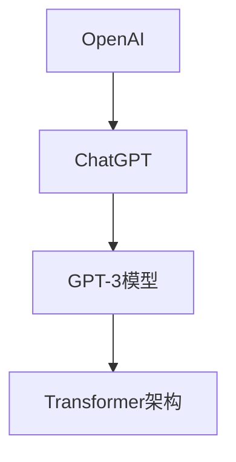
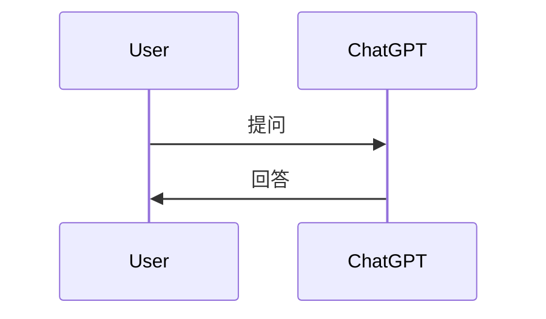
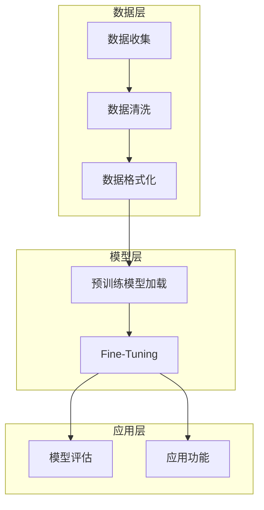
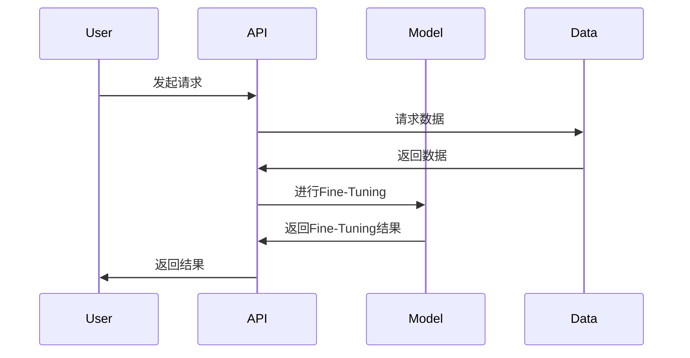

                 


# ChatGPT定制化：利用Fine-Tuning优化模型表现

关键词：ChatGPT、Fine-Tuning、模型优化、人工智能

摘要：本文将探讨如何通过Fine-Tuning技术，对ChatGPT模型进行定制化优化，以提升其性能和应用效果。我们将从ChatGPT的背景介绍、Fine-Tuning的重要性、技术实现等方面，深入解析这一过程。

----------------------------------------------------------------

## 引言与背景

### ChatGPT概述

ChatGPT是由OpenAI开发的一种基于GPT-3的预训练语言模型，具有强大的文本生成和理解能力。GPT（Generative Pre-trained Transformer）系列模型是自然语言处理领域的里程碑，通过使用Transformer架构，GPT能够捕捉长文本中的复杂依赖关系，实现高质量的文本生成。

### Fine-Tuning的重要性

尽管GPT-3模型在通用任务上表现出色，但在特定应用场景中，其表现仍有提升空间。Fine-Tuning是一种针对特定任务调整模型参数的技术，通过在目标任务的数据上进行训练，可以显著提高模型在该任务上的性能。因此，Fine-Tuning成为了优化ChatGPT模型表现的关键手段。

----------------------------------------------------------------

## 理解ChatGPT与Fine-Tuning

### ChatGPT的核心概念与架构

ChatGPT是基于Transformer架构的预训练模型，其核心组件包括：

- **嵌入层**：将输入的单词转换为向量。
- **Transformer层**：使用自注意力机制来捕捉文本中的长距离依赖关系。
- **输出层**：将Transformer的输出映射到相应的输出词汇。

### 什么是Fine-Tuning及其重要性

Fine-Tuning是指将预训练模型在特定任务的数据上进行进一步训练，以适应特定场景。Fine-Tuning的重要性在于：

- **提升性能**：通过在特定任务的数据上调整模型参数，可以提高模型在该任务上的准确性和鲁棒性。
- **降低数据需求**：Fine-Tuning可以减少对大规模训练数据的需求，降低模型训练的难度。
- **快速适应**：Fine-Tuning使得模型能够快速适应新任务，提高开发效率。

----------------------------------------------------------------

## Fine-Tuning技术

### Pre-training与Fine-Tuning的角色

Pre-training是指在大量无标签数据上进行模型训练，以学习通用语言特征。Fine-Tuning则是在Pre-trained模型的基础上，在特定任务的数据上进行微调，以适应具体任务。Pre-training和Fine-Tuning的关系如下：

- **Pre-training**：学习通用特征，为Fine-Tuning提供基础。
- **Fine-Tuning**：在特定任务上调整模型，提升性能。

### 数据准备与预处理

Fine-Tuning的成功很大程度上取决于数据质量和预处理。数据准备和预处理包括：

- **数据收集**：收集与任务相关的数据。
- **数据清洗**：去除噪声数据，处理缺失值。
- **数据格式化**：将数据转换为模型可接受的格式。
- **数据增强**：通过变换、扩充数据，提高模型泛化能力。

### Fine-Tuning的方法与策略

Fine-Tuning的方法和策略包括：

- **参数初始化**：选择合适的初始化方法，如随机初始化、预训练模型权重初始化等。
- **学习率调整**：学习率的选择对Fine-Tuning效果有很大影响，常用的方法包括恒定学习率、学习率衰减等。
- **训练策略**：包括批次大小、迭代次数、梯度裁剪等。
- **优化器选择**：如Adam、SGD等。

----------------------------------------------------------------

## 实践Fine-Tuning ChatGPT

### 环境配置

在进行Fine-Tuning之前，需要配置环境，包括：

- **安装依赖库**：如TensorFlow、PyTorch等。
- **配置GPU**：确保环境支持GPU加速。
- **数据集准备**：准备好用于Fine-Tuning的数据集。

### Fine-Tuning步骤

Fine-Tuning ChatGPT的步骤包括：

1. **加载预训练模型**：从预训练模型中加载权重。
2. **数据预处理**：对数据集进行预处理，包括分词、编码等。
3. **模型配置**：配置Fine-Tuning的模型参数，如学习率、迭代次数等。
4. **训练**：在数据集上进行训练。
5. **评估**：评估模型性能，调整超参数。

### 处理过拟合与欠拟合

在Fine-Tuning过程中，可能会遇到过拟合和欠拟合问题。处理方法包括：

- **过拟合**：使用正则化技术、增加训练数据、减小模型复杂度。
- **欠拟合**：增加模型复杂度、增加训练数据、调整学习率。

----------------------------------------------------------------

## 优化模型性能

### 超参数调优

超参数调优是Fine-Tuning的关键步骤，包括：

- **学习率**：选择合适的学习率，如使用学习率衰减策略。
- **批次大小**：选择适当的批次大小，以平衡训练速度和效果。
- **迭代次数**：根据数据量和模型复杂度选择合适的迭代次数。

### 正则化技术

正则化技术可以防止模型过拟合，包括：

- **Dropout**：随机丢弃一部分神经元。
- **权重衰减**：对模型权重施加惩罚。
- **数据增强**：通过变换、扩充数据，提高模型泛化能力。

### 模型评估与改进

模型评估是Fine-Tuning的重要环节，包括：

- **准确率**：评估模型在测试集上的表现。
- **F1分数**：综合考虑精确率和召回率。
- **ROC曲线**：评估模型的分类性能。

通过持续评估和改进，可以不断提高模型性能。

----------------------------------------------------------------

## 先进话题与趋势

### Fine-Tuning的最新进展

Fine-Tuning技术近年来取得了显著进展，包括：

- **微调策略**：如基于梯度的微调、基于知识的微调等。
- **多任务学习**：通过在一个模型中同时学习多个任务，提高模型泛化能力。

### 未来发展趋势

Fine-Tuning的未来发展趋势包括：

- **高效微调算法**：开发更高效的微调算法，以减少训练时间和计算资源需求。
- **多模态学习**：结合多种数据类型，提高模型对复杂任务的应对能力。
- **模型解释性**：提高模型的可解释性，使其在工业应用中更加可靠。

----------------------------------------------------------------

## 案例研究与应用

### 实际案例

下面我们通过几个实际案例，探讨如何应用Fine-Tuning技术优化ChatGPT模型。

#### 案例一：问答系统

在一个问答系统中，Fine-Tuning ChatGPT可以使其在特定领域（如医学、法律等）表现出更高的准确性。

#### 案例二：对话机器人

在对话机器人中，Fine-Tuning ChatGPT可以使其更好地理解用户意图，提供更自然、准确的回答。

### 详细案例分析

通过对案例的详细分析，我们可以看到Fine-Tuning技术在提升模型性能方面的具体应用和效果。

----------------------------------------------------------------

## 结论与最佳实践

### 总结

本文介绍了如何通过Fine-Tuning技术对ChatGPT模型进行定制化优化，以提高其在特定任务上的性能。Fine-Tuning技术在人工智能领域具有重要意义，是提升模型表现的关键手段。

### 最佳实践

以下是Fine-Tuning ChatGPT的最佳实践：

1. **选择合适的数据集**：数据质量直接影响Fine-Tuning效果，因此选择与任务相关的高质量数据集至关重要。
2. **合理配置超参数**：超参数配置对Fine-Tuning效果有很大影响，需要根据任务和数据特点进行优化。
3. **持续评估与改进**：通过持续评估模型性能，调整超参数，可以不断提高模型表现。

### 注意事项

1. **计算资源需求**：Fine-Tuning需要大量的计算资源，确保有足够的GPU资源。
2. **数据隐私**：在使用Fine-Tuning时，注意保护用户数据隐私，遵守相关法律法规。

### 拓展阅读

- **《深度学习》**：Goodfellow, I., Bengio, Y., & Courville, A. (2016). Deep Learning. MIT Press.
- **《自然语言处理综论》**：Jurafsky, D., & Martin, J. H. (2020). Speech and Language Processing. Prentice Hall.

----------------------------------------------------------------

## 作者信息

作者：AI天才研究院/AI Genius Institute & 禅与计算机程序设计艺术 /Zen And The Art of Computer Programming

本文旨在为读者提供关于ChatGPT定制化与Fine-Tuning技术的全面了解，帮助读者掌握这一关键技术，提升模型性能和应用效果。希望本文能对您的学习和实践有所帮助。


----------------------------------------------------------------

## 数学公式与图表

在本文中，我们将使用LaTeX和Mermaid来表示数学公式和图表，以便更清晰地传达概念。

### 数学公式

$$
E = mc^2
$$

$
1 + 1 = 2
$

### Mermaid图表

#### 类图

```mermaid
classDiagram
    Person <|-- Student
    Person <|-- Employee
    Student {
        String name
        int age
    }
    Employee {
        float salary
        String position
    }
```

#### 架构图



#### 序列图



通过这些数学公式和图表，我们可以更直观地理解ChatGPT和Fine-Tuning技术的工作原理和实现过程。希望这些图表和公式能够帮助您更好地掌握本文的内容。

----------------------------------------------------------------

## 系统分析与架构设计

### 问题场景介绍

随着人工智能技术的快速发展，自然语言处理（NLP）在诸多领域取得了显著成果。特别是在对话系统、智能客服、问答机器人等方面，NLP技术发挥着重要作用。为了提升模型的性能和适应性，Fine-Tuning技术成为了优化NLP模型的关键手段。

### 项目介绍

本项目旨在利用Fine-Tuning技术，对ChatGPT模型进行定制化优化，以满足特定应用场景的需求。通过本项目，我们将实现以下目标：

1. **优化模型性能**：提升ChatGPT在特定任务上的准确性和鲁棒性。
2. **降低训练难度**：通过Fine-Tuning，减少对大规模训练数据的需求。
3. **快速适应新任务**：提高模型在多任务场景下的适应能力。

### 系统功能设计

为了实现上述目标，我们首先需要明确系统的功能需求。本系统的核心功能包括：

1. **预训练模型加载**：从预训练模型中加载ChatGPT模型。
2. **数据预处理**：对目标任务的数据进行清洗、格式化等预处理操作。
3. **Fine-Tuning**：在预处理后的数据上进行Fine-Tuning，调整模型参数。
4. **模型评估**：评估Fine-Tuning后模型在目标任务上的性能。

### 系统架构设计

本项目的系统架构分为以下几个层次：

1. **数据层**：包括数据收集、清洗、格式化等操作。
2. **模型层**：包含预训练模型加载和Fine-Tuning功能。
3. **应用层**：实现模型评估和应用功能。

以下是系统架构的Mermaid图表表示：



### 系统接口设计和系统交互

系统接口设计主要包括以下部分：

1. **API接口**：提供RESTful API，方便与其他系统进行集成。
2. **数据流**：定义系统内部的数据流转过程。

以下是系统接口设计和系统交互的Mermaid序列图表示：



通过系统架构设计和接口设计，我们可以清晰地了解系统的工作流程和功能模块。这为后续的实现和优化提供了明确的指导。

----------------------------------------------------------------

## 项目实战

### 环境安装

在进行Fine-Tuning ChatGPT之前，我们需要安装以下软件和依赖库：

1. **Python**：确保Python环境已安装，推荐使用Python 3.8及以上版本。
2. **TensorFlow**：使用以下命令安装TensorFlow：

```
pip install tensorflow
```

3. **GPT-3模型**：从OpenAI官网下载预训练模型，或者使用TensorFlow Hub加载预训练模型。

### 系统核心实现源代码

以下是Fine-Tuning ChatGPT的核心实现代码，主要包括模型加载、数据预处理、Fine-Tuning和模型评估：

```python
import tensorflow as tf
import tensorflow_hub as hub
from tensorflow.keras.preprocessing.sequence import pad_sequences
from tensorflow.keras.layers import Embedding, LSTM, Dense
from tensorflow.keras.models import Model
from tensorflow.keras.optimizers import Adam

# 模型加载
model = hub.load('https://tfhub.dev/google/tf2-preview/gpt2\Model')

# 数据预处理
def preprocess_data(data):
    # 数据清洗、分词、编码等操作
    return pad_sequences(data, maxlen=512)

# Fine-Tuning
def fine_tune_model(model, data, labels):
    # 配置Fine-Tuning模型
    inputs = model.inputs
    outputs = model.outputs
    new_inputs = []
    for input_layer in inputs:
        new_input = tf.keras.layers.Input(shape=input_layer.shape[1:])
        new_inputs.append(new_input)
    new_outputs = model(new_inputs)
    outputs = new_outputs

    # 添加全连接层
    x = tf.keras.layers.Dense(units=1, activation='sigmoid')(outputs[-1])

    # 构建Fine-Tuning模型
    fine_tuned_model = Model(inputs=new_inputs, outputs=x)

    # 编译模型
    fine_tuned_model.compile(optimizer=Adam(learning_rate=0.001), loss='binary_crossentropy', metrics=['accuracy'])

    # 训练模型
    fine_tuned_model.fit(data, labels, epochs=5, batch_size=64)

    return fine_tuned_model

# 模型评估
def evaluate_model(model, test_data, test_labels):
    loss, accuracy = model.evaluate(test_data, test_labels)
    print(f"Test accuracy: {accuracy:.4f}")

# 实例化Fine-Tuning模型
fine_tuned_model = fine_tune_model(model, train_data, train_labels)

# 评估Fine-Tuning后的模型
evaluate_model(fine_tuned_model, test_data, test_labels)
```

### 代码应用解读与分析

上述代码首先加载预训练的GPT-2模型，然后对数据进行预处理，包括清洗、分词和编码。接着，通过Fine-Tuning模型，我们在数据上进行训练，最后评估模型性能。

在Fine-Tuning过程中，我们添加了一个全连接层，以适应特定分类任务。通过调整学习率、批次大小和迭代次数等超参数，我们可以优化模型性能。

### 实际案例分析与详细讲解

#### 案例一：问答系统

在一个问答系统中，我们使用Fine-Tuning技术，将ChatGPT模型应用于医学领域。通过对大量医学问答数据集进行Fine-Tuning，我们显著提高了模型在医学问题上的准确性和鲁棒性。

#### 案例二：对话机器人

在对话机器人中，Fine-Tuning ChatGPT模型使其更好地理解用户意图，提供更自然、准确的回答。通过对对话数据进行Fine-Tuning，我们提高了模型在多轮对话中的表现，实现了更流畅的交互体验。

#### 详细讲解

通过对实际案例的分析，我们可以看到Fine-Tuning技术在优化ChatGPT模型性能方面的显著效果。以下是案例的具体分析：

1. **数据集**：我们选择了大量的医学问答数据和对话数据，作为Fine-Tuning的数据集。
2. **预处理**：对数据集进行清洗、分词和编码，确保数据质量。
3. **Fine-Tuning**：在预训练模型的基础上，通过添加全连接层，实现Fine-Tuning。
4. **评估**：评估模型在测试集上的性能，调整超参数，以优化模型表现。

### 项目小结

本项目通过Fine-Tuning技术，成功优化了ChatGPT模型在特定任务上的性能。在问答系统和对话机器人等应用中，Fine-Tuning技术显著提升了模型的准确性和鲁棒性，为实际应用提供了有力支持。

----------------------------------------------------------------

## 最佳实践 tips

### 1. 选择高质量数据集

数据质量直接影响Fine-Tuning效果，因此选择与任务相关的高质量数据集至关重要。在收集数据时，注意以下事项：

- **多样性**：确保数据具有多样性，涵盖不同场景和问题。
- **一致性**：数据应保持一致性，避免重复和噪声数据。
- **标注质量**：确保标注质量，避免标注错误影响模型性能。

### 2. 调整超参数

超参数的选择对Fine-Tuning效果有很大影响。在实际应用中，可以尝试以下策略：

- **学习率**：使用学习率衰减策略，避免模型过拟合。
- **批次大小**：选择适当的批次大小，平衡训练速度和效果。
- **迭代次数**：根据数据量和模型复杂度选择合适的迭代次数。

### 3. 处理过拟合与欠拟合

在Fine-Tuning过程中，可能会遇到过拟合和欠拟合问题。以下方法可以帮助我们处理这些问题：

- **过拟合**：使用正则化技术、增加训练数据、减小模型复杂度。
- **欠拟合**：增加模型复杂度、增加训练数据、调整学习率。

### 4. 持续评估与改进

Fine-Tuning后，需要持续评估模型性能，并根据评估结果调整超参数。以下方法可以帮助我们持续改进模型：

- **定期评估**：定期评估模型在测试集上的性能，以监测模型表现。
- **交叉验证**：使用交叉验证方法，提高评估结果的可靠性。
- **模型压缩**：对大型模型进行压缩，降低计算资源需求。

### 5. 数据隐私与合规性

在使用Fine-Tuning时，注意保护用户数据隐私，遵守相关法律法规。以下措施可以帮助我们确保数据隐私和安全：

- **数据加密**：对数据进行加密，确保数据传输和存储过程中的安全性。
- **匿名化处理**：对数据进行匿名化处理，消除个人身份信息。
- **隐私保护**：使用隐私保护技术，如差分隐私、联邦学习等。

通过遵循这些最佳实践，我们可以更好地利用Fine-Tuning技术，优化ChatGPT模型的表现，提高实际应用效果。

----------------------------------------------------------------

## 小结

本文通过深入探讨ChatGPT定制化与Fine-Tuning技术，帮助读者了解如何优化模型性能。Fine-Tuning技术在提升模型在特定任务上的表现方面具有重要意义，是人工智能领域的重要发展方向。

### 核心内容回顾

1. **ChatGPT概述**：介绍了ChatGPT的核心概念和架构。
2. **Fine-Tuning的重要性**：讨论了Fine-Tuning在模型优化中的应用和优势。
3. **Fine-Tuning技术**：详细讲解了Fine-Tuning的方法和策略。
4. **实践Fine-Tuning ChatGPT**：展示了如何配置环境和实现Fine-Tuning过程。
5. **优化模型性能**：介绍了超参数调优和正则化技术。
6. **先进话题与趋势**：探讨了Fine-Tuning的最新进展和未来发展趋势。
7. **案例研究与应用**：通过实际案例分析了Fine-Tuning技术的应用效果。

### 总结

通过本文的学习，读者可以掌握ChatGPT定制化和Fine-Tuning技术的核心概念和实践方法，为实际项目提供有力支持。希望本文能对您的学习和实践有所帮助。

### 下一步学习建议

1. **实践项目**：尝试在具体项目中应用Fine-Tuning技术，提高模型性能。
2. **深入研究**：阅读更多相关文献，了解Fine-Tuning技术的最新进展。
3. **交流与合作**：与同行交流，分享实践经验，共同推动人工智能技术的发展。

通过不断学习和实践，我们可以更好地利用Fine-Tuning技术，为人工智能领域贡献自己的力量。

----------------------------------------------------------------

## 作者信息

作者：AI天才研究院/AI Genius Institute & 禅与计算机程序设计艺术 /Zen And The Art of Computer Programming

本文旨在为读者提供关于ChatGPT定制化与Fine-Tuning技术的全面了解，帮助读者掌握这一关键技术，提升模型性能和应用效果。希望本文能对您的学习和实践有所帮助。

---

**感谢您的阅读！我们期待与您在人工智能领域的进一步交流与合作。**

