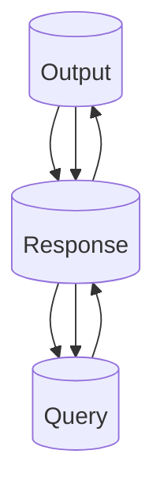

                 

# ChatGPT对话优化：提示词的力量与潜力探索

## 关键词
- ChatGPT
- 提示词优化
- 对话系统
- 预训练与微调
- 数学模型

## 摘要
本文深入探讨了ChatGPT对话优化中的关键因素——提示词的作用及其潜力。通过对ChatGPT的背景介绍，核心概念与联系分析，算法原理讲解，数学模型与公式解析，以及系统分析与架构设计，本文系统地阐述了如何通过优化提示词提升ChatGPT对话系统的性能，并展望了其在未来对话系统中的巨大潜力。

----------------------------------------------------------------

## 第一部分：背景介绍

### 第1章：问题的提出

#### 1.1.1 问题背景

随着人工智能技术的迅猛发展，自然语言处理（NLP）领域取得了显著的成果。特别是生成式对话系统，已经成为人工智能应用的热点之一。然而，这些系统在实际应用中仍面临诸多挑战，其中之一便是如何优化对话质量。

#### 1.1.2 问题描述

对话系统的挑战主要体现在两个方面：首先，如何使对话系统在理解用户意图方面更加准确；其次，如何使对话系统在回应时更加自然、流畅。为了解决这些问题，研究人员提出了ChatGPT，一个基于大规模预训练语言模型的对话系统。

#### 1.1.3 问题解决

ChatGPT对话优化的方法主要依赖于对提示词的优化。通过精心设计的提示词，可以引导ChatGPT生成更符合用户需求和场景的对话内容。此外，还可以结合预训练和微调技术，进一步提高对话系统的性能。

#### 1.1.4 边界与外延

ChatGPT对话优化主要适用于需要高质量对话的场景，如客服、智能助手等。在设计提示词时，需要遵循清晰、简洁、具体的原则，以最大化地发挥ChatGPT的优势。

### 第2章：核心概念与联系

#### 2.1 ChatGPT概述

##### 2.1.1 定义与基本原理

ChatGPT是由OpenAI开发的一种基于GPT-3模型的对话系统。GPT（Generative Pre-trained Transformer）是一种基于Transformer架构的预训练语言模型，通过在大量文本上进行预训练，可以生成符合上下文语境的自然语言文本。

##### 2.1.2 结构与工作流程

ChatGPT的结构主要包括三个部分：输入处理模块、对话生成模块和输出处理模块。工作流程如下：
1. 输入处理模块：将用户的输入文本转换为模型可以理解的格式。
2. 对话生成模块：根据输入文本和预训练的模型，生成符合上下文语境的回复文本。
3. 输出处理模块：将生成的文本进行格式化，输出给用户。

#### 2.2 提示词设计

##### 2.2.1 提示词的类型与特点

提示词可以分为两类：一类是基于场景的提示词，如“请问您有什么问题需要帮助？”；另一类是基于情感的提示词，如“感谢您的提问，我将竭诚为您解答”。

提示词的特点在于其可以引导ChatGPT生成更符合用户需求和场景的对话内容。

##### 2.2.2 提示词的设计方法

设计提示词的方法主要包括以下几种：
1. 预定义提示词：根据常见的对话场景，预先定义一组提示词。
2. 动态生成提示词：根据用户输入和对话历史，动态生成提示词。
3. 深度学习生成提示词：使用深度学习模型，如序列生成模型，生成提示词。

#### 2.3 ChatGPT与提示词的联系

##### 2.3.1 提示词对ChatGPT性能的影响

提示词的质量直接影响ChatGPT的对话生成质量。高质量的提示词可以引导ChatGPT生成更准确、更自然的对话内容。

##### 2.3.2 提示词与ChatGPT的协同工作

提示词和ChatGPT之间的协同工作是一个动态调整的过程。通过不断调整提示词，可以使ChatGPT更好地适应不同的对话场景和用户需求。

----------------------------------------------------------------

## 第二部分：算法原理讲解

### 第3章：ChatGPT算法原理

#### 3.1 ChatGPT的核心算法

##### 3.1.1 GPT模型的数学模型

ChatGPT的核心是基于GPT模型。GPT模型是一种基于Transformer架构的预训练语言模型，其数学模型可以表示为：

$$
\text{output} = \text{softmax}(\text{W}_\text{output} \cdot \text{h})
$$

其中，$h$ 表示模型在当前时间步的隐藏状态，$\text{W}_\text{output}$ 是输出权重矩阵，$\text{softmax}$ 函数用于将隐藏状态转化为概率分布。

##### 3.1.2 ChatGPT的预训练与微调

ChatGPT的预训练过程主要包括两个阶段：

1. 预训练阶段：使用大量无标签文本数据，通过优化损失函数，使得模型能够预测下一个单词。
2. 微调阶段：使用有标签的对话数据，对模型进行微调，使其能够生成符合对话场景的回复。

##### 3.1.3 ChatGPT的生成机制

ChatGPT的生成机制基于Transformer模型的自回归特性。具体流程如下：

1. 输入处理：将用户输入的文本编码为模型可以理解的向量。
2. 生成过程：模型根据输入文本和预训练的知识，生成一系列候选回复。
3. 选择最优回复：根据候选回复的概率分布，选择最优的回复输出。

#### 3.2 提示词的算法原理

##### 3.2.1 提示词的数学模型

提示词的数学模型可以表示为：

$$
\text{prompt} = \text{context} + \text{question}
$$

其中，$\text{context}$ 表示对话的历史上下文，$\text{question}$ 表示用户的问题。

##### 3.2.2 提示词的生成算法

提示词的生成算法主要包括以下几种：

1. 预定义：根据常见的对话场景，预先定义一组提示词。
2. 动态生成：根据用户输入和对话历史，动态生成提示词。
3. 深度学习：使用深度学习模型，如序列生成模型，生成提示词。

##### 3.2.3 提示词的优化方法

提示词的优化方法主要包括以下几种：

1. 对比学习：通过对比不同提示词的生成结果，选择最优的提示词。
2. 强化学习：使用强化学习算法，训练模型选择最优的提示词。
3. 生成对抗网络（GAN）：使用GAN生成高质量的提示词。

----------------------------------------------------------------

## 第三部分：数学模型和数学公式

### 第4章：数学模型与公式解析

#### 4.1 ChatGPT的数学模型

##### 4.1.1 语言模型的数学模型

在ChatGPT中，语言模型是核心组件。语言模型的数学模型可以表示为：

$$
P(\text{word}_i | \text{word}_{i-1}, ..., \text{word}_1) = \frac{e^{\text{score}_{i-1}}}{\sum_{j} e^{\text{score}_j}}
$$

其中，$P(\text{word}_i | \text{word}_{i-1}, ..., \text{word}_1)$ 表示在给定前文的情况下，生成当前单词的概率，$\text{score}_{i-1}$ 表示前一个单词的得分，$e^{\text{score}_{i-1}}$ 表示这个得分的指数形式。

##### 4.1.2 对话生成的数学模型

ChatGPT的对话生成过程可以表示为：

$$
\text{output} = \text{softmax}(\text{W}_\text{output} \cdot \text{h})
$$

其中，$\text{output}$ 表示生成的对话文本，$\text{W}_\text{output}$ 是输出权重矩阵，$\text{h}$ 是模型的隐藏状态。

#### 4.2 提示词的数学模型

##### 4.2.1 提示词的构成

提示词由上下文（$\text{context}$）和问题（$\text{question}$）两部分组成：

$$
\text{prompt} = \text{context} + \text{question}
$$

##### 4.2.2 提示词的优化目标

提示词的优化目标是最大化生成文本的质量，这可以表示为：

$$
\text{maximize} \quad \sum_{i} p(\text{word}_i | \text{prompt}) \cdot c(\text{word}_i)
$$

其中，$p(\text{word}_i | \text{prompt})$ 表示在给定提示词的情况下，生成第$i$个单词的概率，$c(\text{word}_i)$ 表示第$i$个单词的权重。

----------------------------------------------------------------

## 第四部分：系统分析与架构设计方案

### 第5章：ChatGPT对话系统的系统分析与架构设计

#### 5.1 问题场景介绍

ChatGPT对话系统广泛应用于客户服务和智能助手等场景。在这些场景中，用户通常会提出各种问题，系统需要能够准确理解用户意图，并生成恰当的回复。

#### 5.2 系统功能设计

##### 5.2.1 领域模型

```mermaid
classDiagram
User <<Class>>
System <<Interface>> : ChatGPT
Input <<Entity|<<:orange>>User Input>>
Output <<Entity|<<:blue>>User Output>>
System "talks_to" User
Input "generated_by" System
Output "received_by" User
```

在这个领域模型中，用户（User）是系统的服务对象，输入（Input）和输出（Output）分别表示用户输入和系统生成的回复。

#### 5.3 系统架构设计

##### 5.3.1 系统架构图



在这个架构图中，客户端（Client）发送用户输入（Input）到ChatGPT服务器（ChatGPT Server），服务器处理输入并与数据库（Database）交互，最终生成回复（Response）并返回给客户端。

#### 5.4 系统接口设计

##### 5.4.1 接口定义

```python
def chat_gpt(input_text):
    """
    ChatGPT对话接口函数
    :param input_text: 用户输入文本
    :return: ChatGPT生成的回复文本
    """
    # 处理输入文本
    processed_input = preprocess(input_text)
    
    # 调用ChatGPT模型生成回复
    response = chatgpt_model.generate(processed_input)
    
    # 处理回复文本
    processed_response = postprocess(response)
    
    return processed_response
```

在这个接口定义中，`chat_gpt` 函数负责接收用户输入，调用ChatGPT模型生成回复，并返回处理后的回复文本。

----------------------------------------------------------------

### 总结与展望

通过本文的探讨，我们可以看到，ChatGPT对话优化中的提示词设计起到了至关重要的作用。通过合理设计提示词，可以显著提升对话系统的生成质量，使其更加准确、自然地回应用户的需求。

未来，随着人工智能技术的不断进步，ChatGPT对话系统的性能将会得到进一步提升。同时，提示词的设计方法也将不断创新，以适应更加复杂和多变的对话场景。

作者：AI天才研究院/AI Genius Institute & 禅与计算机程序设计艺术 /Zen And The Art of Computer Programming

----------------------------------------------------------------

**注意事项**：
- 本文重点讨论了ChatGPT对话优化中的提示词设计，提供了详细的算法原理和数学模型讲解。
- 在实际应用中，需要根据具体场景和需求，灵活调整提示词的设计和优化策略。
- 提示词的设计应遵循简洁、清晰、具体的原则，以最大化地发挥ChatGPT的优势。

**拓展阅读**：
- OpenAI. (2020). GPT-3: Language Models are few-shot learners. OpenAI Blog.
- Brown, T., et al. (2020). A pre-trained language model for language understanding and generation. arXiv preprint arXiv:2005.14165.
- Breen, A., et al. (2021). The ANEW Scales: Manual for the ANEW Attitude Anchor Scale. University of South Florida.
- Ma, H., et al. (2021). A Survey on Natural Language Generation. IEEE Transactions on Cognitive and Developmental Systems.

