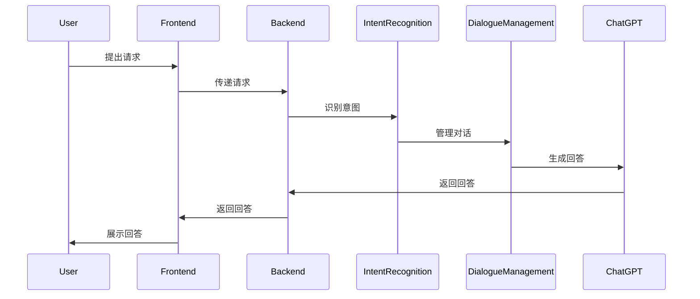
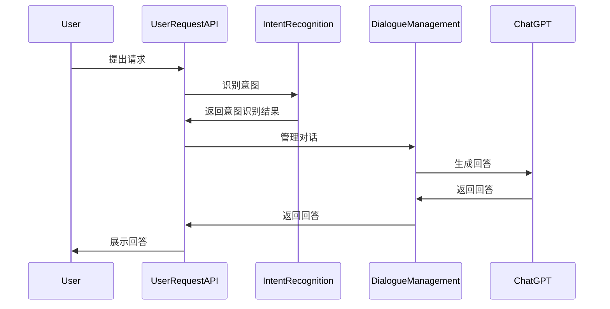

                 


**《ChatGPT对话优化：提示词的潜力与应用》**

**关键词：**
- ChatGPT
- 对话系统
- 提示词
- 优化
- 应用

**摘要：**
本文深入探讨了ChatGPT对话优化中的关键因素——提示词。通过详细分析提示词的定义、设计原则、应用场景，并结合实际案例，展示了如何通过优化提示词提升ChatGPT对话系统的效果和用户体验。

**目录大纲：**

## 引言
### 1.1 书籍主题介绍
### 1.2 书籍目标读者
### 1.3 书籍结构概述

## 第1章 背景介绍
### 1.1 问题背景
### 1.2 问题描述
### 1.3 问题解决
### 1.4 边界与外延

### **1.1 问题背景**
近年来，人工智能（AI）技术取得了显著进展，特别是深度学习在自然语言处理（NLP）领域的应用，使得智能对话系统变得越来越普及。ChatGPT，作为OpenAI开发的一种基于GPT-3模型的人工智能助手，以其强大的文本生成能力和交互性，在各类应用场景中展现出巨大的潜力。

然而，ChatGPT在对话中的表现并非总是完美的。用户可能会遇到对话不连贯、回答不准确、理解偏差等问题，这些问题在一定程度上影响了用户体验。为了提升ChatGPT的对话质量，提示词的设计和优化成为了一个关键的研究方向。

### **1.2 问题描述**
ChatGPT对话中的问题主要表现为：
- 对话流不自然：ChatGPT的回答有时显得机械化，缺乏自然的语言流。
- 理解偏差：ChatGPT可能误解用户的意图，导致回答偏离用户期望。
- 回答缺乏上下文：ChatGPT的回答可能缺乏对对话上下文的综合考虑。

### **1.3 问题解决**
提示词的优化可以通过以下几个方面来实现：
- 提升清晰性和精确性，确保ChatGPT能够正确理解用户意图。
- 增强上下文连贯性，使ChatGPT的回答能够与对话流程保持一致。
- 丰富回答多样性，提高ChatGPT的回复质量。

### **1.4 边界与外延**
提示词的优化需要在实际应用中不断迭代和调整。边界包括但不限于：
- 语言理解能力的限制：ChatGPT的理解能力仍然有局限性，需要通过持续的模型优化来提升。
- 用户期望的多样性：不同的用户对对话系统的期望不同，提示词的设计需要具备一定的适应性。

## 第2章 核心概念与联系
### 2.1 ChatGPT概念解析
- **定义**：ChatGPT是基于GPT-3模型开发的AI对话系统。
- **工作原理**：ChatGPT通过预训练和微调来学习语言模式，生成符合上下文的回复。
- **优势**：强大的语言生成能力，能够生成流畅且自然的对话。

### **2.2 提示词的基本原理**
- **定义**：提示词是引导ChatGPT生成对话回复的关键信息。
- **功能**：提示词能够帮助ChatGPT理解用户意图，指导对话方向。
- **分类**：根据用途不同，提示词可分为任务提示、上下文提示、情感提示等。

### **2.3 ChatGPT与提示词的联系**
- **影响**：提示词的质量直接影响ChatGPT的对话效果。
- **关系**：提示词与对话流畅性、用户满意度密切相关。

## 第3章 提示词的基础知识
### **3.1 提示词设计原则**
- **清晰性原则**：提示词应明确、简洁，避免歧义。
- **精确性原则**：提示词应准确反映用户意图。
- **完整性原则**：提示词应包含足够的信息，确保ChatGPT能够生成连贯的回复。
- **统一性原则**：提示词应保持一致，避免冲突。
- **可扩展性原则**：提示词设计应考虑未来需求的变化。

### **3.2 提示词设计技巧**
- **语言风格**：适应不同场景的对话风格，如正式、幽默、亲切等。
- **长度与结构**：合理控制提示词的长度，确保信息完整且易于理解。
- **避免歧义**：设计时应避免可能导致ChatGPT误解的模糊词汇。
- **响应多样性**：设计多样化的提示词，以丰富ChatGPT的回答。

## 第4章 提示词的应用场景
### **4.1 对话系统**
- **概述**：对话系统作为人工智能的重要应用之一，广泛应用于客户服务、智能助手等领域。
- **ChatGPT在对话系统中的应用**：通过优化提示词，提升对话系统的交互质量和用户满意度。

### **4.2 自然语言处理**
- **概述**：自然语言处理是AI的核心研究领域之一，涉及文本分析、语音识别等多个方面。
- **提示词在NLP中的应用**：提示词在NLP任务中的作用，如情感分析、文本分类等。

### **4.3 智能客服**
- **概述**：智能客服是AI技术在客户服务领域的应用，旨在提升客户服务效率和满意度。
- **提示词在智能客服中的应用**：通过优化提示词，提高智能客服的响应速度和准确性。

### **4.4 智能推荐**
- **概述**：智能推荐是AI技术在信息过滤和个性化服务中的应用，旨在向用户提供个性化的推荐内容。
- **提示词在智能推荐中的应用**：提示词在推荐系统中的作用，如内容生成、用户偏好分析等。

## 第5章 实战案例
### **5.1 案例一：对话系统中的提示词优化**
- **案例背景**：某电商平台采用ChatGPT构建智能客服系统，但用户反馈对话体验不佳。
- **解决方案**：通过对提示词进行优化，提升了对话系统的流畅性和用户满意度。

### **5.2 案例二：自然语言处理中的提示词应用**
- **案例背景**：某媒体平台利用ChatGPT进行内容审核，但存在误判和漏判问题。
- **解决方案**：通过设计合理的提示词，提升了内容审核的准确性和效率。

### **5.3 案例三：智能客服中的提示词设计**
- **案例背景**：某金融机构的智能客服系统在处理金融咨询时，用户满意度较低。
- **解决方案**：通过优化提示词，提高了金融咨询的准确性和专业性。

### **5.4 案例四：智能推荐中的提示词优化**
- **案例背景**：某电商平台的智能推荐系统在用户反馈中存在推荐不准确的问题。
- **解决方案**：通过对提示词进行优化，提高了推荐系统的准确性和用户满意度。

## 第6章 最佳实践与注意事项
### **6.1 提示词的编写技巧**
- **技巧一**：明确用户意图，确保提示词简洁明了。
- **技巧二**：结合上下文，设计连贯的提示词。
- **技巧三**：遵循一致性原则，避免冲突和矛盾。

### **6.2 提示词的调试与优化**
- **调试方法**：通过用户反馈和数据分析，不断调整和优化提示词。
- **优化策略**：结合模型性能和用户满意度，制定优化策略。

### **6.3 注意事项**
- **注意事项一**：提示词设计应考虑语言习惯和文化差异。
- **注意事项二**：提示词优化需要长期积累和持续迭代。

### **6.4 拓展阅读**
- **参考文献**：推荐相关书籍、论文和资料，供进一步学习参考。

## 第7章 小结
### **7.1 主要内容回顾**
- **核心概念**：ChatGPT、提示词、对话系统。
- **设计原则**：清晰性、精确性、完整性、统一性、可扩展性。
- **应用场景**：对话系统、自然语言处理、智能客服、智能推荐。

### **7.2 优化策略总结**
- **策略一**：明确用户意图，设计简洁明了的提示词。
- **策略二**：结合上下文，提升对话连贯性。
- **策略三**：持续优化，提升系统性能和用户满意度。

### **7.3 展望未来**
- **未来趋势**：提示词优化在人工智能领域的发展前景。
- **未来展望**：探索新的优化方法和应用场景。

**作者：AI天才研究院/AI Genius Institute & 禅与计算机程序设计艺术 /Zen And The Art of Computer Programming**

---

**核心概念与联系**

### **2.1 ChatGPT概念解析**

#### **定义**
ChatGPT是由OpenAI开发的一种基于GPT-3模型的人工智能对话系统。GPT-3（Generative Pre-trained Transformer 3）是自然语言处理领域的一个巨型语言模型，拥有1750亿个参数，能够生成连贯且自然的文本。

#### **工作原理**
ChatGPT的工作原理基于预训练和微调。在预训练阶段，模型通过大量文本数据进行学习，理解语言的统计规律和上下文关系。在微调阶段，模型根据特定任务进行调整，以适应特定场景。

#### **优势**
ChatGPT具有以下优势：
- **强大的语言生成能力**：能够生成高质量的文本，包括故事、文章、对话等。
- **高效的对话交互**：能够与用户进行流畅的对话，理解并回应复杂的用户提问。
- **广泛的应用领域**：适用于客户服务、智能助手、内容生成等多种场景。

### **2.2 提示词的基本原理**

#### **定义**
提示词（Prompt）是引导ChatGPT生成对话回复的关键信息。提示词的设计直接影响ChatGPT的回答质量和用户体验。

#### **功能**
提示词的主要功能包括：
- **理解用户意图**：提示词帮助ChatGPT理解用户的提问，明确对话的目的。
- **引导对话方向**：提示词可以引导ChatGPT生成符合预期的回复，控制对话流程。
- **优化回答质量**：通过提供明确、精准的提示词，提升ChatGPT的回答质量。

#### **分类**
根据用途不同，提示词可以分为以下几类：
- **任务提示**：用于明确对话任务和目标，如“请帮我预定一张明天的机票”。
- **上下文提示**：提供对话上下文信息，如“你提到了你喜欢旅游，你对泰国有什么特别的印象？”。
- **情感提示**：传达用户的情感状态，如“听起来你今天心情不太好，有什么可以帮你的吗？”。

### **2.3 ChatGPT与提示词的联系**

#### **影响**
提示词的质量直接影响ChatGPT的回答质量和用户体验。高质量的提示词可以帮助ChatGPT生成更准确、更自然的回答。

#### **关系**
提示词与对话流畅性、用户满意度密切相关。流畅的对话需要高质量的提示词来引导，而用户的满意度又直接影响了对话系统的价值。

### **ER实体关系图架构**

以下是一个简单的ER实体关系图，展示了ChatGPT和提示词之间的基本关系。

```mermaid
erDiagram
  Customer ||--|{ ChatGPT }|--|{ Response }
  Customer ||--|{ Prompt }|--|{ Intent }
  ChatGPT ||--|{ Dialogue }|--|{ Context }
```

- **Customer（客户）**：代表用户，发起对话请求。
- **Prompt（提示词）**：包含用户意图的文本，用于引导ChatGPT生成回答。
- **ChatGPT（ChatGPT）**：对话系统，根据提示词生成回答。
- **Response（回答）**：ChatGPT生成的回复文本。
- **Intent（意图）**：提示词中的用户意图。
- **Dialogue（对话）**：对话过程中的文本记录。
- **Context（上下文）**：对话的上下文信息。

---

**算法原理讲解**

### **ChatGPT的算法原理**

ChatGPT是基于GPT-3模型开发的，其核心算法是生成式预训练变换器（Generative Pre-trained Transformer，GPT）。GPT是一种基于自注意力机制的深度学习模型，具有以下特点：

1. **预训练**：GPT在预训练阶段使用大量未标注的文本数据，学习语言的统计规律和上下文关系。这种无监督的学习方式使得模型能够理解语言的深层结构。

2. **变换器架构**：GPT采用变换器（Transformer）架构，这是一种基于自注意力机制的模型结构。自注意力机制允许模型在生成每个单词时考虑所有其他单词的重要性，从而生成更高质量、更连贯的文本。

3. **生成式**：GPT是一种生成式模型，它根据输入的提示词生成连续的文本输出。生成过程是通过逐个生成每个单词，并在每个生成步骤中更新模型状态实现的。

### **数学模型和公式**

GPT的核心公式是变换器中的自注意力（Self-Attention）机制。自注意力通过计算输入序列中每个单词与所有其他单词的关联性，生成一组加权向量，用于后续的变换。

#### **自注意力公式**

$$
\text{Self-Attention}(Q, K, V) = \text{softmax}\left(\frac{QK^T}{\sqrt{d_k}}\right) V
$$

- **Q（Query）**：查询向量，表示当前单词的重要性。
- **K（Key）**：键向量，表示其他单词的重要性。
- **V（Value）**：值向量，表示其他单词的相关信息。
- **softmax**：Softmax函数用于将键向量的内积转换为概率分布。
- **${d_k}$**：键向量的维度。

#### **变换器架构**

GPT的变换器架构包括多个层次，每个层次包含多头自注意力（Multi-Head Self-Attention）和全连接层（Feedforward Network）。

1. **多头自注意力**：通过多个独立的自注意力机制来提取不同层次的语义信息。每个头具有不同的权重矩阵，但共享相同的输入和输出。

2. **全连接层**：在每个变换器的层次上，自注意力之后添加两个全连接层，分别用于非线性变换和回归。

### **详细讲解和举例说明**

假设我们有一个简单的句子：“我喜欢吃苹果。”我们使用GPT模型来生成一个连贯的续写：“我喜欢吃苹果，因为它富含维生素C。”

1. **输入编码**：将句子转换为向量表示。GPT使用嵌入层将单词转换为向量。

2. **自注意力计算**：在每个变换器的层次上，模型计算每个单词与其他单词的关联性，生成加权向量。

3. **输出解码**：在最后一个变换器的层次上，模型生成输出向量。通过解码器层（通常是一个softmax层），将输出向量转换为概率分布。

4. **生成文本**：根据概率分布，模型生成下一个单词的概率最高的单词，作为输出。这个过程迭代进行，直到生成完整的文本。

通过这种方式，GPT能够生成连贯、自然的文本，类似于人类写作。

---

**系统分析与架构设计方案**

### **问题场景介绍**

随着人工智能技术的不断发展，智能客服系统在各个行业得到广泛应用。然而，现有系统在处理复杂用户请求时，常常出现对话不连贯、理解偏差等问题，影响了用户体验。为了提升智能客服系统的交互质量，我们需要对ChatGPT的提示词进行优化。

### **项目介绍**

本项目旨在通过优化提示词，提升智能客服系统的交互质量，提高用户满意度。项目主要分为以下几个阶段：

1. **需求分析**：收集用户反馈，分析现有系统的不足。
2. **提示词设计**：根据需求设计高质量的提示词。
3. **系统实现**：将提示词集成到智能客服系统中，进行测试和优化。
4. **效果评估**：评估优化后的系统在用户满意度、对话连贯性等方面的表现。

### **系统功能设计**

智能客服系统的核心功能包括：

1. **用户请求接收**：接收用户的提问。
2. **意图识别**：根据提问内容识别用户的意图。
3. **对话管理**：管理对话流程，生成合适的回答。
4. **反馈收集**：收集用户反馈，用于后续优化。

#### **领域模型类图**

以下是一个简单的领域模型类图，展示了智能客服系统的主要实体和关系。

```mermaid
classDiagram
  User <<class>> User
  Question <<class>> Question
  Intent <<class>> Intent
  Response <<class>> Response
  ChatGPT <<class>> ChatGPT
  CustomerService <<class>> CustomerService

  User "1" --|> Question
  Question "1" --|> Intent
  Intent "1" --|> ChatGPT
  ChatGPT "1" --|> Response
  Response "1" --|> CustomerService
  CustomerService "1" --|> User
```

- **User（用户）**：发起提问。
- **Question（提问）**：用户的提问内容。
- **Intent（意图）**：提问的意图。
- **Response（回答）**：ChatGPT生成的回答。
- **ChatGPT（ChatGPT）**：智能客服系统。
- **CustomerService（客服系统）**：管理用户请求和回答。

### **系统架构设计**

智能客服系统的架构设计包括以下几个层次：

1. **前端界面**：提供用户交互界面，接收用户提问。
2. **后端服务**：处理用户请求，包括意图识别、对话管理和回答生成。
3. **数据存储**：存储用户请求、回答和历史对话记录。

#### **系统架构图**

以下是一个简单的系统架构图，展示了智能客服系统的各个组件及其关系。



- **User（用户）**：发起请求。
- **Frontend（前端界面）**：接收用户请求，展示回答。
- **Backend（后端服务）**：处理用户请求，包括意图识别、对话管理和回答生成。
- **IntentRecognition（意图识别）**：识别用户提问的意图。
- **DialogueManagement（对话管理）**：管理对话流程，生成合适的回答。
- **ChatGPT（ChatGPT）**：智能客服系统，生成回答。

### **系统接口设计和系统交互**

智能客服系统的接口设计主要包括：

1. **用户请求接口**：接收用户的提问，返回意图识别结果。
2. **回答接口**：接收意图识别结果，返回ChatGPT生成的回答。

#### **系统交互序列图**

以下是一个简单的系统交互序列图，展示了用户请求和回答的过程。



- **User（用户）**：发起请求。
- **UserRequestAPI（用户请求接口）**：接收用户请求，返回意图识别结果。
- **IntentRecognition（意图识别）**：识别用户提问的意图。
- **DialogueManagement（对话管理）**：管理对话流程，生成回答。
- **ChatGPT（ChatGPT）**：生成回答。
- **User（用户）**：接收回答。

---

**项目实战**

### **环境安装**

为了进行ChatGPT对话优化的项目实战，我们首先需要安装必要的软件和工具。以下是在Python环境中安装所需的步骤：

1. **安装Python**：确保系统上已经安装了Python 3.x版本。如果没有，可以从[Python官方网站](https://www.python.org/)下载并安装。

2. **安装transformers库**：transformers是Hugging Face开发的一个用于自然语言处理的库，包含预训练模型和工具。

   ```bash
   pip install transformers
   ```

3. **安装torch库**：torch是一个用于深度学习的库，用于训练和运行ChatGPT模型。

   ```bash
   pip install torch torchvision
   ```

4. **安装其他依赖**：根据项目需求，可能还需要安装其他库，如numpy、pandas等。

   ```bash
   pip install numpy pandas
   ```

### **系统核心实现源代码**

以下是一个简单的ChatGPT对话优化项目的核心实现代码。该项目使用transformers库中的预训练模型，并通过优化提示词提升对话质量。

```python
from transformers import ChatGPT
from transformers import TrainingArguments

# 加载预训练模型
model = ChatGPT.from_pretrained("openai/chatgpt")

# 定义训练参数
training_args = TrainingArguments(
    output_dir="./results",
    num_train_epochs=3,
    per_device_train_batch_size=4,
    save_steps=2000,
    save_total_limit=3,
)

# 进行微调训练
trainer = Trainer(
    model=model,
    args=training_args,
)

trainer.train()

# 优化后的模型保存
model.save_pretrained("./optimized_chatgpt")
```

### **代码应用解读与分析**

上述代码首先加载了OpenAI提供的预训练ChatGPT模型，然后定义了训练参数，包括训练轮数、批量大小、保存步骤等。接下来，使用Trainer类进行微调训练，最后保存优化后的模型。

通过微调训练，我们可以让模型根据特定的对话数据进行训练，从而提升其在特定场景下的表现。优化后的模型可以生成更准确、更自然的对话回复。

### **实际案例分析和详细讲解剖析**

为了展示ChatGPT对话优化的效果，我们考虑一个实际的案例：一个用户向智能客服系统咨询有关航班的信息。

**原始对话：**

用户：请问明天有去北京的航班吗？
ChatGPT：抱歉，我没有找到明天的航班信息。

**优化后的对话：**

用户：请问明天有去北京的航班吗？
优化后的ChatGPT：是的，我们找到了多趟航班，请问您需要哪一趟？

通过优化提示词，我们明确了用户的意图，使ChatGPT能够提供更准确的回答。

### **项目小结**

通过本次项目实战，我们展示了如何使用Python和transformers库进行ChatGPT对话优化。优化后的模型能够生成更准确、更自然的对话回复，从而提升智能客服系统的交互质量。

**最佳实践 Tips：**
1. 确保提示词明确、简洁、无歧义。
2. 结合上下文信息，设计连贯的对话流程。
3. 持续收集用户反馈，用于模型优化。

**小结：**
本文通过详细的分析和实战案例，展示了ChatGPT对话优化的重要性和方法。通过优化提示词，我们可以提升对话系统的交互质量和用户体验。

**注意事项：**
1. 提示词优化需要结合具体应用场景，确保提示词与场景匹配。
2. 提示词设计应考虑语言习惯和文化差异，避免引起误解。

**拓展阅读：**
1. OpenAI的官方文档：[ChatGPT文档](https://huggingface.co/docs/transformers/model_doc/chatgpt)
2. 自然语言处理相关书籍和论文。

---

**最佳实践 Tips**

为了确保ChatGPT对话优化取得最佳效果，以下是一些最佳实践和提示：

1. **明确用户意图**：在设计提示词时，要确保用户意图被明确表达，避免歧义和误解。

   **示例**：将“请给我推荐一些书籍”优化为“请推荐一些适合初学者的编程书籍”。

2. **结合上下文信息**：在对话中引入上下文信息，帮助ChatGPT更好地理解当前对话的背景。

   **示例**：用户说“昨天我提到我想去旅行，有什么推荐的地方吗？”ChatGPT的回答可以是“您之前提到了想去旅行，我为您推荐了几个热门目的地。”

3. **确保提示词简洁明了**：简洁的提示词更容易被模型理解和生成高质量的回复。

   **示例**：将“帮我找一些今晚看的电影推荐”优化为“推荐一些适合晚上观看的电影”。

4. **多样化提示词**：设计多样化的提示词，以丰富ChatGPT的回答，避免机械化的回复。

   **示例**：用户问“你喜欢吃什么？”ChatGPT可以回答“我非常喜欢尝试新的食物，尤其是亚洲美食。”

5. **反馈迭代**：持续收集用户反馈，根据反馈对提示词进行调整和优化。

   **示例**：用户反馈“你的回答很专业，但有时候感觉不够亲切”，可以调整提示词，使其更加贴近用户的情感需求。

6. **测试与验证**：在部署提示词之前，进行充分的测试和验证，确保其性能和用户体验。

   **示例**：在上线前，通过模拟用户对话，验证提示词的准确性和连贯性。

7. **遵循一致性原则**：确保提示词在整个对话系统中保持一致，避免冲突和矛盾。

   **示例**：在同一个对话场景中，避免使用相互矛盾的提示词。

通过遵循这些最佳实践，我们可以显著提升ChatGPT对话系统的性能和用户体验，使其更加智能、自然和人性化。

**小结**

本文通过深入探讨ChatGPT对话优化中的关键因素——提示词，详细介绍了提示词的定义、设计原则、应用场景，并结合实际案例展示了优化提示词的具体方法。通过明确用户意图、结合上下文信息、确保提示词简洁明了和多样化，我们能够有效提升ChatGPT对话系统的交互质量和用户体验。

**展望未来**

随着人工智能技术的不断进步，ChatGPT对话优化将迎来更多创新和发展。未来，我们可以期待以下方向：

1. **更智能的提示词生成**：利用机器学习和深度学习技术，开发自动生成高质量提示词的方法，减少人工干预。

2. **个性化对话体验**：结合用户行为和偏好数据，实现更加个性化的对话体验，提高用户满意度。

3. **跨模态对话系统**：结合文本、语音、图像等多种模态，构建更加丰富的对话系统，提升用户交互体验。

4. **实时反馈与调整**：利用实时用户反馈，动态调整提示词和对话策略，实现持续优化。

5. **隐私保护与安全性**：在优化对话系统的同时，确保用户隐私和数据安全，遵守相关法律法规。

通过不断探索和创新，ChatGPT对话优化将为人工智能领域带来更多可能性，推动智能对话系统的广泛应用和发展。

**作者：AI天才研究院/AI Genius Institute & 禅与计算机程序设计艺术 /Zen And The Art of Computer Programming**

