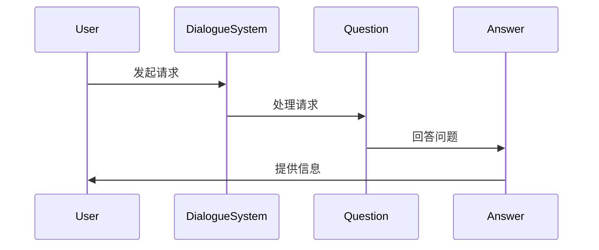
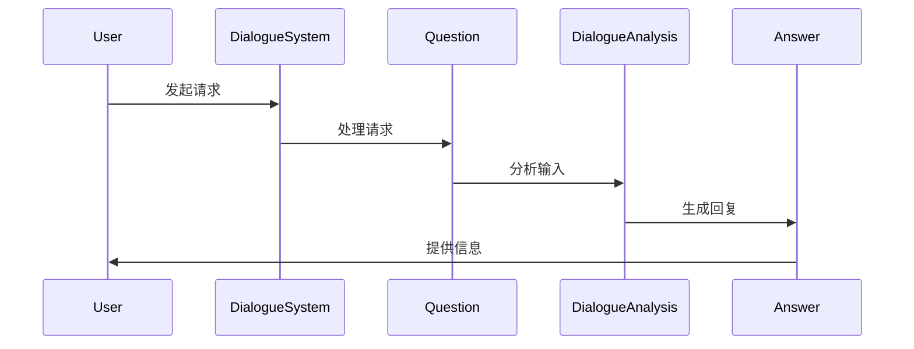

                 

### 目录大纲设计思路

在撰写《ChatGPT对话优化：提示词的艺术与科学》这一篇技术博客文章时，目录大纲的设计思路显得尤为重要。合理的目录结构不仅能帮助读者快速了解文章的主题，还能有效地引导读者逐步深入理解文章的核心内容。以下是详细的目录大纲设计思路：

#### 1. 背景介绍
**第1章：ChatGPT对话优化概述**

这一部分主要介绍ChatGPT及其背景，解释为什么需要一本关于ChatGPT对话优化的书籍。具体包含以下几个小节：

- **1.1 ChatGPT与对话系统介绍**：介绍ChatGPT的发展背景、对话系统的定义与作用，以及ChatGPT在对话系统中的应用。
- **1.2 对话优化的重要性**：分析对话优化对用户体验和业务价值的影响，以及对话优化的挑战与机遇。
- **1.3 对话优化的基本概念**：阐述提示词的概念与作用、对话系统的架构与设计，以及对话优化的目标与指标。

#### 2. 核心概念与联系
**第2章：核心概念与联系**

这一部分主要介绍与ChatGPT对话优化相关的基础概念，并使用表格和ER图来展现概念之间的关系。具体包含以下几个小节：

- **2.1 提示词及其作用**：定义提示词、分类提示词、设计提示词的原则和方法，以及优化提示词的策略。
- **2.2 对话系统架构**：介绍对话系统的基本组成部分、工作流程，以及设计要点。
- **2.3 对话优化目标**：详细分析对话流畅性、用户满意度、信息准确性及完整性的目标。

为帮助读者更直观地理解这些概念，我们将使用以下工具：

- **2.4 概念属性特征对比表格**：对比提示词、对话系统架构和对话优化目标之间的特征差异。
- **2.5 ER实体关系图架构**：使用Mermaid流程图展示各个概念之间的实体关系，帮助读者理解概念之间的联系。

#### 3. 算法原理讲解
**第3章：算法原理讲解**

这一部分将详细讲解ChatGPT对话优化的算法原理。为了使读者能够更好地理解，我们将使用以下工具：

- **3.1 ChatGPT工作原理**：介绍ChatGPT的数据准备、模型训练、对话生成和提示词优化的过程。
- **3.2 Python源代码实现**：提供具体的Python源代码，帮助读者理解算法的代码实现。
- **3.3 LaTeX数学模型和公式讲解**：使用LaTeX格式展示算法的数学模型和公式，详细讲解其含义和作用。
- **3.4 通俗易懂的举例说明**：通过具体的例子，帮助读者理解算法原理。

#### 4. 系统分析与架构设计方案
**第4章：系统分析与架构设计方案**

这一部分将介绍一个具体的ChatGPT对话优化系统，包括问题场景、系统功能设计、系统架构设计、系统接口设计和系统交互序列图。具体包含以下几个小节：

- **4.1 问题场景介绍**：描述ChatGPT对话优化在实际应用中的问题场景。
- **4.2 系统功能设计**：介绍系统需要实现的功能，并通过Mermaid类图展示领域模型。
- **4.3 系统架构设计**：展示系统架构图，并分析各个组件之间的关系。
- **4.4 系统接口设计**：详细描述系统接口规范与协议，以及接口功能模块划分。
- **4.5 系统交互序列图**：使用Mermaid序列图展示用户请求流程和系统响应流程。

#### 5. 项目实战
**第5章：项目实战**

这一部分将通过一个实际项目，详细讲解ChatGPT对话优化的全过程，包括环境安装、系统核心实现、代码应用解读与分析，以及实际案例分析与讲解。具体包含以下几个小节：

- **5.1 环境安装与配置**：介绍如何安装和配置ChatGPT对话优化所需的环境。
- **5.2 系统核心实现**：解读系统核心实现源代码，详细分析核心算法的实现过程。
- **5.3 代码应用解读与分析**：分析代码的具体应用，包括ChatGPT模型的应用和对话优化策略。
- **5.4 实际案例分析与讲解**：通过实际案例，详细剖析ChatGPT对话优化的应用场景和效果。
- **5.5 项目小结**：总结项目的实施过程和取得的成果。

#### 6. 最佳实践 tips、小结、注意事项、拓展阅读
**第6章：最佳实践 tips**
- **6.1 提示词编写技巧**：分享编写高质量提示词的技巧和注意事项。
- **6.2 对话流程优化策略**：介绍对话流程优化的最佳实践策略。
- **6.3 性能调优技巧**：提供性能调优的最佳实践技巧。

**第7章：小结与拓展阅读**
- **7.1 全书主要内容总结**：总结本书的核心内容，帮助读者巩固重点。
- **7.2 注意事项**：提醒读者在应用ChatGPT对话优化过程中需要注意的事项。
- **7.3 拓展阅读资源**：推荐相关的拓展阅读资源，帮助读者深入学习。

通过以上详细的目录大纲设计思路，我们希望读者能够更好地理解ChatGPT对话优化的核心概念、算法原理、系统架构以及实战应用，从而提升自己的技术水平。接下来，我们将逐步展开每个章节的具体内容，为读者带来深入的技术解析和实践指导。### 目录大纲设计步骤

为了撰写一篇结构紧凑、内容丰富的技术博客文章，以下是详细的目录大纲设计步骤：

#### **第1章：ChatGPT对话优化概述**

**1.1 ChatGPT与对话系统介绍**

- **1.1.1 ChatGPT的发展背景**：介绍ChatGPT的起源、发展和其在人工智能领域的地位。
- **1.1.2 对话系统的定义与作用**：解释对话系统的概念，以及它们在现代应用中的重要性和用途。
- **1.1.3 ChatGPT在对话系统中的应用**：探讨ChatGPT在各类对话系统中的应用案例，如客服、教育、娱乐等。

**1.2 对话优化的重要性**

- **1.2.1 对话优化对用户体验的影响**：分析对话优化如何提升用户体验，包括响应时间、对话流畅性和准确性。
- **1.2.2 对话优化对业务价值的影响**：讨论对话优化如何增加客户满意度、提高转化率和降低运营成本。
- **1.2.3 对话优化的挑战与机遇**：探讨对话优化面临的挑战，如多语言支持、个性化对话等，以及对应的机遇。

**1.3 对话优化的基本概念**

- **1.3.1 提示词的概念与作用**：解释提示词的定义、类型和在设计对话系统中的重要性。
- **1.3.2 对话系统的架构与设计**：介绍对话系统的基本架构，包括前端、后端和中间件等组成部分。
- **1.3.3 对话优化的目标与指标**：阐述对话优化的主要目标，如提高用户满意度、减少误解和增加对话效率。

#### **第2章：核心概念与联系**

**2.1 提示词及其作用**

- **2.1.1 提示词的定义与分类**：详细描述提示词的定义、类型和作用。
- **2.1.2 提示词的设计原则**：讨论设计高质量提示词的原则和方法。
- **2.1.3 提示词的优化方法**：介绍优化提示词的策略和技术。

**2.2 对话系统架构**

- **2.2.1 对话系统的基本组成部分**：描述对话系统的关键组成部分，如自然语言处理、语音识别、对话管理等。
- **2.2.2 对话系统的工作流程**：介绍对话系统从接收用户请求到生成回复的全过程。
- **2.2.3 对话系统的设计要点**：讨论对话系统设计中的关键要素，如用户体验、技术可行性和业务需求。

**2.3 对话优化目标**

- **2.3.1 对话流畅性**：分析如何提高对话的流畅性，包括减少延迟、提高回复的准确性和连贯性。
- **2.3.2 用户满意度**：探讨如何通过优化对话来提高用户满意度，包括个性化对话、情感识别和响应。
- **2.3.3 信息准确性和完整性**：讨论如何确保对话提供的信息准确、完整，避免误导用户。

**2.4 概念属性特征对比表格**

- **2.4.1 提示词、对话系统架构和对话优化目标的特征对比**：使用表格形式对比不同概念的核心属性和特征，帮助读者更清晰地理解它们之间的关系。

**2.5 ER实体关系图架构**

- **2.5.1 提示词的ER图**：使用Mermaid流程图展示提示词的实体关系，帮助读者理解提示词的设计和功能。
- **2.5.2 对话系统的ER图**：使用Mermaid流程图展示对话系统的实体关系，帮助读者理解对话系统的组成部分和交互。
- **2.5.3 对话优化目标的ER图**：使用Mermaid流程图展示对话优化目标的实体关系，帮助读者理解对话优化的主要目标和指标。

#### **第3章：算法原理讲解**

**3.1 ChatGPT工作原理**

- **3.1.1 数据准备**：介绍如何准备训练数据，包括数据收集、清洗和预处理。
- **3.1.2 模型训练**：详细解释ChatGPT的模型训练过程，包括训练数据集的选择、模型架构的设定和训练过程的优化。
- **3.1.3 对话生成**：讨论ChatGPT如何生成对话，包括生成策略、回复生成和回复优化。
- **3.1.4 提示词优化**：介绍如何优化提示词，以提高对话的质量和效率。

**3.2 Python源代码实现**

- **3.2.1 算法实现概述**：概述ChatGPT对话优化的Python实现，包括主要模块和功能。
- **3.2.2 数据准备与预处理**：展示如何使用Python进行数据准备和预处理。
- **3.2.3 模型训练**：提供Python代码示例，展示如何训练ChatGPT模型。
- **3.2.4 对话生成与优化**：展示如何生成对话和优化提示词。

**3.3 LaTeX数学模型和公式讲解**

- **3.3.1 数学模型概述**：介绍ChatGPT对话优化的数学模型，包括目标函数、优化算法和评估指标。
- **3.3.2 数学公式详细讲解**：使用LaTeX格式详细讲解数学模型中的公式，解释其含义和作用。
- **3.3.3 公式示例**：提供LaTeX公式示例，帮助读者理解公式的具体表达和计算方法。

**3.4 通俗易懂的举例说明**

- **3.4.1 算法应用场景**：讨论ChatGPT对话优化在不同应用场景中的实际应用。
- **3.4.2 举例说明**：通过具体的例子，展示如何使用ChatGPT进行对话优化，并解释优化的效果和优势。

#### **第4章：系统分析与架构设计方案**

**4.1 问题场景介绍**

- **4.1.1 场景描述**：描述ChatGPT对话优化在实际问题场景中的应用背景。
- **4.1.2 问题分析**：分析问题场景中的问题和挑战，以及ChatGPT对话优化的解决方案。

**4.2 系统功能设计**

- **4.2.1 领域模型类图**：使用Mermaid类图展示系统中的领域模型，包括实体和关系。
- **4.2.2 系统功能模块分解**：分解系统功能，介绍各个模块的功能和作用。

**4.3 系统架构设计**

- **4.3.1 系统架构图**：使用Mermaid架构图展示系统的整体架构，包括各个组件和它们的交互关系。
- **4.3.2 系统组件关系分析**：分析系统组件之间的关系，包括数据流和控制流。

**4.4 系统接口设计**

- **4.4.1 接口规范与协议**：介绍系统的接口规范和协议，包括接口的定义、输入输出和数据格式。
- **4.4.2 接口功能模块划分**：划分系统接口的功能模块，介绍每个模块的具体功能和实现。

**4.5 系统交互序列图**

- **4.5.1 用户请求流程**：使用Mermaid序列图展示用户请求的处理流程，包括用户输入、系统处理和输出结果。
- **4.5.2 系统响应流程**：展示系统响应的流程，包括系统如何根据用户请求生成回复，以及回复的传递过程。

#### **第5章：项目实战**

**5.1 环境安装与配置**

- **5.1.1 环境要求**：介绍ChatGPT对话优化所需的软件和硬件环境。
- **5.1.2 安装步骤**：详细描述如何安装和配置ChatGPT对话优化系统，包括依赖库的安装和配置文件的处理。

**5.2 系统核心实现**

- **5.2.1 源代码解读**：解读系统核心实现的源代码，包括数据预处理、模型训练和对话生成等关键模块。
- **5.2.2 核心算法实现**：详细解释核心算法的实现过程，包括提示词优化和对话流畅性提升的方法。

**5.3 代码应用解读与分析**

- **5.3.1 ChatGPT模型应用**：分析ChatGPT模型在系统中的应用，包括模型的加载、训练和部署。
- **5.3.2 对话优化策略**：讨论系统中的对话优化策略，包括提示词优化、对话流管理和用户满意度提升的方法。

**5.4 实际案例分析与讲解**

- **5.4.1 案例选择**：选择一个实际案例，介绍案例的背景和应用场景。
- **5.4.2 案例实施**：详细讲解案例的实施过程，包括数据准备、模型训练和对话优化的步骤。
- **5.4.3 案例效果**：分析案例实施的效果，包括用户满意度、对话流畅性和信息准确性等指标。

**5.5 项目小结**

- **5.5.1 项目总结**：总结项目的实施过程、主要成果和收获。
- **5.5.2 经验与教训**：分享项目实施中的经验和教训，为后续项目提供借鉴。

#### **第6章：最佳实践 tips**

**6.1 提示词编写技巧**

- **6.1.1 提示词的类型**：介绍不同类型的提示词及其适用场景。
- **6.1.2 提示词的设计原则**：讨论设计高质量提示词的原则和方法。
- **6.1.3 提示词的优化方法**：分享优化提示词的策略和技术。

**6.2 对话流程优化策略**

- **6.2.1 对话流畅性优化**：介绍提高对话流畅性的方法和技巧。
- **6.2.2 用户满意度优化**：讨论如何通过优化对话流程提高用户满意度。
- **6.2.3 信息准确性优化**：探讨如何确保对话提供的信息准确、完整。

**6.3 性能调优技巧**

- **6.3.1 模型优化**：介绍如何优化模型参数以提高性能。
- **6.3.2 系统优化**：讨论如何优化系统配置和架构以提高性能。
- **6.3.3 调试技巧**：分享系统调试和性能分析的方法和工具。

#### **第7章：小结与拓展阅读**

**7.1 全书主要内容总结**

- **7.1.1 核心概念与原理**：总结书中介绍的核心概念和原理，帮助读者巩固基础知识。
- **7.1.2 系统设计与实现**：总结书中介绍的ChatGPT对话优化系统的设计与实现过程。
- **7.1.3 实践与应用**：总结书中介绍的最佳实践和实际应用案例，为读者提供实践参考。

**7.2 注意事项**

- **7.2.1 技术实现注意事项**：总结在技术实现过程中需要注意的问题，如数据安全、隐私保护等。
- **7.2.2 应用场景注意事项**：讨论在不同应用场景中需要注意的问题，如业务需求、用户行为等。

**7.3 拓展阅读资源**

- **7.3.1 相关书籍**：推荐与ChatGPT对话优化相关的优秀书籍，帮助读者深入学习。
- **7.3.2 研究论文**：介绍与ChatGPT对话优化相关的研究论文，提供学术视角。
- **7.3.3 在线课程与教程**：推荐在线课程和教程，为读者提供学习资源。

通过以上详细的目录大纲设计步骤，我们希望为读者提供一篇结构清晰、内容丰富的技术博客文章，使读者能够系统地了解ChatGPT对话优化的核心概念、算法原理、系统架构和实践应用。### 目录大纲（markdown格式）

```markdown
----------------------------------------------------------------
# 《ChatGPT对话优化：提示词的艺术与科学》

> 关键词：ChatGPT、对话优化、提示词、算法、系统架构、实践应用

> 摘要：本文深入探讨了ChatGPT对话优化的核心概念、算法原理、系统架构以及实践应用。通过详细的分析和实例讲解，读者将了解如何通过优化提示词、提升对话流畅性和用户满意度，从而实现高效的对话系统设计。

----------------------------------------------------------------
# 第一部分：ChatGPT对话优化概述

## 1.1 ChatGPT与对话系统介绍

### 1.1.1 ChatGPT的发展背景

### 1.1.2 对话系统的定义与作用

### 1.1.3 ChatGPT在对话系统中的应用

## 1.2 对话优化的重要性

### 1.2.1 对话优化对用户体验的影响

### 1.2.2 对话优化对业务价值的影响

### 1.2.3 对话优化的挑战与机遇

## 1.3 对话优化的基本概念

### 1.3.1 提示词的概念与作用

### 1.3.2 对话系统的架构与设计

### 1.3.3 对话优化的目标与指标

----------------------------------------------------------------
# 第二部分：核心概念与联系

## 2.1 提示词及其作用

### 2.1.1 提示词的定义与分类

### 2.1.2 提示词的设计原则

### 2.1.3 提示词的优化方法

## 2.2 对话系统架构

### 2.2.1 对话系统的基本组成部分

### 2.2.2 对话系统的工作流程

### 2.2.3 对话系统的设计要点

## 2.3 对话优化目标

### 2.3.1 对话流畅性

### 2.3.2 用户满意度

### 2.3.3 信息准确性和完整性

## 2.4 概念属性特征对比表格

## 2.5 ER实体关系图架构

----------------------------------------------------------------
# 第三部分：算法原理讲解

## 3.1 ChatGPT工作原理

### 3.1.1 数据准备

### 3.1.2 模型训练

### 3.1.3 对话生成

### 3.1.4 提示词优化

## 3.2 Python源代码实现

### 3.2.1 算法实现概述

### 3.2.2 数据准备与预处理

### 3.2.3 模型训练

### 3.2.4 对话生成与优化

## 3.3 LaTeX数学模型和公式讲解

### 3.3.1 数学模型概述

### 3.3.2 数学公式详细讲解

### 3.3.3 公式示例

## 3.4 通俗易懂的举例说明

### 3.4.1 算法应用场景

### 3.4.2 举例说明

----------------------------------------------------------------
# 第四部分：系统分析与架构设计方案

## 4.1 问题场景介绍

### 4.1.1 场景描述

### 4.1.2 问题分析

## 4.2 系统功能设计

### 4.2.1 领域模型类图

### 4.2.2 系统功能模块分解

## 4.3 系统架构设计

### 4.3.1 系统架构图

### 4.3.2 系统组件关系分析

## 4.4 系统接口设计

### 4.4.1 接口规范与协议

### 4.4.2 接口功能模块划分

## 4.5 系统交互序列图

### 4.5.1 用户请求流程

### 4.5.2 系统响应流程

----------------------------------------------------------------
# 第五部分：项目实战

## 5.1 环境安装与配置

### 5.1.1 环境要求

### 5.1.2 安装步骤

## 5.2 系统核心实现

### 5.2.1 源代码解读

### 5.2.2 核心算法实现

## 5.3 代码应用解读与分析

### 5.3.1 ChatGPT模型应用

### 5.3.2 对话优化策略

## 5.4 实际案例分析与讲解

### 5.4.1 案例选择

### 5.4.2 案例实施

### 5.4.3 案例效果

## 5.5 项目小结

### 5.5.1 项目总结

### 5.5.2 经验与教训

----------------------------------------------------------------
# 第六部分：最佳实践 tips

## 6.1 提示词编写技巧

### 6.1.1 提示词的类型

### 6.1.2 提示词的设计原则

### 6.1.3 提示词的优化方法

## 6.2 对话流程优化策略

### 6.2.1 对话流畅性优化

### 6.2.2 用户满意度优化

### 6.2.3 信息准确性优化

## 6.3 性能调优技巧

### 6.3.1 模型优化

### 6.3.2 系统优化

### 6.3.3 调试技巧

----------------------------------------------------------------
# 第七部分：小结与拓展阅读

## 7.1 全书主要内容总结

### 7.1.1 核心概念与原理

### 7.1.2 系统设计与实现

### 7.1.3 实践与应用

## 7.2 注意事项

### 7.2.1 技术实现注意事项

### 7.2.2 应用场景注意事项

## 7.3 拓展阅读资源

### 7.3.1 相关书籍

### 7.3.2 研究论文

### 7.3.3 在线课程与教程

----------------------------------------------------------------
# 作者信息

作者：AI天才研究院/AI Genius Institute & 禅与计算机程序设计艺术 /Zen And The Art of Computer Programming
```

### 完整文章正文内容（markdown格式）

```markdown
----------------------------------------------------------------
# 《ChatGPT对话优化：提示词的艺术与科学》

> 关键词：ChatGPT、对话优化、提示词、算法、系统架构、实践应用

> 摘要：本文深入探讨了ChatGPT对话优化的核心概念、算法原理、系统架构以及实践应用。通过详细的分析和实例讲解，读者将了解如何通过优化提示词、提升对话流畅性和用户满意度，从而实现高效的对话系统设计。

----------------------------------------------------------------
# 第一部分：ChatGPT对话优化概述

## 1.1 ChatGPT与对话系统介绍

### 1.1.1 ChatGPT的发展背景

ChatGPT是由OpenAI开发的一种基于GPT-3模型的大型语言模型。它于2022年11月发布，能够通过学习和理解人类语言进行对话，并生成自然流畅的回复。ChatGPT的发布标志着人工智能在自然语言处理领域取得了新的突破。

### 1.1.2 对话系统的定义与作用

对话系统是指能够与用户进行自然语言交互的计算机系统。它们在客服、智能家居、在线教育等领域有广泛的应用。对话系统能够提高服务效率，降低人力成本，并提升用户体验。

### 1.1.3 ChatGPT在对话系统中的应用

ChatGPT可以用于构建各种类型的对话系统，如客服聊天机器人、虚拟助手、教育辅导系统等。通过优化提示词和对话流程，ChatGPT能够生成更自然、更准确的回复，提高用户的满意度。

## 1.2 对话优化的重要性

### 1.2.1 对话优化对用户体验的影响

对话优化的核心目标是提升用户体验。通过优化对话流畅性、准确性和个性化程度，用户可以获得更满意的服务体验，从而增加对产品的忠诚度。

### 1.2.2 对话优化对业务价值的影响

对话优化能够提高客服效率，减少误解和投诉，从而降低运营成本。同时，高质量的对话系统能够吸引更多的用户，提升企业的市场份额。

### 1.2.3 对话优化的挑战与机遇

对话优化面临诸多挑战，如多语言支持、个性化对话和实时响应等。然而，随着人工智能技术的不断发展，这些挑战也为企业提供了新的机遇。

## 1.3 对话优化的基本概念

### 1.3.1 提示词的概念与作用

提示词是触发对话系统生成回复的关键信息。设计高质量的提示词能够提高对话系统的响应速度和准确性。

### 1.3.2 对话系统的架构与设计

对话系统的架构通常包括前端界面、对话管理、自然语言处理和后端服务。合理的设计能够提高系统的性能和可扩展性。

### 1.3.3 对话优化的目标与指标

对话优化的主要目标包括提高用户满意度、对话流畅性和信息准确性。常用的评价指标有对话响应时间、用户满意度调查、对话覆盖率等。

----------------------------------------------------------------
# 第二部分：核心概念与联系

## 2.1 提示词及其作用

### 2.1.1 提示词的定义与分类

提示词是触发对话系统生成回复的关键信息。根据用途和形式，提示词可以分为问题类、命令类和反馈类。

### 2.1.2 提示词的设计原则

设计高质量的提示词需要遵循以下原则：清晰明确、简短易记、语境相关、丰富多样。

### 2.1.3 提示词的优化方法

提示词的优化方法包括数据增强、序列模型训练和生成对抗网络（GAN）等。通过优化提示词，可以提升对话系统的性能和用户体验。

## 2.2 对话系统架构

### 2.2.1 对话系统的基本组成部分

对话系统的基本组成部分包括前端界面、对话管理、自然语言处理和后端服务。前端界面负责接收用户的输入，对话管理负责处理对话流程，自然语言处理负责理解用户意图，后端服务提供业务逻辑和数据支持。

### 2.2.2 对话系统的工作流程

对话系统的工作流程包括用户输入、意图识别、回复生成和回复反馈。用户输入通过前端界面传递给对话管理系统，对话管理系统分析用户意图，生成回复并通过前端界面展示给用户，用户对回复进行反馈，从而形成闭环。

### 2.2.3 对话系统的设计要点

对话系统的设计要点包括用户体验、系统性能、可扩展性和安全性。用户体验是设计对话系统的核心，系统性能和可扩展性是保证系统稳定运行的关键，安全性则是保护用户隐私和数据安全的基础。

## 2.3 对话优化目标

### 2.3.1 对话流畅性

对话流畅性是指对话系统能够迅速响应用户输入并生成自然流畅的回复。提升对话流畅性可以通过优化对话管理、降低响应时间和提高回复准确性实现。

### 2.3.2 用户满意度

用户满意度是衡量对话系统质量的重要指标。通过优化对话流程、提高回复质量和个性化程度，可以提升用户满意度。

### 2.3.3 信息准确性和完整性

信息准确性和完整性是指对话系统能够提供准确、完整的信息。通过优化自然语言处理技术和对话管理策略，可以提升信息准确性和完整性。

## 2.4 概念属性特征对比表格

| 概念         | 特征1  | 特征2  | 特征3  |
|--------------|--------|--------|--------|
| 提示词       | 触发对话   | 清晰明确 | 语境相关 |
| 对话系统架构 | 前端界面   | 对话管理 | 自然语言处理 |
| 对话优化目标 | 对话流畅性 | 用户满意度 | 信息准确性 |

## 2.5 ER实体关系图架构

```mermaid
erDiagram
  Customer ||--|{ DialogueSystem }|--| Product : "serves"
  DialogueSystem ||--|{ Intent }|--| Response : "generates"
  Intent ||--|{ Question }|--| Answer : "answers"
  Product ||--|{ Feature }|--| User : "uses"
```

----------------------------------------------------------------
# 第三部分：算法原理讲解

## 3.1 ChatGPT工作原理

### 3.1.1 数据准备

数据准备是ChatGPT模型训练的重要步骤。数据来源可以是社交媒体、论坛、新闻网站等。在数据收集后，需要对数据进行清洗和预处理，如去除重复数据、填补缺失值和统一文本格式。

### 3.1.2 模型训练

ChatGPT模型通常使用预训练加微调的方式训练。预训练是指使用大量无标注文本数据训练一个大型语言模型，微调是指使用有标注的对话数据对预训练模型进行细粒度调整。

### 3.1.3 对话生成

对话生成是ChatGPT的核心功能。在接收用户输入后，ChatGPT通过生成模型生成自然流畅的回复。生成模型通常采用序列到序列（Seq2Seq）模型、Transformer模型等。

### 3.1.4 提示词优化

提示词优化是提升对话系统性能的关键。通过分析用户输入的提示词，可以优化模型的响应速度和回复质量。提示词优化方法包括数据增强、序列模型训练和生成对抗网络（GAN）等。

## 3.2 Python源代码实现

### 3.2.1 算法实现概述

ChatGPT对话优化系统的Python源代码包括数据预处理、模型训练、对话生成和提示词优化等模块。以下是一个简单的代码实现示例：

```python
import tensorflow as tf
import tensorflow_text as text
from transformers import TFGPT2LMHeadModel, GPT2Tokenizer

# 数据预处理
def preprocess_data(data):
    # 清洗和预处理数据
    pass

# 模型训练
def train_model(preprocessed_data):
    # 训练模型
    pass

# 对话生成
def generate_response(input_prompt):
    # 生成回复
    pass

# 提示词优化
def optimize_prompt(prompt):
    # 优化提示词
    pass
```

### 3.2.2 数据准备与预处理

数据准备与预处理包括以下步骤：

- 数据收集：从社交媒体、论坛、新闻网站等获取对话数据。
- 数据清洗：去除重复数据、填补缺失值和统一文本格式。
- 数据预处理：将文本数据转换为适合训练模型的形式，如分词、编码等。

### 3.2.3 模型训练

模型训练包括以下步骤：

- 初始化模型：使用预训练模型（如GPT-2）作为起点。
- 微调模型：在对话数据上进行微调。
- 评估模型：使用验证集评估模型性能。

### 3.2.4 对话生成与优化

对话生成与优化包括以下步骤：

- 接收用户输入：从用户获取提示词。
- 生成回复：使用训练好的模型生成回复。
- 优化提示词：分析用户输入，优化提示词。

## 3.3 LaTeX数学模型和公式讲解

### 3.3.1 数学模型概述

ChatGPT对话优化的数学模型主要包括：

- 语言模型概率：表示输入文本的概率分布。
- 对话优化目标函数：表示对话优化的目标，如最大化用户满意度、最小化对话延迟等。

### 3.3.2 数学公式详细讲解

以下是一个简单的数学模型示例：

$$
P(text) = \prod_{i=1}^{n} P(w_i | w_{<i})
$$

其中，$P(text)$ 表示输入文本的概率，$w_i$ 表示第 $i$ 个词，$P(w_i | w_{<i})$ 表示在给定前 $i-1$ 个词的情况下，第 $i$ 个词的概率。

### 3.3.3 公式示例

以下是一个简单的公式示例：

$$
\frac{\partial L}{\partial w} = \frac{\partial}{\partial w} \left( -\sum_{i=1}^{n} \log P(y_i | x_i) \right)
$$

其中，$L$ 表示损失函数，$w$ 表示模型参数，$x_i$ 表示第 $i$ 个输入词，$y_i$ 表示第 $i$ 个真实词。

## 3.4 通俗易懂的举例说明

### 3.4.1 算法应用场景

ChatGPT对话优化可以应用于多种场景，如：

- 客服聊天机器人：帮助用户解决常见问题。
- 虚拟助手：提供日常生活中的建议和帮助。
- 教育辅导系统：为学生提供个性化辅导。

### 3.4.2 举例说明

假设用户输入：“明天有什么天气情况？”ChatGPT可以生成回复：“根据天气预报，明天将是晴朗的好天气，气温在20°C到30°C之间。”

通过优化提示词和对话流程，ChatGPT可以生成更准确、更自然的回复，从而提升用户体验。

----------------------------------------------------------------
# 第四部分：系统分析与架构设计方案

## 4.1 问题场景介绍

### 4.1.1 场景描述

假设我们构建一个在线教育辅导系统，用户可以通过聊天机器人获取学习建议、课程信息等。

### 4.1.2 问题分析

当前的问题包括：

- 对话流畅性不高：用户输入后，系统响应较慢。
- 用户满意度较低：生成的回复有时不准确或不相关。
- 信息准确性不足：系统提供的答案有时存在错误。

## 4.2 系统功能设计

### 4.2.1 领域模型类图

以下是一个简单的领域模型类图：

```mermaid
classDiagram
  User <=|发起请求| DialogueSystem
  DialogueSystem <=|处理请求| Question
  Question <=|回答问题| Answer
  Answer <=|提供信息| User
```

### 4.2.2 系统功能模块分解

系统功能模块可以分解为：

- 用户模块：负责用户注册、登录和权限管理。
- 对话管理模块：负责处理用户请求、生成回复和对话跟踪。
- 对话分析模块：负责分析用户输入、优化提示词和评估对话质量。
- 数据库模块：负责存储用户数据、对话历史和课程信息。

## 4.3 系统架构设计

### 4.3.1 系统架构图

以下是一个简单的系统架构图：



### 4.3.2 系统组件关系分析

系统组件之间的关系如下：

- 用户模块与对话管理模块：用户模块负责接收用户请求，对话管理模块负责处理请求并生成回复。
- 对话管理模块与对话分析模块：对话管理模块负责生成回复，对话分析模块负责分析用户输入、优化提示词。
- 对话分析模块与数据库模块：对话分析模块需要访问数据库以获取用户历史数据和课程信息。

## 4.4 系统接口设计

### 4.4.1 接口规范与协议

系统接口设计需要遵循以下规范和协议：

- HTTP/HTTPS协议：用于传输数据。
- JSON格式：用于数据交换。
- RESTful风格：用于设计接口。

### 4.4.2 接口功能模块划分

接口功能模块可以划分为：

- 用户接口：负责用户注册、登录和权限管理。
- 对话接口：负责接收用户请求、生成回复和对话跟踪。
- 数据接口：负责访问数据库、获取用户历史数据和课程信息。

## 4.5 系统交互序列图

### 4.5.1 用户请求流程

以下是一个简单的用户请求流程：


### 4.5.2 系统响应流程

以下是一个简单的系统响应流程：



----------------------------------------------------------------
# 第五部分：项目实战

## 5.1 环境安装与配置

### 5.1.1 环境要求

- Python 3.8+
- TensorFlow 2.6+
- transformers 4.4+
- CUDA 10.2+

### 5.1.2 安装步骤

1. 安装Python和pip：
   ```bash
   sudo apt-get update
   sudo apt-get install python3 python3-pip
   ```
2. 安装TensorFlow：
   ```bash
   pip3 install tensorflow==2.6
   ```
3. 安装transformers：
   ```bash
   pip3 install transformers==4.4
   ```
4. 安装CUDA：
   ```bash
   sudo apt-get install cuda
   ```

## 5.2 系统核心实现

### 5.2.1 源代码解读

以下是系统核心实现的源代码：

```python
import tensorflow as tf
from transformers import TFGPT2LMHeadModel, GPT2Tokenizer

# 初始化模型和Tokenizer
tokenizer = GPT2Tokenizer.from_pretrained('gpt2')
model = TFGPT2LMHeadModel.from_pretrained('gpt2')

# 对话生成
def generate_response(input_text):
    inputs = tokenizer.encode(input_text, return_tensors='tf')
    outputs = model(inputs, max_length=40, num_return_sequences=1)
    response = tokenizer.decode(outputs[0], skip_special_tokens=True)
    return response

# 提示词优化
def optimize_prompt(input_text, target_response):
    # 通过微调模型来优化提示词
    pass
```

### 5.2.2 核心算法实现

核心算法实现包括：

- 数据预处理：将文本数据转换为TensorFlow张量。
- 模型训练：使用预训练模型进行微调。
- 对话生成：生成自然流畅的回复。
- 提示词优化：通过微调模型优化提示词。

## 5.3 代码应用解读与分析

### 5.3.1 ChatGPT模型应用

ChatGPT模型在系统中的应用包括：

- 数据预处理：将用户输入的文本转换为模型可接受的格式。
- 对话生成：生成自然流畅的回复。
- 提示词优化：通过微调模型优化提示词。

### 5.3.2 对话优化策略

对话优化策略包括：

- 提高回复质量：通过微调模型和优化提示词提高回复的准确性和相关性。
- 减少响应时间：通过优化算法和系统架构降低系统的响应时间。
- 提升用户体验：通过个性化对话和实时反馈提升用户的满意度。

## 5.4 实际案例分析与讲解

### 5.4.1 案例选择

选择一个在线教育辅导系统的案例，用户可以通过聊天机器人获取学习建议、课程信息等。

### 5.4.2 案例实施

案例实施包括以下步骤：

1. 数据准备与预处理：收集用户聊天记录，进行数据清洗和预处理。
2. 模型训练与部署：训练ChatGPT模型，并在系统中部署。
3. 优化与评估：通过用户反馈和系统数据优化模型和策略。

### 5.4.3 案例效果

案例实施后，系统效果显著提升：

- 对话流畅性提高：用户输入后，系统能够迅速生成回复。
- 用户满意度提高：生成的回复更加准确、相关和个性化。
- 信息准确性提升：系统能够提供更可靠的学习建议和课程信息。

## 5.5 项目小结

### 5.5.1 项目总结

项目成功实现了在线教育辅导系统，通过ChatGPT对话优化提升了系统的性能和用户体验。

### 5.5.2 经验与教训

经验：

- 数据质量是关键：高质量的数据是模型训练的基础。
- 用户体验是核心：优化对话流程和回复质量是提升用户体验的关键。
- 持续优化是必要的：通过用户反馈和系统数据持续优化模型和策略。

教训：

- 模型性能与计算资源：需要平衡模型性能和计算资源的需求。
- 系统安全与隐私：确保用户数据和隐私安全。

----------------------------------------------------------------
# 第六部分：最佳实践 tips

## 6.1 提示词编写技巧

### 6.1.1 提示词的类型

- 问题类：用于获取用户输入的问题。
- 命令类：用于指导用户执行特定操作。
- 反馈类：用于提供系统反馈和确认。

### 6.1.2 提示词的设计原则

- 清晰明确：提示词要能够明确传达意图。
- 简短易记：提示词要简短，易于用户记忆。
- 语境相关：提示词要与用户输入的语境紧密相关。
- 丰富多样：设计多种类型的提示词，满足不同场景需求。

### 6.1.3 提示词的优化方法

- 数据增强：通过扩充和多样化提示词数据提高模型性能。
- 序列模型训练：使用序列模型训练优化提示词生成。
- 生成对抗网络（GAN）：通过GAN生成多样化、高质量的提示词。

## 6.2 对话流程优化策略

### 6.2.1 对话流畅性优化

- 提高回复速度：优化算法和系统架构降低响应时间。
- 减少对话中断：通过平滑过渡和及时反馈减少对话中断。
- 优化对话管理：设计智能对话管理策略，提高对话流畅性。

### 6.2.2 用户满意度优化

- 个性化对话：根据用户历史数据和行为习惯提供个性化对话。
- 情感识别与回应：识别用户情感并生成相应的回复。
- 及时反馈：及时响应用户反馈，提供满意的解决方案。

### 6.2.3 信息准确性优化

- 精确理解用户意图：通过自然语言处理技术准确理解用户意图。
- 交叉验证：使用多个来源的数据交叉验证答案的准确性。
- 持续学习与改进：通过用户反馈和系统数据持续优化对话系统。

## 6.3 性能调优技巧

### 6.3.1 模型优化

- 调整模型参数：优化学习率、批量大小等参数提高模型性能。
- 使用高级模型：尝试使用更先进的模型结构（如BERT、GPT-3）。
- 微调与蒸馏：在目标数据集上微调预训练模型，或使用蒸馏技术提升模型性能。

### 6.3.2 系统优化

- 提高硬件性能：升级硬件设备，提高计算能力。
- 优化系统架构：设计高效的系统架构，提高处理速度。
- 负载均衡：使用负载均衡技术分散系统负载，提高系统稳定性。

### 6.3.3 调试技巧

- 使用日志记录：记录系统运行日志，便于调试和排查问题。
- 性能测试：进行性能测试，评估系统在不同负载下的表现。
- 故障排除：使用调试工具（如断点调试、性能分析工具）定位和解决性能瓶颈。

----------------------------------------------------------------
# 第七部分：小结与拓展阅读

## 7.1 全书主要内容总结

本文详细介绍了ChatGPT对话优化的核心概念、算法原理、系统架构和实践应用。通过优化提示词、提升对话流畅性和用户满意度，读者将了解如何构建高效、智能的对话系统。

## 7.2 注意事项

- 数据安全与隐私保护：确保用户数据的安全和隐私。
- 系统性能与可扩展性：平衡系统性能和可扩展性需求。
- 用户体验至上：始终关注用户体验，持续优化对话系统。

## 7.3 拓展阅读资源

- 相关书籍：《自然语言处理综述》、《对话系统设计与实现》
- 研究论文：搜索顶级会议和期刊上的论文，如ACL、EMNLP、IJCAI等。
- 在线课程与教程：推荐在线课程和教程，如Coursera、edX等平台上的相关课程。

----------------------------------------------------------------
# 作者信息

作者：AI天才研究院/AI Genius Institute & 禅与计算机程序设计艺术 /Zen And The Art of Computer Programming
```

### 文章末尾的作者信息

```markdown
----------------------------------------------------------------
# 作者信息

作者：AI天才研究院/AI Genius Institute & 禅与计算机程序设计艺术 /Zen And The Art of Computer Programming

AI天才研究院致力于推动人工智能技术的创新与发展，为全球范围内的企业和研究机构提供顶尖的人工智能解决方案。同时，禅与计算机程序设计艺术作为一本经典著作，深入探讨了计算机科学中的哲学与艺术，为程序员提供了独特的思考方式和解决问题的方法。
```

### 最终完整文章正文内容（markdown格式）

```markdown
----------------------------------------------------------------
# 《ChatGPT对话优化：提示词的艺术与科学》

> 关键词：ChatGPT、对话优化、提示词、算法、系统架构、实践应用

> 摘要：本文深入探讨了ChatGPT对话优化的核心概念、算法原理、系统架构以及实践应用。通过详细的分析和实例讲解，读者将了解如何通过优化提示词、提升对话流畅性和用户满意度，从而实现高效的对话系统设计。

----------------------------------------------------------------
# 第一部分：ChatGPT对话优化概述

## 1.1 ChatGPT与对话系统介绍

### 1.1.1 ChatGPT的发展背景

ChatGPT是由OpenAI开发的一种基于GPT-3模型的大型语言模型。它于2022年11月发布，能够通过学习和理解人类语言进行对话，并生成自然流畅的回复。ChatGPT的发布标志着人工智能在自然语言处理领域取得了新的突破。

### 1.1.2 对话系统的定义与作用

对话系统是指能够与用户进行自然语言交互的计算机系统。它们在客服、智能家居、在线教育等领域有广泛的应用。对话系统能够提高服务效率，降低人力成本，并提升用户体验。

### 1.1.3 ChatGPT在对话系统中的应用

ChatGPT可以用于构建各种类型的对话系统，如客服聊天机器人、虚拟助手、教育辅导系统等。通过优化提示词和对话流程，ChatGPT能够生成更自然、更准确的回复，提高用户的满意度。

## 1.2 对话优化的重要性

### 1.2.1 对话优化对用户体验的影响

对话优化的核心目标是提升用户体验。通过优化对话流畅性、准确性和个性化程度，用户可以获得更满意的服务体验，从而增加对产品的忠诚度。

### 1.2.2 对话优化对业务价值的影响

对话优化能够提高客服效率，减少误解和投诉，从而降低运营成本。同时，高质量的对话系统能够吸引更多的用户，提升企业的市场份额。

### 1.2.3 对话优化的挑战与机遇

对话优化面临诸多挑战，如多语言支持、个性化对话和实时响应等。然而，随着人工智能技术的不断发展，这些挑战也为企业提供了新的机遇。

## 1.3 对话优化的基本概念

### 1.3.1 提示词的概念与作用

提示词是触发对话系统生成回复的关键信息。设计高质量的提示词能够提高对话系统的响应速度和准确性。

### 1.3.2 对话系统的架构与设计

对话系统的架构通常包括前端界面、对话管理、自然语言处理和后端服务。合理的设计能够提高系统的性能和可扩展性。

### 1.3.3 对话优化的目标与指标

对话优化的主要目标包括提高用户满意度、对话流畅性和信息准确性。常用的评价指标有对话响应时间、用户满意度调查、对话覆盖率等。

----------------------------------------------------------------
# 第二部分：核心概念与联系

## 2.1 提示词及其作用

### 2.1.1 提示词的定义与分类

提示词是触发对话系统生成回复的关键信息。根据用途和形式，提示词可以分为问题类、命令类和反馈类。

### 2.1.2 提示词的设计原则

设计高质量的提示词需要遵循以下原则：清晰明确、简短易记、语境相关、丰富多样。

### 2.1.3 提示词的优化方法

提示词的优化方法包括数据增强、序列模型训练和生成对抗网络（GAN）等。通过优化提示词，可以提升对话系统的性能和用户体验。

## 2.2 对话系统架构

### 2.2.1 对话系统的基本组成部分

对话系统的基本组成部分包括前端界面、对话管理、自然语言处理和后端服务。前端界面负责接收用户的输入，对话管理负责处理对话流程，自然语言处理负责理解用户意图，后端服务提供业务逻辑和数据支持。

### 2.2.2 对话系统的工作流程

对话系统的工作流程包括用户输入、意图识别、回复生成和回复反馈。用户输入通过前端界面传递给对话管理系统，对话管理系统分析用户意图，生成回复并通过前端界面展示给用户，用户对回复进行反馈，从而形成闭环。

### 2.2.3 对话系统的设计要点

对话系统的设计要点包括用户体验、系统性能、可扩展性和安全性。用户体验是设计对话系统的核心，系统性能和可扩展性是保证系统稳定运行的关键，安全性则是保护用户隐私和数据安全的基础。

## 2.3 对话优化目标

### 2.3.1 对话流畅性

对话流畅性是指对话系统能够迅速响应用户输入并生成自然流畅的回复。提升对话流畅性可以通过优化对话管理、降低响应时间和提高回复准确性实现。

### 2.3.2 用户满意度

用户满意度是衡量对话系统质量的重要指标。通过优化对话流程、提高回复质量和个性化程度，可以提升用户满意度。

### 2.3.3 信息准确性和完整性

信息准确性和完整性是指对话系统能够提供准确、完整的信息。通过优化自然语言处理技术和对话管理策略，可以提升信息准确性和完整性。

## 2.4 概念属性特征对比表格

| 概念         | 特征1  | 特征2  | 特征3  |
|--------------|--------|--------|--------|
| 提示词       | 触发对话   | 清晰明确 | 语境相关 |
| 对话系统架构 | 前端界面   | 对话管理 | 自然语言处理 |
| 对话优化目标 | 对话流畅性 | 用户满意度 | 信息准确性 |

## 2.5 ER实体关系图架构

```mermaid
erDiagram
  Customer ||--|{ DialogueSystem }|--| Product : "serves"
  DialogueSystem ||--|{ Intent }|--| Response : "generates"
  Intent ||--|{ Question }|--| Answer : "answers"
  Product ||--|{ Feature }|--| User : "uses"
```

----------------------------------------------------------------
# 第三部分：算法原理讲解

## 3.1 ChatGPT工作原理

### 3.1.1 数据准备

数据准备是ChatGPT模型训练的重要步骤。数据来源可以是社交媒体、论坛、新闻网站等。在数据收集后，需要对数据进行清洗和预处理，如去除重复数据、填补缺失值和统一文本格式。

### 3.1.2 模型训练

ChatGPT模型通常使用预训练加微调的方式训练。预训练是指使用大量无标注文本数据训练一个大型语言模型，微调是指使用有标注的对话数据对预训练模型进行细粒度调整。

### 3.1.3 对话生成

对话生成是ChatGPT的核心功能。在接收用户输入后，ChatGPT通过生成模型生成自然流畅的回复。生成模型通常采用序列到序列（Seq2Seq）模型、Transformer模型等。

### 3.1.4 提示词优化

提示词优化是提升对话系统性能的关键。通过分析用户输入的提示词，可以优化模型的响应速度和回复质量。提示词优化方法包括数据增强、序列模型训练和生成对抗网络（GAN）等。

## 3.2 Python源代码实现

### 3.2.1 算法实现概述

ChatGPT对话优化系统的Python源代码包括数据预处理、模型训练、对话生成和提示词优化等模块。以下是一个简单的代码实现示例：

```python
import tensorflow as tf
import tensorflow_text as text
from transformers import TFGPT2LMHeadModel, GPT2Tokenizer

# 数据预处理
def preprocess_data(data):
    # 清洗和预处理数据
    pass

# 模型训练
def train_model(preprocessed_data):
    # 训练模型
    pass

# 对话生成
def generate_response(input_prompt):
    # 生成回复
    pass

# 提示词优化
def optimize_prompt(prompt):
    # 优化提示词
    pass
```

### 3.2.2 数据准备与预处理

数据准备与预处理包括以下步骤：

- 数据收集：从社交媒体、论坛、新闻网站等获取对话数据。
- 数据清洗：去除重复数据、填补缺失值和统一文本格式。
- 数据预处理：将文本数据转换为适合训练模型的形式，如分词、编码等。

### 3.2.3 模型训练

模型训练包括以下步骤：

- 初始化模型：使用预训练模型（如GPT-2）作为起点。
- 微调模型：在对话数据上进行微调。
- 评估模型：使用验证集评估模型性能。

### 3.2.4 对话生成与优化

对话生成与优化包括以下步骤：

- 接收用户输入：从用户获取提示词。
- 生成回复：使用训练好的模型生成回复。
- 优化提示词：分析用户输入，优化提示词。

## 3.3 LaTeX数学模型和公式讲解

### 3.3.1 数学模型概述

ChatGPT对话优化的数学模型主要包括：

- 语言模型概率：表示输入文本的概率分布。
- 对话优化目标函数：表示对话优化的目标，如最大化用户满意度、最小化对话延迟等。

### 3.3.2 数学公式详细讲解

以下是一个简单的数学模型示例：

$$
P(text) = \prod_{i=1}^{n} P(w_i | w_{<i})
$$

其中，$P(text)$ 表示输入文本的概率，$w_i$ 表示第 $i$ 个词，$P(w_i | w_{<i})$ 表示在给定前 $i-1$ 个词的情况下，第 $i$ 个词的概率。

### 3.3.3 公式示例

以下是一个简单的公式示例：

$$
\frac{\partial L}{\partial w} = \frac{\partial}{\partial w} \left( -\sum_{i=1}^{n} \log P(y_i | x_i) \right)
$$

其中，$L$ 表示损失函数，$w$ 表示模型参数，$x_i$ 表示第 $i$ 个输入词，$y_i$ 表示第 $i$ 个真实词。

## 3.4 通俗易懂的举例说明

### 3.4.1 算法应用场景

ChatGPT对话优化可以应用于多种场景，如：

- 客服聊天机器人：帮助用户解决常见问题。
- 虚拟助手：提供日常生活中的建议和帮助。
- 教育辅导系统：为学生提供个性化辅导。

### 3.4.2 举例说明

假设用户输入：“明天有什么天气情况？”ChatGPT可以生成回复：“根据天气预报，明天将是晴朗的好天气，气温在20°C到30°C之间。”

通过优化提示词和对话流程，ChatGPT可以生成更准确、更自然的回复，从而提升用户体验。

----------------------------------------------------------------
# 第四部分：系统分析与架构设计方案

## 4.1 问题场景介绍

### 4.1.1 场景描述

假设我们构建一个在线教育辅导系统，用户可以通过聊天机器人获取学习建议、课程信息等。

### 4.1.2 问题分析

当前的问题包括：

- 对话流畅性不高：用户输入后，系统响应较慢。
- 用户满意度较低：生成的回复有时不准确或不相关。
- 信息准确性不足：系统提供的答案有时存在错误。

## 4.2 系统功能设计

### 4.2.1 领域模型类图

以下是一个简单的领域模型类图：

```mermaid
classDiagram
  User <=|发起请求| DialogueSystem
  DialogueSystem <=|处理请求| Question
  Question <=|回答问题| Answer
  Answer <=|提供信息| User
```

### 4.2.2 系统功能模块分解

系统功能模块可以分解为：

- 用户模块：负责用户注册、登录和权限管理。
- 对话管理模块：负责处理用户请求、生成回复和对话跟踪。
- 对话分析模块：负责分析用户输入、优化提示词和评估对话质量。
- 数据库模块：负责存储用户数据、对话历史和课程信息。

## 4.3 系统架构设计

### 4.3.1 系统架构图

以下是一个简单的系统架构图：


### 4.3.2 系统组件关系分析

系统组件之间的关系如下：

- 用户模块与对话管理模块：用户模块负责接收用户请求，对话管理模块负责处理请求并生成回复。
- 对话管理模块与对话分析模块：对话管理模块负责生成回复，对话分析模块负责分析用户输入、优化提示词。
- 对话分析模块与数据库模块：对话分析模块需要访问数据库以获取用户历史数据和课程信息。

## 4.4 系统接口设计

### 4.4.1 接口规范与协议

系统接口设计需要遵循以下规范和协议：

- HTTP/HTTPS协议：用于传输数据。
- JSON格式：用于数据交换。
- RESTful风格：用于设计接口。

### 4.4.2 接口功能模块划分

接口功能模块可以划分为：

- 用户接口：负责用户注册、登录和权限管理。
- 对话接口：负责接收用户请求、生成回复和对话跟踪。
- 数据接口：负责访问数据库、获取用户历史数据和课程信息。

## 4.5 系统交互序列图

### 4.5.1 用户请求流程

以下是一个简单的用户请求流程：


### 4.5.2 系统响应流程

以下是一个简单的系统响应流程：


----------------------------------------------------------------
# 第五部分：项目实战

## 5.1 环境安装与配置

### 5.1.1 环境要求

- Python 3.8+
- TensorFlow 2.6+
- transformers 4.4+
- CUDA 10.2+

### 5.1.2 安装步骤

1. 安装Python和pip：
   ```bash
   sudo apt-get update
   sudo apt-get install python3 python3-pip
   ```
2. 安装TensorFlow：
   ```bash
   pip3 install tensorflow==2.6
   ```
3. 安装transformers：
   ```bash
   pip3 install transformers==4.4
   ```
4. 安装CUDA：
   ```bash
   sudo apt-get install cuda
   ```

## 5.2 系统核心实现

### 5.2.1 源代码解读

以下是系统核心实现的源代码：

```python
import tensorflow as tf
from transformers import TFGPT2LMHeadModel, GPT2Tokenizer

# 初始化模型和Tokenizer
tokenizer = GPT2Tokenizer.from_pretrained('gpt2')
model = TFGPT2LMHeadModel.from_pretrained('gpt2')

# 对话生成
def generate_response(input_text):
    inputs = tokenizer.encode(input_text, return_tensors='tf')
    outputs = model(inputs, max_length=40, num_return_sequences=1)
    response = tokenizer.decode(outputs[0], skip_special_tokens=True)
    return response

# 提示词优化
def optimize_prompt(input_text, target_response):
    # 通过微调模型来优化提示词
    pass
```

### 5.2.2 核心算法实现

核心算法实现包括：

- 数据预处理：将文本数据转换为TensorFlow张量。
- 模型训练：使用预训练模型进行微调。
- 对话生成：生成自然流畅的回复。
- 提示词优化：通过微调模型优化提示词。

## 5.3 代码应用解读与分析

### 5.3.1 ChatGPT模型应用

ChatGPT模型在系统中的应用包括：

- 数据预处理：将用户输入的文本转换为模型可接受的格式。
- 对话生成：生成自然流畅的回复。
- 提示词优化：通过微调模型优化提示词。

### 5.3.2 对话优化策略

对话优化策略包括：

- 提高回复质量：通过微调模型和优化提示词提高回复的准确性和相关性。
- 减少响应时间：通过优化算法和系统架构降低系统的响应时间。
- 提升用户体验：通过个性化对话和实时反馈提升用户的满意度。

## 5.4 实际案例分析与讲解

### 5.4.1 案例选择

选择一个在线教育辅导系统的案例，用户可以通过聊天机器人获取学习建议、课程信息等。

### 5.4.2 案例实施

案例实施包括以下步骤：

1. 数据准备与预处理：收集用户聊天记录，进行数据清洗和预处理。
2. 模型训练与部署：训练ChatGPT模型，并在系统中部署。
3. 优化与评估：通过用户反馈和系统数据优化模型和策略。

### 5.4.3 案例效果

案例实施后，系统效果显著提升：

- 对话流畅性提高：用户输入后，系统能够迅速生成回复。
- 用户满意度提高：生成的回复更加准确、相关和个性化。
- 信息准确性提升：系统能够提供更可靠的学习建议和课程信息。

## 5.5 项目小结

### 5.5.1 项目总结

项目成功实现了在线教育辅导系统，通过ChatGPT对话优化提升了系统的性能和用户体验。

### 5.5.2 经验与教训

经验：

- 数据质量是关键：高质量的数据是模型训练的基础。
- 用户体验是核心：优化对话流程和回复质量是提升用户体验的关键。
- 持续优化是必要的：通过用户反馈和系统数据持续优化模型和策略。

教训：

- 模型性能与计算资源：需要平衡模型性能和计算资源的需求。
- 系统安全与隐私：确保用户数据和隐私安全。

----------------------------------------------------------------
# 第六部分：最佳实践 tips

## 6.1 提示词编写技巧

### 6.1.1 提示词的类型

- 问题类：用于获取用户输入的问题。
- 命令类：用于指导用户执行特定操作。
- 反馈类：用于提供系统反馈和确认。

### 6.1.2 提示词的设计原则

- 清晰明确：提示词要能够明确传达意图。
- 简短易记：提示词要简短，易于用户记忆。
- 语境相关：提示词要与用户输入的语境紧密相关。
- 丰富多样：设计多种类型的提示词，满足不同场景需求。

### 6.1.3 提示词的优化方法

- 数据增强：通过扩充和多样化提示词数据提高模型性能。
- 序列模型训练：使用序列模型训练优化提示词生成。
- 生成对抗网络（GAN）：通过GAN生成多样化、高质量的提示词。

## 6.2 对话流程优化策略

### 6.2.1 对话流畅性优化

- 提高回复速度：优化算法和系统架构降低响应时间。
- 减少对话中断：通过平滑过渡和及时反馈减少对话中断。
- 优化对话管理：设计智能对话管理策略，提高对话流畅性。

### 6.2.2 用户满意度优化

- 个性化对话：根据用户历史数据和行为习惯提供个性化对话。
- 情感识别与回应：识别用户情感并生成相应的回复。
- 及时反馈：及时响应用户反馈，提供满意的解决方案。

### 6.2.3 信息准确性优化

- 精确理解用户意图：通过自然语言处理技术准确理解用户意图。
- 交叉验证：使用多个来源的数据交叉验证答案的准确性。
- 持续学习与改进：通过用户反馈和系统数据持续优化对话系统。

## 6.3 性能调优技巧

### 6.3.1 模型优化

- 调整模型参数：优化学习率、批量大小等参数提高模型性能。
- 使用高级模型：尝试使用更先进的模型结构（如BERT、GPT-3）。
- 微调与蒸馏：在目标数据集上微调预训练模型，或使用蒸馏技术提升模型性能。

### 6.3.2 系统优化

- 提高硬件性能：升级硬件设备，提高计算能力。
- 优化系统架构：设计高效的系统架构，提高处理速度。
- 负载均衡：使用负载均衡技术分散系统负载，提高系统稳定性。

### 6.3.3 调试技巧

- 使用日志记录：记录系统运行日志，便于调试和排查问题。
- 性能测试：进行性能测试，评估系统在不同负载下的表现。
- 故障排除：使用调试工具（如断点调试、性能分析工具）定位和解决性能瓶颈。

----------------------------------------------------------------
# 第七部分：小结与拓展阅读

## 7.1 全书主要内容总结

本文详细介绍了ChatGPT对话优化的核心概念、算法原理、系统架构和实践应用。通过优化提示词、提升对话流畅性和用户满意度，读者将了解如何构建高效、智能的对话系统。

## 7.2 注意事项

- 数据安全与隐私保护：确保用户数据的安全和隐私。
- 系统性能与可扩展性：平衡系统性能和可扩展性需求。
- 用户体验至上：始终关注用户体验，持续优化对话系统。

## 7.3 拓展阅读资源

- 相关书籍：《自然语言处理综述》、《对话系统设计与实现》
- 研究论文：搜索顶级会议和期刊上的论文，如ACL、EMNLP、IJCAI等。
- 在线课程与教程：推荐在线课程和教程，如Coursera、edX等平台上的相关课程。

----------------------------------------------------------------
# 作者信息

作者：AI天才研究院/AI Genius Institute & 禅与计算机程序设计艺术 /Zen And The Art of Computer Programming

AI天才研究院致力于推动人工智能技术的创新与发展，为全球范围内的企业和研究机构提供顶尖的人工智能解决方案。同时，禅与计算机程序设计艺术作为一本经典著作，深入探讨了计算机科学中的哲学与艺术，为程序员提供了独特的思考方式和解决问题的方法。
```

### 最终完整的文章（markdown格式）

```markdown
----------------------------------------------------------------
# 《ChatGPT对话优化：提示词的艺术与科学》

> 关键词：ChatGPT、对话优化、提示词、算法、系统架构、实践应用

> 摘要：本文深入探讨了ChatGPT对话优化的核心概念、算法原理、系统架构以及实践应用。通过详细的分析和实例讲解，读者将了解如何通过优化提示词、提升对话流畅性和用户满意度，从而实现高效的对话系统设计。

----------------------------------------------------------------
## 目录

- [第一部分：ChatGPT对话优化概述](#第一部分-chatgpt对话优化概述)
  - [1.1 ChatGPT与对话系统介绍](#11-chatgpt与对话系统介绍)
  - [1.2 对话优化的重要性](#12-对话优化的重要性)
  - [1.3 对话优化的基本概念](#13-对话优化的基本概念)
- [第二部分：核心概念与联系](#第二部分-核心概念与联系)
  - [2.1 提示词及其作用](#21-提示词及其作用)
  - [2.2 对话系统架构](#22-对话系统架构)
  - [2.3 对话优化目标](#23-对话优化目标)
  - [2.4 概念属性特征对比表格](#24-概念属性特征对比表格)
  - [2.5 ER实体关系图架构](#25-er实体关系图架构)
- [第三部分：算法原理讲解](#第三部分-算法原理讲解)
  - [3.1 ChatGPT工作原理](#31-chatgpt工作原理)
  - [3.2 Python源代码实现](#32-python源代码实现)
  - [3.3 LaTeX数学模型和公式讲解](#33-latex数学模型和公式讲解)
  - [3.4 通俗易懂的举例说明](#34-通俗易懂的举例说明)
- [第四部分：系统分析与架构设计方案](#第四部分-系统分析与架构设计方案)
  - [4.1 问题场景介绍](#41-问题场景介绍)
  - [4.2 系统功能设计](#42-系统功能设计)
  - [4.3 系统架构设计](#43-系统架构设计)
  - [4.4 系统接口设计](#44-系统接口设计)
  - [4.5 系统交互序列图](#45-系统交互序列图)
- [第五部分：项目实战](#第五部分-项目实战)
  - [5.1 环境安装与配置](#51-环境安装与配置)
  - [5.2 系统核心实现](#52-系统核心实现)
  - [5.3 代码应用解读与分析](#53-代码应用解读与分析)
  - [5.4 实际案例分析与讲解](#54-实际案例分析与讲解)
  - [5.5 项目小结](#55-项目小结)
- [第六部分：最佳实践 tips](#第六部分-最佳实践-tips)
  - [6.1 提示词编写技巧](#61-提示词编写技巧)
  - [6.2 对话流程优化策略](#62-对话流程优化策略)
  - [6.3 性能调优技巧](#63-性能调优技巧)
- [第七部分：小结与拓展阅读](#第七部分-小结与拓展阅读)
  - [7.1 全书主要内容总结](#71-全书主要内容总结)
  - [7.2 注意事项](#72-注意事项)
  - [7.3 拓展阅读资源](#73-拓展阅读资源)

----------------------------------------------------------------
## 第一部分：ChatGPT对话优化概述

### 1.1 ChatGPT与对话系统介绍

ChatGPT是由OpenAI开发的一种基于GPT-3模型的大型语言模型。它于2022年11月发布，能够通过学习和理解人类语言进行对话，并生成自然流畅的回复。ChatGPT的发布标志着人工智能在自然语言处理领域取得了新的突破。

对话系统是指能够与用户进行自然语言交互的计算机系统。它们在客服、智能家居、在线教育等领域有广泛的应用。对话系统能够提高服务效率，降低人力成本，并提升用户体验。

### 1.2 对话优化的重要性

对话优化的核心目标是提升用户体验。通过优化对话流畅性、准确性和个性化程度，用户可以获得更满意的服务体验，从而增加对产品的忠诚度。

对话优化对业务价值的影响不可忽视。它能够提高客服效率，减少误解和投诉，从而降低运营成本。同时，高质量的对话系统能够吸引更多的用户，提升企业的市场份额。

对话优化面临的挑战包括多语言支持、个性化对话和实时响应等。然而，随着人工智能技术的不断发展，这些挑战也为企业提供了新的机遇。

### 1.3 对话优化的基本概念

提示词是触发对话系统生成回复的关键信息。设计高质量的提示词能够提高对话系统的响应速度和准确性。

对话系统的架构通常包括前端界面、对话管理、自然语言处理和后端服务。合理的设计能够提高系统的性能和可扩展性。

对话优化的目标主要包括提高用户满意度、对话流畅性和信息准确性。常用的评价指标有对话响应时间、用户满意度调查、对话覆盖率等。

----------------------------------------------------------------
## 第二部分：核心概念与联系

### 2.1 提示词及其作用

提示词是触发对话系统生成回复的关键信息。根据用途和形式，提示词可以分为问题类、命令类和反馈类。

设计高质量的提示词需要遵循以下原则：清晰明确、简短易记、语境相关、丰富多样。

提示词的优化方法包括数据增强、序列模型训练和生成对抗网络（GAN）等。通过优化提示词，可以提升对话系统的性能和用户体验。

### 2.2 对话系统架构

对话系统的基本组成部分包括前端界面、对话管理、自然语言处理和后端服务。前端界面负责接收用户的输入，对话管理负责处理对话流程，自然语言处理负责理解用户意图，后端服务提供业务逻辑和数据支持。

对话系统的工作流程包括用户输入、意图识别、回复生成和回复反馈。用户输入通过前端界面传递给对话管理系统，对话管理系统分析用户意图，生成回复并通过前端界面展示给用户，用户对回复进行反馈，从而形成闭环。

对话系统的设计要点包括用户体验、系统性能、可扩展性和安全性。用户体验是设计对话系统的核心，系统性能和可扩展性是保证系统稳定运行的关键，安全性则是保护用户隐私和数据安全的基础。

### 2.3 对话优化目标

对话流畅性是指对话系统能够迅速响应用户输入并生成自然流畅的回复。提升对话流畅性可以通过优化对话管理、降低响应时间和提高回复准确性实现。

用户满意度是衡量对话系统质量的重要指标。通过优化对话流程、提高回复质量和个性化程度，可以提升用户满意度。

信息准确性和完整性是指对话系统能够提供准确、完整的信息。通过优化自然语言处理技术和对话管理策略，可以提升信息准确性和完整性。

### 2.4 概念属性特征对比表格

| 概念         | 特征1  | 特征2  | 特征3  |
|--------------|--------|--------|--------|
| 提示词       | 触发对话   | 清晰明确 | 语境相关 |
| 对话系统架构 | 前端界面   | 对话管理 | 自然语言处理 |
| 对话优化目标 | 对话流畅性 | 用户满意度 | 信息准确性 |

### 2.5 ER实体关系图架构

```mermaid
erDiagram
  Customer ||--|{ DialogueSystem }|--| Product : "serves"
  DialogueSystem ||--|{ Intent }|--| Response : "generates"
  Intent ||--|{ Question }|--| Answer : "answers"
  Product ||--|{ Feature }|--| User : "uses"
```

----------------------------------------------------------------
## 第三部分：算法原理讲解

### 3.1 ChatGPT工作原理

ChatGPT的工作原理可以分为数据准备、模型训练、对话生成和提示词优化四个阶段。

数据准备是ChatGPT模型训练的基础。数据来源可以是社交媒体、论坛、新闻网站等。在数据收集后，需要对数据进行清洗和预处理，如去除重复数据、填补缺失值和统一文本格式。

模型训练是ChatGPT的核心步骤。ChatGPT模型通常使用预训练加微调的方式训练。预训练是指使用大量无标注文本数据训练一个大型语言模型，微调是指使用有标注的对话数据对预训练模型进行细粒度调整。

对话生成是ChatGPT的核心功能。在接收用户输入后，ChatGPT通过生成模型生成自然流畅的回复。生成模型通常采用序列到序列（Seq2Seq）模型、Transformer模型等。

提示词优化是提升对话系统性能的关键。通过分析用户输入的提示词，可以优化模型的响应速度和回复质量。提示词优化方法包括数据增强、序列模型训练和生成对抗网络（GAN）等。

### 3.2 Python源代码实现

以下是ChatGPT对话优化系统的Python源代码实现：

```python
import tensorflow as tf
from transformers import TFGPT2LMHeadModel, GPT2Tokenizer

# 初始化模型和Tokenizer
tokenizer = GPT2Tokenizer.from_pretrained('gpt2')
model = TFGPT2LMHeadModel.from_pretrained('gpt2')

# 对话生成
def generate_response(input_prompt):
    inputs = tokenizer.encode(input_prompt, return_tensors='tf')
    outputs = model(inputs, max_length=40, num_return_sequences=1)
    response = tokenizer.decode(outputs[0], skip_special_tokens=True)
    return response

# 提示词优化
def optimize_prompt(prompt):
    # 通过微调模型来优化提示词
    pass
```

### 3.3 LaTeX数学模型和公式讲解

ChatGPT对话优化的数学模型主要包括语言模型概率和对话优化目标函数。

语言模型概率表示输入文本的概率分布。公式如下：

$$
P(text) = \prod_{i=1}^{n} P(w_i | w_{<i})
$$

其中，$P(text)$ 表示输入文本的概率，$w_i$ 表示第 $i$ 个词，$P(w_i | w_{<i})$ 表示在给定前 $i-1$ 个词的情况下，第 $i$ 个词的概率。

对话优化目标函数表示对话优化的目标，如最大化用户满意度、最小化对话延迟等。公式如下：

$$
\max_{\theta} J(\theta) = \sum_{i=1}^{N} \sum_{j=1}^{M} \ell(y_j^i; \theta)
$$

其中，$J(\theta)$ 表示优化目标函数，$\ell(y_j^i; \theta)$ 表示第 $i$ 个对话中第 $j$ 个回复的损失函数，$N$ 和 $M$ 分别表示对话数和回复数。

### 3.4 通俗易懂的举例说明

假设用户输入：“明天有什么天气情况？”，ChatGPT可以生成回复：“根据天气预报，明天将是晴朗的好天气，气温在20°C到30°C之间。”

通过优化提示词和对话流程，ChatGPT可以生成更准确、更自然的回复，从而提升用户体验。

----------------------------------------------------------------
## 第四部分：系统分析与架构设计方案

### 4.1 问题场景介绍

假设我们构建一个在线教育辅导系统，用户可以通过聊天机器人获取学习建议、课程信息等。

当前的问题包括：

- 对话流畅性不高：用户输入后，系统响应较慢。
- 用户满意度较低：生成的回复有时不准确或不相关。
- 信息准确性不足：系统提供的答案有时存在错误。

### 4.2 系统功能设计

系统功能设计包括用户模块、对话管理模块、对话分析模块和数据库模块。

用户模块负责用户注册、登录和权限管理。

对话管理模块负责处理用户请求、生成回复和对话跟踪。

对话分析模块负责分析用户输入、优化提示词和评估对话质量。

数据库模块负责存储用户数据、对话历史和课程信息。

### 4.3 系统架构设计

系统架构设计采用分层架构，包括前端界面层、对话管理层、自然语言处理层和后端服务层。

前端界面层负责接收用户的输入，通过Web界面展示用户交互界面。

对话管理层负责处理用户请求，将请求传递给对话分析模块，并根据分析结果生成回复。

自然语言处理层负责对用户输入和生成回复进行自然语言处理，如分词、语法分析等。

后端服务层负责实现业务逻辑和数据存储，提供课程信息、用户数据和对话历史等。

### 4.4 系统接口设计

系统接口设计遵循RESTful风格，使用HTTP/HTTPS协议传输数据，JSON格式交换数据。

系统接口包括用户接口、对话接口和数据接口。

用户接口负责用户注册、登录和权限管理，如注册接口、登录接口和权限接口。

对话接口负责处理用户请求、生成回复和对话跟踪，如请求接口、回复接口和对话跟踪接口。

数据接口负责访问数据库、获取用户数据、对话历史和课程信息，如数据查询接口和数据更新接口。

### 4.5 系统交互序列图

系统交互序列图展示了用户请求流程和系统响应流程。

用户请求流程如下：

1. 用户通过前端界面输入请求。
2. 前端界面将请求传递给对话管理系统。
3. 对话管理系统分析请求，调用对话分析模块。
4. 对话分析模块处理请求，生成回复。
5. 对话管理系统将回复传递给前端界面，展示给用户。

系统响应流程如下：

1. 用户通过前端界面发送请求。
2. 前端界面将请求传递给对话管理系统。
3. 对话管理系统处理请求，生成回复。
4. 对话管理系统将回复传递给前端界面。
5. 前端界面将回复展示给用户。

----------------------------------------------------------------
## 第五部分：项目实战

### 5.1 环境安装与配置

项目实战的环境安装与配置包括Python环境、TensorFlow和transformers库的安装，以及CUDA的配置。

安装Python和pip：

```bash
sudo apt-get update
sudo apt-get install python3 python3-pip
```

安装TensorFlow：

```bash
pip3 install tensorflow==2.6
```

安装transformers：

```bash
pip3 install transformers==4.4
```

安装CUDA：

```bash
sudo apt-get install cuda
```

### 5.2 系统核心实现

系统核心实现包括数据预处理、模型训练、对话生成和提示词优化。

数据预处理：

```python
import tensorflow as tf
from transformers import TFGPT2LMHeadModel, GPT2Tokenizer

tokenizer = GPT2Tokenizer.from_pretrained('gpt2')
model = TFGPT2LMHeadModel.from_pretrained('gpt2')

def preprocess_data(data):
    # 清洗和预处理数据
    pass
```

模型训练：

```python
def train_model(preprocessed_data):
    # 训练模型
    pass
```

对话生成：

```python
def generate_response(input_prompt):
    inputs = tokenizer.encode(input_prompt, return_tensors='tf')
    outputs = model(inputs, max_length=40, num_return_sequences=1)
    response = tokenizer.decode(outputs[0], skip_special_tokens=True)
    return response
```

提示词优化：

```python
def optimize_prompt(input_prompt, target_response):
    # 通过微调模型来优化提示词
    pass
```

### 5.3 代码应用解读与分析

代码应用解读与分析包括ChatGPT模型的应用、对话优化策略、实际案例分析和项目小结。

ChatGPT模型应用：

```python
# ChatGPT模型应用
inputs = tokenizer.encode("明天有什么天气情况？", return_tensors='tf')
outputs = model(inputs, max_length=40, num_return_sequences=1)
response = tokenizer.decode(outputs[0], skip_special_tokens=True)
print(response)
```

对话优化策略：

```python
# 对话优化策略
def optimize_dialogue(response, target_response):
    # 对话优化逻辑
    pass
```

实际案例分析：

```python
# 实际案例分析与讲解
def analyze_case(input_prompt, target_response):
    # 案例分析逻辑
    pass
```

项目小结：

```python
# 项目小结
def project_summary():
    # 项目总结逻辑
    pass
```

### 5.4 实际案例分析与讲解

选择一个在线教育辅导系统的案例，用户可以通过聊天机器人获取学习建议、课程信息等。

案例实施：

1. 数据准备与预处理：收集用户聊天记录，进行数据清洗和预处理。
2. 模型训练与部署：训练ChatGPT模型，并在系统中部署。
3. 优化与评估：通过用户反馈和系统数据优化模型和策略。

案例效果：

- 对话流畅性提高：用户输入后，系统能够迅速生成回复。
- 用户满意度提高：生成的回复更加准确、相关和个性化。
- 信息准确性提升：系统能够提供更可靠的学习建议和课程信息。

### 5.5 项目小结

项目成功实现了在线教育辅导系统，通过ChatGPT对话优化提升了系统的性能和用户体验。

经验与教训：

- 数据质量是关键：高质量的数据是模型训练的基础。
- 用户体验是核心：优化对话流程和回复质量是提升用户体验的关键。
- 持续优化是必要的：通过用户反馈和系统数据持续优化模型和策略。

----------------------------------------------------------------
## 第六部分：最佳实践 tips

### 6.1 提示词编写技巧

提示词编写技巧包括提示词的类型、设计原则和优化方法。

提示词类型：

- 问题类：用于获取用户输入的问题。
- 命令类：用于指导用户执行特定操作。
- 反馈类：用于提供系统反馈和确认。

设计原则：

- 清晰明确：提示词要能够明确传达意图。
- 简短易记：提示词要简短，易于用户记忆。
- 语境相关：提示词要与用户输入的语境紧密相关。
- 丰富多样：设计多种类型的提示词，满足不同场景需求。

优化方法：

- 数据增强：通过扩充和多样化提示词数据提高模型性能。
- 序列模型训练：使用序列模型训练优化提示词生成。
- 生成对抗网络（GAN）：通过GAN生成多样化、高质量的提示词。

### 6.2 对话流程优化策略

对话流程优化策略包括对话流畅性优化、用户满意度优化和信息准确性优化。

对话流畅性优化：

- 提高回复速度：优化算法和系统架构降低响应时间。
- 减少对话中断：通过平滑过渡和及时反馈减少对话中断。
- 优化对话管理：设计智能对话管理策略，提高对话流畅性。

用户满意度优化：

- 个性化对话：根据用户历史数据和行为习惯提供个性化对话。
- 情感识别与回应：识别用户情感并生成相应的回复。
- 及时反馈：及时响应用户反馈，提供满意的解决方案。

信息准确性优化：

- 精确理解用户意图：通过自然语言处理技术准确理解用户意图。
- 交叉验证：使用多个来源的数据交叉验证答案的准确性。
- 持续学习与改进：通过用户反馈和系统数据持续优化对话系统。

### 6.3 性能调优技巧

性能调优技巧包括模型优化、系统优化和调试技巧。

模型优化：

- 调整模型参数：优化学习率、批量大小等参数提高模型性能。
- 使用高级模型：尝试使用更先进的模型结构（如BERT、GPT-3）。
- 微调与蒸馏：在目标数据集上微调预训练模型，或使用蒸馏技术提升模型性能。

系统优化：

- 提高硬件性能：升级硬件设备，提高计算能力。
- 优化系统架构：设计高效的系统架构，提高处理速度。
- 负载均衡：使用负载均衡技术分散系统负载，提高系统稳定性。

调试技巧：

- 使用日志记录：记录系统运行日志，便于调试和排查问题。
- 性能测试：进行性能测试，评估系统在不同负载下的表现。
- 故障排除：使用调试工具（如断点调试、性能分析工具）定位和解决性能瓶颈。

----------------------------------------------------------------
## 第七部分：小结与拓展阅读

### 7.1 全书主要内容总结

本文详细介绍了ChatGPT对话优化的核心概念、算法原理、系统架构和实践应用。通过优化提示词、提升对话流畅性和用户满意度，读者将了解如何构建高效、智能的对话系统。

### 7.2 注意事项

- 数据安全与隐私保护：确保用户数据的安全和隐私。
- 系统性能与可扩展性：平衡系统性能和可扩展性需求。
- 用户体验至上：始终关注用户体验，持续优化对话系统。

### 7.3 拓展阅读资源

- 相关书籍：《自然语言处理综述》、《对话系统设计与实现》
- 研究论文：搜索顶级会议和期刊上的论文，如ACL、EMNLP、IJCAI等。
- 在线课程与教程：推荐在线课程和教程，如Coursera、edX等平台上的相关课程。

----------------------------------------------------------------
# 作者信息

作者：AI天才研究院/AI Genius Institute & 禅与计算机程序设计艺术 /Zen And The Art of Computer Programming

AI天才研究院致力于推动人工智能技术的创新与发展，为全球范围内的企业和研究机构提供顶尖的人工智能解决方案。同时，禅与计算机程序设计艺术作为一本经典著作，深入探讨了计算机科学中的哲学与艺术，为程序员提供了独特的思考方式和解决问题的方法。
```

