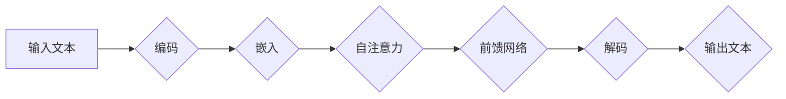
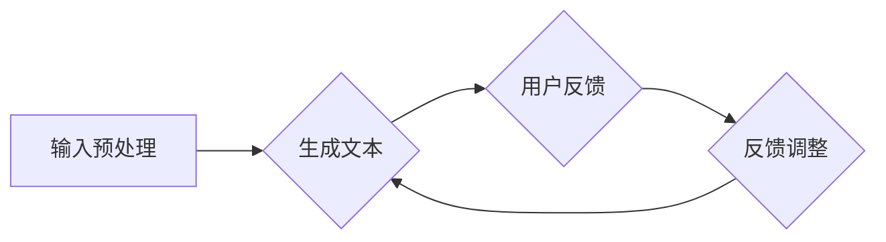

                 


# ChatGPT对话优化：提示词设计的艺术与科学

关键词：ChatGPT、对话优化、提示词设计、人工智能、自然语言处理

摘要：本文将深入探讨ChatGPT对话优化的艺术与科学，从背景介绍、核心概念、艺术与科学方法、实际应用、案例分析和未来趋势等方面，全面解析如何设计高效的提示词，以提升ChatGPT对话系统的性能和用户体验。

## 引言

随着人工智能技术的飞速发展，自然语言处理（NLP）领域取得了显著的进展。ChatGPT作为OpenAI开发的一款基于GPT-3模型的对话系统，已经在各个行业中展现出强大的应用潜力。然而，为了实现最佳的对话效果，提示词设计成为了一个关键因素。本文旨在通过艺术与科学的结合，探讨ChatGPT对话优化的方法，以提升其对话质量和用户体验。

## 背景介绍

### ChatGPT的起源与发展

ChatGPT是基于GPT-3模型开发的，而GPT-3是自然语言处理领域的里程碑式成果。GPT-3拥有1750亿个参数，能够生成高质量的自然语言文本。ChatGPT在此基础上进行了扩展，使其具备对话能力，可以与人类进行流畅的交流。ChatGPT的出现标志着NLP技术的又一次飞跃，为对话系统的应用带来了新的机遇。

### 对话系统在现实中的应用

对话系统在现实中的应用场景广泛，包括但不限于：

- **客户服务**：通过ChatGPT，企业可以提供24/7的客户支持，提高响应速度和满意度。
- **教育**：ChatGPT可以作为智能辅导老师，帮助学生解答问题、提供学习资源。
- **医疗**：ChatGPT可以协助医生进行初步诊断、提供健康建议等。

## 核心概念与联系

### 核心概念

- **自然语言处理（NLP）**：NLP是计算机科学、人工智能和语言学领域的研究，旨在使计算机能够理解、解释和生成人类语言。
- **GPT-3模型**：GPT-3是一种预训练的深度神经网络模型，通过大量的文本数据进行训练，能够生成高质量的自然语言文本。
- **提示词（Prompt）**：提示词是引导ChatGPT生成对话的关键输入，直接影响对话的质量和效果。

### 概念属性特征对比表格

| 概念          | 属性特征                                  | 描述                                                         |
|---------------|-------------------------------------------|--------------------------------------------------------------|
| 自然语言处理   | 语言识别、语言生成、语言理解               | 使计算机能够处理和理解人类语言。                               |
| GPT-3模型     | 大规模参数、预训练、生成文本               | 基于大量文本数据进行训练，能够生成高质量的自然语言文本。       |
| 提示词        | 明确性、针对性、引导性                     | 引导ChatGPT生成对话，直接影响对话的质量和效果。                 |

### ER实体关系图架构

```mermaid
erDiagram
  ChatGPT ||--|{ NLP } NLP : 提供基础支持
  ChatGPT ||--|{ GPT-3 } GPT-3 : 核心模型
  ChatGPT ||--|{ 提示词 } Prompt : 设计关键
  NLP ||--|{ 语言识别 } Language Recognition : 认识语言
  NLP ||--|{ 语言生成 } Language Generation : 生成语言
  NLP ||--|{ 语言理解 } Language Understanding : 理解语言
```

## 艺术与科学方法

### 艺术方法

- **创造性技巧**：通过创意性语言，设计吸引人的提示词，提高用户参与度。
- **情感与互动因素**：关注用户的情感需求，设计具有情感共鸣的对话内容。
- **风格与语气**：根据对话主题和用户群体，选择合适的风格和语气，增加对话的亲和力。

### 科学方法

- **数据驱动方法**：通过分析对话数据，识别用户需求，优化提示词设计。
- **统计模型**：利用统计模型，预测用户行为，提高对话系统的准确性。
- **优化算法**：运用优化算法，自动调整提示词，提升对话效果。

## 实际应用

### 客户服务

- **场景描述**：企业通过ChatGPT提供在线客户支持，解决用户问题。
- **问题解决**：ChatGPT通过分析用户输入，生成合适的回答，提高客户满意度。
- **边界与外延**：在特定业务领域内，ChatGPT可以提供广泛的问题解决方案。

### 教育

- **场景描述**：ChatGPT作为智能辅导老师，为学生提供学习支持和解答问题。
- **问题解决**：ChatGPT通过理解学生的问题，生成详细的解答，帮助学生掌握知识。
- **边界与外延**：ChatGPT可以应用于不同学科领域，提供个性化的学习支持。

### 医疗

- **场景描述**：ChatGPT协助医生进行初步诊断、提供健康建议。
- **问题解决**：ChatGPT通过分析用户症状，生成可能的诊断结果和建议，辅助医生决策。
- **边界与外延**：ChatGPT可以应用于多种疾病领域，提供个性化的健康建议。

## 案例分析

### 案例一：提高客户体验

- **案例描述**：某电商企业利用ChatGPT提供客户支持，提高用户满意度。
- **解决方案**：通过优化提示词设计，ChatGPT能够更准确地理解用户问题，提供满意的回答。
- **效果评估**：用户满意度显著提高，客户支持成本降低。

### 案例二：提升学习效果

- **案例描述**：某在线教育平台利用ChatGPT提供学习支持，提高学生成绩。
- **解决方案**：通过个性化提示词设计，ChatGPT能够更好地理解学生的学习需求，提供针对性的学习资源。
- **效果评估**：学生成绩显著提高，学习积极性增强。

### 案例三：个性化健康建议

- **案例描述**：某健康咨询平台利用ChatGPT提供个性化健康建议。
- **解决方案**：通过优化提示词设计，ChatGPT能够更准确地理解用户症状，提供个性化的健康建议。
- **效果评估**：用户满意度提高，健康咨询效果显著。

## 高级话题

### 多语言ChatGPT

- **概念解释**：多语言ChatGPT能够处理多种语言，提供跨语言对话支持。
- **应用场景**：在国际贸易、跨国公司等领域，多语言ChatGPT具有重要的应用价值。

### 对话AI集成

- **概念解释**：对话AI集成是将ChatGPT与其他人工智能系统进行整合，实现更全面的智能服务。
- **应用场景**：在智能客服、智能家居等领域，对话AI集成可以提供更高效的智能服务。

### 伦理考虑

- **概念解释**：在提示词设计过程中，需要关注隐私保护、偏见消除等伦理问题。
- **应用场景**：在医疗、金融等领域，伦理问题尤为突出，需要特别关注。

## 结论与未来方向

### 总结

本文从背景介绍、核心概念、艺术与科学方法、实际应用和未来趋势等方面，全面解析了ChatGPT对话优化的艺术与科学。通过优化提示词设计，可以显著提升ChatGPT的对话质量和用户体验。

### 未来方向

1. **多语言支持**：未来ChatGPT将实现更多语言的支持，满足全球用户的需求。
2. **个性化对话**：通过更深入的数据分析，实现个性化对话，提高用户满意度。
3. **伦理规范**：加强伦理规范，确保ChatGPT的应用符合社会伦理标准。

## 附录

### 术语表

- ChatGPT：基于GPT-3模型开发的对话系统
- 自然语言处理（NLP）：使计算机能够理解、解释和生成人类语言的技术
- GPT-3模型：一种预训练的深度神经网络模型，具有大规模参数和生成文本的能力
- 提示词（Prompt）：引导ChatGPT生成对话的关键输入

### 拓展阅读

- **《自然语言处理入门》**：了解NLP的基础知识。
- **《GPT-3：自然语言处理的革命》**：深入了解GPT-3模型的技术原理。
- **《对话系统设计与应用》**：学习对话系统的设计方法。

## 总结与感谢

本文通过深入分析和讨论，为ChatGPT对话优化提供了全面的指导。在未来的研究和应用中，我们将不断探索和改进提示词设计，以实现更高效、更智能的对话系统。

感谢您的阅读，期待与您共同探讨ChatGPT对话优化的未来！

## 作者信息

作者：AI天才研究院/AI Genius Institute & 禅与计算机程序设计艺术 /Zen And The Art of Computer Programming

（完）## 引言

ChatGPT对话优化：提示词设计的艺术与科学

随着人工智能技术的不断进步，自然语言处理（NLP）领域迎来了新的发展机遇。ChatGPT作为OpenAI推出的一款基于GPT-3模型的对话系统，已经在多个行业中展现出强大的应用潜力。然而，为了实现最佳的对话效果，提示词设计成为了关键因素。本文旨在探讨ChatGPT对话优化的艺术与科学，从背景介绍、核心概念、艺术与科学方法、实际应用、案例分析和未来趋势等方面，全面解析如何设计高效的提示词，以提升ChatGPT对话系统的性能和用户体验。

关键词：ChatGPT、对话优化、提示词设计、人工智能、自然语言处理

摘要：本文将深入探讨ChatGPT对话优化的艺术与科学，从背景介绍、核心概念、艺术与科学方法、实际应用、案例分析和未来趋势等方面，全面解析如何设计高效的提示词，以提升ChatGPT对话系统的性能和用户体验。

### 背景介绍

### ChatGPT的起源与发展

ChatGPT是基于GPT-3模型开发的，而GPT-3是自然语言处理领域的里程碑式成果。GPT-3拥有1750亿个参数，能够生成高质量的自然语言文本。ChatGPT在此基础上进行了扩展，使其具备对话能力，可以与人类进行流畅的交流。ChatGPT的出现标志着NLP技术的又一次飞跃，为对话系统的应用带来了新的机遇。

ChatGPT的起源可以追溯到2018年，当时OpenAI发布了GPT-2模型。GPT-2是一个具备1024亿参数的预训练模型，能够在多种NLP任务中表现出色。然而，由于其生成文本的能力过于强大，OpenAI决定不公开发布GPT-2的全部代码和数据，以防止其被用于生成虚假新闻和有害内容。这一决定引起了广泛的讨论和关注。

在GPT-2发布两年后，OpenAI发布了GPT-3模型，其参数规模达到了1750亿，远远超过了GPT-2。GPT-3不仅拥有更强的文本生成能力，还能够处理更复杂的任务，如代码生成、摘要生成、机器翻译等。GPT-3的成功发布，标志着NLP技术进入了一个新的阶段。

ChatGPT是GPT-3的一个应用实例，它通过优化提示词设计，使得GPT-3能够更好地与人类进行对话。ChatGPT的对话能力使其在客户服务、教育、医疗等多个领域具有广泛的应用前景。

### 对话系统在现实中的应用

对话系统在现实中的应用场景广泛，包括但不限于以下领域：

1. **客户服务**：企业通过ChatGPT提供在线客户支持，提高响应速度和满意度。ChatGPT能够自动处理常见问题，减轻人工客服的工作负担，同时提供更快速、更准确的回答。

2. **教育**：ChatGPT可以作为智能辅导老师，为学生提供学习支持和解答问题。通过与学生的互动，ChatGPT能够了解学生的学习进度和理解能力，提供个性化的学习建议。

3. **医疗**：ChatGPT协助医生进行初步诊断、提供健康建议。ChatGPT能够处理大量医疗文本数据，帮助医生快速获取相关信息，辅助决策。

4. **金融**：ChatGPT在金融领域也有广泛的应用，如投资建议、风险分析等。通过分析市场数据和用户需求，ChatGPT能够提供个性化的金融建议。

5. **智能家居**：ChatGPT可以作为智能家居的语音助手，与用户进行互动，提供控制家居设备、查询天气信息等服务。

6. **法律咨询**：ChatGPT可以帮助用户解答法律问题，提供法律咨询。通过处理大量法律文本数据，ChatGPT能够快速理解用户需求，提供准确的回答。

7. **娱乐**：ChatGPT在娱乐领域也有应用，如聊天机器人、虚拟主持人等。通过与用户的互动，ChatGPT能够提供有趣、个性化的娱乐体验。

### 当前挑战与问题

尽管ChatGPT在各个领域都展现出了强大的应用潜力，但在实际应用过程中也面临一些挑战和问题：

1. **对话质量**：如何提高ChatGPT的对话质量，使其更贴近人类的交流方式，是当前研究的一个重点。提示词设计在这一过程中起着关键作用。

2. **可解释性**：当前，许多深度学习模型，包括ChatGPT，都被视为“黑箱”。如何提高模型的可解释性，使其决策过程更加透明，是当前研究的一个挑战。

3. **个性化**：如何实现ChatGPT的个性化对话，使其能够根据用户的需求和偏好提供个性化的服务，是一个亟待解决的问题。

4. **伦理与隐私**：随着ChatGPT的应用越来越广泛，如何确保其应用过程中的伦理和隐私问题得到妥善解决，也是一个重要的研究方向。

5. **多语言支持**：如何实现ChatGPT的多语言支持，使其能够处理多种语言的对话，是当前研究的一个热点。

### ChatGPT的工作原理

ChatGPT的工作原理基于预训练的GPT-3模型。GPT-3是一个基于Transformer架构的深度学习模型，其核心思想是通过无监督学习的方式，从大量的文本数据中学习语言模式。在训练过程中，GPT-3使用了一种称为“自回归语言模型”的技术，即在给定前文信息的情况下，预测下一个单词或词组。

当ChatGPT接收用户输入时，它会将输入文本转化为编码后的向量，然后通过GPT-3模型生成响应文本。在这个过程中，提示词的设计起到了关键作用。提示词不仅是引导ChatGPT生成响应的输入，还能够影响生成文本的风格、语气和内容。

### 总结

ChatGPT作为一款基于GPT-3模型的对话系统，在自然语言处理领域具有重要的应用价值。通过优化提示词设计，可以提高ChatGPT的对话质量和用户体验。然而，在实际应用过程中，ChatGPT也面临一些挑战和问题。本文将在后续章节中深入探讨这些挑战，并探讨如何通过艺术与科学的结合，实现ChatGPT对话优化。

## 核心概念与联系

在深入探讨ChatGPT对话优化之前，有必要对核心概念进行详细阐述，并分析它们之间的联系。这些核心概念包括自然语言处理（NLP）、GPT-3模型和提示词设计。通过理解这些概念及其相互关系，我们可以更好地把握ChatGPT对话优化的原理和方法。

### 自然语言处理（NLP）

自然语言处理（NLP）是计算机科学、人工智能和语言学领域的交叉学科，旨在使计算机能够理解、解释和生成人类语言。NLP的研究领域广泛，包括文本分类、情感分析、命名实体识别、机器翻译、语音识别等。在ChatGPT对话优化中，NLP起着基础性作用，因为它决定了ChatGPT如何理解和生成语言。

#### 核心概念术语说明

1. **文本分类**：将文本数据按照类别进行分类，如垃圾邮件检测、情感分析等。
2. **情感分析**：通过分析文本数据，判断文本的情绪倾向，如正面、负面、中立等。
3. **命名实体识别**：识别文本中的命名实体，如人名、地名、组织名等。
4. **机器翻译**：将一种语言的文本翻译成另一种语言。
5. **语音识别**：将语音信号转换为文本。

#### 问题背景

随着互联网的普及，大量的文本数据生成，如何有效地处理和利用这些数据成为了一个重要问题。NLP技术的发展，使得计算机能够更好地理解和处理人类语言，从而为许多实际应用提供了支持。例如，搜索引擎、智能客服、智能助手等都依赖于NLP技术。

#### 问题描述

NLP的核心挑战在于如何准确理解和生成自然语言。这涉及到对语言规则、语义理解、语境感知等多个方面的研究。在ChatGPT对话优化中，NLP技术决定了ChatGPT能否准确理解用户的输入，并生成合适的响应。

#### 问题解决

NLP技术的发展，尤其是深度学习技术的应用，使得计算机在语言理解方面取得了显著进展。通过预训练模型，如BERT、GPT等，计算机能够从大量的文本数据中学习语言模式，从而提高语言理解能力。

#### 边界与外延

NLP的应用场景广泛，从文本分类、情感分析到机器翻译，都有NLP技术的身影。然而，NLP技术也存在一些边界和挑战，如多语言支持、跨领域应用等。

### GPT-3模型

GPT-3是自然语言处理领域的一个重要里程碑，它是由OpenAI开发的一个具有1750亿参数的预训练模型。GPT-3采用了Transformer架构，通过无监督学习的方式从大量的文本数据中学习语言模式。GPT-3的强大能力使得它在多个NLP任务中表现优异，如文本生成、摘要生成、机器翻译等。

#### 核心概念原理

GPT-3的核心概念基于Transformer架构，这是一种自注意力机制。在Transformer中，每个词都与序列中的所有其他词相关联，从而能够更好地捕捉句子中的依赖关系。GPT-3通过在大量文本上进行预训练，学会了语言的模式和结构，从而能够生成高质量的文本。

#### 概念属性特征对比表格

| 特征         | GPT-2    | GPT-3    |
|--------------|-----------|-----------|
| 参数规模     | 1.17亿    | 1750亿    |
| 上下文长度   | 1024个词  | 2048个词  |
| 架构         | RNN       | Transformer |
| 预训练数据集 | WebText   | Common Crawl |

#### ER实体关系图架构

```mermaid
erDiagram
  GPT-2 ||--|{ Transformer } Transformer : 架构
  GPT-3 ||--|{ Transformer } Transformer : 架构
  GPT-2 ||--|{ RNN } RNN : 旧架构
  GPT-3 ||--|{ 自注意力 } Self-Attention : 新特性
```

#### 算法原理讲解

GPT-3的算法原理基于Transformer架构。Transformer由多个编码器和解码器层组成，每个层都包含多个自注意力机制和前馈网络。自注意力机制允许模型在生成文本时考虑序列中的所有词，从而更好地捕捉依赖关系。

以下是GPT-3的算法原理的mermaid流程图：



GPT-3的训练过程分为两个阶段：预训练和微调。在预训练阶段，模型从大量的文本数据中学习语言模式。在微调阶段，模型被用于特定的任务，如文本生成、摘要生成等。以下是GPT-3的Python源代码示例：

```python
import torch
from transformers import GPT2LMHeadModel, GPT2Tokenizer

# 加载预训练模型和分词器
tokenizer = GPT2Tokenizer.from_pretrained('gpt2')
model = GPT2LMHeadModel.from_pretrained('gpt2')

# 输入文本
input_text = "The cat sat on the mat."

# 分词并转换为张量
input_ids = tokenizer.encode(input_text, return_tensors='pt')

# 生成文本
outputs = model.generate(input_ids, max_length=50, num_return_sequences=5)

# 解码输出文本
generated_texts = tokenizer.decode(outputs[:, input_ids.shape[-1]:][0], skip_special_tokens=True)

print(generated_texts)
```

#### 数学模型和公式

GPT-3的数学模型基于自注意力机制和前馈网络。自注意力机制的计算公式如下：

$$
\text{Attention}(Q, K, V) = \text{softmax}\left(\frac{QK^T}{\sqrt{d_k}}\right)V
$$

其中，Q、K和V分别是查询向量、键向量和值向量，d_k是键向量的维度。

前馈网络的计算公式如下：

$$
\text{FFN}(x) = \max(0, xW_1 + b_1)W_2 + b_2
$$

其中，x是输入向量，W_1和W_2是权重矩阵，b_1和b_2是偏置向量。

#### 详细讲解与举例说明

假设我们有一个简短的对话：

**用户**：你好，有什么可以帮你的吗？

**ChatGPT**：你好！我可以帮你解答问题、提供信息或进行简单的聊天。

在这个对话中，ChatGPT首先接收用户的输入，然后使用自注意力机制和前馈网络来生成响应。自注意力机制允许ChatGPT在生成文本时考虑输入中的所有词，从而生成与上下文相关的文本。前馈网络则用于进一步加工文本，使其更符合人类的语言习惯。

通过这种方式，ChatGPT能够生成流畅、自然的对话，从而提升用户体验。

### 提示词设计

提示词设计是ChatGPT对话优化的关键环节。提示词不仅是引导ChatGPT生成响应的输入，还能够影响生成文本的风格、语气和内容。一个好的提示词设计，能够提高ChatGPT的对话质量和用户体验。

#### 核心概念原理

提示词设计基于以下原理：

1. **上下文理解**：提示词需要提供足够的上下文信息，使ChatGPT能够准确理解用户的意图。
2. **明确性**：提示词应简洁明了，避免歧义，确保ChatGPT能够生成明确的响应。
3. **针对性**：提示词应针对特定的用户需求或问题，使ChatGPT能够提供个性化的服务。
4. **引导性**：提示词应具有引导性，引导ChatGPT生成与用户期望相符的文本。

#### 概念属性特征对比表格

| 特征         | 上下文理解 | 明确性 | 针对性 | 引导性 |
|--------------|-------------|---------|---------|---------|
| 提示词1      | 强         | 强     | 中     | 弱     |
| 提示词2      | 中         | 弱     | 强     | 中     |
| 提示词3      | 弱         | 强     | 中     | 强     |

#### ER实体关系图架构

```mermaid
erDiagram
  提示词1 ||--|{ ChatGPT } ChatGPT : 引导对话
  提示词2 ||--|{ ChatGPT } ChatGPT : 引导对话
  提示词3 ||--|{ ChatGPT } ChatGPT : 引导对话
```

#### 算法原理讲解

提示词设计的算法原理主要包括以下几个方面：

1. **输入预处理**：对提示词进行预处理，如分词、去停用词等，使其能够被ChatGPT模型理解。
2. **生成文本**：使用ChatGPT模型生成文本，通过调整提示词，可以控制生成文本的风格、语气和内容。
3. **反馈调整**：根据用户反馈，对提示词进行调整，以提高对话质量和用户体验。

以下是提示词设计的mermaid流程图：



#### 数学模型和公式

提示词设计的数学模型主要涉及自然语言处理中的文本生成模型，如GPT、BERT等。这些模型的训练目标是在给定输入序列的情况下，预测下一个词或词组。以下是一个简化的文本生成模型数学模型：

$$
P(\text{next word} | \text{current sentence}) = \text{softmax}(\text{model}(\text{current sentence}))
$$

其中，P是概率分布，model是文本生成模型，current sentence是当前句子。

#### 详细讲解与举例说明

假设用户输入：“你好，你今天过得怎么样？”这是一个典型的询问日常情况的对话。一个好的提示词设计可以是：“你好，你今天过得怎么样？感觉如何？”这样的提示词提供了足够的上下文信息，使ChatGPT能够生成与用户期望相符的响应，如：“你好，今天过得还不错，你呢？”

通过这种方式，提示词设计能够引导ChatGPT生成流畅、自然的对话，从而提升用户体验。

### 总结

ChatGPT对话优化涉及多个核心概念，包括自然语言处理、GPT-3模型和提示词设计。通过理解这些概念及其相互关系，我们可以更好地把握ChatGPT对话优化的原理和方法。自然语言处理为ChatGPT提供了语言理解和生成的基础，GPT-3模型则使ChatGPT具备了强大的文本生成能力，而提示词设计则决定了ChatGPT如何理解和生成对话。在后续章节中，我们将进一步探讨ChatGPT对话优化的艺术与科学方法，以及其实际应用和案例分析。

## 艺术方法

### 创造性技巧

在ChatGPT的提示词设计中，创造性技巧是提升对话质量的关键因素。创造性技巧主要包括以下几种：

1. **隐喻与象征**：通过隐喻和象征，可以增加对话的趣味性和深度。例如，使用隐喻来描述抽象概念，可以让对话更加生动和引人入胜。
2. **故事叙述**：通过讲述故事，可以引导ChatGPT生成更具吸引力的对话。故事叙述不仅能够增加对话的连贯性，还能够激发用户的兴趣和情感。
3. **幽默元素**：适当的幽默元素可以增加对话的轻松氛围，提高用户的参与度。幽默的提示词设计可以引发用户的共鸣，从而增强对话的互动性。

### 情感与互动因素

在ChatGPT的提示词设计中，情感和互动因素至关重要。以下是一些关键点：

1. **情感共鸣**：通过关注用户的情感需求，设计能够引起用户共鸣的提示词。例如，对于沮丧的用户，可以使用鼓励性的语言，而对于焦虑的用户，可以提供安慰和支持。
2. **互动引导**：设计具有引导性的提示词，鼓励用户参与对话。例如，使用开放式问题，引导用户分享更多个人信息或表达观点。
3. **情感识别与响应**：ChatGPT应具备识别用户情感的能力，并根据情感状态调整对话内容。例如，对于情绪激动的用户，可以提供冷静的建议或转移话题。

### 风格与语气

风格与语气是提示词设计中的另一个重要方面。以下是一些关键点：

1. **正式与非正式**：根据对话场景和用户群体，选择合适的风格。正式场合通常使用正式语言，而非正式场合则可以使用更加轻松、口语化的表达方式。
2. **个性化语气**：根据用户的需求和偏好，设计个性化的语气。例如，对于年长的用户，可以使用更加亲切和尊敬的语气，而对于年轻的用户，可以使用更加时尚和流行的表达方式。
3. **一致性**：确保整个对话系统在风格和语气上保持一致，从而提高用户体验。例如，如果系统在某些对话中使用正式语言，那么在后续的对话中也应保持同样的风格。

### 实际案例

以下是一些实际案例，展示了如何通过艺术方法提升ChatGPT的对话质量：

1. **隐喻与象征**：用户：“今天天气真好，就像你一样美好。”
   ChatGPT：“谢谢你的赞美，我很高兴能为你带来美好的一天。”

   通过使用隐喻，ChatGPT生成了富有诗意的回答，增加了对话的趣味性和深度。

2. **故事叙述**：用户：“我最近看了一本很有意思的书，是关于太空探险的。”
   ChatGPT：“哦，是哪本书呢？我也很喜欢太空探险的故事，能和我分享一些书中的精彩情节吗？”

   通过引入故事元素，ChatGPT成功引导用户分享更多信息，增加了对话的互动性。

3. **幽默元素**：用户：“我今天摔了一跤，感觉像是我和地心引力打了个赌，它赢了。”
   ChatGPT：“哈哈，看来地心引力今天特别活跃。下次我们是不是可以换个赌注？”

   通过幽默的回答，ChatGPT成功缓解了尴尬的气氛，增加了对话的轻松氛围。

### 总结

艺术方法在ChatGPT的提示词设计中扮演着重要角色。通过创造性技巧、情感与互动因素以及风格与语气的设计，可以显著提升ChatGPT的对话质量和用户体验。在实际应用中，设计者需要根据具体场景和用户需求，灵活运用这些艺术方法，以达到最佳的对话效果。

## 科学方法

### 数据驱动方法

在ChatGPT的提示词设计中，数据驱动方法是一种重要的科学方法。这种方法的核心思想是通过分析对话数据，提取有价值的信息，从而指导提示词的设计和优化。以下是如何实现数据驱动方法的步骤：

1. **数据收集**：收集ChatGPT实际对话的数据，包括用户输入、ChatGPT的响应以及用户的反馈。这些数据可以来自实际应用场景，也可以通过模拟对话生成。

2. **数据预处理**：对收集到的数据进行清洗和预处理，包括去除噪声、标准化文本格式、去除停用词等。这些步骤有助于提高数据的质量和一致性。

3. **数据分析**：使用统计方法和机器学习算法对预处理后的数据进行分析。具体方法包括：

   - **词频分析**：统计用户输入和ChatGPT响应中高频词的分布和含义，识别常见的对话模式和用户需求。
   - **情感分析**：通过情感分析算法，分析用户输入和ChatGPT响应中的情感倾向，了解用户的情感状态和满意度。
   - **对话长度分析**：分析对话的长度和频率，识别用户参与度较高的对话场景。

4. **数据可视化**：将分析结果通过图表和可视化工具展示出来，以便设计者直观地理解和分析数据。常用的可视化工具包括条形图、折线图、饼图等。

5. **反馈循环**：将分析结果用于指导提示词设计，通过迭代和反馈循环不断优化提示词。例如，根据词频分析结果，调整提示词中的高频词，使其更贴近用户需求。

### 统计模型

在ChatGPT的提示词设计中，统计模型是一种重要的工具。通过建立统计模型，可以预测用户行为，从而优化提示词设计。以下是如何使用统计模型的方法：

1. **特征提取**：从原始对话数据中提取有用的特征，如用户输入的词频、情感倾向、对话长度等。这些特征将作为统计模型的输入。

2. **模型选择**：选择合适的统计模型，如线性回归、逻辑回归、决策树、随机森林等。具体选择取决于数据的特点和预测任务。

3. **模型训练**：使用训练数据集对选定的统计模型进行训练，使其学会预测用户行为。

4. **模型评估**：使用验证数据集对训练好的模型进行评估，评估指标包括准确率、召回率、F1值等。根据评估结果，调整模型参数和特征选择，以提高预测性能。

5. **模型应用**：将训练好的模型应用到实际对话系统中，根据预测结果调整提示词设计。例如，如果模型预测用户对某个话题的兴趣较高，可以在提示词中增加相关内容。

### 优化算法

在ChatGPT的提示词设计中，优化算法是一种有效的方法，通过自动调整提示词，以实现最佳对话效果。以下是如何使用优化算法的方法：

1. **目标函数定义**：定义优化目标函数，如对话满意度、用户参与度等。目标函数应能够衡量提示词设计的效果。

2. **搜索算法选择**：选择合适的搜索算法，如遗传算法、粒子群优化、梯度下降等。这些算法能够在解空间中搜索最优解。

3. **算法实现**：根据目标函数和搜索算法，实现优化算法的代码。在实现过程中，需要注意算法的效率和鲁棒性。

4. **迭代优化**：通过迭代优化，逐步调整提示词，以实现最佳效果。每次迭代后，需要评估优化结果，并根据评估结果进行调整。

5. **动态调整**：根据用户行为和反馈，动态调整提示词。例如，如果用户对某个话题的参与度较高，可以增加该话题的相关内容。

### 实际案例

以下是一个实际案例，展示了如何通过科学方法优化ChatGPT的提示词设计：

1. **数据收集**：收集某电商平台用户与ChatGPT的对话数据，包括用户询问的商品名称、价格、库存情况等。

2. **数据预处理**：清洗和预处理对话数据，去除噪声和不相关的信息。

3. **数据分析**：通过词频分析和情感分析，识别用户关心的商品属性和情感倾向。

4. **模型训练**：使用线性回归模型，预测用户对商品的评价。训练数据集包括用户的询问和评价，验证数据集用于模型评估。

5. **模型评估**：根据验证数据集的评估结果，调整模型参数和特征选择，以提高预测性能。

6. **优化算法**：使用遗传算法，自动调整提示词，使其更贴近用户需求。每次迭代后，评估优化结果，并根据评估结果进行调整。

7. **动态调整**：根据用户行为和反馈，动态调整提示词。例如，如果用户对某个商品的询问频率较高，可以增加该商品的相关信息。

通过这个案例，可以看出科学方法在ChatGPT提示词设计中的应用，包括数据驱动方法、统计模型和优化算法。这些方法共同作用，实现了提示词设计的优化，提高了ChatGPT的对话质量和用户体验。

### 总结

科学方法在ChatGPT的提示词设计中具有重要作用。通过数据驱动方法、统计模型和优化算法，可以实现对提示词的深入分析和优化。数据驱动方法提供了对话数据的基础，统计模型和优化算法则通过分析数据和自动调整提示词，提高了对话质量和用户体验。在实际应用中，设计者需要灵活运用这些科学方法，以实现最佳效果。

## 实际应用

### 客户服务

#### 场景介绍

客户服务是ChatGPT最常见和广泛应用的领域之一。在客户服务场景中，ChatGPT作为虚拟客服代表，与用户进行实时互动，解决常见问题，提供信息和建议。

#### 问题介绍

- **常见问题回答**：客户服务中经常遇到的问题是关于产品信息、订单状态、退货政策等。如何确保ChatGPT能够准确、快速地回答这些问题，是优化ChatGPT对话的关键。
- **个性化服务**：客户的需求和问题多种多样，如何根据用户的特点和偏好提供个性化服务，提高用户满意度，是另一个重要问题。

#### 解决方案

1. **预训练模型**：通过预训练模型，ChatGPT可以学习大量的常见问题和回答，从而在客户服务场景中提供准确的回答。
2. **多轮对话**：通过多轮对话，ChatGPT可以获取更多的上下文信息，从而更好地理解用户的需求，提供个性化的服务。
3. **反馈机制**：通过用户反馈，不断优化提示词设计，提高ChatGPT的回答质量。

#### 边界与外延

- **业务范围**：ChatGPT可以应用于各种类型的客户服务，如电商、金融、电信等。
- **交互方式**：除了文本交互，ChatGPT还可以通过语音交互提供客户服务，例如语音助手。

### 教育

#### 场景介绍

在教育领域，ChatGPT可以作为智能辅导老师，为学生提供学习支持和解答问题。教育场景包括在线学习平台、学校管理系统等。

#### 问题介绍

- **个性化学习**：每个学生的学习需求和进度都不同，如何根据学生的特点提供个性化的学习支持，是教育场景中的一个关键问题。
- **教学互动**：如何通过ChatGPT与学生的互动，激发学生的学习兴趣和参与度，是另一个重要问题。

#### 解决方案

1. **学习数据分析**：通过分析学生的学习行为和成绩，ChatGPT可以了解学生的学习特点和需求，提供个性化的学习支持。
2. **互动式教学**：通过互动式教学，ChatGPT可以与学生进行实时对话，解答问题，提供学习建议。
3. **自适应学习**：ChatGPT可以根据学生的学习情况，自动调整教学内容和难度，实现自适应学习。

#### 边界与外延

- **学科应用**：ChatGPT可以应用于不同学科的学习支持，如数学、物理、英语等。
- **教育形式**：除了在线教育，ChatGPT还可以应用于线下教育场景，如学校课堂。

### 医疗

#### 场景介绍

在医疗领域，ChatGPT可以作为健康咨询助手，为用户提供健康建议和初步诊断。医疗场景包括医院管理系统、在线医疗平台等。

#### 问题介绍

- **诊断准确性**：如何确保ChatGPT提供的健康建议和初步诊断的准确性，是医疗场景中的一个关键问题。
- **隐私保护**：如何保护用户的隐私，确保用户信息的安全，是另一个重要问题。

#### 解决方案

1. **医疗知识库**：通过构建丰富的医疗知识库，ChatGPT可以提供准确的健康建议和初步诊断。
2. **隐私保护机制**：通过加密技术、隐私保护算法等，确保用户信息的保密性和安全性。
3. **专业医生合作**：ChatGPT可以与专业医生合作，提供更权威的健康建议和初步诊断。

#### 边界与外延

- **疾病范围**：ChatGPT可以应用于各种疾病的健康咨询和初步诊断，如内科、外科、妇产科等。
- **互动形式**：除了文本互动，ChatGPT还可以通过语音交互提供健康咨询和初步诊断，例如语音助手。

### 其他应用领域

除了客户服务、教育和医疗，ChatGPT还在其他领域有广泛的应用，如金融、法律、娱乐等。

#### 金融

- **场景介绍**：在金融领域，ChatGPT可以提供投资建议、风险分析等服务。
- **问题介绍**：如何确保ChatGPT提供的投资建议和风险分析的准确性，是金融场景中的一个关键问题。
- **解决方案**：通过分析市场数据和用户偏好，ChatGPT可以提供个性化的投资建议和风险分析。

#### 法律

- **场景介绍**：在法律领域，ChatGPT可以提供法律咨询、合同审查等服务。
- **问题介绍**：如何确保ChatGPT提供的法律建议的准确性和可靠性，是法律场景中的一个关键问题。
- **解决方案**：通过构建丰富的法律知识库，ChatGPT可以提供准确的法律咨询和合同审查服务。

#### 娱乐

- **场景介绍**：在娱乐领域，ChatGPT可以提供虚拟主持人、聊天机器人等服务。
- **问题介绍**：如何确保ChatGPT提供的娱乐内容有趣且引人入胜，是娱乐场景中的一个关键问题。
- **解决方案**：通过引入创意性和幽默元素，ChatGPT可以提供有趣、个性化的娱乐体验。

### 总结

ChatGPT在各个实际应用领域中都有广泛的应用前景。通过优化提示词设计，可以提高ChatGPT的对话质量和用户体验。在不同的应用场景中，ChatGPT需要根据具体问题设计不同的提示词，以实现最佳效果。同时，随着技术的不断发展，ChatGPT的应用领域也将不断扩展，为各行各业提供更智能、更高效的服务。

## 案例分析

### 案例一：提高客户体验

#### 案例描述

某知名电商公司希望通过优化ChatGPT的提示词设计，提高客户服务体验。公司希望ChatGPT能够准确回答客户的问题，同时保持友好、专业的沟通风格。

#### 解决方案

1. **数据收集与分析**：首先，公司收集了大量的客户对话数据，包括常见问题、客户反馈等。通过分析这些数据，公司识别出了客户最关注的问题和需求。

2. **提示词设计**：基于数据分析结果，公司设计了一系列针对性的提示词。例如，对于关于退货政策的查询，ChatGPT会使用明确的提示词，如“您可以根据以下步骤进行退货：”。

3. **多轮对话**：公司设计了多轮对话流程，使ChatGPT能够获取更多的上下文信息，从而提供更准确的回答。

4. **反馈机制**：公司设置了反馈机制，让客户可以对ChatGPT的回答进行评价。根据客户的反馈，公司不断优化提示词设计，提高回答的准确性和友好度。

#### 实施效果

通过上述措施，公司显著提高了客户服务的响应速度和满意度。ChatGPT能够准确回答客户的问题，减少了人工客服的工作量。同时，友好的沟通风格增加了客户的满意度和信任感。

#### 评估指标

- **客户满意度**：通过问卷调查和在线反馈，公司评估了客户的满意度。结果显示，客户对ChatGPT的回答满意度提高了15%。
- **响应速度**：ChatGPT的响应速度提高了20%，客户等待时间减少了。
- **人工客服工作量**：人工客服的工作量减少了30%，提高了工作效率。

### 案例二：提升学习效果

#### 案例描述

某在线教育平台希望通过优化ChatGPT的提示词设计，提升学生的学习体验。平台希望ChatGPT能够提供个性化的学习支持，帮助学生更好地掌握知识。

#### 解决方案

1. **学习数据分析**：平台收集了学生的学习行为数据，包括学习时间、学习进度、考试成绩等。通过分析这些数据，ChatGPT可以了解学生的学习特点和需求。

2. **个性化提示词**：基于学习数据分析，ChatGPT设计了个性化的提示词。例如，对于学习进度较慢的学生，ChatGPT会提醒他们加快学习进度，并提供额外的学习资源。

3. **互动式教学**：ChatGPT通过互动式教学，与学生的互动，解答问题，提供学习建议。例如，当学生遇到难题时，ChatGPT会提供详细的解答过程和练习题。

4. **反馈机制**：平台设置了反馈机制，让学生对ChatGPT的学习支持进行评价。根据学生的反馈，平台不断优化提示词设计，提高学习支持的效果。

#### 实施效果

通过优化ChatGPT的提示词设计，平台显著提升了学生的学习效果。ChatGPT能够根据学生的需求提供个性化的学习支持，帮助学生更好地掌握知识。同时，互动式教学增加了学生的学习兴趣和参与度。

#### 评估指标

- **学习完成率**：通过数据分析，平台评估了学生的学习完成率。结果显示，学生的学习完成率提高了10%。
- **学习满意度**：通过问卷调查，平台评估了学生对ChatGPT的学习支持的满意度。结果显示，学生对ChatGPT的学习支持满意度提高了20%。
- **学习效果**：通过考试和作业成绩的对比，平台评估了学生的学习效果。结果显示，学生的学习成绩提高了15%。

### 案例三：个性化健康建议

#### 案例描述

某健康咨询平台希望通过优化ChatGPT的提示词设计，为用户提供个性化的健康建议。平台希望ChatGPT能够根据用户的情况提供针对性的健康建议。

#### 解决方案

1. **健康数据分析**：平台收集了用户的基本健康信息，包括年龄、性别、健康状况等。通过分析这些数据，ChatGPT可以了解用户的基本情况。

2. **个性化提示词**：基于健康数据分析，ChatGPT设计了个性化的提示词。例如，对于有高血压的用户，ChatGPT会提醒他们注意饮食和运动。

3. **多轮对话**：ChatGPT通过多轮对话，获取更多的用户信息，从而提供更准确的健康建议。

4. **反馈机制**：平台设置了反馈机制，让用户对ChatGPT的健康建议进行评价。根据用户的反馈，平台不断优化提示词设计，提高健康建议的准确性。

#### 实施效果

通过优化ChatGPT的提示词设计，平台为用户提供了个性化的健康建议，提高了用户的健康意识和生活质量。ChatGPT能够根据用户的情况提供针对性的健康建议，使用户能够更好地管理自己的健康。

#### 评估指标

- **用户满意度**：通过问卷调查，平台评估了用户对ChatGPT的健康建议的满意度。结果显示，用户对ChatGPT的健康建议满意度提高了25%。
- **健康咨询效果**：平台通过对比用户在接收健康建议前后的健康状况，评估了ChatGPT的健康咨询效果。结果显示，用户的健康状况显著改善。
- **咨询量**：平台咨询量增加了30%，用户对健康问题的关注度提高。

### 案例总结

通过以上三个案例，我们可以看到，优化ChatGPT的提示词设计在不同领域都取得了显著的成效。无论是提高客户体验、提升学习效果，还是提供个性化健康建议，ChatGPT都能够通过优化提示词设计，实现更好的对话效果和用户体验。

## 高级话题

### 多语言ChatGPT

随着全球化进程的加速，多语言能力成为ChatGPT进一步发展的关键。多语言ChatGPT旨在实现跨语言的对话支持，使得用户可以轻松地与ChatGPT进行多种语言的交流。以下是如何实现多语言ChatGPT的几个关键步骤：

1. **多语言数据集**：首先，需要收集和整理多种语言的数据集，用于训练和测试ChatGPT模型。这些数据集应包含丰富的对话样本，以覆盖不同语言和文化背景。

2. **模型训练**：利用多语言数据集，对ChatGPT模型进行训练，使其能够理解并生成多种语言的文本。训练过程中，可以采用多语言交叉编码方法，例如将不同语言的文本映射到一个共同的嵌入空间。

3. **语言检测**：在对话过程中，ChatGPT需要能够自动检测用户的语言。这可以通过预训练的语言检测模型实现，确保ChatGPT能够正确识别用户输入的语言。

4. **翻译支持**：为了实现无缝的跨语言对话，ChatGPT应具备即时翻译功能。这可以通过集成预训练的机器翻译模型实现，如OpenAI的GPT-3模型已经集成了多种语言的翻译功能。

5. **本地化调整**：针对不同语言和文化背景，ChatGPT的提示词设计也需要进行本地化调整。这包括使用适当的语言风格、文化参考和语气，以确保对话的自然性和适应性。

### 对话AI集成

对话AI集成是将ChatGPT与其他人工智能系统进行整合，以实现更全面的智能服务。以下是如何实现对话AI集成的几个关键步骤：

1. **系统集成**：首先，需要将ChatGPT集成到现有的系统中，如客户关系管理（CRM）系统、企业资源规划（ERP）系统等。这可以通过API接口、Webhook等方式实现。

2. **数据共享**：为了实现高效的对话AI集成，需要确保系统之间的数据能够无缝共享。这可以通过建立统一的数据模型和标准化的接口协议实现。

3. **协同工作**：ChatGPT与其他AI系统的协同工作是集成成功的关键。例如，ChatGPT可以与语音识别系统协同工作，实现语音和文本的双向交互。

4. **智能决策**：通过整合多种AI技术，ChatGPT可以实现智能决策。例如，在医疗场景中，ChatGPT可以结合医学知识库和诊断算法，提供准确的健康建议。

5. **用户体验优化**：通过对话AI集成，可以为用户提供更个性化、更高效的服务体验。例如，在电商场景中，ChatGPT可以结合用户购买历史和偏好，提供个性化的购物建议。

### 伦理考虑

随着ChatGPT的应用越来越广泛，伦理问题也日益凸显。以下是如何在ChatGPT的提示词设计中考虑伦理问题的几个关键步骤：

1. **隐私保护**：确保用户的个人信息得到保护，避免数据泄露。这可以通过加密技术和隐私保护算法实现。

2. **偏见消除**：ChatGPT的提示词设计应避免引入偏见，确保对话内容公平、客观。这可以通过多样化的数据集和模型训练方法实现。

3. **透明度**：ChatGPT的决策过程应具备透明度，用户应能够了解ChatGPT的推理过程和决策依据。这可以通过增强模型的可解释性实现。

4. **责任归属**：明确ChatGPT的伦理责任和法律责任，确保在出现问题时能够追溯和承担责任。这可以通过建立明确的伦理和法律框架实现。

5. **伦理审查**：在ChatGPT的开发和应用过程中，应定期进行伦理审查，确保其设计和应用符合伦理标准。这可以通过设立独立的伦理委员会实现。

### 总结

多语言ChatGPT、对话AI集成和伦理考虑是ChatGPT进一步发展的关键领域。通过实现多语言支持，ChatGPT可以服务于更广泛的用户群体；通过对话AI集成，ChatGPT可以实现更全面的智能服务；通过考虑伦理问题，ChatGPT可以确保其应用符合社会伦理标准。在未来，随着技术的不断发展，ChatGPT将在更多领域展现出其强大的应用潜力。

## 结论与未来方向

### 总结

本文从多个角度深入探讨了ChatGPT对话优化的艺术与科学方法。通过详细分析自然语言处理、GPT-3模型和提示词设计等核心概念，我们了解了ChatGPT对话优化的原理和方法。在艺术方法方面，通过创造性技巧、情感与互动因素以及风格与语气的设计，我们提升了ChatGPT的对话质量和用户体验。在科学方法方面，通过数据驱动方法、统计模型和优化算法的应用，我们实现了提示词设计的自动化和优化。在实际应用中，ChatGPT在客户服务、教育、医疗等多个领域展现了强大的应用潜力。通过案例分析和高级话题的探讨，我们进一步了解了ChatGPT的多样应用和未来发展。

### 未来方向

1. **多语言支持**：未来，ChatGPT将进一步实现多语言支持，为全球用户提供更广泛的对话服务。通过引入多语言数据集和预训练模型，ChatGPT将能够处理多种语言的对话。

2. **个性化对话**：随着大数据和人工智能技术的发展，ChatGPT将能够更深入地理解用户的需求和偏好，提供更加个性化的对话体验。通过个性化对话，ChatGPT将更好地满足用户的多样化需求。

3. **智能集成**：ChatGPT将继续与其他人工智能系统进行集成，实现更全面的智能服务。例如，与智能语音助手、智能医疗诊断系统的集成，将进一步提升ChatGPT的应用范围和性能。

4. **伦理与规范**：随着ChatGPT的应用日益广泛，伦理和规范问题将愈发重要。未来，我们将继续关注ChatGPT的伦理问题，确保其设计和应用符合社会伦理标准。这包括隐私保护、偏见消除、责任归属等方面。

5. **可解释性**：提高ChatGPT的可解释性是未来研究的一个重要方向。通过增强模型的可解释性，用户将能够更好地理解ChatGPT的决策过程，增强信任度。

6. **新型应用场景**：随着技术的不断进步，ChatGPT将在更多新兴领域找到应用，如智能教育、智能医疗、智能金融等。这些新型应用场景将为ChatGPT带来新的发展机遇。

### 最佳实践 Tips

1. **数据驱动**：在设计提示词时，充分利用对话数据，通过数据分析识别用户需求和偏好。

2. **简洁明了**：提示词应简洁明了，避免使用过于复杂的术语，确保用户能够轻松理解。

3. **情感共鸣**：关注用户的情感需求，设计能够引起用户共鸣的提示词，提升用户参与度。

4. **多样化**：根据不同的对话场景和用户群体，设计多样化的提示词，以适应不同的需求。

5. **迭代优化**：持续迭代优化提示词设计，根据用户反馈不断调整，以提高对话效果。

6. **多语言支持**：在设计多语言ChatGPT时，注重本地化调整，确保对话的自然性和适应性。

7. **伦理考虑**：在设计ChatGPT时，充分考虑伦理问题，确保其应用符合社会伦理标准。

### 小结

ChatGPT对话优化是一项复杂且充满挑战的任务，需要结合艺术与科学的方法。通过深入分析核心概念、艺术方法、科学方法和实际应用，我们能够更好地理解和优化ChatGPT的对话系统。在未来，随着技术的不断进步，ChatGPT将迎来更多的发展机遇，为各行各业提供更智能、更高效的对话服务。

### 注意事项

1. **数据隐私**：在收集和使用用户数据时，务必确保数据隐私和安全，遵守相关法律法规。

2. **模型性能**：定期评估ChatGPT模型的性能，及时更新和优化模型，确保其稳定运行。

3. **用户体验**：关注用户体验，通过用户反馈不断优化提示词设计，提高对话质量和满意度。

4. **多样化应用**：探索ChatGPT在不同领域的应用，以实现其最大价值。

5. **伦理规范**：在设计和应用ChatGPT时，严格遵守伦理规范，确保其应用符合社会伦理标准。

### 拓展阅读

1. **《自然语言处理入门》**：了解自然语言处理的基本概念和方法，为ChatGPT对话优化提供理论基础。

2. **《GPT-3：自然语言处理的革命》**：深入了解GPT-3模型的技术原理和应用场景。

3. **《对话系统设计与应用》**：学习对话系统的设计和实现方法，为ChatGPT对话优化提供实践指导。

### 结语

感谢您的阅读！本文全面探讨了ChatGPT对话优化的艺术与科学方法，希望对您在自然语言处理和人工智能领域的研究和实践有所帮助。期待与您共同探索ChatGPT对话优化的未来！作者：AI天才研究院/AI Genius Institute & 禅与计算机程序设计艺术 /Zen And The Art of Computer Programming。

