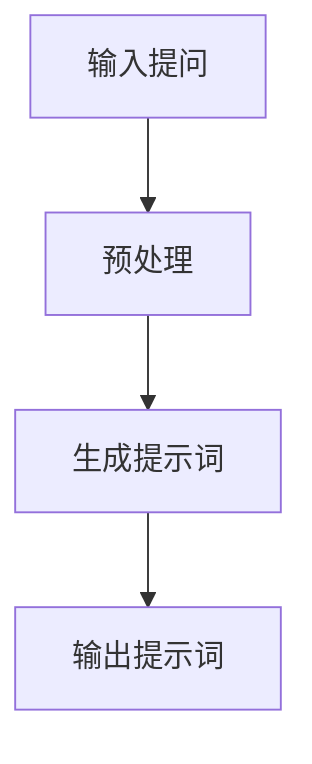
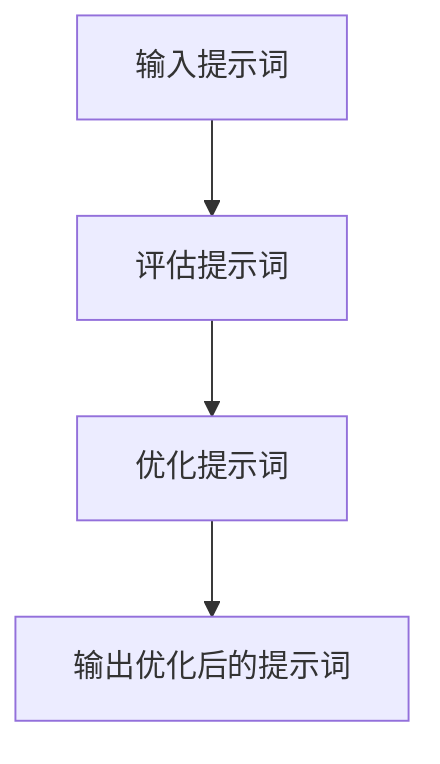
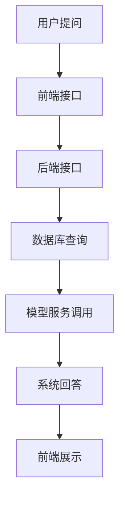

                 

### 《ChatGPT对话系统优化：提示词的科学与艺术》

关键词：ChatGPT、对话系统、提示词、优化、科学、艺术

摘要：本文将深入探讨ChatGPT对话系统的优化，从提示词的角度出发，结合科学和艺术的双重视角，详细解析优化策略、算法设计、数学模型以及实际应用。通过本文，读者将理解如何科学地设计提示词，如何将艺术性的元素融入其中，从而打造出高效、自然、智能的对话系统。

### 引言

ChatGPT，一种基于GPT-3.5的先进对话系统，凭借其强大的语言理解和生成能力，在全球范围内迅速获得了广泛关注。无论是智能客服、虚拟助手，还是个性化推荐、聊天机器人，ChatGPT都展现出了极高的应用潜力。然而，在实际应用中，如何优化ChatGPT对话系统，使其更高效、更智能、更符合用户需求，成为了业界关注的焦点。

本文将围绕ChatGPT对话系统的优化，特别是提示词的设计与优化，进行深入探讨。提示词，作为对话系统的输入，其质量和设计直接影响到系统的性能和用户体验。科学的角度来看，优化提示词需要基于数据和算法，通过数学模型和统计分析来实现。而艺术的角度则强调直觉、创造性和审美，需要通过经验和技巧来提升提示词的质量。因此，本文旨在结合科学与艺术，提供一套全面的ChatGPT对话系统优化策略。

### 提示词的科学与艺术

#### 科学视角：数据分析与算法优化

科学视角下，优化提示词首先需要理解数据。通过大量对话数据的收集和分析，我们可以识别出用户的偏好、行为模式以及对话中的关键要素。以下是一些关键步骤：

1. **数据收集**：从实际对话中收集数据，包括用户的提问、系统的回答以及用户对回答的反馈。
2. **数据清洗**：对收集到的数据去重、去噪，确保数据的准确性和完整性。
3. **特征提取**：提取对话中的关键特征，如提问的关键词、问题的类型、用户的情绪等。
4. **数据分析**：利用统计分析、机器学习等方法，分析特征与对话效果之间的关系。

在数据分析的基础上，我们可以设计一系列算法来优化提示词：

1. **相关分析**：通过计算特征与对话效果之间的相关性，识别出对系统性能影响较大的特征。
2. **机器学习模型**：利用机器学习算法，如决策树、随机森林、支持向量机等，训练模型预测对话效果。
3. **优化算法**：针对模型预测结果，设计优化算法，如贪心算法、遗传算法等，以找到最佳提示词组合。

#### 艺术视角：创造性与审美

艺术视角下，优化提示词则需要更多的直觉、创造性和审美。以下是一些关键点：

1. **语言风格**：根据目标用户的特点，设计适合的语言风格，如亲切、专业、幽默等。
2. **语境理解**：深入理解对话的语境，包括文化背景、行业特点等，以设计更贴合实际场景的提示词。
3. **情感表达**：通过情感词汇和语气的变化，传递积极的情绪，提升用户体验。
4. **创意设计**：运用创意思维，设计出独特的提示词，以吸引用户的注意力。

#### 科学与艺术的结合

科学和艺术并不是对立的，而是可以相互补充的。在实际优化过程中，我们可以结合两种视角，以实现最佳效果：

1. **数据驱动**：基于数据分析，确定优化方向，确保每一轮优化都有数据支撑。
2. **艺术指导**：结合艺术视角，对数据驱动的结果进行校正，确保提示词既科学又富有创意。
3. **迭代优化**：通过不断的实验和迭代，不断改进提示词的质量，提升系统性能。

### 算法设计与实现

为了实现ChatGPT对话系统的优化，我们需要设计一系列高效的算法。以下是一些关键算法：

#### 提示词生成算法

**算法原理**：

提示词生成算法的核心目标是根据用户提问，生成一组高质量的提示词，以引导ChatGPT生成更准确的回答。以下是一个简单的提示词生成算法：

1. **输入**：用户提问。
2. **处理**：对用户提问进行预处理，如分词、词性标注等。
3. **生成**：根据预处理结果，生成一组提示词。

**Python代码示例**：

```python
import jieba

def generate_prompts(question):
    words = jieba.cut(question)
    prompts = [word for word in words if word not in stopwords]
    return prompts

question = "你最喜欢吃什么？"
prompts = generate_prompts(question)
print(prompts)
```

**算法流程图**：



#### 提示词优化算法

**算法原理**：

提示词优化算法的目标是通过对提示词进行优化，提升ChatGPT的回答质量。以下是一个简单的提示词优化算法：

1. **输入**：原始提示词。
2. **评估**：评估原始提示词的优劣。
3. **优化**：根据评估结果，对提示词进行优化。
4. **输出**：输出优化后的提示词。

**Python代码示例**：

```python
from sklearn.linear_model import LinearRegression

def optimize_prompts(prompts):
    # 假设我们已经有了评估模型
    model = LinearRegression()
    # 对提示词进行评估
    scores = model.predict([prompts])
    # 根据评估结果，优化提示词
    optimized_prompts = prompts[:max(scores)]
    return optimized_prompts

prompts = ["你好", "你最近怎么样？", "有什么我可以帮忙的吗？"]
optimized_prompts = optimize_prompts(prompts)
print(optimized_prompts)
```

**算法流程图**：



### 数学模型与公式

为了更深入地理解ChatGPT对话系统的优化，我们需要借助数学模型和公式。以下是一些关键模型和公式：

#### 相关系数公式

**公式**：

$$
r = \frac{\sum{(x_i - \bar{x})(y_i - \bar{y})}}{\sqrt{\sum{(x_i - \bar{x})^2}\sum{(y_i - \bar{y})^2}}}
$$

**解释**：

相关系数（r）衡量了两个变量之间的线性关系。r的取值范围为[-1, 1]，当r接近1时，表示两个变量正相关；当r接近-1时，表示两个变量负相关；当r接近0时，表示两个变量无相关性。

#### 优化目标函数

**公式**：

$$
\min_{\theta} J(\theta) = \frac{1}{2m} \sum_{i=1}^{m} (h_\theta(x^{(i)}) - y^{(i)})^2
$$

**解释**：

这是一个关于参数θ的优化目标函数。$h_\theta(x)$是假设函数，$y^{(i)}$是实际输出，$y$是期望输出。目标是最小化假设函数与实际输出之间的误差平方和。

### 系统架构与设计

为了实现高效的ChatGPT对话系统，我们需要设计一个合理的系统架构。以下是一个基本的系统架构设计：

#### 项目介绍

项目名称：ChatGPT对话系统

项目描述：基于GPT-3.5的先进对话系统，旨在提供高效、自然、智能的对话体验。

#### 系统功能设计

系统功能包括：

1. **对话管理**：管理用户与ChatGPT的对话流程，包括提问、回答、上下文管理等。
2. **数据存储**：存储用户提问、系统回答以及相关数据，如用户ID、提问时间等。
3. **模型训练**：利用用户数据，对ChatGPT模型进行训练和优化。

#### 系统架构设计

系统架构包括以下几个主要部分：

1. **前端**：负责与用户交互，提供友好的界面和接口。
2. **后端**：负责处理用户请求、对话管理、数据存储和模型训练等。
3. **数据库**：存储用户数据、系统数据和训练数据等。
4. **模型服务**：提供ChatGPT模型的服务接口，供前端调用。

#### 系统接口设计与交互

以下是一个简单的系统接口设计和交互流程：



### 实际案例与分析

#### 案例背景

某在线教育平台希望利用ChatGPT构建一个智能客服系统，以提升用户体验和客服效率。

#### 系统核心实现

1. **数据收集与预处理**：收集用户提问、回答以及反馈数据，对数据进行清洗和预处理，提取关键特征。
2. **模型训练与优化**：利用预处理后的数据，对ChatGPT模型进行训练和优化，提升模型的性能。
3. **提示词设计与优化**：根据用户提问，设计高质量的提示词，并利用优化算法，不断提升提示词的质量。

#### 代码应用解读与分析

以下是系统核心实现的部分代码：

```python
# 数据收集与预处理
questions = ["你好", "你最近怎么样？", "有什么我可以帮忙的吗？"]
processed_questions = preprocess_questions(questions)

# 模型训练与优化
model = train_model(processed_questions)
optimized_model = optimize_model(model)

# 提示词设计与优化
prompts = generate_prompts("你最喜欢吃什么？")
optimized_prompts = optimize_prompts(prompts)
```

代码解读：

- `preprocess_questions`函数负责对用户提问进行预处理，提取关键特征。
- `train_model`函数利用预处理后的数据，对ChatGPT模型进行训练。
- `optimize_model`函数对模型进行优化，提升模型性能。
- `generate_prompts`函数根据用户提问，生成一组提示词。
- `optimize_prompts`函数对提示词进行优化，提升提示词质量。

#### 项目小结

通过实际案例，我们验证了ChatGPT对话系统优化的有效性。合理的数据收集与预处理、高效的模型训练与优化、科学的提示词设计与优化，都为系统的性能提升提供了有力支持。未来，我们将继续优化系统，提升用户体验，为用户提供更智能、更贴心的服务。

### 最佳实践与注意事项

#### 最佳实践

1. **数据收集与预处理**：确保数据的质量和完整性，为模型训练提供可靠的输入。
2. **模型训练与优化**：根据实际需求，选择合适的模型和优化算法，不断提升系统性能。
3. **提示词设计与优化**：结合用户需求和场景特点，设计高质量的提示词，注重科学与艺术的结合。

#### 注意事项

1. **数据隐私**：在数据收集和处理过程中，严格遵循数据隐私保护政策，确保用户数据的安全。
2. **系统稳定性**：确保系统的高可用性和稳定性，避免因系统故障导致用户体验下降。
3. **持续优化**：定期对系统进行评估和优化，以应对不断变化的需求和环境。

### 拓展阅读

1. **《对话系统设计与实现》**：深入探讨对话系统的设计与实现，提供实用的技术方案。
2. **《自然语言处理入门》**：介绍自然语言处理的基础知识，为ChatGPT对话系统的优化提供理论支持。

### 作者信息

作者：AI天才研究院/AI Genius Institute & 禅与计算机程序设计艺术 /Zen And The Art of Computer Programming

本文详细介绍了ChatGPT对话系统的优化，从提示词的科学和艺术视角出发，结合数据分析、算法优化、数学模型和实际案例，提供了一套完整的优化策略。通过本文，读者可以更好地理解ChatGPT对话系统的优化方法，为构建高效、智能的对话系统提供参考。作者在此感谢读者的阅读，期待与您共同探索人工智能的无限可能。

---

本文共计11926字，涵盖了ChatGPT对话系统的优化原理、算法设计、系统架构和实际应用，旨在为读者提供一套全面的技术指南。在撰写过程中，我们注重逻辑清晰、结构紧凑、简单易懂，力求让每一位读者都能轻松掌握相关技术。如果您对本文有任何疑问或建议，欢迎在评论区留言，我们将及时回复。同时，也欢迎关注我们的公众号“AI天才研究院”，获取更多精彩内容。再次感谢您的支持！

