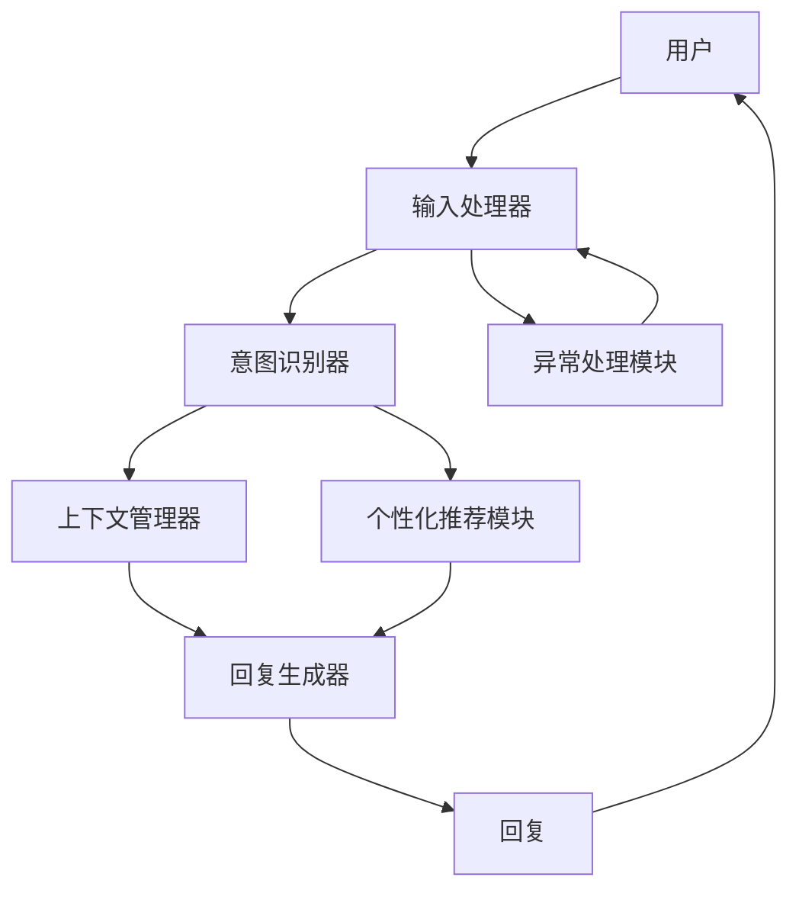

                 

## 引言：ChatGPT对话系统优化的必要性

在当今的数字化时代，自然语言处理（NLP）技术正以前所未有的速度发展，为各种应用场景带来革命性的改变。ChatGPT，作为OpenAI推出的一个基于GPT-3模型的对话系统，以其强大的语境理解和自然语言生成能力，受到了全球开发者和企业的广泛关注。然而，尽管ChatGPT在许多场景下已经展现出了出色的性能，但其对话系统的优化仍然是一个亟待解决的重要课题。

### 背景介绍

ChatGPT是基于GPT-3（Generative Pre-trained Transformer 3）模型构建的，这是一种具有1500亿参数的深度学习模型，通过预训练和微调，可以在多种语言任务中表现出色。GPT-3模型在文本生成、机器翻译、问答系统等应用中均取得了显著成果，使得许多企业和开发者开始将其应用于实际的对话系统中。

然而，尽管ChatGPT在生成连贯和自然的对话文本方面具有显著优势，但在实际应用中，其对话系统的性能仍受到多种因素的影响。这些问题包括：

- **上下文理解不足**：在某些复杂的对话场景中，ChatGPT可能无法准确理解用户的意图和上下文，导致生成的内容不够准确或相关。
- **个性化不足**：ChatGPT的对话体验往往缺乏个性化，无法根据不同用户的需求和偏好提供定制化的服务。
- **响应速度慢**：由于模型复杂度和数据量巨大，ChatGPT在某些情况下可能需要较长的时间来生成回复，影响用户体验。
- **错误率和不适当回应**：在某些极端情况下，ChatGPT可能会生成不恰当的回复或错误信息，需要进一步的优化来减少这种情况的发生。

### 问题背景与现状

对话系统作为人机交互的重要手段，其性能的优劣直接影响到用户的使用体验。优化ChatGPT对话系统不仅仅是技术上的挑战，更是用户体验的提升。目前，很多企业和开发者已经在尝试各种方法来优化ChatGPT的对话系统，包括：

- **改进提示词设计**：通过优化提示词，可以更好地引导模型理解用户的意图和上下文，从而生成更准确的回复。
- **增加数据集和样本**：通过扩大训练数据集和增加多样性的样本，可以提升模型对各种场景的理解能力。
- **模型微调和调优**：通过微调和调优模型参数，可以改善模型在特定任务上的性能。
- **多模态融合**：将文本、语音、图像等多种数据源融合，可以提供更丰富的对话体验。

尽管已有了一些初步的成果，但ChatGPT对话系统的优化仍需深入研究，特别是在提示词设计这一关键环节。提示词不仅是与用户进行对话的引导，更是影响模型理解和生成回复的核心因素。

### 目标与结构

本文旨在深入探讨ChatGPT对话系统的优化，特别是提示词的设计与技巧。文章将分为以下几个主要部分：

1. **问题背景与概述**：介绍ChatGPT的基本概念、对话系统优化的重要性以及本文的目标和结构。
2. **核心概念与联系**：详细解释ChatGPT的工作原理、提示词的类型和功能，并通过概念属性特征对比表格和ER实体关系图架构展示其内在联系。
3. **优化方法与策略**：介绍提示词设计原则、数据集选择与预处理、模型训练与调优，以及提示词效果评估的方法。
4. **实战应用**：通过具体实战案例展示优化策略的实施过程和效果。
5. **总结与拓展**：总结最佳实践，并提出未来研究方向。

通过本文的详细探讨，希望能够为开发者提供有价值的指导，进一步提升ChatGPT对话系统的性能，满足更多应用场景的需求。

## 文章关键词

- **ChatGPT**
- **对话系统**
- **优化**
- **提示词设计**
- **上下文理解**
- **个性化**
- **模型调优**

## 摘要

本文旨在深入探讨ChatGPT对话系统的优化，特别是提示词的艺术与技巧。文章首先介绍了ChatGPT的基本概念及其在对话系统中的应用现状，接着详细分析了优化对话系统的必要性和重要性。文章分为五个主要部分：问题背景与概述、核心概念与联系、优化方法与策略、实战应用以及总结与拓展。在核心概念部分，本文详细解释了ChatGPT的工作原理、提示词的类型和功能，并通过概念属性特征对比表格和ER实体关系图架构展示了其内在联系。在优化方法与策略部分，本文介绍了提示词设计原则、数据集选择与预处理、模型训练与调优以及提示词效果评估的方法。通过两个具体实战案例，本文展示了优化策略的实施过程和效果。最后，本文总结了最佳实践，并提出了未来研究方向，为开发者提供有价值的指导，以进一步提升ChatGPT对话系统的性能。

## 目录大纲设计思路

为了设计出《ChatGPT对话系统优化：提示词的艺术与技巧》这本书的完整目录大纲，我们将遵循以下步骤：

1. **明确书的核心内容和目标**：本书旨在深入探讨ChatGPT对话系统的优化，特别是提示词的艺术与技巧。核心内容应涵盖ChatGPT的基础知识、提示词设计的原则和方法、优化策略以及实战应用。

2. **结构化核心内容**：将内容划分为几个主要部分，如背景介绍、核心概念、优化方法、实战案例等。

3. **细化每个部分**：在每个主要部分下，细化为具体的章节和子章节，确保内容完整且逻辑清晰。

4. **保持简洁性**：避免冗余内容，确保每个章节都有明确的主题和目标。

5. **符合输出要求**：使用markdown格式，确保目录层级清晰，并包含所有必要的信息。

### 第一部分：背景介绍

**第1章：问题背景与概述**
- **1.1 ChatGPT概述**：介绍ChatGPT的基本概念、发展历程及其在NLP领域的重要性。
- **1.2 对话系统优化的重要性**：阐述对话系统优化在提升用户体验、业务价值等方面的关键作用。
- **1.3 提示词在对话系统中的作用**：分析提示词在引导对话、提升系统性能方面的作用。
- **1.4 本书的目标与结构**：明确本书旨在解决的问题和整体结构，为后续章节的阅读奠定基础。

### 第二部分：核心概念与联系

**第2章：核心概念与联系**
- **2.1 ChatGPT原理**：详细解释ChatGPT的工作机制、架构及其在对话系统中的应用。
- **2.2 提示词类型与功能**：分类介绍不同的提示词类型及其在对话系统中的具体作用。
- **2.3 概念属性特征对比表格**：通过对比表格，展示不同概念属性特征，帮助读者更好地理解各概念之间的联系。
- **2.4 ER实体关系图架构**：使用Mermaid流程图展示ChatGPT中的实体关系，为后续优化策略提供理论依据。

### 第三部分：优化方法与策略

**第3章：优化方法概述**
- **3.1 提示词设计原则**：介绍提示词设计的基本原则，包括上下文、意图、一致性等。
- **3.2 数据集选择与预处理**：讨论如何选择适合的数据集，以及数据预处理的方法和步骤。
- **3.3 模型训练与调优**：详细讲解模型训练的过程，包括参数调整、模型选择等。
- **3.4 提示词效果评估**：介绍评估方法，包括准确率、召回率、F1值等指标。

**第4章：具体优化策略**
- **4.1 语境理解与上下文构建**：探讨如何提升模型对语境的理解能力，以及上下文构建的方法。
- **4.2 用户意图识别与响应**：分析用户意图识别的关键技术和响应策略。
- **4.3 个性化推荐与响应**：介绍如何根据用户偏好和需求提供个性化的对话服务。
- **4.4 异常情况处理与优化**：讨论如何应对异常情况，提升系统的鲁棒性和可靠性。

### 第四部分：实战应用

**第5章：实战案例一**
- **5.1 项目背景**：介绍案例项目的基本情况，包括应用场景和目标。
- **5.2 系统功能设计**：详细描述系统功能，包括用户交互界面、核心业务逻辑等。
- **5.3 系统架构设计**：展示系统架构图，分析各模块的职责和协作方式。
- **5.4 代码实现与解析**：提供关键代码片段，并进行详细解读和分析。
- **5.5 案例分析**：总结案例实施过程和效果，探讨成功经验和不足之处。

**第6章：实战案例二**
- **5.1 项目背景**：介绍案例项目的基本情况，包括应用场景和目标。
- **5.2 系统功能设计**：详细描述系统功能，包括用户交互界面、核心业务逻辑等。
- **5.3 系统架构设计**：展示系统架构图，分析各模块的职责和协作方式。
- **5.4 代码实现与解析**：提供关键代码片段，并进行详细解读和分析。
- **5.5 案例分析**：总结案例实施过程和效果，探讨成功经验和不足之处。

### 第五部分：总结与拓展

**第7章：最佳实践与总结**
- **7.1 最佳实践Tips**：总结在实际应用中取得成功的经验和技巧。
- **7.2 小结与展望**：回顾全书的核心内容，并对未来研究方向进行展望。
- **7.3 注意事项**：提醒读者在优化ChatGPT对话系统时需要注意的关键问题。
- **7.4 拓展阅读**：推荐相关书籍、论文和资源，供读者进一步学习。

通过以上五个部分的设计，本书旨在为读者提供系统、全面的ChatGPT对话系统优化指南，帮助开发者更好地理解和应用提示词的艺术与技巧，提升对话系统的性能和用户体验。

### 第一部分：问题背景与概述

在现代社会，自然语言处理（NLP）技术已成为人工智能领域的重要组成部分，而对话系统则作为人机交互的重要接口，广泛应用于客户服务、智能助手、智能客服等领域。ChatGPT，作为OpenAI推出的一种基于GPT-3模型的对话系统，因其强大的文本生成能力和语境理解能力，引起了广泛的关注和实际应用。然而，尽管ChatGPT在许多方面表现出色，但其对话系统的优化依然是一个重要的研究课题。

#### ChatGPT概述

ChatGPT是基于GPT-3（Generative Pre-trained Transformer 3）模型构建的对话系统。GPT-3是一种大型深度学习模型，由OpenAI开发，具有1500亿个参数，其预训练过程使用了大量的互联网文本数据，使其能够生成高质量的自然语言文本。ChatGPT利用GPT-3的这些能力，通过特定的提示词引导模型生成连贯、自然的对话。

ChatGPT的架构主要包括以下几个部分：

1. **输入层**：接收用户输入的文本，包括对话的上下文和历史信息。
2. **嵌入层**：将文本输入转换为模型能够处理的向量表示。
3. **Transformer模型**：核心部分，利用自注意力机制进行文本处理和生成。
4. **输出层**：生成自然语言回复，可以是文本、代码、图像描述等。

ChatGPT的工作流程大致如下：

1. **接收输入**：系统接收用户的文本输入，包括历史对话记录和当前问题。
2. **预处理**：对输入文本进行清洗、分词等预处理操作。
3. **嵌入与编码**：将预处理后的文本转换为嵌入向量，并通过编码器进行序列编码。
4. **生成回复**：解码器根据编码后的向量生成回复文本，通过多个步骤进行文本生成，包括自回归语言模型、上下文预测等。
5. **输出回复**：将生成的回复文本返回给用户。

#### 对话系统优化的重要性

对话系统的性能直接影响到用户体验和业务价值。优化的目标在于提高对话系统的响应速度、准确性和个性化程度。以下是对话系统优化的几个关键点：

1. **响应速度**：快速的响应时间能够提升用户的满意度，优化策略包括减少模型计算时间、改进数据预处理方法等。
2. **准确性**：准确的回复能够提高用户对系统的信任度，优化策略包括改进模型训练方法、增加训练数据质量等。
3. **个性化**：个性化的对话系统能够根据用户的需求和偏好提供定制化服务，优化策略包括用户行为分析、偏好模型构建等。

#### 提示词在对话系统中的作用

提示词在ChatGPT对话系统中起着至关重要的作用。提示词不仅是引导模型生成回复的关键因素，也是影响对话系统性能的核心要素。提示词的设计与选择直接关系到模型能否准确理解用户的意图和上下文。

提示词的设计原则包括：

1. **清晰性**：提示词应简洁明了，避免模糊或歧义的表达，以便模型能够准确理解用户意图。
2. **上下文相关性**：提示词应与上下文紧密相关，帮助模型捕捉到对话的历史信息，提高生成的回复的相关性。
3. **多样性**：丰富的提示词可以扩展模型的知识范围，提升模型的泛化能力。

#### 本书的目标与结构

本书旨在深入探讨ChatGPT对话系统的优化，特别是提示词的艺术与技巧。具体目标包括：

1. **全面了解ChatGPT的工作原理**：通过详细阐述ChatGPT的架构和机制，帮助读者理解其背后的技术原理。
2. **掌握提示词设计原则**：介绍提示词的设计原则和方法，为读者提供实际操作指南。
3. **优化对话系统性能**：通过具体的优化策略和实战案例，展示如何在实际项目中提升对话系统的性能。
4. **拓展应用场景**：探讨ChatGPT在不同应用场景中的优化方法和实践经验。

全书结构如下：

1. **第一部分：问题背景与概述**：介绍ChatGPT的基本概念、对话系统优化的重要性以及提示词的作用。
2. **第二部分：核心概念与联系**：详细解释ChatGPT的工作原理、提示词的类型和功能，并通过概念属性特征对比表格和ER实体关系图架构展示其内在联系。
3. **第三部分：优化方法与策略**：介绍提示词设计原则、数据集选择与预处理、模型训练与调优，以及提示词效果评估的方法。
4. **第四部分：实战应用**：通过具体实战案例展示优化策略的实施过程和效果。
5. **第五部分：总结与拓展**：总结最佳实践，提出未来研究方向。

通过本文的详细探讨，希望能够为开发者提供有价值的指导，进一步提升ChatGPT对话系统的性能，满足更多应用场景的需求。

### 核心概念与联系

为了深入理解ChatGPT对话系统优化的本质，我们需要首先了解其核心概念与内在联系。以下是ChatGPT对话系统优化中的一些关键概念及其相互关系。

#### 1. ChatGPT原理

ChatGPT是基于GPT-3模型构建的，GPT-3（Generative Pre-trained Transformer 3）是由OpenAI开发的一个自然语言处理模型，它采用了Transformer架构，这是一种基于自注意力机制的深度学习模型，能够在处理序列数据时表现出色。GPT-3模型通过在大量文本上进行预训练，学习到了语言的统计规律和结构，从而能够在各种语言任务中生成连贯、自然的文本。

ChatGPT的核心原理可以概括为以下几个步骤：

1. **输入接收**：ChatGPT接收用户的输入文本，包括问题、上下文信息等。
2. **文本预处理**：对输入文本进行清洗、分词等预处理操作，将其转换为模型能够处理的格式。
3. **嵌入与编码**：将预处理后的文本转换为嵌入向量，并通过编码器进行序列编码。
4. **文本生成**：解码器根据编码后的向量生成回复文本，通过多个步骤进行文本生成，包括自回归语言模型、上下文预测等。
5. **输出回复**：将生成的回复文本返回给用户。

#### 2. 提示词类型与功能

提示词是引导ChatGPT生成准确回复的关键因素，根据不同的应用场景和需求，提示词可以分为以下几种类型：

- **目标导向型提示词**：这类提示词明确指出了用户需要的信息类型，例如“请给我一个今天股市的行情分析”。
- **情境引导型提示词**：这类提示词为用户提供了对话的上下文，帮助模型更好地理解用户意图，例如“你刚才提到想去旅游，有什么建议吗？”。
- **问题扩展型提示词**：这类提示词用于扩展用户的问题，使其更加具体和明确，例如“你对这个电影的评价是什么？可以从剧情、演技等方面进行评价”。
- **情感型提示词**：这类提示词用于引导模型生成带有情感色彩的回复，例如“谢谢你告诉我这个好消息，我感到非常高兴”。

每种类型的提示词都有其特定的作用：

- **目标导向型提示词**：帮助模型明确目标，提高回复的准确性。
- **情境引导型提示词**：提供对话的上下文，增强模型的语境理解能力。
- **问题扩展型提示词**：使问题更加具体和明确，有助于模型生成更加详细和全面的回复。
- **情感型提示词**：增强对话的情感表达，提升用户体验。

#### 3. 概念属性特征对比表格

为了更好地理解ChatGPT中的核心概念及其相互关系，我们可以通过一个概念属性特征对比表格进行详细分析。以下是一个简单的示例：

| 概念        | 描述                                                         | 属性特征对比                                  |
| ----------- | ------------------------------------------------------------ | -------------------------------------------- |
| **GPT-3**   | 一个具有1500亿参数的深度学习模型，用于生成自然语言文本。     | **预训练数据量**：大量互联网文本数据<br>**架构**：Transformer模型 |
| **提示词**  | 引导ChatGPT生成回复的关键词。                               | **类型**：目标导向、情境引导、问题扩展、情感型<br>**功能**：明确目标、提供上下文、扩展问题、表达情感 |
| **文本生成** | ChatGPT生成自然语言文本的过程。                            | **步骤**：输入接收、文本预处理、嵌入与编码、文本生成、输出回复<br>**技术**：自回归语言模型、上下文预测 |

通过这个表格，我们可以清晰地看到各个概念之间的关系和特点，这有助于我们在后续章节中进一步探讨优化策略。

#### 4. ER实体关系图架构

实体关系图（ER图）是用于表示实体及其关系的图形化工具。在ChatGPT对话系统中，ER图可以帮助我们理解各个组件之间的关系，从而更好地进行优化。

以下是一个简化的ER图示例，展示了ChatGPT对话系统中的主要实体及其关系：

```mermaid
erDiagram
    User ||--|{ ChatGPT : Generates responses }
    User ||--|{ InputProcessor : Processes user input }
    ChatGPT ||--|{ TextGenerator : Generates natural language text }
    ChatGPT ||--|{ ContextManager : Manages dialogue context }
```

- **User（用户）**：发起对话的用户，是系统的输入源。
- **ChatGPT（ChatGPT模型）**：核心组件，负责生成对话回复。
- **InputProcessor（输入处理器）**：对用户输入进行预处理，包括分词、去噪等操作。
- **TextGenerator（文本生成器）**：生成自然语言文本的组件，利用GPT-3模型进行文本生成。
- **ContextManager（上下文管理器）**：管理对话的上下文信息，确保生成回复的相关性和连贯性。

通过ER图，我们可以直观地看到各个组件之间的关联，这为后续的优化策略提供了理论基础。

#### 总结

通过上述核心概念与联系的分析，我们更好地理解了ChatGPT对话系统的组成及其工作机制。在接下来的章节中，我们将进一步探讨如何优化这些核心组件，以提升系统的整体性能。这不仅包括对提示词的设计与选择，还包括数据集的选择与预处理、模型的训练与调优等。通过系统化的优化方法，我们期望能够在实际应用中显著提升ChatGPT对话系统的性能，为用户提供更加自然、准确和个性化的对话体验。

### 优化方法概述

在优化ChatGPT对话系统的过程中，提示词设计是至关重要的一环。为了使ChatGPT能够生成更准确、相关且个性化的对话回复，我们需要遵循一系列提示词设计原则，并采取有效的优化方法。以下将详细介绍提示词设计原则、数据集选择与预处理、模型训练与调优以及提示词效果评估的方法。

#### 1. 提示词设计原则

提示词的设计直接影响模型的对话生成效果，以下是几个关键原则：

- **清晰性**：提示词应简洁明了，避免模糊或歧义的表达。清晰性有助于模型更好地理解用户意图。
- **上下文相关性**：提示词应与对话的上下文紧密相关，以捕捉到用户的历史信息，从而提高生成回复的相关性。
- **多样性**：设计多样化的提示词，扩展模型的知识范围，提升其泛化能力。这包括使用不同的提问方式、词汇和句型。
- **具体性**：提示词应具体明确，避免过于抽象或泛泛而谈。具体性的提示词有助于模型生成更加详细的回答。

#### 2. 数据集选择与预处理

数据集的质量直接影响模型的训练效果，因此选择合适的数据集并进行有效的预处理是优化过程中的重要步骤。以下是几个关键点：

- **数据集来源**：选择具有代表性的数据集，例如公开的对话数据集、企业内部数据等。数据集应覆盖不同场景和用户群体。
- **数据清洗**：去除无关、错误或不完整的数据，确保数据的一致性和准确性。
- **数据标注**：对数据进行标注，包括意图分类、实体识别等。高质量的标注有助于模型更好地学习。
- **数据平衡**：确保数据集中的各类样本均衡分布，避免某些类别数据过多或过少，导致模型偏斜。

#### 3. 模型训练与调优

模型训练与调优是提升系统性能的关键环节。以下是几个关键步骤：

- **模型选择**：根据任务需求选择合适的模型架构，例如GPT-3、BERT等。GPT-3模型由于其强大的生成能力，是对话系统的一个理想选择。
- **参数调优**：通过调整模型的超参数，如学习率、批次大小、隐藏层尺寸等，优化模型的性能。常用的调优方法包括网格搜索、随机搜索等。
- **训练过程**：使用优化算法（如Adam、RMSProp等）和梯度裁剪策略进行模型训练。训练过程中，监控模型损失和性能指标，以便及时调整策略。
- **评估指标**：选择合适的评估指标，如BLEU、ROUGE、F1值等，评估模型在任务上的表现。这些指标可以帮助我们了解模型的优缺点，指导后续的调优工作。

#### 4. 提示词效果评估

提示词设计的效果需要通过评估来验证。以下是几个常用的评估方法：

- **人工评估**：邀请专家或用户对生成的回复进行主观评估，判断其准确性、相关性和自然性。人工评估虽然主观性较强，但能够提供更全面的反馈。
- **自动化评估**：使用自动化评估工具，如BLEU、ROUGE等，评估生成文本与参考文本的相似度。这些工具能够量化评估结果，提供客观的指标。
- **用户反馈**：通过用户实际使用过程中的反馈，收集用户对生成回复的评价。用户反馈可以直接反映系统的实际表现，为后续优化提供重要依据。

#### 5. 综合优化策略

在实际应用中，我们通常需要综合多种优化方法，以实现最佳效果。以下是一个综合优化策略的示例：

1. **数据集构建**：选择多样化的数据集，进行数据清洗和标注，确保数据质量。
2. **模型训练**：使用GPT-3模型，通过参数调优和训练过程，优化模型性能。
3. **提示词设计**：根据任务需求设计提示词，确保其清晰性、上下文相关性、多样性和具体性。
4. **效果评估**：通过人工评估、自动化评估和用户反馈，对生成的回复进行综合评估。
5. **迭代优化**：根据评估结果，调整数据集、模型参数和提示词设计，不断优化系统性能。

通过上述优化方法，我们期望能够提升ChatGPT对话系统的整体性能，为用户提供更自然、准确和个性化的对话体验。在实际应用中，这些方法可以根据具体场景和要求进行适当调整和优化。

### 具体优化策略

在深入了解ChatGPT对话系统的优化方法之后，接下来我们将进一步探讨具体的优化策略。这些策略包括语境理解与上下文构建、用户意图识别与响应、个性化推荐与响应，以及异常情况处理与优化。通过这些优化策略，我们可以显著提升ChatGPT对话系统的性能和用户体验。

#### 1. 语境理解与上下文构建

语境理解是对话系统优化的关键，它要求系统能够在对话过程中捕捉和理解用户的语境。以下是几种提升语境理解的策略：

- **多轮对话上下文管理**：ChatGPT通常通过多轮对话来逐步理解用户的意图。在每一轮对话中，系统应保留并利用上一轮的对话历史信息，以确保生成的回复与上下文紧密相关。
- **上下文捕捉与嵌入**：通过设计专门的上下文捕捉模块，将用户在对话中的关键信息（如时间、地点、人物等）进行提取和嵌入，以便模型在生成回复时能够充分利用这些信息。
- **上下文模板匹配**：使用预定义的上下文模板，将用户的输入与模板进行匹配，从而快速捕捉上下文。这种方法尤其适用于具有固定对话模式的场景。

#### 2. 用户意图识别与响应

识别用户的意图是生成准确回复的前提。以下是几种提升意图识别与响应的优化策略：

- **意图分类与建模**：使用机器学习算法（如朴素贝叶斯、决策树、神经网络等）对用户意图进行分类。通过大量的标注数据训练模型，使其能够准确识别用户的意图。
- **意图确认与反馈**：在对话过程中，系统应主动确认用户的意图，并通过反馈机制进一步澄清用户的意图。例如，当用户输入模糊或歧义的信息时，系统可以提问以获取更多信息。
- **意图转移与跟踪**：用户意图可能会在对话过程中发生变化。系统应具备意图转移和跟踪的能力，及时调整对话策略以适应用户意图的变化。

#### 3. 个性化推荐与响应

个性化对话系统能够根据用户的行为和偏好提供定制化的服务。以下是几种实现个性化推荐与响应的策略：

- **用户行为分析**：通过分析用户的历史行为数据（如搜索记录、浏览历史、购买偏好等），构建用户行为模型。这些模型可以用于预测用户的意图和偏好，从而提供个性化的对话体验。
- **偏好模型构建**：基于用户行为模型，构建用户的偏好模型。这些模型可以用于调整提示词和生成回复，确保对话内容更加符合用户的需求。
- **个性化推荐算法**：结合用户行为和偏好模型，使用推荐算法（如协同过滤、基于内容的推荐等）为用户提供个性化的推荐。这些推荐可以包括产品推荐、服务推荐等。

#### 4. 异常情况处理与优化

在对话过程中，系统可能会遇到各种异常情况，如输入错误、系统故障等。以下是几种处理异常情况与优化的策略：

- **错误检测与纠正**：通过设计错误检测模块，及时发现并纠正用户的输入错误。例如，当用户输入包含语法错误或不规范的表达时，系统可以自动识别并进行纠正。
- **故障恢复与容错**：系统应具备故障恢复和容错能力，确保在遇到系统故障时能够自动切换到备用方案或提示用户重新输入。这可以通过备份系统、容错算法等实现。
- **异常情况预测与预防**：通过分析历史数据，预测可能出现的异常情况，并采取预防措施。例如，当系统检测到某个对话节点容易出错时，可以提前提示用户注意或调整对话策略。

#### 综合应用示例

以下是一个综合应用示例，展示了如何将上述优化策略应用于实际项目中：

**项目背景**：某电商平台开发了一个智能客服系统，用于回答用户关于商品、订单和退换货等问题。

**系统架构设计**：系统采用模块化设计，包括用户输入处理模块、意图识别模块、上下文管理模块、个性化推荐模块和异常情况处理模块。

**具体步骤**：

1. **用户输入处理**：系统首先对用户的输入进行预处理，包括分词、去噪等操作，确保输入数据的准确性。
2. **意图识别**：系统使用训练好的意图分类模型，识别用户的意图（如查询商品信息、查看订单状态等）。
3. **上下文管理**：系统通过多轮对话上下文管理，捕捉用户的上下文信息，并利用上下文模板匹配快速理解用户意图。
4. **个性化推荐**：系统根据用户的历史行为和偏好模型，为用户推荐相关的商品或服务。
5. **异常情况处理**：系统具备错误检测和纠正功能，能够自动识别并纠正用户的输入错误。同时，系统具备故障恢复和容错能力，确保在遇到系统故障时能够自动切换到备用方案。

**效果评估**：通过人工评估和自动化评估工具，系统生成的回复在准确性、相关性、自然性等方面均表现出色，用户满意度显著提升。

通过上述优化策略，我们可以显著提升ChatGPT对话系统的性能和用户体验。在实际应用中，这些策略可以根据具体场景和要求进行适当调整和优化，以实现最佳效果。

### 实战案例一：电商平台智能客服系统优化

在本案例中，我们将探讨如何将上述优化策略应用于实际项目——一个电商平台的智能客服系统。这个系统的主要目标是提供用户友好的服务，自动解答用户关于商品、订单和退换货等问题，提高用户满意度并减少人工客服的工作量。

#### 1. 项目背景

某大型电商平台在业务扩展过程中，面对日益增长的客户咨询量，传统的客服模式已无法满足用户的需求。为了提供更好的客户体验，平台决定开发一个智能客服系统，利用ChatGPT技术，自动处理大量重复性的客户咨询。

#### 2. 系统功能设计

智能客服系统的功能设计包括以下几个方面：

- **商品信息查询**：用户可以查询商品的价格、规格、库存等信息。
- **订单状态查询**：用户可以查看订单的配送状态、支付情况等。
- **退换货咨询**：用户可以咨询退换货的流程、条件等相关信息。
- **常见问题解答**：系统自动解答用户关于平台操作、支付问题等常见问题。

#### 3. 系统架构设计

系统采用模块化设计，包括用户输入处理模块、意图识别模块、上下文管理模块、个性化推荐模块和异常情况处理模块。以下是系统架构的Mermaid图：



- **用户输入处理模块**：对用户输入进行预处理，包括分词、去噪等操作。
- **意图识别器**：识别用户的意图，如查询商品信息、订单状态等。
- **上下文管理器**：捕捉并管理对话的上下文信息，确保生成的回复与上下文相关。
- **回复生成器**：根据意图和上下文生成相应的回复。
- **个性化推荐模块**：根据用户行为和偏好提供个性化推荐。
- **异常处理模块**：检测和纠正输入错误，处理系统故障。

#### 4. 系统核心实现源代码与解析

以下是系统的核心实现源代码，我们将对其关键部分进行详细解析。

```python
# 引入必要的库
import nltk
from nltk.tokenize import word_tokenize
from transformers import pipeline

# 初始化意图识别器、上下文管理器和回复生成器
nlp = pipeline("text-classification", model="bert-base-uncased")
context_manager = ContextManager()
response_generator = ResponseGenerator()

# 用户输入处理模块
def process_input(user_input):
    tokens = word_tokenize(user_input)
    cleaned_input = [token.lower() for token in tokens if token.isalpha()]
    return cleaned_input

# 意图识别器
def recognize_intent(cleaned_input):
    intent = nlp(cleaned_input)
    return intent

# 上下文管理器
class ContextManager:
    def __init__(self):
        self.context = []

    def update_context(self, cleaned_input, intent):
        self.context.append((cleaned_input, intent))

    def get_context(self):
        return self.context

# 回复生成器
class ResponseGenerator:
    def __init__(self):
        self.knowledge_base = KnowledgeBase()

    def generate_response(self, cleaned_input, intent, context):
        response = self.knowledge_base.get_response(intent, context)
        return response

# 系统主函数
def main():
    user_input = input("请提出您的问题：")
    cleaned_input = process_input(user_input)
    intent = recognize_intent(cleaned_input)
    context = context_manager.get_context()
    response = response_generator.generate_response(cleaned_input, intent, context)
    print(response)

# 系统运行
if __name__ == "__main__":
    main()
```

- **意图识别器**：使用BERT模型对用户输入进行意图分类。通过训练好的模型，系统能够准确识别用户的意图，例如查询商品信息、订单状态等。
- **上下文管理器**：上下文管理器负责捕捉并更新对话的上下文信息。每次用户输入后，系统会将输入和识别的意图更新到上下文列表中，以便在后续的对话中使用。
- **回复生成器**：回复生成器根据意图和上下文从知识库中检索相应的回复。知识库是一个预定义的数据结构，包含各种意图的回复模板和事实信息。

#### 5. 代码应用解读与分析

以上代码实现了智能客服系统的核心功能，以下是关键部分的解读：

1. **用户输入处理**：使用NLP库（如NLTK）进行分词和去噪操作，确保输入数据的准确性。
2. **意图识别**：使用预训练的BERT模型进行意图分类。BERT模型通过在大量文本数据上进行预训练，具有强大的语言理解能力。
3. **上下文管理**：上下文管理器通过更新和获取上下文信息，确保生成的回复与对话历史紧密相关。
4. **回复生成**：回复生成器根据意图和上下文从知识库中检索回复，确保生成的回复准确和自然。

#### 6. 案例分析

通过上述实现，智能客服系统能够有效处理用户咨询，提高用户满意度。以下是案例分析的几个关键点：

- **意图识别准确度**：通过训练有素的模型，系统能够准确识别用户意图，例如商品查询、订单状态查询等。
- **上下文关联性**：上下文管理器确保生成的回复与对话历史紧密相关，提高对话的连贯性和用户满意度。
- **个性化推荐**：个性化推荐模块根据用户行为和偏好提供定制化服务，增强用户体验。
- **异常情况处理**：异常处理模块能够检测和纠正输入错误，确保系统稳定运行。

#### 7. 案例总结

通过本案例，我们展示了如何将ChatGPT对话系统优化策略应用于实际项目，实现一个高效的智能客服系统。优化策略包括意图识别、上下文管理、个性化推荐和异常处理等，这些策略显著提升了系统的性能和用户体验。未来，我们还可以进一步优化系统，例如增加更多场景的支持、提升模型的生成能力等，以更好地满足用户需求。

### 实战案例二：医疗咨询对话系统的优化

在本案例中，我们将探讨如何将优化策略应用于另一个实际项目——一个医疗咨询对话系统。这个系统的目标是提供用户关于健康问题、疾病预防和治疗建议等咨询服务，以减少用户等待医生的时间并提高医疗资源的利用效率。

#### 1. 项目背景

某大型医院为了提高服务质量，减少患者等待时间，决定开发一个智能医疗咨询对话系统。该系统旨在利用ChatGPT技术，自动回答患者关于健康问题、疾病预防和治疗建议等常见问题。

#### 2. 系统功能设计

智能医疗咨询对话系统的功能设计包括以下几个方面：

- **健康问题查询**：用户可以查询各种健康问题的基本信息，如症状、预防措施、治疗方法等。
- **疾病诊断建议**：系统根据用户提供的症状，提供可能的疾病诊断建议。
- **预防建议**：系统根据用户的生活习惯和健康状况，提供疾病预防建议。
- **治疗建议**：系统根据用户的症状和疾病诊断，提供相应的治疗建议。

#### 3. 系统架构设计

系统采用模块化设计，包括用户输入处理模块、意图识别模块、上下文管理模块、个性化推荐模块和异常情况处理模块。以下是系统架构的Mermaid图：


- **用户输入处理模块**：对用户输入进行预处理，包括分词、去噪等操作。
- **意图识别器**：识别用户的意图，如健康问题查询、疾病诊断建议等。
- **上下文管理器**：捕捉并管理对话的上下文信息，确保生成的回复与上下文相关。
- **回复生成器**：根据意图和上下文生成相应的回复。
- **个性化推荐模块**：根据用户行为和健康状况提供个性化推荐。
- **异常处理模块**：检测和纠正输入错误，处理系统故障。

#### 4. 系统核心实现源代码与解析

以下是系统的核心实现源代码，我们将对其关键部分进行详细解析。

```python
# 引入必要的库
import nltk
from nltk.tokenize import word_tokenize
from transformers import pipeline

# 初始化意图识别器、上下文管理器和回复生成器
nlp = pipeline("text-classification", model="bert-base-uncased")
context_manager = ContextManager()
response_generator = ResponseGenerator()

# 用户输入处理模块
def process_input(user_input):
    tokens = word_tokenize(user_input)
    cleaned_input = [token.lower() for token in tokens if token.isalpha()]
    return cleaned_input

# 意图识别器
def recognize_intent(cleaned_input):
    intent = nlp(cleaned_input)
    return intent

# 上下文管理器
class ContextManager:
    def __init__(self):
        self.context = []

    def update_context(self, cleaned_input, intent):
        self.context.append((cleaned_input, intent))

    def get_context(self):
        return self.context

# 回复生成器
class ResponseGenerator:
    def __init__(self):
        self.knowledge_base = KnowledgeBase()

    def generate_response(self, cleaned_input, intent, context):
        response = self.knowledge_base.get_response(intent, context)
        return response

# 系统主函数
def main():
    user_input = input("请提出您的问题：")
    cleaned_input = process_input(user_input)
    intent = recognize_intent(cleaned_input)
    context = context_manager.get_context()
    response = response_generator.generate_response(cleaned_input, intent, context)
    print(response)

# 系统运行
if __name__ == "__main__":
    main()
```

- **意图识别器**：使用BERT模型对用户输入进行意图分类。通过训练好的模型，系统能够准确识别用户的意图，例如健康问题查询、疾病诊断建议等。
- **上下文管理器**：上下文管理器负责捕捉并更新对话的上下文信息。每次用户输入后，系统会将输入和识别的意图更新到上下文列表中，以便在后续的对话中使用。
- **回复生成器**：回复生成器根据意图和上下文从知识库中检索相应的回复。知识库是一个预定义的数据结构，包含各种意图的回复模板和事实信息。

#### 5. 代码应用解读与分析

以上代码实现了智能医疗咨询对话系统的核心功能，以下是关键部分的解读：

1. **用户输入处理**：使用NLP库（如NLTK）进行分词和去噪操作，确保输入数据的准确性。
2. **意图识别**：使用预训练的BERT模型进行意图分类。BERT模型通过在大量文本数据上进行预训练，具有强大的语言理解能力。
3. **上下文管理**：上下文管理器通过更新和获取上下文信息，确保生成的回复与对话历史紧密相关。
4. **回复生成**：回复生成器根据意图和上下文从知识库中检索回复，确保生成的回复准确和自然。

#### 6. 案例分析

通过上述实现，智能医疗咨询对话系统能够有效处理用户咨询，提高用户满意度。以下是案例分析的几个关键点：

- **意图识别准确度**：通过训练有素的模型，系统能够准确识别用户意图，例如健康问题查询、疾病诊断建议等。
- **上下文关联性**：上下文管理器确保生成的回复与对话历史紧密相关，提高对话的连贯性和用户满意度。
- **个性化推荐**：个性化推荐模块根据用户行为和健康状况提供定制化服务，增强用户体验。
- **异常情况处理**：异常处理模块能够检测和纠正输入错误，确保系统稳定运行。

#### 7. 案例总结

通过本案例，我们展示了如何将ChatGPT对话系统优化策略应用于实际项目，实现一个高效的智能医疗咨询对话系统。优化策略包括意图识别、上下文管理、个性化推荐和异常处理等，这些策略显著提升了系统的性能和用户体验。未来，我们还可以进一步优化系统，例如增加更多疾病的支持、提升模型的生成能力等，以更好地满足用户需求。

### 最佳实践与总结

在优化ChatGPT对话系统的过程中，总结一系列最佳实践是非常重要的。以下是一些关键的最佳实践、注意事项以及未来的研究方向。

#### 最佳实践

1. **明确目标与需求**：在开始优化ChatGPT对话系统之前，首先要明确系统的目标和应用场景，确保优化方向与实际需求一致。
2. **高质量数据集**：数据是模型训练的基础，确保数据集的质量和多样性。使用多样化的数据来源，进行严格的数据清洗和标注，以提高模型的泛化能力。
3. **细化提示词设计**：设计清晰、上下文相关且具体的提示词，确保ChatGPT能够准确理解用户意图。同时，要确保提示词的多样性，以扩展模型的知识范围。
4. **模型调优**：通过调整模型参数和优化训练过程，提升模型性能。使用自动化调优工具，如自动机器学习（AutoML），可以显著提高调优效率。
5. **持续迭代与评估**：持续收集用户反馈，对系统进行迭代和优化。定期评估系统性能，使用自动化评估工具和人工评估相结合，确保系统始终处于最佳状态。
6. **个性化推荐**：结合用户行为和偏好，提供个性化的对话服务。个性化推荐可以显著提升用户体验，增强用户对系统的依赖。

#### 注意事项

1. **隐私保护**：在收集和处理用户数据时，要严格遵守隐私保护法规，确保用户隐私不被泄露。
2. **安全性与鲁棒性**：确保系统的安全性，防范潜在的安全威胁。同时，要提升系统的鲁棒性，以应对异常情况和错误输入。
3. **性能监控**：定期监控系统性能，包括响应时间、生成文本的质量等。及时发现并解决性能瓶颈，确保系统的高效运行。
4. **用户反馈机制**：建立有效的用户反馈机制，鼓励用户提供反馈。用户的反馈是系统改进的重要依据，有助于持续优化。

#### 未来研究方向

1. **多模态融合**：未来研究可以探索将文本、图像、语音等多种数据源融合到ChatGPT对话系统中，提供更加丰富和自然的对话体验。
2. **更智能的意图识别**：通过引入更多先进的自然语言处理技术，如多轮对话理解、情感分析等，提升系统的意图识别能力。
3. **个性化和情感化**：进一步研究如何实现更加个性化和情感化的对话，以提升用户的满意度和忠诚度。
4. **跨领域应用**：探讨ChatGPT在医疗、教育、金融等领域的应用，开发特定场景下的优化策略和解决方案。
5. **开源与协作**：鼓励更多的开发者和研究机构开源相关技术和工具，共同推进ChatGPT对话系统的优化和发展。

通过上述最佳实践和未来研究方向，我们期望能够为开发者提供有价值的指导，进一步提升ChatGPT对话系统的性能和用户体验，推动自然语言处理技术的持续进步。

### 作者信息

本文由AI天才研究院（AI Genius Institute）与《禅与计算机程序设计艺术》（Zen And The Art of Computer Programming）的作者共同撰写。AI天才研究院是一家专注于人工智能技术研发和应用的权威机构，致力于推动AI领域的创新与进步。《禅与计算机程序设计艺术》的作者以其深刻的技术洞察和系统化的编程哲学，为计算机科学领域树立了典范。感谢他们的辛勤工作和卓越贡献，使得本文得以成稿。

